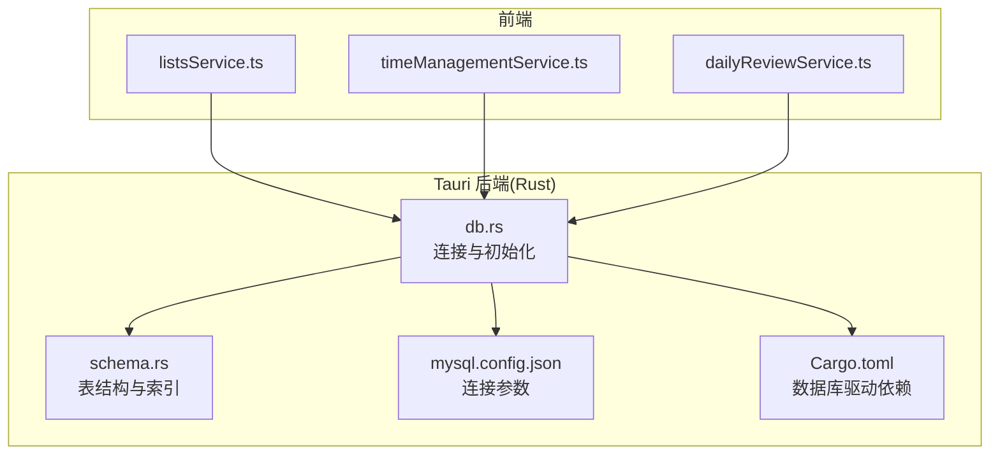
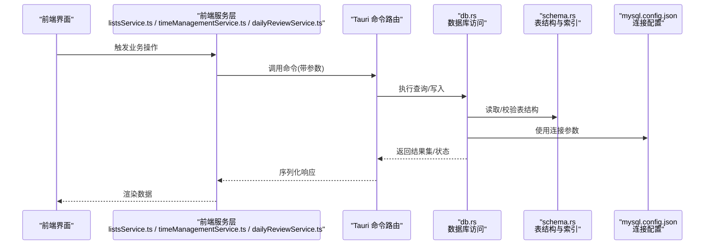
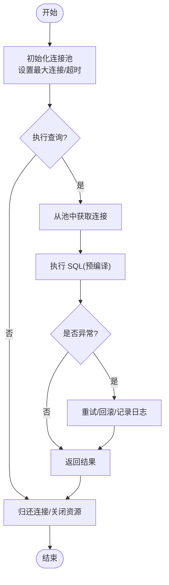
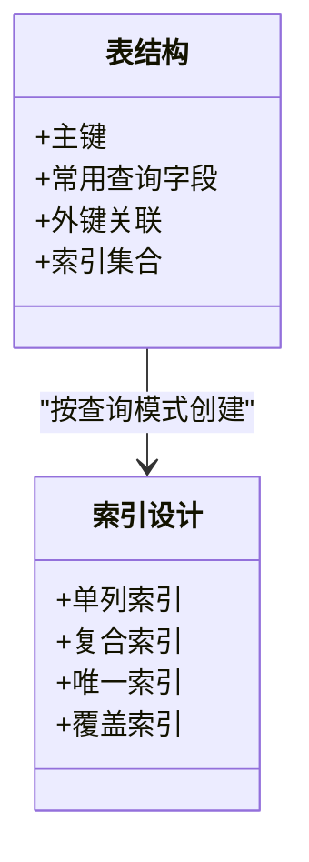
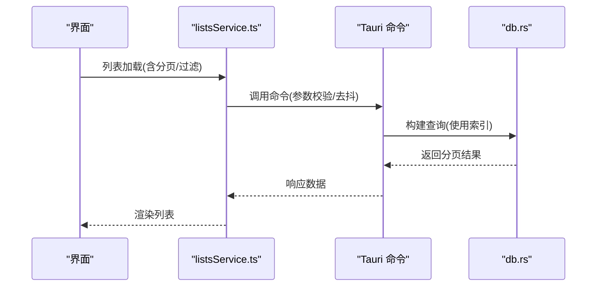
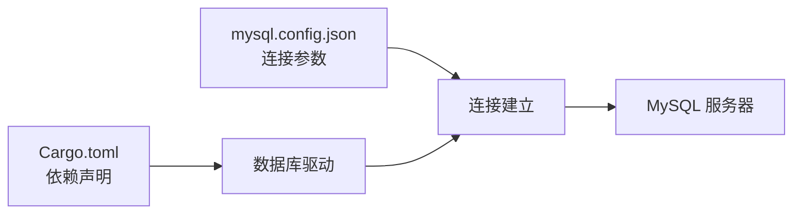

# 性能优化

<cite>
**本文引用的文件**   
- [src-tauri/src/db.rs](file://src-tauri/src/db.rs)
- [src-tauri/src/schema.rs](file://src-tauri/src/schema.rs)
- [src-tauri/Cargo.toml](file://src-tauri/Cargo.toml)
- [src-tauri/mysql.config.json](file://src-tauri/mysql.config.json)
- [src/features/lists/listsService.ts](file://src/features/lists/listsService.ts)
- [src/features/time-management/timeManagementService.ts](file://src/features/time-management/timeManagementService.ts)
- [src/features/daily-review/dailyReviewService.ts](file://src/features/daily-review/dailyReviewService.ts)
</cite>

## 目录
1. [简介](#简介)
2. [项目结构](#项目结构)
3. [核心组件](#核心组件)
4. [架构总览](#架构总览)
5. [详细组件分析](#详细组件分析)
6. [依赖关系分析](#依赖关系分析)
7. [性能考虑](#性能考虑)
8. [故障排查指南](#故障排查指南)
9. [结论](#结论)
10. [附录](#附录)

## 简介
本指南面向 FishWorker 的数据库性能优化，聚焦于查询优化、索引设计、慢查询诊断、批量操作与分页、缓存策略、连接池调优、内存与磁盘 I/O 优化、大数据量分库分表与读写分离、监控指标与基准测试方法、瓶颈定位工具，以及不同数据库引擎的性能特性对比与选型建议。文档基于仓库中 Rust 后端（Tauri）与前端服务层的实际实现进行梳理，并提供可落地的优化路径与图示说明。

## 项目结构
FishWorker 采用 Tauri 桌面应用架构：前端 TypeScript/React 通过 Tauri 命令调用 Rust 后端，Rust 层负责数据库访问与业务逻辑。数据库相关的关键代码集中在 src-tauri 目录，包括数据库初始化、Schema 定义、MySQL 配置与 Cargo 依赖等；前端各功能模块通过 Service 层发起数据请求。

**图表来源**
- [src/features/lists/listsService.ts](file://src/features/lists/listsService.ts)
- [src/features/time-management/timeManagementService.ts](file://src/features/time-management/timeManagementService.ts)
- [src/features/daily-review/dailyReviewService.ts](file://src/features/daily-review/dailyReviewService.ts)
- [src-tauri/src/db.rs](file://src-tauri/src/db.rs)
- [src-tauri/src/schema.rs](file://src-tauri/src/schema.rs)
- [src-tauri/mysql.config.json](file://src-tauri/mysql.config.json)
- [src-tauri/Cargo.toml](file://src-tauri/Cargo.toml)

**章节来源**
- [src-tauri/src/db.rs](file://src-tauri/src/db.rs)
- [src-tauri/src/schema.rs](file://src-tauri/src/schema.rs)
- [src-tauri/Cargo.toml](file://src-tauri/Cargo.toml)
- [src-tauri/mysql.config.json](file://src-tauri/mysql.config.json)
- [src/features/lists/listsService.ts](file://src/features/lists/listsService.ts)
- [src/features/time-management/timeManagementService.ts](file://src/features/time-management/timeManagementService.ts)
- [src/features/daily-review/dailyReviewService.ts](file://src/features/daily-review/dailyReviewService.ts)

## 核心组件
- 数据库连接与初始化：负责建立与 MySQL 的连接、执行迁移或建表、提供统一的数据访问入口。
- 模式与索引定义：集中管理表结构、字段类型、约束与索引，确保查询路径高效。
- 前端服务层：封装对 Tauri 命令的调用，组织请求参数与响应处理，便于在业务侧复用。

**章节来源**
- [src-tauri/src/db.rs](file://src-tauri/src/db.rs)
- [src-tauri/src/schema.rs](file://src-tauri/src/schema.rs)
- [src/features/lists/listsService.ts](file://src/features/lists/listsService.ts)
- [src/features/time-management/timeManagementService.ts](file://src/features/time-management/timeManagementService.ts)
- [src/features/daily-review/dailyReviewService.ts](file://src/features/daily-review/dailyReviewService.ts)

## 架构总览
下图展示了从前端到后端的典型数据流，包括请求进入、命令路由、数据库访问与返回结果的过程。

**图表来源**
- [src/features/lists/listsService.ts](file://src/features/lists/listsService.ts)
- [src/features/time-management/timeManagementService.ts](file://src/features/time-management/timeManagementService.ts)
- [src/features/daily-review/dailyReviewService.ts](file://src/features/daily-review/dailyReviewService.ts)
- [src-tauri/src/db.rs](file://src-tauri/src/db.rs)
- [src-tauri/src/schema.rs](file://src-tauri/src/schema.rs)
- [src-tauri/mysql.config.json](file://src-tauri/mysql.config.json)

## 详细组件分析

### 数据库连接与初始化(db.rs)
- 职责：建立 MySQL 连接、执行必要的初始化流程、暴露统一的查询与写入接口。
- 优化要点：
  - 连接池大小与超时：根据并发请求数与平均延迟调整最大连接数、空闲连接保留时间、连接获取超时。
  - 事务批量化：将多次写操作合并为单事务，减少提交次数与网络往返。
  - 预编译语句：避免重复解析 SQL，提升执行效率。
  - 错误重试与退避：对瞬态错误（如锁等待、连接抖动）实施指数退避重试。
  - 资源清理：确保连接释放与关闭，防止泄漏。

**图表来源**
- [src-tauri/src/db.rs](file://src-tauri/src/db.rs)

**章节来源**
- [src-tauri/src/db.rs](file://src-tauri/src/db.rs)

### 模式与索引(schema.rs)
- 职责：定义表结构、字段类型、主键与外键约束、索引与唯一性约束。
- 优化要点：
  - 复合索引设计：遵循最左前缀原则，覆盖高频查询条件组合。
  - 选择性高的列优先：区分度高的列更适合做索引。
  - 避免过度索引：写放大与存储开销需权衡。
  - 统计信息更新：定期 ANALYZE 以优化查询计划。
  - 分区与归档：对历史数据进行分区或归档，降低热点表体积。

**图表来源**
- [src-tauri/src/schema.rs](file://src-tauri/src/schema.rs)

**章节来源**
- [src-tauri/src/schema.rs](file://src-tauri/src/schema.rs)

### 前端服务层(listsService.ts / timeManagementService.ts / dailyReviewService.ts)
- 职责：封装 Tauri 命令调用，组织请求参数、分页参数、过滤条件与排序规则。
- 优化要点：
  - 分页参数标准化：page、pageSize、offset/limit 明确化，避免全表扫描。
  - 批量操作：合并多次写入为一次批量提交，减少网络与事务开销。
  - 去抖与节流：对高频输入（搜索、筛选）进行防抖，降低无效请求。
  - 缓存命中：对只读且变化不频繁的数据进行本地缓存，减少后端压力。

**图表来源**
- [src/features/lists/listsService.ts](file://src/features/lists/listsService.ts)
- [src/features/time-management/timeManagementService.ts](file://src/features/time-management/timeManagementService.ts)
- [src/features/daily-review/dailyReviewService.ts](file://src/features/daily-review/dailyReviewService.ts)
- [src-tauri/src/db.rs](file://src-tauri/src/db.rs)

**章节来源**
- [src/features/lists/listsService.ts](file://src/features/lists/listsService.ts)
- [src/features/time-management/timeManagementService.ts](file://src/features/time-management/timeManagementService.ts)
- [src/features/daily-review/dailyReviewService.ts](file://src/features/daily-review/dailyReviewService.ts)

## 依赖关系分析
- 外部依赖：Cargo.toml 声明了数据库驱动与相关库，影响连接池实现、线程模型与性能特征。
- 配置文件：mysql.config.json 提供连接参数（主机、端口、用户、密码、数据库名、SSL 等），直接影响连接建立与稳定性。
- 前后端耦合：前端 Service 层通过 Tauri 命令与 Rust 后端交互，任何接口变更需同步更新两端。

**图表来源**
- [src-tauri/Cargo.toml](file://src-tauri/Cargo.toml)
- [src-tauri/mysql.config.json](file://src-tauri/mysql.config.json)

**章节来源**
- [src-tauri/Cargo.toml](file://src-tauri/Cargo.toml)
- [src-tauri/mysql.config.json](file://src-tauri/mysql.config.json)

## 性能考虑
- 查询优化策略
  - 索引设计原则：选择高选择性列，合理使用复合索引，避免冗余索引。
  - 查询计划分析：使用 EXPLAIN 查看执行计划，关注全表扫描、临时表、文件排序等。
  - 慢查询诊断：开启慢查询日志，结合采样与阈值分析，定位热点 SQL。
- 批量操作优化
  - 合并写入：使用 INSERT ... VALUES(...) 或批量 API，减少事务边界。
  - 分批提交：大事务拆分为多批次，控制锁持有时间与内存占用。
- 分页查询设计
  - 游标分页：基于有序主键或更新时间戳，避免深分页带来的性能问题。
  - 限制返回字段：仅选取必要列，减少网络传输与反序列化开销。
- 缓存策略实现
  - 多级缓存：前端本地缓存 + 后端内存缓存，提高命中率。
  - 失效策略：基于时间或事件驱动的失效机制，保证一致性。
- 连接池调优
  - 最大连接数：根据 CPU 核数与 IO 能力估算，避免过多上下文切换。
  - 超时与重试：合理设置获取连接超时、查询超时与重试退避。
- 内存使用优化
  - 对象复用：避免频繁分配与释放，重用缓冲区与连接。
  - 流式处理：对大结果集采用迭代器或流式读取，降低峰值内存。
- 磁盘 I/O 提升
  - 顺序写入：批量插入尽量顺序化，减少随机写放大。
  - 预写日志：启用 WAL 并合理配置 fsync 策略，平衡一致性与性能。
- 大数据量场景
  - 分库分表：按用户 ID 或时间范围水平拆分，降低单表规模。
  - 读写分离：主库写、从库读，扩展读能力，注意最终一致性与延迟。
- 监控指标与基准测试
  - 关键指标：QPS、P95/P99 延迟、连接池利用率、锁等待、缓冲命中率。
  - 基准方法：压测脚本模拟真实负载，逐步增加并发与数据量，观察拐点。
- 瓶颈定位工具
  - 数据库侧：EXPLAIN、慢查询日志、性能模式视图。
  - 系统侧：CPU/内存/IO 监控、火焰图、网络抓包。
- 数据库引擎对比与选型
  - InnoDB vs MyISAM：InnoDB 支持事务与行级锁，适合 OLTP；MyISAM 简单但无事务。
  - 新引擎评估：考虑 RocksDB/SQLite 等嵌入式引擎在桌面场景的适用性。

[本节为通用指导，不直接分析具体文件]

## 故障排查指南
- 常见问题
  - 连接失败：检查 mysql.config.json 中的主机、端口、认证信息与防火墙。
  - 查询缓慢：使用 EXPLAIN 分析执行计划，确认索引命中与扫描方式。
  - 死锁与锁等待：查看锁等待链，缩短事务，避免长事务持有锁。
  - 内存溢出：检查大结果集处理，改用流式或分页。
- 诊断步骤
  - 打开慢查询日志，收集样本 SQL。
  - 使用 EXPLAIN 分析热点查询，必要时添加或调整索引。
  - 监控连接池与系统资源，识别瓶颈点。
  - 复现问题并逐步缩小范围，定位根因。

**章节来源**
- [src-tauri/mysql.config.json](file://src-tauri/mysql.config.json)
- [src-tauri/src/db.rs](file://src-tauri/src/db.rs)

## 结论
通过对连接池、索引设计、查询计划、批量与分页、缓存、I/O 与内存、分库分表与读写分离的系统性优化，FishWorker 可在大数据量与高并发场景下保持稳定的性能表现。建议持续监控关键指标，结合基准测试与慢查询分析，形成闭环优化机制。

[本节为总结，不直接分析具体文件]

## 附录
- 术语解释
  - 最左前缀：复合索引的匹配顺序必须从第一个列开始连续匹配。
  - 覆盖索引：查询所需列全部在索引中，无需回表。
  - 游标分页：基于有序键值进行下一页定位，避免 OFFSET 深分页。
- 参考实践
  - 索引设计清单：高选择性列、复合索引覆盖常见查询、避免冗余。
  - 分页规范：默认 pageSize、上限限制、游标推荐。
  - 监控看板：QPS、延迟分布、连接池、锁等待、缓冲命中率。

[本节为补充内容，不直接分析具体文件]