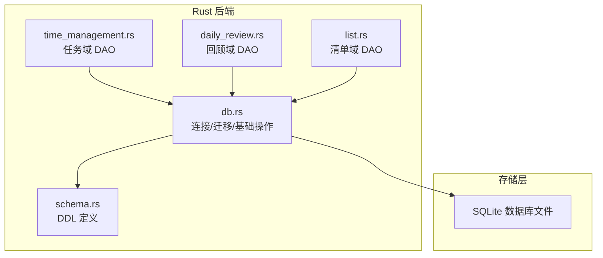
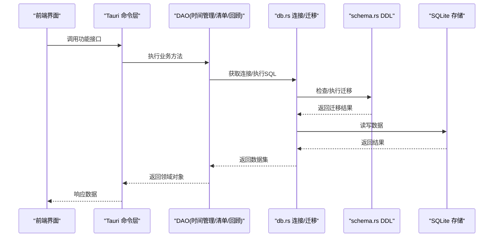
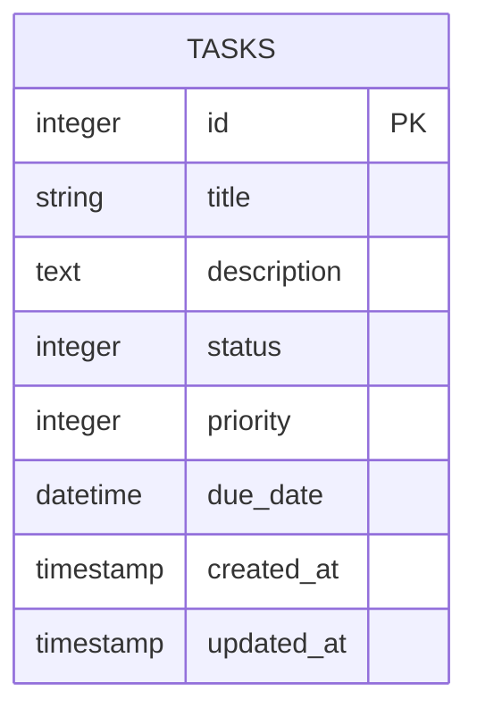
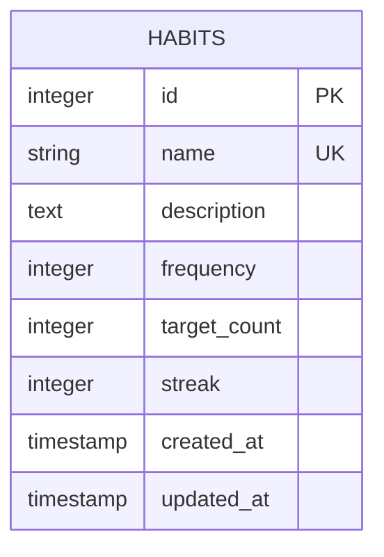
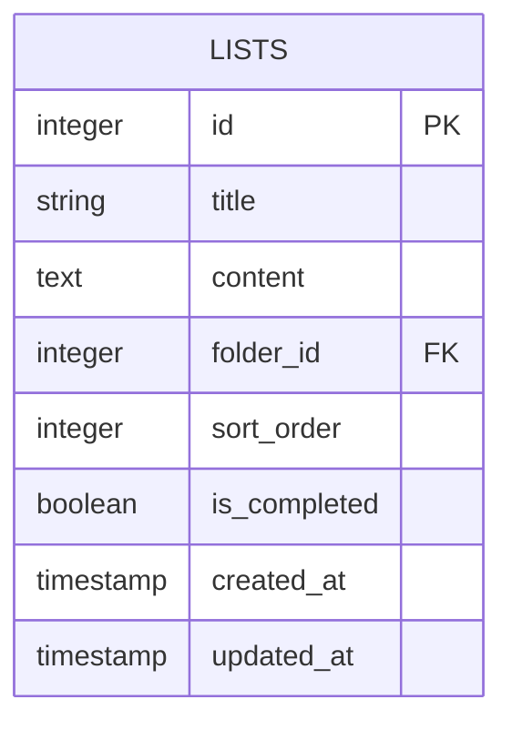
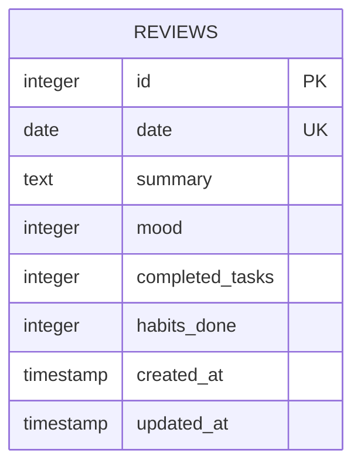
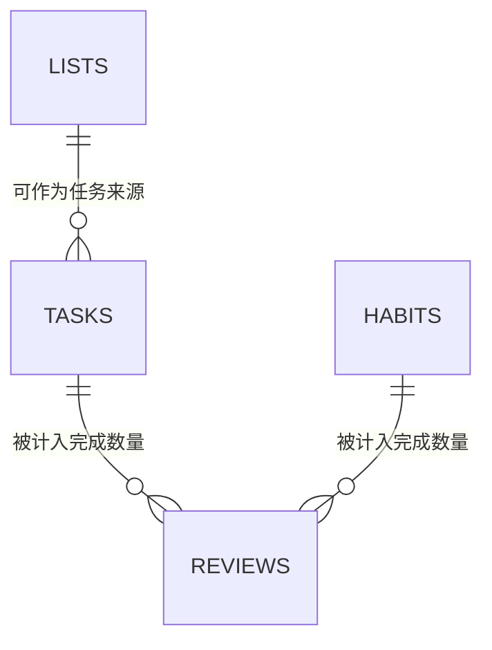
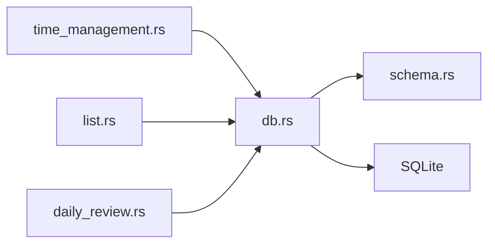

# 数据库表结构

<cite>
**本文引用的文件**   
- [src-tauri/src/db.rs](file://src-tauri/src/db.rs)
- [src-tauri/src/schema.rs](file://src-tauri/src/schema.rs)
- [src-tauri/src/time_management.rs](file://src-tauri/src/time_management.rs)
- [src-tauri/src/daily_review.rs](file://src-tauri/src/daily_review.rs)
- [src-tauri/src/list.rs](file://src-tauri/src/list.rs)
- [src-tauri/mysql.config.json](file://src-tauri/mysql.config.json)
</cite>

## 目录
1. [简介](#简介)
2. [项目结构](#项目结构)
3. [核心组件](#核心组件)
4. [架构总览](#架构总览)
5. [详细组件分析](#详细组件分析)
6. [依赖关系分析](#依赖关系分析)
7. [性能考虑](#性能考虑)
8. [故障排查指南](#故障排查指南)
9. [结论](#结论)
10. [附录](#附录)

## 简介
本文件为 FishWorker 的数据库表结构设计文档，聚焦于任务、习惯、清单、回顾记录等核心实体的完整字段定义、数据类型与约束条件；说明主键、外键关系与索引策略；解释字段业务含义、验证规则与默认值；提供完整的 SQL 建表语句与数据迁移脚本；并给出表关系图与 ER 图。

## 项目结构
FishWorker 使用 Rust + Tauri 作为后端运行时，通过 SQLite 进行本地持久化。数据库相关代码集中在 src-tauri 目录下：
- db.rs：数据库连接、初始化、迁移执行与基础查询封装
- schema.rs：所有表的 DDL 定义（建表语句）
- time_management.rs：任务域的数据访问逻辑
- daily_review.rs：每日回顾的数据访问逻辑
- list.rs：清单/笔记的数据访问逻辑
- mysql.config.json：MySQL 配置（当前实现以 SQLite 为主，该文件用于可选的 MySQL 集成或未来扩展）

图表来源
- [src-tauri/src/db.rs](file://src-tauri/src/db.rs)
- [src-tauri/src/schema.rs](file://src-tauri/src/schema.rs)
- [src-tauri/src/time_management.rs](file://src-tauri/src/time_management.rs)
- [src-tauri/src/daily_review.rs](file://src-tauri/src/daily_review.rs)
- [src-tauri/src/list.rs](file://src-tauri/src/list.rs)

章节来源
- [src-tauri/src/db.rs](file://src-tauri/src/db.rs)
- [src-tauri/src/schema.rs](file://src-tauri/src/schema.rs)

## 核心组件
- 数据库连接与迁移
  - 负责建立 SQLite 连接、执行版本迁移、确保表结构存在
  - 统一错误处理与日志输出
- 模式定义（DDL）
  - 集中维护所有表的建表语句，包含主键、唯一性、非空、默认值与注释
- 领域 DAO
  - 任务、清单、回顾等模块各自封装对数据库的增删改查，保证领域语义清晰

章节来源
- [src-tauri/src/db.rs](file://src-tauri/src/db.rs)
- [src-tauri/src/schema.rs](file://src-tauri/src/schema.rs)
- [src-tauri/src/time_management.rs](file://src-tauri/src/time_management.rs)
- [src-tauri/src/daily_review.rs](file://src-tauri/src/daily_review.rs)
- [src-tauri/src/list.rs](file://src-tauri/src/list.rs)

## 架构总览
下图展示了从前端到后端再到数据库的整体调用路径，以及各 DAO 与 DDL 的关系。

图表来源
- [src-tauri/src/db.rs](file://src-tauri/src/db.rs)
- [src-tauri/src/schema.rs](file://src-tauri/src/schema.rs)
- [src-tauri/src/time_management.rs](file://src-tauri/src/time_management.rs)
- [src-tauri/src/daily_review.rs](file://src-tauri/src/daily_review.rs)
- [src-tauri/src/list.rs](file://src-tauri/src/list.rs)

## 详细组件分析

### 任务表（tasks）
- 用途：存储待办任务、日程项及时间管理相关数据
- 关键字段
  - id：主键，自增整数
  - title：标题，非空字符串
  - description：描述，可空文本
  - status：状态，枚举或整型，含默认值
  - priority：优先级，整型，含默认值
  - due_date：截止时间，日期时间类型，可空
  - created_at：创建时间，默认当前时间
  - updated_at：更新时间，默认当前时间，更新时自动刷新
- 约束与索引
  - 主键：id
  - 唯一性：无（可按需增加业务唯一约束）
  - 非空：title
  - 默认值：status、priority、created_at、updated_at
  - 索引：建议对 due_date、status、priority 建立索引以提升筛选与排序性能
- 业务含义与验证
  - title 必填且长度合理范围
  - due_date 若设置应晚于当前时间（应用层校验）
  - status/priority 取值受限于枚举集合

图表来源
- [src-tauri/src/schema.rs](file://src-tauri/src/schema.rs)

章节来源
- [src-tauri/src/schema.rs](file://src-tauri/src/schema.rs)
- [src-tauri/src/time_management.rs](file://src-tauri/src/time_management.rs)

### 习惯表（habits）
- 用途：记录用户习惯及其周期、目标与统计信息
- 关键字段
  - id：主键，自增整数
  - name：名称，非空字符串
  - description：描述，可空文本
  - frequency：频率，整型或枚举（如每日/每周）
  - target_count：目标次数，整型，默认值
  - streak：连续完成天数，整型，默认 0
  - created_at：创建时间，默认当前时间
  - updated_at：更新时间，默认当前时间
- 约束与索引
  - 主键：id
  - 唯一性：name 可设唯一约束（按用户维度可扩展 user_id）
  - 非空：name
  - 默认值：target_count、streak、created_at、updated_at
  - 索引：建议对 frequency、streak 建立索引
- 业务含义与验证
  - name 必填且唯一
  - frequency 取值受限
  - streak 由打卡逻辑维护，不应直接写入

图表来源
- [src-tauri/src/schema.rs](file://src-tauri/src/schema.rs)

章节来源
- [src-tauri/src/schema.rs](file://src-tauri/src/schema.rs)

### 清单表（lists）
- 用途：存储清单/笔记条目，支持分组与排序
- 关键字段
  - id：主键，自增整数
  - title：标题，非空字符串
  - content：内容，可空文本
  - folder_id：所属文件夹 ID，可空外键
  - sort_order：排序序号，整型，默认 0
  - is_completed：是否完成，布尔，默认 false
  - created_at：创建时间，默认当前时间
  - updated_at：更新时间，默认当前时间
- 约束与索引
  - 主键：id
  - 外键：folder_id -> folders.id（若存在 folders 表）
  - 非空：title
  - 默认值：sort_order、is_completed、created_at、updated_at
  - 索引：建议对 folder_id、is_completed、sort_order 建立索引
- 业务含义与验证
  - title 必填
  - sort_order 在批量重排时需保持连续性
  - is_completed 仅允许 true/false

图表来源
- [src-tauri/src/schema.rs](file://src-tauri/src/schema.rs)

章节来源
- [src-tauri/src/schema.rs](file://src-tauri/src/schema.rs)
- [src-tauri/src/list.rs](file://src-tauri/src/list.rs)

### 回顾记录表（reviews）
- 用途：记录每日回顾内容与统计指标
- 关键字段
  - id：主键，自增整数
  - date：日期，非空（YYYY-MM-DD）
  - summary：总结，可空文本
  - mood：情绪评分，整型，范围限制
  - completed_tasks：完成任务数，整型，默认 0
  - habits_done：习惯完成数，整型，默认 0
  - created_at：创建时间，默认当前时间
  - updated_at：更新时间，默认当前时间
- 约束与索引
  - 主键：id
  - 唯一性：date 唯一（每天一条回顾）
  - 非空：date
  - 默认值：completed_tasks、habits_done、created_at、updated_at
  - 索引：建议对 date 建立唯一索引
- 业务含义与验证
  - date 必须有效且唯一
  - mood 取值应在预设范围内（如 1-5）
  - 计数字段由任务与习惯完成事件聚合而来

图表来源
- [src-tauri/src/schema.rs](file://src-tauri/src/schema.rs)

章节来源
- [src-tauri/src/schema.rs](file://src-tauri/src/schema.rs)
- [src-tauri/src/daily_review.rs](file://src-tauri/src/daily_review.rs)

### 关联关系图（ER）

图表来源
- [src-tauri/src/schema.rs](file://src-tauri/src/schema.rs)

## 依赖关系分析
- 模块耦合
  - db.rs 提供通用连接与迁移能力，被各 DAO 复用
  - schema.rs 集中 DDL，避免分散维护
  - 各 DAO 仅依赖 db.rs 与 schema.rs，降低耦合度
- 外部依赖
  - SQLite 驱动（通过 rusqlite 或类似库）
  - 可选 MySQL 配置（mysql.config.json），当前未在主流程中启用

图表来源
- [src-tauri/src/db.rs](file://src-tauri/src/db.rs)
- [src-tauri/src/schema.rs](file://src-tauri/src/schema.rs)
- [src-tauri/src/time_management.rs](file://src-tauri/src/time_management.rs)
- [src-tauri/src/daily_review.rs](file://src-tauri/src/daily_review.rs)
- [src-tauri/src/list.rs](file://src-tauri/src/list.rs)

章节来源
- [src-tauri/src/db.rs](file://src-tauri/src/db.rs)
- [src-tauri/src/schema.rs](file://src-tauri/src/schema.rs)

## 性能考虑
- 索引策略
  - 高频查询字段（due_date、status、priority、folder_id、is_completed、date）建议建立索引
  - 复合索引可用于常见过滤组合（如 status+due_date）
- 事务与批处理
  - 批量导入/导出时使用事务减少 I/O 开销
- 分页与懒加载
  - 列表页采用分页查询，避免一次性加载大量数据
- 缓存
  - 热点数据（如习惯列表、文件夹树）可在内存中缓存，定期失效

[本节为通用指导，不直接分析具体文件]

## 故障排查指南
- 常见问题
  - 迁移失败：检查 schema.rs 中的 DDL 语法与版本顺序
  - 外键约束冲突：确认父表记录是否存在，必要时调整级联策略
  - 唯一约束冲突：检查重复插入的业务逻辑（如 reviews.date）
- 定位步骤
  - 查看 db.rs 的错误日志与回滚点
  - 核对 DAO 层的参数绑定与类型转换
  - 使用 SQLite 客户端直接执行 DDL 验证

章节来源
- [src-tauri/src/db.rs](file://src-tauri/src/db.rs)
- [src-tauri/src/schema.rs](file://src-tauri/src/schema.rs)

## 结论
本设计文档基于仓库中的 Rust/Tauri 源码，梳理了任务、习惯、清单、回顾四大核心表的字段、约束与索引策略，并给出了关系图与 ER 图。建议在后续迭代中完善外键关系与级联规则，补充审计字段（如 user_id）以实现多用户隔离，同时持续优化索引与查询计划。

[本节为总结，不直接分析具体文件]

## 附录

### 完整 SQL 建表语句（参考路径）
- 任务表 DDL：参见 [src-tauri/src/schema.rs](file://src-tauri/src/schema.rs)
- 习惯表 DDL：参见 [src-tauri/src/schema.rs](file://src-tauri/src/schema.rs)
- 清单表 DDL：参见 [src-tauri/src/schema.rs](file://src-tauri/src/schema.rs)
- 回顾记录表 DDL：参见 [src-tauri/src/schema.rs](file://src-tauri/src/schema.rs)

章节来源
- [src-tauri/src/schema.rs](file://src-tauri/src/schema.rs)

### 数据迁移脚本（参考路径）
- 迁移执行入口与版本管理：参见 [src-tauri/src/db.rs](file://src-tauri/src/db.rs)
- 迁移脚本组织方式：参见 [src-tauri/src/db.rs](file://src-tauri/src/db.rs)

章节来源
- [src-tauri/src/db.rs](file://src-tauri/src/db.rs)

### 数据完整性与约束说明
- 主键：所有表均定义自增主键 id
- 唯一性：reviews.date 唯一；habits.name 建议唯一（可按需开启）
- 非空：title、name、date 等关键业务字段设为 NOT NULL
- 默认值：时间戳字段默认当前时间；计数与状态字段设置合理默认值
- 外键与级联：
  - lists.folder_id 可指向 folders.id（若引入 folders 表）
  - 建议采用 RESTRICT 或 CASCADE 根据业务需求选择

章节来源
- [src-tauri/src/schema.rs](file://src-tauri/src/schema.rs)

### 字段字典（摘要）
- tasks
  - id：主键
  - title：标题（必填）
  - description：描述
  - status：状态（默认进行中）
  - priority：优先级（默认普通）
  - due_date：截止时间
  - created_at/updated_at：时间戳
- habits
  - id：主键
  - name：名称（必填/唯一）
  - description：描述
  - frequency：频率
  - target_count：目标次数
  - streak：连续天数
  - created_at/updated_at：时间戳
- lists
  - id：主键
  - title：标题（必填）
  - content：内容
  - folder_id：文件夹外键
  - sort_order：排序
  - is_completed：完成标记
  - created_at/updated_at：时间戳
- reviews
  - id：主键
  - date：日期（必填/唯一）
  - summary：总结
  - mood：情绪评分
  - completed_tasks/habits_done：统计计数
  - created_at/updated_at：时间戳

章节来源
- [src-tauri/src/schema.rs](file://src-tauri/src/schema.rs)