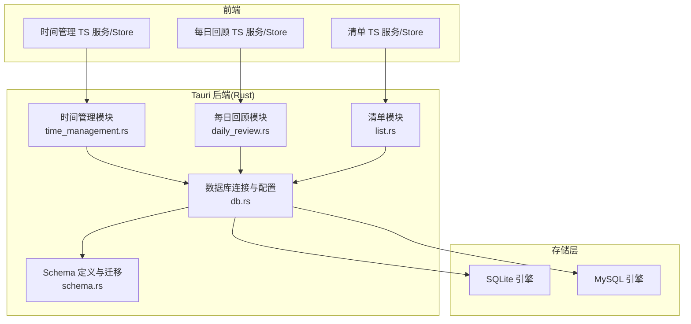
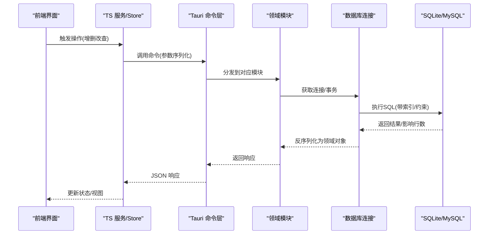
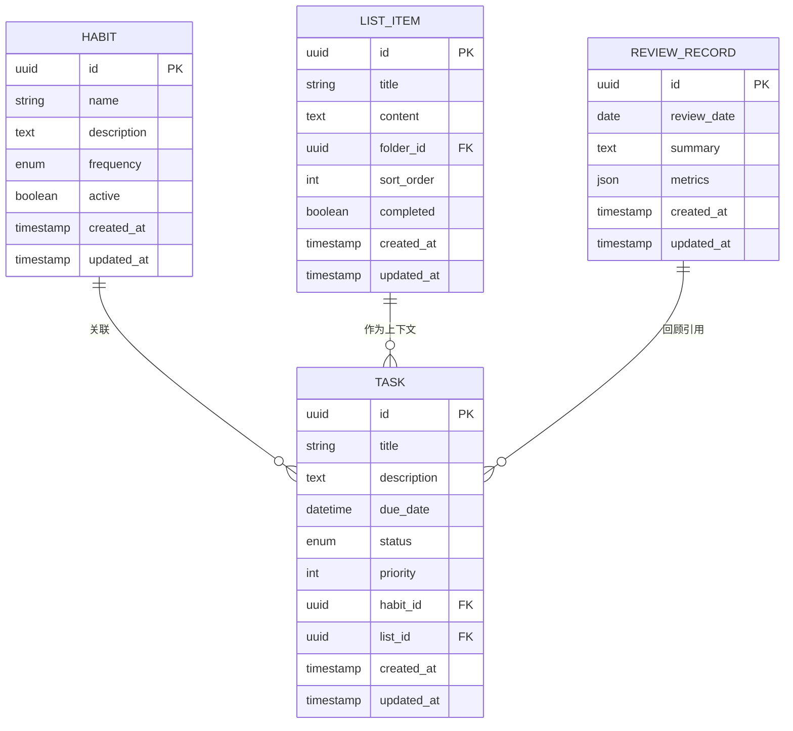
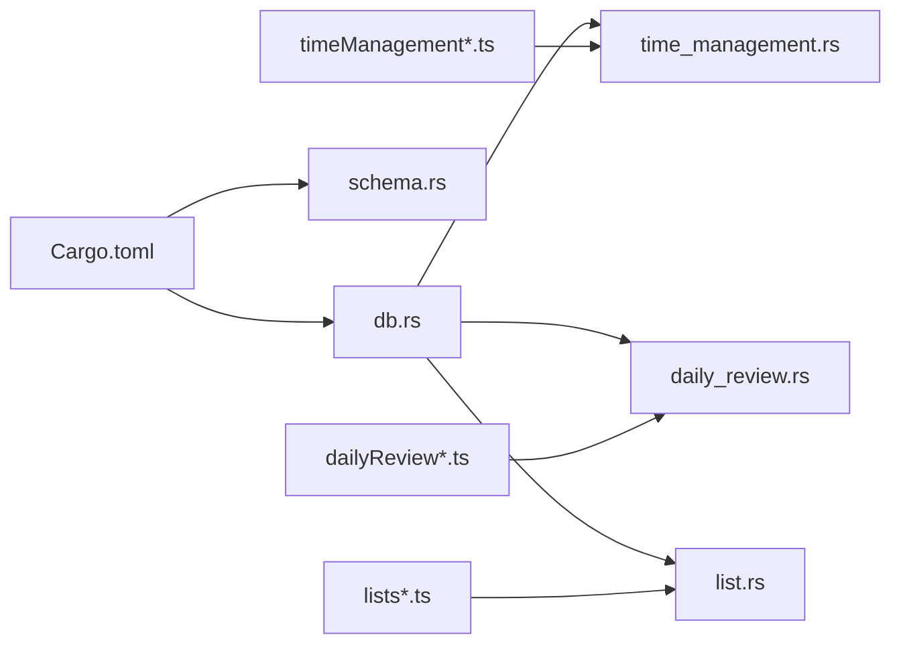

# 数据库设计

<cite>
**本文引用的文件**
- [src-tauri/src/db.rs](file://src-tauri/src/db.rs)
- [src-tauri/src/schema.rs](file://src-tauri/src/schema.rs)
- [src-tauri/src/time_management.rs](file://src-tauri/src/time_management.rs)
- [src-tauri/src/daily_review.rs](file://src-tauri/src/daily_review.rs)
- [src-tauri/src/list.rs](file://src-tauri/src/list.rs)
- [src-tauri/Cargo.toml](file://src-tauri/Cargo.toml)
- [src-tauri/mysql.config.json](file://src-tauri/mysql.config.json)
- [src/features/time-management/timeManagementService.ts](file://src/features/time-management/timeManagementService.ts)
- [src/features/time-management/timeManagementStore.ts](file://src/features/time-management/timeManagementStore.ts)
- [src/features/time-management/timeManagementTypes.ts](file://src/features/time-management/timeManagementTypes.ts)
- [src/features/daily-review/dailyReviewService.ts](file://src/features/daily-review/dailyReviewService.ts)
- [src/features/daily-review/dailyReviewStore.ts](file://src/features/daily-review/dailyReviewStore.ts)
- [src/features/daily-review/dailyReviewTypes.ts](file://src/features/daily-review/dailyReviewTypes.ts)
- [src/features/lists/listsService.ts](file://src/features/lists/listsService.ts)
- [src/features/lists/listsStore.ts](file://src/features/lists/listsStore.ts)
- [src/features/lists/listsTypes.ts](file://src/features/lists/listsTypes.ts)
</cite>

## 目录
1. [引言](#引言)
2. [项目结构](#项目结构)
3. [核心组件](#核心组件)
4. [架构总览](#架构总览)
5. [详细组件分析](#详细组件分析)
6. [依赖分析](#依赖分析)
7. [性能考虑](#性能考虑)
8. [故障排查指南](#故障排查指南)
9. [结论](#结论)
10. [附录](#附录)

## 引言
本设计文档聚焦 FishWorker 的数据库层，目标是系统化阐述 SQLite 与 MySQL 双数据库支持架构、表结构与索引策略、数据迁移机制、连接与事务管理、错误恢复与备份策略，以及数据访问层的设计模式（CRUD 封装、查询优化、缓存策略）。同时给出初始化脚本建议、版本迁移指南、性能调优建议、数据完整性约束与安全隐私保护措施。读者无需深入 Rust 或前端细节即可理解整体设计与落地方案。

## 项目结构
FishWorker 采用 Tauri 架构：前端 TypeScript/React 通过 Tauri 命令调用后端 Rust 服务，Rust 侧负责数据库连接、Schema 管理与业务逻辑。数据库相关代码集中在 src-tauri 中，包括数据库连接与配置、Schema 定义、领域模块（时间管理、每日回顾、清单）等。

图表来源
- [src-tauri/src/db.rs](file://src-tauri/src/db.rs)
- [src-tauri/src/schema.rs](file://src-tauri/src/schema.rs)
- [src-tauri/src/time_management.rs](file://src-tauri/src/time_management.rs)
- [src-tauri/src/daily_review.rs](file://src-tauri/src/daily_review.rs)
- [src-tauri/src/list.rs](file://src-tauri/src/list.rs)

章节来源
- [src-tauri/src/db.rs](file://src-tauri/src/db.rs)
- [src-tauri/src/schema.rs](file://src-tauri/src/schema.rs)
- [src-tauri/src/time_management.rs](file://src-tauri/src/time_management.rs)
- [src-tauri/src/daily_review.rs](file://src-tauri/src/daily_review.rs)
- [src-tauri/src/list.rs](file://src-tauri/src/list.rs)

## 核心组件
- 数据库连接与配置：统一抽象 SQLite 与 MySQL 的连接、选择与切换；提供连接池、超时、重试等能力。
- Schema 与迁移：集中定义表结构、索引、外键与约束；提供版本化迁移与回滚策略。
- 领域模块：时间管理（任务）、每日回顾（回顾记录）、清单（列表项）三大模块分别封装 CRUD 与复杂查询。
- 前端对接：TS 服务与 Store 通过 Tauri 命令与后端交互，类型定义对齐后端模型。

章节来源
- [src-tauri/src/db.rs](file://src-tauri/src/db.rs)
- [src-tauri/src/schema.rs](file://src-tauri/src/schema.rs)
- [src-tauri/src/time_management.rs](file://src-tauri/src/time_management.rs)
- [src-tauri/src/daily_review.rs](file://src-tauri/src/daily_review.rs)
- [src-tauri/src/list.rs](file://src-tauri/src/list.rs)

## 架构总览
下图展示从前端到数据库的整体流程，包括命令路由、领域处理、连接选择与 SQL 执行路径。

图表来源
- [src-tauri/src/db.rs](file://src-tauri/src/db.rs)
- [src-tauri/src/time_management.rs](file://src-tauri/src/time_management.rs)
- [src-tauri/src/daily_review.rs](file://src-tauri/src/daily_review.rs)
- [src-tauri/src/list.rs](file://src-tauri/src/list.rs)

## 详细组件分析

### 数据模型与关系图
围绕“任务、习惯、清单、回顾记录”四大实体，结合领域模块的职责，给出如下概念性 ER 图。注意：该图为概念建模，用于指导实际表结构设计，具体字段以各模块实现为准。

说明
- 任务可关联习惯与清单条目，便于在习惯驱动的任务流与清单上下文中组织工作。
- 回顾记录汇总周期内的关键指标与总结，并可反向引用任务进行复盘。
- 字段类型与约束需根据所选数据库（SQLite/MySQL）做适配，例如 UUID 在 SQLite 中以字符串存储，在 MySQL 中使用原生 UUID 类型。

章节来源
- [src-tauri/src/time_management.rs](file://src-tauri/src/time_management.rs)
- [src-tauri/src/daily_review.rs](file://src-tauri/src/daily_review.rs)
- [src-tauri/src/list.rs](file://src-tauri/src/list.rs)

### 数据库连接与配置（SQLite/MySQL 双引擎）
- 连接抽象：统一接口屏蔽底层差异，对外暴露统一的查询、事务、批处理 API。
- 配置来源：优先读取配置文件（如 mysql.config.json），其次环境变量；默认使用 SQLite 本地文件。
- 连接池：为高并发场景启用连接池，设置最大连接数、空闲超时、健康检查间隔。
- 引擎切换：运行时根据配置动态选择 SQLite 或 MySQL；支持热切换与优雅降级。
- 安全：敏感信息（密码、DSN）不硬编码，使用加密存储或系统密钥管理服务。

章节来源
- [src-tauri/src/db.rs](file://src-tauri/src/db.rs)
- [src-tauri/mysql.config.json](file://src-tauri/mysql.config.json)

### Schema 与迁移机制
- 版本化迁移：每个迁移包含版本号、向上/向下脚本；启动时校验当前版本并顺序应用缺失迁移。
- 幂等性：DDL/DML 均具备幂等特性，避免重复执行导致异常。
- 回滚策略：对破坏性变更提供回滚脚本；失败时自动回滚至上一稳定版本。
- 约束一致性：外键、唯一索引、非空约束在迁移中声明，确保跨引擎一致。
- 兼容性：针对 SQLite 与 MySQL 的差异（如日期函数、窗口函数、JSON 支持）提供适配层。

章节来源
- [src-tauri/src/schema.rs](file://src-tauri/src/schema.rs)

### 领域模块：时间管理（任务）
- 职责：任务的创建、更新、删除、分页查询、按状态/优先级/截止日期筛选、批量操作。
- 事务：批量导入/导出、批量状态更新使用事务保证一致性。
- 索引：按状态、优先级、截止日期建立复合索引，加速常见查询。
- 缓存：热点任务列表可按用户维度短期缓存，减少重复查询。

章节来源
- [src-tauri/src/time_management.rs](file://src-tauri/src/time_management.rs)
- [src/features/time-management/timeManagementService.ts](file://src/features/time-management/timeManagementService.ts)
- [src/features/time-management/timeManagementStore.ts](file://src/features/time-management/timeManagementStore.ts)
- [src/features/time-management/timeManagementTypes.ts](file://src/features/time-management/timeManagementTypes.ts)

### 领域模块：每日回顾（回顾记录）
- 职责：按日生成回顾记录，聚合任务完成度、耗时统计、情绪评分等指标。
- 聚合查询：利用窗口函数与分组聚合计算趋势与对比；在 MySQL 上充分利用其优化器。
- 快照：定期生成回顾快照，降低实时聚合开销。
- 审计：保留变更记录，支持回溯与问题定位。

章节来源
- [src-tauri/src/daily_review.rs](file://src-tauri/src/daily_review.rs)
- [src/features/daily-review/dailyReviewService.ts](file://src/features/daily-review/dailyReviewService.ts)
- [src/features/daily-review/dailyReviewStore.ts](file://src/features/daily-review/dailyReviewStore.ts)
- [src/features/daily-review/dailyReviewTypes.ts](file://src/features/daily-review/dailyReviewTypes.ts)

### 领域模块：清单（列表项）
- 职责：清单条目的增删改查、排序、归档、批量移动/复制。
- 排序与重排：维护 sort_order 字段，使用事务保证排序一致性。
- 文件夹/分组：可选 folder_id 关联，支持层级结构。
- 软删除：通过标记字段实现软删除，便于恢复与审计。

章节来源
- [src-tauri/src/list.rs](file://src-tauri/src/list.rs)
- [src/features/lists/listsService.ts](file://src/features/lists/listsService.ts)
- [src/features/lists/listsStore.ts](file://src/features/lists/listsStore.ts)
- [src/features/lists/listsTypes.ts](file://src/features/lists/listsTypes.ts)

### 数据访问层设计模式
- 仓储模式：每个领域模块提供仓储接口，封装 CRUD 与复杂查询，隐藏 SQL 细节。
- 工厂模式：根据配置创建不同数据库连接实例（SQLite/MySQL）。
- 模板方法：通用查询逻辑（分页、过滤、排序）抽取为模板，子类按需覆盖。
- 适配器模式：针对不同数据库方言提供 SQL 片段适配器，屏蔽差异。
- 缓存策略：读多写少场景引入内存缓存（LRU），设置过期时间与失效策略。

章节来源
- [src-tauri/src/db.rs](file://src-tauri/src/db.rs)
- [src-tauri/src/schema.rs](file://src-tauri/src/schema.rs)
- [src-tauri/src/time_management.rs](file://src-tauri/src/time_management.rs)
- [src-tauri/src/daily_review.rs](file://src-tauri/src/daily_review.rs)
- [src-tauri/src/list.rs](file://src-tauri/src/list.rs)

### 事务处理与错误恢复
- 事务边界：明确读写分离，写操作包裹事务；长事务拆分为短事务提升吞吐。
- 重试与退避：网络抖动或锁冲突时指数退避重试，限制最大次数。
- 补偿操作：部分失败时执行补偿逻辑，保持最终一致性。
- 日志与追踪：记录关键 SQL 与错误堆栈，便于定位问题。

章节来源
- [src-tauri/src/db.rs](file://src-tauri/src/db.rs)

### 备份与恢复策略
- 增量备份：基于 WAL 模式（SQLite）或 binlog（MySQL）实现增量备份。
- 全量快照：定期全量快照，异地容灾存储。
- 恢复演练：定期演练恢复流程，验证备份有效性。
- 一致性：备份前提交未决事务，确保一致性点。

章节来源
- [src-tauri/src/db.rs](file://src-tauri/src/db.rs)

## 依赖分析
- 外部依赖：Cargo.toml 中声明数据库驱动（如 rusqlite、mysql_async 等）、ORM/查询构建器、连接池库。
- 内部耦合：领域模块依赖 db.rs 提供的连接与事务抽象；schema.rs 提供迁移与 DDL 能力。
- 前后端契约：TS 类型与后端模型保持一致，避免序列化/反序列化歧义。

图表来源
- [src-tauri/Cargo.toml](file://src-tauri/Cargo.toml)
- [src-tauri/src/db.rs](file://src-tauri/src/db.rs)
- [src-tauri/src/schema.rs](file://src-tauri/src/schema.rs)
- [src-tauri/src/time_management.rs](file://src-tauri/src/time_management.rs)
- [src-tauri/src/daily_review.rs](file://src-tauri/src/daily_review.rs)
- [src-tauri/src/list.rs](file://src-tauri/src/list.rs)
- [src/features/time-management/timeManagementService.ts](file://src/features/time-management/timeManagementService.ts)
- [src/features/time-management/timeManagementStore.ts](file://src/features/time-management/timeManagementStore.ts)
- [src/features/time-management/timeManagementTypes.ts](file://src/features/time-management/timeManagementTypes.ts)
- [src/features/daily-review/dailyReviewService.ts](file://src/features/daily-review/dailyReviewService.ts)
- [src/features/daily-review/dailyReviewStore.ts](file://src/features/daily-review/dailyReviewStore.ts)
- [src/features/daily-review/dailyReviewTypes.ts](file://src/features/daily-review/dailyReviewTypes.ts)
- [src/features/lists/listsService.ts](file://src/features/lists/listsService.ts)
- [src/features/lists/listsStore.ts](file://src/features/lists/listsStore.ts)
- [src/features/lists/listsTypes.ts](file://src/features/lists/listsTypes.ts)

章节来源
- [src-tauri/Cargo.toml](file://src-tauri/Cargo.toml)
- [src-tauri/src/db.rs](file://src-tauri/src/db.rs)
- [src-tauri/src/schema.rs](file://src-tauri/src/schema.rs)
- [src-tauri/src/time_management.rs](file://src-tauri/src/time_management.rs)
- [src-tauri/src/daily_review.rs](file://src-tauri/src/daily_review.rs)
- [src-tauri/src/list.rs](file://src-tauri/src/list.rs)

## 性能考虑
- 索引优化
  - 高频查询列建立单列索引；组合查询建立复合索引，遵循最左前缀原则。
  - 避免过度索引，权衡写入放大与空间占用。
  - 定期分析慢查询，调整索引与 SQL。
- 查询优化
  - 分页使用游标式分页替代 OFFSET 深翻页。
  - 选择性投影，仅返回必要字段。
  - 合并多次小查询为单次批量操作。
- 连接与事务
  - 合理设置连接池大小，避免线程饥饿。
  - 缩短事务范围，减少锁竞争。
- 缓存策略
  - 热点数据（如任务列表、字典表）使用内存缓存，设置 TTL 与失效策略。
  - 区分读多写少与写多读少场景，选择合适的缓存粒度。
- 引擎差异
  - SQLite：适合单机与离线场景，开启 WAL 模式提升并发读性能。
  - MySQL：适合多机与高并发场景，利用其优化器与索引提示。

[本节为通用性能建议，不直接分析具体文件]

## 故障排查指南
- 连接失败
  - 检查配置文件与凭据是否正确；确认网络可达性与防火墙规则。
  - 查看连接池状态与健康检查日志。
- 迁移失败
  - 核对当前版本与目标版本；检查幂等性与回滚脚本。
  - 在测试环境先行验证迁移脚本。
- 性能退化
  - 采集慢查询日志，分析执行计划。
  - 评估索引命中与扫描行数，必要时重建索引。
- 数据不一致
  - 审查事务边界与补偿逻辑。
  - 核对备份恢复流程与一致性点。

章节来源
- [src-tauri/src/db.rs](file://src-tauri/src/db.rs)
- [src-tauri/src/schema.rs](file://src-tauri/src/schema.rs)

## 结论
FishWorker 的数据库层通过统一连接抽象、版本化迁移与领域模块化设计，实现了 SQLite 与 MySQL 的双引擎支持与良好扩展性。配合完善的索引策略、事务与错误恢复机制、备份与恢复流程，以及前后端一致的契约，能够在单机与分布式场景下稳定运行。后续可继续完善监控告警、自动化迁移流水线与更细粒度的缓存策略，进一步提升可用性与性能。

[本节为总结性内容，不直接分析具体文件]

## 附录

### 初始化脚本与版本迁移指南
- 初始化
  - 首次启动时检测数据库是否存在，不存在则创建并应用初始迁移。
  - 预置基础字典与默认配置数据。
- 迁移流程
  - 启动时读取当前版本，顺序应用缺失迁移。
  - 每个迁移包含向上与向下脚本；失败时自动回滚。
- 发布规范
  - 迁移脚本命名含版本号；附带变更说明与影响评估。
  - 在 CI 中执行迁移演练，确保幂等与回滚有效。

章节来源
- [src-tauri/src/schema.rs](file://src-tauri/src/schema.rs)

### 数据完整性约束与安全隐私
- 完整性
  - 主键/唯一约束防止重复；外键约束保障关联一致性。
  - 非空与默认值约束减少脏数据。
- 安全
  - 敏感配置加密存储；最小权限原则授予数据库账户。
  - 输入校验与白名单过滤，防范注入攻击。
- 隐私
  - 个人数据脱敏与匿名化处理。
  - 传输与静态数据加密；访问审计与留痕。

章节来源
- [src-tauri/src/db.rs](file://src-tauri/src/db.rs)
- [src-tauri/src/schema.rs](file://src-tauri/src/schema.rs)