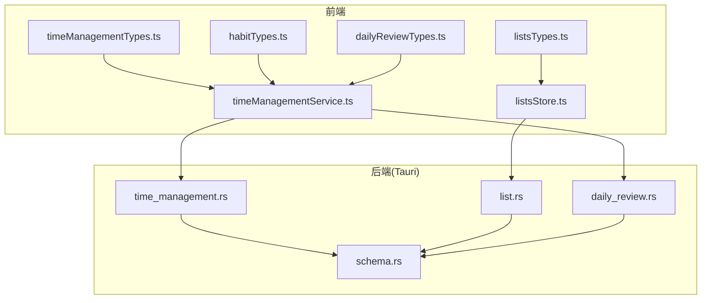
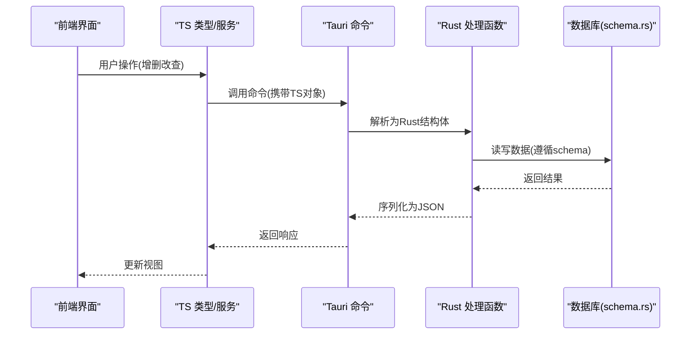
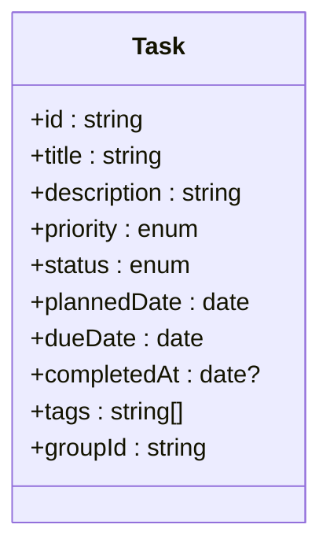
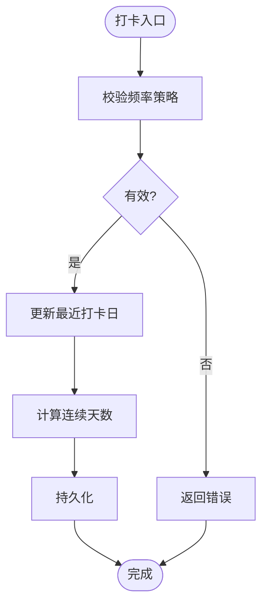
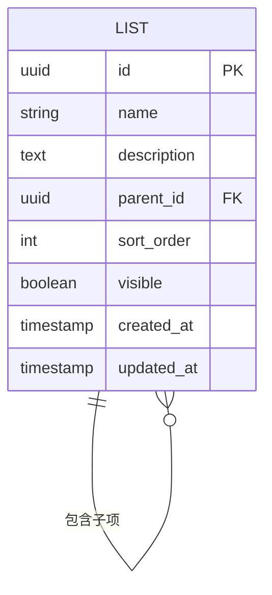
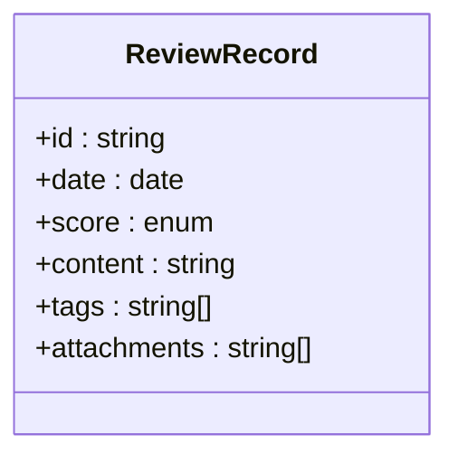
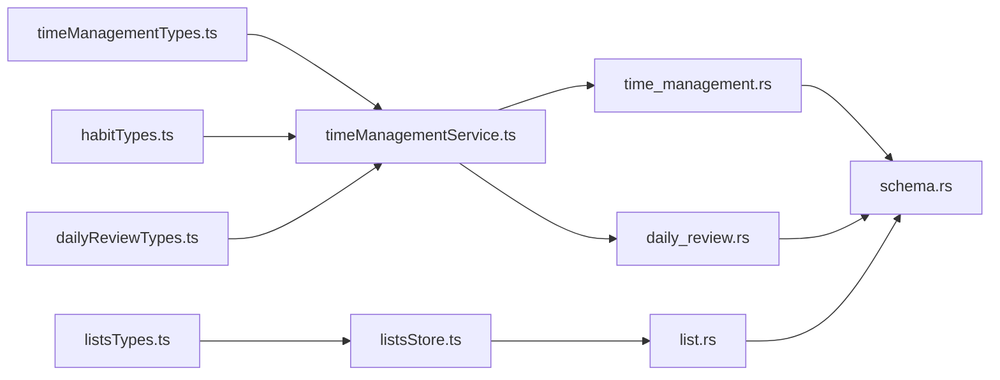

# 数据模型设计

<cite>
**本文引用的文件**   
- [src/features/time-management/timeManagementTypes.ts](file://src/features/time-management/timeManagementTypes.ts)
- [src/features/habits/habitTypes.ts](file://src/features/habits/habitTypes.ts)
- [src/features/lists/listsTypes.ts](file://src/features/lists/listsTypes.ts)
- [src/features/daily-review/dailyReviewTypes.ts](file://src/features/daily-review/dailyReviewTypes.ts)
- [src-tauri/src/schema.rs](file://src-tauri/src/schema.rs)
- [src-tauri/src/time_management.rs](file://src-tauri/src/time_management.rs)
- [src-tauri/src/list.rs](file://src-tauri/src/list.rs)
- [src-tauri/src/daily_review.rs](file://src-tauri/src/daily_review.rs)
- [src/features/time-management/timeManagementService.ts](file://src/features/time-management/timeManagementService.ts)
- [src/features/habits/components/HabitEditModal.tsx](file://src/features/habits/components/HabitEditModal.tsx)
- [src/features/lists/listsStore.ts](file://src/features/lists/listsStore.ts)
</cite>

## 目录
1. [简介](#简介)
2. [项目结构](#项目结构)
3. [核心组件](#核心组件)
4. [架构总览](#架构总览)
5. [详细组件分析](#详细组件分析)
6. [依赖关系分析](#依赖关系分析)
7. [性能考虑](#性能考虑)
8. [故障排查指南](#故障排查指南)
9. [结论](#结论)
10. [附录](#附录)

## 简介
本设计文档聚焦 FishWorker 的数据模型，覆盖前后端类型与结构体的映射、核心实体（Task、Habit、List、ReviewRecord）的设计理念与属性定义、数据验证规则、状态转换逻辑与业务约束、序列化/反序列化机制、版本管理与向后兼容策略，以及复杂对象的嵌套结构与关联关系处理方式。目标是帮助开发者在跨语言（TypeScript 与 Rust）环境下保持一致的数据契约，确保系统稳定演进与可维护性。

## 项目结构
FishWorker 采用 Tauri 架构：前端基于 TypeScript/React，后端通过 Rust 暴露 API 并持久化到数据库。数据模型主要分布在以下位置：
- 前端类型定义：各功能模块的 types 文件
- 后端结构体与数据库模式：Rust 源文件
- 服务层与状态管理：TS 服务与 store 文件，负责调用后端 API 并进行数据转换

图表来源
- [src/features/time-management/timeManagementTypes.ts](file://src/features/time-management/timeManagementTypes.ts)
- [src/features/habits/habitTypes.ts](file://src/features/habits/habitTypes.ts)
- [src/features/lists/listsTypes.ts](file://src/features/lists/listsTypes.ts)
- [src/features/daily-review/dailyReviewTypes.ts](file://src/features/daily-review/dailyReviewTypes.ts)
- [src-tauri/src/schema.rs](file://src-tauri/src/schema.rs)
- [src-tauri/src/time_management.rs](file://src-tauri/src/time_management.rs)
- [src-tauri/src/list.rs](file://src-tauri/src/list.rs)
- [src-tauri/src/daily_review.rs](file://src-tauri/src/daily_review.rs)

章节来源
- [src/features/time-management/timeManagementTypes.ts](file://src/features/time-management/timeManagementTypes.ts)
- [src/features/habits/habitTypes.ts](file://src/features/habits/habitTypes.ts)
- [src/features/lists/listsTypes.ts](file://src/features/lists/listsTypes.ts)
- [src/features/daily-review/dailyReviewTypes.ts](file://src/features/daily-review/dailyReviewTypes.ts)
- [src-tauri/src/schema.rs](file://src-tauri/src/schema.rs)
- [src-tauri/src/time_management.rs](file://src-tauri/src/time_management.rs)
- [src-tauri/src/list.rs](file://src-tauri/src/list.rs)
- [src-tauri/src/daily_review.rs](file://src-tauri/src/daily_review.rs)

## 核心组件
本节概述四大核心实体的设计理念与关键属性，并说明其在前后端的对应关系。

- Task（任务）
  - 领域职责：表达时间管理中的具体任务项，支持优先级、截止日期、完成状态等维度。
  - 前端类型：位于 timeManagementTypes.ts，用于 UI 展示与服务交互。
  - 后端结构体：time_management.rs 中定义，负责持久化与校验。
  - 典型字段：标识符、标题、描述、优先级、计划日期、实际完成时间、状态、标签/分组等。
  - 状态转换：未开始 → 进行中 → 已完成；或取消。
  - 约束：截止日期不得早于当前时间（创建时），优先级取值范围受枚举限制。

- Habit（习惯）
  - 领域职责：记录周期性行为目标与打卡历史，支撑习惯追踪与统计。
  - 前端类型：habitTypes.ts。
  - 后端结构体：habit 相关结构体（若存在则参考 habit 模块；否则由通用列表/时间管理模块承载）。
  - 典型字段：标识符、名称、频率策略（每日/每周）、起始日、最近打卡日、连续天数、备注等。
  - 约束：频率策略需与周期计算一致；打卡日不得晚于当前日期。

- List（清单/笔记）
  - 领域职责：组织条目集合，支持分组、排序、模板与批量操作。
  - 前端类型：listsTypes.ts。
  - 后端结构体：list.rs。
  - 典型字段：标识符、名称、描述、父级分组、排序权重、可见性、创建/更新时间等。
  - 约束：父子层级无环；排序权重保持单调递增；唯一性约束（同组内名称唯一）。

- ReviewRecord（复盘记录）
  - 领域职责：记录每日复盘内容、评分与反思要点，形成回顾闭环。
  - 前端类型：dailyReviewTypes.ts。
  - 后端结构体：daily_review.rs。
  - 典型字段：标识符、日期、评分、文本内容、标签、附件引用等。
  - 约束：日期唯一（按天复盘）；评分范围受枚举限制。

章节来源
- [src/features/time-management/timeManagementTypes.ts](file://src/features/time-management/timeManagementTypes.ts)
- [src/features/habits/habitTypes.ts](file://src/features/habits/habitTypes.ts)
- [src/features/lists/listsTypes.ts](file://src/features/lists/listsTypes.ts)
- [src/features/daily-review/dailyReviewTypes.ts](file://src/features/daily-review/dailyReviewTypes.ts)
- [src-tauri/src/time_management.rs](file://src-tauri/src/time_management.rs)
- [src-tauri/src/list.rs](file://src-tauri/src/list.rs)
- [src-tauri/src/daily_review.rs](file://src-tauri/src/daily_review.rs)

## 架构总览
前后端通过 Tauri 命令进行通信，前端使用 TS 类型作为契约，后端以 Rust 结构体承载数据，并通过 schema.rs 统一声明数据库模式。

图表来源
- [src/features/time-management/timeManagementService.ts](file://src/features/time-management/timeManagementService.ts)
- [src-tauri/src/time_management.rs](file://src-tauri/src/time_management.rs)
- [src-tauri/src/list.rs](file://src-tauri/src/list.rs)
- [src-tauri/src/daily_review.rs](file://src-tauri/src/daily_review.rs)
- [src-tauri/src/schema.rs](file://src-tauri/src/schema.rs)

## 详细组件分析

### Task 实体
- 设计理念
  - 将“待办”抽象为可执行单元，强调可追踪的状态与时间信息，便于与日历/看板等视图联动。
- 属性定义（前后端映射）
  - 标识符：UUID/自增ID，前后端一致。
  - 标题/描述：字符串，长度与格式校验。
  - 优先级：枚举值（如低/中/高），前后端严格对齐。
  - 计划日期/截止时间：时间戳或日期字符串，时区处理统一。
  - 状态：枚举（未开始/进行中/已完成/已取消），提供状态机转换。
  - 标签/分组：可选集合，用于筛选与聚合。
- 数据验证规则
  - 必填字段非空；日期合法性检查；优先级取值限定；状态转换仅允许合法边。
- 状态转换逻辑
  - 未开始 → 进行中：开始执行时触发。
  - 进行中 → 已完成：标记完成时触发。
  - 任意状态 → 已取消：用户主动取消。
- 业务约束
  - 同一分组内标题唯一；截止日不可早于计划日；完成时间不得早于开始时间。
- 序列化/反序列化
  - 前端 JSON ↔ TS 类型；后端 JSON ↔ Rust 结构体；时间字段建议统一 ISO 8601。
- 版本与兼容
  - 新增字段默认可空并提供默认值；废弃字段保留但忽略；迁移脚本保证旧数据可读。

图表来源
- [src/features/time-management/timeManagementTypes.ts](file://src/features/time-management/timeManagementTypes.ts)
- [src-tauri/src/time_management.rs](file://src-tauri/src/time_management.rs)

章节来源
- [src/features/time-management/timeManagementTypes.ts](file://src/features/time-management/timeManagementTypes.ts)
- [src-tauri/src/time_management.rs](file://src-tauri/src/time_management.rs)

### Habit 实体
- 设计理念
  - 围绕“周期性行为”建模，关注频率策略与打卡历史，支持连续性与趋势统计。
- 属性定义（前后端映射）
  - 标识符、名称、频率策略（每日/每周/自定义）、起始日、最近打卡日、连续天数、备注等。
- 数据验证规则
  - 频率策略与周期计算一致；打卡日不晚于当前日期；名称在同用户下唯一。
- 状态转换逻辑
  - 打卡：更新最近打卡日与连续天数；断签重置连续计数。
- 业务约束
  - 自定义频率需满足最小间隔约束；删除习惯前清理打卡历史。
- 序列化/反序列化
  - 日期/时间统一 ISO 8601；枚举前后端一致。
- 版本与兼容
  - 新增统计字段默认可空；历史打卡记录兼容新频率策略。

图表来源
- [src/features/habits/habitTypes.ts](file://src/features/habits/habitTypes.ts)
- [src/features/habits/components/HabitEditModal.tsx](file://src/features/habits/components/HabitEditModal.tsx)

章节来源
- [src/features/habits/habitTypes.ts](file://src/features/habits/habitTypes.ts)
- [src/features/habits/components/HabitEditModal.tsx](file://src/features/habits/components/HabitEditModal.tsx)

### List 实体
- 设计理念
  - 以“集合+层次”为核心，支持分组、排序与模板复用，提升信息组织效率。
- 属性定义（前后端映射）
  - 标识符、名称、描述、父级分组、排序权重、可见性、创建/更新时间等。
- 数据验证规则
  - 父子层级无环；同组内名称唯一；排序权重单调递增。
- 状态转换逻辑
  - 移动/重排：更新父级与权重；模板应用：复制条目至目标清单。
- 业务约束
  - 删除分组需级联处理子项；批量导出需校验权限与可见性。
- 序列化/反序列化
  - 树形结构扁平化传输，前端重建层级；权重与顺序一致。
- 版本与兼容
  - 新增元数据字段默认可空；旧版排序字段兼容新权重字段。

图表来源
- [src/features/lists/listsTypes.ts](file://src/features/lists/listsTypes.ts)
- [src-tauri/src/list.rs](file://src-tauri/src/list.rs)

章节来源
- [src/features/lists/listsTypes.ts](file://src/features/lists/listsTypes.ts)
- [src-tauri/src/list.rs](file://src-tauri/src/list.rs)
- [src/features/lists/listsStore.ts](file://src/features/lists/listsStore.ts)

### ReviewRecord 实体
- 设计理念
  - 记录每日复盘，结构化评分与文本反思，形成个人成长轨迹。
- 属性定义（前后端映射）
  - 标识符、日期、评分、文本内容、标签、附件引用等。
- 数据验证规则
  - 日期唯一（按天）；评分范围受枚举限制；文本长度上限。
- 状态转换逻辑
  - 草稿 → 提交；提交后可修订（保留版本）。
- 业务约束
  - 删除日期需级联清理；附件引用需校验存在性。
- 序列化/反序列化
  - 文本内容可能富文本，前后端约定编码；附件以 URL/ID 引用。
- 版本与兼容
  - 新增评分维度默认可空；旧记录兼容新维度。

图表来源
- [src/features/daily-review/dailyReviewTypes.ts](file://src/features/daily-review/dailyReviewTypes.ts)
- [src-tauri/src/daily_review.rs](file://src-tauri/src/daily_review.rs)

章节来源
- [src/features/daily-review/dailyReviewTypes.ts](file://src/features/daily-review/dailyReviewTypes.ts)
- [src-tauri/src/daily_review.rs](file://src-tauri/src/daily_review.rs)

## 依赖关系分析
- 模块耦合
  - 前端 types 与后端结构体强耦合，需通过变更流程同步。
  - 服务层封装 Tauri 命令调用，屏蔽协议细节。
- 外部依赖
  - 数据库模式由 schema.rs 统一管理，所有实体写入/读取均遵循该模式。
- 潜在循环依赖
  - 避免前端 service 直接依赖后端实现，仅通过 Tauri 命令接口。
- 接口契约
  - 请求/响应 JSON 结构应与 TS 类型一一对应，枚举值严格一致。

图表来源
- [src/features/time-management/timeManagementTypes.ts](file://src/features/time-management/timeManagementTypes.ts)
- [src/features/habits/habitTypes.ts](file://src/features/habits/habitTypes.ts)
- [src/features/lists/listsTypes.ts](file://src/features/lists/listsTypes.ts)
- [src/features/daily-review/dailyReviewTypes.ts](file://src/features/daily-review/dailyReviewTypes.ts)
- [src/features/time-management/timeManagementService.ts](file://src/features/time-management/timeManagementService.ts)
- [src/features/lists/listsStore.ts](file://src/features/lists/listsStore.ts)
- [src-tauri/src/time_management.rs](file://src-tauri/src/time_management.rs)
- [src-tauri/src/list.rs](file://src-tauri/src/list.rs)
- [src-tauri/src/daily_review.rs](file://src-tauri/src/daily_review.rs)
- [src-tauri/src/schema.rs](file://src-tauri/src/schema.rs)

章节来源
- [src/features/time-management/timeManagementService.ts](file://src/features/time-management/timeManagementService.ts)
- [src/features/lists/listsStore.ts](file://src/features/lists/listsStore.ts)
- [src-tauri/src/schema.rs](file://src-tauri/src/schema.rs)

## 性能考虑
- 数据传输
  - 分页与过滤：列表查询支持分页参数，减少网络负载。
  - 增量更新：状态变更仅传输差异字段，降低序列化开销。
- 存储优化
  - 索引策略：对常用查询字段（日期、分组、状态）建立索引。
  - 大字段分离：富文本或附件路径外置，主表仅存引用。
- 前端渲染
  - 虚拟滚动：长列表使用虚拟化技术。
  - 缓存策略：本地缓存热点数据，结合失效策略。

[本节为通用指导，无需特定文件来源]

## 故障排查指南
- 常见错误
  - 类型不一致：TS 枚举与 Rust 枚举值不匹配导致解析失败。
  - 日期格式错误：ISO 8601 与时区问题导致比较异常。
  - 约束冲突：唯一性/外键约束违反引发写入失败。
- 定位方法
  - 查看 Tauri 命令日志与后端错误栈。
  - 对比前后端类型定义，确认字段名与类型一致。
  - 使用 schema.rs 核对数据库约束。
- 修复建议
  - 引入统一的类型生成工具，从 schema 自动生成 TS 类型。
  - 增加服务端输入校验与友好错误码。
  - 对日期字段统一进行时区转换与格式化。

章节来源
- [src-tauri/src/schema.rs](file://src-tauri/src/schema.rs)
- [src-tauri/src/time_management.rs](file://src-tauri/src/time_management.rs)
- [src-tauri/src/list.rs](file://src-tauri/src/list.rs)
- [src-tauri/src/daily_review.rs](file://src-tauri/src/daily_review.rs)

## 结论
FishWorker 的数据模型以清晰的实体划分与严格的契约管理为基础，通过 TS 类型与 Rust 结构体的双向映射，配合 schema.rs 的统一模式声明，实现了前后端一致的数据语义。建议在后续迭代中引入类型生成与更强的校验机制，进一步提升稳定性与可维护性。

[本节为总结，无需特定文件来源]

## 附录
- 术语表
  - 枚举：有限取值集合，前后端需严格对齐。
  - 幂等：重复操作不会产生副作用。
  - 向后兼容：新版本能正确读取旧版本数据。
- 最佳实践
  - 变更影响评估：修改类型前先评估下游影响。
  - 迁移脚本：任何破坏性变更需提供迁移方案。
  - 测试覆盖：针对边界条件与非法输入编写用例。

[本节为概念性内容，无需特定文件来源]