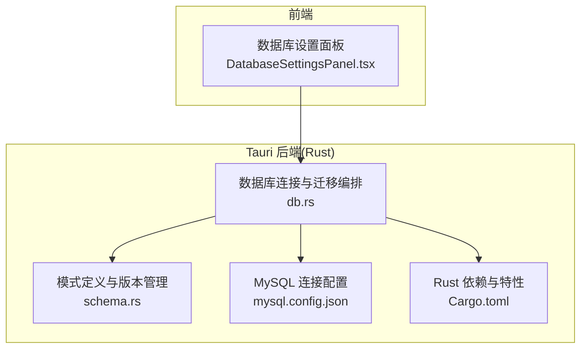
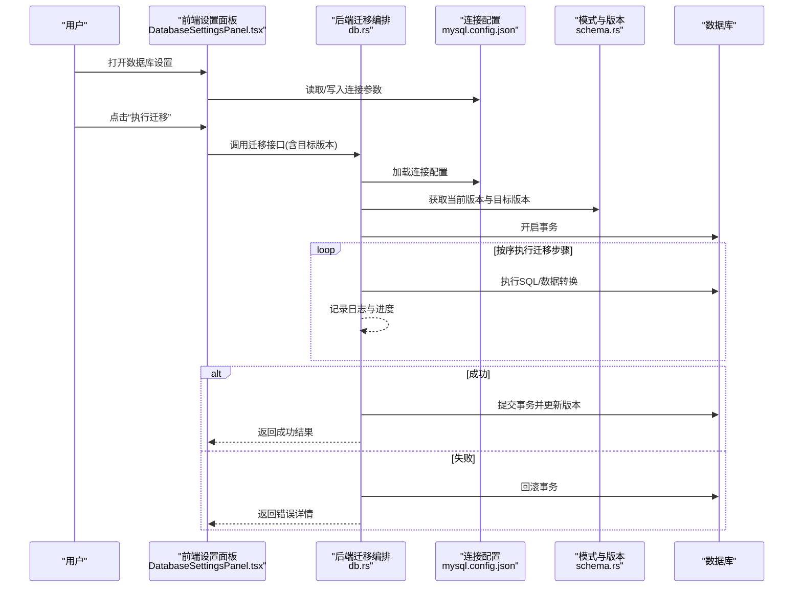
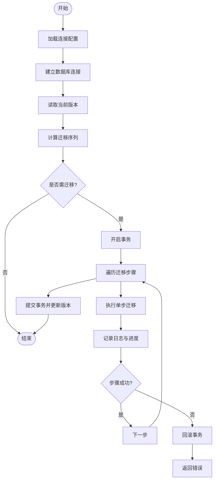
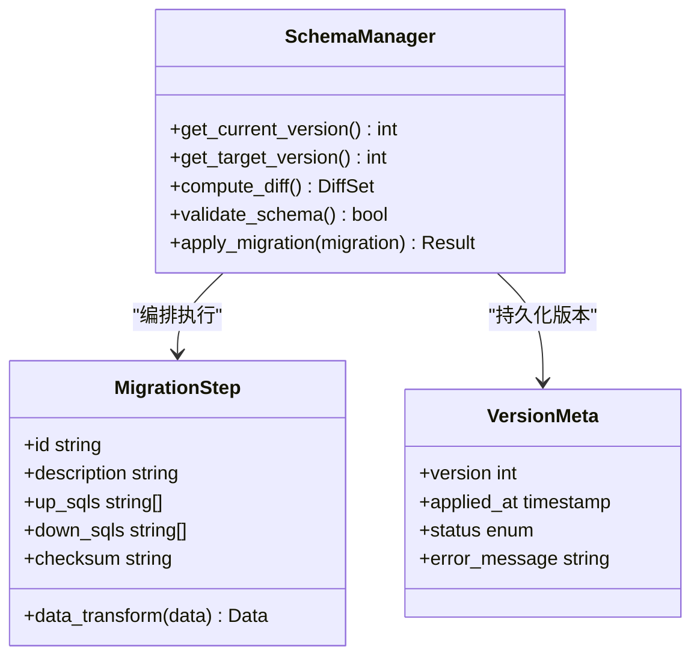
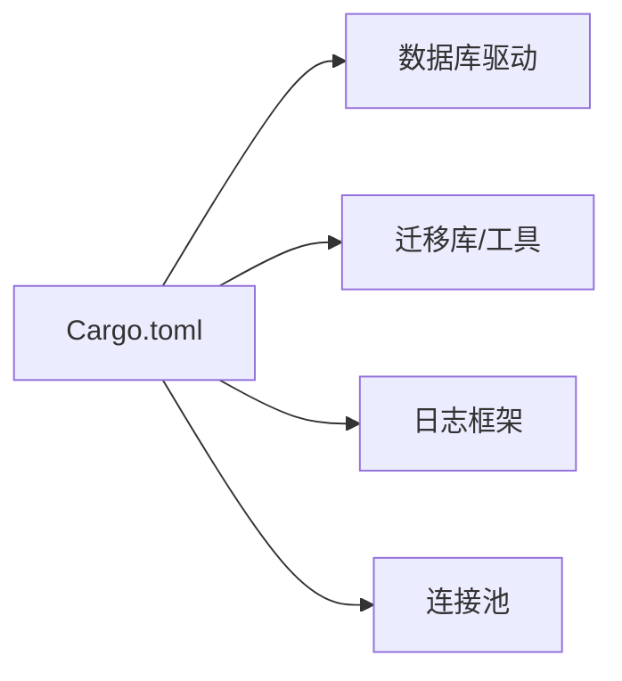

# 数据迁移策略

<cite>
**本文引用的文件**   
- [src-tauri/src/db.rs](file://src-tauri/src/db.rs)
- [src-tauri/src/schema.rs](file://src-tauri/src/schema.rs)
- [src-tauri/Cargo.toml](file://src-tauri/Cargo.toml)
- [src-tauri/mysql.config.json](file://src-tauri/mysql.config.json)
- [src/features/settings/components/DatabaseSettingsPanel.tsx](file://src/features/settings/components/DatabaseSettingsPanel.tsx)
</cite>

## 目录
1. [引言](#引言)
2. [项目结构](#项目结构)
3. [核心组件](#核心组件)
4. [架构总览](#架构总览)
5. [详细组件分析](#详细组件分析)
6. [依赖分析](#依赖分析)
7. [性能考虑](#性能考虑)
8. [故障排查指南](#故障排查指南)
9. [结论](#结论)
10. [附录](#附录)

## 引言
本指南面向 FishWorker 的数据迁移系统，聚焦版本化迁移的设计理念与落地实践。内容涵盖：
- 迁移文件的命名规范、结构定义与执行顺序控制
- 向前迁移与回滚迁移的实现机制（增量更新、数据转换、备份恢复）
- 迁移过程中的错误处理、日志记录与进度跟踪
- 迁移测试方法与验证工具使用指南
- 生产环境最佳实践与安全考虑
- 多用户并发迁移处理与冲突解决策略

FishWorker 采用 Tauri + Rust 后端，数据库层通过 SQL 模式管理与连接配置驱动迁移流程。前端提供数据库设置面板以支持连接参数配置与迁移入口。

## 项目结构
与数据迁移相关的代码主要位于 Rust 后端与前端设置模块中：
- 后端数据库与模式管理：db.rs、schema.rs
- 构建期依赖与特性开关：Cargo.toml
- 数据库连接配置：mysql.config.json
- 前端数据库设置面板：DatabaseSettingsPanel.tsx

图表来源
- [src/features/settings/components/DatabaseSettingsPanel.tsx](file://src/features/settings/components/DatabaseSettingsPanel.tsx)
- [src-tauri/src/db.rs](file://src-tauri/src/db.rs)
- [src-tauri/src/schema.rs](file://src-tauri/src/schema.rs)
- [src-tauri/mysql.config.json](file://src-tauri/mysql.config.json)
- [src-tauri/Cargo.toml](file://src-tauri/Cargo.toml)

章节来源
- [src-tauri/src/db.rs](file://src-tauri/src/db.rs)
- [src-tauri/src/schema.rs](file://src-tauri/src/schema.rs)
- [src-tauri/Cargo.toml](file://src-tauri/Cargo.toml)
- [src-tauri/mysql.config.json](file://src-tauri/mysql.config.json)
- [src/features/settings/components/DatabaseSettingsPanel.tsx](file://src/features/settings/components/DatabaseSettingsPanel.tsx)

## 核心组件
- 数据库连接与迁移编排（db.rs）
  - 负责建立数据库连接、加载配置、调度迁移任务、记录执行状态与错误信息。
- 模式定义与版本管理（schema.rs）
  - 维护当前模式版本、表结构与字段变更的声明式描述，为迁移提供目标态参考。
- 构建期依赖与特性（Cargo.toml）
  - 引入数据库驱动与迁移相关库，启用必要的编译特性。
- MySQL 连接配置（mysql.config.json）
  - 集中管理主机、端口、用户名、密码、数据库名等连接参数。
- 前端数据库设置面板（DatabaseSettingsPanel.tsx）
  - 提供连接参数输入、保存与触发迁移操作的界面。

章节来源
- [src-tauri/src/db.rs](file://src-tauri/src/db.rs)
- [src-tauri/src/schema.rs](file://src-tauri/src/schema.rs)
- [src-tauri/Cargo.toml](file://src-tauri/Cargo.toml)
- [src-tauri/mysql.config.json](file://src-tauri/mysql.config.json)
- [src/features/settings/components/DatabaseSettingsPanel.tsx](file://src/features/settings/components/DatabaseSettingsPanel.tsx)

## 架构总览
整体迁移流程由前端触发，后端编排执行，读取配置并基于模式版本进行增量或全量迁移，同时保证事务性与可回滚能力。

图表来源
- [src/features/settings/components/DatabaseSettingsPanel.tsx](file://src/features/settings/components/DatabaseSettingsPanel.tsx)
- [src-tauri/src/db.rs](file://src-tauri/src/db.rs)
- [src-tauri/src/schema.rs](file://src-tauri/src/schema.rs)
- [src-tauri/mysql.config.json](file://src-tauri/mysql.config.json)

## 详细组件分析

### 组件A：数据库连接与迁移编排（db.rs）
职责与要点
- 连接管理：从配置文件加载连接参数，建立并复用连接池。
- 迁移编排：根据当前版本与目标版本计算需要执行的迁移序列，确保幂等与顺序性。
- 事务与回滚：将每个迁移步骤包裹在事务中，失败时自动回滚。
- 日志与进度：记录关键事件、耗时与错误堆栈，暴露进度回调以便前端展示。
- 并发控制：通过全局锁或队列避免重复迁移；对长耗时操作进行超时保护。

图表来源
- [src-tauri/src/db.rs](file://src-tauri/src/db.rs)

章节来源
- [src-tauri/src/db.rs](file://src-tauri/src/db.rs)

### 组件B：模式定义与版本管理（schema.rs）
职责与要点
- 版本元数据：维护当前版本号、变更记录与兼容性说明。
- 结构声明：以声明式方式定义表、索引、约束与默认值，作为迁移的目标态。
- 差异计算：对比历史版本与目标版本，生成最小变更集（DDL/DML）。
- 校验与断言：在迁移前进行结构一致性检查，防止破坏性变更。

图表来源
- [src-tauri/src/schema.rs](file://src-tauri/src/schema.rs)

章节来源
- [src-tauri/src/schema.rs](file://src-tauri/src/schema.rs)

### 组件C：连接配置（mysql.config.json）
职责与要点
- 集中管理连接参数，支持多环境切换（开发/测试/生产）。
- 敏感信息加密存储或环境变量注入，避免硬编码。
- 提供连接健康检查与重试策略。

章节来源
- [src-tauri/mysql.config.json](file://src-tauri/mysql.config.json)

### 组件D：前端数据库设置面板（DatabaseSettingsPanel.tsx）
职责与要点
- 表单输入与校验：主机、端口、用户名、密码、数据库名等。
- 连接测试：发起连通性探测，反馈成功/失败原因。
- 迁移触发：调用后端迁移接口，展示进度条与错误提示。
- 权限控制：仅管理员可见与可操作。

章节来源
- [src/features/settings/components/DatabaseSettingsPanel.tsx](file://src/features/settings/components/DatabaseSettingsPanel.tsx)

## 依赖分析
- 构建期依赖（Cargo.toml）
  - 引入数据库驱动与迁移相关库，启用必要特性（如 TLS、连接池）。
- 运行时依赖
  - 配置文件解析、日志框架、序列化/反序列化、并发原语。

图表来源
- [src-tauri/Cargo.toml](file://src-tauri/Cargo.toml)

章节来源
- [src-tauri/Cargo.toml](file://src-tauri/Cargo.toml)

## 性能考虑
- 批量 DDL/DML：合并小粒度变更，减少往返次数。
- 索引重建策略：先删除后重建，或在低峰期执行。
- 分页与流式处理：大数据量转换时分批处理，降低内存峰值。
- 连接池调优：根据并发与负载调整最大连接数与空闲超时。
- 事务边界：尽量缩小事务范围，避免长时间持有锁。

[本节为通用指导，不直接分析具体文件]

## 故障排查指南
常见问题与定位方法
- 连接失败
  - 检查 mysql.config.json 中的主机、端口、用户名、密码是否正确。
  - 确认网络可达与防火墙规则。
  - 查看后端日志中的连接错误码与堆栈。
- 迁移失败
  - 核对 schema.rs 的版本与目标版本是否一致。
  - 检查单步迁移的 up/down SQL 语法与数据约束。
  - 观察事务回滚后的状态，必要时手动修复后再重试。
- 进度无响应
  - 确认后端进度回调是否正常上报。
  - 检查前端轮询/订阅逻辑与超时设置。
- 并发冲突
  - 确认全局迁移锁是否生效。
  - 查看版本表是否存在不一致，必要时人工介入对齐。

章节来源
- [src-tauri/src/db.rs](file://src-tauri/src/db.rs)
- [src-tauri/src/schema.rs](file://src-tauri/src/schema.rs)
- [src-tauri/mysql.config.json](file://src-tauri/mysql.config.json)

## 结论
FishWorker 的数据迁移系统以版本化为核心，结合声明式模式与事务化执行，实现了安全可控的向前迁移与回滚能力。通过完善的日志、进度与错误处理，以及前端可视化设置面板，显著降低了运维复杂度。在生产环境中，建议严格遵循命名规范、变更评审与灰度发布流程，并结合并发控制与备份恢复策略，确保高可用与数据安全。

[本节为总结性内容，不直接分析具体文件]

## 附录

### 迁移文件命名规范
- 格式：YYYYMMDDHHmmss_简短描述.sql
- 示例：20240101120000_add_user_index.sql
- 要求：时间戳唯一、描述清晰、大小写一致、避免特殊字符

### 迁移文件结构定义
- 头部注释：包含作者、日期、影响范围、风险等级
- Up 段：正向变更（DDL/DML），幂等设计
- Down 段：反向变更，用于回滚
- 校验段：前置条件检查与断言
- 元数据：关联版本、依赖关系、预计耗时

### 执行顺序控制
- 严格按文件名排序执行
- 支持依赖声明，自动拓扑排序
- 跳过已执行且未变更的步骤（幂等）

### 向前迁移与回滚机制
- 增量更新：仅应用差异变更，减少停机时间
- 数据转换：分批处理大表，支持断点续跑
- 备份恢复：迁移前自动快照，失败时一键恢复

### 错误处理、日志与进度
- 错误分类：连接错误、语法错误、约束冲突、数据异常
- 日志级别：INFO/WARN/ERROR，结构化输出
- 进度跟踪：百分比、剩余时间估算、失败位置定位

### 迁移测试与验证
- 单元测试：模拟不同版本起点，验证 up/down 对称性
- 集成测试：在隔离数据库中执行完整迁移链路
- 数据校验：迁移前后统计信息与抽样比对
- 自动化：CI 流水线集成，失败阻断发布

### 生产环境最佳实践与安全
- 变更评审：双人复核、影响评估、回滚预案
- 灰度发布：分批次滚动升级，监控指标告警
- 权限最小化：迁移账号仅具备必要权限
- 密钥管理：使用环境变量或密钥管理服务
- 审计追踪：记录所有迁移操作与责任人

### 并发迁移与冲突解决
- 全局锁：确保同一时刻仅一个迁移进程运行
- 版本表：原子更新版本号，检测并发写入
- 冲突检测：比较期望版本与实际版本，拒绝不一致
- 自愈策略：自动重试、降级执行、人工干预入口