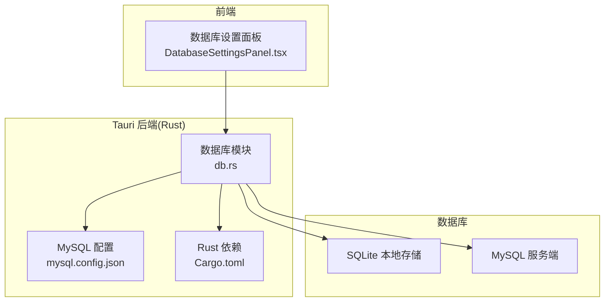
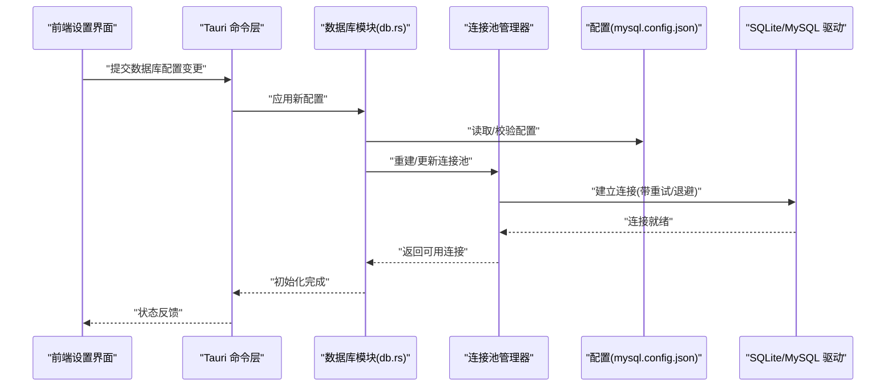
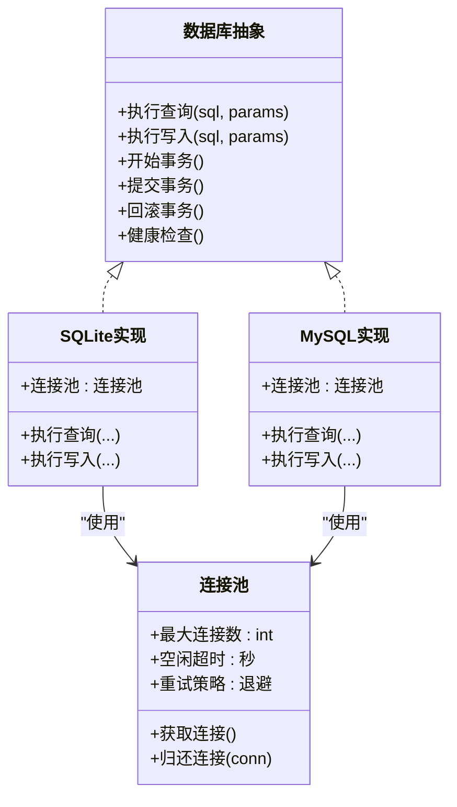
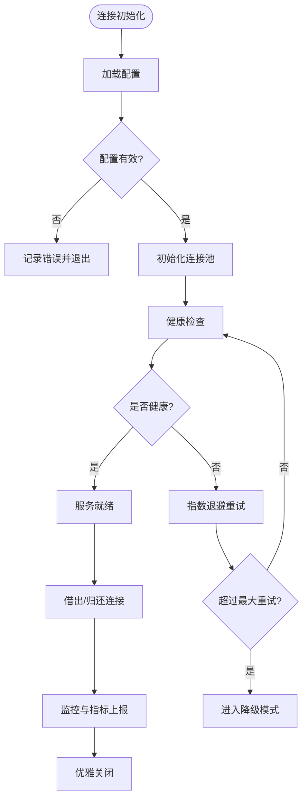
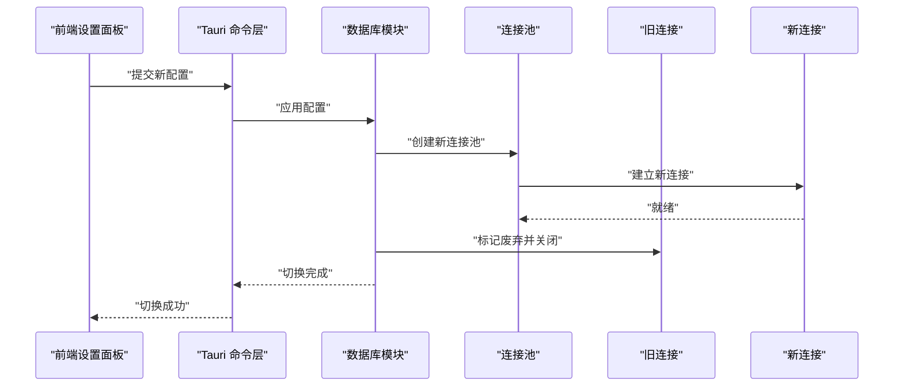
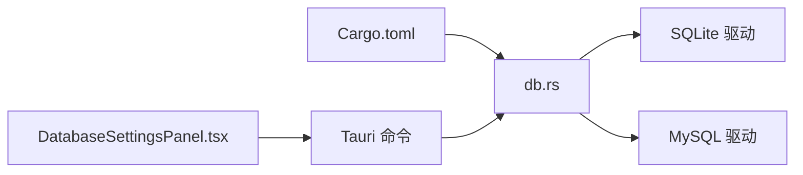

# 连接管理

<cite>
**本文引用的文件**   
- [src-tauri/src/db.rs](file://src-tauri/src/db.rs)
- [src-tauri/mysql.config.json](file://src-tauri/mysql.config.json)
- [src-tauri/Cargo.toml](file://src-tauri/Cargo.toml)
- [src/features/settings/components/DatabaseSettingsPanel.tsx](file://src/features/settings/components/DatabaseSettingsPanel.tsx)
</cite>

## 目录
1. [简介](#简介)
2. [项目结构](#项目结构)
3. [核心组件](#核心组件)
4. [架构总览](#架构总览)
5. [详细组件分析](#详细组件分析)
6. [依赖关系分析](#依赖关系分析)
7. [性能考虑](#性能考虑)
8. [故障排查指南](#故障排查指南)
9. [结论](#结论)
10. [附录](#附录)

## 简介
本技术文档聚焦 FishWorker 的数据库连接管理，围绕 SQLite 与 MySQL 双数据库支持展开，涵盖连接池配置、连接复用与负载均衡策略、配置文件结构与参数调优、连接生命周期与自动重连、事务管理边界与并发安全、监控与调试方法，以及数据库切换与故障转移方案。目标是帮助开发者快速理解并正确扩展连接层能力，确保在高并发场景下的稳定性与可观测性。

## 项目结构
FishWorker 采用 Tauri 架构：前端使用 React + TypeScript，后端通过 Rust 提供系统级能力（包括数据库访问）。数据库相关的关键位置如下：
- Rust 后端数据库实现与初始化位于 src-tauri/src/db.rs
- MySQL 运行时配置位于 src-tauri/mysql.config.json
- Rust 依赖声明位于 src-tauri/Cargo.toml
- 前端数据库设置面板位于 src/features/settings/components/DatabaseSettingsPanel.tsx

图表来源
- [src/features/settings/components/DatabaseSettingsPanel.tsx](file://src/features/settings/components/DatabaseSettingsPanel.tsx)
- [src-tauri/src/db.rs](file://src-tauri/src/db.rs)
- [src-tauri/mysql.config.json](file://src-tauri/mysql.config.json)
- [src-tauri/Cargo.toml](file://src-tauri/Cargo.toml)

章节来源
- [src-tauri/src/db.rs](file://src-tauri/src/db.rs)
- [src-tauri/mysql.config.json](file://src-tauri/mysql.config.json)
- [src-tauri/Cargo.toml](file://src-tauri/Cargo.toml)
- [src/features/settings/components/DatabaseSettingsPanel.tsx](file://src/features/settings/components/DatabaseSettingsPanel.tsx)

## 核心组件
- 数据库抽象与工厂
  - 负责根据运行期配置选择 SQLite 或 MySQL 驱动，统一暴露查询接口，屏蔽底层差异。
- 连接池管理器
  - 维护多连接实例，控制最大连接数、空闲回收、超时与重试策略，提供连接借用与归还语义。
- 配置加载器
  - 读取 mysql.config.json 等外部配置，校验必填字段，合并默认值，支持热更新或重启生效。
- 错误处理与自动重连
  - 对网络抖动、认证失败、锁冲突等错误进行分类，实施指数退避与熔断降级。
- 事务协调器
  - 封装事务边界，保证原子性与隔离级别，提供回滚策略与并发安全保证。
- 监控与诊断
  - 采集连接池指标（活跃/空闲/等待队列）、慢查询统计、错误分布，输出到日志或遥测通道。

章节来源
- [src-tauri/src/db.rs](file://src-tauri/src/db.rs)
- [src-tauri/mysql.config.json](file://src-tauri/mysql.config.json)
- [src-tauri/Cargo.toml](file://src-tauri/Cargo.toml)

## 架构总览
下图展示了从前端设置到后端数据库连接的端到端流程，包括配置加载、连接池初始化、请求路由与错误恢复路径。

图表来源
- [src/features/settings/components/DatabaseSettingsPanel.tsx](file://src/features/settings/components/DatabaseSettingsPanel.tsx)
- [src-tauri/src/db.rs](file://src-tauri/src/db.rs)
- [src-tauri/mysql.config.json](file://src-tauri/mysql.config.json)

## 详细组件分析

### 数据库抽象与工厂
- 职责
  - 根据配置决定使用 SQLite 或 MySQL；对外暴露统一的执行接口（如查询、写入、事务）。
- 设计要点
  - 使用枚举或特征抽象不同驱动；工厂按环境或配置创建具体实现。
  - 为每种驱动提供独立的连接池实例，避免跨引擎共享连接。
- 关键行为
  - 启动时预检连通性；失败则记录错误并进入降级模式（例如只读或仅本地缓存）。
  - 动态切换：在配置变更后重建连接池，旧连接优雅关闭。

图表来源
- [src-tauri/src/db.rs](file://src-tauri/src/db.rs)

章节来源
- [src-tauri/src/db.rs](file://src-tauri/src/db.rs)

### 连接池配置与复用
- 连接池参数
  - 最大连接数：限制并发上限，防止资源耗尽。
  - 最小空闲连接：预热连接，降低冷启动延迟。
  - 连接空闲超时：回收长时间不用的连接，释放资源。
  - 连接获取超时：避免请求无限等待。
  - 心跳/保活：周期性探测连接可用性。
- 复用策略
  - 线程/协程安全的借用-归还模型；每个请求持有连接期间禁止跨任务共享。
  - 批量操作建议复用同一连接以减少上下文切换。
- 负载均衡
  - 单库场景：轮询或最少连接优先分配。
  - 多副本 MySQL：基于健康度权重分配，失败节点自动摘除。

章节来源
- [src-tauri/src/db.rs](file://src-tauri/src/db.rs)
- [src-tauri/mysql.config.json](file://src-tauri/mysql.config.json)

### 配置文件结构与参数调优
- 配置文件位置
  - MySQL 运行时配置：mysql.config.json
- 典型字段（示例说明）
  - 连接地址与端口
  - 用户名与密码
  - 数据库名
  - 连接池大小
  - 超时与重试参数
  - SSL/TLS 开关与证书路径
- 调优建议
  - 根据 CPU 核数与 I/O 能力调整最大连接数。
  - 高并发写场景适当增大最小空闲连接。
  - 网络不稳定环境启用心跳与更积极的退避策略。

章节来源
- [src-tauri/mysql.config.json](file://src-tauri/mysql.config.json)

### 连接生命周期管理与自动重连
- 生命周期阶段
  - 初始化：加载配置、校验参数、建立初始连接。
  - 运行期：借出连接、执行语句、归还连接、健康检查。
  - 销毁：优雅关闭所有连接，释放资源。
- 自动重连
  - 检测断连后触发指数退避重试，达到阈值后熔断，等待冷却时间再尝试。
  - 对幂等操作可自动重试；非幂等需业务侧确认。
- 优雅降级
  - 主库不可用时切换到只读副本或本地缓存，保障基本功能可用。

图表来源
- [src-tauri/src/db.rs](file://src-tauri/src/db.rs)

章节来源
- [src-tauri/src/db.rs](file://src-tauri/src/db.rs)

### 事务管理
- 事务边界
  - 明确开始/提交/回滚点；长事务应避免，尽量缩短持有连接的时间。
- 并发安全
  - 同一事务内使用单一连接；跨连接事务需上层编排。
  - 合理设置隔离级别，平衡一致性与吞吐。
- 回滚策略
  - 捕获异常立即回滚；对部分失败进行补偿或重试。
- 最佳实践
  - 将短小、独立的操作放入事务；避免在事务中执行耗时 I/O。

章节来源
- [src-tauri/src/db.rs](file://src-tauri/src/db.rs)

### 监控与调试工具
- 指标采集
  - 连接池：活跃连接数、空闲连接数、等待队列长度、获取耗时分位。
  - 错误率：按错误类型分类统计（认证失败、超时、锁冲突等）。
  - 慢查询：超过阈值的查询采样与样本 SQL。
- 日志规范
  - 结构化日志包含请求 ID、数据库类型、表/索引信息、耗时与错误码。
- 诊断手段
  - 开启驱动层调试日志；导出连接池快照；对热点 SQL 做 EXPLAIN 分析。

章节来源
- [src-tauri/src/db.rs](file://src-tauri/src/db.rs)

### 数据库切换与故障转移
- 切换方式
  - 通过前端设置面板提交新配置，后端重载配置并重建连接池。
- 故障转移
  - 主库不可用时自动切换到只读副本；恢复后平滑切回。
  - 数据一致性由上层保证（读写分离下注意最终一致）。
- 灰度与回滚
  - 先以低流量验证新配置；出现问题快速回滚至上一版本配置。

图表来源
- [src/features/settings/components/DatabaseSettingsPanel.tsx](file://src/features/settings/components/DatabaseSettingsPanel.tsx)
- [src-tauri/src/db.rs](file://src-tauri/src/db.rs)

章节来源
- [src/features/settings/components/DatabaseSettingsPanel.tsx](file://src/features/settings/components/DatabaseSettingsPanel.tsx)
- [src-tauri/src/db.rs](file://src-tauri/src/db.rs)

## 依赖关系分析
- Rust 依赖
  - SQLite 与 MySQL 驱动通过 Cargo.toml 引入；确保版本兼容与特性开关。
- 前后端交互
  - 前端通过 Tauri 命令调用后端数据库能力；配置变更走统一入口。

图表来源
- [src-tauri/Cargo.toml](file://src-tauri/Cargo.toml)
- [src-tauri/src/db.rs](file://src-tauri/src/db.rs)
- [src/features/settings/components/DatabaseSettingsPanel.tsx](file://src/features/settings/components/DatabaseSettingsPanel.tsx)

章节来源
- [src-tauri/Cargo.toml](file://src-tauri/Cargo.toml)
- [src-tauri/src/db.rs](file://src-tauri/src/db.rs)
- [src/features/settings/components/DatabaseSettingsPanel.tsx](file://src/features/settings/components/DatabaseSettingsPanel.tsx)

## 性能考虑
- 连接池容量
  - 依据工作负载估算：并发度 × 平均持有时间 / 目标响应时间。
- 超时与重试
  - 合理设置获取超时与重试次数，避免雪崩；结合熔断保护上游。
- 索引与 SQL
  - 针对热点查询优化索引；避免 N+1 查询与全表扫描。
- 批处理与流式
  - 大批量写入使用批处理；大结果集使用游标/分页减少内存占用。
- 监控告警
  - 对连接池饱和、慢查询比例、错误率设置阈值告警。

[本节为通用指导，无需特定文件来源]

## 故障排查指南
- 常见问题
  - 连接池耗尽：检查最大连接数与事务时长；定位长事务与泄漏。
  - 认证失败：核对用户名、密码、权限与白名单。
  - 网络抖动：观察重试与熔断日志；必要时提升超时与退避参数。
  - 死锁与锁冲突：分析慢查询与事务顺序；拆分事务或调整隔离级别。
- 定位步骤
  - 查看结构化日志中的错误码与堆栈；导出连接池快照对比变化。
  - 使用驱动调试日志复现问题；抓取热点 SQL 的执行计划。
  - 在前端设置面板切换回稳定配置，验证是否为配置变更导致。

章节来源
- [src-tauri/src/db.rs](file://src-tauri/src/db.rs)
- [src/features/settings/components/DatabaseSettingsPanel.tsx](file://src/features/settings/components/DatabaseSettingsPanel.tsx)

## 结论
FishWorker 的数据库连接管理通过抽象与工厂模式屏蔽 SQLite 与 MySQL 的差异，配合连接池、自动重连与事务协调器，形成高可用的数据访问层。合理的配置与监控能显著提升稳定性与性能。建议在上线前完成容量规划与压测，并在生产环境持续观测关键指标，及时调优。

[本节为总结性内容，无需特定文件来源]

## 附录
- 术语
  - 连接池：用于复用数据库连接的资源池。
  - 熔断：当错误率过高时暂时停止请求，等待恢复。
  - 隔离级别：事务可见性的约束等级。
- 参考
  - 配置文件样例与字段说明见 mysql.config.json。
  - Rust 依赖与特性开关见 Cargo.toml。

章节来源
- [src-tauri/mysql.config.json](file://src-tauri/mysql.config.json)
- [src-tauri/Cargo.toml](file://src-tauri/Cargo.toml)