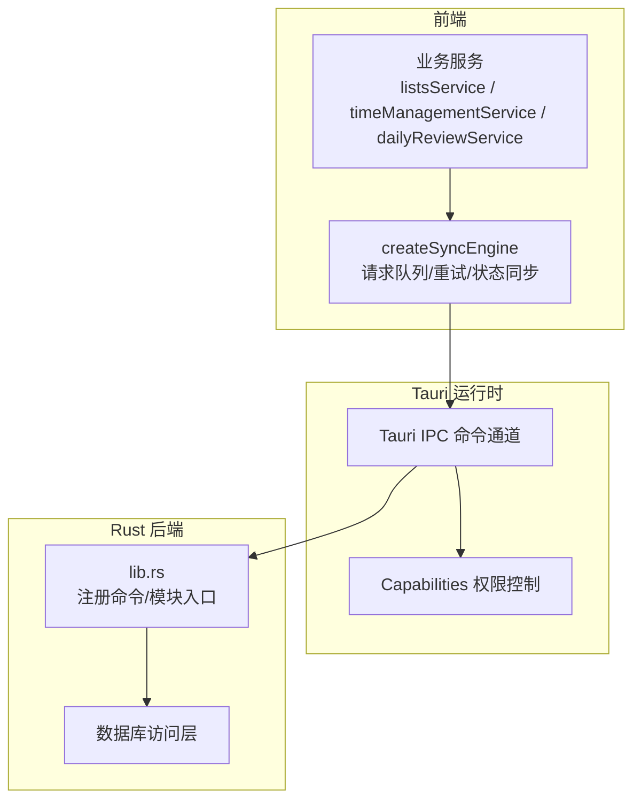
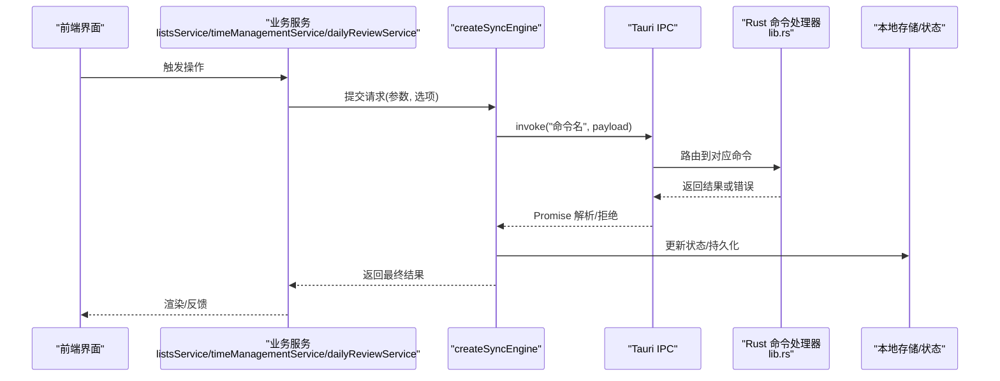
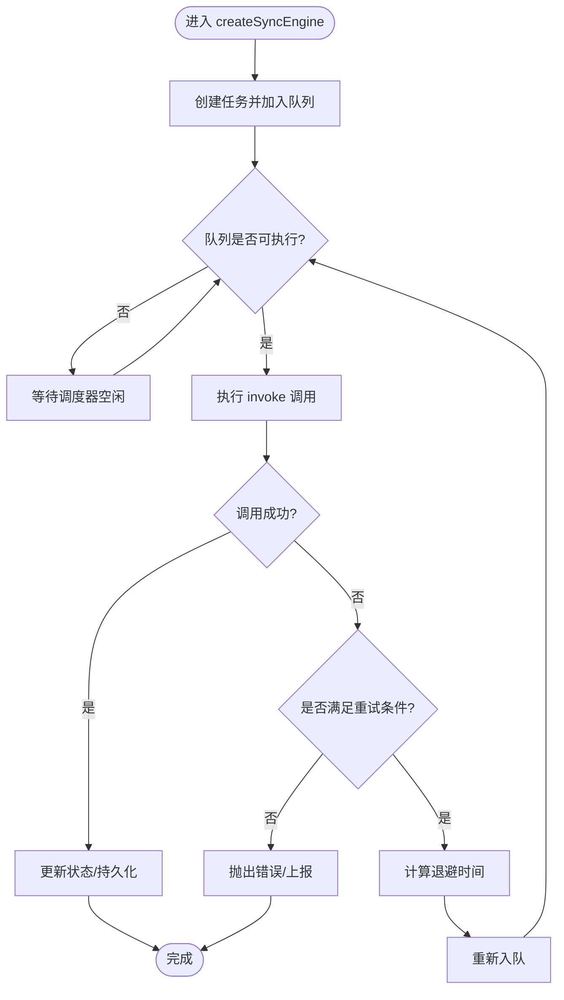
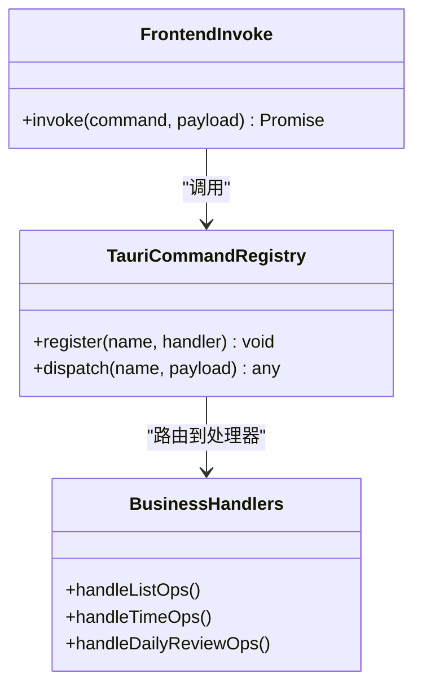
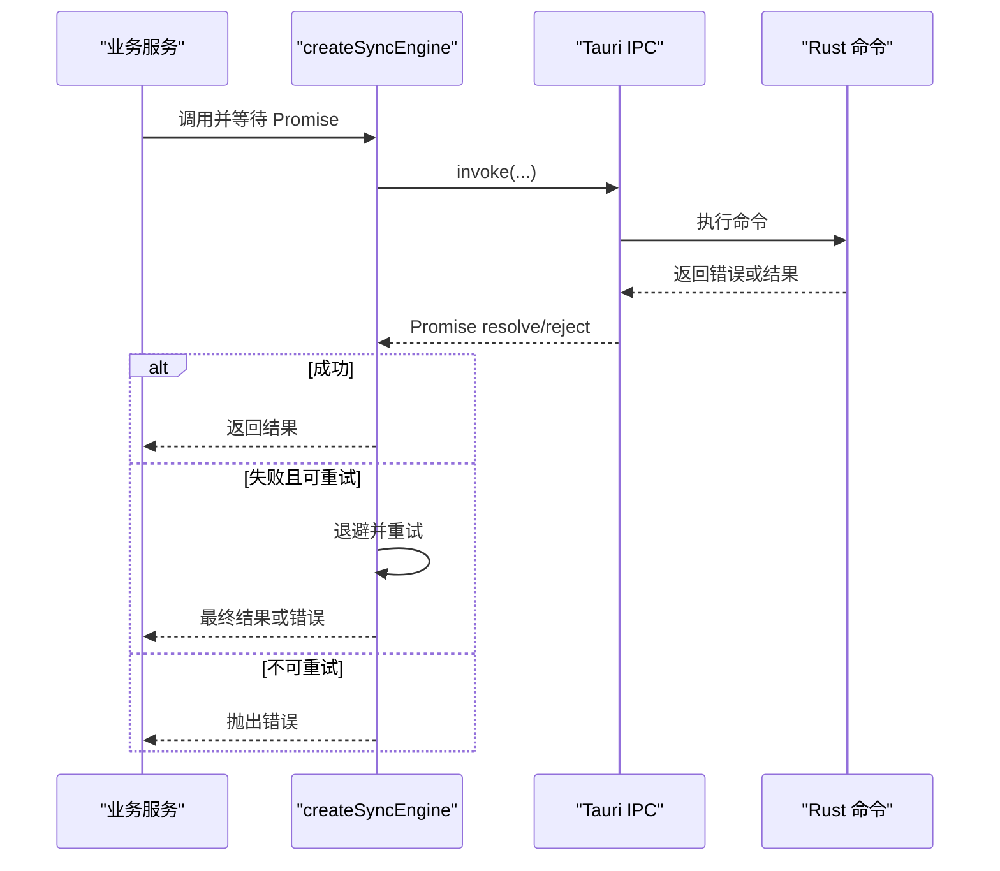
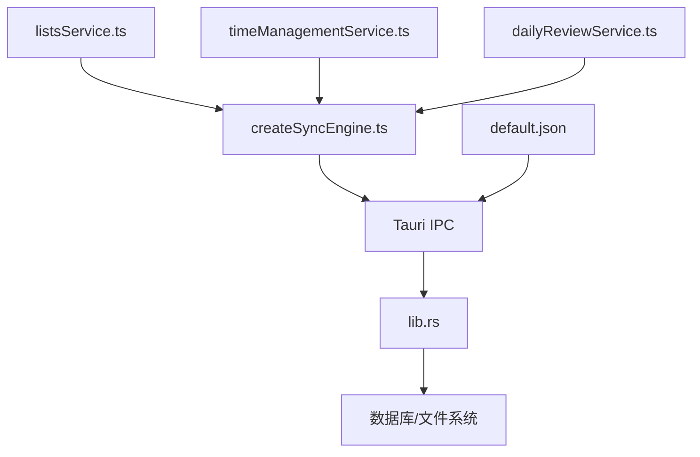

# 前后端通信机制

<cite>
**本文引用的文件**
- [src/lib/createSyncEngine.ts](file://src/lib/createSyncEngine.ts)
- [src/lib/createSyncEngine.test.ts](file://src/lib/createSyncEngine.test.ts)
- [src-tauri/src/lib.rs](file://src-tauri/src/lib.rs)
- [src-tauri/capabilities/default.json](file://src-tauri/capabilities/default.json)
- [src-tauri/tauri.conf.json](file://src-tauri/tauri.conf.json)
- [src/features/lists/listsService.ts](file://src/features/lists/listsService.ts)
- [src/features/time-management/timeManagementService.ts](file://src/features/time-management/timeManagementService.ts)
- [src/features/daily-review/dailyReviewService.ts](file://src/features/daily-review/dailyReviewService.ts)
</cite>

## 目录
1. [简介](#简介)
2. [项目结构](#项目结构)
3. [核心组件](#核心组件)
4. [架构总览](#架构总览)
5. [详细组件分析](#详细组件分析)
6. [依赖关系分析](#依赖关系分析)
7. [性能考虑](#性能考虑)
8. [故障排查指南](#故障排查指南)
9. [结论](#结论)
10. [附录](#附录)

## 简介
本文件面向 FishWorker 应用的前后端通信机制，重点说明：
- Tauri IPC 的调用与响应流程（前端命令到 Rust 命令）
- createSyncEngine 数据同步引擎的设计（请求队列、重试、状态同步）
- Tauri 权限与安全模型（capabilities 配置）
- 异步通信处理（Promise 封装与错误处理）
- 新增前后端接口的步骤示例
- 性能优化建议与调试技巧

## 项目结构
FishWorker 采用 Tauri 架构：前端基于 React/Vite，后端为 Rust。前后端通过 Tauri 的命令通道进行通信；能力与权限由 capabilities 系统管理。

图表来源
- [src/features/lists/listsService.ts](file://src/features/lists/listsService.ts)
- [src/features/time-management/timeManagementService.ts](file://src/features/time-management/timeManagementService.ts)
- [src/features/daily-review/dailyReviewService.ts](file://src/features/daily-review/dailyReviewService.ts)
- [src/lib/createSyncEngine.ts](file://src/lib/createSyncEngine.ts)
- [src-tauri/src/lib.rs](file://src-tauri/src/lib.rs)
- [src-tauri/capabilities/default.json](file://src-tauri/capabilities/default.json)

章节来源
- [src/lib/createSyncEngine.ts](file://src/lib/createSyncEngine.ts)
- [src-tauri/src/lib.rs](file://src-tauri/src/lib.rs)
- [src-tauri/capabilities/default.json](file://src-tauri/capabilities/default.json)
- [src-tauri/tauri.conf.json](file://src-tauri/tauri.conf.json)
- [src/features/lists/listsService.ts](file://src/features/lists/listsService.ts)
- [src/features/time-management/timeManagementService.ts](file://src/features/time-management/timeManagementService.ts)
- [src/features/daily-review/dailyReviewService.ts](file://src/features/daily-review/dailyReviewService.ts)

## 核心组件
- 前端服务层：各功能域的服务文件负责发起 IPC 调用并返回 Promise。
- 同步引擎 createSyncEngine：集中管理请求队列、重试策略、去重与状态同步。
- Tauri 命令注册：Rust 侧在 lib.rs 中注册命令，供前端通过 invoke 调用。
- 权限与能力：capabilities/default.json 定义前端可使用的命令与资源范围。

章节来源
- [src/lib/createSyncEngine.ts](file://src/lib/createSyncEngine.ts)
- [src-tauri/src/lib.rs](file://src-tauri/src/lib.rs)
- [src-tauri/capabilities/default.json](file://src-tauri/capabilities/default.json)

## 架构总览
下图展示一次典型的前端到后端的通信流程：前端服务调用同步引擎，引擎通过 Tauri IPC 发送命令，Rust 侧处理并返回结果，引擎完成重试与状态同步。

图表来源
- [src/features/lists/listsService.ts](file://src/features/lists/listsService.ts)
- [src/features/time-management/timeManagementService.ts](file://src/features/time-management/timeManagementService.ts)
- [src/features/daily-review/dailyReviewService.ts](file://src/features/daily-review/dailyReviewService.ts)
- [src/lib/createSyncEngine.ts](file://src/lib/createSyncEngine.ts)
- [src-tauri/src/lib.rs](file://src-tauri/src/lib.rs)

## 详细组件分析

### 同步引擎 createSyncEngine
职责
- 统一封装对 Tauri IPC 的调用，提供 Promise 接口。
- 维护请求队列，支持并发控制与顺序执行。
- 实现错误重试（指数退避/固定间隔）、失败降级与状态同步。
- 提供幂等与去重策略，避免重复请求导致的状态不一致。

关键设计点
- 请求入队：将调用包装为任务对象，包含命令名、参数、重试次数、超时、回调等。
- 调度器：按策略（FIFO/LIFO/优先级）出队执行，限制最大并发。
- 重试策略：根据错误类型决定是否重试，结合退避算法与最大重试上限。
- 状态同步：成功时写入本地状态/存储，失败时记录错误并暴露给上层。
- 取消与超时：支持请求级取消与全局超时控制。

图表来源
- [src/lib/createSyncEngine.ts](file://src/lib/createSyncEngine.ts)

章节来源
- [src/lib/createSyncEngine.ts](file://src/lib/createSyncEngine.ts)
- [src/lib/createSyncEngine.test.ts](file://src/lib/createSyncEngine.test.ts)

### Tauri 命令注册与调用
- Rust 侧在 lib.rs 中注册命令，定义命令名与参数/返回值类型。
- 前端通过 Tauri invoke 调用命令，返回 Promise。
- 命令命名建议遵循“模块.动作”风格，便于权限与日志追踪。

图表来源
- [src-tauri/src/lib.rs](file://src-tauri/src/lib.rs)
- [src/features/lists/listsService.ts](file://src/features/lists/listsService.ts)
- [src/features/time-management/timeManagementService.ts](file://src/features/time-management/timeManagementService.ts)
- [src/features/daily-review/dailyReviewService.ts](file://src/features/daily-review/dailyReviewService.ts)

章节来源
- [src-tauri/src/lib.rs](file://src-tauri/src/lib.rs)
- [src/features/lists/listsService.ts](file://src/features/lists/listsService.ts)
- [src/features/time-management/timeManagementService.ts](file://src/features/time-management/timeManagementService.ts)
- [src/features/daily-review/dailyReviewService.ts](file://src/features/daily-review/dailyReviewService.ts)

### 权限与安全模型（capabilities）
- capabilities/default.json 定义前端页面可用的命令、资源与窗口范围。
- 建议最小权限原则：仅开放必要的命令与资源。
- 可通过 tauri.conf.json 指定默认能力集与构建期 schema。

图表来源
- [src-tauri/capabilities/default.json](file://src-tauri/capabilities/default.json)
- [src-tauri/tauri.conf.json](file://src-tauri/tauri.conf.json)

章节来源
- [src-tauri/capabilities/default.json](file://src-tauri/capabilities/default.json)
- [src-tauri/tauri.conf.json](file://src-tauri/tauri.conf.json)

### 异步通信与错误处理
- 前端服务层使用 Promise 封装 IPC 调用，统一捕获异常并转换为领域错误。
- 同步引擎在重试失败后向上抛出结构化错误，便于 UI 提示与埋点。
- 建议在引擎层区分网络/IO 错误与业务错误，以便差异化重试策略。

图表来源
- [src/lib/createSyncEngine.ts](file://src/lib/createSyncEngine.ts)
- [src-tauri/src/lib.rs](file://src-tauri/src/lib.rs)

章节来源
- [src/lib/createSyncEngine.ts](file://src/lib/createSyncEngine.ts)
- [src-tauri/src/lib.rs](file://src-tauri/src/lib.rs)

### 新增前后端通信接口步骤
目标：新增一个“导出列表”的接口，从前端调用 Rust 命令并返回导出结果。

步骤
1. 在 Rust 侧添加命令处理器并在 lib.rs 注册。
   - 参考路径：[src-tauri/src/lib.rs](file://src-tauri/src/lib.rs)
2. 在前端业务服务中封装调用，返回 Promise。
   - 参考路径：[src/features/lists/listsService.ts](file://src/features/lists/listsService.ts)
3. 在 capabilities/default.json 中声明新命令的访问权限。
   - 参考路径：[src-tauri/capabilities/default.json](file://src-tauri/capabilities/default.json)
4. 如需调整默认能力集或构建配置，检查 tauri.conf.json。
   - 参考路径：[src-tauri/tauri.conf.json](file://src-tauri/tauri.conf.json)
5. 在 UI 中调用服务方法，并通过 createSyncEngine 获得可靠的结果与错误。
   - 参考路径：[src/lib/createSyncEngine.ts](file://src/lib/createSyncEngine.ts)

章节来源
- [src-tauri/src/lib.rs](file://src-tauri/src/lib.rs)
- [src/features/lists/listsService.ts](file://src/features/lists/listsService.ts)
- [src-tauri/capabilities/default.json](file://src-tauri/capabilities/default.json)
- [src-tauri/tauri.conf.json](file://src-tauri/tauri.conf.json)
- [src/lib/createSyncEngine.ts](file://src/lib/createSyncEngine.ts)

## 依赖关系分析
- 前端服务依赖同步引擎，同步引擎依赖 Tauri IPC。
- Rust 命令处理器依赖数据库与业务逻辑。
- capabilities 作为安全边界，约束前端可访问的命令集合。

图表来源
- [src/features/lists/listsService.ts](file://src/features/lists/listsService.ts)
- [src/features/time-management/timeManagementService.ts](file://src/features/time-management/timeManagementService.ts)
- [src/features/daily-review/dailyReviewService.ts](file://src/features/daily-review/dailyReviewService.ts)
- [src/lib/createSyncEngine.ts](file://src/lib/createSyncEngine.ts)
- [src-tauri/src/lib.rs](file://src-tauri/src/lib.rs)
- [src-tauri/capabilities/default.json](file://src-tauri/capabilities/default.json)

章节来源
- [src/features/lists/listsService.ts](file://src/features/lists/listsService.ts)
- [src/features/time-management/timeManagementService.ts](file://src/features/time-management/timeManagementService.ts)
- [src/features/daily-review/dailyReviewService.ts](file://src/features/daily-review/dailyReviewService.ts)
- [src/lib/createSyncEngine.ts](file://src/lib/createSyncEngine.ts)
- [src-tauri/src/lib.rs](file://src-tauri/src/lib.rs)
- [src-tauri/capabilities/default.json](file://src-tauri/capabilities/default.json)

## 性能考虑
- 批量合并：将多次小写操作合并为批量命令，减少 IPC 往返。
- 去重与缓存：对相同参数的读操作启用短期缓存，降低重复请求。
- 并发控制：限制最大并发数，避免阻塞主线程与后端资源。
- 增量同步：优先使用增量更新而非全量拉取，减少数据传输。
- 超时与取消：为长耗时操作设置合理超时，并提供取消信号。
- 重试策略：对瞬时错误采用指数退避，避免雪崩效应。

## 故障排查指南
- 确认命令已在 Rust 侧注册且名称一致。
  - 参考路径：[src-tauri/src/lib.rs](file://src-tauri/src/lib.rs)
- 检查 capabilities 是否允许该命令。
  - 参考路径：[src-tauri/capabilities/default.json](file://src-tauri/capabilities/default.json)
- 验证前端服务是否正确封装 Promise 并传递参数。
  - 参考路径：[src/features/lists/listsService.ts](file://src/features/lists/listsService.ts)
- 观察同步引擎的重试与错误分支，定位失败原因。
  - 参考路径：[src/lib/createSyncEngine.ts](file://src/lib/createSyncEngine.ts)
- 使用浏览器控制台与 Tauri 日志输出，核对命令名与参数。
- 针对特定场景编写单元测试，覆盖正常与异常路径。
  - 参考路径：[src/lib/createSyncEngine.test.ts](file://src/lib/createSyncEngine.test.ts)

章节来源
- [src-tauri/src/lib.rs](file://src-tauri/src/lib.rs)
- [src-tauri/capabilities/default.json](file://src-tauri/capabilities/default.json)
- [src/features/lists/listsService.ts](file://src/features/lists/listsService.ts)
- [src/lib/createSyncEngine.ts](file://src/lib/createSyncEngine.ts)
- [src/lib/createSyncEngine.test.ts](file://src/lib/createSyncEngine.test.ts)

## 结论
FishWorker 的前后端通信以 Tauri IPC 为核心，结合 createSyncEngine 实现了可靠的请求队列、重试与状态同步。通过 capabilities 的安全模型，确保最小权限原则。遵循本文的步骤与建议，可快速扩展新的前后端接口并保持系统的稳定性与可维护性。

## 附录
- 术语
  - IPC：进程间通信
  - capabilities：能力集，用于限定前端可访问的资源与命令
  - 幂等：多次执行与单次执行效果一致
- 最佳实践
  - 命令命名清晰、分层明确
  - 错误分类与可观测性（日志、指标）
  - 文档与契约先行（参数/返回值/错误码）