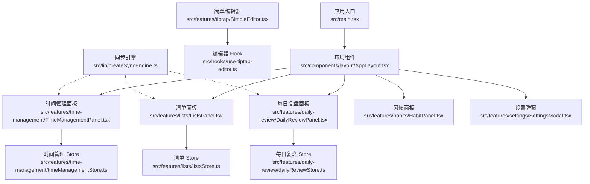
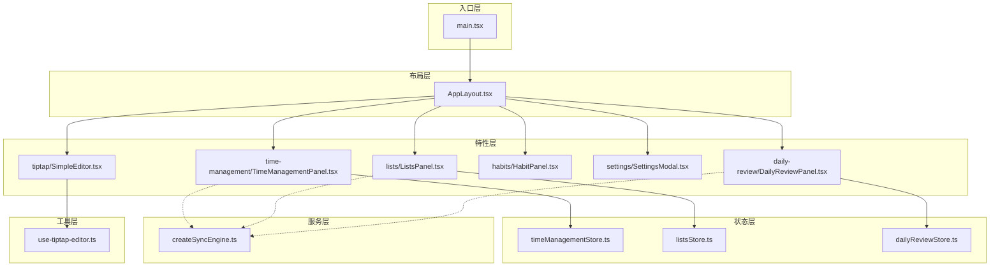
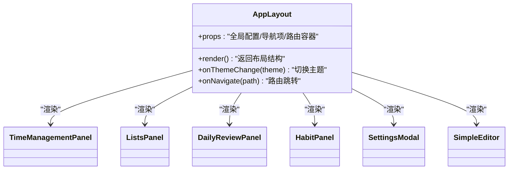
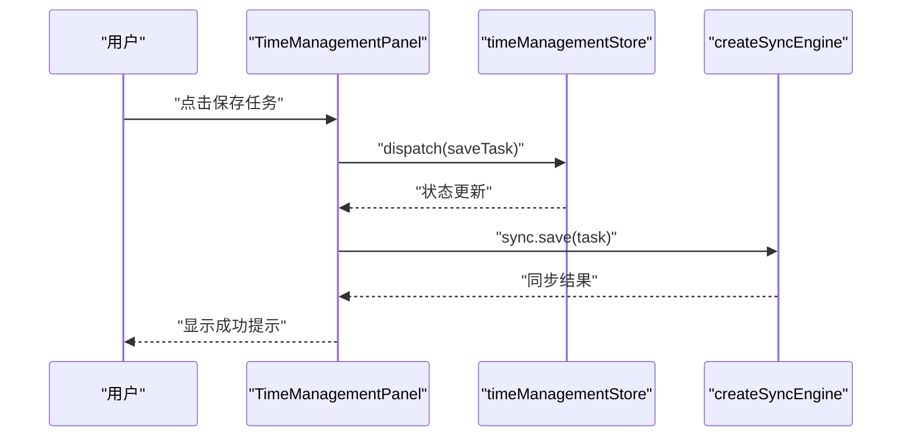
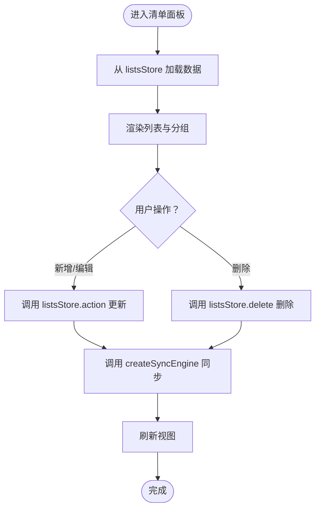
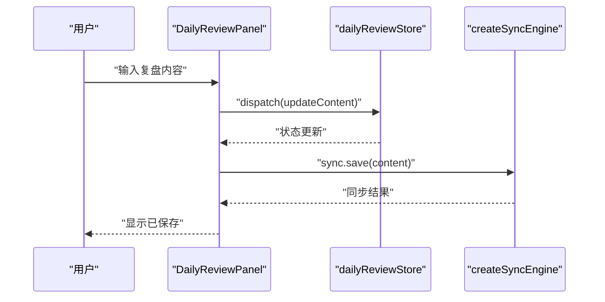
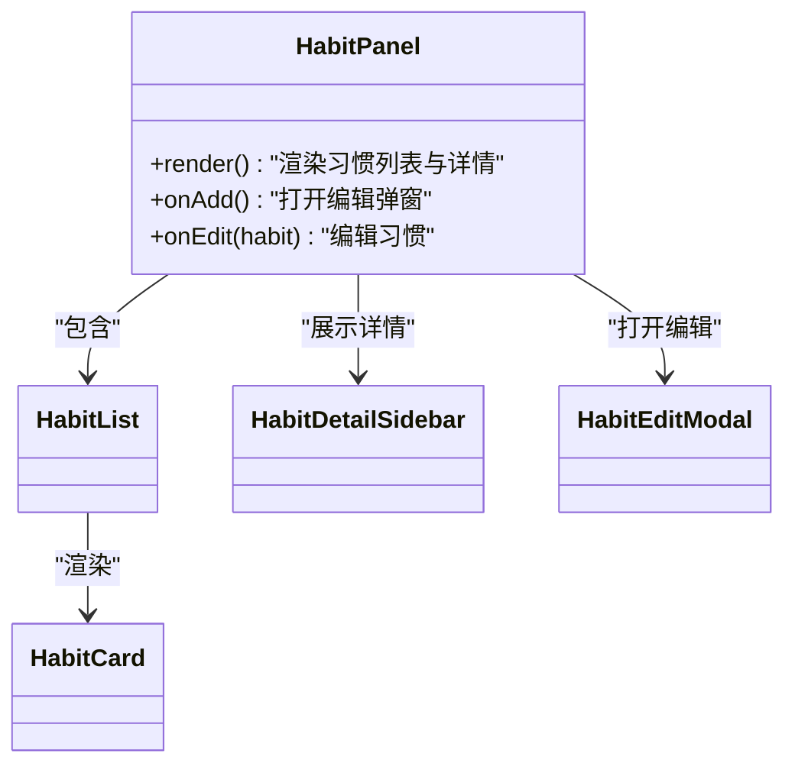
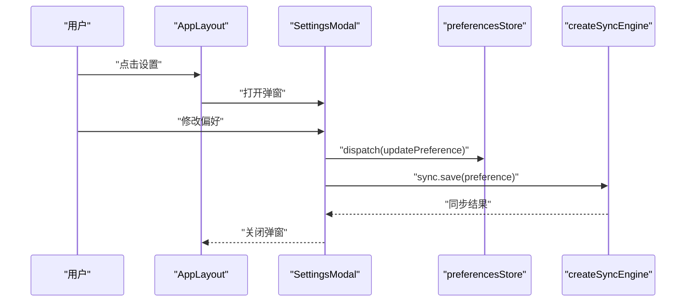
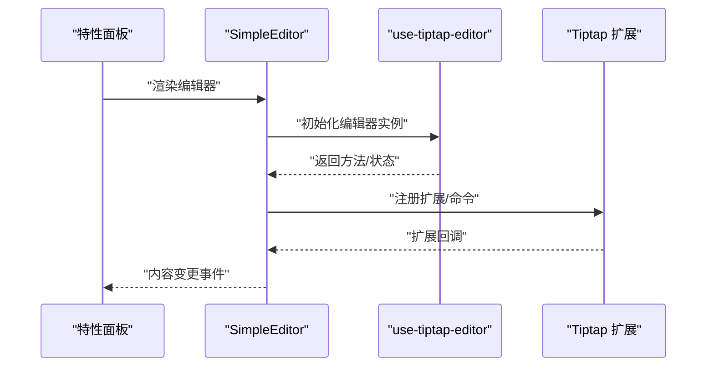
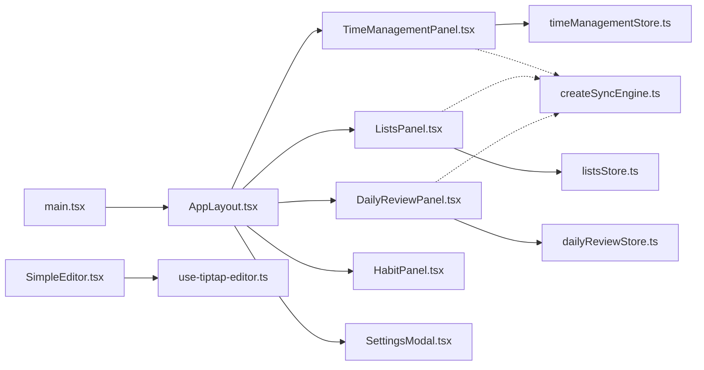

# 前端架构设计

<cite>
**本文引用的文件**   
- [src/main.tsx](file://src/main.tsx)
- [src/components/layout/AppLayout.tsx](file://src/components/layout/AppLayout.tsx)
- [src/components/layout/types.ts](file://src/components/layout/types.ts)
- [src/features/time-management/TimeManagementPanel.tsx](file://src/features/time-management/TimeManagementPanel.tsx)
- [src/features/time-management/timeManagementStore.ts](file://src/features/time-management/timeManagementStore.ts)
- [src/features/lists/ListsPanel.tsx](file://src/features/lists/ListsPanel.tsx)
- [src/features/lists/listsStore.ts](file://src/features/lists/listsStore.ts)
- [src/features/daily-review/DailyReviewPanel.tsx](file://src/features/daily-review/DailyReviewPanel.tsx)
- [src/features/daily-review/dailyReviewStore.ts](file://src/features/daily-review/dailyReviewStore.ts)
- [src/features/habits/HabitPanel.tsx](file://src/features/habits/HabitPanel.tsx)
- [src/features/settings/SettingsModal.tsx](file://src/features/settings/SettingsModal.tsx)
- [src/features/tiptap/SimpleEditor.tsx](file://src/features/tiptap/SimpleEditor.tsx)
- [src/hooks/use-tiptap-editor.ts](file://src/hooks/use-tiptap-editor.ts)
- [src/lib/createSyncEngine.ts](file://src/lib/createSyncEngine.ts)
- [vite.config.js](file://vite.config.js)
- [vite.config.ts](file://vite.config.ts)
- [tsconfig.json](file://tsconfig.json)
- [package.json](file://package.json)
</cite>

## 目录
1. [简介](#简介)
2. [项目结构](#项目结构)
3. [核心组件](#核心组件)
4. [架构总览](#架构总览)
5. [详细组件分析](#详细组件分析)
6. [依赖关系分析](#依赖关系分析)
7. [性能考虑](#性能考虑)
8. [故障排查指南](#故障排查指南)
9. [结论](#结论)
10. [附录](#附录)

## 简介
本文件为 FishWorker 前端应用的架构设计文档，聚焦于基于 React 18 的前端架构模式与工程化实践。内容涵盖：
- Feature-Sliced Design（FSD）组织方式与模块解耦
- 组件层次结构与 AppLayout 布局模式
- 状态管理策略（Zustand Store、Hooks、Context 使用场景）
- 路由导航架构（概念性说明）
- Vite 构建配置与 TypeScript 项目配置
- 模块化导入策略与组件间通信规范
- 性能优化策略、代码分割与懒加载方案
- 组件依赖关系图与模块组织结构图

## 项目结构
FishWorker 前端采用以功能域为核心的分层组织方式，结合通用能力层与基础设施层，形成清晰的职责边界：
- src/components：可复用 UI 组件与布局（如 AppLayout、Tiptap 相关组件）
- src/features：按业务领域划分的特性模块（时间管理、清单、每日复盘、习惯、设置、编辑器等）
- src/hooks：跨特性的通用 Hooks
- src/lib：通用库与工具（如同步引擎）
- src/styles：全局样式与主题变量
- src/types：全局类型声明
- 根级配置：Vite、TypeScript、包管理与入口文件

图表来源
- [src/main.tsx](file://src/main.tsx)
- [src/components/layout/AppLayout.tsx](file://src/components/layout/AppLayout.tsx)
- [src/features/time-management/TimeManagementPanel.tsx](file://src/features/time-management/TimeManagementPanel.tsx)
- [src/features/lists/ListsPanel.tsx](file://src/features/lists/ListsPanel.tsx)
- [src/features/daily-review/DailyReviewPanel.tsx](file://src/features/daily-review/DailyReviewPanel.tsx)
- [src/features/habits/HabitPanel.tsx](file://src/features/habits/HabitPanel.tsx)
- [src/features/settings/SettingsModal.tsx](file://src/features/settings/SettingsModal.tsx)
- [src/features/time-management/timeManagementStore.ts](file://src/features/time-management/timeManagementStore.ts)
- [src/features/lists/listsStore.ts](file://src/features/lists/listsStore.ts)
- [src/features/daily-review/dailyReviewStore.ts](file://src/features/daily-review/dailyReviewStore.ts)
- [src/features/tiptap/SimpleEditor.tsx](file://src/features/tiptap/SimpleEditor.tsx)
- [src/hooks/use-tiptap-editor.ts](file://src/hooks/use-tiptap-editor.ts)
- [src/lib/createSyncEngine.ts](file://src/lib/createSyncEngine.ts)

章节来源
- [src/main.tsx](file://src/main.tsx)
- [src/components/layout/AppLayout.tsx](file://src/components/layout/AppLayout.tsx)
- [src/features/time-management/TimeManagementPanel.tsx](file://src/features/time-management/TimeManagementPanel.tsx)
- [src/features/lists/ListsPanel.tsx](file://src/features/lists/ListsPanel.tsx)
- [src/features/daily-review/DailyReviewPanel.tsx](file://src/features/daily-review/DailyReviewPanel.tsx)
- [src/features/habits/HabitPanel.tsx](file://src/features/habits/HabitPanel.tsx)
- [src/features/settings/SettingsModal.tsx](file://src/features/settings/SettingsModal.tsx)
- [src/features/time-management/timeManagementStore.ts](file://src/features/time-management/timeManagementStore.ts)
- [src/features/lists/listsStore.ts](file://src/features/lists/listsStore.ts)
- [src/features/daily-review/dailyReviewStore.ts](file://src/features/daily-review/dailyReviewStore.ts)
- [src/features/tiptap/SimpleEditor.tsx](file://src/features/tiptap/SimpleEditor.tsx)
- [src/hooks/use-tiptap-editor.ts](file://src/hooks/use-tiptap-editor.ts)
- [src/lib/createSyncEngine.ts](file://src/lib/createSyncEngine.ts)

## 核心组件
- 应用入口与初始化
  - 负责创建 React 根节点、挂载应用、注入全局上下文或 Provider（如有）。
  - 作为整个应用的启动点，统一处理错误边界与全局样式。
- 布局组件 AppLayout
  - 提供页面骨架、侧边栏/顶部导航区域、主内容区与全局操作入口。
  - 通过 props 或 Context 暴露主题、语言、用户信息等横切关注点。
  - 承载路由容器与面包屑、标签页等导航元素（概念性说明）。
- 特性面板（Features）
  - 每个特性模块包含自身的面板、UI 组件、本地状态（Store）、服务与类型定义。
  - 典型特性：时间管理、清单、每日复盘、习惯、设置、编辑器。
- 编辑器与同步
  - SimpleEditor 封装 Tiptap 编辑器能力，use-tiptap-editor 提供编辑器实例与常用操作。
  - createSyncEngine 提供数据同步能力，供各特性按需接入。

章节来源
- [src/main.tsx](file://src/main.tsx)
- [src/components/layout/AppLayout.tsx](file://src/components/layout/AppLayout.tsx)
- [src/components/layout/types.ts](file://src/components/layout/types.ts)
- [src/features/time-management/TimeManagementPanel.tsx](file://src/features/time-management/TimeManagementPanel.tsx)
- [src/features/lists/ListsPanel.tsx](file://src/features/lists/ListsPanel.tsx)
- [src/features/daily-review/DailyReviewPanel.tsx](file://src/features/daily-review/DailyReviewPanel.tsx)
- [src/features/habits/HabitPanel.tsx](file://src/features/habits/HabitPanel.tsx)
- [src/features/settings/SettingsModal.tsx](file://src/features/settings/SettingsModal.tsx)
- [src/features/tiptap/SimpleEditor.tsx](file://src/features/tiptap/SimpleEditor.tsx)
- [src/hooks/use-tiptap-editor.ts](file://src/hooks/use-tiptap-editor.ts)
- [src/lib/createSyncEngine.ts](file://src/lib/createSyncEngine.ts)

## 架构总览
整体架构遵循“入口 -> 布局 -> 特性面板 -> 状态与服务”的分层模型：
- 入口层：应用初始化与挂载
- 布局层：AppLayout 提供全局布局与导航容器
- 特性层：各 features 模块独立实现业务逻辑与 UI
- 状态层：Zustand Store 管理特性内共享状态
- 服务层：createSyncEngine 提供持久化/同步能力
- 工具层：hooks、lib、styles、types 等公共能力

图表来源
- [src/main.tsx](file://src/main.tsx)
- [src/components/layout/AppLayout.tsx](file://src/components/layout/AppLayout.tsx)
- [src/features/time-management/TimeManagementPanel.tsx](file://src/features/time-management/TimeManagementPanel.tsx)
- [src/features/lists/ListsPanel.tsx](file://src/features/lists/ListsPanel.tsx)
- [src/features/daily-review/DailyReviewPanel.tsx](file://src/features/daily-review/DailyReviewPanel.tsx)
- [src/features/habits/HabitPanel.tsx](file://src/features/habits/HabitPanel.tsx)
- [src/features/settings/SettingsModal.tsx](file://src/features/settings/SettingsModal.tsx)
- [src/features/tiptap/SimpleEditor.tsx](file://src/features/tiptap/SimpleEditor.tsx)
- [src/features/time-management/timeManagementStore.ts](file://src/features/time-management/timeManagementStore.ts)
- [src/features/lists/listsStore.ts](file://src/features/lists/listsStore.ts)
- [src/features/daily-review/dailyReviewStore.ts](file://src/features/daily-review/dailyReviewStore.ts)
- [src/hooks/use-tiptap-editor.ts](file://src/hooks/use-tiptap-editor.ts)
- [src/lib/createSyncEngine.ts](file://src/lib/createSyncEngine.ts)

## 详细组件分析

### AppLayout 布局组件
- 设计目标
  - 提供稳定的页面骨架与导航区域，屏蔽特性细节。
  - 通过 props 或 Context 注入全局信息（主题、语言、用户等）。
- 关键职责
  - 渲染侧边栏/顶部导航、主内容区、全局操作入口。
  - 承载路由容器（概念性说明），根据当前路由切换特性面板。
- 扩展点
  - 支持通过插槽或子组件注入自定义头部/侧边栏。
  - 提供统一的错误边界与加载态占位。

图表来源
- [src/components/layout/AppLayout.tsx](file://src/components/layout/AppLayout.tsx)
- [src/components/layout/types.ts](file://src/components/layout/types.ts)
- [src/features/time-management/TimeManagementPanel.tsx](file://src/features/time-management/TimeManagementPanel.tsx)
- [src/features/lists/ListsPanel.tsx](file://src/features/lists/ListsPanel.tsx)
- [src/features/daily-review/DailyReviewPanel.tsx](file://src/features/daily-review/DailyReviewPanel.tsx)
- [src/features/habits/HabitPanel.tsx](file://src/features/habits/HabitPanel.tsx)
- [src/features/settings/SettingsModal.tsx](file://src/features/settings/SettingsModal.tsx)
- [src/features/tiptap/SimpleEditor.tsx](file://src/features/tiptap/SimpleEditor.tsx)

章节来源
- [src/components/layout/AppLayout.tsx](file://src/components/layout/AppLayout.tsx)
- [src/components/layout/types.ts](file://src/components/layout/types.ts)

### 时间管理特性（Time Management）
- 组成
  - 面板：TimeManagementPanel
  - 状态：timeManagementStore（Zustand）
  - 服务：timeManagementService（概念性说明）
  - 类型：timeManagementTypes（概念性说明）
- 交互流程
  - 用户操作触发 store action
  - store 更新状态并触发视图重渲染
  - 可选调用同步引擎进行持久化

图表来源
- [src/features/time-management/TimeManagementPanel.tsx](file://src/features/time-management/TimeManagementPanel.tsx)
- [src/features/time-management/timeManagementStore.ts](file://src/features/time-management/timeManagementStore.ts)
- [src/lib/createSyncEngine.ts](file://src/lib/createSyncEngine.ts)

章节来源
- [src/features/time-management/TimeManagementPanel.tsx](file://src/features/time-management/TimeManagementPanel.tsx)
- [src/features/time-management/timeManagementStore.ts](file://src/features/time-management/timeManagementStore.ts)

### 清单特性（Lists）
- 组成
  - 面板：ListsPanel
  - 状态：listsStore（Zustand）
  - 服务：listsService（概念性说明）
  - 类型：listsTypes（概念性说明）
- 交互流程
  - 列表增删改查由 listsStore 管理
  - 通过 createSyncEngine 与后端或本地存储同步

图表来源
- [src/features/lists/ListsPanel.tsx](file://src/features/lists/ListsPanel.tsx)
- [src/features/lists/listsStore.ts](file://src/features/lists/listsStore.ts)
- [src/lib/createSyncEngine.ts](file://src/lib/createSyncEngine.ts)

章节来源
- [src/features/lists/ListsPanel.tsx](file://src/features/lists/ListsPanel.tsx)
- [src/features/lists/listsStore.ts](file://src/features/lists/listsStore.ts)

### 每日复盘特性（Daily Review）
- 组成
  - 面板：DailyReviewPanel
  - 状态：dailyReviewStore（Zustand）
  - 服务：dailyReviewService（概念性说明）
  - 类型：dailyReviewTypes（概念性说明）
- 交互流程
  - 复盘内容通过 dailyReviewStore 维护
  - 借助 createSyncEngine 实现自动保存与恢复

图表来源
- [src/features/daily-review/DailyReviewPanel.tsx](file://src/features/daily-review/DailyReviewPanel.tsx)
- [src/features/daily-review/dailyReviewStore.ts](file://src/features/daily-review/dailyReviewStore.ts)
- [src/lib/createSyncEngine.ts](file://src/lib/createSyncEngine.ts)

章节来源
- [src/features/daily-review/DailyReviewPanel.tsx](file://src/features/daily-review/DailyReviewPanel.tsx)
- [src/features/daily-review/dailyReviewStore.ts](file://src/features/daily-review/dailyReviewStore.ts)

### 习惯特性（Habits）
- 组成
  - 面板：HabitPanel
  - 组件：HabitCard、HabitDetailSidebar、HabitEditModal、HabitList
  - 类型：habitTypes（概念性说明）
- 交互流程
  - 习惯的创建、编辑、打卡由面板与子组件协作完成
  - 状态可由特性内部 store 或父级传入（视具体实现）

图表来源
- [src/features/habits/HabitPanel.tsx](file://src/features/habits/HabitPanel.tsx)

章节来源
- [src/features/habits/HabitPanel.tsx](file://src/features/habits/HabitPanel.tsx)

### 设置特性（Settings）
- 组成
  - 弹窗：SettingsModal
  - 偏好设置：preferencesStore（概念性说明）
- 交互流程
  - 打开设置弹窗，修改偏好后写入 preferencesStore
  - 通过 createSyncEngine 持久化偏好

图表来源
- [src/features/settings/SettingsModal.tsx](file://src/features/settings/SettingsModal.tsx)
- [src/lib/createSyncEngine.ts](file://src/lib/createSyncEngine.ts)

章节来源
- [src/features/settings/SettingsModal.tsx](file://src/features/settings/SettingsModal.tsx)

### 编辑器特性（Tiptap）
- 组成
  - 编辑器：SimpleEditor
  - Hook：use-tiptap-editor
  - 扩展与 UI：components/tiptap-*（概念性说明）
- 交互流程
  - SimpleEditor 通过 use-tiptap-editor 获取编辑器实例与操作方法
  - 支持插入块、标记、图片上传等扩展能力

图表来源
- [src/features/tiptap/SimpleEditor.tsx](file://src/features/tiptap/SimpleEditor.tsx)
- [src/hooks/use-tiptap-editor.ts](file://src/hooks/use-tiptap-editor.ts)

章节来源
- [src/features/tiptap/SimpleEditor.tsx](file://src/features/tiptap/SimpleEditor.tsx)
- [src/hooks/use-tiptap-editor.ts](file://src/hooks/use-tiptap-editor.ts)

## 依赖关系分析
- 模块耦合
  - 入口 main.tsx 仅依赖布局与特性入口，保持低耦合。
  - AppLayout 作为布局中心，依赖各特性面板，但不直接依赖其内部状态。
  - 特性内部通过 Zustand Store 管理状态，避免跨特性强耦合。
  - createSyncEngine 作为服务被多个特性间接引用，提升复用性。
- 外部依赖
  - React 18 与 ReactDOM
  - Vite 作为构建工具
  - TypeScript 提供类型安全
  - Zustand 用于轻量状态管理（依据 store 命名约定推断）
  - Tauri 集成（通过 src-tauri 目录存在）

图表来源
- [src/main.tsx](file://src/main.tsx)
- [src/components/layout/AppLayout.tsx](file://src/components/layout/AppLayout.tsx)
- [src/features/time-management/TimeManagementPanel.tsx](file://src/features/time-management/TimeManagementPanel.tsx)
- [src/features/lists/ListsPanel.tsx](file://src/features/lists/ListsPanel.tsx)
- [src/features/daily-review/DailyReviewPanel.tsx](file://src/features/daily-review/DailyReviewPanel.tsx)
- [src/features/habits/HabitPanel.tsx](file://src/features/habits/HabitPanel.tsx)
- [src/features/settings/SettingsModal.tsx](file://src/features/settings/SettingsModal.tsx)
- [src/features/time-management/timeManagementStore.ts](file://src/features/time-management/timeManagementStore.ts)
- [src/features/lists/listsStore.ts](file://src/features/lists/listsStore.ts)
- [src/features/daily-review/dailyReviewStore.ts](file://src/features/daily-review/dailyReviewStore.ts)
- [src/features/tiptap/SimpleEditor.tsx](file://src/features/tiptap/SimpleEditor.tsx)
- [src/hooks/use-tiptap-editor.ts](file://src/hooks/use-tiptap-editor.ts)
- [src/lib/createSyncEngine.ts](file://src/lib/createSyncEngine.ts)

章节来源
- [src/main.tsx](file://src/main.tsx)
- [src/components/layout/AppLayout.tsx](file://src/components/layout/AppLayout.tsx)
- [src/features/time-management/TimeManagementPanel.tsx](file://src/features/time-management/TimeManagementPanel.tsx)
- [src/features/lists/ListsPanel.tsx](file://src/features/lists/ListsPanel.tsx)
- [src/features/daily-review/DailyReviewPanel.tsx](file://src/features/daily-review/DailyReviewPanel.tsx)
- [src/features/habits/HabitPanel.tsx](file://src/features/habits/HabitPanel.tsx)
- [src/features/settings/SettingsModal.tsx](file://src/features/settings/SettingsModal.tsx)
- [src/features/time-management/timeManagementStore.ts](file://src/features/time-management/timeManagementStore.ts)
- [src/features/lists/listsStore.ts](file://src/features/lists/listsStore.ts)
- [src/features/daily-review/dailyReviewStore.ts](file://src/features/daily-review/dailyReviewStore.ts)
- [src/features/tiptap/SimpleEditor.tsx](file://src/features/tiptap/SimpleEditor.tsx)
- [src/hooks/use-tiptap-editor.ts](file://src/hooks/use-tiptap-editor.ts)
- [src/lib/createSyncEngine.ts](file://src/lib/createSyncEngine.ts)

## 性能考虑
- 代码分割与懒加载
  - 使用动态 import 对特性面板进行路由级懒加载，减少首屏体积。
  - 将大型第三方库（如 Tiptap 扩展）按需引入。
- 构建优化
  - 启用 Vite 生产环境优化（Tree Shaking、压缩、预构建依赖）。
  - 合理配置分包策略，分离 vendor 与业务代码。
- 渲染优化
  - 在特性面板中使用 React.memo、useMemo、useCallback 减少不必要的重渲染。
  - 长列表虚拟化（如 react-window）提升大数据量渲染性能。
- 网络与同步
  - 合并请求与去抖/节流策略，降低频繁同步带来的开销。
  - 增量同步与冲突解决策略，避免全量覆盖导致的数据不一致。

[本节为通用指导，不直接分析具体文件]

## 故障排查指南
- 常见问题定位
  - 检查入口挂载是否成功，确认 React 根节点与 Provider 是否正确注入。
  - 验证布局组件的路由容器与导航项配置是否匹配。
  - 查看特性 Store 的状态变化与副作用执行顺序。
  - 确认同步引擎的错误回调与重试机制。
- 调试建议
  - 使用浏览器开发者工具的 React DevTools 检查组件树与状态。
  - 在关键路径添加日志输出，记录用户操作与异步结果。
  - 针对编辑器问题，检查扩展注册与命令绑定是否正确。

[本节为通用指导，不直接分析具体文件]

## 结论
FishWorker 前端采用清晰的分层与特性化组织方式，结合 AppLayout 布局模式与 Zustand 状态管理，实现了良好的解耦与可扩展性。通过 Vite 与 TypeScript 的工程化配置，保障了构建效率与类型安全。未来可在路由懒加载、虚拟列表与增量同步等方面进一步优化性能与用户体验。

[本节为总结性内容，不直接分析具体文件]

## 附录

### 构建与配置要点
- Vite 配置
  - 开发服务器与热重载
  - 插件生态（React、TS、CSS 预处理等）
  - 生产构建优化（分包、压缩、资源优化）
- TypeScript 配置
  - 模块解析与路径别名
  - 严格类型检查与编译选项
- 包管理
  - 依赖版本锁定与工作区管理

章节来源
- [vite.config.js](file://vite.config.js)
- [vite.config.ts](file://vite.config.ts)
- [tsconfig.json](file://tsconfig.json)
- [package.json](file://package.json)