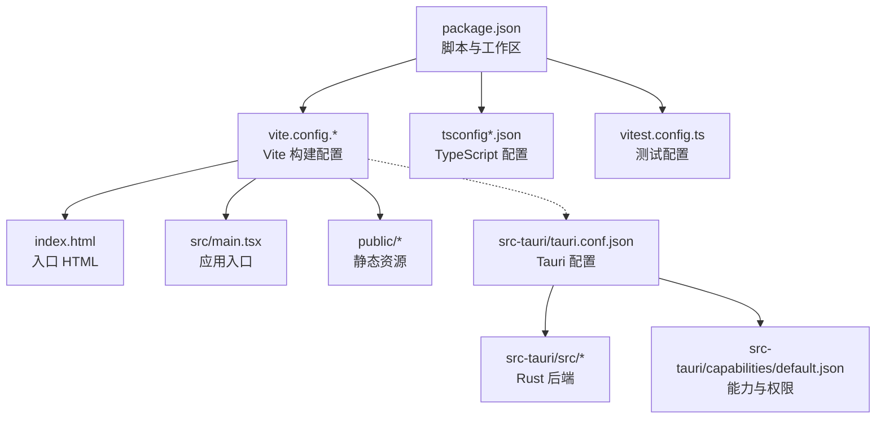
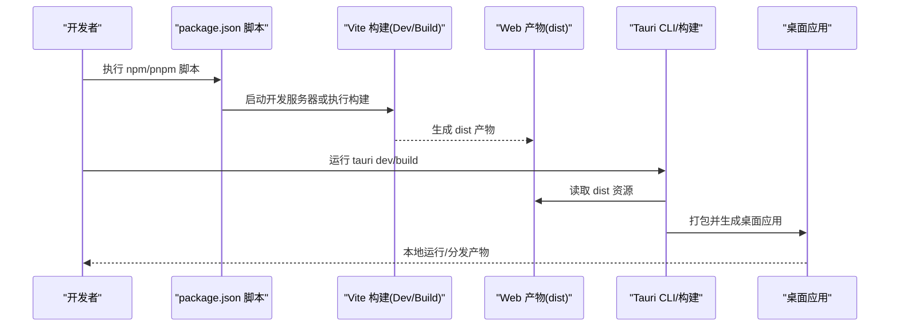
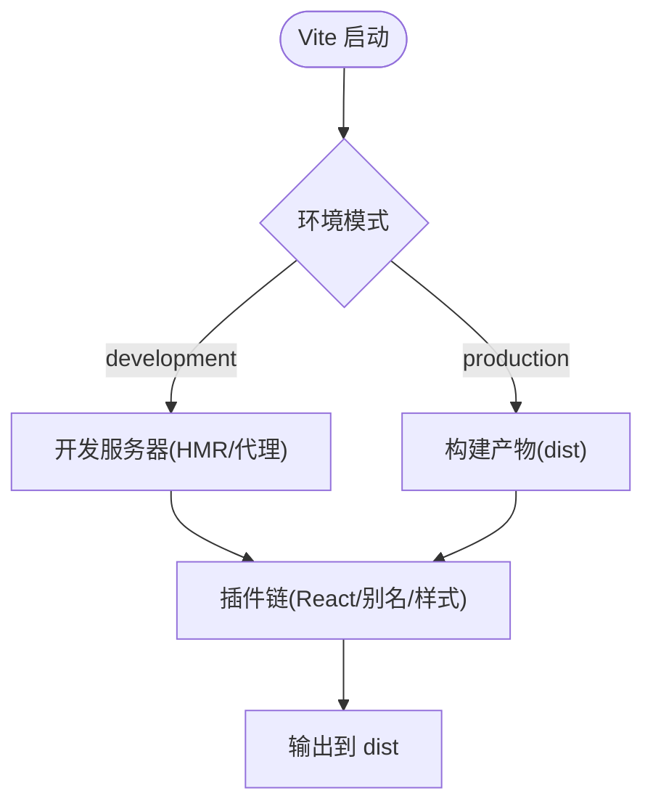
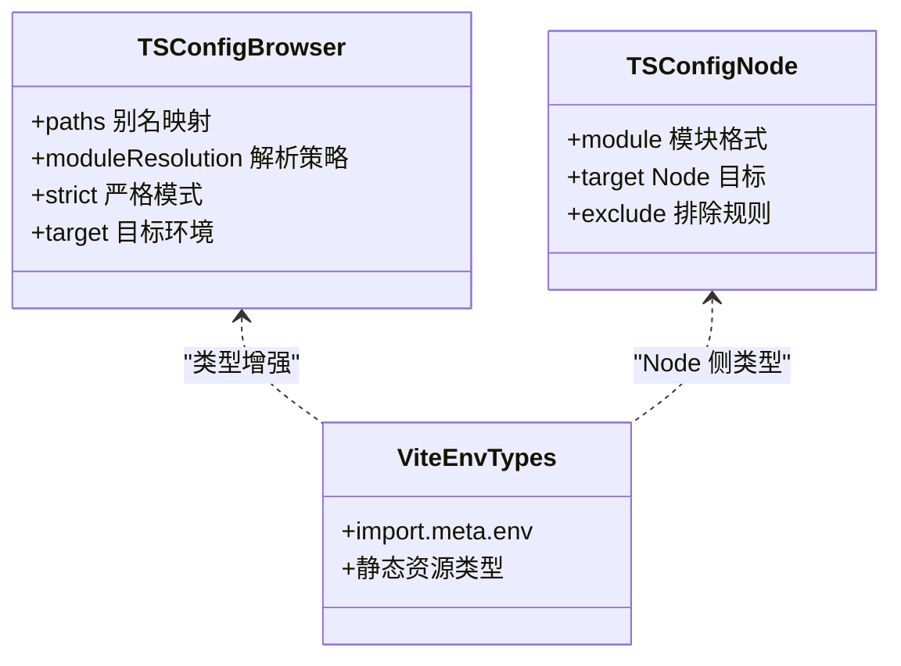
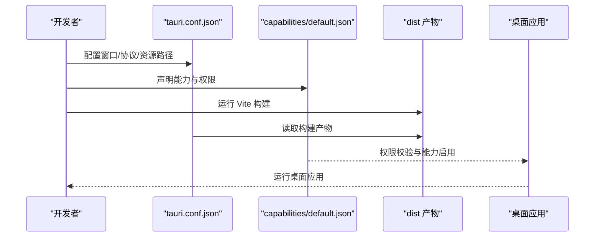
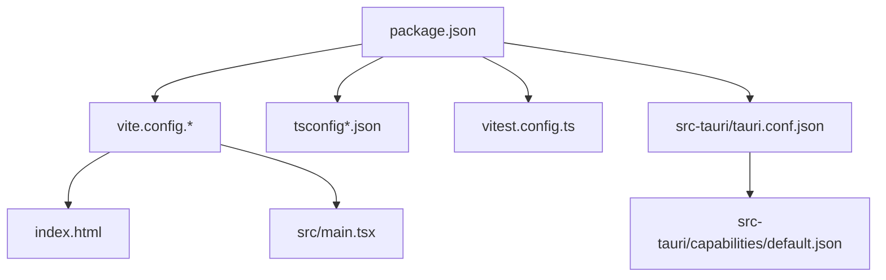

# 构建与配置系统

<cite>
**本文引用的文件**
- [package.json](file://package.json)
- [vite.config.js](file://vite.config.js)
- [vite.config.ts](file://vite.config.ts)
- [tsconfig.json](file://tsconfig.json)
- [tsconfig.node.json](file://tsconfig.node.json)
- [vitest.config.ts](file://vitest.config.ts)
- [index.html](file://index.html)
- [src/main.tsx](file://src/main.tsx)
- [src/vite-env.d.ts](file://src/vite-env.d.ts)
- [src-tauri/tauri.conf.json](file://src-tauri/tauri.conf.json)
- [src-tauri/Cargo.toml](file://src-tauri/Cargo.toml)
- [src-tauri/build.rs](file://src-tauri/build.rs)
- [src-tauri/capabilities/default.json](file://src-tauri/capabilities/default.json)
</cite>

## 目录
1. [简介](#简介)
2. [项目结构](#项目结构)
3. [核心组件](#核心组件)
4. [架构总览](#架构总览)
5. [详细组件分析](#详细组件分析)
6. [依赖分析](#依赖分析)
7. [性能考虑](#性能考虑)
8. [故障排查指南](#故障排查指南)
9. [结论](#结论)
10. [附录](#附录)

## 简介
本文件面向 FishWorker 前端应用的构建与配置系统，聚焦以下目标：
- 基于 Vite 的前端构建配置：开发服务器、生产优化、代码分割策略、资源处理。
- TypeScript 项目配置：路径别名、类型定义、编译选项、模块解析策略。
- 包管理器与脚本命令：pnpm 工作区、脚本编排、依赖管理策略。
- Tauri 应用配置：权限模型、平台特定配置、前后端集成流程。
- 构建流程优化：缓存策略、热重载、调试工具集成。
- 构建性能调优与常见问题解决方案。

## 项目结构
FishWorker 采用“前端 + Tauri 桌面壳”的混合工程组织方式：
- 前端使用 Vite + React + TypeScript 技术栈，通过 pnpm 进行包管理与脚本编排。
- Tauri 作为桌面运行时，负责打包与原生能力调用，前端产物由 Vite 构建输出。
- 测试使用 Vitest，配置文件独立于主构建。

图表来源
- [package.json](file://package.json)
- [vite.config.js](file://vite.config.js)
- [vite.config.ts](file://vite.config.ts)
- [tsconfig.json](file://tsconfig.json)
- [tsconfig.node.json](file://tsconfig.node.json)
- [vitest.config.ts](file://vitest.config.ts)
- [index.html](file://index.html)
- [src/main.tsx](file://src/main.tsx)
- [src-tauri/tauri.conf.json](file://src-tauri/tauri.conf.json)
- [src-tauri/capabilities/default.json](file://src-tauri/capabilities/default.json)

章节来源
- [package.json](file://package.json)
- [vite.config.js](file://vite.config.js)
- [vite.config.ts](file://vite.config.ts)
- [tsconfig.json](file://tsconfig.json)
- [tsconfig.node.json](file://tsconfig.node.json)
- [vitest.config.ts](file://vitest.config.ts)
- [index.html](file://index.html)
- [src/main.tsx](file://src/main.tsx)
- [src-tauri/tauri.conf.json](file://src-tauri/tauri.conf.json)
- [src-tauri/capabilities/default.json](file://src-tauri/capabilities/default.json)

## 核心组件
本节概述构建系统的核心构件及其职责：
- 包管理与脚本：package.json 中定义工作区、脚本命令（开发、构建、预览、测试等），以及依赖版本约束。
- Vite 构建配置：vite.config.js/ts 提供开发服务器、插件链、构建产物、资源处理、代理与优化策略。
- TypeScript 配置：tsconfig.json 与 tsconfig.node.json 分别用于浏览器与 Node 环境，包含路径别名、模块解析、严格模式等。
- 测试配置：vitest.config.ts 定义测试运行器、覆盖率、全局设置等。
- 入口与类型声明：index.html 为页面入口；src/main.tsx 为应用启动点；src/vite-env.d.ts 扩展 Vite 类型。
- Tauri 集成：src-tauri/tauri.conf.json 定义窗口、协议、资源路径、能力与权限；Cargo.toml 描述 Rust 依赖；build.rs 参与构建期逻辑。

章节来源
- [package.json](file://package.json)
- [vite.config.js](file://vite.config.js)
- [vite.config.ts](file://vite.config.ts)
- [tsconfig.json](file://tsconfig.json)
- [tsconfig.node.json](file://tsconfig.node.json)
- [vitest.config.ts](file://vitest.config.ts)
- [index.html](file://index.html)
- [src/main.tsx](file://src/main.tsx)
- [src/vite-env.d.ts](file://src/vite-env.d.ts)
- [src-tauri/tauri.conf.json](file://src-tauri/tauri.conf.json)
- [src-tauri/Cargo.toml](file://src-tauri/Cargo.toml)
- [src-tauri/build.rs](file://src-tauri/build.rs)
- [src-tauri/capabilities/default.json](file://src-tauri/capabilities/default.json)

## 架构总览
下图展示从开发者执行脚本到最终桌面应用产物的端到端流程，包括 Vite 构建、Tauri 打包与权限生效。

图表来源
- [package.json](file://package.json)
- [vite.config.js](file://vite.config.js)
- [vite.config.ts](file://vite.config.ts)
- [src-tauri/tauri.conf.json](file://src-tauri/tauri.conf.json)

## 详细组件分析

### Vite 构建配置
- 开发服务器
  - 端口与主机：可配置监听地址与端口，便于多进程并行开发与跨设备调试。
  - 热更新：默认启用 HMR，结合 React Fast Refresh 提升编辑体验。
  - 代理：支持将 API 请求转发至后端服务，解决开发阶段跨域问题。
- 构建与优化
  - 输出目录：通常输出到 dist，供 Tauri 消费。
  - 代码分割：按路由或大依赖自动拆分 chunk，减少首屏体积。
  - 压缩与 Tree-shaking：生产构建开启 JS/CSS 压缩与无用代码剔除。
  - 资源处理：图片、字体、SVG 等资源内联或外链，按需优化。
- 插件生态
  - React 插件：提供 JSX/TSX 支持与快速刷新。
  - 路径别名：配合 tsconfig paths 实现短路径导入。
  - 自定义插件：可按需注入环境变量、预处理器、资源转换等。

图表来源
- [vite.config.js](file://vite.config.js)
- [vite.config.ts](file://vite.config.ts)

章节来源
- [vite.config.js](file://vite.config.js)
- [vite.config.ts](file://vite.config.ts)

### TypeScript 项目配置
- 双配置分离
  - tsconfig.json：浏览器端 TS 编译选项、路径别名、模块解析、严格模式。
  - tsconfig.node.json：Node 侧（含 Vite 配置）编译选项，避免与浏览器环境冲突。
- 路径别名
  - 通过 baseUrl 与 paths 配置短路径映射，统一导入风格，提升可读性与维护性。
- 模块解析
  - 指定 moduleResolution 与 target，确保与 Vite 和现代浏览器兼容。
- 类型声明
  - src/vite-env.d.ts 扩展 Vite 内置类型（如 import.meta.env、静态资源类型）。
  - 第三方库若缺少类型，可通过 d.ts 文件或 @types 包补充。

图表来源
- [tsconfig.json](file://tsconfig.json)
- [tsconfig.node.json](file://tsconfig.node.json)
- [src/vite-env.d.ts](file://src/vite-env.d.ts)

章节来源
- [tsconfig.json](file://tsconfig.json)
- [tsconfig.node.json](file://tsconfig.node.json)
- [src/vite-env.d.ts](file://src/vite-env.d.ts)

### 包管理器与脚本命令
- 包管理器
  - 使用 pnpm 进行依赖安装与脚本执行，具备工作区与锁文件优势。
  - pnpm-workspace.yaml 定义工作区范围（如有子包）。
- 脚本命令
  - 开发：启动 Vite 开发服务器，启用热重载与调试。
  - 构建：执行生产构建，输出到 dist。
  - 预览：本地预览构建产物。
  - 测试：运行 Vitest，支持单测与覆盖率统计。
  - Tauri：封装 tauri dev/build 命令，简化桌面端开发流程。
- 依赖管理策略
  - 锁定版本与一致性：通过 pnpm-lock.yaml 保证团队一致。
  - 依赖分类：区分 dependencies 与 devDependencies，减少生产体积。
  - 外部依赖治理：对大型库采用按需引入或动态加载。

章节来源
- [package.json](file://package.json)
- [pnpm-workspace.yaml](file://pnpm-workspace.yaml)

### 测试配置（Vitest）
- 运行器与匹配器：配置测试框架、断言库与测试文件匹配规则。
- 覆盖率：集成 istanbul 或 v8 覆盖率报告，便于质量度量。
- 全局设置：模拟 DOM、环境变量、第三方模块等。

章节来源
- [vitest.config.ts](file://vitest.config.ts)

### 入口与类型声明
- index.html：页面模板，注入 Vite 生成的脚本与样式。
- src/main.tsx：应用初始化、根组件挂载、错误边界与全局状态初始化。
- src/vite-env.d.ts：扩展 Vite 类型，使 import.meta.env 与静态资源导入具备类型提示。

章节来源
- [index.html](file://index.html)
- [src/main.tsx](file://src/main.tsx)
- [src/vite-env.d.ts](file://src/vite-env.d.ts)

### Tauri 应用配置与权限
- tauri.conf.json
  - 窗口与协议：定义窗口尺寸、标题、协议白名单、资源路径。
  - 前端资源：指向 Vite 构建产物目录（通常为 dist）。
  - 平台特定配置：针对不同操作系统定制行为与图标。
- capabilities/default.json
  - 能力与权限：声明应用所需的能力（如文件系统、网络、数据库访问等），并在打包时生效。
- Cargo.toml 与 build.rs
  - Cargo.toml：声明 Rust 依赖与特性开关。
  - build.rs：在构建期执行预处理逻辑（如生成代码、拷贝资源）。

图表来源
- [src-tauri/tauri.conf.json](file://src-tauri/tauri.conf.json)
- [src-tauri/capabilities/default.json](file://src-tauri/capabilities/default.json)
- [src-tauri/Cargo.toml](file://src-tauri/Cargo.toml)
- [src-tauri/build.rs](file://src-tauri/build.rs)

章节来源
- [src-tauri/tauri.conf.json](file://src-tauri/tauri.conf.json)
- [src-tauri/capabilities/default.json](file://src-tauri/capabilities/default.json)
- [src-tauri/Cargo.toml](file://src-tauri/Cargo.toml)
- [src-tauri/build.rs](file://src-tauri/build.rs)

## 依赖分析
下图展示关键构建与运行依赖之间的关系：

图表来源
- [package.json](file://package.json)
- [vite.config.js](file://vite.config.js)
- [vite.config.ts](file://vite.config.ts)
- [tsconfig.json](file://tsconfig.json)
- [tsconfig.node.json](file://tsconfig.node.json)
- [vitest.config.ts](file://vitest.config.ts)
- [index.html](file://index.html)
- [src/main.tsx](file://src/main.tsx)
- [src-tauri/tauri.conf.json](file://src-tauri/tauri.conf.json)
- [src-tauri/capabilities/default.json](file://src-tauri/capabilities/default.json)

章节来源
- [package.json](file://package.json)
- [vite.config.js](file://vite.config.js)
- [vite.config.ts](file://vite.config.ts)
- [tsconfig.json](file://tsconfig.json)
- [tsconfig.node.json](file://tsconfig.node.json)
- [vitest.config.ts](file://vitest.config.ts)
- [index.html](file://index.html)
- [src/main.tsx](file://src/main.tsx)
- [src-tauri/tauri.conf.json](file://src-tauri/tauri.conf.json)
- [src-tauri/capabilities/default.json](file://src-tauri/capabilities/default.json)

## 性能考虑
- 构建速度优化
  - 增量构建：利用 Vite 的 ESBuild 预构建与缓存，缩短冷启动时间。
  - 并行化：合理拆分任务，避免阻塞型操作。
  - 依赖预构建：将大型依赖纳入预构建列表，减少首次构建耗时。
- 产物体积优化
  - 代码分割：按路由或功能模块拆分，降低首屏负载。
  - 资源优化：图片压缩、字体子集化、SVG 内联策略。
  - 移除冗余：Tree-shaking 与死代码消除。
- 运行时性能
  - 懒加载：按需加载重型组件与编辑器扩展。
  - 缓存策略：HTTP 缓存与 Service Worker（如需离线能力）。
- 调试与监控
  - Source Map：开发环境启用，生产环境按需关闭或隐藏。
  - 日志与埋点：分级输出，避免影响性能。

[本节为通用指导，不直接分析具体文件]

## 故障排查指南
- 开发服务器无法启动
  - 检查端口占用与主机绑定配置。
  - 确认代理规则与后端服务可达性。
- 热重载不生效
  - 确认 React Fast Refresh 插件已启用。
  - 检查文件变更是否被忽略或路径别名导致解析失败。
- 构建失败或产物异常
  - 核对 TypeScript 配置与模块解析策略。
  - 检查资源路径与 public 目录内容。
- Tauri 打包问题
  - 验证 tauri.conf.json 的资源路径与协议白名单。
  - 检查 capabilities/default.json 的权限声明与实际需求是否匹配。
- 类型错误与类型缺失
  - 补充 src/vite-env.d.ts 类型声明。
  - 为第三方库添加 @types 或手写 d.ts。

章节来源
- [vite.config.js](file://vite.config.js)
- [vite.config.ts](file://vite.config.ts)
- [tsconfig.json](file://tsconfig.json)
- [tsconfig.node.json](file://tsconfig.node.json)
- [src/vite-env.d.ts](file://src/vite-env.d.ts)
- [src-tauri/tauri.conf.json](file://src-tauri/tauri.conf.json)
- [src-tauri/capabilities/default.json](file://src-tauri/capabilities/default.json)

## 结论
FishWorker 的构建与配置系统以 Vite 为核心，结合 TypeScript 与 pnpm 形成高效的前端工程体系；Tauri 作为桌面壳完成打包与权限控制。通过合理的代码分割、资源优化与缓存策略，可在开发体验与生产性能之间取得平衡。建议持续完善类型声明、权限最小化与构建流水线，以提升可维护性与交付质量。

[本节为总结性内容，不直接分析具体文件]

## 附录
- 常用命令参考
  - 开发：执行 package.json 中的开发脚本。
  - 构建：执行生产构建脚本。
  - 预览：本地预览构建产物。
  - 测试：运行 Vitest 测试套件。
  - Tauri：使用封装脚本运行 tauri dev/build。
- 最佳实践
  - 保持 tsconfig 与 vite 配置的一致性。
  - 使用路径别名统一导入风格。
  - 按需引入与懒加载重型依赖。
  - 最小化 Tauri 权限，遵循安全原则。

[本节为补充信息，不直接分析具体文件]