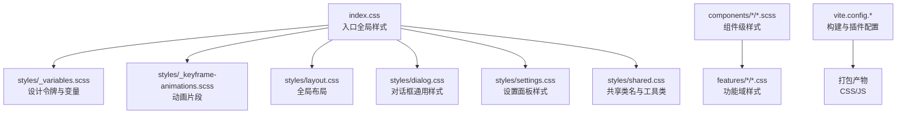
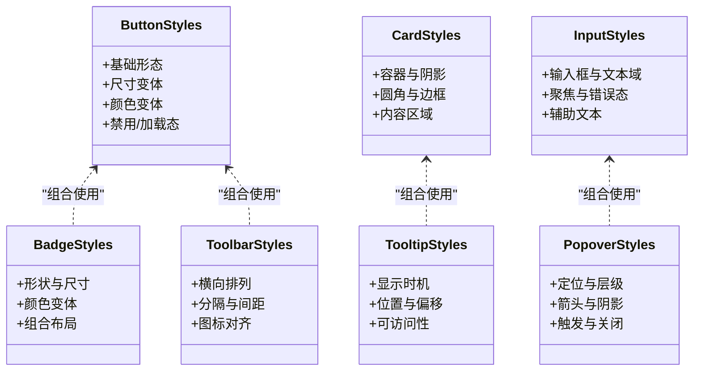
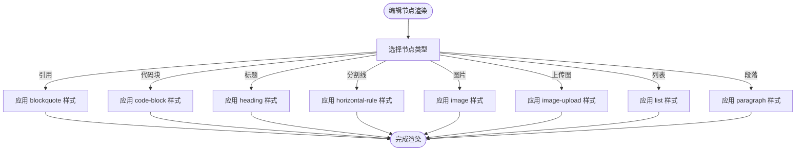
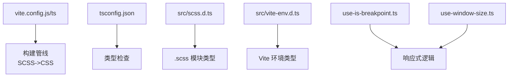

# 样式系统与主题

<cite>
**本文引用的文件**   
- [src/styles/_variables.scss](file://src/styles/_variables.scss)
- [src/styles/_keyframe-animations.scss](file://src/styles/_keyframe-animations.scss)
- [src/index.css](file://src/index.css)
- [src/styles/layout.css](file://src/styles/layout.css)
- [src/styles/dialog.css](file://src/styles/dialog.css)
- [src/styles/settings.css](file://src/styles/settings.css)
- [src/styles/shared.css](file://src/styles/shared.css)
- [vite.config.js](file://vite.config.js)
- [vite.config.ts](file://vite.config.ts)
- [package.json](file://package.json)
- [tsconfig.json](file://tsconfig.json)
- [src/scss.d.ts](file://src/scss.d.ts)
- [src/vite-env.d.ts](file://src/vite-env.d.ts)
- [src/components/tiptap-node/blockquote-node.scss](file://src/components/tiptap-node/blockquote-node.scss)
- [src/components/tiptap-node/code-block-node.scss](file://src/components/tiptap-node/code-block-node.scss)
- [src/components/tiptap-node/heading-node.scss](file://src/components/tiptap-node/heading-node.scss)
- [src/components/tiptap-node/horizontal-rule-node.scss](file://src/components/tiptap-node/horizontal-rule-node.scss)
- [src/components/tiptap-node/image-node.scss](file://src/components/tiptap-node/image-node.scss)
- [src/components/tiptap-node/image-upload-node.scss](file://src/components/tiptap-node/image-upload-node.scss)
- [src/components/tiptap-node/list-node.scss](file://src/components/tiptap-node/list-node.scss)
- [src/components/tiptap-node/paragraph-node.scss](file://src/components/tiptap-node/paragraph-node.scss)
- [src/components/tiptap-ui-primitive/badge-colors.scss](file://src/components/tiptap-ui-primitive/badge-colors.scss)
- [src/components/tiptap-ui-primitive/badge-group.scss](file://src/components/tiptap-ui-primitive/badge-group.scss)
- [src/components/tiptap-ui-primitive/badge.scss](file://src/components/tiptap-ui-primitive/badge.scss)
- [src/components/tiptap-ui-primitive/button-colors.scss](file://src/components/tiptap-ui-primitive/button-colors.scss)
- [src/components/tiptap-ui-primitive/button-group.scss](file://src/components/tiptap-ui-primitive/button-group.scss)
- [src/components/tiptap-ui-primitive/button.scss](file://src/components/tiptap-ui-primitive/button.scss)
- [src/components/tiptap-ui-primitive/card.scss](file://src/components/tiptap-ui-primitive/card.scss)
- [src/components/tiptap-ui-primitive/dropdown-menu.scss](file://src/components/tiptap-ui-primitive/dropdown-menu.scss)
- [src/components/tiptap-ui-primitive/input.scss](file://src/components/tiptap-ui-primitive/input.scss)
- [src/components/tiptap-ui-primitive/popover.scss](file://src/components/tiptap-ui-primitive/popover.scss)
- [src/components/tiptap-ui-primitive/separator.scss](file://src/components/tiptap-ui-primitive/separator.scss)
- [src/components/tiptap-ui-primitive/toolbar.scss](file://src/components/tiptap-ui-primitive/toolbar.scss)
- [src/components/tiptap-ui-primitive/tooltip.scss](file://src/components/tiptap-ui-primitive/tooltip.scss)
- [src/components/tiptap-templates/simple/simple-editor.scss](file://src/components/tiptap-templates/simple/simple-editor.scss)
- [src/features/lists/lists.css](file://src/features/lists/lists.css)
- [src/features/time-management/timeManagement.css](file://src/features/time-management/timeManagement.css)
- [src/features/daily-review/dailyReview.css](file://src/features/daily-review/dailyReview.css)
- [src/features/habits/HabitPanel.css](file://src/features/habits/HabitPanel.css)
- [src/hooks/use-is-breakpoint.ts](file://src/hooks/use-is-breakpoint.ts)
- [src/hooks/use-window-size.ts](file://src/hooks/use-window-size.ts)
</cite>

## 目录
1. [简介](#简介)
2. [项目结构](#项目结构)
3. [核心组件](#核心组件)
4. [架构总览](#架构总览)
5. [详细组件分析](#详细组件分析)
6. [依赖分析](#依赖分析)
7. [性能考虑](#性能考虑)
8. [故障排查指南](#故障排查指南)
9. [结论](#结论)
10. [附录](#附录)

## 简介
本文件系统化梳理 FishWorker 前端的样式与主题体系，覆盖基于 SCSS 的样式架构、变量管理、混合函数与模块化组织、命名约定；CSS Modules 的使用模式；全局与局部样式的分离策略；响应式设计实现；主题系统（颜色、字体、间距、组件定制）；样式性能优化（压缩、按需加载、隔离）；跨浏览器兼容性与无障碍访问支持；调试工具集成；以及重构与设计系统维护最佳实践。目标是帮助开发者快速理解并高效扩展样式系统。

## 项目结构
FishWorker 前端采用“全局基础 + 功能域 + 组件”的分层组织方式：
- 全局基础样式：位于 src/styles 与根级 index.css，提供布局、对话框、设置面板、共享样式等基础能力。
- 组件样式：按组件粒度拆分，SCSS 与 TSX 就近放置，便于维护与复用。
- 功能域样式：features 下各业务模块以独立 CSS 文件承载领域相关样式。
- 构建配置：Vite 负责 SCSS 编译、CSS 处理与打包；TypeScript 类型声明确保 SCSS 模块可被正确识别。

图表来源
- [src/index.css](file://src/index.css)
- [src/styles/_variables.scss](file://src/styles/_variables.scss)
- [src/styles/_keyframe-animations.scss](file://src/styles/_keyframe-animations.scss)
- [src/styles/layout.css](file://src/styles/layout.css)
- [src/styles/dialog.css](file://src/styles/dialog.css)
- [src/styles/settings.css](file://src/styles/settings.css)
- [src/styles/shared.css](file://src/styles/shared.css)
- [vite.config.js](file://vite.config.js)
- [vite.config.ts](file://vite.config.ts)

章节来源
- [src/index.css](file://src/index.css)
- [src/styles/_variables.scss](file://src/styles/_variables.scss)
- [src/styles/_keyframe-animations.scss](file://src/styles/_keyframe-animations.scss)
- [src/styles/layout.css](file://src/styles/layout.css)
- [src/styles/dialog.css](file://src/styles/dialog.css)
- [src/styles/settings.css](file://src/styles/settings.css)
- [src/styles/shared.css](file://src/styles/shared.css)
- [vite.config.js](file://vite.config.js)
- [vite.config.ts](file://vite.config.ts)

## 核心组件
- 设计令牌与变量中心：通过 SCSS 变量集中管理颜色、字体、间距、圆角、阴影等基础值，供全局与组件引用。
- 动画片段：将常用过渡与关键帧动画抽离为可复用片段，避免重复定义。
- 全局布局与共享样式：统一页面骨架、栅格、对齐、排版与通用工具类，保证一致性。
- 组件原子样式：在 tiptap-ui-primitive 中按按钮、卡片、输入、弹出层等原子组件拆分样式，配合颜色变体与组合样式，形成稳定的 UI 基座。
- 编辑器节点样式：tiptap-node 下的每个节点对应一个 SCSS 文件，遵循“一节点一样式”的解耦原则。
- 功能域样式：各 features 目录内以独立 CSS 文件承载业务专属样式，避免污染全局。

章节来源
- [src/styles/_variables.scss](file://src/styles/_variables.scss)
- [src/styles/_keyframe-animations.scss](file://src/styles/_keyframe-animations.scss)
- [src/styles/shared.css](file://src/styles/shared.css)
- [src/components/tiptap-ui-primitive/button.scss](file://src/components/tiptap-ui-primitive/button.scss)
- [src/components/tiptap-ui-primitive/button-colors.scss](file://src/components/tiptap-ui-primitive/button-colors.scss)
- [src/components/tiptap-ui-primitive/badge.scss](file://src/components/tiptap-ui-primitive/badge.scss)
- [src/components/tiptap-ui-primitive/badge-colors.scss](file://src/components/tiptap-ui-primitive/badge-colors.scss)
- [src/components/tiptap-ui-primitive/card.scss](file://src/components/tiptap-ui-primitive/card.scss)
- [src/components/tiptap-ui-primitive/input.scss](file://src/components/tiptap-ui-primitive/input.scss)
- [src/components/tiptap-ui-primitive/popover.scss](file://src/components/tiptap-ui-primitive/popover.scss)
- [src/components/tiptap-ui-primitive/toolbar.scss](file://src/components/tiptap-ui-primitive/toolbar.scss)
- [src/components/tiptap-ui-primitive/tooltip.scss](file://src/components/tiptap-ui-primitive/tooltip.scss)
- [src/components/tiptap-node/blockquote-node.scss](file://src/components/tiptap-node/blockquote-node.scss)
- [src/components/tiptap-node/code-block-node.scss](file://src/components/tiptap-node/code-block-node.scss)
- [src/components/tiptap-node/heading-node.scss](file://src/components/tiptap-node/heading-node.scss)
- [src/components/tiptap-node/horizontal-rule-node.scss](file://src/components/tiptap-node/horizontal-rule-node.scss)
- [src/components/tiptap-node/image-node.scss](file://src/components/tiptap-node/image-node.scss)
- [src/components/tiptap-node/image-upload-node.scss](file://src/components/tiptap-node/image-upload-node.scss)
- [src/components/tiptap-node/list-node.scss](file://src/components/tiptap-node/list-node.scss)
- [src/components/tiptap-node/paragraph-node.scss](file://src/components/tiptap-node/paragraph-node.scss)
- [src/features/lists/lists.css](file://src/features/lists/lists.css)
- [src/features/time-management/timeManagement.css](file://src/features/time-management/timeManagement.css)
- [src/features/daily-review/dailyReview.css](file://src/features/daily-review/dailyReview.css)
- [src/features/habits/HabitPanel.css](file://src/features/habits/HabitPanel.css)

## 架构总览
样式架构遵循“分层清晰、职责单一、就近耦合”的原则：
- 基础层：变量与动画片段，作为所有样式的唯一事实来源。
- 全局层：布局、对话框、设置面板与共享工具类，提供应用级一致体验。
- 组件层：原子组件与复合组件样式，强调可组合与可定制。
- 功能层：业务特性样式，保持低耦合与高内聚。
- 构建层：Vite 负责 SCSS 编译、CSS 提取与压缩，TS 类型声明保障开发体验。

```mermaid
graph TB
subgraph "基础层"
V["_variables.scss"]
K["_keyframe-animations.scss"]
end
subgraph "全局层"
L["layout.css"]
D["dialog.css"]
S["settings.css"]
SH["shared.css"]
IC["index.css"]
end
subgraph "组件层"
P1["button*.scss"]
P2["badge*.scss"]
P3["card.scss"]
P4["input.scss"]
P5["popover.scss"]
P6["toolbar.scss"]
P7["tooltip.scss"]
N1["blockquote-node.scss"]
N2["code-block-node.scss"]
N3["heading-node.scss"]
N4["horizontal-rule-node.scss"]
N5["image-node.scss"]
N6["image-upload-node.scss"]
N7["list-node.scss"]
N8["paragraph-node.scss"]
end
subgraph "功能层"
F1["lists.css"]
F2["timeManagement.css"]
F3["dailyReview.css"]
F4["HabitPanel.css"]
end
V --> IC
K --> IC
IC --> L
IC --> D
IC --> S
IC --> SH
IC --> P1
IC --> P2
IC --> P3
IC --> P4
IC --> P5
IC --> P6
IC --> P7
IC --> N1
IC --> N2
IC --> N3
IC --> N4
IC --> N5
IC --> N6
IC --> N7
IC --> N8
IC --> F1
IC --> F2
IC --> F3
IC --> F4
```

图表来源
- [src/index.css](file://src/index.css)
- [src/styles/_variables.scss](file://src/styles/_variables.scss)
- [src/styles/_keyframe-animations.scss](file://src/styles/_keyframe-animations.scss)
- [src/styles/layout.css](file://src/styles/layout.css)
- [src/styles/dialog.css](file://src/styles/dialog.css)
- [src/styles/settings.css](file://src/styles/settings.css)
- [src/styles/shared.css](file://src/styles/shared.css)
- [src/components/tiptap-ui-primitive/button.scss](file://src/components/tiptap-ui-primitive/button.scss)
- [src/components/tiptap-ui-primitive/badge.scss](file://src/components/tiptap-ui-primitive/badge.scss)
- [src/components/tiptap-ui-primitive/card.scss](file://src/components/tiptap-ui-primitive/card.scss)
- [src/components/tiptap-ui-primitive/input.scss](file://src/components/tiptap-ui-primitive/input.scss)
- [src/components/tiptap-ui-primitive/popover.scss](file://src/components/tiptap-ui-primitive/popover.scss)
- [src/components/tiptap-ui-primitive/toolbar.scss](file://src/components/tiptap-ui-primitive/toolbar.scss)
- [src/components/tiptap-ui-primitive/tooltip.scss](file://src/components/tiptap-ui-primitive/tooltip.scss)
- [src/components/tiptap-node/blockquote-node.scss](file://src/components/tiptap-node/blockquote-node.scss)
- [src/components/tiptap-node/code-block-node.scss](file://src/components/tiptap-node/code-block-node.scss)
- [src/components/tiptap-node/heading-node.scss](file://src/components/tiptap-node/heading-node.scss)
- [src/components/tiptap-node/horizontal-rule-node.scss](file://src/components/tiptap-node/horizontal-rule-node.scss)
- [src/components/tiptap-node/image-node.scss](file://src/components/tiptap-node/image-node.scss)
- [src/components/tiptap-node/image-upload-node.scss](file://src/components/tiptap-node/image-upload-node.scss)
- [src/components/tiptap-node/list-node.scss](file://src/components/tiptap-node/list-node.scss)
- [src/components/tiptap-node/paragraph-node.scss](file://src/components/tiptap-node/paragraph-node.scss)
- [src/features/lists/lists.css](file://src/features/lists/lists.css)
- [src/features/time-management/timeManagement.css](file://src/features/time-management/timeManagement.css)
- [src/features/daily-review/dailyReview.css](file://src/features/daily-review/dailyReview.css)
- [src/features/habits/HabitPanel.css](file://src/features/habits/HabitPanel.css)

## 详细组件分析

### 变量与主题系统
- 变量中心：_variables.scss 集中定义颜色、字体、间距、圆角、阴影等设计令牌，作为全局与组件样式的唯一来源。
- 主题定制：通过替换变量值或引入多套变量文件，可实现明暗主题或品牌色切换。建议在入口样式中根据数据属性或媒体查询动态注入主题变量。
- 字体规范：在变量中统一定义字族、字号阶梯、行高与字重，确保全应用一致的排版节奏。
- 间距系统：使用统一的间距刻度（如 4px 倍数），在变量中暴露 spacing-* 系列，供组件与布局复用。
- 颜色语义化：区分功能色（成功、警告、错误）、中性色（背景、文本、边框）与状态色，提升可读性与可维护性。

章节来源
- [src/styles/_variables.scss](file://src/styles/_variables.scss)

### 动画与过渡
- 关键帧片段：_keyframe-animations.scss 提供可复用的动画片段，避免重复定义。
- 过渡策略：优先使用 transition 与 transform 提升性能，减少重排与重绘。
- 动效规范：控制时长与缓动曲线，保持一致的交互反馈。

章节来源
- [src/styles/_keyframe-animations.scss](file://src/styles/_keyframe-animations.scss)

### 全局布局与共享样式
- 布局：layout.css 定义页面骨架、侧边栏与主内容区、栅格与对齐规则。
- 对话框：dialog.css 统一弹窗层级、遮罩、尺寸与焦点管理。
- 设置面板：settings.css 提供设置页的基础结构与控件样式。
- 共享类：shared.css 包含通用工具类（如清除浮动、文本溢出、可见性控制等）。

章节来源
- [src/styles/layout.css](file://src/styles/layout.css)
- [src/styles/dialog.css](file://src/styles/dialog.css)
- [src/styles/settings.css](file://src/styles/settings.css)
- [src/styles/shared.css](file://src/styles/shared.css)

### 原子组件样式（tiptap-ui-primitive）
- 按钮：button.scss 定义基础形态，button-colors.scss 管理颜色变体与状态。
- 徽章：badge.scss 与 badge-colors.scss 提供标签与计数展示。
- 卡片：card.scss 封装容器、阴影与圆角。
- 输入：input.scss 定义表单控件、聚焦态与禁用态。
- 弹出层：popover.scss 管理定位、层级与箭头。
- 工具栏：toolbar.scss 提供横向排列与分隔。
- 提示：tooltip.scss 控制显示时机与位置。
- 组合样式：button-group.scss、badge-group.scss 用于组件聚合场景。

图表来源
- [src/components/tiptap-ui-primitive/button.scss](file://src/components/tiptap-ui-primitive/button.scss)
- [src/components/tiptap-ui-primitive/button-colors.scss](file://src/components/tiptap-ui-primitive/button-colors.scss)
- [src/components/tiptap-ui-primitive/badge.scss](file://src/components/tiptap-ui-primitive/badge.scss)
- [src/components/tiptap-ui-primitive/badge-colors.scss](file://src/components/tiptap-ui-primitive/badge-colors.scss)
- [src/components/tiptap-ui-primitive/card.scss](file://src/components/tiptap-ui-primitive/card.scss)
- [src/components/tiptap-ui-primitive/input.scss](file://src/components/tiptap-ui-primitive/input.scss)
- [src/components/tiptap-ui-primitive/popover.scss](file://src/components/tiptap-ui-primitive/popover.scss)
- [src/components/tiptap-ui-primitive/toolbar.scss](file://src/components/tiptap-ui-primitive/toolbar.scss)
- [src/components/tiptap-ui-primitive/tooltip.scss](file://src/components/tiptap-ui-primitive/tooltip.scss)

章节来源
- [src/components/tiptap-ui-primitive/button.scss](file://src/components/tiptap-ui-primitive/button.scss)
- [src/components/tiptap-ui-primitive/button-colors.scss](file://src/components/tiptap-ui-primitive/button-colors.scss)
- [src/components/tiptap-ui-primitive/badge.scss](file://src/components/tiptap-ui-primitive/badge.scss)
- [src/components/tiptap-ui-primitive/badge-colors.scss](file://src/components/tiptap-ui-primitive/badge-colors.scss)
- [src/components/tiptap-ui-primitive/card.scss](file://src/components/tiptap-ui-primitive/card.scss)
- [src/components/tiptap-ui-primitive/input.scss](file://src/components/tiptap-ui-primitive/input.scss)
- [src/components/tiptap-ui-primitive/popover.scss](file://src/components/tiptap-ui-primitive/popover.scss)
- [src/components/tiptap-ui-primitive/toolbar.scss](file://src/components/tiptap-ui-primitive/toolbar.scss)
- [src/components/tiptap-ui-primitive/tooltip.scss](file://src/components/tiptap-ui-primitive/tooltip.scss)

### 编辑器节点样式（tiptap-node）
- 块引用：blockquote-node.scss 定义引用块样式与缩进。
- 代码块：code-block-node.scss 提供语法高亮容器与滚动条样式。
- 标题：heading-node.scss 管理各级标题字号与间距。
- 水平分割线：horizontal-rule-node.scss 控制线条粗细与颜色。
- 图片：image-node.scss 与 image-upload-node.scss 分别处理静态图片与上传态。
- 列表与段落：list-node.scss 与 paragraph-node.scss 统一列表与段落排版。

图表来源
- [src/components/tiptap-node/blockquote-node.scss](file://src/components/tiptap-node/blockquote-node.scss)
- [src/components/tiptap-node/code-block-node.scss](file://src/components/tiptap-node/code-block-node.scss)
- [src/components/tiptap-node/heading-node.scss](file://src/components/tiptap-node/heading-node.scss)
- [src/components/tiptap-node/horizontal-rule-node.scss](file://src/components/tiptap-node/horizontal-rule-node.scss)
- [src/components/tiptap-node/image-node.scss](file://src/components/tiptap-node/image-node.scss)
- [src/components/tiptap-node/image-upload-node.scss](file://src/components/tiptap-node/image-upload-node.scss)
- [src/components/tiptap-node/list-node.scss](file://src/components/tiptap-node/list-node.scss)
- [src/components/tiptap-node/paragraph-node.scss](file://src/components/tiptap-node/paragraph-node.scss)

章节来源
- [src/components/tiptap-node/blockquote-node.scss](file://src/components/tiptap-node/blockquote-node.scss)
- [src/components/tiptap-node/code-block-node.scss](file://src/components/tiptap-node/code-block-node.scss)
- [src/components/tiptap-node/heading-node.scss](file://src/components/tiptap-node/heading-node.scss)
- [src/components/tiptap-node/horizontal-rule-node.scss](file://src/components/tiptap-node/horizontal-rule-node.scss)
- [src/components/tiptap-node/image-node.scss](file://src/components/tiptap-node/image-node.scss)
- [src/components/tiptap-node/image-upload-node.scss](file://src/components/tiptap-node/image-upload-node.scss)
- [src/components/tiptap-node/list-node.scss](file://src/components/tiptap-node/list-node.scss)
- [src/components/tiptap-node/paragraph-node.scss](file://src/components/tiptap-node/paragraph-node.scss)

### 模板与示例样式
- 简单编辑器模板：simple-editor.scss 提供最小可用的编辑器外观，便于快速原型验证。

章节来源
- [src/components/tiptap-templates/simple/simple-editor.scss](file://src/components/tiptap-templates/simple/simple-editor.scss)

### 功能域样式
- 清单：lists.css 管理列表项、分组与拖拽相关样式。
- 时间管理：timeManagement.css 管理四象限视图与任务详情弹窗。
- 每日回顾：dailyReview.css 管理回顾面板与统计区块。
- 习惯：HabitPanel.css 管理习惯卡片与侧边详情。

章节来源
- [src/features/lists/lists.css](file://src/features/lists/lists.css)
- [src/features/time-management/timeManagement.css](file://src/features/time-management/timeManagement.css)
- [src/features/daily-review/dailyReview.css](file://src/features/daily-review/dailyReview.css)
- [src/features/habits/HabitPanel.css](file://src/features/habits/HabitPanel.css)

## 依赖分析
- 构建与类型：
  - Vite 配置文件负责 SCSS 编译与 CSS 处理流程。
  - TypeScript 配置与类型声明确保 .scss 模块导入与类型安全。
- 运行时依赖：
  - hooks 中的断点与窗口尺寸检测可用于响应式逻辑。

图表来源
- [vite.config.js](file://vite.config.js)
- [vite.config.ts](file://vite.config.ts)
- [tsconfig.json](file://tsconfig.json)
- [src/scss.d.ts](file://src/scss.d.ts)
- [src/vite-env.d.ts](file://src/vite-env.d.ts)
- [src/hooks/use-is-breakpoint.ts](file://src/hooks/use-is-breakpoint.ts)
- [src/hooks/use-window-size.ts](file://src/hooks/use-window-size.ts)

章节来源
- [vite.config.js](file://vite.config.js)
- [vite.config.ts](file://vite.config.ts)
- [tsconfig.json](file://tsconfig.json)
- [src/scss.d.ts](file://src/scss.d.ts)
- [src/vite-env.d.ts](file://src/vite-env.d.ts)
- [src/hooks/use-is-breakpoint.ts](file://src/hooks/use-is-breakpoint.ts)
- [src/hooks/use-window-size.ts](file://src/hooks/use-window-size.ts)

## 性能考虑
- CSS 压缩与提取：
  - 生产构建启用 CSS 压缩与去重，减少体积与请求数。
  - 建议开启按需加载与代码分割，仅加载当前路由或组件所需样式。
- 样式隔离：
  - 组件样式就近存放，避免全局污染；必要时使用命名空间或 BEM 风格类名降低冲突风险。
- 资源优化：
  - 合并相近的动画与过渡，减少关键路径上的样式计算。
  - 使用 transform 与 opacity 进行动画，避免触发布局重排。
- 缓存策略：
  - 对静态样式启用强缓存，结合版本哈希更新策略。

[本节为通用指导，不直接分析具体文件]

## 故障排查指南
- SCSS 未生效：
  - 确认 Vite 已配置 SCSS 编译，且 tsconfig 与 scss.d.ts 类型声明正确。
  - 检查 import 路径与模块解析是否匹配。
- 样式冲突：
  - 使用浏览器开发者工具的样式面板查看最终计算样式，定位优先级问题。
  - 缩小作用域，避免过宽的选择器与全局覆盖。
- 主题切换异常：
  - 检查变量注入顺序与覆盖范围，确保主题变量在组件样式之前生效。
- 响应式失效：
  - 核对断点常量与媒体查询条件，结合 use-is-breakpoint 与 use-window-size 输出日志定位。
- 无障碍问题：
  - 检查焦点管理与键盘导航，确保 aria-* 属性与语义化标签正确使用。

章节来源
- [vite.config.js](file://vite.config.js)
- [vite.config.ts](file://vite.config.ts)
- [tsconfig.json](file://tsconfig.json)
- [src/scss.d.ts](file://src/scss.d.ts)
- [src/vite-env.d.ts](file://src/vite-env.d.ts)
- [src/hooks/use-is-breakpoint.ts](file://src/hooks/use-is-breakpoint.ts)
- [src/hooks/use-window-size.ts](file://src/hooks/use-window-size.ts)

## 结论
FishWorker 的样式系统以 SCSS 变量为核心，结合全局基础、组件原子与功能域分层，形成了清晰、可扩展的主题与样式架构。通过合理的模块化组织、命名约定与构建优化，可在保证一致性的同时提升可维护性与性能。建议持续完善设计令牌、强化主题切换机制，并在团队内推广样式规范与审查流程。

[本节为总结性内容，不直接分析具体文件]

## 附录

### 命名约定与模块化组织
- 变量命名：使用语义化前缀（如 color-primary、spacing-md、font-heading-lg）。
- 类名风格：建议使用 BEM 或类似约定，避免深层嵌套与过长选择器。
- 文件组织：组件样式与组件就近放置，全局样式集中在 styles 目录，功能域样式在 features 下独立文件。

[本节为通用指导，不直接分析具体文件]

### 响应式设计实现
- 断点管理：在变量或配置中统一定义断点，配合 use-is-breakpoint 与 use-window-size 进行逻辑判断。
- 流式布局：优先使用弹性布局与网格布局，减少固定宽度。
- 媒体查询：在组件样式中尽量使用相对单位与 min/max 约束，提升适配性。

章节来源
- [src/hooks/use-is-breakpoint.ts](file://src/hooks/use-is-breakpoint.ts)
- [src/hooks/use-window-size.ts](file://src/hooks/use-window-size.ts)

### 无障碍访问支持
- 语义化标签：合理使用 header、main、aside、section 等元素。
- 焦点管理：确保弹窗与菜单的焦点可见与可恢复。
- 对比度与可读性：遵循 WCAG 对比度要求，提供足够的文本与背景对比。
- 键盘导航：为交互组件提供 Tab 与 Enter/Space 操作支持。

[本节为通用指导，不直接分析具体文件]

### 跨浏览器兼容性
- 特性检测：针对新特性（如 grid、container queries）提供降级方案。
- 前缀与回退：在必要处添加厂商前缀或使用构建工具自动处理。
- 测试矩阵：在主流浏览器与移动端进行回归测试，关注差异行为。

[本节为通用指导，不直接分析具体文件]

### 样式调试工具集成
- 浏览器开发者工具：使用 Elements 与 Styles 面板定位样式来源与优先级。
- 可视化断点：利用浏览器设备模拟与断点标记，验证响应式效果。
- 性能面板：观察样式计算与重排开销，优化复杂选择器与动画。

[本节为通用指导，不直接分析具体文件]

### 样式重构指南与设计系统维护最佳实践
- 逐步迁移：从全局样式向组件样式迁移，保持向后兼容。
- 设计令牌治理：定期评审变量与主题，清理废弃值。
- 文档与示例：为关键组件提供样式示例与使用指南。
- 自动化校验：引入 lint 与视觉回归测试，防止样式退化。

[本节为通用指导，不直接分析具体文件]