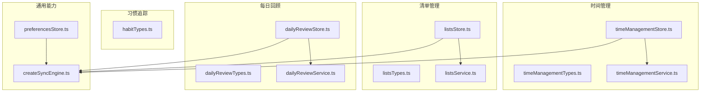
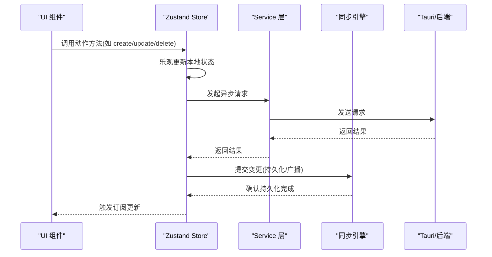
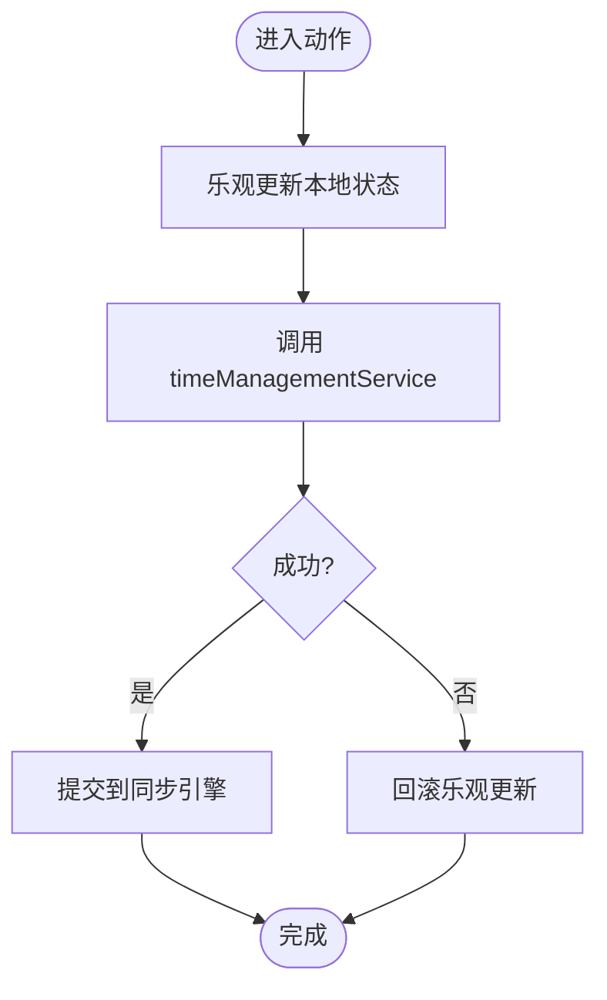
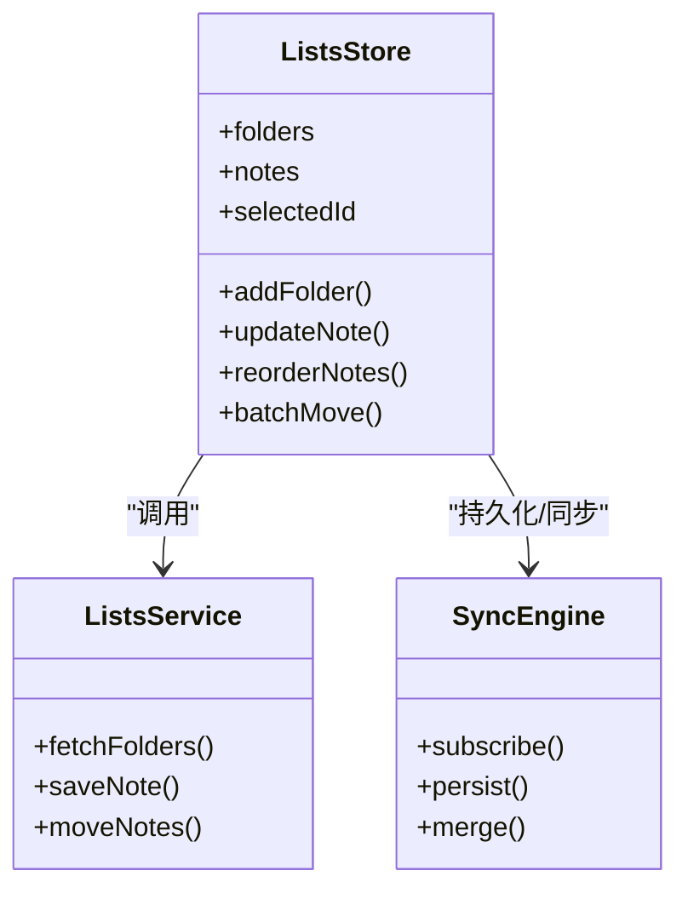
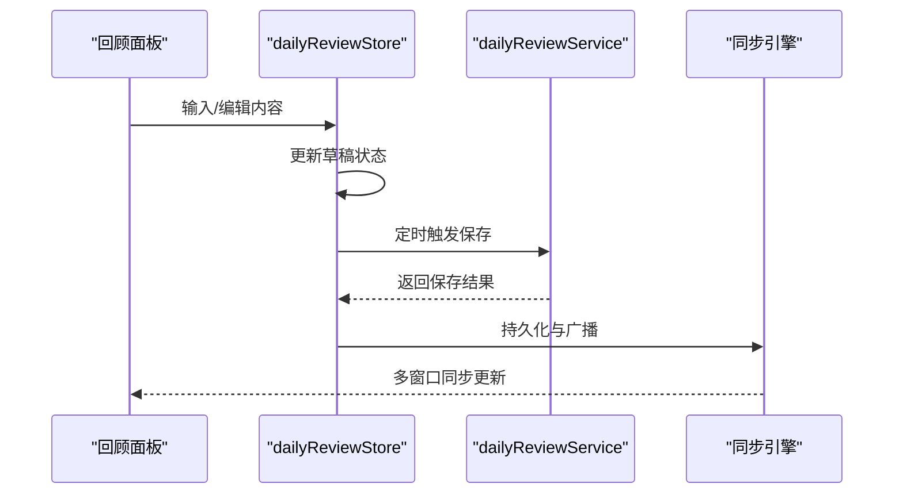
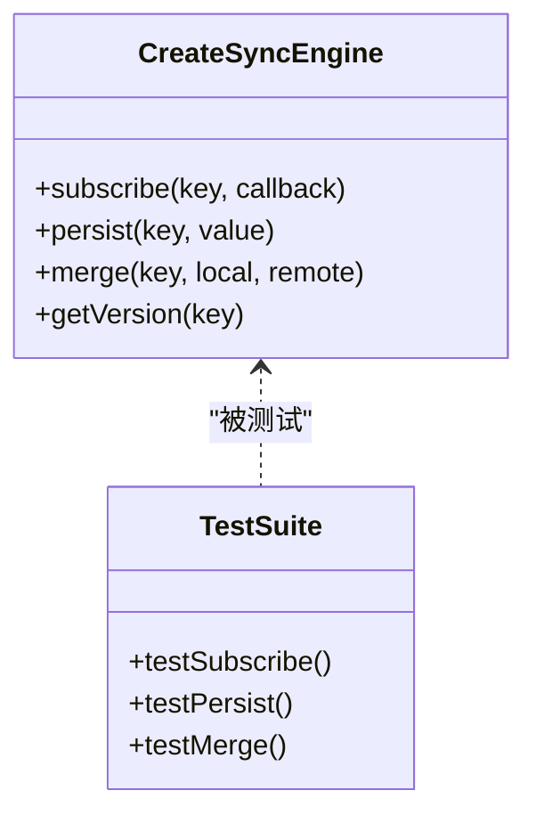
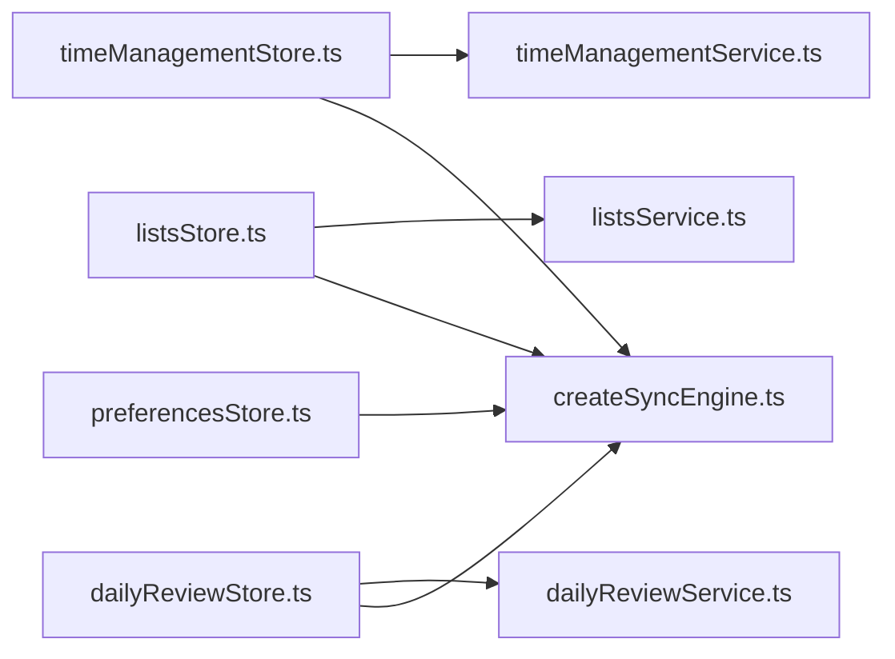

# 状态管理架构

<cite>
**本文引用的文件**   
- [src/features/time-management/timeManagementStore.ts](file://src/features/time-management/timeManagementStore.ts)
- [src/features/time-management/timeManagementTypes.ts](file://src/features/time-management/timeManagementTypes.ts)
- [src/features/time-management/timeManagementService.ts](file://src/features/time-management/timeManagementService.ts)
- [src/features/lists/listsStore.ts](file://src/features/lists/listsStore.ts)
- [src/features/lists/listsTypes.ts](file://src/features/lists/listsTypes.ts)
- [src/features/lists/listsService.ts](file://src/features/lists/listsService.ts)
- [src/features/daily-review/dailyReviewStore.ts](file://src/features/daily-review/dailyReviewStore.ts)
- [src/features/daily-review/dailyReviewTypes.ts](file://src/features/daily-review/dailyReviewTypes.ts)
- [src/features/daily-review/dailyReviewService.ts](file://src/features/daily-review/dailyReviewService.ts)
- [src/features/habits/habitTypes.ts](file://src/features/habits/habitTypes.ts)
- [src/lib/createSyncEngine.ts](file://src/lib/createSyncEngine.ts)
- [src/lib/createSyncEngine.test.ts](file://src/lib/createSyncEngine.test.ts)
- [src/features/settings/preferencesStore.ts](file://src/features/settings/preferencesStore.ts)
</cite>

## 目录
1. [简介](#简介)
2. [项目结构](#项目结构)
3. [核心组件](#核心组件)
4. [架构总览](#架构总览)
5. [详细组件分析](#详细组件分析)
6. [依赖分析](#依赖分析)
7. [性能考虑](#性能考虑)
8. [故障排查指南](#故障排查指南)
9. [结论](#结论)
10. [附录](#附录)

## 简介
本文件面向 FishWorker 前端应用的状态管理，聚焦基于 Zustand 的 Store 设计、状态切片策略与异步操作处理。文档覆盖时间管理、习惯追踪、清单管理与每日回顾四大功能模块的状态模型、持久化机制、同步策略、中间件使用场景、调试工具集成与迁移策略，并给出状态流图、数据更新模式与错误处理机制说明，以及最佳实践与常见陷阱避免指南。

## 项目结构
FishWorker 采用“按功能域组织”的前端结构，每个特性（feature）内部包含 UI 组件、类型定义、服务层与 Zustand Store。跨领域共享的同步引擎位于 lib 目录，设置偏好存储在 settings 中。

图表来源
- [src/features/time-management/timeManagementStore.ts](file://src/features/time-management/timeManagementStore.ts)
- [src/features/time-management/timeManagementTypes.ts](file://src/features/time-management/timeManagementTypes.ts)
- [src/features/time-management/timeManagementService.ts](file://src/features/time-management/timeManagementService.ts)
- [src/features/lists/listsStore.ts](file://src/features/lists/listsStore.ts)
- [src/features/lists/listsTypes.ts](file://src/features/lists/listsTypes.ts)
- [src/features/lists/listsService.ts](file://src/features/lists/listsService.ts)
- [src/features/daily-review/dailyReviewStore.ts](file://src/features/daily-review/dailyReviewStore.ts)
- [src/features/daily-review/dailyReviewTypes.ts](file://src/features/daily-review/dailyReviewTypes.ts)
- [src/features/daily-review/dailyReviewService.ts](file://src/features/daily-review/dailyReviewService.ts)
- [src/features/habits/habitTypes.ts](file://src/features/habits/habitTypes.ts)
- [src/lib/createSyncEngine.ts](file://src/lib/createSyncEngine.ts)
- [src/features/settings/preferencesStore.ts](file://src/features/settings/preferencesStore.ts)

章节来源
- [src/features/time-management/timeManagementStore.ts](file://src/features/time-management/timeManagementStore.ts)
- [src/features/lists/listsStore.ts](file://src/features/lists/listsStore.ts)
- [src/features/daily-review/dailyReviewStore.ts](file://src/features/daily-review/dailyReviewStore.ts)
- [src/lib/createSyncEngine.ts](file://src/lib/createSyncEngine.ts)
- [src/features/settings/preferencesStore.ts](file://src/features/settings/preferencesStore.ts)

## 核心组件
- 状态切片（Store Slice）：每个功能域一个独立 Store，暴露最小必要状态与方法，遵循单一职责原则。
- 服务层（Service）：封装 Tauri/后端交互与本地存储调用，返回 Promise，供 Store 异步方法调用。
- 同步引擎（Sync Engine）：提供统一的持久化与多实例同步能力，支持订阅变更、批量写入与冲突合并。
- 类型定义（Types）：集中定义各模块的数据模型，确保前后端一致性与 TS 类型安全。
- 设置与偏好（Preferences）：全局开关与用户偏好，影响同步策略与 UI 行为。

章节来源
- [src/features/time-management/timeManagementStore.ts](file://src/features/time-management/timeManagementStore.ts)
- [src/features/lists/listsStore.ts](file://src/features/lists/listsStore.ts)
- [src/features/daily-review/dailyReviewStore.ts](file://src/features/daily-review/dailyReviewStore.ts)
- [src/lib/createSyncEngine.ts](file://src/lib/createSyncEngine.ts)
- [src/features/settings/preferencesStore.ts](file://src/features/settings/preferencesStore.ts)

## 架构总览
Zustand Store 作为状态源，通过服务层访问后端或本地存储；同步引擎负责将状态变更持久化并在多实例间保持一致。UI 组件仅订阅所需状态片段，减少重渲染。

图表来源
- [src/features/time-management/timeManagementStore.ts](file://src/features/time-management/timeManagementStore.ts)
- [src/features/lists/listsStore.ts](file://src/features/lists/listsStore.ts)
- [src/features/daily-review/dailyReviewStore.ts](file://src/features/daily-review/dailyReviewStore.ts)
- [src/lib/createSyncEngine.ts](file://src/lib/createSyncEngine.ts)

## 详细组件分析

### 时间管理模块
- 状态切片：维护任务集合、分组、视图筛选、当前编辑项等。
- 类型模型：任务实体、分组、时间块、统计摘要等。
- 异步流程：创建/更新/删除任务时，先乐观更新，再调用服务层进行持久化，失败回滚。
- 同步策略：按日/周维度聚合变更，批量写入，避免频繁 I/O。

图表来源
- [src/features/time-management/timeManagementStore.ts](file://src/features/time-management/timeManagementStore.ts)
- [src/features/time-management/timeManagementService.ts](file://src/features/time-management/timeManagementService.ts)

章节来源
- [src/features/time-management/timeManagementStore.ts](file://src/features/time-management/timeManagementStore.ts)
- [src/features/time-management/timeManagementTypes.ts](file://src/features/time-management/timeManagementTypes.ts)
- [src/features/time-management/timeManagementService.ts](file://src/features/time-management/timeManagementService.ts)

### 清单管理模块
- 状态切片：文件夹树、笔记列表、排序与分组、模板库、批量操作状态。
- 类型模型：清单条目、文件夹、模板、排序规则等。
- 异步流程：增删改查均走服务层；拖拽排序在本地即时生效，随后同步至后端。
- 同步策略：对批量移动/复制操作进行批处理，降低网络开销。

图表来源
- [src/features/lists/listsStore.ts](file://src/features/lists/listsStore.ts)
- [src/features/lists/listsService.ts](file://src/features/lists/listsService.ts)
- [src/lib/createSyncEngine.ts](file://src/lib/createSyncEngine.ts)

章节来源
- [src/features/lists/listsStore.ts](file://src/features/lists/listsStore.ts)
- [src/features/lists/listsTypes.ts](file://src/features/lists/listsTypes.ts)
- [src/features/lists/listsService.ts](file://src/features/lists/listsService.ts)

### 每日回顾模块
- 状态切片：回顾记录、统计指标、编辑器内容、草稿缓存。
- 类型模型：回顾条目、统计摘要、标签体系等。
- 异步流程：自动保存草稿，定时提交完整回顾；失败重试与退避。
- 同步策略：增量同步，仅提交差异字段，减少带宽占用。

图表来源
- [src/features/daily-review/dailyReviewStore.ts](file://src/features/daily-review/dailyReviewStore.ts)
- [src/features/daily-review/dailyReviewService.ts](file://src/features/daily-review/dailyReviewService.ts)
- [src/lib/createSyncEngine.ts](file://src/lib/createSyncEngine.ts)

章节来源
- [src/features/daily-review/dailyReviewStore.ts](file://src/features/daily-review/dailyReviewStore.ts)
- [src/features/daily-review/dailyReviewTypes.ts](file://src/features/daily-review/dailyReviewTypes.ts)
- [src/features/daily-review/dailyReviewService.ts](file://src/features/daily-review/dailyReviewService.ts)

### 习惯追踪模块
- 状态切片：习惯列表、打卡记录、周期统计、提醒配置。
- 类型模型：习惯实体、打卡日志、统计汇总等。
- 异步流程：打卡后本地立即生效，后台异步同步；断网可离线记录，恢复后补传。
- 同步策略：按天聚合打卡事件，合并去重，保证幂等。

章节来源
- [src/features/habits/habitTypes.ts](file://src/features/habits/habitTypes.ts)

### 同步引擎（跨模块共享）
- 职责：订阅状态变更、持久化到本地存储、多实例同步、冲突合并与版本控制。
- 接口要点：订阅回调、批量提交、合并策略、错误上报。
- 测试：提供单元测试验证订阅、持久化与合并逻辑。

图表来源
- [src/lib/createSyncEngine.ts](file://src/lib/createSyncEngine.ts)
- [src/lib/createSyncEngine.test.ts](file://src/lib/createSyncEngine.test.ts)

章节来源
- [src/lib/createSyncEngine.ts](file://src/lib/createSyncEngine.ts)
- [src/lib/createSyncEngine.test.ts](file://src/lib/createSyncEngine.test.ts)

### 设置与偏好
- 作用：控制是否启用同步、持久化策略、主题与语言等。
- 与同步引擎协作：根据偏好决定是否开启实时同步与冲突解决策略。

章节来源
- [src/features/settings/preferencesStore.ts](file://src/features/settings/preferencesStore.ts)

## 依赖分析
- 低耦合：Store 仅依赖 Service 与 SyncEngine，不直接耦合 UI 与底层存储。
- 高内聚：每个模块的 Store、Types、Service 集中在 feature 目录内，便于维护。
- 外部依赖：Tauri 后端通过 Service 抽象，便于替换为其他后端实现。

图表来源
- [src/features/time-management/timeManagementStore.ts](file://src/features/time-management/timeManagementStore.ts)
- [src/features/lists/listsStore.ts](file://src/features/lists/listsStore.ts)
- [src/features/daily-review/dailyReviewStore.ts](file://src/features/daily-review/dailyReviewStore.ts)
- [src/lib/createSyncEngine.ts](file://src/lib/createSyncEngine.ts)
- [src/features/settings/preferencesStore.ts](file://src/features/settings/preferencesStore.ts)

章节来源
- [src/features/time-management/timeManagementStore.ts](file://src/features/time-management/timeManagementStore.ts)
- [src/features/lists/listsStore.ts](file://src/features/lists/listsStore.ts)
- [src/features/daily-review/dailyReviewStore.ts](file://src/features/daily-review/dailyReviewStore.ts)
- [src/lib/createSyncEngine.ts](file://src/lib/createSyncEngine.ts)
- [src/features/settings/preferencesStore.ts](file://src/features/settings/preferencesStore.ts)

## 性能考虑
- 细粒度订阅：组件只订阅所需字段，避免整棵状态树变化导致的全量重渲染。
- 批量更新：对高频操作（如拖拽排序、批量移动）使用批量提交，减少同步引擎压力。
- 懒加载与分页：大列表按需加载，结合虚拟滚动提升渲染性能。
- 去抖与节流：输入框与搜索防抖，避免频繁状态更新与服务请求。
- 增量同步：仅传输差异字段，降低网络与序列化开销。
- 内存管理：及时清理订阅与定时器，防止泄漏。

[本节为通用指导，无需特定文件引用]

## 故障排查指南
- 常见问题定位
  - 状态未更新：检查组件是否正确订阅对应切片；确认 Store 方法是否触发了更新。
  - 持久化失败：查看同步引擎的错误回调与重试策略；核对后端返回码与消息。
  - 多实例不同步：确认订阅键是否一致；检查合并策略是否覆盖冲突。
- 调试建议
  - 使用浏览器控制台打印关键状态快照（注意脱敏）。
  - 在服务层添加请求/响应日志，便于复现问题。
  - 利用单元测试用例快速验证同步引擎的持久化与合并逻辑。
- 错误处理模式
  - 乐观更新失败时回滚；网络异常时显示友好提示并提供重试入口。
  - 对幂等操作增加去重键，避免重复提交。

章节来源
- [src/lib/createSyncEngine.ts](file://src/lib/createSyncEngine.ts)
- [src/lib/createSyncEngine.test.ts](file://src/lib/createSyncEngine.test.ts)

## 结论
FishWorker 前端以 Zustand 为核心，结合服务层与同步引擎，构建了清晰、可扩展且高性能的状态管理体系。通过按功能域切分状态、统一持久化与同步策略，实现了良好的解耦与可维护性。建议在后续迭代中持续完善类型约束、监控与错误上报，进一步提升稳定性与用户体验。

[本节为总结性内容，无需特定文件引用]

## 附录
- 最佳实践
  - 保持 Store 方法纯函数式思维，副作用下沉至 Service。
  - 明确状态所有权，避免跨模块直接修改对方状态。
  - 为复杂状态变更编写单测，保障正确性。
- 常见陷阱
  - 过度订阅导致不必要的重渲染。
  - 忽略并发写冲突，缺少合并策略。
  - 忘记清理订阅与定时器造成内存泄漏。
- 状态迁移策略
  - 引入版本号字段，启动时执行迁移脚本。
  - 迁移过程幂等，支持回滚与校验。
  - 逐步推进，小步快跑，配合灰度发布。

[本节为通用指导，无需特定文件引用]