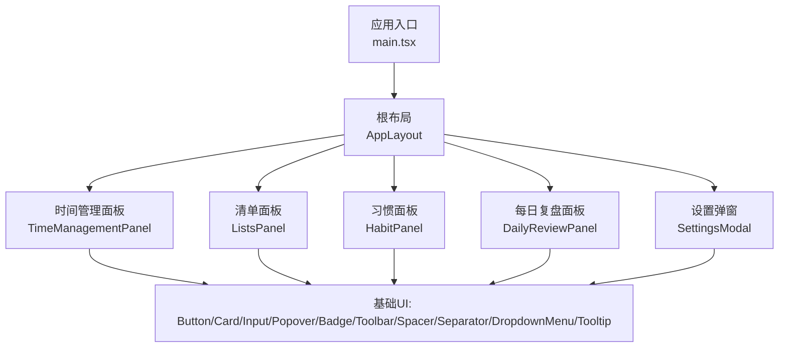
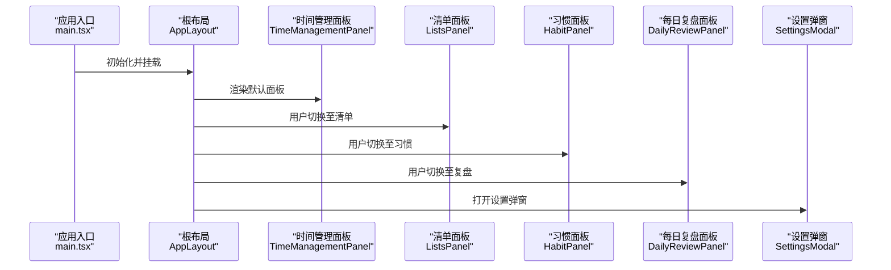
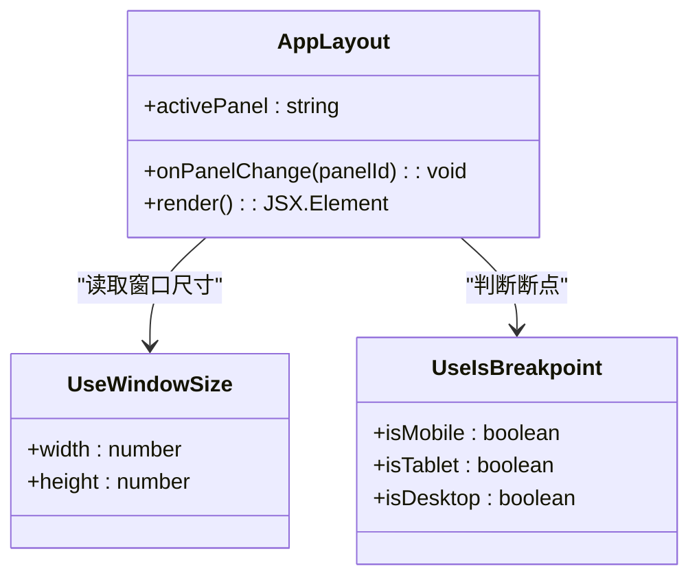
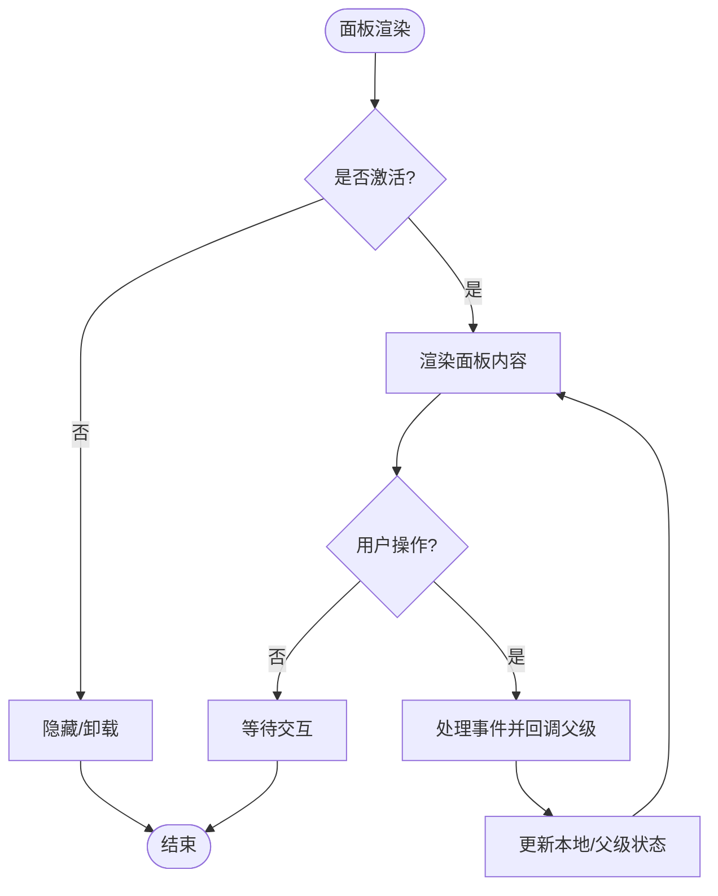
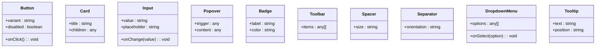
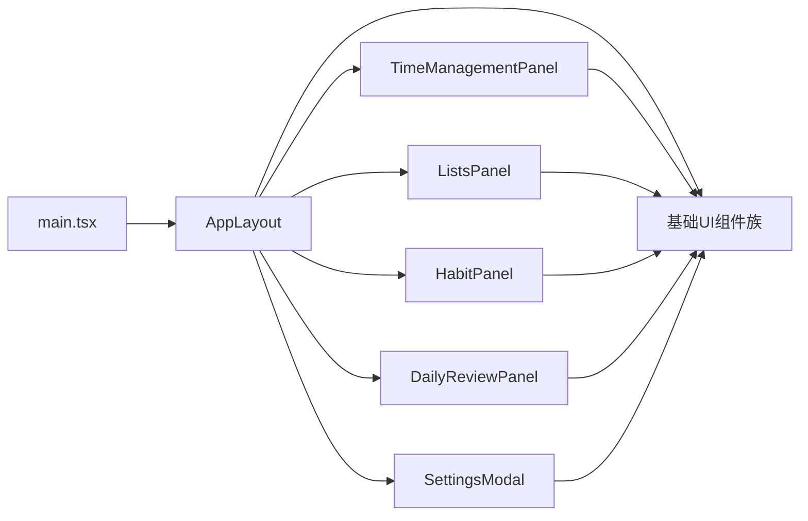

# 组件架构设计

<cite>
**本文引用的文件**   
- [src/main.tsx](file://src/main.tsx)
- [src/components/layout/AppLayout.tsx](file://src/components/layout/AppLayout.tsx)
- [src/components/layout/types.ts](file://src/components/layout/types.ts)
- [src/features/time-management/TimeManagementPanel.tsx](file://src/features/time-management/TimeManagementPanel.tsx)
- [src/features/lists/ListsPanel.tsx](file://src/features/lists/ListsPanel.tsx)
- [src/features/habits/HabitPanel.tsx](file://src/features/habits/HabitPanel.tsx)
- [src/features/daily-review/DailyReviewPanel.tsx](file://src/features/daily-review/DailyReviewPanel.tsx)
- [src/features/settings/SettingsModal.tsx](file://src/features/settings/SettingsModal.tsx)
- [src/features/settings/index.ts](file://src/features/settings/index.ts)
- [src/features/tiptap/SimpleEditor.tsx](file://src/features/tiptap/SimpleEditor.tsx)
- [src/components/tiptap-ui-primitive/button.tsx](file://src/components/tiptap-ui-primitive/button.tsx)
- [src/components/tiptap-ui-primitive/card.tsx](file://src/components/tiptap-ui-primitive/card.tsx)
- [src/components/tiptap-ui-primitive/input.tsx](file://src/components/tiptap-ui-primitive/input.tsx)
- [src/components/tiptap-ui-primitive/popover.tsx](file://src/components/tiptap-ui-primitive/popover.tsx)
- [src/components/tiptap-ui-primitive/badge.tsx](file://src/components/tiptap-ui-primitive/badge.tsx)
- [src/components/tiptap-ui-primitive/toolbar.tsx](file://src/components/tiptap-ui-primitive/toolbar.tsx)
- [src/components/tiptap-ui-primitive/spacer.tsx](file://src/components/tiptap-ui-primitive/spacer.tsx)
- [src/components/tiptap-ui-primitive/separator.tsx](file://src/components/tiptap-ui-primitive/separator.tsx)
- [src/components/tiptap-ui-primitive/dropdown-menu.tsx](file://src/components/tiptap-ui-primitive/dropdown-menu.tsx)
- [src/components/tiptap-ui-primitive/tooltip.tsx](file://src/components/tiptap-ui-primitive/tooltip.tsx)
- [src/hooks/use-window-size.ts](file://src/hooks/use-window-size.ts)
- [src/hooks/use-is-breakpoint.ts](file://src/hooks/use-is-breakpoint.ts)
- [src/styles/layout.css](file://src/styles/layout.css)
</cite>

## 目录
1. [简介](#简介)
2. [项目结构](#项目结构)
3. [核心组件](#核心组件)
4. [架构总览](#架构总览)
5. [详细组件分析](#详细组件分析)
6. [依赖关系分析](#依赖关系分析)
7. [性能考虑](#性能考虑)
8. [故障排查指南](#故障排查指南)
9. [结论](#结论)
10. [附录](#附录)

## 简介
本文件面向 FishWorker 前端应用，系统化阐述基于 Feature-Sliced Design（FSD）的组件架构与组织模式。重点覆盖：
- 布局层、功能面板层、基础 UI 层的分层职责与边界
- AppLayout 根布局组件的设计模式与扩展点
- 功能面板组件的解耦机制与通信协议
- 组件层次结构、Props 传递规范、事件处理模式
- 组件复用策略、插槽机制与动态组件加载
- 组件依赖关系图、渲染性能优化策略与错误边界方案
- 使用示例与最佳实践

## 项目结构
仓库采用 FSD 的分层组织方式：
- components：跨特性复用的基础 UI 与通用布局
- features：按业务特性划分的“功能面板”及其内部子模块
- hooks：可复用的自定义 Hook
- styles：全局样式与主题变量
- lib：工具库与服务抽象
- main.tsx：应用入口与路由挂载

图表来源
- [src/main.tsx](file://src/main.tsx)
- [src/components/layout/AppLayout.tsx](file://src/components/layout/AppLayout.tsx)
- [src/features/time-management/TimeManagementPanel.tsx](file://src/features/time-management/TimeManagementPanel.tsx)
- [src/features/lists/ListsPanel.tsx](file://src/features/lists/ListsPanel.tsx)
- [src/features/habits/HabitPanel.tsx](file://src/features/habits/HabitPanel.tsx)
- [src/features/daily-review/DailyReviewPanel.tsx](file://src/features/daily-review/DailyReviewPanel.tsx)
- [src/features/settings/SettingsModal.tsx](file://src/features/settings/SettingsModal.tsx)
- [src/components/tiptap-ui-primitive/button.tsx](file://src/components/tiptap-ui-primitive/button.tsx)
- [src/components/tiptap-ui-primitive/card.tsx](file://src/components/tiptap-ui-primitive/card.tsx)
- [src/components/tiptap-ui-primitive/input.tsx](file://src/components/tiptap-ui-primitive/input.tsx)
- [src/components/tiptap-ui-primitive/popover.tsx](file://src/components/tiptap-ui-primitive/popover.tsx)
- [src/components/tiptap-ui-primitive/badge.tsx](file://src/components/tiptap-ui-primitive/badge.tsx)
- [src/components/tiptap-ui-primitive/toolbar.tsx](file://src/components/tiptap-ui-primitive/toolbar.tsx)
- [src/components/tiptap-ui-primitive/spacer.tsx](file://src/components/tiptap-ui-primitive/spacer.tsx)
- [src/components/tiptap-ui-primitive/separator.tsx](file://src/components/tiptap-ui-primitive/separator.tsx)
- [src/components/tiptap-ui-primitive/dropdown-menu.tsx](file://src/components/tiptap-ui-primitive/dropdown-menu.tsx)
- [src/components/tiptap-ui-primitive/tooltip.tsx](file://src/components/tiptap-ui-primitive/tooltip.tsx)

章节来源
- [src/main.tsx](file://src/main.tsx)
- [src/components/layout/AppLayout.tsx](file://src/components/layout/AppLayout.tsx)
- [src/styles/layout.css](file://src/styles/layout.css)

## 核心组件
- 根布局 AppLayout
  - 职责：提供全局容器、侧边导航、顶部栏、内容区占位、响应式断点适配、主题与全局状态注入点
  - 扩展点：通过类型定义暴露可配置项，便于后续接入更多面板或全局行为
  - 参考路径：[src/components/layout/AppLayout.tsx](file://src/components/layout/AppLayout.tsx)、[src/components/layout/types.ts](file://src/components/layout/types.ts)

- 功能面板（Features）
  - 时间管理 TimeManagementPanel：任务四象限、周计划等
  - 清单 ListsPanel：清单分组、拖拽排序、批量导出等
  - 习惯 HabitPanel：习惯卡片、详情抽屉、编辑弹窗等
  - 每日复盘 DailyReviewPanel：复盘编辑器与统计
  - 设置 SettingsModal：数据库设置等
  - 参考路径：
    - [src/features/time-management/TimeManagementPanel.tsx](file://src/features/time-management/TimeManagementPanel.tsx)
    - [src/features/lists/ListsPanel.tsx](file://src/features/lists/ListsPanel.tsx)
    - [src/features/habits/HabitPanel.tsx](file://src/features/habits/HabitPanel.tsx)
    - [src/features/daily-review/DailyReviewPanel.tsx](file://src/features/daily-review/DailyReviewPanel.tsx)
    - [src/features/settings/SettingsModal.tsx](file://src/features/settings/SettingsModal.tsx)
    - [src/features/settings/index.ts](file://src/features/settings/index.ts)

- 基础 UI 组件（tiptap-ui-primitive）
  - 按钮、卡片、输入、弹出框、徽章、工具栏、分隔符、间距、下拉菜单、提示等
  - 参考路径：
    - [src/components/tiptap-ui-primitive/button.tsx](file://src/components/tiptap-ui-primitive/button.tsx)
    - [src/components/tiptap-ui-primitive/card.tsx](file://src/components/tiptap-ui-primitive/card.tsx)
    - [src/components/tiptap-ui-primitive/input.tsx](file://src/components/tiptap-ui-primitive/input.tsx)
    - [src/components/tiptap-ui-primitive/popover.tsx](file://src/components/tiptap-ui-primitive/popover.tsx)
    - [src/components/tiptap-ui-primitive/badge.tsx](file://src/components/tiptap-ui-primitive/badge.tsx)
    - [src/components/tiptap-ui-primitive/toolbar.tsx](file://src/components/tiptap-ui-primitive/toolbar.tsx)
    - [src/components/tiptap-ui-primitive/spacer.tsx](file://src/components/tiptap-ui-primitive/spacer.tsx)
    - [src/components/tiptap-ui-primitive/separator.tsx](file://src/components/tiptap-ui-primitive/separator.tsx)
    - [src/components/tiptap-ui-primitive/dropdown-menu.tsx](file://src/components/tiptap-ui-primitive/dropdown-menu.tsx)
    - [src/components/tiptap-ui-primitive/tooltip.tsx](file://src/components/tiptap-ui-primitive/tooltip.tsx)

章节来源
- [src/components/layout/AppLayout.tsx](file://src/components/layout/AppLayout.tsx)
- [src/components/layout/types.ts](file://src/components/layout/types.ts)
- [src/features/time-management/TimeManagementPanel.tsx](file://src/features/time-management/TimeManagementPanel.tsx)
- [src/features/lists/ListsPanel.tsx](file://src/features/lists/ListsPanel.tsx)
- [src/features/habits/HabitPanel.tsx](file://src/features/habits/HabitPanel.tsx)
- [src/features/daily-review/DailyReviewPanel.tsx](file://src/features/daily-review/DailyReviewPanel.tsx)
- [src/features/settings/SettingsModal.tsx](file://src/features/settings/SettingsModal.tsx)
- [src/features/settings/index.ts](file://src/features/settings/index.ts)
- [src/components/tiptap-ui-primitive/button.tsx](file://src/components/tiptap-ui-primitive/button.tsx)
- [src/components/tiptap-ui-primitive/card.tsx](file://src/components/tiptap-ui-primitive/card.tsx)
- [src/components/tiptap-ui-primitive/input.tsx](file://src/components/tiptap-ui-primitive/input.tsx)
- [src/components/tiptap-ui-primitive/popover.tsx](file://src/components/tiptap-ui-primitive/popover.tsx)
- [src/components/tiptap-ui-primitive/badge.tsx](file://src/components/tiptap-ui-primitive/badge.tsx)
- [src/components/tiptap-ui-primitive/toolbar.tsx](file://src/components/tiptap-ui-primitive/toolbar.tsx)
- [src/components/tiptap-ui-primitive/spacer.tsx](file://src/components/tiptap-ui-primitive/spacer.tsx)
- [src/components/tiptap-ui-primitive/separator.tsx](file://src/components/tiptap-ui-primitive/separator.tsx)
- [src/components/tiptap-ui-primitive/dropdown-menu.tsx](file://src/components/tiptap-ui-primitive/dropdown-menu.tsx)
- [src/components/tiptap-ui-primitive/tooltip.tsx](file://src/components/tiptap-ui-primitive/tooltip.tsx)

## 架构总览
下图展示从应用入口到根布局再到各功能面板的调用链路与数据流向。

图表来源
- [src/main.tsx](file://src/main.tsx)
- [src/components/layout/AppLayout.tsx](file://src/components/layout/AppLayout.tsx)
- [src/features/time-management/TimeManagementPanel.tsx](file://src/features/time-management/TimeManagementPanel.tsx)
- [src/features/lists/ListsPanel.tsx](file://src/features/lists/ListsPanel.tsx)
- [src/features/habits/HabitPanel.tsx](file://src/features/habits/HabitPanel.tsx)
- [src/features/daily-review/DailyReviewPanel.tsx](file://src/features/daily-review/DailyReviewPanel.tsx)
- [src/features/settings/SettingsModal.tsx](file://src/features/settings/SettingsModal.tsx)

## 详细组件分析

### 根布局组件 AppLayout
- 设计目标
  - 作为应用级容器，统一承载侧边导航、顶部区域与主内容区
  - 提供响应式布局能力，结合断点 Hook 控制不同屏幕下的显示逻辑
  - 为功能面板提供统一的挂载点与上下文注入点
- 关键职责
  - 路由/面板选择：根据当前激活的面板标识渲染对应 Feature 面板
  - 全局状态注入：将主题、窗口尺寸、断点等上下文提供给子树
  - 可扩展性：通过类型定义与配置项支持新增面板与全局行为
- 交互流程
  - 用户点击侧边导航 -> 更新激活面板 -> 重新渲染对应 Feature 面板
  - 窗口尺寸变化 -> 触发断点计算 -> 调整布局与可见性
- 参考实现位置
  - [src/components/layout/AppLayout.tsx](file://src/components/layout/AppLayout.tsx)
  - [src/components/layout/types.ts](file://src/components/layout/types.ts)
  - [src/hooks/use-window-size.ts](file://src/hooks/use-window-size.ts)
  - [src/hooks/use-is-breakpoint.ts](file://src/hooks/use-is-breakpoint.ts)
  - [src/styles/layout.css](file://src/styles/layout.css)

图表来源
- [src/components/layout/AppLayout.tsx](file://src/components/layout/AppLayout.tsx)
- [src/hooks/use-window-size.ts](file://src/hooks/use-window-size.ts)
- [src/hooks/use-is-breakpoint.ts](file://src/hooks/use-is-breakpoint.ts)

章节来源
- [src/components/layout/AppLayout.tsx](file://src/components/layout/AppLayout.tsx)
- [src/components/layout/types.ts](file://src/components/layout/types.ts)
- [src/hooks/use-window-size.ts](file://src/hooks/use-window-size.ts)
- [src/hooks/use-is-breakpoint.ts](file://src/hooks/use-is-breakpoint.ts)
- [src/styles/layout.css](file://src/styles/layout.css)

### 功能面板组件（Features）
- 时间管理面板 TimeManagementPanel
  - 职责：四象限视图、任务详情弹窗、周计划视图
  - 通信：通过 Props 接收选中任务、回调事件；内部维护本地交互状态
  - 参考路径：[src/features/time-management/TimeManagementPanel.tsx](file://src/features/time-management/TimeManagementPanel.tsx)

- 清单面板 ListsPanel
  - 职责：清单列表、分组、拖拽重排、批量导出
  - 通信：与拖拽、排序、导出服务交互；通过回调向父级上报变更
  - 参考路径：[src/features/lists/ListsPanel.tsx](file://src/features/lists/ListsPanel.tsx)

- 习惯面板 HabitPanel
  - 职责：习惯卡片、详情侧边栏、编辑弹窗
  - 通信：通过 Modal/Sidebar 组件进行局部交互；状态提升由父级管理
  - 参考路径：[src/features/habits/HabitPanel.tsx](file://src/features/habits/HabitPanel.tsx)

- 每日复盘面板 DailyReviewPanel
  - 职责：复盘编辑器、统计聚合
  - 通信：编辑器内容变更回调；统计数据由服务计算后传入
  - 参考路径：[src/features/daily-review/DailyReviewPanel.tsx](file://src/features/daily-review/DailyReviewPanel.tsx)

- 设置弹窗 SettingsModal
  - 职责：数据库设置、偏好配置
  - 通信：以弹窗形式存在，关闭时回写配置
  - 参考路径：[src/features/settings/SettingsModal.tsx](file://src/features/settings/SettingsModal.tsx)、[src/features/settings/index.ts](file://src/features/settings/index.ts)

图表来源
- [src/features/time-management/TimeManagementPanel.tsx](file://src/features/time-management/TimeManagementPanel.tsx)
- [src/features/lists/ListsPanel.tsx](file://src/features/lists/ListsPanel.tsx)
- [src/features/habits/HabitPanel.tsx](file://src/features/habits/HabitPanel.tsx)
- [src/features/daily-review/DailyReviewPanel.tsx](file://src/features/daily-review/DailyReviewPanel.tsx)
- [src/features/settings/SettingsModal.tsx](file://src/features/settings/SettingsModal.tsx)

章节来源
- [src/features/time-management/TimeManagementPanel.tsx](file://src/features/time-management/TimeManagementPanel.tsx)
- [src/features/lists/ListsPanel.tsx](file://src/features/lists/ListsPanel.tsx)
- [src/features/habits/HabitPanel.tsx](file://src/features/habits/HabitPanel.tsx)
- [src/features/daily-review/DailyReviewPanel.tsx](file://src/features/daily-review/DailyReviewPanel.tsx)
- [src/features/settings/SettingsModal.tsx](file://src/features/settings/SettingsModal.tsx)
- [src/features/settings/index.ts](file://src/features/settings/index.ts)

### 基础 UI 组件（tiptap-ui-primitive）
- 组件族
  - 按钮 Button、卡片 Card、输入 Input、弹出 Popover、徽章 Badge、工具栏 Toolbar、间距 Spacer、分隔符 Separator、下拉菜单 DropdownMenu、提示 Tooltip
- 设计原则
  - 无状态优先：尽量只负责展示与最小交互，复杂逻辑上移至 Feature 层
  - 组合式 API：通过 props 与 children 组合出丰富形态
  - 主题与样式隔离：通过独立样式文件与 CSS 变量维持一致性
- 典型用法
  - 在 Feature 面板中组合多个基础组件构建复杂界面
  - 通过 Tooltip 增强可访问性与引导信息
  - 使用 Toolbar 与 DropdownMenu 构建工具条与快捷操作

图表来源
- [src/components/tiptap-ui-primitive/button.tsx](file://src/components/tiptap-ui-primitive/button.tsx)
- [src/components/tiptap-ui-primitive/card.tsx](file://src/components/tiptap-ui-primitive/card.tsx)
- [src/components/tiptap-ui-primitive/input.tsx](file://src/components/tiptap-ui-primitive/input.tsx)
- [src/components/tiptap-ui-primitive/popover.tsx](file://src/components/tiptap-ui-primitive/popover.tsx)
- [src/components/tiptap-ui-primitive/badge.tsx](file://src/components/tiptap-ui-primitive/badge.tsx)
- [src/components/tiptap-ui-primitive/toolbar.tsx](file://src/components/tiptap-ui-primitive/toolbar.tsx)
- [src/components/tiptap-ui-primitive/spacer.tsx](file://src/components/tiptap-ui-primitive/spacer.tsx)
- [src/components/tiptap-ui-primitive/separator.tsx](file://src/components/tiptap-ui-primitive/separator.tsx)
- [src/components/tiptap-ui-primitive/dropdown-menu.tsx](file://src/components/tiptap-ui-primitive/dropdown-menu.tsx)
- [src/components/tiptap-ui-primitive/tooltip.tsx](file://src/components/tiptap-ui-primitive/tooltip.tsx)

章节来源
- [src/components/tiptap-ui-primitive/button.tsx](file://src/components/tiptap-ui-primitive/button.tsx)
- [src/components/tiptap-ui-primitive/card.tsx](file://src/components/tiptap-ui-primitive/card.tsx)
- [src/components/tiptap-ui-primitive/input.tsx](file://src/components/tiptap-ui-primitive/input.tsx)
- [src/components/tiptap-ui-primitive/popover.tsx](file://src/components/tiptap-ui-primitive/popover.tsx)
- [src/components/tiptap-ui-primitive/badge.tsx](file://src/components/tiptap-ui-primitive/badge.tsx)
- [src/components/tiptap-ui-primitive/toolbar.tsx](file://src/components/tiptap-ui-primitive/toolbar.tsx)
- [src/components/tiptap-ui-primitive/spacer.tsx](file://src/components/tiptap-ui-primitive/spacer.tsx)
- [src/components/tiptap-ui-primitive/separator.tsx](file://src/components/tiptap-ui-primitive/separator.tsx)
- [src/components/tiptap-ui-primitive/dropdown-menu.tsx](file://src/components/tiptap-ui-primitive/dropdown-menu.tsx)
- [src/components/tiptap-ui-primitive/tooltip.tsx](file://src/components/tiptap-ui-primitive/tooltip.tsx)

### 编辑器相关组件（Tiptap 生态）
- SimpleEditor
  - 职责：封装 Tiptap 编辑器实例、工具栏、气泡菜单、斜杠命令等
  - 通信：通过 onChange/onBlur 等回调与上层同步内容
  - 参考路径：[src/features/tiptap/SimpleEditor.tsx](file://src/features/tiptap/SimpleEditor.tsx)

章节来源
- [src/features/tiptap/SimpleEditor.tsx](file://src/features/tiptap/SimpleEditor.tsx)

## 依赖关系分析
- 组件耦合度
  - AppLayout 仅依赖基础 UI 与断点 Hook，保持低耦合
  - Features 层依赖基础 UI 与各自的服务/Store（不在本文件范围内），避免直接跨特性引用
  - 基础 UI 组件不依赖任何 Feature，具备高内聚与强复用性
- 外部依赖
  - 窗口尺寸与断点：use-window-size、use-is-breakpoint
  - 样式：layout.css 提供全局布局样式
- 潜在循环依赖
  - 当前结构清晰，Feature 之间无直接相互引用，降低循环风险

图表来源
- [src/main.tsx](file://src/main.tsx)
- [src/components/layout/AppLayout.tsx](file://src/components/layout/AppLayout.tsx)
- [src/features/time-management/TimeManagementPanel.tsx](file://src/features/time-management/TimeManagementPanel.tsx)
- [src/features/lists/ListsPanel.tsx](file://src/features/lists/ListsPanel.tsx)
- [src/features/habits/HabitPanel.tsx](file://src/features/habits/HabitPanel.tsx)
- [src/features/daily-review/DailyReviewPanel.tsx](file://src/features/daily-review/DailyReviewPanel.tsx)
- [src/features/settings/SettingsModal.tsx](file://src/features/settings/SettingsModal.tsx)
- [src/components/tiptap-ui-primitive/button.tsx](file://src/components/tiptap-ui-primitive/button.tsx)
- [src/components/tiptap-ui-primitive/card.tsx](file://src/components/tiptap-ui-primitive/card.tsx)
- [src/components/tiptap-ui-primitive/input.tsx](file://src/components/tiptap-ui-primitive/input.tsx)
- [src/components/tiptap-ui-primitive/popover.tsx](file://src/components/tiptap-ui-primitive/popover.tsx)
- [src/components/tiptap-ui-primitive/badge.tsx](file://src/components/tiptap-ui-primitive/badge.tsx)
- [src/components/tiptap-ui-primitive/toolbar.tsx](file://src/components/tiptap-ui-primitive/toolbar.tsx)
- [src/components/tiptap-ui-primitive/spacer.tsx](file://src/components/tiptap-ui-primitive/spacer.tsx)
- [src/components/tiptap-ui-primitive/separator.tsx](file://src/components/tiptap-ui-primitive/separator.tsx)
- [src/components/tiptap-ui-primitive/dropdown-menu.tsx](file://src/components/tiptap-ui-primitive/dropdown-menu.tsx)
- [src/components/tiptap-ui-primitive/tooltip.tsx](file://src/components/tiptap-ui-primitive/tooltip.tsx)

章节来源
- [src/main.tsx](file://src/main.tsx)
- [src/components/layout/AppLayout.tsx](file://src/components/layout/AppLayout.tsx)
- [src/features/time-management/TimeManagementPanel.tsx](file://src/features/time-management/TimeManagementPanel.tsx)
- [src/features/lists/ListsPanel.tsx](file://src/features/lists/ListsPanel.tsx)
- [src/features/habits/HabitPanel.tsx](file://src/features/habits/HabitPanel.tsx)
- [src/features/daily-review/DailyReviewPanel.tsx](file://src/features/daily-review/DailyReviewPanel.tsx)
- [src/features/settings/SettingsModal.tsx](file://src/features/settings/SettingsModal.tsx)
- [src/components/tiptap-ui-primitive/button.tsx](file://src/components/tiptap-ui-primitive/button.tsx)
- [src/components/tiptap-ui-primitive/card.tsx](file://src/components/tiptap-ui-primitive/card.tsx)
- [src/components/tiptap-ui-primitive/input.tsx](file://src/components/tiptap-ui-primitive/input.tsx)
- [src/components/tiptap-ui-primitive/popover.tsx](file://src/components/tiptap-ui-primitive/popover.tsx)
- [src/components/tiptap-ui-primitive/badge.tsx](file://src/components/tiptap-ui-primitive/badge.tsx)
- [src/components/tiptap-ui-primitive/toolbar.tsx](file://src/components/tiptap-ui-primitive/toolbar.tsx)
- [src/components/tiptap-ui-primitive/spacer.tsx](file://src/components/tiptap-ui-primitive/spacer.tsx)
- [src/components/tiptap-ui-primitive/separator.tsx](file://src/components/tiptap-ui-primitive/separator.tsx)
- [src/components/tiptap-ui-primitive/dropdown-menu.tsx](file://src/components/tiptap-ui-primitive/dropdown-menu.tsx)
- [src/components/tiptap-ui-primitive/tooltip.tsx](file://src/components/tiptap-ui-primitive/tooltip.tsx)

## 性能考虑
- 渲染优化
  - 使用 React.memo 包裹基础 UI 组件，减少不必要的重渲染
  - 对大型列表（如清单、习惯）启用虚拟滚动或分页加载
  - 懒加载 Feature 面板：仅在切换时按需加载，降低首屏体积
- 状态与计算
  - 将昂贵计算放入 useMemo/useCallback，避免重复计算
  - 将频繁变化的状态下沉到最小作用域，减少父级重渲染
- 资源与样式
  - 图片与图标按需加载，使用 SVG 与雪碧图
  - 样式模块化，避免全局样式冲突导致的回流重绘
- 交互体验
  - 使用节流/防抖处理高频事件（滚动、输入）
  - 骨架屏与占位提升感知性能

## 故障排查指南
- 常见问题定位
  - 面板未渲染：检查 AppLayout 的 activePanel 值与路由映射是否正确
  - 弹窗/气泡不出现：确认 Popover/Tooltip 的 trigger 与 content 绑定关系
  - 输入无响应：校验 Input 的 value/onChange 双向绑定是否完整
  - 布局错乱：核对 layout.css 的栅格与断点规则
- 调试建议
  - 在 AppLayout 打印 activePanel 与窗口尺寸，验证断点逻辑
  - 在 Feature 面板的回调处打日志，追踪事件冒泡与状态提升
  - 使用浏览器开发者工具的 Performance 面板分析重渲染热点

章节来源
- [src/components/layout/AppLayout.tsx](file://src/components/layout/AppLayout.tsx)
- [src/styles/layout.css](file://src/styles/layout.css)
- [src/components/tiptap-ui-primitive/popover.tsx](file://src/components/tiptap-ui-primitive/popover.tsx)
- [src/components/tiptap-ui-primitive/tooltip.tsx](file://src/components/tiptap-ui-primitive/tooltip.tsx)
- [src/components/tiptap-ui-primitive/input.tsx](file://src/components/tiptap-ui-primitive/input.tsx)

## 结论
FishWorker 前端采用清晰的 FSD 分层：根布局统一管理页面壳与面板切换，功能面板聚焦业务逻辑并与基础 UI 解耦，基础 UI 组件提供稳定、可复用的视觉与交互原语。通过明确的 Props 契约、回调事件与上下文注入，实现了良好的可维护性与扩展性。配合性能优化与错误边界策略，可在保证用户体验的同时支撑持续迭代。

## 附录
- 组件使用示例与最佳实践
  - 在 AppLayout 中注册新面板：在类型定义中添加面板标识，并在渲染分支中返回对应 Feature 组件
  - 在 Feature 中使用基础 UI：优先组合 Button、Card、Input、Popover、Badge、Toolbar、DropdownMenu、Tooltip 等
  - 事件处理模式：Feature 内部维护轻量交互状态，通过回调将关键变更上报给父级或 Store
  - 插槽机制：利用 children 与具名插槽（如标题、副标题、操作区）提高组件灵活性
  - 动态组件加载：对大体积 Feature 使用动态 import，在切换时按需加载
  - 错误边界：在 AppLayout 或 Feature 外层包裹错误边界组件，捕获渲染异常并降级展示