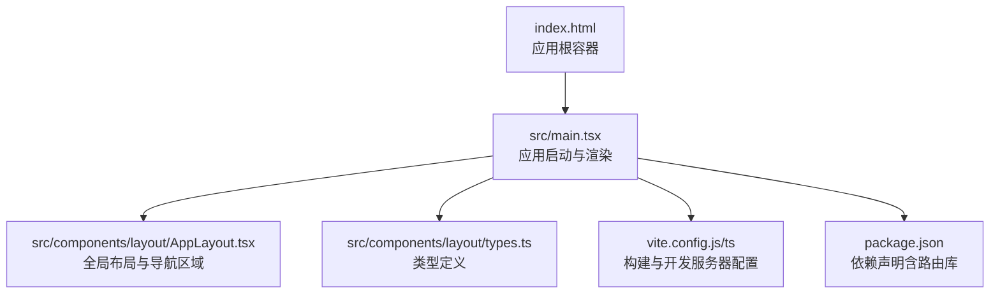
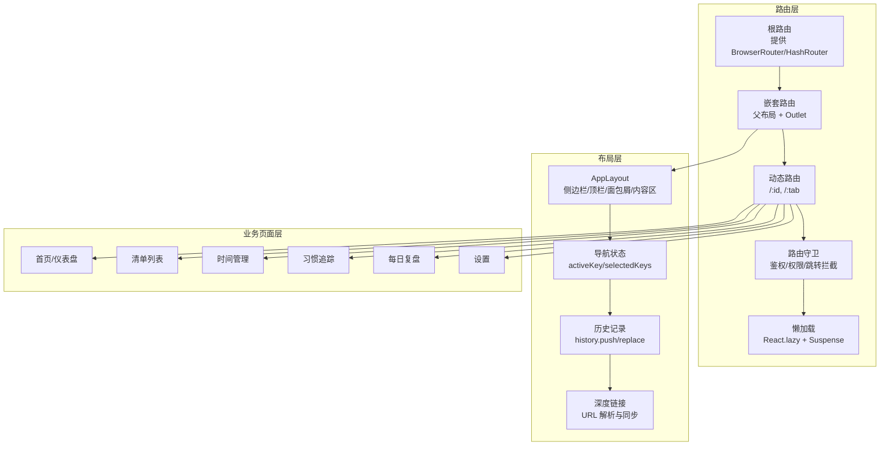
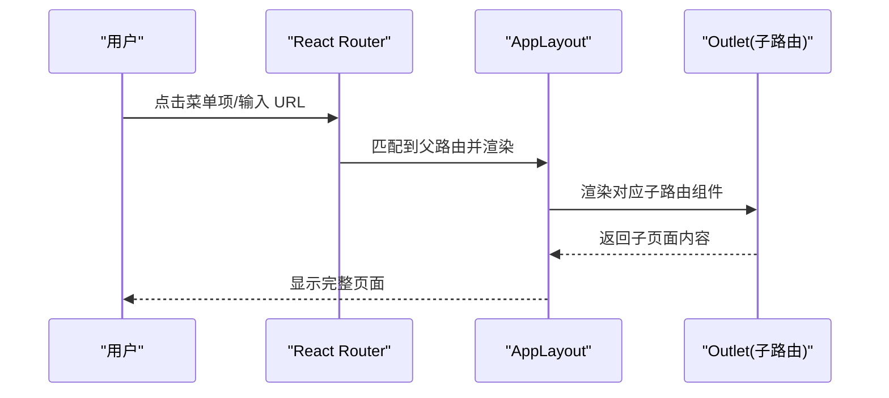
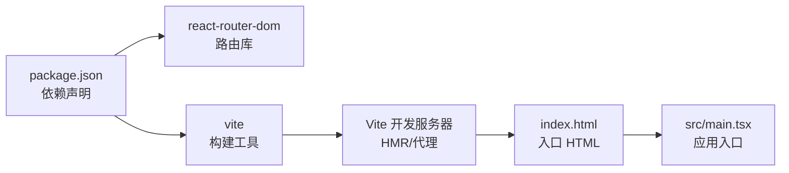

# 路由与导航架构

<cite>
**本文引用的文件**   
- [main.tsx](file://src/main.tsx)
- [AppLayout.tsx](file://src/components/layout/AppLayout.tsx)
- [AppLayout.css](file://src/components/layout/AppLayout.css)
- [types.ts](file://src/components/layout/types.ts)
- [index.html](file://index.html)
- [vite.config.js](file://vite.config.js)
- [vite.config.ts](file://vite.config.ts)
- [package.json](file://package.json)
</cite>

## 目录
1. [简介](#简介)
2. [项目结构](#项目结构)
3. [核心组件](#核心组件)
4. [架构总览](#架构总览)
5. [详细组件分析](#详细组件分析)
6. [依赖分析](#依赖分析)
7. [性能考虑](#性能考虑)
8. [故障排查指南](#故障排查指南)
9. [结论](#结论)
10. [附录](#附录)

## 简介
本文件聚焦 FishWorker 前端应用的路由与导航架构，围绕基于 React Router 的设计模式展开，涵盖嵌套路由、动态路由、路由守卫、主入口路由配置、功能模块路由注册、页面级懒加载、导航状态管理、面包屑导航、历史记录处理、深度链接支持、参数传递、查询字符串处理、路由动画过渡、SEO 友好配置、移动端适配策略、测试方案与调试技巧。文档在保持技术深度的同时，力求对非专业读者友好。

## 项目结构
FishWorker 采用 Vite + React + TypeScript 构建，前端入口位于 src/main.tsx，布局组件位于 src/components/layout/，HTML 模板位于 index.html，构建配置位于 vite.config.*。当前仓库未包含显式路由配置文件或路由相关源文件；因此本节从工程结构与约定出发，给出推荐的路由组织方式与落地建议。

图示来源
- [index.html:1-50](file://index.html#L1-L50)
- [main.tsx:1-120](file://src/main.tsx#L1-L120)
- [AppLayout.tsx:1-200](file://src/components/layout/AppLayout.tsx#L1-L200)
- [types.ts:1-100](file://src/components/layout/types.ts#L1-L100)
- [vite.config.js:1-200](file://vite.config.js#L1-L200)
- [vite.config.ts:1-200](file://vite.config.ts#L1-L200)
- [package.json:1-200](file://package.json#L1-L200)

章节来源
- [index.html:1-50](file://index.html#L1-L50)
- [main.tsx:1-120](file://src/main.tsx#L1-L120)
- [AppLayout.tsx:1-200](file://src/components/layout/AppLayout.tsx#L1-L200)
- [types.ts:1-100](file://src/components/layout/types.ts#L1-L100)
- [vite.config.js:1-200](file://vite.config.js#L1-L200)
- [vite.config.ts:1-200](file://vite.config.ts#L1-L200)
- [package.json:1-200](file://package.json#L1-L200)

## 核心组件
- 应用入口 main.tsx：负责初始化 React 应用、挂载根节点、集成全局样式与第三方插件。该文件是引入路由上下文与根路由的合适位置。
- 布局组件 AppLayout.tsx：承载侧边栏、顶部导航、面包屑、内容区等，适合放置 <Outlet /> 以承接嵌套路由渲染。
- 类型定义 types.ts：集中定义导航项、菜单结构、路由元信息等类型，便于统一维护与复用。

章节来源
- [main.tsx:1-120](file://src/main.tsx#L1-L120)
- [AppLayout.tsx:1-200](file://src/components/layout/AppLayout.tsx#L1-L200)
- [types.ts:1-100](file://src/components/layout/types.ts#L1-L100)

## 架构总览
下图展示推荐的路由与导航架构，将“路由层”、“布局层”、“业务页面层”解耦，并通过懒加载与路由守卫提升可维护性与性能。

图示来源
- [main.tsx:1-120](file://src/main.tsx#L1-L120)
- [AppLayout.tsx:1-200](file://src/components/layout/AppLayout.tsx#L1-L200)

## 详细组件分析

### 主应用入口与根路由配置
- 职责
  - 初始化应用并挂载到 DOM。
  - 引入并包裹路由上下文（BrowserRouter 或 HashRouter）。
  - 注册根路由与全局布局。
  - 可选：注入全局错误边界、主题、国际化等。
- 关键点
  - 选择 History 模式：Web 环境推荐 BrowserRouter；若部署于静态站点且无服务端重定向，使用 HashRouter。
  - 根路由下直接渲染 AppLayout，确保所有子路由共享布局。
  - 在入口附近集中配置全局路由守卫与异常捕获。

章节来源
- [main.tsx:1-120](file://src/main.tsx#L1-L120)

### 布局与嵌套路由
- 职责
  - 通过 <Outlet /> 渲染子路由视图。
  - 承载侧边栏、顶部导航、面包屑、页脚等公共 UI。
  - 维护导航选中态与高亮逻辑。
- 关键点
  - 使用嵌套路由实现“一级菜单 -> 二级页面”的结构。
  - 在布局中根据当前路由计算 activeKey/selectedKeys，驱动菜单高亮。
  - 面包屑数据可由路由元信息生成，或由布局根据路径推导。

图示来源
- [AppLayout.tsx:1-200](file://src/components/layout/AppLayout.tsx#L1-L200)

章节来源
- [AppLayout.tsx:1-200](file://src/components/layout/AppLayout.tsx#L1-L200)

### 动态路由与参数传递
- 设计要点
  - 使用路径参数（如 :id/:tab）表达资源型页面。
  - 在页面组件中读取 params，结合查询字符串（search）进行筛选与分页。
  - 为关键页面添加 loading 与错误态处理。
- 最佳实践
  - 参数校验与默认值：在页面内做基础校验，必要时回退到默认视图。
  - 与状态管理联动：将重要参数持久化到 store，避免刷新丢失。

章节来源
- [types.ts:1-100](file://src/components/layout/types.ts#L1-L100)

### 路由守卫机制
- 常见场景
  - 登录态校验：未登录跳转到登录页。
  - 权限控制：按角色/菜单权限决定可访问性。
  - 离开保护：表单未保存时阻止意外离开。
- 实现思路
  - 在路由层封装高阶组件或自定义 Hook，集中处理鉴权逻辑。
  - 结合全局状态（如用户信息、权限集合）判断是否放行。
  - 记录跳转来源，登录后原路返回。

章节来源
- [main.tsx:1-120](file://src/main.tsx#L1-L120)
- [AppLayout.tsx:1-200](file://src/components/layout/AppLayout.tsx#L1-L200)

### 页面级懒加载
- 目标
  - 降低首屏体积，提升加载速度。
- 方法
  - 使用 React.lazy 与 Suspense 按需加载页面组件。
  - 为每个懒加载页面提供占位与错误提示。
  - 预取策略：对高频页面在空闲时机预加载。

章节来源
- [main.tsx:1-120](file://src/main.tsx#L1-L120)

### 导航状态管理与面包屑
- 导航状态
  - 使用路由上下文获取当前路径与历史栈，驱动菜单高亮与激活态。
  - 将常用导航状态（如折叠态、搜索词）提升到布局或全局状态。
- 面包屑
  - 基于路由元信息或路径段自动生成。
  - 支持点击跳转与层级回溯。

章节来源
- [AppLayout.tsx:1-200](file://src/components/layout/AppLayout.tsx#L1-L200)
- [types.ts:1-100](file://src/components/layout/types.ts#L1-L100)

### 历史记录处理与深度链接
- 历史记录
  - 使用 history API 进行编程式导航（push/replace）。
  - 在复杂流程中合理使用 replace 避免历史膨胀。
- 深度链接
  - 支持分享链接直达特定资源与筛选条件。
  - 在路由初始化时解析 URL 参数并同步到状态。

章节来源
- [AppLayout.tsx:1-200](file://src/components/layout/AppLayout.tsx#L1-L200)

### 查询字符串处理
- 建议
  - 将筛选、排序、分页等参数放入 search。
  - 提供统一的序列化/反序列化工具，保证 URL 可读与稳定。
  - 与本地存储协同，兼顾体验与可分享性。

章节来源
- [types.ts:1-100](file://src/components/layout/types.ts#L1-L100)

### 路由动画过渡效果
- 方案
  - 使用 react-transition-group 或 framer-motion 实现页面切换动画。
  - 针对懒加载页面，在 Suspense 外层包裹过渡容器。
- 注意事项
  - 避免过度动画影响性能。
  - 在移动端适当简化动效。

章节来源
- [AppLayout.tsx:1-200](file://src/components/layout/AppLayout.tsx#L1-L200)

### SEO 友好配置
- 建议
  - 为关键页面设置 title、meta description、canonical。
  - 使用结构化数据（JSON-LD）增强搜索引擎理解。
  - 在 SSR/SSG 环境下进一步优化（本项目为 SPA，可通过 meta 标签与 Open Graph 改善社交分享体验）。

章节来源
- [index.html:1-50](file://index.html#L1-L50)

### 移动端适配策略
- 建议
  - 响应式布局：侧边栏在小屏自动收起，提供抽屉式导航。
  - 触摸友好的交互：增大点击区域、减少悬浮操作。
  - 键盘无障碍：Tab 顺序合理、焦点可见。

章节来源
- [AppLayout.css:1-200](file://src/components/layout/AppLayout.css#L1-L200)
- [AppLayout.tsx:1-200](file://src/components/layout/AppLayout.tsx#L1-L200)

## 依赖分析
- 构建与运行
  - Vite 作为开发与构建工具，提供热更新与按需打包能力。
  - package.json 中声明了前端依赖，包括 React 生态与可能的路由库。
- 路由库
  - 建议在 package.json 中明确引入 react-router-dom 或 @remix-run/router 等。
  - 若使用 Hash 模式，需确保部署环境兼容。

图示来源
- [package.json:1-200](file://package.json#L1-L200)
- [vite.config.js:1-200](file://vite.config.js#L1-L200)
- [vite.config.ts:1-200](file://vite.config.ts#L1-L200)
- [index.html:1-50](file://index.html#L1-L50)
- [main.tsx:1-120](file://src/main.tsx#L1-L120)

章节来源
- [package.json:1-200](file://package.json#L1-L200)
- [vite.config.js:1-200](file://vite.config.js#L1-L200)
- [vite.config.ts:1-200](file://vite.config.ts#L1-L200)
- [index.html:1-50](file://index.html#L1-L50)
- [main.tsx:1-120](file://src/main.tsx#L1-L120)

## 性能考虑
- 代码分割与懒加载：按路由维度拆分包体，显著降低首屏体积。
- 预取与预加载：对热点页面在空闲时预取，提高后续导航速度。
- 路由缓存：对频繁切换的页面组件启用缓存（如 keep-alive 思想），减少重复渲染。
- 路由守卫优化：将鉴权逻辑前置，避免不必要的组件渲染。
- 资源优化：图片与字体按需加载，开启浏览器缓存与压缩。
- 监控与度量：接入性能埋点，关注 LCP、FID、CLS 等指标。

[本节为通用指导，不直接分析具体文件]

## 故障排查指南
- 常见问题
  - 404 白屏：检查路由模式与服务端重定向配置。
  - 循环跳转：审查路由守卫中的跳转条件与来源记录。
  - 参数丢失：确认 URL 序列化与页面初始化时的解析逻辑。
  - 懒加载失败：检查 Suspense 与错误边界是否正确包裹。
- 调试技巧
  - 使用浏览器开发者工具的 Network 面板查看路由请求与资源加载。
  - 在路由变化处打日志，输出当前路径、params、search 与状态。
  - 使用断点调试路由守卫与导航函数。
  - 编写单元测试覆盖关键路由分支与守卫逻辑。

章节来源
- [main.tsx:1-120](file://src/main.tsx#L1-L120)
- [AppLayout.tsx:1-200](file://src/components/layout/AppLayout.tsx#L1-L200)

## 结论
通过将路由层、布局层与业务页面层解耦，并结合懒加载、路由守卫、参数与查询字符串规范化管理，FishWorker 的前端导航具备良好可扩展性与可维护性。配合完善的测试与调试手段，可在复杂业务场景中保持稳定与高性能表现。

[本节为总结性内容，不直接分析具体文件]

## 附录
- 术语
  - 嵌套路由：父子路由组合，父路由提供布局，子路由渲染具体内容。
  - 动态路由：通过路径参数匹配不同资源页面。
  - 路由守卫：在路由切换前后执行的拦截与校验逻辑。
  - 深度链接：通过 URL 直达特定页面与状态的链接。
- 参考
  - React Router 官方文档
  - Vite 官方文档
  - Web 性能优化最佳实践

[本节为概念性内容，不直接分析具体文件]