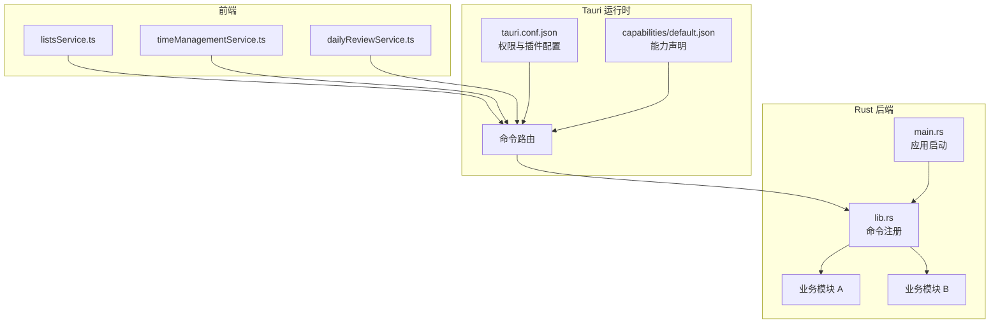
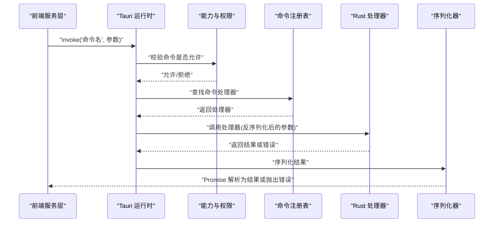
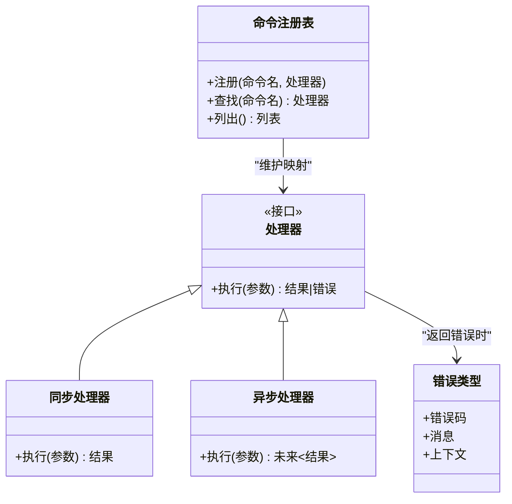
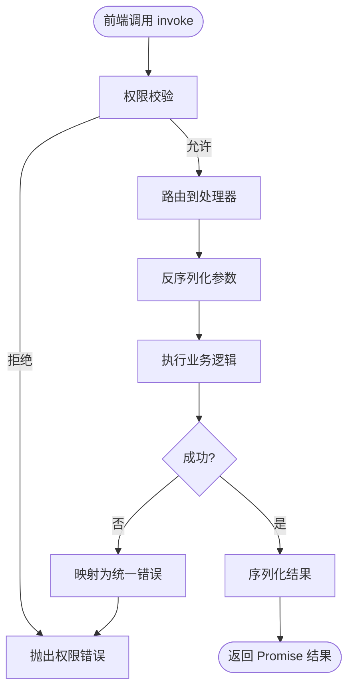
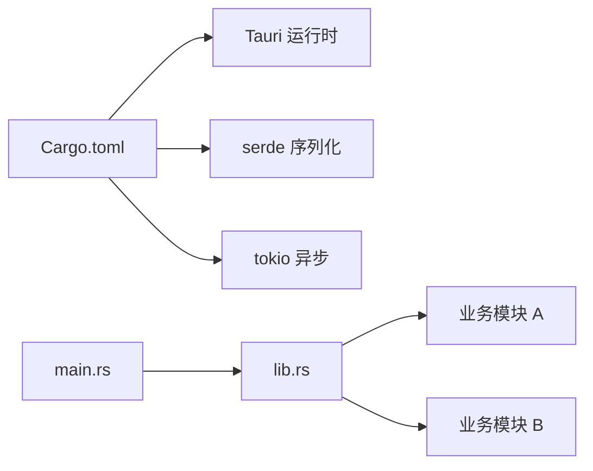

# IPC 通信机制

<cite>
**本文引用的文件**   
- [src-tauri/src/lib.rs](file://src-tauri/src/lib.rs)
- [src-tauri/src/main.rs](file://src-tauri/src/main.rs)
- [src-tauri/tauri.conf.json](file://src-tauri/tauri.conf.json)
- [src-tauri/capabilities/default.json](file://src-tauri/capabilities/default.json)
- [src-tauri/Cargo.toml](file://src-tauri/Cargo.toml)
- [src/features/lists/listsService.ts](file://src/features/lists/listsService.ts)
- [src/features/time-management/timeManagementService.ts](file://src/features/time-management/timeManagementService.ts)
- [src/features/daily-review/dailyReviewService.ts](file://src/features/daily-review/dailyReviewService.ts)
</cite>

## 目录
1. [简介](#简介)
2. [项目结构](#项目结构)
3. [核心组件](#核心组件)
4. [架构总览](#架构总览)
5. [详细组件分析](#详细组件分析)
6. [依赖关系分析](#依赖关系分析)
7. [性能考虑](#性能考虑)
8. [故障排查指南](#故障排查指南)
9. [结论](#结论)
10. [附录](#附录)

## 简介
本文件面向 FishWorker 的 Tauri IPC 通信机制，系统性阐述前端与 Rust 后端之间的命令注册、协议约定、消息传递、类型映射、异步处理、错误传播、超时控制、安全校验与性能优化策略。文档同时提供完整的命令定义示例与前端调用方式，并给出调试技巧与最佳实践，帮助开发者高效构建稳定高效的跨进程通信。

## 项目结构
FishWorker 采用 Tauri 框架，Rust 作为后端能力层，TypeScript/React 作为前端界面层。IPC 的核心入口位于 Rust 侧的 Tauri 应用初始化与命令注册处；前端通过 Tauri 客户端库发起命令调用，由 Tauri 运行时路由到对应的 Rust 函数执行，并将结果序列化回前端。

图表来源
- [src-tauri/src/lib.rs](file://src-tauri/src/lib.rs)
- [src-tauri/src/main.rs](file://src-tauri/src/main.rs)
- [src-tauri/tauri.conf.json](file://src-tauri/tauri.conf.json)
- [src-tauri/capabilities/default.json](file://src-tauri/capabilities/default.json)
- [src/features/lists/listsService.ts](file://src/features/lists/listsService.ts)
- [src/features/time-management/timeManagementService.ts](file://src/features/time-management/timeManagementService.ts)
- [src/features/daily-review/dailyReviewService.ts](file://src/features/daily-review/dailyReviewService.ts)

章节来源
- [src-tauri/src/lib.rs](file://src-tauri/src/lib.rs)
- [src-tauri/src/main.rs](file://src-tauri/src/main.rs)
- [src-tauri/tauri.conf.json](file://src-tauri/tauri.conf.json)
- [src-tauri/capabilities/default.json](file://src-tauri/capabilities/default.json)
- [src/features/lists/listsService.ts](file://src/features/lists/listsService.ts)
- [src/features/time-management/timeManagementService.ts](file://src/features/time-management/timeManagementService.ts)
- [src/features/daily-review/dailyReviewService.ts](file://src/features/daily-review/dailyReviewService.ts)

## 核心组件
- 命令注册中心：在 Rust 侧集中注册所有 Tauri 命令，将前端调用的命令名映射到具体函数实现。
- 前端服务层：在各功能模块中封装对 Tauri 命令的调用，统一参数构造、错误处理与返回值解析。
- 配置与权限：通过 tauri.conf.json 与 capabilities 控制可用命令、插件与访问范围，确保最小权限原则。
- 类型映射与序列化：基于 serde 进行前后端数据结构的双向转换，保证类型一致性与安全性。

章节来源
- [src-tauri/src/lib.rs](file://src-tauri/src/lib.rs)
- [src-tauri/tauri.conf.json](file://src-tauri/tauri.conf.json)
- [src-tauri/capabilities/default.json](file://src-tauri/capabilities/default.json)
- [src/features/lists/listsService.ts](file://src/features/lists/listsService.ts)
- [src/features/time-management/timeManagementService.ts](file://src/features/time-management/timeManagementService.ts)
- [src/features/daily-review/dailyReviewService.ts](file://src/features/daily-review/dailyReviewService.ts)

## 架构总览
下图展示了从前端发起命令到 Rust 执行并返回结果的完整流程，包括权限检查、命令路由、参数反序列化、业务处理、结果序列化与错误传播。

图表来源
- [src-tauri/src/lib.rs](file://src-tauri/src/lib.rs)
- [src-tauri/tauri.conf.json](file://src-tauri/tauri.conf.json)
- [src-tauri/capabilities/default.json](file://src-tauri/capabilities/default.json)

## 详细组件分析

### 命令注册系统（Rust 侧）
- 职责：集中管理命令名与处理器函数的绑定，支持同步与异步处理器，便于扩展与维护。
- 关键点：
  - 命令名唯一性：避免重复注册导致覆盖或冲突。
  - 参数与返回值的类型约束：使用强类型结构体，配合 serde 自动序列化/反序列化。
  - 错误类型设计：定义统一的错误枚举，包含错误码与人类可读信息，便于前端分类处理。
  - 中间件/钩子：可在注册阶段注入日志、鉴权、限流等通用逻辑。

图表来源
- [src-tauri/src/lib.rs](file://src-tauri/src/lib.rs)

章节来源
- [src-tauri/src/lib.rs](file://src-tauri/src/lib.rs)

### 前端与后端通信协议
- 调用入口：前端通过 Tauri invoke API 发起命令调用，传入命令名与参数对象。
- 协议约定：
  - 命令名：字符串，建议采用“模块_动作”命名规范，如“lists_create”。
  - 参数：JSON 可序列化的对象，字段需与后端结构体严格对应。
  - 返回值：成功时为数据对象，失败时抛出结构化错误。
- 错误传播：
  - 后端返回错误类型会被 Tauri 转换为前端异常，包含错误码与消息。
  - 前端应捕获并展示友好提示，必要时上报日志。

图表来源
- [src-tauri/src/lib.rs](file://src-tauri/src/lib.rs)
- [src-tauri/tauri.conf.json](file://src-tauri/tauri.conf.json)
- [src-tauri/capabilities/default.json](file://src-tauri/capabilities/default.json)

章节来源
- [src-tauri/src/lib.rs](file://src-tauri/src/lib.rs)
- [src-tauri/tauri.conf.json](file://src-tauri/tauri.conf.json)
- [src-tauri/capabilities/default.json](file://src-tauri/capabilities/default.json)

### 数据类型转换规则与自定义类型序列化
- 基础类型：字符串、数字、布尔值、数组、对象等直接映射。
- 时间类型：建议使用 ISO 8601 字符串或时间戳整数，避免平台差异。
- 枚举类型：使用字符串或整型表示，前后端保持一致。
- 自定义结构体：
  - Rust 侧使用 #[derive(Serialize, Deserialize)] 标注。
  - 前端 TypeScript 定义对应接口，保持字段名与类型一致。
- 可选字段：使用 Option<T> 或默认值，前端传参时可省略。

章节来源
- [src-tauri/src/lib.rs](file://src-tauri/src/lib.rs)

### 异步命令处理与超时控制
- 异步处理器：Rust 侧可使用 async fn 处理耗时操作，Tauri 自动包装为 Future。
- 超时控制：
  - 前端可通过 Promise.race 或自定义超时包装器限制等待时间。
  - 后端可结合 tokio::time::timeout 设置处理上限，防止长时间阻塞。
- 取消语义：当前端页面卸载或用户主动取消时，应清理未完成的请求与资源。

章节来源
- [src-tauri/src/lib.rs](file://src-tauri/src/lib.rs)

### 错误传播与调试技巧
- 错误分类：网络错误、权限错误、业务错误、数据校验错误等。
- 错误结构：包含错误码、消息、上下文（如请求 ID），便于追踪。
- 调试技巧：
  - 启用 Tauri 日志输出，记录命令名、参数摘要、耗时与错误堆栈。
  - 前端增加请求追踪 ID，串联前后端日志。
  - 使用浏览器控制台与 Tauri 开发工具查看原始消息。

章节来源
- [src-tauri/src/lib.rs](file://src-tauri/src/lib.rs)

### 通信安全性验证与输入参数校验
- 权限控制：在 capabilities 中声明允许的命令与窗口，遵循最小权限原则。
- 输入校验：
  - 后端对关键参数进行长度、格式、范围校验。
  - 对路径、SQL、脚本等危险输入进行白名单或转义处理。
- 输出过滤：
  - 仅返回必要字段，避免泄露内部状态。
  - 对敏感信息进行脱敏处理。

章节来源
- [src-tauri/tauri.conf.json](file://src-tauri/tauri.conf.json)
- [src-tauri/capabilities/default.json](file://src-tauri/capabilities/default.json)
- [src-tauri/src/lib.rs](file://src-tauri/src/lib.rs)

### 性能优化策略与批量操作
- 批量操作：
  - 提供批量创建/更新接口，减少往返次数。
  - 使用事务保证一致性。
- 流式数据传输：
  - 大文件下载分块传输，前端逐步渲染。
  - 长列表分页加载，按需获取。
- 缓存与去重：
  - 热点数据本地缓存，减少重复计算。
  - 请求去抖与合并，降低并发压力。

章节来源
- [src-tauri/src/lib.rs](file://src-tauri/src/lib.rs)

### 完整命令定义示例与前端调用方式
- 命令定义（Rust 侧）：
  - 定义结构体用于参数与返回。
  - 注册命令名与处理器函数。
  - 实现参数校验与业务逻辑。
- 前端调用（TypeScript 侧）：
  - 在服务文件中封装命令调用。
  - 统一错误处理与重试策略。
  - 提供类型安全的接口。

章节来源
- [src-tauri/src/lib.rs](file://src-tauri/src/lib.rs)
- [src/features/lists/listsService.ts](file://src/features/lists/listsService.ts)
- [src/features/time-management/timeManagementService.ts](file://src/features/time-management/timeManagementService.ts)
- [src/features/daily-review/dailyReviewService.ts](file://src/features/daily-review/dailyReviewService.ts)

## 依赖关系分析
- 外部依赖：
  - Tauri 运行时：负责命令路由、序列化、权限检查。
  - serde：用于前后端数据结构序列化/反序列化。
  - tokio：异步运行时，支持超时与取消。
- 内部依赖：
  - lib.rs 作为命令注册中心，被 main.rs 初始化。
  - 各业务模块通过 lib.rs 暴露命令接口。

图表来源
- [src-tauri/Cargo.toml](file://src-tauri/Cargo.toml)
- [src-tauri/src/main.rs](file://src-tauri/src/main.rs)
- [src-tauri/src/lib.rs](file://src-tauri/src/lib.rs)

章节来源
- [src-tauri/Cargo.toml](file://src-tauri/Cargo.toml)
- [src-tauri/src/main.rs](file://src-tauri/src/main.rs)
- [src-tauri/src/lib.rs](file://src-tauri/src/lib.rs)

## 性能考虑
- 减少不必要的序列化开销：尽量复用结构体，避免深层嵌套。
- 合理拆分命令：将复杂操作拆分为多个小命令，提高可维护性与并行度。
- 监控与度量：记录命令耗时分布，识别慢查询与瓶颈。
- 资源管理：及时释放数据库连接、文件句柄等资源，避免泄漏。

[本节为通用指导，不直接分析具体文件]

## 故障排查指南
- 常见问题：
  - 命令未找到：检查命令名拼写与注册位置。
  - 权限拒绝：确认 capabilities 配置是否正确。
  - 类型不匹配：核对前后端结构体字段与类型。
  - 超时错误：调整超时阈值或优化后端逻辑。
- 定位步骤：
  - 查看 Tauri 日志与前端控制台。
  - 使用请求追踪 ID 关联前后端日志。
  - 复现最小用例，逐步缩小问题范围。

章节来源
- [src-tauri/src/lib.rs](file://src-tauri/src/lib.rs)
- [src-tauri/tauri.conf.json](file://src-tauri/tauri.conf.json)
- [src-tauri/capabilities/default.json](file://src-tauri/capabilities/default.json)

## 结论
FishWorker 的 IPC 通信机制以 Tauri 为核心，通过清晰的命令注册、严格的类型映射与安全校验，实现了高效稳定的前后端交互。遵循本文档的最佳实践，可进一步提升系统的可维护性、性能与安全性。

[本节为总结，不直接分析具体文件]

## 附录
- 命名规范：命令名采用“模块_动作”，参数与返回结构体使用驼峰或下划线风格，前后端保持一致。
- 版本兼容：当引入破坏性变更时，提供迁移指南与兼容性层。
- 测试建议：为每个命令编写单元测试与集成测试，覆盖正常路径与异常路径。

[本节为补充说明，不直接分析具体文件]