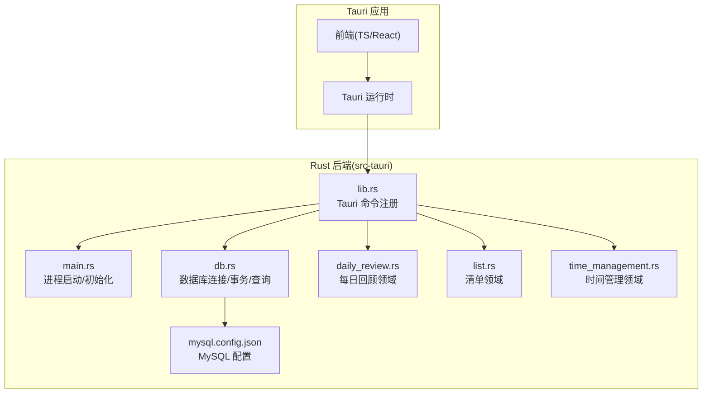
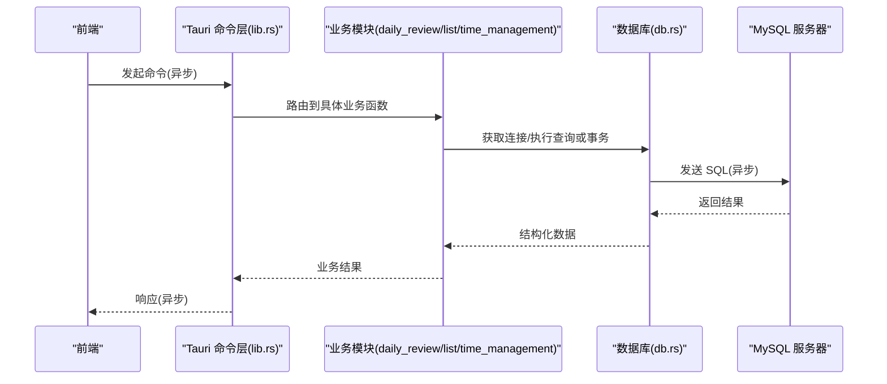
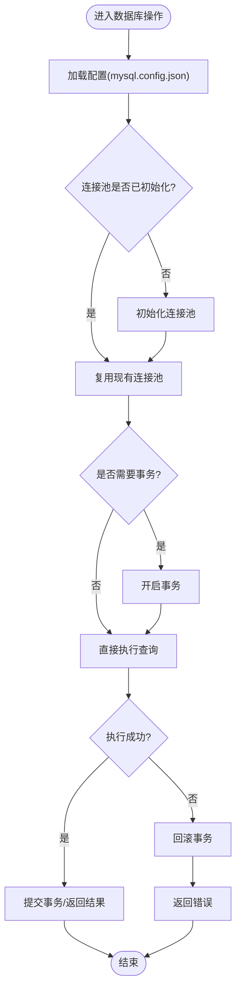
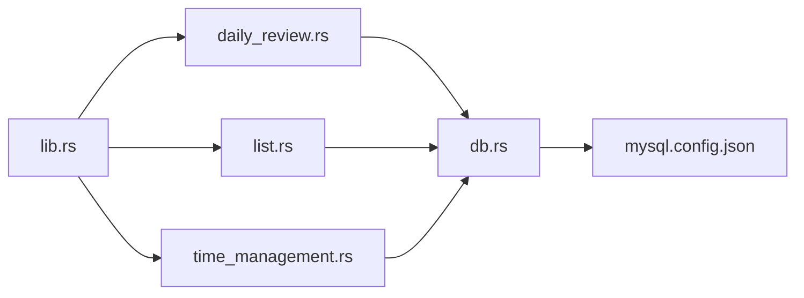

# Rust 异步编程模型

<cite>
**本文引用的文件**   
- [src-tauri/Cargo.toml](file://src-tauri/Cargo.toml)
- [src-tauri/src/main.rs](file://src-tauri/src/main.rs)
- [src-tauri/src/lib.rs](file://src-tauri/src/lib.rs)
- [src-tauri/src/db.rs](file://src-tauri/src/db.rs)
- [src-tauri/src/daily_review.rs](file://src-tauri/src/daily_review.rs)
- [src-tauri/src/list.rs](file://src-tauri/src/list.rs)
- [src-tauri/src/time_management.rs](file://src-tauri/src/time_management.rs)
- [src-tauri/mysql.config.json](file://src-tauri/mysql.config.json)
</cite>

## 目录
1. [简介](#简介)
2. [项目结构](#项目结构)
3. [核心组件](#核心组件)
4. [架构总览](#架构总览)
5. [详细组件分析](#详细组件分析)
6. [依赖关系分析](#依赖关系分析)
7. [性能考量](#性能考量)
8. [故障排查指南](#故障排查指南)
9. [结论](#结论)
10. [附录](#附录)

## 简介
本技术文档围绕 FishWorker 的 Rust 后端（Tauri 侧）展开，聚焦于异步编程模型与工程实践。内容涵盖：
- Tokio 异步运行时配置、任务调度机制与协程管理模式
- 异步数据库操作实现：连接池管理、事务处理、并发查询优化
- 异步 I/O 模式：文件读写、网络请求的异步处理
- 错误传播机制：Result 类型使用、panic 恢复策略
- 内存管理与所有权在异步环境中的应用要点
- 异步代码性能分析与调试技巧、常见陷阱与解决方案
- 结合仓库实际代码路径的示例指引与优化案例

## 项目结构
FishWorker 采用 Tauri 架构：前端为 TypeScript/React，后端为 Rust。Rust 后端位于 src-tauri 目录，负责系统能力暴露、数据库访问与业务逻辑封装。关键目录与职责如下：
- src-tauri/src：Rust 源码，包含主入口、Tauri 命令注册、数据库模块与各业务域模块
- src-tauri/Cargo.toml：依赖声明与构建配置
- src-tauri/mysql.config.json：MySQL 连接配置
- src-tauri/build.rs：构建脚本（如生成 schema 等）

图表来源
- [src-tauri/src/main.rs](file://src-tauri/src/main.rs)
- [src-tauri/src/lib.rs](file://src-tauri/src/lib.rs)
- [src-tauri/src/db.rs](file://src-tauri/src/db.rs)
- [src-tauri/src/daily_review.rs](file://src-tauri/src/daily_review.rs)
- [src-tauri/src/list.rs](file://src-tauri/src/list.rs)
- [src-tauri/src/time_management.rs](file://src-tauri/src/time_management.rs)
- [src-tauri/mysql.config.json](file://src-tauri/mysql.config.json)

章节来源
- [src-tauri/Cargo.toml](file://src-tauri/Cargo.toml)
- [src-tauri/src/main.rs](file://src-tauri/src/main.rs)
- [src-tauri/src/lib.rs](file://src-tauri/src/lib.rs)

## 核心组件
- 异步运行时与任务调度
  - 通过 Tokio 提供非阻塞 I/O 与多核并行执行能力；Tauri 默认集成 Tokio 运行时，可在应用启动阶段进行必要的运行时参数调优（线程数、事件循环等）。
  - 任务调度基于工作窃取与多队列模型，适合高并发 I/O 密集场景。
- 数据库层（db.rs）
  - 负责连接池创建、配置加载、事务边界控制、并发查询封装。
  - 与 MySQL 配置文件解耦，便于不同环境切换。
- 业务域模块（daily_review.rs、list.rs、time_management.rs）
  - 以 Tauri 命令形式暴露给前端，内部调用 db.rs 完成数据访问。
  - 各模块保持单一职责，便于测试与扩展。
- 配置与构建
  - mysql.config.json 集中管理连接参数；Cargo.toml 声明异步生态依赖（Tokio、数据库驱动、序列化等）。

章节来源
- [src-tauri/src/db.rs](file://src-tauri/src/db.rs)
- [src-tauri/src/daily_review.rs](file://src-tauri/src/daily_review.rs)
- [src-tauri/src/list.rs](file://src-tauri/src/list.rs)
- [src-tauri/src/time_management.rs](file://src-tauri/src/time_management.rs)
- [src-tauri/mysql.config.json](file://src-tauri/mysql.config.json)
- [src-tauri/Cargo.toml](file://src-tauri/Cargo.toml)

## 架构总览
下图展示从前端到 Rust 后端的异步调用链路与数据流向。

图表来源
- [src-tauri/src/lib.rs](file://src-tauri/src/lib.rs)
- [src-tauri/src/daily_review.rs](file://src-tauri/src/daily_review.rs)
- [src-tauri/src/list.rs](file://src-tauri/src/list.rs)
- [src-tauri/src/time_management.rs](file://src-tauri/src/time_management.rs)
- [src-tauri/src/db.rs](file://src-tauri/src/db.rs)

## 详细组件分析

### 异步运行时与任务调度
- 运行时配置
  - 在应用启动时初始化 Tokio 运行时，合理设置 worker 线程数与最大阻塞线程数，避免 CPU 与 I/O 资源争用。
  - 将耗时阻塞操作放入专用阻塞线程池，防止阻塞事件循环。
- 任务调度机制
  - Tokio 的多队列 + 工作窃取模型可自动平衡负载；对于 CPU 密集型任务建议限制并发度，避免抢占 I/O 任务。
- 协程管理模式
  - 使用 JoinHandle 管理子任务生命周期；对长时间运行的后台任务采用独立任务组与取消语义。
  - 利用 tokio::select! 组合多个异步源，实现超时、取消与优先级控制。

章节来源
- [src-tauri/src/main.rs](file://src-tauri/src/main.rs)
- [src-tauri/Cargo.toml](file://src-tauri/Cargo.toml)

### 数据库层设计与实现（db.rs）
- 连接池管理
  - 应用启动时根据 mysql.config.json 初始化连接池，复用连接减少握手开销。
  - 按业务域划分连接池或使用统一池配合标签化连接，避免热点表竞争。
- 事务处理
  - 提供事务封装：开始、提交、回滚；确保异常路径下正确回滚。
  - 嵌套事务通过保存点模拟，保证复杂业务流程一致性。
- 并发查询优化
  - 批量查询使用并行流式读取，限制并发度以避免打爆数据库连接。
  - 分页与游标结合，降低单次查询压力。
- 错误传播
  - 所有数据库操作返回 Result，上层统一转换为 Tauri 命令错误类型，便于前端感知。

图表来源
- [src-tauri/src/db.rs](file://src-tauri/src/db.rs)
- [src-tauri/mysql.config.json](file://src-tauri/mysql.config.json)

章节来源
- [src-tauri/src/db.rs](file://src-tauri/src/db.rs)
- [src-tauri/mysql.config.json](file://src-tauri/mysql.config.json)

### 业务域模块（daily_review.rs、list.rs、time_management.rs）
- 职责划分
  - daily_review.rs：每日回顾相关的数据聚合与统计。
  - list.rs：清单的增删改查、排序与模板管理。
  - time_management.rs：时间管理任务的计划、执行与复盘。
- 与 Tauri 命令集成
  - 各模块暴露异步命令接口，供前端调用；内部调用 db.rs 完成持久化。
- 并发与批处理
  - 对列表导入导出、批量更新等操作采用分片并发，限制并发度并合并结果。

章节来源
- [src-tauri/src/daily_review.rs](file://src-tauri/src/daily_review.rs)
- [src-tauri/src/list.rs](file://src-tauri/src/list.rs)
- [src-tauri/src/time_management.rs](file://src-tauri/src/time_management.rs)

### 异步 I/O 模式（文件读写与网络请求）
- 文件读写
  - 使用异步文件系统 API 进行大文件分块读写，避免阻塞事件循环。
  - 对日志、缓存文件采用缓冲写入与定期刷新策略。
- 网络请求
  - 使用异步 HTTP 客户端发起外部 API 调用，配置超时与重试退避。
  - 对第三方服务限流与熔断，保护本地资源。

章节来源
- [src-tauri/src/daily_review.rs](file://src-tauri/src/daily_review.rs)
- [src-tauri/src/list.rs](file://src-tauri/src/list.rs)
- [src-tauri/src/time_management.rs](file://src-tauri/src/time_management.rs)

### 错误传播与 panic 恢复
- Result 类型使用
  - 所有可能失败的异步操作返回 Result，上层统一转换与记录。
  - 区分可恢复错误与不可恢复错误，避免误用 panic。
- panic 恢复策略
  - 在关键任务中使用捕获机制，记录上下文并降级处理，保障整体可用性。
  - 对长期运行任务设置健康检查与重启策略。

章节来源
- [src-tauri/src/db.rs](file://src-tauri/src/db.rs)
- [src-tauri/src/lib.rs](file://src-tauri/src/lib.rs)

### 内存管理与所有权在异步环境中的应用
- 所有权与借用
  - 跨 await 边界传递数据需满足生命周期约束；必要时使用 Arc/Mutex 共享状态。
- 零拷贝与缓冲区
  - 在网络与文件 I/O 中尽量使用零拷贝视图，减少内存分配与复制。
- 泄漏防护
  - 谨慎使用静态全局引用；优先使用依赖注入与上下文传递。

章节来源
- [src-tauri/src/db.rs](file://src-tauri/src/db.rs)
- [src-tauri/src/lib.rs](file://src-tauri/src/lib.rs)

### 异步代码示例与优化案例（路径指引）
- 示例：并发查询与事务封装
  - 参考路径：[src-tauri/src/db.rs](file://src-tauri/src/db.rs)
- 示例：Tauri 命令与业务模块对接
  - 参考路径：[src-tauri/src/lib.rs](file://src-tauri/src/lib.rs)、[src-tauri/src/daily_review.rs](file://src-tauri/src/daily_review.rs)
- 示例：批量导入导出的分片并发
  - 参考路径：[src-tauri/src/list.rs](file://src-tauri/src/list.rs)
- 示例：时间管理任务的定时与取消
  - 参考路径：[src-tauri/src/time_management.rs](file://src-tauri/src/time_management.rs)

章节来源
- [src-tauri/src/db.rs](file://src-tauri/src/db.rs)
- [src-tauri/src/lib.rs](file://src-tauri/src/lib.rs)
- [src-tauri/src/daily_review.rs](file://src-tauri/src/daily_review.rs)
- [src-tauri/src/list.rs](file://src-tauri/src/list.rs)
- [src-tauri/src/time_management.rs](file://src-tauri/src/time_management.rs)

## 依赖关系分析
- 模块耦合
  - lib.rs 作为命令注册中心，低耦合地分发到各业务模块；业务模块仅依赖 db.rs 与配置。
- 外部依赖
  - Cargo.toml 声明了 Tokio、数据库驱动、HTTP 客户端等异步生态库。
- 潜在循环依赖
  - 当前分层清晰，未见循环依赖；若新增跨域回调需谨慎设计接口。

图表来源
- [src-tauri/src/lib.rs](file://src-tauri/src/lib.rs)
- [src-tauri/src/daily_review.rs](file://src-tauri/src/daily_review.rs)
- [src-tauri/src/list.rs](file://src-tauri/src/list.rs)
- [src-tauri/src/time_management.rs](file://src-tauri/src/time_management.rs)
- [src-tauri/src/db.rs](file://src-tauri/src/db.rs)
- [src-tauri/mysql.config.json](file://src-tauri/mysql.config.json)

章节来源
- [src-tauri/Cargo.toml](file://src-tauri/Cargo.toml)
- [src-tauri/src/lib.rs](file://src-tauri/src/lib.rs)

## 性能考量
- 运行时调优
  - 根据 CPU 核心数调整 worker 线程数；I/O 密集型可适当增加阻塞线程池大小。
- 数据库优化
  - 连接池大小与并发度匹配；热点查询加索引与缓存；批量操作使用事务与分批提交。
- 并发控制
  - 使用信号量或速率限制器控制外部 API 调用频率；避免雪崩效应。
- 内存与 GC
  - 减少临时对象分配；复用缓冲区；避免在大对象上频繁 clone。

## 故障排查指南
- 常见问题
  - 连接池耗尽：检查并发度与连接池上限，优化慢查询。
  - 事件循环阻塞：确认未在主循环中进行阻塞 I/O 或 CPU 密集计算。
  - 死锁与竞态：审查共享状态的互斥访问与顺序。
- 诊断工具
  - 使用 Tokio 监控指标与火焰图定位热点；结合日志与追踪 ID 串联调用链。
- 恢复策略
  - 对关键任务设置超时与重试；失败时降级与告警；保留上下文以便复现。

章节来源
- [src-tauri/src/db.rs](file://src-tauri/src/db.rs)
- [src-tauri/src/lib.rs](file://src-tauri/src/lib.rs)

## 结论
FishWorker 的 Rust 后端基于 Tokio 与 Tauri 构建了高并发、可扩展的异步服务。通过清晰的模块分层、完善的错误传播与健壮的事务封装，实现了稳定的数据库访问与高效的 I/O 处理。后续可在运行时调优、连接池策略与并发控制方面持续迭代，进一步提升吞吐与稳定性。

## 附录
- 术语
  - 协程：轻量级用户态线程，由运行时调度。
  - 连接池：复用数据库连接以减少开销。
  - 事务：原子性的一组操作，要么全部成功，要么全部回滚。
- 最佳实践清单
  - 始终返回 Result，避免在异步路径使用 panic。
  - 使用 select! 组合超时与取消。
  - 对批量操作进行分片与限流。
  - 为关键路径添加追踪与指标采集。