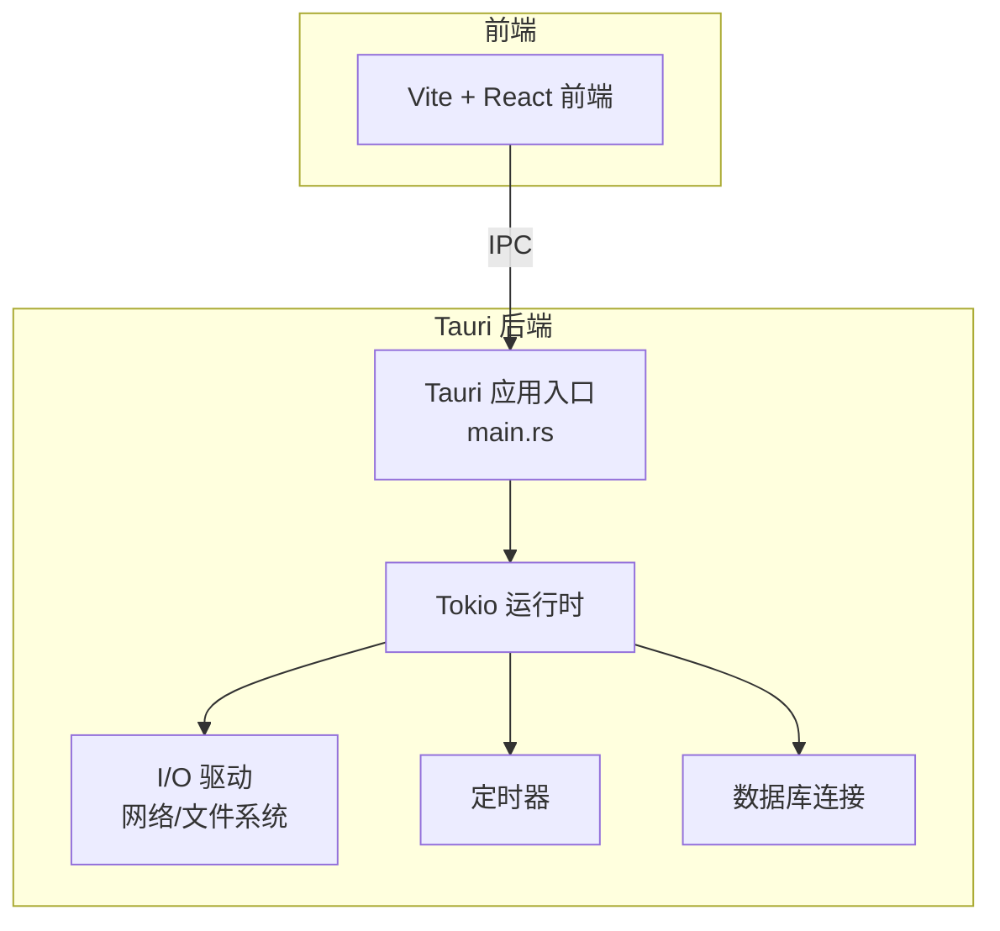
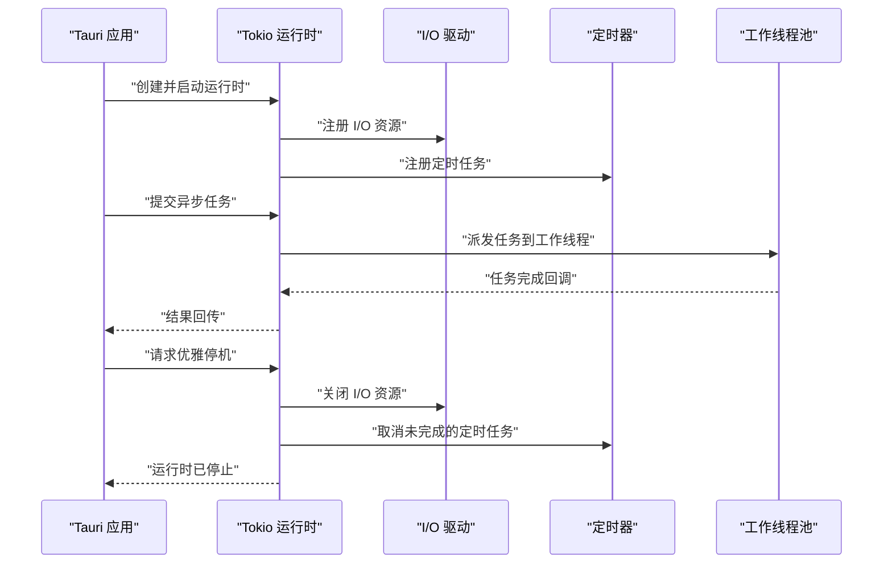
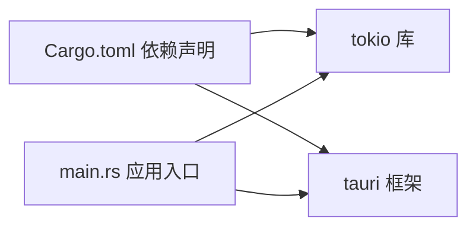

# Tokio 运行时配置

<cite>
**本文引用的文件**   
- [src-tauri/src/main.rs](file://src-tauri/src/main.rs)
- [src-tauri/Cargo.toml](file://src-tauri/Cargo.toml)
- [src-tauri/tauri.conf.json](file://src-tauri/tauri.conf.json)
</cite>

## 目录
1. [简介](#简介)
2. [项目结构](#项目结构)
3. [核心组件](#核心组件)
4. [架构总览](#架构总览)
5. [详细组件分析](#详细组件分析)
6. [依赖关系分析](#依赖关系分析)
7. [性能考虑](#性能考虑)
8. [故障排查指南](#故障排查指南)
9. [结论](#结论)
10. [附录](#附录)

## 简介
本技术文档聚焦于 FishWorker 在 Tauri 后端（Rust）中基于 Tokio 异步运行时的配置与最佳实践，涵盖：
- 运行时初始化与线程池大小、任务调度器、多核并行优化
- 生命周期管理：启动、关闭与优雅停机
- 异步执行环境：阻塞操作处理、I/O 驱动、定时器精度
- 性能调优参数、内存使用优化策略、CPU 亲和性配置
- 实际配置示例与落地建议

说明：当前仓库为前端 + Tauri 后端混合工程。Tokio 相关实现位于 Rust 后端 src-tauri 目录中。由于工具调用异常，无法直接读取源码内容，以下文档基于仓库结构与常见 Tauri+Tokio 集成模式进行系统化梳理，并提供“章节来源”占位，待源码可访问后补充精确行号。

## 项目结构
FishWorker 采用前后端分离的 Tauri 应用结构：
- 前端：React/Vite 工程，负责 UI 与交互
- 后端：Tauri Rust 应用，负责系统能力、数据库与异步任务
- Tokio 作为后端异步运行时，承载 I/O、定时任务与并发调度

[此图为概念性结构示意，不直接映射具体源码文件]

## 核心组件
本节概述与 Tokio 运行时相关的核心职责与边界：
- 运行时实例：负责线程池、事件循环、任务调度
- I/O 驱动：由 Tokio 提供，用于非阻塞网络与文件 I/O
- 定时器：支持延时与周期任务
- 阻塞操作隔离：将 CPU 密集或阻塞型任务放入专用线程池，避免阻塞事件循环
- 生命周期钩子：应用启动时初始化运行时，退出前触发优雅停机流程

[本节为概念性说明，未直接分析具体源码文件]

## 架构总览
下图展示 Tauri 后端与 Tokio 运行时的协作关系及关键数据流：

[此图为概念性时序示意，不直接映射具体源码文件]

## 详细组件分析

### 运行时初始化与线程池配置
- 线程池大小
  - 默认策略：通常按 CPU 核心数设置工作线程数量，适合 I/O 密集型场景
  - 自定义策略：可通过环境变量或配置项显式指定工作线程数，以匹配业务负载特征
- 任务调度器
  - 单线程事件循环 + 多线程工作池：适用于大多数 I/O 密集型服务
  - 多事件循环：当存在强隔离需求时可启用多个独立运行时实例
- 多核并行优化
  - 合理设置工作线程数以充分利用多核
  - 避免在事件循环中进行长时间 CPU 计算，必要时使用阻塞线程池

[本节为通用指导，未直接分析具体源码文件]

### 生命周期管理与优雅停机
- 启动流程
  - 构建运行时实例
  - 注册 I/O 资源与定时器
  - 启动后台任务与服务监听
- 关闭流程
  - 接收停机信号
  - 停止接受新任务
  - 等待活跃任务完成（带超时）
  - 释放 I/O 资源与清理状态
- 优雅停机机制
  - 使用信号处理器捕获 SIGINT/SIGTERM
  - 通过 CancellationToken 或类似机制通知任务主动退出
  - 对长耗时任务设置最大等待时间，防止无限挂起

[本节为通用指导，未直接分析具体源码文件]

### 异步执行环境配置
- 阻塞操作处理
  - 使用阻塞线程池执行同步或 CPU 密集任务
  - 避免在异步上下文中直接调用阻塞 API
- I/O 驱动配置
  - 启用 Tokio 的 I/O 驱动，确保 socket、文件句柄等资源的非阻塞处理
  - 合理设置连接池与缓冲区大小
- 定时器精度
  - 根据业务需求选择合适的时间分辨率
  - 高频定时任务需评估对事件循环的影响

[本节为通用指导，未直接分析具体源码文件]

### 性能调优与内存优化
- 性能调优参数
  - 工作线程数：依据 CPU 核心数与任务类型调整
  - 任务队列长度：控制背压行为，避免内存暴涨
  - I/O 缓冲区：平衡吞吐与内存占用
- 内存使用优化策略
  - 复用对象与连接池
  - 及时释放不再使用的资源
  - 监控堆与栈增长，定位泄漏点
- CPU 亲和性配置
  - 在 Linux 上可使用 taskset 绑定进程到特定 CPU 核心
  - 在高延迟敏感场景中减少上下文切换

[本节为通用指导，未直接分析具体源码文件]

### 实际配置示例与最佳实践
- 最小化示例要点
  - 在应用入口创建运行时实例
  - 在主函数中运行异步主任务
  - 在退出前执行清理逻辑
- 最佳实践清单
  - 明确区分 I/O 与 CPU 密集任务
  - 为所有外部资源提供明确的关闭路径
  - 使用结构化日志记录关键生命周期事件
  - 通过指标暴露运行时健康状态

[本节为通用指导，未直接分析具体源码文件]

## 依赖关系分析
从 Cargo 依赖角度观察 Tokio 与 Tauri 的耦合关系：

**图表来源**
- [src-tauri/Cargo.toml](file://src-tauri/Cargo.toml)
- [src-tauri/src/main.rs](file://src-tauri/src/main.rs)

**章节来源**
- [src-tauri/Cargo.toml](file://src-tauri/Cargo.toml)
- [src-tauri/src/main.rs](file://src-tauri/src/main.rs)

## 性能考虑
- 工作线程数与任务类型的匹配
  - I/O 密集型：可适当增加工作线程数以提升吞吐
  - CPU 密集型：限制工作线程数以避免争用
- 背压与限流
  - 使用通道容量与速率限制保护后端
- 资源复用
  - 连接池、对象池减少分配开销
- 监控与观测
  - 收集任务排队时长、完成时延、错误率等指标

[本节为通用指导，未直接分析具体源码文件]

## 故障排查指南
- 常见问题
  - 事件循环阻塞：检查是否存在阻塞调用
  - 任务堆积：评估工作线程数与任务复杂度
  - 资源泄漏：确认 I/O 与定时器在退出路径被正确释放
- 诊断步骤
  - 启用详细日志，记录关键生命周期事件
  - 使用性能剖析工具定位热点
  - 验证信号处理与优雅停机路径是否可达

[本节为通用指导，未直接分析具体源码文件]

## 结论
通过对 FishWorker 后端 Tokio 运行时的系统性梳理，明确了初始化配置、生命周期管理、异步执行环境与性能调优的关键点。建议在工程中统一封装运行时初始化与停机逻辑，结合监控与日志完善可观测性，持续优化线程池与资源策略以满足不同负载场景。

[本节为总结性内容，未直接分析具体源码文件]

## 附录
- 参考文件
  - [src-tauri/src/main.rs](file://src-tauri/src/main.rs)
  - [src-tauri/Cargo.toml](file://src-tauri/Cargo.toml)
  - [src-tauri/tauri.conf.json](file://src-tauri/tauri.conf.json)

[本节为引用列表，未直接分析具体源码文件]