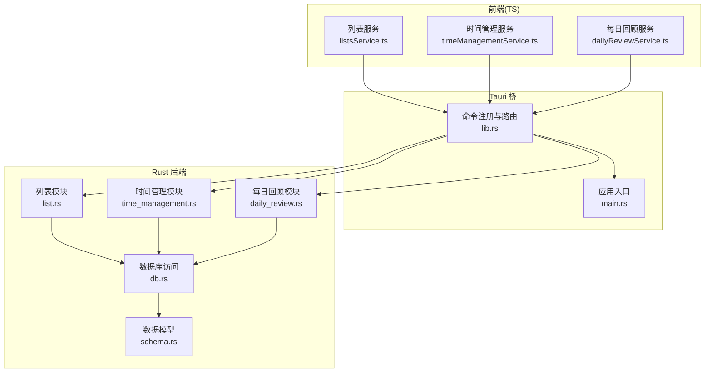
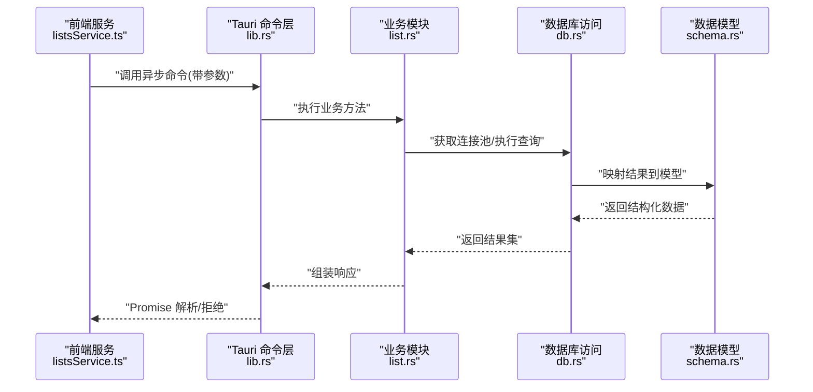
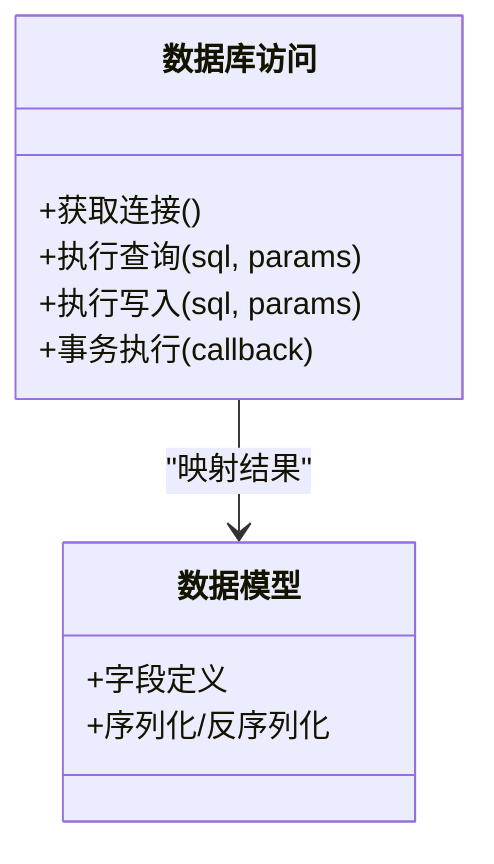
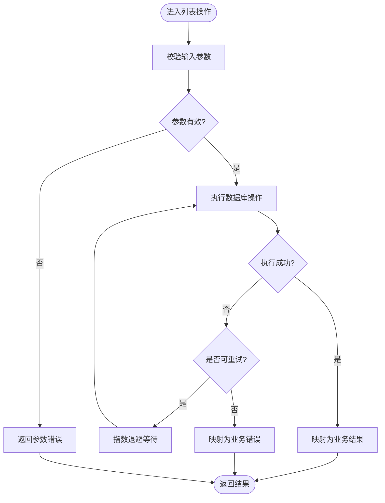
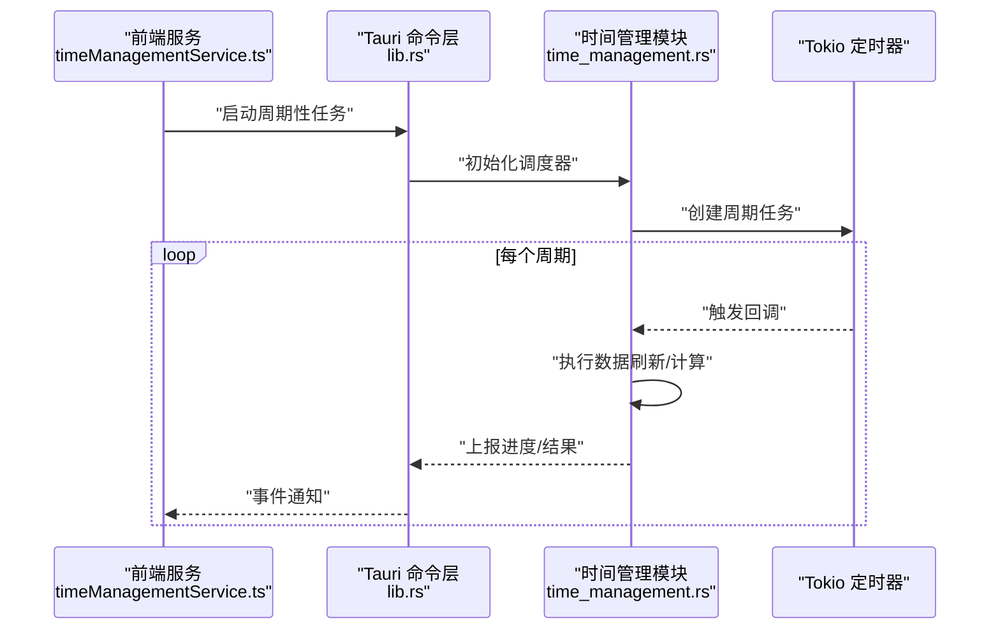
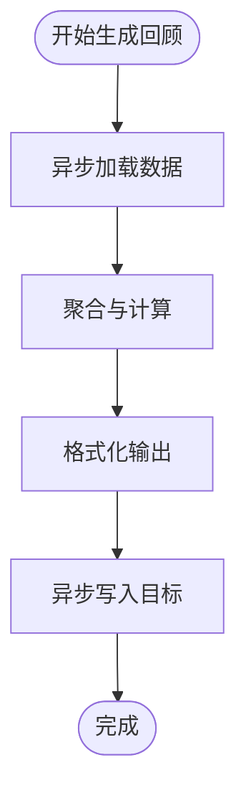
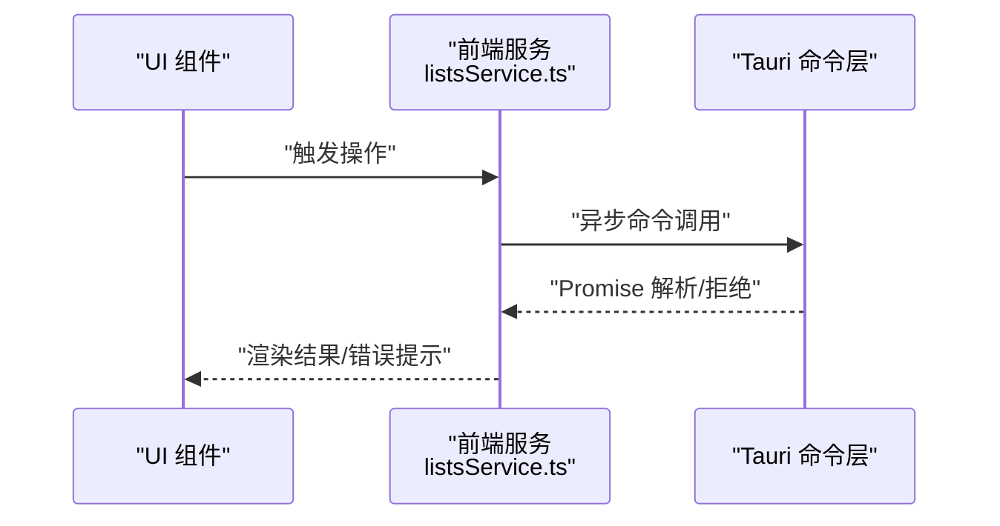
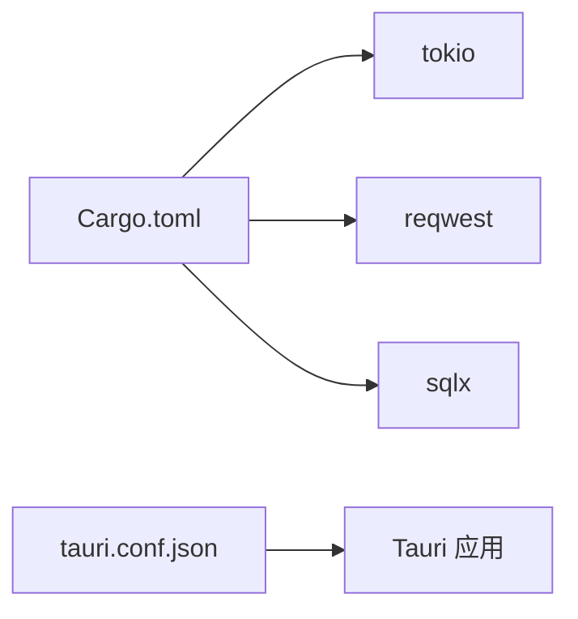

# 异步 I/O 操作

<cite>
**本文引用的文件**   
- [src-tauri/src/lib.rs](file://src-tauri/src/lib.rs)
- [src-tauri/src/main.rs](file://src-tauri/src/main.rs)
- [src-tauri/Cargo.toml](file://src-tauri/Cargo.toml)
- [src-tauri/tauri.conf.json](file://src-tauri/tauri.conf.json)
- [src-tauri/mysql.config.json](file://src-tauri/mysql.config.json)
- [src-tauri/src/db.rs](file://src-tauri/src/db.rs)
- [src-tauri/src/daily_review.rs](file://src-tauri/src/daily_review.rs)
- [src-tauri/src/list.rs](file://src-tauri/src/list.rs)
- [src-tauri/src/time_management.rs](file://src-tauri/src/time_management.rs)
- [src-tauri/src/schema.rs](file://src-tauri/src/schema.rs)
- [src/features/lists/listsService.ts](file://src/features/lists/listsService.ts)
- [src/features/time-management/timeManagementService.ts](file://src/features/time-management/timeManagementService.ts)
- [src/features/daily-review/dailyReviewService.ts](file://src/features/daily-review/dailyReviewService.ts)
</cite>

## 目录
1. [简介](#简介)
2. [项目结构](#项目结构)
3. [核心组件](#核心组件)
4. [架构总览](#架构总览)
5. [详细组件分析](#详细组件分析)
6. [依赖分析](#依赖分析)
7. [性能考虑](#性能考虑)
8. [故障排查指南](#故障排查指南)
9. [结论](#结论)
10. [附录](#附录)

## 简介
本技术文档聚焦 FishWorker 的异步 I/O 能力，覆盖以下主题：
- 异步文件读写与缓冲区管理、流式数据处理
- 网络请求的异步实现、HTTP 客户端配置与连接池管理
- 进程间通信（IPC）管道、事件驱动编程模式
- 异步定时器与轮询机制、延迟执行与周期性任务调度
- I/O 性能优化策略（零拷贝、批量操作）
- 实际异步 I/O 示例、错误处理与重试机制、超时控制

FishWorker 采用 Tauri + Rust 后端与 TypeScript 前端组合。Rust 侧通过 tokio 运行时提供高并发异步 I/O；Tauri 命令作为前后端 IPC 桥接点；前端以 Promise/async-await 风格调用后端命令，形成端到端的异步数据通路。

## 项目结构
从异步 I/O 视角，关键目录与职责如下：
- src-tauri/src：Rust 后端核心逻辑，包含应用入口、Tauri 命令注册、数据库访问、业务模块等
- src-tauri/Cargo.toml：Rust 依赖声明（如 tokio、reqwest、sqlx 等）
- src-tauri/tauri.conf.json：Tauri 应用配置（窗口、权限、插件等）
- src-tauri/mysql.config.json：数据库连接参数
- src/features/*：前端功能模块，封装对 Tauri 命令的异步调用与服务层逻辑

图表来源
- [src-tauri/src/main.rs](file://src-tauri/src/main.rs)
- [src-tauri/src/lib.rs](file://src-tauri/src/lib.rs)
- [src-tauri/src/db.rs](file://src-tauri/src/db.rs)
- [src-tauri/src/list.rs](file://src-tauri/src/list.rs)
- [src-tauri/src/time_management.rs](file://src-tauri/src/time_management.rs)
- [src-tauri/src/daily_review.rs](file://src-tauri/src/daily_review.rs)
- [src-tauri/src/schema.rs](file://src-tauri/src/schema.rs)

章节来源
- [src-tauri/src/main.rs](file://src-tauri/src/main.rs)
- [src-tauri/src/lib.rs](file://src-tauri/src/lib.rs)
- [src-tauri/Cargo.toml](file://src-tauri/Cargo.toml)
- [src-tauri/tauri.conf.json](file://src-tauri/tauri.conf.json)

## 核心组件
- Tauri 命令层：将前端调用映射到 Rust 函数，承载异步 I/O 编排与错误传播
- 数据库访问层：基于 sqlx 的异步连接池，提供查询与写入接口
- 业务模块：列表、时间管理、每日回顾等，封装领域逻辑并复用数据库访问
- 前端服务层：以 async/await 调用 Tauri 命令，统一错误处理与重试策略

章节来源
- [src-tauri/src/lib.rs](file://src-tauri/src/lib.rs)
- [src-tauri/src/db.rs](file://src-tauri/src/db.rs)
- [src-tauri/src/list.rs](file://src-tauri/src/list.rs)
- [src-tauri/src/time_management.rs](file://src-tauri/src/time_management.rs)
- [src-tauri/src/daily_review.rs](file://src-tauri/src/daily_review.rs)
- [src/features/lists/listsService.ts](file://src/features/lists/listsService.ts)
- [src/features/time-management/timeManagementService.ts](file://src/features/time-management/timeManagementService.ts)
- [src/features/daily-review/dailyReviewService.ts](file://src/features/daily-review/dailyReviewService.ts)

## 架构总览
下图展示一次典型的前端发起、Tauri 转发、Rust 异步 I/O 执行的端到端流程。

图表来源
- [src/features/lists/listsService.ts](file://src/features/lists/listsService.ts)
- [src-tauri/src/lib.rs](file://src-tauri/src/lib.rs)
- [src-tauri/src/list.rs](file://src-tauri/src/list.rs)
- [src-tauri/src/db.rs](file://src-tauri/src/db.rs)
- [src-tauri/src/schema.rs](file://src-tauri/src/schema.rs)

## 详细组件分析

### 数据库访问层（异步连接池与查询）
- 使用 sqlx 的异步连接池，避免阻塞线程
- 在连接池中缓存连接，减少握手开销
- 将 SQL 结果映射为强类型模型，提升安全性与可维护性
- 支持事务与批处理（按业务需要）

图表来源
- [src-tauri/src/db.rs](file://src-tauri/src/db.rs)
- [src-tauri/src/schema.rs](file://src-tauri/src/schema.rs)

章节来源
- [src-tauri/src/db.rs](file://src-tauri/src/db.rs)
- [src-tauri/src/schema.rs](file://src-tauri/src/schema.rs)

### 列表模块（I/O 编排与错误处理）
- 封装列表的增删改查，内部调用数据库访问层
- 对异常进行捕获并转换为统一的错误类型，便于前端处理
- 可选地引入重试与退避策略（针对瞬时失败）

图表来源
- [src-tauri/src/list.rs](file://src-tauri/src/list.rs)
- [src-tauri/src/db.rs](file://src-tauri/src/db.rs)

章节来源
- [src-tauri/src/list.rs](file://src-tauri/src/list.rs)
- [src-tauri/src/db.rs](file://src-tauri/src/db.rs)

### 时间管理模块（定时任务与轮询）
- 使用 tokio::time 提供的延时与周期任务 API
- 支持一次性延迟执行与周期性调度
- 结合 Tauri 事件或共享状态，向 UI 推送更新

图表来源
- [src-tauri/src/time_management.rs](file://src-tauri/src/time_management.rs)
- [src/features/time-management/timeManagementService.ts](file://src/features/time-management/timeManagementService.ts)

章节来源
- [src-tauri/src/time_management.rs](file://src-tauri/src/time_management.rs)
- [src/features/time-management/timeManagementService.ts](file://src/features/time-management/timeManagementService.ts)

### 每日回顾模块（异步聚合与导出）
- 聚合多源数据，生成回顾报告
- 支持异步读取与写入，必要时分块处理大对象
- 提供进度反馈与取消机制（通过共享状态或信号）

图表来源
- [src-tauri/src/daily_review.rs](file://src-tauri/src/daily_review.rs)

章节来源
- [src-tauri/src/daily_review.rs](file://src-tauri/src/daily_review.rs)

### 前端服务层（异步调用与重试）
- 使用 async/await 调用 Tauri 命令
- 统一错误处理与用户提示
- 可选的重试与退避策略，提升鲁棒性

图表来源
- [src/features/lists/listsService.ts](file://src/features/lists/listsService.ts)
- [src-tauri/src/lib.rs](file://src-tauri/src/lib.rs)

章节来源
- [src/features/lists/listsService.ts](file://src/features/lists/listsService.ts)
- [src-tauri/src/lib.rs](file://src-tauri/src/lib.rs)

## 依赖分析
- Rust 侧依赖（示例）：tokio（异步运行时）、reqwest（HTTP 客户端）、sqlx（异步数据库访问）
- Tauri 配置：窗口、权限、插件等
- 前端依赖：React/Vite 生态，TS 类型系统

图表来源
- [src-tauri/Cargo.toml](file://src-tauri/Cargo.toml)
- [src-tauri/tauri.conf.json](file://src-tauri/tauri.conf.json)

章节来源
- [src-tauri/Cargo.toml](file://src-tauri/Cargo.toml)
- [src-tauri/tauri.conf.json](file://src-tauri/tauri.conf.json)

## 性能考虑
- 连接池与复用：合理设置最大连接数，避免频繁握手
- 批处理与合并：将多次小写合并为批量写入，降低 I/O 次数
- 零拷贝与缓冲：在可能的情况下使用零拷贝路径，减少内存复制
- 流式处理：对大文件或大数据集采用分块读取/写入，控制内存占用
- 超时与限流：为网络与数据库操作设置超时，防止资源泄漏
- 退避与重试：对瞬时失败采用指数退避，避免雪崩效应

[本节为通用指导，不直接分析具体文件]

## 故障排查指南
- 常见错误分类
  - 参数校验失败：检查输入结构与约束
  - 数据库连接失败：核对连接参数与网络可达性
  - 超时与中断：检查超时配置与任务生命周期
  - 重复提交与竞态：确保幂等性与锁机制
- 日志与追踪
  - 在关键路径记录上下文信息（请求 ID、参数摘要）
  - 区分警告与错误级别，便于快速定位
- 恢复策略
  - 自动重试与人工干预开关
  - 降级与熔断，保护核心链路

章节来源
- [src-tauri/src/db.rs](file://src-tauri/src/db.rs)
- [src-tauri/src/list.rs](file://src-tauri/src/list.rs)
- [src-tauri/src/time_management.rs](file://src-tauri/src/time_management.rs)
- [src-tauri/src/daily_review.rs](file://src-tauri/src/daily_review.rs)

## 结论
FishWorker 通过 Tauri 命令层将前端与 Rust 异步 I/O 无缝衔接，利用 tokio 的高并发能力与 sqlx 的连接池，实现了稳定高效的数据库访问与业务编排。配合前端服务的统一错误处理与重试策略，整体具备较好的鲁棒性与可扩展性。建议在后续迭代中进一步完善流式处理、零拷贝路径与更细粒度的监控指标。

[本节为总结，不直接分析具体文件]

## 附录

### 配置与环境
- 数据库配置：mysql.config.json
- Tauri 应用配置：tauri.conf.json

章节来源
- [src-tauri/mysql.config.json](file://src-tauri/mysql.config.json)
- [src-tauri/tauri.conf.json](file://src-tauri/tauri.conf.json)