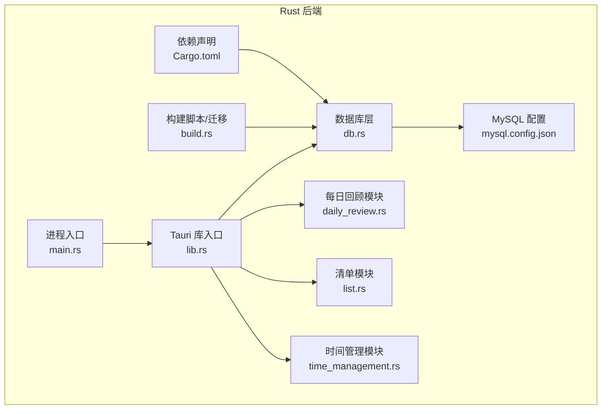
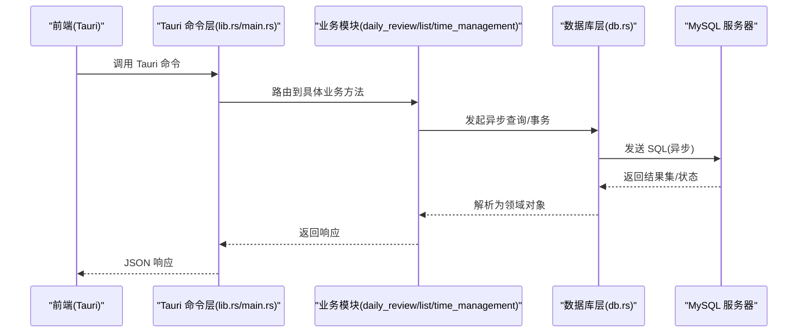
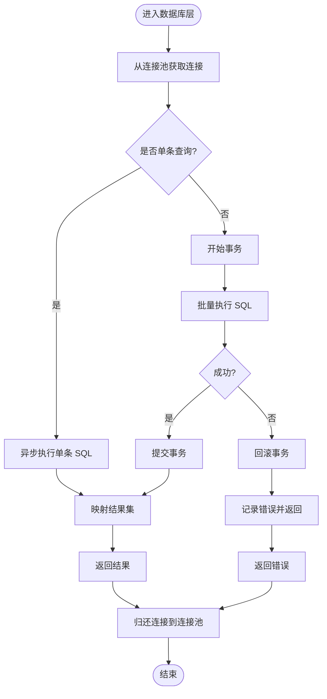
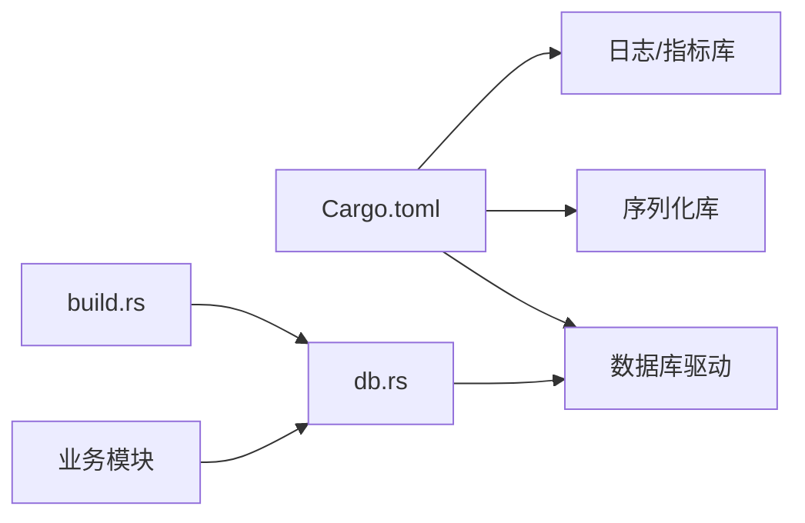

# 数据库 I/O 操作

<cite>
**本文引用的文件**   
- [src-tauri/src/db.rs](file://src-tauri/src/db.rs)
- [src-tauri/Cargo.toml](file://src-tauri/Cargo.toml)
- [src-tauri/mysql.config.json](file://src-tauri/mysql.config.json)
- [src-tauri/build.rs](file://src-tauri/build.rs)
- [src-tauri/src/lib.rs](file://src-tauri/src/lib.rs)
- [src-tauri/src/main.rs](file://src-tauri/src/main.rs)
- [src-tauri/src/daily_review.rs](file://src-tauri/src/daily_review.rs)
- [src-tauri/src/list.rs](file://src-tauri/src/list.rs)
- [src-tauri/src/time_management.rs](file://src-tauri/src/time_management.rs)
</cite>

## 目录
1. [简介](#简介)
2. [项目结构](#项目结构)
3. [核心组件](#核心组件)
4. [架构总览](#架构总览)
5. [详细组件分析](#详细组件分析)
6. [依赖分析](#依赖分析)
7. [性能考虑](#性能考虑)
8. [故障排查指南](#故障排查指南)
9. [结论](#结论)
10. [附录](#附录)

## 简介
本技术文档聚焦 FishWorker 后端（Tauri Rust 侧）的数据库 I/O 操作，围绕异步查询、连接池管理、事务与并发安全、流式处理、连接生命周期、超时配置、批量优化、索引策略、慢查询分析与监控、错误处理与重连、以及迁移执行等主题进行系统化说明。文档旨在帮助开发者理解并正确使用底层数据库能力，提升系统稳定性与性能。

## 项目结构
FishWorker 使用 Tauri 将前端与 Rust 后端桥接。数据库相关实现集中在 src-tauri 目录中：
- 数据库连接与工具：db.rs
- 业务模块对数据库的调用：daily_review.rs、list.rs、time_management.rs
- 构建脚本与迁移：build.rs
- 依赖声明：Cargo.toml
- 运行时入口与命令注册：main.rs、lib.rs
- MySQL 配置：mysql.config.json

图表来源
- [src-tauri/src/db.rs](file://src-tauri/src/db.rs)
- [src-tauri/src/daily_review.rs](file://src-tauri/src/daily_review.rs)
- [src-tauri/src/list.rs](file://src-tauri/src/list.rs)
- [src-tauri/src/time_management.rs](file://src-tauri/src/time_management.rs)
- [src-tauri/src/lib.rs](file://src-tauri/src/lib.rs)
- [src-tauri/src/main.rs](file://src-tauri/src/main.rs)
- [src-tauri/build.rs](file://src-tauri/build.rs)
- [src-tauri/mysql.config.json](file://src-tauri/mysql.config.json)
- [src-tauri/Cargo.toml](file://src-tauri/Cargo.toml)

章节来源
- [src-tauri/src/db.rs](file://src-tauri/src/db.rs)
- [src-tauri/src/lib.rs](file://src-tauri/src/lib.rs)
- [src-tauri/src/main.rs](file://src-tauri/src/main.rs)
- [src-tauri/build.rs](file://src-tauri/build.rs)
- [src-tauri/Cargo.toml](file://src-tauri/Cargo.toml)
- [src-tauri/mysql.config.json](file://src-tauri/mysql.config.json)

## 核心组件
- 数据库连接与连接池：负责建立与管理到 MySQL 的连接，提供异步查询接口。
- 业务模块：通过 Tauri 命令暴露给前端，内部调用数据库层完成数据读写。
- 构建脚本：在构建阶段执行迁移或初始化工作。
- 配置与依赖：集中管理数据库驱动、连接参数与版本。

章节来源
- [src-tauri/src/db.rs](file://src-tauri/src/db.rs)
- [src-tauri/src/daily_review.rs](file://src-tauri/src/daily_review.rs)
- [src-tauri/src/list.rs](file://src-tauri/src/list.rs)
- [src-tauri/src/time_management.rs](file://src-tauri/src/time_management.rs)
- [src-tauri/build.rs](file://src-tauri/build.rs)
- [src-tauri/Cargo.toml](file://src-tauri/Cargo.toml)
- [src-tauri/mysql.config.json](file://src-tauri/mysql.config.json)

## 架构总览
下图展示了从前端请求到数据库层的完整链路，包括 Tauri 命令分发、业务逻辑、数据库层与 MySQL 交互。

图表来源
- [src-tauri/src/lib.rs](file://src-tauri/src/lib.rs)
- [src-tauri/src/main.rs](file://src-tauri/src/main.rs)
- [src-tauri/src/daily_review.rs](file://src-tauri/src/daily_review.rs)
- [src-tauri/src/list.rs](file://src-tauri/src/list.rs)
- [src-tauri/src/time_management.rs](file://src-tauri/src/time_management.rs)
- [src-tauri/src/db.rs](file://src-tauri/src/db.rs)

## 详细组件分析

### 数据库层（db.rs）
- 职责
  - 管理数据库连接与连接池
  - 提供统一的异步查询接口
  - 封装事务边界与错误类型
  - 支持批量写入与流式读取
- 关键设计点
  - 连接池：基于驱动提供的连接池能力，控制最大连接数、空闲连接回收与超时。
  - 异步特性：所有 I/O 操作以异步方式执行，避免阻塞事件循环。
  - 事务：封装 begin/commit/rollback，确保一致性。
  - 错误处理：统一错误类型与重试策略，区分可恢复与不可恢复错误。
  - 流式处理：对大结果集采用迭代器/游标模式，降低内存峰值。
  - 连接复用：跨请求复用连接，减少握手开销。
  - 超时配置：连接、查询、事务均设置合理超时，防止资源泄漏。
- 典型流程
  - 建立连接：应用启动时初始化连接池；按需获取连接。
  - 执行查询：构造 SQL，绑定参数，异步执行并映射为结构化类型。
  - 事务处理：包裹多条语句，保证原子性。
  - 关闭连接：应用退出时优雅关闭连接池，释放资源。

图表来源
- [src-tauri/src/db.rs](file://src-tauri/src/db.rs)

章节来源
- [src-tauri/src/db.rs](file://src-tauri/src/db.rs)

### 业务模块（daily_review.rs、list.rs、time_management.rs）
- 职责
  - 定义面向前端的 Tauri 命令
  - 编排业务逻辑，调用数据库层完成数据访问
  - 组装/校验输入输出，处理领域模型转换
- 并发安全
  - 各模块函数无共享可变状态，依赖数据库层提供的线程安全的连接池
  - 通过消息传递与命令分发避免竞态条件
- 示例路径
  - 每日回顾：[src-tauri/src/daily_review.rs](file://src-tauri/src/daily_review.rs)
  - 清单：[src-tauri/src/list.rs](file://src-tauri/src/list.rs)
  - 时间管理：[src-tauri/src/time_management.rs](file://src-tauri/src/time_management.rs)

章节来源
- [src-tauri/src/daily_review.rs](file://src-tauri/src/daily_review.rs)
- [src-tauri/src/list.rs](file://src-tauri/src/list.rs)
- [src-tauri/src/time_management.rs](file://src-tauri/src/time_management.rs)

### 构建脚本与迁移（build.rs）
- 职责
  - 在构建阶段执行数据库迁移或初始化脚本
  - 确保运行环境具备正确的表结构与初始数据
- 异步迁移
  - 若迁移涉及网络 I/O，应使用异步驱动并在构建脚本中正确调度
  - 失败时应中止构建，提示修复方案
- 参考路径
  - [src-tauri/build.rs](file://src-tauri/build.rs)

章节来源
- [src-tauri/build.rs](file://src-tauri/build.rs)

### 配置与依赖（Cargo.toml、mysql.config.json）
- 依赖声明
  - 数据库驱动与异步运行时在 Cargo.toml 中声明
  - 建议启用连接池、TLS、日志等特性
- 连接配置
  - mysql.config.json 集中存放主机、端口、用户、密码、数据库名、SSL 等参数
  - 支持多环境切换（开发/测试/生产）
- 参考路径
  - [src-tauri/Cargo.toml](file://src-tauri/Cargo.toml)
  - [src-tauri/mysql.config.json](file://src-tauri/mysql.config.json)

章节来源
- [src-tauri/Cargo.toml](file://src-tauri/Cargo.toml)
- [src-tauri/mysql.config.json](file://src-tauri/mysql.config.json)

### Tauri 命令与入口（lib.rs、main.rs）
- 职责
  - lib.rs：注册 Tauri 插件与命令，暴露给前端
  - main.rs：启动 Tauri 应用，加载配置与命令
- 与数据库层集成
  - 命令处理器直接调用业务模块，最终落到数据库层
- 参考路径
  - [src-tauri/src/lib.rs](file://src-tauri/src/lib.rs)
  - [src-tauri/src/main.rs](file://src-tauri/src/main.rs)

章节来源
- [src-tauri/src/lib.rs](file://src-tauri/src/lib.rs)
- [src-tauri/src/main.rs](file://src-tauri/src/main.rs)

## 依赖分析
- 外部依赖
  - 数据库驱动：用于 MySQL 的异步客户端与连接池
  - 序列化/反序列化：用于前后端数据交换
  - 日志与指标：用于慢查询与错误追踪
- 内部耦合
  - 业务模块仅依赖数据库层抽象，保持低耦合
  - 构建脚本与运行时解耦，便于独立测试

图表来源
- [src-tauri/Cargo.toml](file://src-tauri/Cargo.toml)
- [src-tauri/src/db.rs](file://src-tauri/src/db.rs)
- [src-tauri/build.rs](file://src-tauri/build.rs)

章节来源
- [src-tauri/Cargo.toml](file://src-tauri/Cargo.toml)

## 性能考虑
- 连接池调优
  - 根据并发量与数据库容量设置最大连接数
  - 调整空闲连接回收时间与最小连接数，平衡资源占用与延迟
- 批量操作
  - 合并多次插入/更新为批量语句，减少往返次数
  - 使用事务包裹批量操作，提高吞吐与一致性
- 流式处理
  - 对大结果集使用迭代器/游标，避免一次性加载到内存
- 索引策略
  - 针对高频过滤、排序与关联字段建立合适索引
  - 定期审查覆盖索引与冗余索引
- 慢查询分析
  - 开启慢查询日志，结合 EXPLAIN 分析执行计划
  - 关注全表扫描、临时表与文件排序
- 超时与限流
  - 为连接、查询、事务设置合理超时，避免长尾请求
  - 在高负载场景下实施限流与退避策略

## 故障排查指南
- 常见问题
  - 连接失败：检查 mysql.config.json 中的主机、端口、认证信息
  - 连接池耗尽：监控活跃连接数，适当增大池大小或优化慢查询
  - 事务超时：拆分大事务或优化 SQL 执行计划
  - 死锁：调整写入顺序与隔离级别，必要时重试
- 错误分类与重试
  - 可恢复错误（网络抖动、瞬时超时）：指数退避重试
  - 不可恢复错误（权限不足、语法错误）：快速失败并上报
- 监控与告警
  - 采集连接池指标、查询耗时、错误率
  - 设置阈值告警，及时定位瓶颈
- 参考路径
  - 错误处理与重试逻辑：[src-tauri/src/db.rs](file://src-tauri/src/db.rs)
  - 业务错误上报：[src-tauri/src/daily_review.rs](file://src-tauri/src/daily_review.rs)、[src-tauri/src/list.rs](file://src-tauri/src/list.rs)、[src-tauri/src/time_management.rs](file://src-tauri/src/time_management.rs)

章节来源
- [src-tauri/src/db.rs](file://src-tauri/src/db.rs)
- [src-tauri/src/daily_review.rs](file://src-tauri/src/daily_review.rs)
- [src-tauri/src/list.rs](file://src-tauri/src/list.rs)
- [src-tauri/src/time_management.rs](file://src-tauri/src/time_management.rs)

## 结论
FishWorker 的数据库 I/O 以异步为核心，通过连接池、事务、批量化与流式处理等手段，兼顾高吞吐与低延迟。合理的索引与慢查询治理是长期稳定的关键。完善的错误处理与监控体系有助于快速定位问题并持续优化。

## 附录
- 实际异步数据库操作示例路径
  - 单条查询与映射：[src-tauri/src/db.rs](file://src-tauri/src/db.rs)
  - 批量写入与事务：[src-tauri/src/db.rs](file://src-tauri/src/db.rs)
  - 流式读取大结果集：[src-tauri/src/db.rs](file://src-tauri/src/db.rs)
  - 错误处理与重试：[src-tauri/src/db.rs](file://src-tauri/src/db.rs)
- 迁移异步执行示例路径
  - 构建期迁移：[src-tauri/build.rs](file://src-tauri/build.rs)
- 配置与依赖示例路径
  - 连接参数：[src-tauri/mysql.config.json](file://src-tauri/mysql.config.json)
  - 驱动与特性：[src-tauri/Cargo.toml](file://src-tauri/Cargo.toml)