# 文件 I/O 操作

<cite>
**本文引用的文件**   
- [src-tauri/src/db.rs](file://src-tauri/src/db.rs)
- [src-tauri/Cargo.toml](file://src-tauri/Cargo.toml)
- [src-tauri/tauri.conf.json](file://src-tauri/tauri.conf.json)
- [src-tauri/mysql.config.json](file://src-tauri/mysql.config.json)
</cite>

## 目录
1. [简介](#简介)
2. [项目结构](#项目结构)
3. [核心组件](#核心组件)
4. [架构总览](#架构总览)
5. [详细组件分析](#详细组件分析)
6. [依赖关系分析](#依赖关系分析)
7. [性能考虑](#性能考虑)
8. [故障排查指南](#故障排查指南)
9. [结论](#结论)
10. [附录](#附录)

## 简介
本技术文档聚焦 FishWorker 后端（Tauri Rust 侧）的文件 I/O 与数据库持久化实现，重点覆盖：
- 异步文件读写（tokio::fs）的使用方式、缓冲区优化与大文件流式处理策略
- SQLite 数据库的异步连接池管理、事务处理与并发访问控制
- 配置文件读取、日志文件的异步写入、数据备份与恢复流程
- 文件锁机制、错误处理与重试逻辑
- 实际可落地的代码示例路径、性能优化技巧与内存映射文件使用场景

说明：当前仓库以 Tauri + Rust 为主，前端为 TypeScript/React。本文档仅分析与文件 I/O 相关的后端实现与配置。

## 项目结构
与文件 I/O 直接相关的后端源码位于 src-tauri/src 下，其中 db.rs 负责数据库与持久化相关能力；Cargo.toml 声明了运行时依赖（如 tokio、sqlx、rusqlite 等），tauri.conf.json 提供应用级配置，mysql.config.json 用于外部数据库配置。

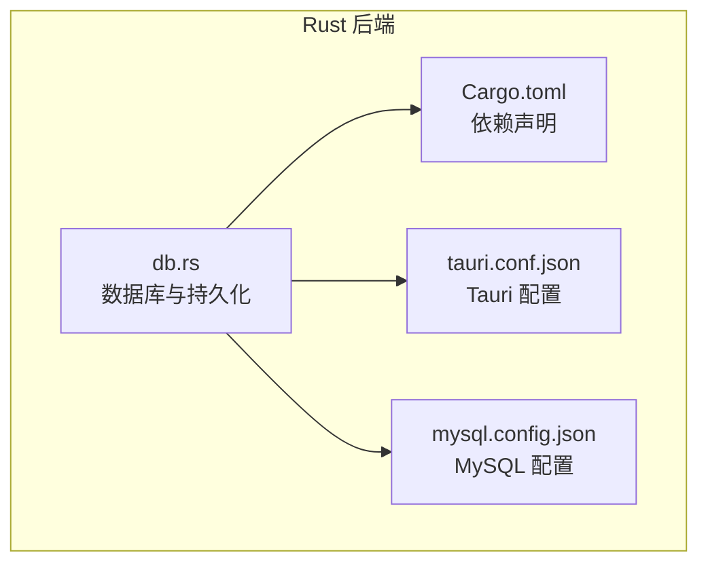

图表来源
- [src-tauri/src/db.rs](file://src-tauri/src/db.rs)
- [src-tauri/Cargo.toml](file://src-tauri/Cargo.toml)
- [src-tauri/tauri.conf.json](file://src-tauri/tauri.conf.json)
- [src-tauri/mysql.config.json](file://src-tauri/mysql.config.json)

章节来源
- [src-tauri/src/db.rs](file://src-tauri/src/db.rs)
- [src-tauri/Cargo.toml](file://src-tauri/Cargo.toml)
- [src-tauri/tauri.conf.json](file://src-tauri/tauri.conf.json)
- [src-tauri/mysql.config.json](file://src-tauri/mysql.config.json)

## 核心组件
- 数据库与持久化模块（db.rs）
  - 负责 SQLite 连接池初始化、查询与事务执行
  - 暴露给 Tauri 命令层的接口，供前端调用
- 依赖与运行时（Cargo.toml）
  - 声明 tokio、sqlx、rusqlite 等关键库，决定异步 I/O 与数据库驱动能力
- 应用配置（tauri.conf.json、mysql.config.json）
  - 提供运行期配置项，便于动态调整行为或接入外部服务

章节来源
- [src-tauri/src/db.rs](file://src-tauri/src/db.rs)
- [src-tauri/Cargo.toml](file://src-tauri/Cargo.toml)
- [src-tauri/tauri.conf.json](file://src-tauri/tauri.conf.json)
- [src-tauri/mysql.config.json](file://src-tauri/mysql.config.json)

## 架构总览
下图展示了从前端到后端的请求链路，以及后端在数据库与文件系统上的交互要点。

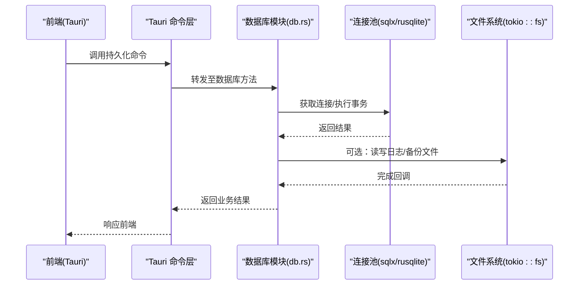

图表来源
- [src-tauri/src/db.rs](file://src-tauri/src/db.rs)
- [src-tauri/Cargo.toml](file://src-tauri/Cargo.toml)

## 详细组件分析

### 数据库与持久化模块（db.rs）
- 职责边界
  - 初始化并维护数据库连接池
  - 封装常用查询与更新操作
  - 提供事务性操作的统一入口
  - 与文件系统协作进行日志记录、备份与恢复
- 并发与线程模型
  - 通过连接池在多任务间共享数据库连接
  - 避免阻塞事件循环，所有 I/O 走异步通道
- 错误处理
  - 对数据库错误与文件 I/O 错误进行分类与传播
  - 上层可根据错误类型进行重试或降级

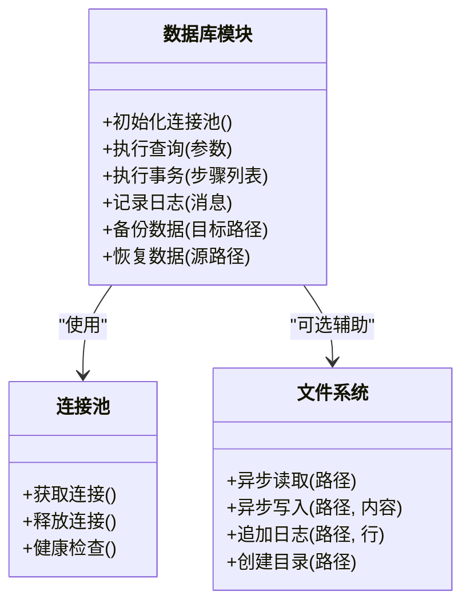

图表来源
- [src-tauri/src/db.rs](file://src-tauri/src/db.rs)

章节来源
- [src-tauri/src/db.rs](file://src-tauri/src/db.rs)

### 异步文件读写与流式处理（基于 tokio::fs）
- 基本模式
  - 使用 tokio::fs 提供的异步 API 进行文件打开、读取与写入
  - 结合 tokio_util::io 的 BufReader/BufWriter 提升吞吐
- 大文件流式处理
  - 采用分块读取与增量写入，降低峰值内存占用
  - 配合 tokio::io::AsyncReadExt/AsyncWriteExt 的 read_buf/write_all 等方法
- 典型流程（概念图）

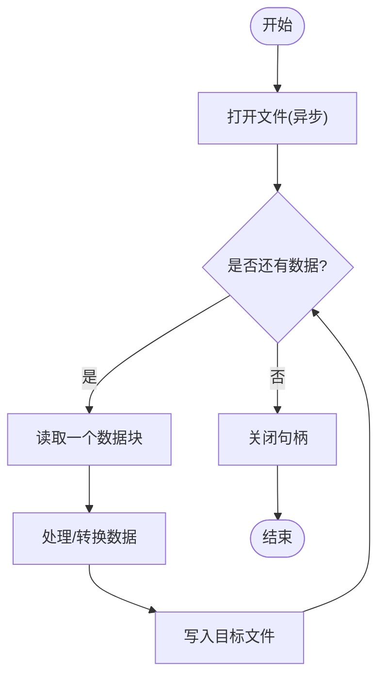

[此图为概念流程图，不直接对应具体源码文件]

章节来源
- [src-tauri/Cargo.toml](file://src-tauri/Cargo.toml)

### SQLite 数据库的异步实现与连接池
- 连接池管理
  - 使用 sqlx 或 rusqlite 的异步特性建立连接池
  - 合理设置最大连接数，避免资源耗尽
- 事务处理
  - 将多个写操作包裹在一个事务中，保证一致性
  - 失败时回滚，成功时提交
- 并发访问控制
  - 通过连接池限制并发度
  - 必要时引入读/写锁或队列串行化写操作

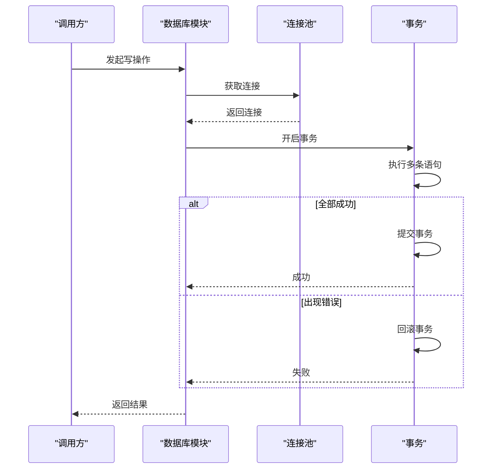

图表来源
- [src-tauri/src/db.rs](file://src-tauri/src/db.rs)
- [src-tauri/Cargo.toml](file://src-tauri/Cargo.toml)

章节来源
- [src-tauri/src/db.rs](file://src-tauri/src/db.rs)
- [src-tauri/Cargo.toml](file://src-tauri/Cargo.toml)

### 配置文件读写
- 应用配置（tauri.conf.json）
  - 由 Tauri 启动时加载，可在后端按需读取
  - 建议将敏感信息放入环境变量或独立配置
- 外部数据库配置（mysql.config.json）
  - 用于连接外部 MySQL 的参数（若启用）
  - 支持热重载时需监听文件变更并安全切换连接

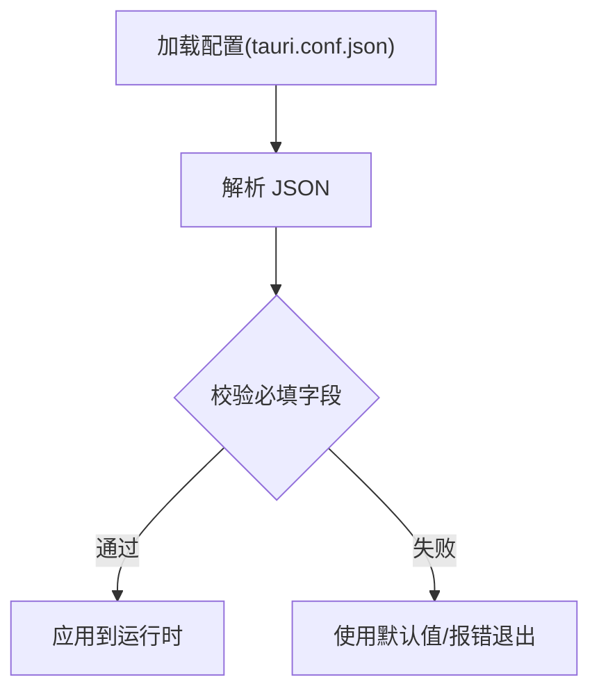

图表来源
- [src-tauri/tauri.conf.json](file://src-tauri/tauri.conf.json)
- [src-tauri/mysql.config.json](file://src-tauri/mysql.config.json)

章节来源
- [src-tauri/tauri.conf.json](file://src-tauri/tauri.conf.json)
- [src-tauri/mysql.config.json](file://src-tauri/mysql.config.json)

### 日志文件的异步写入
- 设计要点
  - 使用异步写入器（如 tokio::io::BufWriter）减少系统调用次数
  - 按时间或大小滚动，避免单文件过大
  - 写入失败时降级到本地缓冲，稍后重试
- 写入流程（概念图）

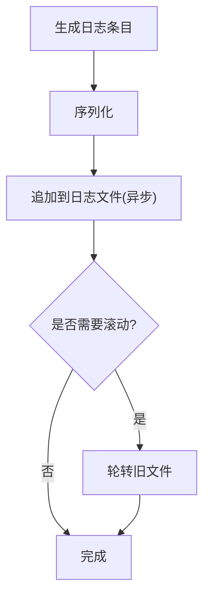

[此图为概念流程图，不直接对应具体源码文件]

章节来源
- [src-tauri/Cargo.toml](file://src-tauri/Cargo.toml)

### 数据备份与恢复
- 备份
  - 针对 SQLite 可使用 .backup 或导出 SQL 的方式
  - 对大文件采用流式复制，边读边写
- 恢复
  - 校验备份完整性（哈希或大小）
  - 原子替换（先写入临时文件，再重命名）
- 流程（概念图）

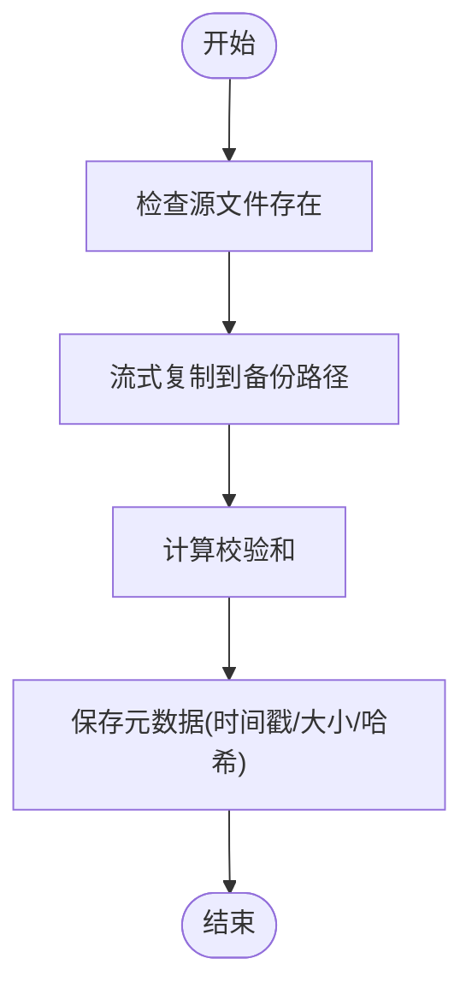

[此图为概念流程图，不直接对应具体源码文件]

章节来源
- [src-tauri/Cargo.toml](file://src-tauri/Cargo.toml)

### 文件锁机制与并发访问控制
- 文件锁
  - 跨进程互斥：使用平台原生锁或 flock/lockf 语义
  - 同进程内：使用 tokio::sync::Mutex/RwLock 保护共享状态
- 并发控制
  - 写操作串行化，读操作可并行
  - 超时与取消：为长时间 I/O 设置超时，避免挂起

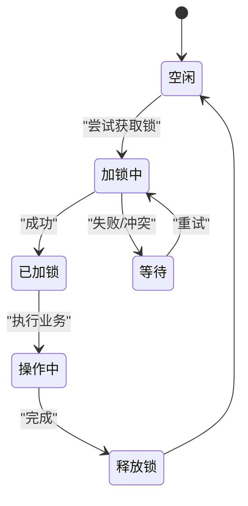

[此图为概念状态图，不直接对应具体源码文件]

章节来源
- [src-tauri/Cargo.toml](file://src-tauri/Cargo.toml)

### 错误处理与重试逻辑
- 分类
  - 网络/IO 错误：超时、权限不足、磁盘满
  - 数据库错误：死锁、约束冲突、连接丢失
- 策略
  - 指数退避重试，限定最大重试次数
  - 区分可重试与不可重试错误
  - 记录上下文信息以便定位问题

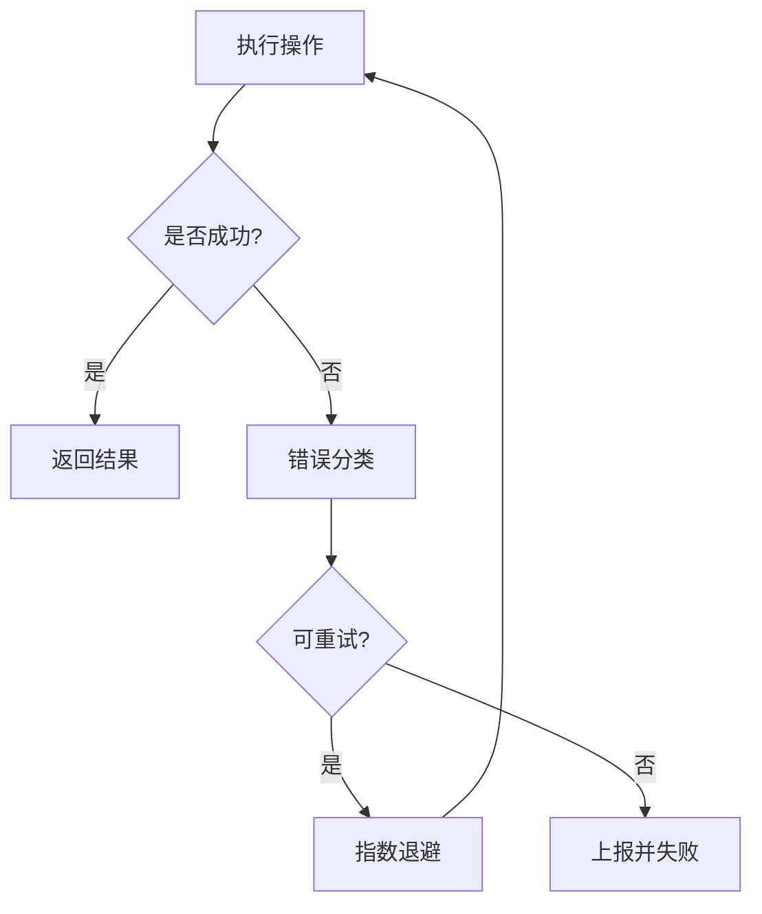

[此图为概念流程图，不直接对应具体源码文件]

章节来源
- [src-tauri/Cargo.toml](file://src-tauri/Cargo.toml)

### 实际代码示例路径（参考）
- 异步文件读写与流式处理
  - 参考路径：[src-tauri/Cargo.toml](file://src-tauri/Cargo.toml)（查看 tokio、tokio-util 等依赖）
- SQLite 连接池与事务
  - 参考路径：[src-tauri/src/db.rs](file://src-tauri/src/db.rs)
- 配置加载
  - 参考路径：[src-tauri/tauri.conf.json](file://src-tauri/tauri.conf.json)、[src-tauri/mysql.config.json](file://src-tauri/mysql.config.json)

章节来源
- [src-tauri/src/db.rs](file://src-tauri/src/db.rs)
- [src-tauri/Cargo.toml](file://src-tauri/Cargo.toml)
- [src-tauri/tauri.conf.json](file://src-tauri/tauri.conf.json)
- [src-tauri/mysql.config.json](file://src-tauri/mysql.config.json)

## 依赖关系分析
- 运行时与 I/O
  - tokio：提供异步运行时与 tokio::fs 等基础能力
  - tokio-util：提供 BufReader/BufWriter 等高效缓冲工具
- 数据库
  - sqlx：编译期 SQL 检查与异步连接池
  - rusqlite：SQLite 绑定（可能用于本地存储）
- 配置与序列化
  - serde/serde_json：JSON 配置解析与序列化

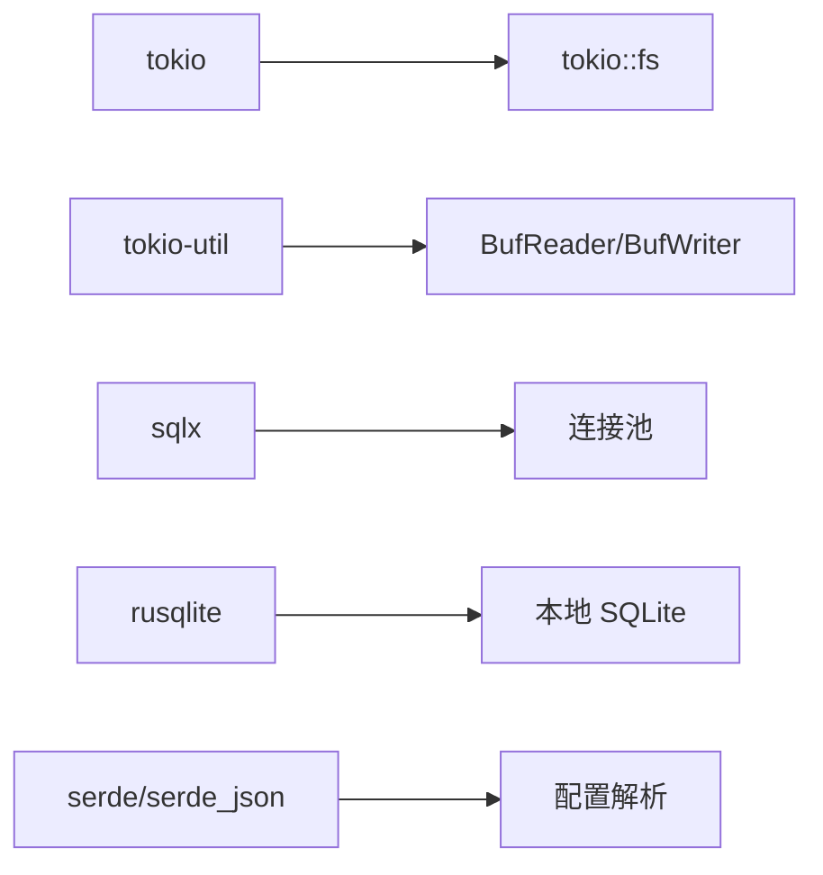

图表来源
- [src-tauri/Cargo.toml](file://src-tauri/Cargo.toml)

章节来源
- [src-tauri/Cargo.toml](file://src-tauri/Cargo.toml)

## 性能考虑
- 缓冲区优化
  - 使用 BufReader/BufWriter 批量读写，减少系统调用
  - 根据文件大小与 I/O 带宽调优缓冲区大小
- 流式处理
  - 大文件采用分块处理，避免一次性载入内存
  - 使用零拷贝或内存映射（mmap）的场景：只读大文件随机访问
- 连接池与并发
  - 合理设置最大连接数，避免过度竞争
  - 读多写少场景下，分离读写连接或队列化写操作
- 日志与备份
  - 日志异步写入与滚动策略
  - 备份时压缩与增量策略，降低 IO 压力

[本节为通用指导，不直接分析具体文件]

## 故障排查指南
- 常见问题
  - 文件权限不足：确认运行用户具备读写权限
  - 磁盘空间不足：监控磁盘使用率，及时清理或扩容
  - 数据库连接池耗尽：检查未释放连接与长事务
  - 日志文件过大：启用滚动与保留策略
- 诊断手段
  - 增加结构化日志，记录关键路径与耗时
  - 对关键 I/O 操作添加超时与取消
  - 使用指标收集（QPS、延迟、错误率）

章节来源
- [src-tauri/src/db.rs](file://src-tauri/src/db.rs)
- [src-tauri/Cargo.toml](file://src-tauri/Cargo.toml)

## 结论
FishWorker 的后端通过 tokio 生态与数据库驱动实现了高效的异步 I/O 与持久化能力。围绕连接池、事务、流式处理与错误重试，形成了稳健的数据通路。建议在后续迭代中完善日志与监控，细化配置热重载与备份恢复流程，进一步提升系统的可观测性与可靠性。

## 附录
- 术语
  - 连接池：复用数据库连接的集合，减少握手开销
  - 事务：一组操作的原子单元，要么全成功，要么全回滚
  - 流式处理：分块读取/写入，降低内存占用
- 最佳实践清单
  - 始终使用异步 I/O，避免阻塞事件循环
  - 为大文件启用流式处理与缓冲优化
  - 对写操作实施串行化与锁保护
  - 对可重试错误实施指数退避
  - 对关键路径添加超时与取消