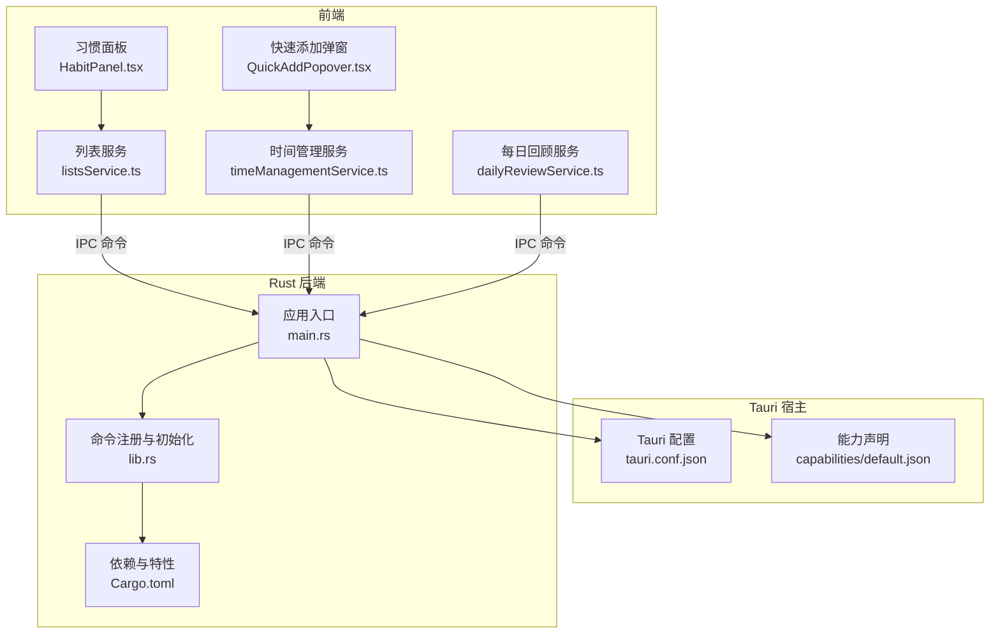
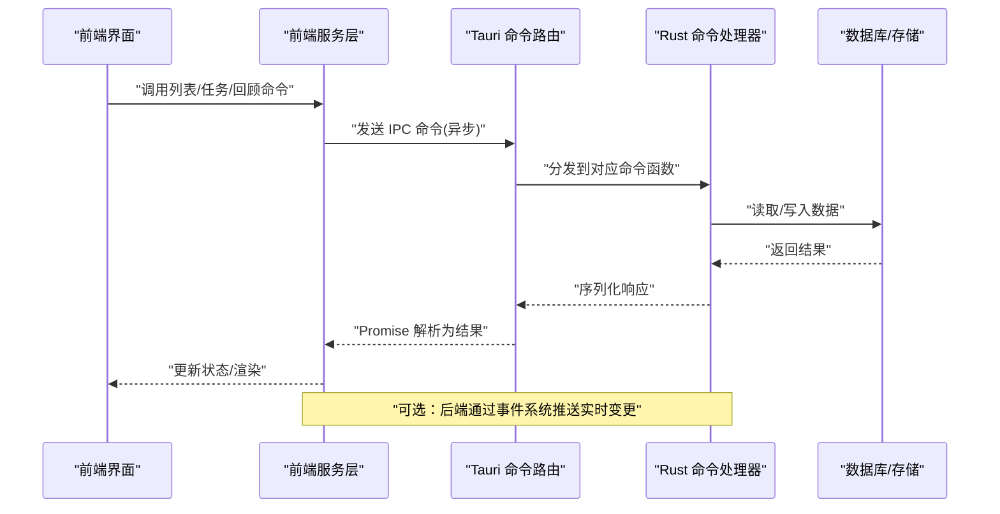
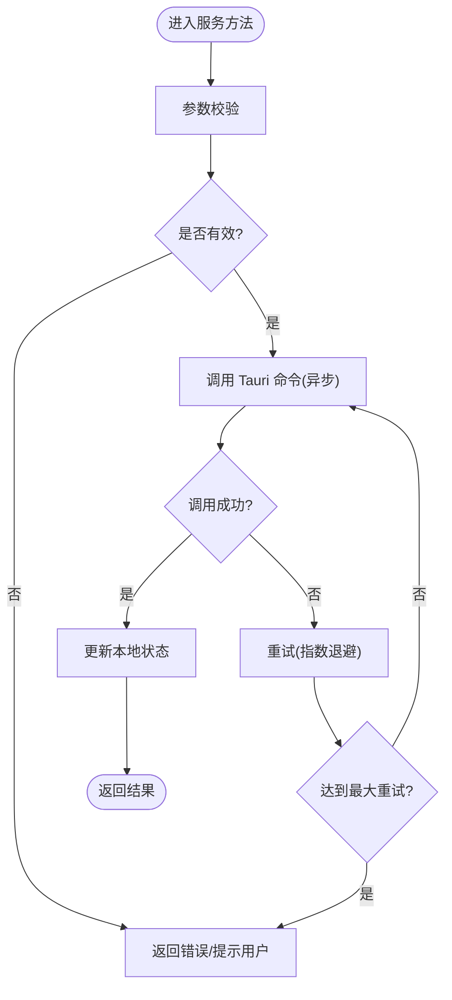
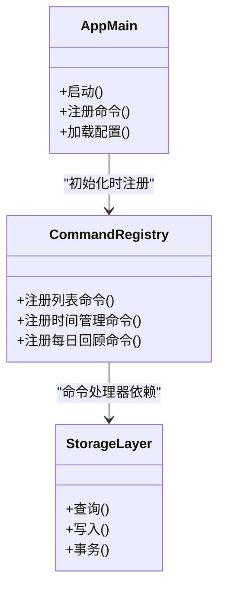
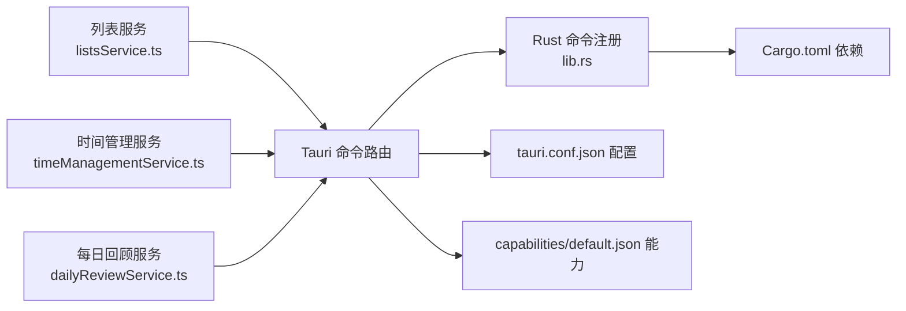

# 进程间通信 I/O

<cite>
**本文引用的文件**   
- [src-tauri/src/main.rs](file://src-tauri/src/main.rs)
- [src-tauri/src/lib.rs](file://src-tauri/src/lib.rs)
- [src-tauri/Cargo.toml](file://src-tauri/Cargo.toml)
- [src-tauri/tauri.conf.json](file://src-tauri/tauri.conf.json)
- [src-tauri/capabilities/default.json](file://src-tauri/capabilities/default.json)
- [src/features/lists/listsService.ts](file://src/features/lists/listsService.ts)
- [src/features/time-management/timeManagementService.ts](file://src/features/time-management/timeManagementService.ts)
- [src/features/daily-review/dailyReviewService.ts](file://src/features/daily-review/dailyReviewService.ts)
- [src/features/habits/HabitPanel.tsx](file://src/features/habits/HabitPanel.tsx)
- [src/features/time-management/components/QuickAddPopover.tsx](file://src/features/time-management/components/QuickAddPopover.tsx)
</cite>

## 目录
1. [简介](#简介)
2. [项目结构](#项目结构)
3. [核心组件](#核心组件)
4. [架构总览](#架构总览)
5. [详细组件分析](#详细组件分析)
6. [依赖关系分析](#依赖关系分析)
7. [性能考虑](#性能考虑)
8. [故障排查指南](#故障排查指南)
9. [结论](#结论)
10. [附录](#附录)

## 简介
本技术文档聚焦 FishWorker 在 Tauri 框架下的进程间通信（IPC）I/O 实现，覆盖以下关键主题：
- Rust 后端与 JavaScript 前端的异步消息传递与命令调用
- 事件系统的异步订阅与发布、实时数据同步协议
- 跨进程的数据序列化与大对象高效传输策略
- 连接状态管理、断线重连机制与错误处理
- IPC 通信示例、性能优化与调试监控方法

FishWorker 采用 Tauri 作为宿主容器，前端基于 React + TypeScript，后端使用 Rust。Tauri 的 IPC 通过命令（Commands）和事件（Events）提供前后端双向通信能力，结合异步运行时实现高吞吐与低延迟。

## 项目结构
从 IPC 视角看，项目主要涉及以下层次：
- 前端服务层：封装对 Tauri 命令的调用，统一错误处理与重试策略
- 后端命令层：Rust 侧暴露给前端的命令接口，负责业务逻辑与持久化
- 配置与权限：Tauri 配置文件与能力声明，控制 IPC 访问范围
- 事件通道：用于实时推送与状态同步

**图表来源**
- [src-tauri/src/main.rs](file://src-tauri/src/main.rs)
- [src-tauri/src/lib.rs](file://src-tauri/src/lib.rs)
- [src-tauri/tauri.conf.json](file://src-tauri/tauri.conf.json)
- [src-tauri/capabilities/default.json](file://src-tauri/capabilities/default.json)
- [src-tauri/Cargo.toml](file://src-tauri/Cargo.toml)
- [src/features/lists/listsService.ts](file://src/features/lists/listsService.ts)
- [src/features/time-management/timeManagementService.ts](file://src/features/time-management/timeManagementService.ts)
- [src/features/daily-review/dailyReviewService.ts](file://src/features/daily-review/dailyReviewService.ts)
- [src/features/habits/HabitPanel.tsx](file://src/features/habits/HabitPanel.tsx)
- [src/features/time-management/components/QuickAddPopover.tsx](file://src/features/time-management/components/QuickAddPopover.tsx)

**章节来源**
- [src-tauri/src/main.rs](file://src-tauri/src/main.rs)
- [src-tauri/src/lib.rs](file://src-tauri/src/lib.rs)
- [src-tauri/tauri.conf.json](file://src-tauri/tauri.conf.json)
- [src-tauri/capabilities/default.json](file://src-tauri/capabilities/default.json)
- [src-tauri/Cargo.toml](file://src-tauri/Cargo.toml)
- [src/features/lists/listsService.ts](file://src/features/lists/listsService.ts)
- [src/features/time-management/timeManagementService.ts](file://src/features/time-management/timeManagementService.ts)
- [src/features/daily-review/dailyReviewService.ts](file://src/features/daily-review/dailyReviewService.ts)
- [src/features/habits/HabitPanel.tsx](file://src/features/habits/HabitPanel.tsx)
- [src/features/time-management/components/QuickAddPopover.tsx](file://src/features/time-management/components/QuickAddPopover.tsx)

## 核心组件
本节概述 IPC 的关键组件及其职责：
- 前端服务层
  - 列表服务：封装列表相关命令调用，统一错误与重试
  - 时间管理服务：封装任务与计划相关命令调用
  - 每日回顾服务：封装回顾编辑与保存等命令调用
- Rust 后端
  - 应用入口：启动 Tauri 应用并注册命令
  - 命令注册：集中定义命令映射与生命周期
  - 依赖与特性：引入异步运行时、序列化库、数据库驱动等
- 配置与权限
  - Tauri 配置：定义窗口、插件、安全策略与 IPC 白名单
  - 能力声明：限定前端可访问的命令与资源范围

**章节来源**
- [src/features/lists/listsService.ts](file://src/features/lists/listsService.ts)
- [src/features/time-management/timeManagementService.ts](file://src/features/time-management/timeManagementService.ts)
- [src/features/daily-review/dailyReviewService.ts](file://src/features/daily-review/dailyReviewService.ts)
- [src-tauri/src/main.rs](file://src-tauri/src/main.rs)
- [src-tauri/src/lib.rs](file://src-tauri/src/lib.rs)
- [src-tauri/Cargo.toml](file://src-tauri/Cargo.toml)
- [src-tauri/tauri.conf.json](file://src-tauri/tauri.conf.json)
- [src-tauri/capabilities/default.json](file://src-tauri/capabilities/default.json)

## 架构总览
下图展示 Tauri IPC 的整体流程：前端通过服务层发起命令调用，Tauri 路由到 Rust 命令处理器，执行完成后返回结果或推送事件；同时支持事件订阅以实现实时数据同步。

**图表来源**
- [src-tauri/src/main.rs](file://src-tauri/src/main.rs)
- [src-tauri/src/lib.rs](file://src-tauri/src/lib.rs)
- [src/features/lists/listsService.ts](file://src/features/lists/listsService.ts)
- [src/features/time-management/timeManagementService.ts](file://src/features/time-management/timeManagementService.ts)
- [src/features/daily-review/dailyReviewService.ts](file://src/features/daily-review/dailyReviewService.ts)

## 详细组件分析

### 前端服务层（列表、时间管理、每日回顾）
- 职责
  - 封装 Tauri 命令调用，统一参数校验、错误捕获与重试
  - 维护本地状态，必要时合并后端事件推送
- 设计要点
  - 每个功能域一个服务模块，避免耦合
  - 失败时进行指数退避重试，提升鲁棒性
  - 大对象传输采用分块或流式策略（见“性能考虑”）

**图表来源**
- [src/features/lists/listsService.ts](file://src/features/lists/listsService.ts)
- [src/features/time-management/timeManagementService.ts](file://src/features/time-management/timeManagementService.ts)
- [src/features/daily-review/dailyReviewService.ts](file://src/features/daily-review/dailyReviewService.ts)

**章节来源**
- [src/features/lists/listsService.ts](file://src/features/lists/listsService.ts)
- [src/features/time-management/timeManagementService.ts](file://src/features/time-management/timeManagementService.ts)
- [src/features/daily-review/dailyReviewService.ts](file://src/features/daily-review/dailyReviewService.ts)

### Rust 后端（命令注册与应用入口）
- 职责
  - 启动 Tauri 应用，注册命令与事件
  - 处理来自前端的命令请求，执行业务逻辑与持久化
- 设计要点
  - 命令函数需具备异步能力，避免阻塞事件循环
  - 错误类型清晰，便于前端统一处理
  - 事件推送使用非阻塞方式，确保高并发

**图表来源**
- [src-tauri/src/main.rs](file://src-tauri/src/main.rs)
- [src-tauri/src/lib.rs](file://src-tauri/src/lib.rs)

**章节来源**
- [src-tauri/src/main.rs](file://src-tauri/src/main.rs)
- [src-tauri/src/lib.rs](file://src-tauri/src/lib.rs)

### 配置与权限（Tauri 配置与能力声明）
- 职责
  - 定义 IPC 白名单、窗口与安全策略
  - 限制前端可访问的命令与资源，保障安全
- 设计要点
  - 最小权限原则：仅开放必要命令
  - 环境差异化：开发/生产环境不同配置

**章节来源**
- [src-tauri/tauri.conf.json](file://src-tauri/tauri.conf.json)
- [src-tauri/capabilities/default.json](file://src-tauri/capabilities/default.json)

### 依赖与特性（Cargo 清单）
- 职责
  - 声明异步运行时、序列化库、数据库驱动等依赖
- 设计要点
  - 按需启用特性，减少二进制体积
  - 版本锁定，保证构建稳定性

**章节来源**
- [src-tauri/Cargo.toml](file://src-tauri/Cargo.toml)

### 前端交互组件（习惯面板、快速添加弹窗）
- 职责
  - 触发服务层方法，展示结果与错误信息
- 设计要点
  - 用户操作与 IPC 调用解耦
  - 反馈及时，避免长时间无响应

**章节来源**
- [src/features/habits/HabitPanel.tsx](file://src/features/habits/HabitPanel.tsx)
- [src/features/time-management/components/QuickAddPopover.tsx](file://src/features/time-management/components/QuickAddPopover.tsx)

## 依赖关系分析
下图展示前端服务与 Rust 后端的依赖关系，以及配置与权限的影响面。

**图表来源**
- [src/features/lists/listsService.ts](file://src/features/lists/listsService.ts)
- [src/features/time-management/timeManagementService.ts](file://src/features/time-management/timeManagementService.ts)
- [src/features/daily-review/dailyReviewService.ts](file://src/features/daily-review/dailyReviewService.ts)
- [src-tauri/src/lib.rs](file://src-tauri/src/lib.rs)
- [src-tauri/Cargo.toml](file://src-tauri/Cargo.toml)
- [src-tauri/tauri.conf.json](file://src-tauri/tauri.conf.json)
- [src-tauri/capabilities/default.json](file://src-tauri/capabilities/default.json)

**章节来源**
- [src/features/lists/listsService.ts](file://src/features/lists/listsService.ts)
- [src/features/time-management/timeManagementService.ts](file://src/features/time-management/timeManagementService.ts)
- [src/features/daily-review/dailyReviewService.ts](file://src/features/daily-review/dailyReviewService.ts)
- [src-tauri/src/lib.rs](file://src-tauri/src/lib.rs)
- [src-tauri/Cargo.toml](file://src-tauri/Cargo.toml)
- [src-tauri/tauri.conf.json](file://src-tauri/tauri.conf.json)
- [src-tauri/capabilities/default.json](file://src-tauri/capabilities/default.json)

## 性能考虑
- 异步与并发
  - 后端命令函数应使用异步 API，避免阻塞事件循环
  - 批量操作尽量合并为单次命令，减少往返次数
- 序列化与传输
  - 优先使用轻量级 JSON 结构，避免深层嵌套
  - 大对象传输建议分块或流式处理，降低内存峰值
- 缓存与去抖
  - 前端对频繁读取数据进行短期缓存
  - 输入类操作使用防抖/节流，减少不必要的 IPC 调用
- 重试与退避
  - 网络或临时错误采用指数退避重试，设置最大重试上限
- 资源清理
  - 组件卸载时取消未完成的 IPC 请求，避免内存泄漏

[本节为通用指导，不直接分析具体文件]

## 故障排查指南
- 常见问题定位
  - 确认 Tauri 配置与能力声明是否允许目标命令
  - 检查前端服务层的错误分支与日志输出
  - 验证 Rust 命令函数的异常类型与返回值
- 调试与监控
  - 在前端服务层记录请求/响应摘要（脱敏）
  - 在后端命令入口处打印关键参数与耗时
  - 使用浏览器控制台与 Tauri 日志工具收集上下文
- 连接状态与重连
  - 前端维护连接状态机，检测不可用状态并自动重连
  - 重连时恢复未完成的任务队列，避免数据丢失

**章节来源**
- [src-tauri/tauri.conf.json](file://src-tauri/tauri.conf.json)
- [src-tauri/capabilities/default.json](file://src-tauri/capabilities/default.json)
- [src/features/lists/listsService.ts](file://src/features/lists/listsService.ts)
- [src/features/time-management/timeManagementService.ts](file://src/features/time-management/timeManagementService.ts)
- [src/features/daily-review/dailyReviewService.ts](file://src/features/daily-review/dailyReviewService.ts)

## 结论
FishWorker 的 IPC 体系以 Tauri 命令与事件为核心，结合前端服务层与 Rust 后端命令处理器，形成稳定高效的跨进程通信方案。通过合理的异步设计、错误处理与性能优化策略，可在复杂业务场景下保持良好用户体验与系统稳定性。

[本节为总结性内容，不直接分析具体文件]

## 附录
- 实际 IPC 通信示例路径
  - 列表命令调用示例：[src/features/lists/listsService.ts](file://src/features/lists/listsService.ts)
  - 时间管理命令调用示例：[src/features/time-management/timeManagementService.ts](file://src/features/time-management/timeManagementService.ts)
  - 每日回顾命令调用示例：[src/features/daily-review/dailyReviewService.ts](file://src/features/daily-review/dailyReviewService.ts)
- 后端命令注册入口
  - 应用入口与命令注册：[src-tauri/src/main.rs](file://src-tauri/src/main.rs)、[src-tauri/src/lib.rs](file://src-tauri/src/lib.rs)
- 配置与权限
  - Tauri 配置：[src-tauri/tauri.conf.json](file://src-tauri/tauri.conf.json)
  - 能力声明：[src-tauri/capabilities/default.json](file://src-tauri/capabilities/default.json)
  - 依赖与特性：[src-tauri/Cargo.toml](file://src-tauri/Cargo.toml)