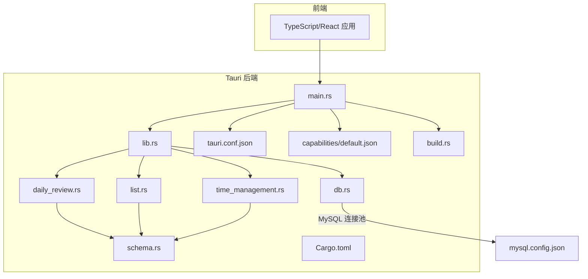
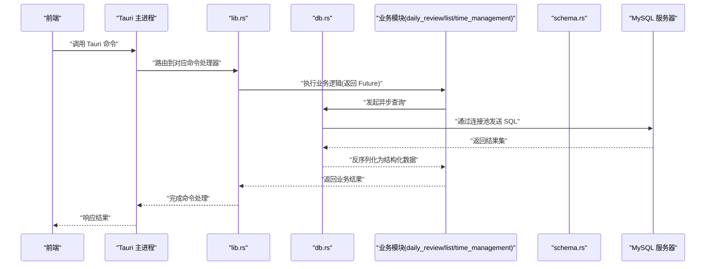
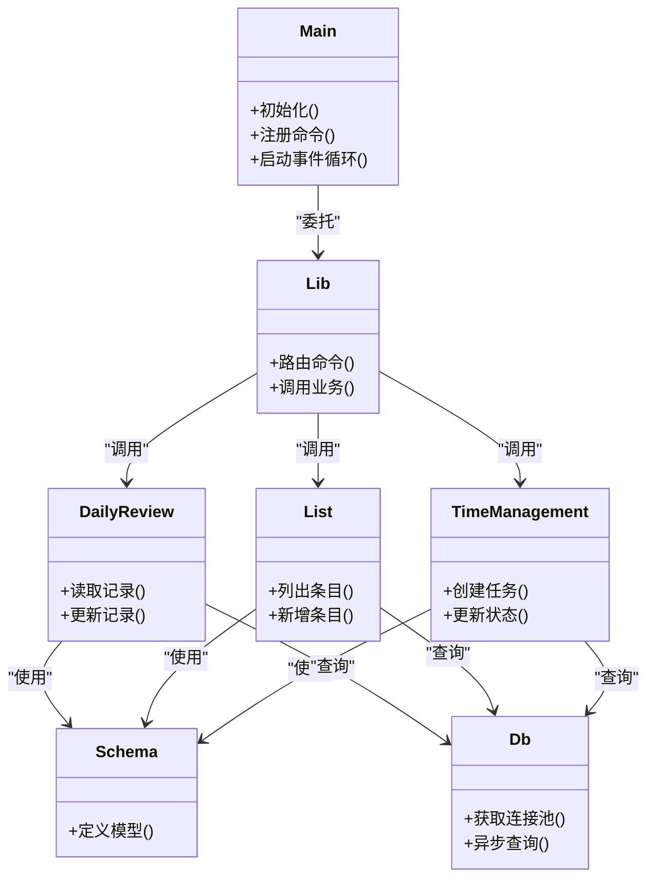
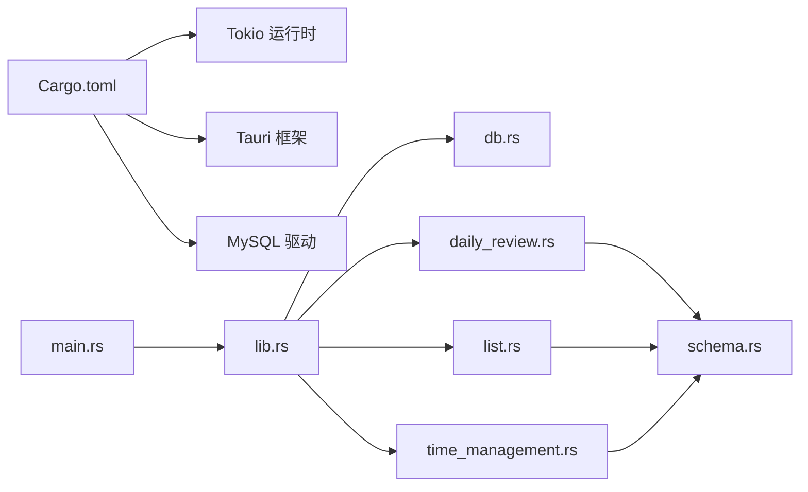

# 异步内存管理

<cite>
**本文引用的文件**   
- [src-tauri/src/main.rs](file://src-tauri/src/main.rs)
- [src-tauri/src/lib.rs](file://src-tauri/src/lib.rs)
- [src-tauri/Cargo.toml](file://src-tauri/Cargo.toml)
- [src-tauri/build.rs](file://src-tauri/build.rs)
- [src-tauri/tauri.conf.json](file://src-tauri/tauri.conf.json)
- [src-tauri/mysql.config.json](file://src-tauri/mysql.config.json)
- [src-tauri/capabilities/default.json](file://src-tauri/capabilities/default.json)
- [src-tauri/gen/schemas/capabilities.json](file://src-tauri/gen/schemas/capabilities.json)
- [src-tauri/gen/schemas/desktop-schema.json](file://src-tauri/gen/schemas/desktop-schema.json)
- [src-tauri/gen/schemas/windows-schema.json](file://src-tauri/gen/schemas/windows-schema.json)
- [src-tauri/src/db.rs](file://src-tauri/src/db.rs)
- [src-tauri/src/daily_review.rs](file://src-tauri/src/daily_review.rs)
- [src-tauri/src/list.rs](file://src-tauri/src/list.rs)
- [src-tauri/src/time_management.rs](file://src-tauri/src/time_management.rs)
- [src-tauri/src/schema.rs](file://src-tauri/src/schema.rs)
</cite>

## 目录
1. [简介](#简介)
2. [项目结构](#项目结构)
3. [核心组件](#核心组件)
4. [架构总览](#架构总览)
5. [详细组件分析](#详细组件分析)
6. [依赖分析](#依赖分析)
7. [性能考虑](#性能考虑)
8. [故障排查指南](#故障排查指南)
9. [结论](#结论)
10. [附录](#附录)

## 简介
本技术文档聚焦 FishWorker 在 Tauri 后端（Rust）中的异步内存管理。内容涵盖：
- Rust 所有权模型与借用检查器在异步环境中的应用
- 生命周期管理与异步闭包变量捕获、移动语义、引用安全性
- 内存泄漏检测、循环引用避免与弱引用使用场景
- 异步状态机实现、Future 的内存布局与协程栈管理
- 内存使用优化技巧、垃圾回收替代方案与大对象处理策略
- 内存分析工具使用指南、性能瓶颈识别与优化案例

## 项目结构
FishWorker 采用 Tauri 架构，前端为 TypeScript/React，后端为 Rust。与异步内存管理密切相关的代码位于 src-tauri 目录中，包括入口、能力配置、数据库连接与各业务模块。

图表来源
- [src-tauri/src/main.rs](file://src-tauri/src/main.rs)
- [src-tauri/src/lib.rs](file://src-tauri/src/lib.rs)
- [src-tauri/src/db.rs](file://src-tauri/src/db.rs)
- [src-tauri/src/daily_review.rs](file://src-tauri/src/daily_review.rs)
- [src-tauri/src/list.rs](file://src-tauri/src/list.rs)
- [src-tauri/src/time_management.rs](file://src-tauri/src/time_management.rs)
- [src-tauri/src/schema.rs](file://src-tauri/src/schema.rs)
- [src-tauri/Cargo.toml](file://src-tauri/Cargo.toml)
- [src-tauri/tauri.conf.json](file://src-tauri/tauri.conf.json)
- [src-tauri/capabilities/default.json](file://src-tauri/capabilities/default.json)
- [src-tauri/build.rs](file://src-tauri/build.rs)
- [src-tauri/mysql.config.json](file://src-tauri/mysql.config.json)

章节来源
- [src-tauri/src/main.rs](file://src-tauri/src/main.rs)
- [src-tauri/src/lib.rs](file://src-tauri/src/lib.rs)
- [src-tauri/Cargo.toml](file://src-tauri/Cargo.toml)
- [src-tauri/tauri.conf.json](file://src-tauri/tauri.conf.json)
- [src-tauri/capabilities/default.json](file://src-tauri/capabilities/default.json)
- [src-tauri/build.rs](file://src-tauri/build.rs)

## 核心组件
- 进程入口与命令注册：负责初始化运行时、加载配置、注册 Tauri 命令并启动事件循环。
- 数据库连接与连接池：集中管理 MySQL 连接池，提供异步查询接口，控制连接生命周期。
- 业务模块（每日回顾、清单、时间管理）：封装领域逻辑，调用数据库层，返回 Future 给上层。
- 数据模式定义：统一的数据结构定义，便于跨模块复用与序列化。

章节来源
- [src-tauri/src/main.rs](file://src-tauri/src/main.rs)
- [src-tauri/src/lib.rs](file://src-tauri/src/lib.rs)
- [src-tauri/src/db.rs](file://src-tauri/src/db.rs)
- [src-tauri/src/daily_review.rs](file://src-tauri/src/daily_review.rs)
- [src-tauri/src/list.rs](file://src-tauri/src/list.rs)
- [src-tauri/src/time_management.rs](file://src-tauri/src/time_management.rs)
- [src-tauri/src/schema.rs](file://src-tauri/src/schema.rs)

## 架构总览
下图展示从前端到 Rust 后端的请求路径，以及各模块间的依赖关系。重点标注了异步执行点与资源持有位置。

图表来源
- [src-tauri/src/main.rs](file://src-tauri/src/main.rs)
- [src-tauri/src/lib.rs](file://src-tauri/src/lib.rs)
- [src-tauri/src/db.rs](file://src-tauri/src/db.rs)
- [src-tauri/src/daily_review.rs](file://src-tauri/src/daily_review.rs)
- [src-tauri/src/list.rs](file://src-tauri/src/list.rs)
- [src-tauri/src/time_management.rs](file://src-tauri/src/time_management.rs)
- [src-tauri/src/schema.rs](file://src-tauri/src/schema.rs)

## 详细组件分析

### 进程入口与命令注册（main.rs / lib.rs）
- 职责：初始化 Tauri 应用、加载配置、注册命令、启动事件循环。
- 异步内存要点：
  - 命令处理器通常返回 Future；需确保所有被捕获的变量满足 Move 语义或共享引用要求。
  - 全局状态应通过线程安全的智能指针（如 Arc<Mutex<T>> 或 Arc<RwLock<T>>）暴露给命令处理器。
  - 避免在闭包中持有大对象强引用，必要时使用弱引用或拷贝关键数据。

章节来源
- [src-tauri/src/main.rs](file://src-tauri/src/main.rs)
- [src-tauri/src/lib.rs](file://src-tauri/src/lib.rs)

### 数据库层（db.rs）
- 职责：维护 MySQL 连接池，提供异步查询方法，统一错误处理与日志。
- 异步内存要点：
  - 连接池对象需具备 Send + Sync，以便跨任务分发。
  - 查询结果尽量以零拷贝或最小拷贝方式传递，减少临时缓冲分配。
  - 对长事务或批量操作，注意连接占用时间与内存峰值。

章节来源
- [src-tauri/src/db.rs](file://src-tauri/src/db.rs)

### 业务模块（daily_review.rs / list.rs / time_management.rs）
- 职责：封装领域逻辑，组合数据库访问，返回 Future 供上层消费。
- 异步内存要点：
  - 在 async fn 中捕获变量时，优先使用 &str 或 Copy 类型，避免不必要的大对象移动。
  - 复杂数据结构建议拆分为小对象，按需组装，降低一次性分配成本。
  - 对可能产生循环引用的结构体，谨慎使用 Rc/Arc；必要时引入弱引用打破环。

章节来源
- [src-tauri/src/daily_review.rs](file://src-tauri/src/daily_review.rs)
- [src-tauri/src/list.rs](file://src-tauri/src/list.rs)
- [src-tauri/src/time_management.rs](file://src-tauri/src/time_management.rs)

### 数据模式（schema.rs）
- 职责：定义跨模块复用的数据结构，支持序列化/反序列化。
- 异步内存要点：
  - 合理选择字段类型（如 String vs Cow<'_, str>），在只读路径上避免额外分配。
  - 对大型集合，考虑流式处理或分页，避免一次性加载到内存。

章节来源
- [src-tauri/src/schema.rs](file://src-tauri/src/schema.rs)

#### 类图（概念映射到实际模块）

图表来源
- [src-tauri/src/main.rs](file://src-tauri/src/main.rs)
- [src-tauri/src/lib.rs](file://src-tauri/src/lib.rs)
- [src-tauri/src/db.rs](file://src-tauri/src/db.rs)
- [src-tauri/src/daily_review.rs](file://src-tauri/src/daily_review.rs)
- [src-tauri/src/list.rs](file://src-tauri/src/list.rs)
- [src-tauri/src/time_management.rs](file://src-tauri/src/time_management.rs)
- [src-tauri/src/schema.rs](file://src-tauri/src/schema.rs)

## 依赖分析
- 外部依赖：Tauri、Tokio 运行时、MySQL 驱动、序列化库等。
- 内部依赖：lib.rs 作为命令路由中心，业务模块依赖 db.rs 与 schema.rs。
- 潜在耦合点：
  - 全局配置与连接池的生命周期贯穿整个进程。
  - 业务模块对 schema 的结构变化敏感，需保持向后兼容。

图表来源
- [src-tauri/Cargo.toml](file://src-tauri/Cargo.toml)
- [src-tauri/src/main.rs](file://src-tauri/src/main.rs)
- [src-tauri/src/lib.rs](file://src-tauri/src/lib.rs)
- [src-tauri/src/db.rs](file://src-tauri/src/db.rs)
- [src-tauri/src/daily_review.rs](file://src-tauri/src/daily_review.rs)
- [src-tauri/src/list.rs](file://src-tauri/src/list.rs)
- [src-tauri/src/time_management.rs](file://src-tauri/src/time_management.rs)
- [src-tauri/src/schema.rs](file://src-tauri/src/schema.rs)

章节来源
- [src-tauri/Cargo.toml](file://src-tauri/Cargo.toml)

## 性能考虑
- 连接池大小与并发度匹配：根据 CPU 核数与 I/O 负载调整连接池上限，避免过多上下文切换。
- 零拷贝与最小拷贝：在只读路径使用 &str、Cow 等类型，减少中间缓冲。
- 批处理与分页：对大数据集采用分批拉取，降低单次内存峰值。
- 避免不必要的克隆：在闭包中尽量使用引用或 Move 一次后复用。
- 大对象处理：将大对象置于独立存储（如内存映射文件或对象缓存），按需加载。

[本节为通用指导，不直接分析具体文件]

## 故障排查指南
- 常见症状：
  - 内存持续增长：检查是否存在未释放的连接或缓存未清理。
  - 死锁或阻塞：关注长时间持有的锁与嵌套异步调用。
  - 高 GC 压力（若使用外部 GC）：定位频繁分配热点路径。
- 诊断步骤：
  - 启用详细日志，记录关键操作的开始/结束与耗时。
  - 使用内存分析工具（见附录）定位峰值与泄漏点。
  - 审查闭包捕获与全局状态变更，确认所有权与生命周期正确。

章节来源
- [src-tauri/src/db.rs](file://src-tauri/src/db.rs)
- [src-tauri/src/lib.rs](file://src-tauri/src/lib.rs)

## 结论
FishWorker 的异步内存管理围绕 Tauri 命令处理、数据库连接池与业务模块展开。通过严格的所有权与借用规则、合理的 Future 设计、连接池与数据结构的优化，可以在保证安全性的同时获得良好的性能表现。建议在开发过程中持续进行内存分析与性能基准测试，及时识别并消除潜在问题。

[本节为总结性内容，不直接分析具体文件]

## 附录

### Rust 所有权与借用在异步环境中的应用
- 所有权与移动：
  - 在 async fn 中，若闭包需要拥有某个值，必须显式 Move；否则编译器会报错。
  - 对于可复制类型（Copy），无需 Move，可直接在多个作用域内使用。
- 引用与借用：
  - 异步闭包捕获引用时，需确保引用在 Future 生命周期内有效。
  - 避免在长期运行的 Future 中持有短生命周期引用，防止悬垂指针。
- 生命周期管理：
  - 使用 'static 生命周期表示无外部依赖的全局数据。
  - 对局部数据，尽量缩短其生命周期范围，减少持有时间。

章节来源
- [src-tauri/src/lib.rs](file://src-tauri/src/lib.rs)
- [src-tauri/src/daily_review.rs](file://src-tauri/src/daily_review.rs)
- [src-tauri/src/list.rs](file://src-tauri/src/list.rs)
- [src-tauri/src/time_management.rs](file://src-tauri/src/time_management.rs)

### 异步闭包变量捕获与引用安全性
- 捕获策略：
  - 优先捕获 &str 或 Copy 类型，避免大对象移动。
  - 对需要共享的可变状态，使用 Arc<Mutex<T>> 或 Arc<RwLock<T>>。
- 引用安全性：
  - 确保所有引用在 Future 完成前仍然有效。
  - 避免在异步任务间传递可变引用，改用不可变引用或原子类型。

章节来源
- [src-tauri/src/lib.rs](file://src-tauri/src/lib.rs)
- [src-tauri/src/db.rs](file://src-tauri/src/db.rs)

### 内存泄漏检测与循环引用避免
- 检测手段：
  - 使用 leaky 或 similar 工具检测未释放资源。
  - 结合日志与指标监控，观察内存增长趋势。
- 循环引用避免：
  - 使用弱引用（Weak）打破环，确保至少一个方向为强引用。
  - 重构数据结构，将环状依赖改为树状或分层依赖。

章节来源
- [src-tauri/src/daily_review.rs](file://src-tauri/src/daily_review.rs)
- [src-tauri/src/list.rs](file://src-tauri/src/list.rs)
- [src-tauri/src/time_management.rs](file://src-tauri/src/time_management.rs)

### 弱引用使用场景
- 典型场景：
  - 观察者模式中，父节点持有子节点的强引用，子节点对父节点使用弱引用。
  - 缓存系统中，缓存项对原始数据使用弱引用，避免阻止释放。
- 注意事项：
  - 访问弱引用时需判断是否仍有效，避免空引用导致崩溃。

章节来源
- [src-tauri/src/schema.rs](file://src-tauri/src/schema.rs)

### 异步状态机与 Future 内存布局
- 状态机实现：
  - async fn 编译为状态机，每个 await 点为一个状态。
  - 状态机在堆上分配，包含当前状态与局部变量快照。
- 内存布局：
  - 局部变量按生命周期与大小对齐，尽可能紧凑排列。
  - 大对象应尽量提前 Move，避免多次拷贝。

章节来源
- [src-tauri/src/lib.rs](file://src-tauri/src/lib.rs)
- [src-tauri/src/db.rs](file://src-tauri/src/db.rs)

### 协程栈管理
- 栈分配与堆分配：
  - 小对象通常在栈上分配，大对象或跨边界对象在堆上分配。
  - 异步任务切换时，仅保存必要上下文，减少栈开销。
- 优化建议：
  - 减少深层递归，改用迭代或分治算法。
  - 对高频路径进行内联与去虚拟化，提升缓存命中率。

章节来源
- [src-tauri/src/main.rs](file://src-tauri/src/main.rs)
- [src-tauri/src/lib.rs](file://src-tauri/src/lib.rs)

### 内存使用优化技巧
- 零拷贝与最小拷贝：
  - 使用 &str、Vec::as_ptr 等 API 避免多余分配。
- 批处理与分页：
  - 对大数据集采用分批处理，降低峰值内存。
- 对象池与复用：
  - 对频繁创建销毁的对象，使用对象池减少分配开销。

章节来源
- [src-tauri/src/db.rs](file://src-tauri/src/db.rs)
- [src-tauri/src/schema.rs](file://src-tauri/src/schema.rs)

### 垃圾回收替代方案
- Rust 默认无 GC，依靠 RAII 与所有权自动释放。
- 若需类似 GC 的行为，可使用：
  - 弱引用（Weak）打破循环。
  - 显式清理与资源池管理。
  - 第三方库（如 scoped-trees）辅助生命周期管理。

章节来源
- [src-tauri/src/daily_review.rs](file://src-tauri/src/daily_review.rs)
- [src-tauri/src/list.rs](file://src-tauri/src/list.rs)
- [src-tauri/src/time_management.rs](file://src-tauri/src/time_management.rs)

### 大对象处理策略
- 分块加载与流式处理：
  - 对大文件/大数据集，采用流式解析与增量处理。
- 内存映射：
  - 使用内存映射文件减少物理内存占用。
- 外部存储：
  - 将大对象持久化到磁盘或对象存储，按需加载。

章节来源
- [src-tauri/src/db.rs](file://src-tauri/src/db.rs)
- [src-tauri/src/schema.rs](file://src-tauri/src/schema.rs)

### 内存分析工具使用指南
- 推荐工具：
  - Valgrind（Linux）、Instruments（macOS）、Visual Studio Profiler（Windows）。
  - Rust 生态：cargo-flamegraph、perf、heaptrack。
- 使用步骤：
  - 构建 Release 版本，禁用调试信息以提升性能。
  - 运行目标程序，收集内存快照与火焰图。
  - 分析热点函数与分配路径，定位优化点。

章节来源
- [src-tauri/Cargo.toml](file://src-tauri/Cargo.toml)

### 性能瓶颈识别与优化案例
- 识别方法：
  - 使用火焰图定位 CPU 热点。
  - 使用内存快照对比不同阶段的分配差异。
- 优化案例：
  - 将频繁分配的字符串替换为 &'static str 或 Cow。
  - 对数据库查询结果进行分页与过滤，减少传输体积。
  - 合并小对象为大对象，减少分配次数。

章节来源
- [src-tauri/src/db.rs](file://src-tauri/src/db.rs)
- [src-tauri/src/daily_review.rs](file://src-tauri/src/daily_review.rs)
- [src-tauri/src/list.rs](file://src-tauri/src/list.rs)
- [src-tauri/src/time_management.rs](file://src-tauri/src/time_management.rs)