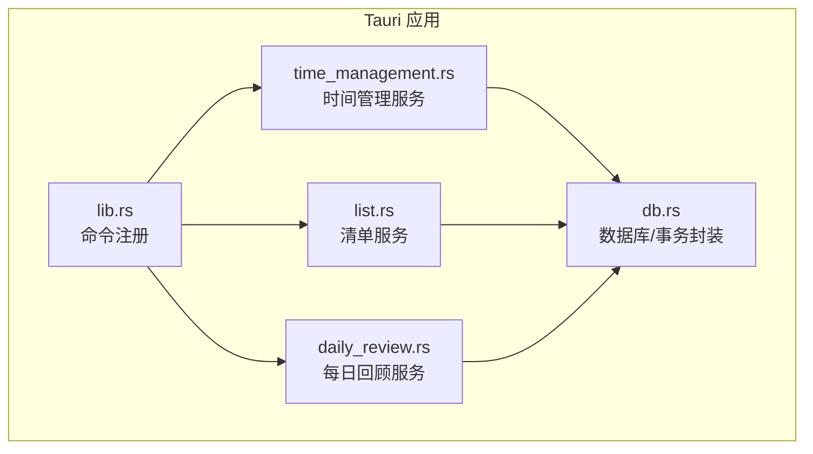
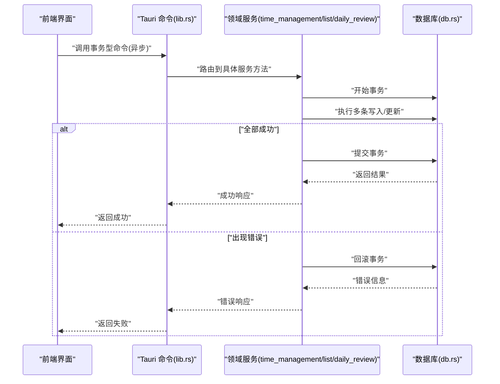
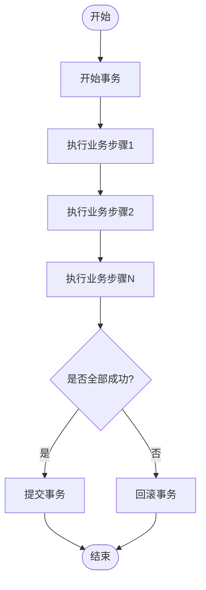
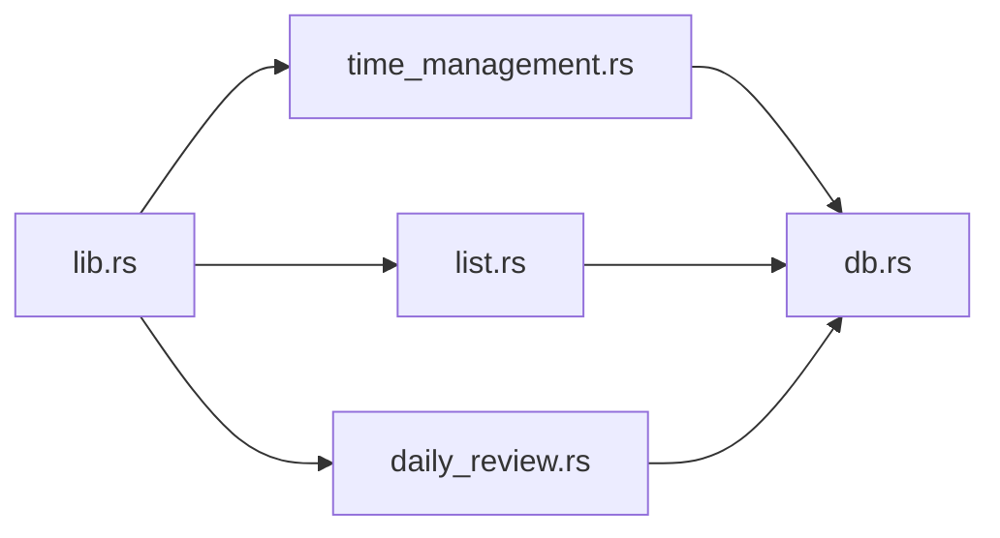

# 事务处理

<cite>
**本文引用的文件**
- [src-tauri/src/db.rs](file://src-tauri/src/db.rs)
- [src-tauri/src/time_management.rs](file://src-tauri/src/time_management.rs)
- [src-tauri/src/list.rs](file://src-tauri/src/list.rs)
- [src-tauri/src/daily_review.rs](file://src-tauri/src/daily_review.rs)
- [src-tauri/src/lib.rs](file://src-tauri/src/lib.rs)
- [src-tauri/Cargo.toml](file://src-tauri/Cargo.toml)
</cite>

## 目录
1. [简介](#简介)
2. [项目结构](#项目结构)
3. [核心组件](#核心组件)
4. [架构总览](#架构总览)
5. [详细组件分析](#详细组件分析)
6. [依赖关系分析](#依赖关系分析)
7. [性能考虑](#性能考虑)
8. [故障排查指南](#故障排查指南)
9. [结论](#结论)
10. [附录](#附录)

## 简介
本技术文档聚焦 FishWorker 的异步事务处理，围绕事务生命周期（开始、提交、回滚）、隔离级别与并发控制、死锁检测与预防、嵌套事务与保存点、长事务优化、错误处理与恢复策略展开。同时结合时间管理与清单管理等业务场景，给出可操作的事务使用建议与实践路径。

## 项目结构
FishWorker 采用 Tauri + Rust 后端架构，数据库访问与事务逻辑集中在 src-tauri 模块中：
- 数据库连接与配置：db.rs
- 领域服务（时间管理、清单、每日回顾）：time_management.rs、list.rs、daily_review.rs
- Tauri 命令入口与注册：lib.rs
- 依赖声明：Cargo.toml

图表来源
- [src-tauri/src/lib.rs](file://src-tauri/src/lib.rs)
- [src-tauri/src/time_management.rs](file://src-tauri/src/time_management.rs)
- [src-tauri/src/list.rs](file://src-tauri/src/list.rs)
- [src-tauri/src/daily_review.rs](file://src-tauri/src/daily_review.rs)
- [src-tauri/src/db.rs](file://src-tauri/src/db.rs)

章节来源
- [src-tauri/src/lib.rs](file://src-tauri/src/lib.rs)
- [src-tauri/src/db.rs](file://src-tauri/src/db.rs)
- [src-tauri/src/time_management.rs](file://src-tauri/src/time_management.rs)
- [src-tauri/src/list.rs](file://src-tauri/src/list.rs)
- [src-tauri/src/daily_review.rs](file://src-tauri/src/daily_review.rs)

## 核心组件
- 数据库与事务封装（db.rs）
  - 负责建立数据库连接、执行 SQL、以及事务边界控制（开始、提交、回滚）。
  - 提供统一的错误类型与传播机制，便于上层业务进行重试或降级。
- 领域服务层（time_management.rs、list.rs、daily_review.rs）
  - 将业务用例组织为函数/方法，调用 db.rs 提供的数据库接口。
  - 在需要一致性的多步操作中，显式开启事务，并在成功时提交，异常时回滚。
- Tauri 命令入口（lib.rs）
  - 暴露给前端的 API 命令，转发到对应领域服务，确保 UI 侧以异步方式调用后端事务。

章节来源
- [src-tauri/src/db.rs](file://src-tauri/src/db.rs)
- [src-tauri/src/time_management.rs](file://src-tauri/src/time_management.rs)
- [src-tauri/src/list.rs](file://src-tauri/src/list.rs)
- [src-tauri/src/daily_review.rs](file://src-tauri/src/daily_review.rs)
- [src-tauri/src/lib.rs](file://src-tauri/src/lib.rs)

## 架构总览
下图展示了从前端到后端的请求链路，以及事务在数据库层的执行位置。

图表来源
- [src-tauri/src/lib.rs](file://src-tauri/src/lib.rs)
- [src-tauri/src/time_management.rs](file://src-tauri/src/time_management.rs)
- [src-tauri/src/list.rs](file://src-tauri/src/list.rs)
- [src-tauri/src/daily_review.rs](file://src-tauri/src/daily_review.rs)
- [src-tauri/src/db.rs](file://src-tauri/src/db.rs)

## 详细组件分析

### 事务生命周期与异步实现
- 事务开始
  - 由 db.rs 提供的事务开始接口被领域服务调用，进入事务上下文。
- 事务提交
  - 当所有步骤均成功完成，领域服务调用提交接口，持久化变更。
- 事务回滚
  - 任一环节抛出错误或返回失败，领域服务触发回滚，保证一致性。
- 异步特性
  - Tauri 命令在前端以异步方式调用；Rust 侧通过阻塞 I/O 与事件循环协作，避免阻塞 UI。

图表来源
- [src-tauri/src/db.rs](file://src-tauri/src/db.rs)
- [src-tauri/src/time_management.rs](file://src-tauri/src/time_management.rs)
- [src-tauri/src/list.rs](file://src-tauri/src/list.rs)
- [src-tauri/src/daily_review.rs](file://src-tauri/src/daily_review.rs)

章节来源
- [src-tauri/src/db.rs](file://src-tauri/src/db.rs)
- [src-tauri/src/time_management.rs](file://src-tauri/src/time_management.rs)
- [src-tauri/src/list.rs](file://src-tauri/src/list.rs)
- [src-tauri/src/daily_review.rs](file://src-tauri/src/daily_review.rs)

### 事务隔离级别设置
- 隔离级别由底层数据库驱动与连接参数决定，通常可在连接初始化阶段配置。
- 建议在 db.rs 的连接创建处集中设置，以便全局统一策略。
- 常见选择：
  - READ COMMITTED：默认且较平衡的隔离级别，适合大多数 OLTP 场景。
  - REPEATABLE READ：更强的读一致性，但可能增加锁竞争。
  - SERIALIZABLE：最强隔离，性能开销较大，谨慎使用。

章节来源
- [src-tauri/src/db.rs](file://src-tauri/src/db.rs)

### 并发控制机制
- 行级锁与索引
  - 合理设计主键与唯一索引，减少锁范围与冲突概率。
- 乐观锁
  - 对热点记录引入版本字段，更新时校验版本号，失败则重试。
- 悲观锁
  - 在强一致需求下使用 SELECT ... FOR UPDATE，缩短持有锁的时间。
- 批量与批大小
  - 大事务拆分为小批次，降低锁持有时间与内存占用。

章节来源
- [src-tauri/src/db.rs](file://src-tauri/src/db.rs)
- [src-tauri/src/time_management.rs](file://src-tauri/src/time_management.rs)
- [src-tauri/src/list.rs](file://src-tauri/src/list.rs)

### 死锁检测与预防策略
- 检测
  - 捕获数据库返回的死锁错误码，识别并上报。
- 预防
  - 固定访问顺序：多个表或多条记录按相同顺序加锁。
  - 缩小事务范围：尽量只包裹必要的写操作。
  - 避免长时间持有锁：I/O 与外部调用移出事务。
  - 重试策略：对死锁错误进行有限次指数退避重试。

章节来源
- [src-tauri/src/db.rs](file://src-tauri/src/db.rs)

### 嵌套事务与保存点
- 嵌套事务
  - 若底层不支持真正的嵌套事务，可通过“子事务”模式模拟：外层事务内维护多个保存点，子流程失败仅回滚至最近保存点。
- 保存点
  - 在关键步骤前后设置保存点，局部失败时回滚到保存点，提升容错性。
- 适用场景
  - 复杂工作流中的分阶段提交，如批量导入、分批更新。

章节来源
- [src-tauri/src/db.rs](file://src-tauri/src/db.rs)
- [src-tauri/src/time_management.rs](file://src-tauri/src/time_management.rs)
- [src-tauri/src/list.rs](file://src-tauri/src/list.rs)

### 长事务优化
- 拆分大事务为多个小事务，减少锁持有与日志膨胀。
- 将非数据库 I/O（网络请求、文件读写）移出事务边界。
- 使用分页/游标处理大批量数据，避免一次性加载。
- 监控慢查询与锁等待，及时优化索引与语句。

章节来源
- [src-tauri/src/db.rs](file://src-tauri/src/db.rs)
- [src-tauri/src/time_management.rs](file://src-tauri/src/time_management.rs)
- [src-tauri/src/list.rs](file://src-tauri/src/list.rs)

### 错误处理与恢复策略
- 分类
  - 可重试错误：网络抖动、死锁、临时资源不可用。
  - 不可重试错误：数据约束违反、权限不足、语法错误。
- 策略
  - 可重试错误：指数退避 + 最大重试次数。
  - 不可重试错误：快速失败，记录详细上下文，提示用户修正输入。
- 部分失败处理
  - 使用保存点定位失败阶段，仅回滚受影响部分。
  - 补偿操作：对已完成的步骤执行反向操作或幂等重放。

章节来源
- [src-tauri/src/db.rs](file://src-tauri/src/db.rs)
- [src-tauri/src/time_management.rs](file://src-tauri/src/time_management.rs)
- [src-tauri/src/list.rs](file://src-tauri/src/list.rs)
- [src-tauri/src/daily_review.rs](file://src-tauri/src/daily_review.rs)

### 业务场景示例与最佳实践

#### 时间管理场景
- 典型用例
  - 批量创建任务、批量更新状态、跨表关联更新。
- 事务要点
  - 明确事务边界，仅包含必要写操作。
  - 对高频字段建立索引，减少锁冲突。
  - 对批量操作采用分页与分批提交。

章节来源
- [src-tauri/src/time_management.rs](file://src-tauri/src/time_management.rs)
- [src-tauri/src/db.rs](file://src-tauri/src/db.rs)

#### 清单管理场景
- 典型用例
  - 新增清单项、移动排序、批量删除。
- 事务要点
  - 排序更新需保证原子性，必要时使用保存点分段提交。
  - 删除操作注意外键约束与级联行为。

章节来源
- [src-tauri/src/list.rs](file://src-tauri/src/list.rs)
- [src-tauri/src/db.rs](file://src-tauri/src/db.rs)

#### 每日回顾场景
- 典型用例
  - 汇总统计、生成回顾报告、归档历史数据。
- 事务要点
  - 统计类读操作尽量放在只读事务或快照读，避免干扰写事务。
  - 归档操作分批执行，避免长事务。

章节来源
- [src-tauri/src/daily_review.rs](file://src-tauri/src/daily_review.rs)
- [src-tauri/src/db.rs](file://src-tauri/src/db.rs)

## 依赖关系分析
- 模块耦合
  - lib.rs 作为命令入口，低耦合地分发到各领域服务。
  - 领域服务依赖 db.rs 的数据库抽象，保持业务与存储解耦。
- 外部依赖
  - Cargo.toml 声明了数据库驱动与序列化等依赖，影响事务与并发模型。

图表来源
- [src-tauri/src/lib.rs](file://src-tauri/src/lib.rs)
- [src-tauri/src/time_management.rs](file://src-tauri/src/time_management.rs)
- [src-tauri/src/list.rs](file://src-tauri/src/list.rs)
- [src-tauri/src/daily_review.rs](file://src-tauri/src/daily_review.rs)
- [src-tauri/src/db.rs](file://src-tauri/src/db.rs)

章节来源
- [src-tauri/src/lib.rs](file://src-tauri/src/lib.rs)
- [src-tauri/Cargo.toml](file://src-tauri/Cargo.toml)

## 性能考虑
- 事务粒度
  - 尽量缩小事务范围，减少锁持有时间。
- 索引与查询
  - 为常用过滤与排序字段建立合适索引，避免全表扫描。
- 批量操作
  - 使用批量插入/更新，减少往返与锁竞争。
- 连接池
  - 合理配置连接池大小，避免过多连接导致上下文切换开销。
- 监控与告警
  - 记录慢事务、锁等待、死锁事件，持续优化。

[本节为通用指导，不直接分析具体文件]

## 故障排查指南
- 常见问题
  - 事务超时：检查事务内是否存在耗时 I/O 或慢查询。
  - 死锁频繁：调整访问顺序、缩小事务、增加重试。
  - 数据不一致：确认保存点与回滚路径是否正确。
- 诊断手段
  - 启用详细日志，记录事务开始、提交、回滚及错误堆栈。
  - 使用数据库工具查看锁等待与执行计划。
- 恢复策略
  - 对可重试错误实施指数退避重试。
  - 对不可重试错误快速失败，并提供用户可操作的修复指引。

章节来源
- [src-tauri/src/db.rs](file://src-tauri/src/db.rs)
- [src-tauri/src/time_management.rs](file://src-tauri/src/time_management.rs)
- [src-tauri/src/list.rs](file://src-tauri/src/list.rs)
- [src-tauri/src/daily_review.rs](file://src-tauri/src/daily_review.rs)

## 结论
FishWorker 的异步事务处理以 db.rs 为核心，结合领域服务在时间管理、清单管理、每日回顾等场景中落地。通过合理的隔离级别、并发控制、死锁预防、保存点与长事务优化，以及完善的错误处理与恢复策略，能够在保证一致性的同时获得良好的性能与可用性。

[本节为总结性内容，不直接分析具体文件]

## 附录
- 术语
  - 事务：一组原子执行的数据库操作。
  - 保存点：事务内的标记点，支持部分回滚。
  - 隔离级别：事务间可见性与相互影响的规则。
- 参考
  - 数据库驱动文档与 Tauri 异步模型说明。

[本节为概念性内容，不直接分析具体文件]