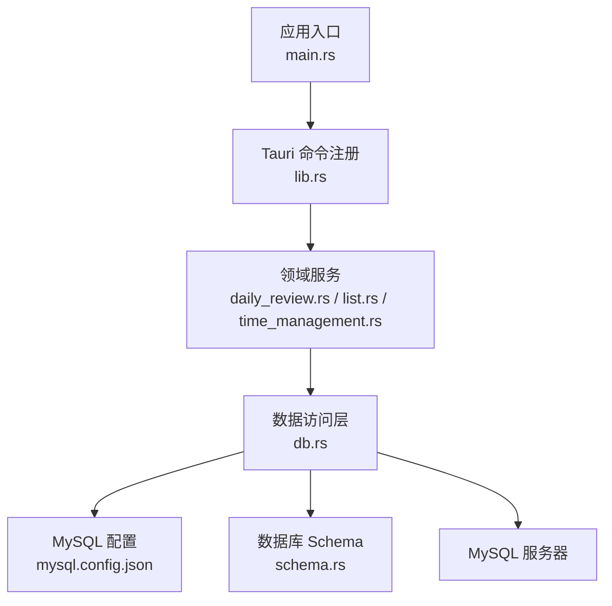
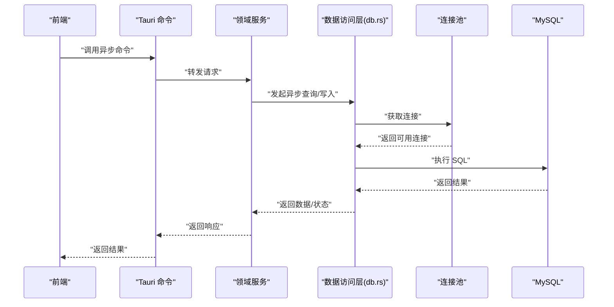
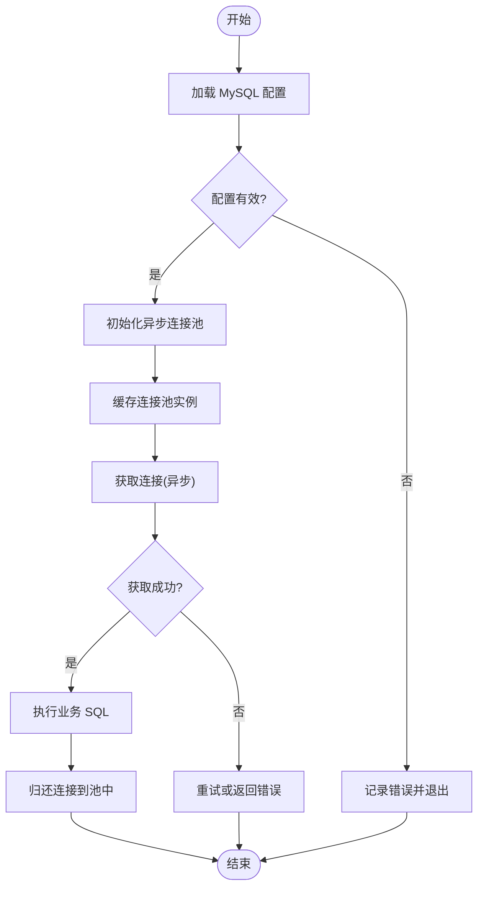
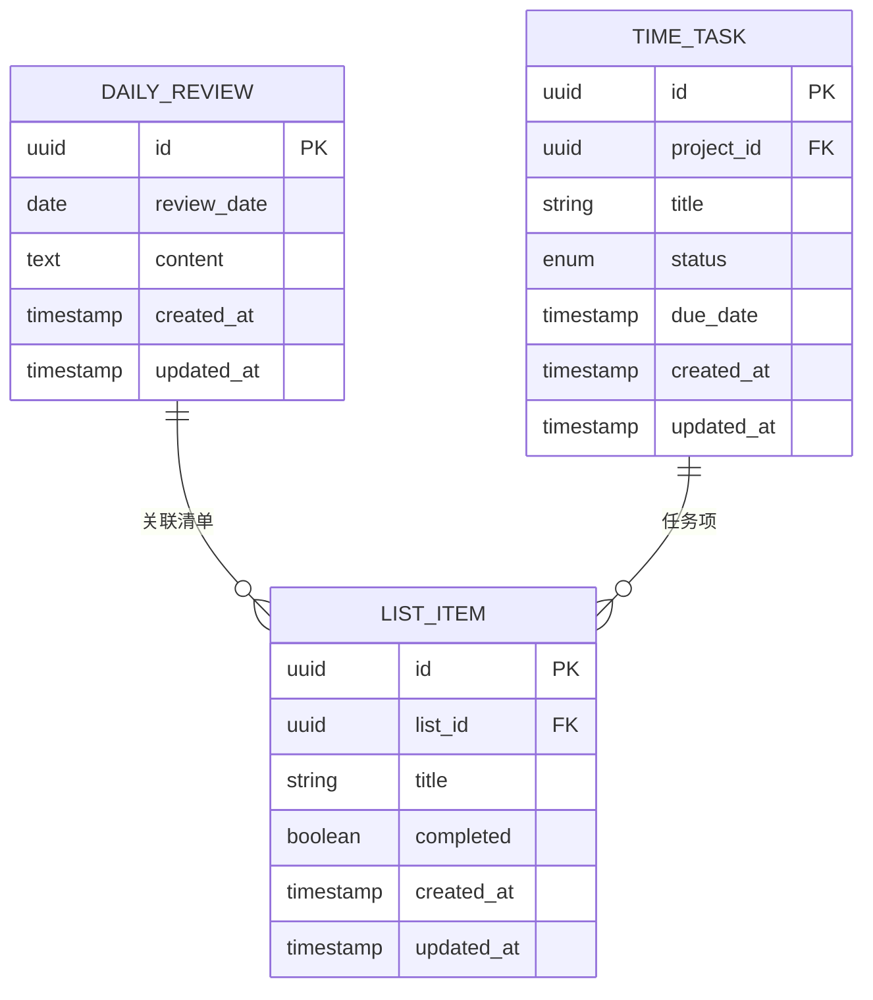
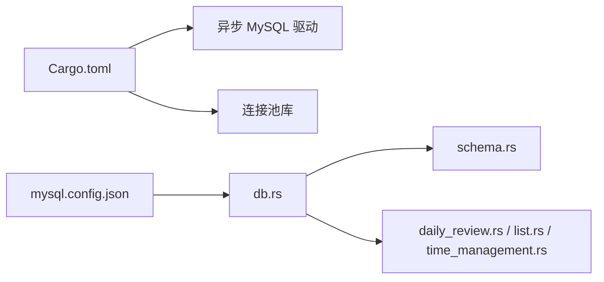

# 异步数据库操作

<cite>
**本文引用的文件**   
- [src-tauri/src/db.rs](file://src-tauri/src/db.rs)
- [src-tauri/src/schema.rs](file://src-tauri/src/schema.rs)
- [src-tauri/Cargo.toml](file://src-tauri/Cargo.toml)
- [src-tauri/mysql.config.json](file://src-tauri/mysql.config.json)
- [src-tauri/src/lib.rs](file://src-tauri/src/lib.rs)
- [src-tauri/src/main.rs](file://src-tauri/src/main.rs)
- [src-tauri/src/daily_review.rs](file://src-tauri/src/daily_review.rs)
- [src-tauri/src/list.rs](file://src-tauri/src/list.rs)
- [src-tauri/src/time_management.rs](file://src-tauri/src/time_management.rs)
</cite>

## 目录
1. [简介](#简介)
2. [项目结构](#项目结构)
3. [核心组件](#核心组件)
4. [架构总览](#架构总览)
5. [详细组件分析](#详细组件分析)
6. [依赖关系分析](#依赖关系分析)
7. [性能与并发](#性能与并发)
8. [故障排查指南](#故障排查指南)
9. [结论](#结论)
10. [附录：示例与最佳实践](#附录示例与最佳实践)

## 简介
本技术文档围绕 FishWorker 的异步数据库访问层展开，重点说明以下内容：
- 异步数据库连接池的实现与管理（建立、复用、释放）
- 异步查询执行模式、批量操作优化与事务的异步实现
- 数据库 Schema 设计与索引策略
- 数据访问层架构（Repository 模式）、ORM/SQL 集成方案
- 并发查询处理、死锁预防、性能监控与慢查询分析
- 实际异步数据库操作的代码示例路径与错误处理策略

FishWorker 采用 Tauri + Rust 后端，通过异步驱动访问 MySQL。数据访问层以模块化的方式组织，提供面向领域能力的接口，并在底层使用异步连接池管理数据库资源。

## 项目结构
后端位于 src-tauri 目录，关键文件如下：
- db.rs：数据库连接池初始化、配置加载、连接获取与生命周期管理
- schema.rs：数据库表结构与索引定义（DDL）
- Cargo.toml：Rust 依赖声明（包括异步 MySQL 驱动与连接池库）
- mysql.config.json：MySQL 连接参数（主机、端口、用户、密码、数据库名等）
- lib.rs / main.rs：Tauri 应用入口与命令注册
- daily_review.rs / list.rs / time_management.rs：领域能力的数据访问封装（Repository 风格）



图表来源
- [src-tauri/src/main.rs](file://src-tauri/src/main.rs)
- [src-tauri/src/lib.rs](file://src-tauri/src/lib.rs)
- [src-tauri/src/db.rs](file://src-tauri/src/db.rs)
- [src-tauri/src/schema.rs](file://src-tauri/src/schema.rs)
- [src-tauri/mysql.config.json](file://src-tauri/mysql.config.json)

章节来源
- [src-tauri/src/main.rs](file://src-tauri/src/main.rs)
- [src-tauri/src/lib.rs](file://src-tauri/src/lib.rs)
- [src-tauri/src/db.rs](file://src-tauri/src/db.rs)
- [src-tauri/src/schema.rs](file://src-tauri/src/schema.rs)
- [src-tauri/Cargo.toml](file://src-tauri/Cargo.toml)
- [src-tauri/mysql.config.json](file://src-tauri/mysql.config.json)

## 核心组件
- 连接池管理器（db.rs）
  - 负责从配置文件读取 MySQL 连接参数
  - 初始化异步连接池并缓存全局实例
  - 提供获取连接的便捷方法，确保连接在作用域结束时正确归还到池中
- 数据模型与迁移（schema.rs）
  - 定义业务所需的表结构与索引
  - 提供建表与索引创建逻辑，支持幂等初始化
- 领域数据访问层（daily_review.rs / list.rs / time_management.rs）
  - 以 Repository 风格封装 CRUD 与复杂查询
  - 暴露异步 API，供上层业务调用
- 配置与依赖（Cargo.toml / mysql.config.json）
  - 声明异步 MySQL 驱动与连接池依赖
  - 集中管理连接参数，便于多环境切换

章节来源
- [src-tauri/src/db.rs](file://src-tauri/src/db.rs)
- [src-tauri/src/schema.rs](file://src-tauri/src/schema.rs)
- [src-tauri/src/daily_review.rs](file://src-tauri/src/daily_review.rs)
- [src-tauri/src/list.rs](file://src-tauri/src/list.rs)
- [src-tauri/src/time_management.rs](file://src-tauri/src/time_management.rs)
- [src-tauri/Cargo.toml](file://src-tauri/Cargo.toml)
- [src-tauri/mysql.config.json](file://src-tauri/mysql.config.json)

## 架构总览
整体架构遵循“前端 UI → Tauri 命令 → 领域服务 → 数据访问层 → 数据库”的分层设计。数据访问层通过异步连接池与 MySQL 通信，保证高并发下的资源复用与低延迟。



图表来源
- [src-tauri/src/lib.rs](file://src-tauri/src/lib.rs)
- [src-tauri/src/db.rs](file://src-tauri/src/db.rs)
- [src-tauri/src/daily_review.rs](file://src-tauri/src/daily_review.rs)
- [src-tauri/src/list.rs](file://src-tauri/src/list.rs)
- [src-tauri/src/time_management.rs](file://src-tauri/src/time_management.rs)

## 详细组件分析

### 连接池管理与生命周期（db.rs）
- 连接参数加载
  - 从 mysql.config.json 读取主机、端口、用户名、密码、数据库名等
  - 校验必填字段，失败时快速失败并记录错误
- 连接池初始化
  - 基于异步 MySQL 驱动创建连接池
  - 设置最大连接数、空闲超时、连接存活时间等参数
  - 将连接池作为全局或单例持有，避免重复初始化
- 连接获取与释放
  - 提供异步获取连接的方法
  - 使用 RAII 或作用域管理确保连接在使用后归还到池中
  - 对连接获取失败进行重试与退避策略（可选）



图表来源
- [src-tauri/src/db.rs](file://src-tauri/src/db.rs)
- [src-tauri/mysql.config.json](file://src-tauri/mysql.config.json)

章节来源
- [src-tauri/src/db.rs](file://src-tauri/src/db.rs)
- [src-tauri/mysql.config.json](file://src-tauri/mysql.config.json)

### 数据库 Schema 与索引策略（schema.rs）
- 表结构设计
  - 为每日回顾、清单、时间管理等业务实体定义主键、外键与必要字段
  - 统一时间戳字段（创建时间、更新时间），便于审计与排序
- 索引策略
  - 针对高频查询条件建立复合索引（如按日期范围、状态、分类）
  - 对唯一性约束字段建立唯一索引
  - 避免过度索引，权衡写入性能与查询效率
- 幂等初始化
  - 提供 IF NOT EXISTS 或版本化迁移脚本，确保多次运行不破坏现有数据



图表来源
- [src-tauri/src/schema.rs](file://src-tauri/src/schema.rs)

章节来源
- [src-tauri/src/schema.rs](file://src-tauri/src/schema.rs)

### 数据访问层与 Repository 模式（daily_review.rs / list.rs / time_management.rs）
- 职责划分
  - 每个领域模块封装对应实体的 CRUD 与复杂查询
  - 对外暴露异步函数，隐藏底层 SQL 细节
- 事务处理
  - 使用异步事务 API 包裹多条语句，保证一致性
  - 在异常分支中显式回滚，正常流程提交
- 批量操作
  - 使用批量插入/更新减少往返次数
  - 控制批次大小，避免单次事务过大导致锁竞争

```mermaid
classDiagram
class DailyReviewRepo {
+async get_by_date(date) Result<List<DailyReview>>
+async upsert(review) Result<()>
+async delete_by_date(date) Result<()>
}
class ListRepo {
+async create(item) Result<uuid>
+async update(id, item) Result<()>
+async batch_insert(items) Result<usize>
+async delete_many(ids) Result<usize>
}
class TimeManagementRepo {
+async query_due_tasks(due_before) Result<Vec<Task>>
+async mark_completed(id) Result<()>
+async transactional_update(tasks) Result<()>
}
DailyReviewRepo --> "db.rs" : "获取连接/执行SQL"
ListRepo --> "db.rs" : "获取连接/执行SQL"
TimeManagementRepo --> "db.rs" : "获取连接/执行SQL"
```

图表来源
- [src-tauri/src/daily_review.rs](file://src-tauri/src/daily_review.rs)
- [src-tauri/src/list.rs](file://src-tauri/src/list.rs)
- [src-tauri/src/time_management.rs](file://src-tauri/src/time_management.rs)
- [src-tauri/src/db.rs](file://src-tauri/src/db.rs)

章节来源
- [src-tauri/src/daily_review.rs](file://src-tauri/src/daily_review.rs)
- [src-tauri/src/list.rs](file://src-tauri/src/list.rs)
- [src-tauri/src/time_management.rs](file://src-tauri/src/time_management.rs)
- [src-tauri/src/db.rs](file://src-tauri/src/db.rs)

### ORM/SQL 集成方案
- 选择策略
  - 优先使用原生 SQL 以获得更细粒度的性能控制与可观测性
  - 在需要强类型映射的场景引入轻量 ORM 或查询构建器（可选）
- 集成要点
  - 统一错误类型包装，区分网络错误、SQL 语法错误、约束冲突等
  - 统一日志格式，包含 SQL、参数、耗时与影响行数

章节来源
- [src-tauri/src/db.rs](file://src-tauri/src/db.rs)
- [src-tauri/src/daily_review.rs](file://src-tauri/src/daily_review.rs)
- [src-tauri/src/list.rs](file://src-tauri/src/list.rs)
- [src-tauri/src/time_management.rs](file://src-tauri/src/time_management.rs)

## 依赖关系分析
- 外部依赖
  - 异步 MySQL 驱动与连接池库在 Cargo.toml 中声明
  - 配置加载依赖 JSON 解析库
- 内部依赖
  - 领域服务依赖数据访问层
  - 数据访问层依赖连接池与配置



图表来源
- [src-tauri/Cargo.toml](file://src-tauri/Cargo.toml)
- [src-tauri/mysql.config.json](file://src-tauri/mysql.config.json)
- [src-tauri/src/db.rs](file://src-tauri/src/db.rs)
- [src-tauri/src/schema.rs](file://src-tauri/src/schema.rs)
- [src-tauri/src/daily_review.rs](file://src-tauri/src/daily_review.rs)
- [src-tauri/src/list.rs](file://src-tauri/src/list.rs)
- [src-tauri/src/time_management.rs](file://src-tauri/src/time_management.rs)

章节来源
- [src-tauri/Cargo.toml](file://src-tauri/Cargo.toml)
- [src-tauri/mysql.config.json](file://src-tauri/mysql.config.json)
- [src-tauri/src/db.rs](file://src-tauri/src/db.rs)

## 性能与并发
- 连接池调优
  - 根据 CPU 核数与 I/O 负载调整最大连接数
  - 合理设置空闲超时与连接存活时间，避免僵尸连接
- 查询优化
  - 使用覆盖索引减少回表
  - 限制返回列与分页，避免大结果集
- 批量操作
  - 分批提交，每批大小建议 500~2000 条，视事务开销与锁粒度调整
- 事务与锁
  - 缩短事务边界，减少长事务
  - 固定加锁顺序，避免循环等待导致的死锁
- 监控与慢查询
  - 记录 SQL 执行耗时，超过阈值输出慢查询日志
  - 收集连接池指标（活跃连接、等待队列长度）

[本节为通用性能指导，不直接分析具体文件]

## 故障排查指南
- 常见问题
  - 连接失败：检查 mysql.config.json 中的主机、端口、用户名、密码与数据库名
  - 连接池耗尽：观察活跃连接数与等待队列，必要时增大最大连接数
  - 慢查询：定位热点 SQL，补充索引或改写查询
  - 死锁：分析事务加锁顺序，拆分大事务
- 诊断步骤
  - 启用详细日志，记录 SQL 与参数
  - 使用数据库端慢查询日志与 EXPLAIN 分析执行计划
  - 在数据访问层增加错误分类与上下文信息

章节来源
- [src-tauri/src/db.rs](file://src-tauri/src/db.rs)
- [src-tauri/src/daily_review.rs](file://src-tauri/src/daily_review.rs)
- [src-tauri/src/list.rs](file://src-tauri/src/list.rs)
- [src-tauri/src/time_management.rs](file://src-tauri/src/time_management.rs)

## 结论
FishWorker 的异步数据库访问层通过连接池管理、Repository 模式封装与清晰的 Schema 设计，实现了高并发、可扩展且可维护的数据访问能力。配合合理的索引策略、批量操作与事务控制，能够在保证一致性的同时获得良好的性能表现。建议在上线前完善监控与告警，持续优化慢查询与锁竞争问题。

[本节为总结性内容，不直接分析具体文件]

## 附录：示例与最佳实践
- 异步连接获取与释放
  - 参考路径：[src-tauri/src/db.rs](file://src-tauri/src/db.rs)
- 建表与索引初始化
  - 参考路径：[src-tauri/src/schema.rs](file://src-tauri/src/schema.rs)
- 领域查询与写入（Repository 风格）
  - 参考路径：[src-tauri/src/daily_review.rs](file://src-tauri/src/daily_review.rs)、[src-tauri/src/list.rs](file://src-tauri/src/list.rs)、[src-tauri/src/time_management.rs](file://src-tauri/src/time_management.rs)
- 事务包裹与批量插入
  - 参考路径：[src-tauri/src/list.rs](file://src-tauri/src/list.rs)、[src-tauri/src/time_management.rs](file://src-tauri/src/time_management.rs)
- 错误处理与日志
  - 参考路径：[src-tauri/src/db.rs](file://src-tauri/src/db.rs)、[src-tauri/src/daily_review.rs](file://src-tauri/src/daily_review.rs)
- 配置与环境切换
  - 参考路径：[src-tauri/mysql.config.json](file://src-tauri/mysql.config.json)、[src-tauri/Cargo.toml](file://src-tauri/Cargo.toml)

章节来源
- [src-tauri/src/db.rs](file://src-tauri/src/db.rs)
- [src-tauri/src/schema.rs](file://src-tauri/src/schema.rs)
- [src-tauri/src/daily_review.rs](file://src-tauri/src/daily_review.rs)
- [src-tauri/src/list.rs](file://src-tauri/src/list.rs)
- [src-tauri/src/time_management.rs](file://src-tauri/src/time_management.rs)
- [src-tauri/mysql.config.json](file://src-tauri/mysql.config.json)
- [src-tauri/Cargo.toml](file://src-tauri/Cargo.toml)