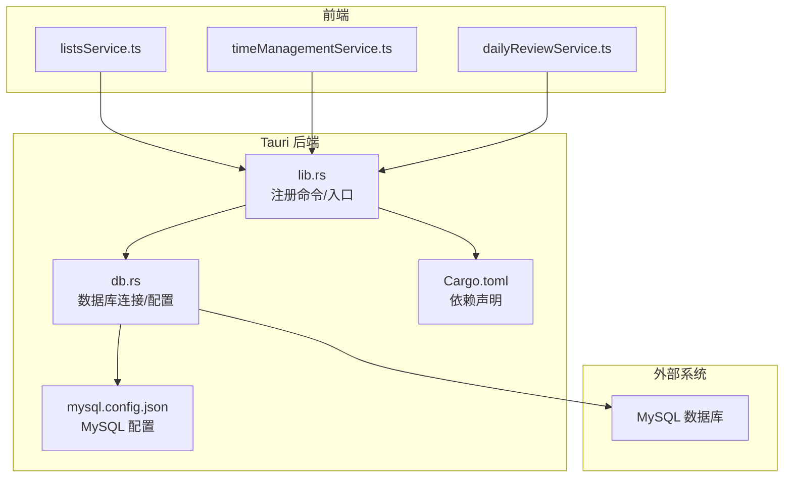
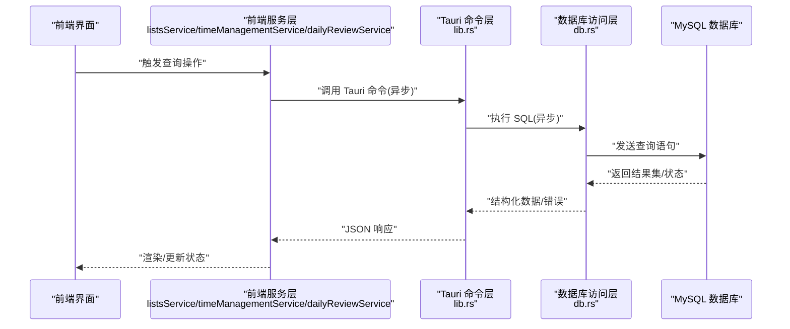
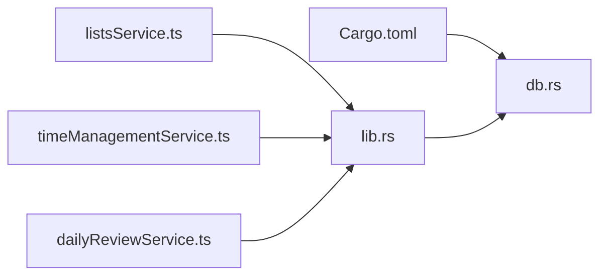

# 异步查询执行

<cite>
**本文引用的文件**   
- [src-tauri/src/db.rs](file://src-tauri/src/db.rs)
- [src-tauri/src/lib.rs](file://src-tauri/src/lib.rs)
- [src-tauri/Cargo.toml](file://src-tauri/Cargo.toml)
- [src-tauri/mysql.config.json](file://src-tauri/mysql.config.json)
- [src/features/lists/listsService.ts](file://src/features/lists/listsService.ts)
- [src/features/time-management/timeManagementService.ts](file://src/features/time-management/timeManagementService.ts)
- [src/features/daily-review/dailyReviewService.ts](file://src/features/daily-review/dailyReviewService.ts)
</cite>

## 目录
1. [简介](#简介)
2. [项目结构](#项目结构)
3. [核心组件](#核心组件)
4. [架构总览](#架构总览)
5. [详细组件分析](#详细组件分析)
6. [依赖关系分析](#依赖关系分析)
7. [性能考虑](#性能考虑)
8. [故障排查指南](#故障排查指南)
9. [结论](#结论)
10. [附录](#附录)

## 简介
本技术文档围绕 FishWorker 的异步 SQL 查询执行展开，重点说明：
- 单条查询、批量查询与复杂联表查询的异步实现模式
- 查询优化策略（索引使用、查询计划分析、分页优化）
- 异步流式处理与大数据集高效读取
- 错误处理机制（超时、连接中断、SQL 语法错误）
- 前端调用示例路径与性能优化技巧

FishWorker 采用 Tauri + Rust 后端 + MySQL 的技术栈。Rust 侧通过异步驱动访问数据库，Tauri 命令暴露给前端；前端以 TypeScript/React 方式发起请求并消费结果。

## 项目结构
从仓库结构看，与异步查询相关的核心代码位于 src-tauri 目录（Rust/Tauri 后端），以及 src/features 下的若干 Service 模块（前端调用层）。

图表来源
- [src-tauri/src/lib.rs](file://src-tauri/src/lib.rs)
- [src-tauri/src/db.rs](file://src-tauri/src/db.rs)
- [src-tauri/Cargo.toml](file://src-tauri/Cargo.toml)
- [src-tauri/mysql.config.json](file://src-tauri/mysql.config.json)
- [src/features/lists/listsService.ts](file://src/features/lists/listsService.ts)
- [src/features/time-management/timeManagementService.ts](file://src/features/time-management/timeManagementService.ts)
- [src/features/daily-review/dailyReviewService.ts](file://src/features/daily-review/dailyReviewService.ts)

章节来源
- [src-tauri/src/lib.rs](file://src-tauri/src/lib.rs)
- [src-tauri/src/db.rs](file://src-tauri/src/db.rs)
- [src-tauri/Cargo.toml](file://src-tauri/Cargo.toml)
- [src-tauri/mysql.config.json](file://src-tauri/mysql.config.json)
- [src/features/lists/listsService.ts](file://src/features/lists/listsService.ts)
- [src/features/time-management/timeManagementService.ts](file://src/features/time-management/timeManagementService.ts)
- [src/features/daily-review/dailyReviewService.ts](file://src/features/daily-review/dailyReviewService.ts)

## 核心组件
- 数据库连接与配置
  - 负责加载 MySQL 配置、建立连接池、提供统一的查询入口。
  - 关键职责：连接参数解析、连接池初始化、事务边界管理、错误映射。
- Tauri 命令层
  - 将前端请求映射到具体业务方法，封装为异步任务，返回结构化响应。
  - 关键职责：参数校验、上下文传递、错误包装、日志记录。
- 前端服务层
  - 封装对 Tauri 命令的调用，统一处理请求/响应类型、重试与超时控制。
  - 关键职责：参数序列化、错误提示、分页参数组装、结果转换。

章节来源
- [src-tauri/src/db.rs](file://src-tauri/src/db.rs)
- [src-tauri/src/lib.rs](file://src-tauri/src/lib.rs)
- [src/features/lists/listsService.ts](file://src/features/lists/listsService.ts)
- [src/features/time-management/timeManagementService.ts](file://src/features/time-management/timeManagementService.ts)
- [src/features/daily-review/dailyReviewService.ts](file://src/features/daily-review/dailyReviewService.ts)

## 架构总览
下图展示了从前端到数据库的完整异步调用链路，包括命令路由、数据库访问与结果回传。

图表来源
- [src-tauri/src/lib.rs](file://src-tauri/src/lib.rs)
- [src-tauri/src/db.rs](file://src-tauri/src/db.rs)
- [src/features/lists/listsService.ts](file://src/features/lists/listsService.ts)
- [src/features/time-management/timeManagementService.ts](file://src/features/time-management/timeManagementService.ts)
- [src/features/daily-review/dailyReviewService.ts](file://src/features/daily-review/dailyReviewService.ts)

## 详细组件分析

### 数据库访问层（db.rs）
- 功能要点
  - 加载 MySQL 配置（用户名、密码、主机、端口、库名等）
  - 初始化连接池，复用连接提升吞吐
  - 提供通用查询接口（支持单条、批量、联表）
  - 错误映射与日志输出
- 设计建议
  - 使用连接池大小按并发量调优
  - 对长耗时查询设置超时与取消令牌
  - 对大结果集启用流式读取，避免一次性加载到内存

章节来源
- [src-tauri/src/db.rs](file://src-tauri/src/db.rs)
- [src-tauri/mysql.config.json](file://src-tauri/mysql.config.json)

### Tauri 命令层（lib.rs）
- 功能要点
  - 注册命令，将前端调用映射到具体函数
  - 参数校验与默认值填充
  - 调用 db.rs 提供的查询方法
  - 统一错误包装与返回格式
- 设计建议
  - 对每个命令定义清晰的输入/输出类型
  - 在命令入口处记录关键日志（入参摘要、耗时）
  - 对敏感信息脱敏后再落盘

章节来源
- [src-tauri/src/lib.rs](file://src-tauri/src/lib.rs)

### 前端服务层（listsService.ts / timeManagementService.ts / dailyReviewService.ts）
- 功能要点
  - 封装 Tauri 命令调用，统一处理异步流程
  - 分页参数组装（页码、每页大小、排序字段）
  - 错误提示与重试策略
  - 结果转换为业务模型
- 设计建议
  - 对网络/命令失败进行指数退避重试
  - 对大数据集采用增量加载或虚拟滚动
  - 对查询条件做缓存，减少重复请求

章节来源
- [src/features/lists/listsService.ts](file://src/features/lists/listsService.ts)
- [src/features/time-management/timeManagementService.ts](file://src/features/time-management/timeManagementService.ts)
- [src/features/daily-review/dailyReviewService.ts](file://src/features/daily-review/dailyReviewService.ts)

### 单条查询异步实现
- 典型流程
  - 前端构造查询参数（过滤、排序、分页）
  - 调用 Tauri 命令
  - 后端执行 SELECT 语句并返回首条或聚合结果
- 优化要点
  - 使用覆盖索引减少回表
  - 只选择必要字段，避免 SELECT *
  - 合理设置 LIMIT 与 OFFSET

章节来源
- [src/features/lists/listsService.ts](file://src/features/lists/listsService.ts)
- [src-tauri/src/lib.rs](file://src-tauri/src/lib.rs)
- [src-tauri/src/db.rs](file://src-tauri/src/db.rs)

### 批量查询异步实现
- 典型流程
  - 前端传入 ID 列表或分批参数
  - 后端使用 IN 子句或循环批处理
  - 返回多条记录集合
- 优化要点
  - 控制单次批量大小，避免过大导致锁竞争
  - 使用预编译语句减少解析开销
  - 对热点数据启用缓存

章节来源
- [src/features/time-management/timeManagementService.ts](file://src/features/time-management/timeManagementService.ts)
- [src-tauri/src/db.rs](file://src-tauri/src/db.rs)

### 复杂联表查询异步实现
- 典型流程
  - 前端指定关联维度与筛选条件
  - 后端构建 JOIN 查询，必要时拆分为多次查询并在应用层合并
  - 返回扁平化或嵌套结构
- 优化要点
  - 确保 JOIN 键有合适索引
  - 使用 EXPLAIN 分析执行计划，消除全表扫描
  - 对大结果集采用分页或分片拉取

章节来源
- [src/features/daily-review/dailyReviewService.ts](file://src/features/daily-review/dailyReviewService.ts)
- [src-tauri/src/db.rs](file://src-tauri/src/db.rs)

### 异步流式处理与大数据集读取
- 目标
  - 降低峰值内存占用，提高吞吐
- 实现思路
  - 后端使用流式游标逐行读取
  - 前端采用增量渲染或虚拟列表
  - 对中间计算结果进行分块传输
- 注意事项
  - 保持连接稳定，避免中途断开
  - 设置合理的超时与心跳
  - 对异常中断进行恢复与断点续传

章节来源
- [src-tauri/src/db.rs](file://src-tauri/src/db.rs)
- [src/features/lists/listsService.ts](file://src/features/lists/listsService.ts)

### 错误处理机制
- 常见错误
  - 查询超时、连接中断、SQL 语法错误、权限不足
- 处理策略
  - 超时：设置命令级与数据库级超时，快速失败并提示重试
  - 连接中断：自动重连与退避重试，记录诊断信息
  - SQL 语法错误：捕获并返回可读错误消息，附带上下文
- 前端体验
  - 统一错误弹窗与日志上报
  - 提供“重试”与“查看详情”能力

章节来源
- [src-tauri/src/db.rs](file://src-tauri/src/db.rs)
- [src-tauri/src/lib.rs](file://src-tauri/src/lib.rs)
- [src/features/lists/listsService.ts](file://src/features/lists/listsService.ts)

### 实际异步查询示例（路径指引）
- 列表分页查询
  - 前端：[src/features/lists/listsService.ts](file://src/features/lists/listsService.ts)
  - 后端命令：[src-tauri/src/lib.rs](file://src-tauri/src/lib.rs)
  - 数据库访问：[src-tauri/src/db.rs](file://src-tauri/src/db.rs)
- 时间管理批量查询
  - 前端：[src/features/time-management/timeManagementService.ts](file://src/features/time-management/timeManagementService.ts)
  - 后端命令：[src-tauri/src/lib.rs](file://src-tauri/src/lib.rs)
  - 数据库访问：[src-tauri/src/db.rs](file://src-tauri/src/db.rs)
- 每日回顾联表查询
  - 前端：[src/features/daily-review/dailyReviewService.ts](file://src/features/daily-review/dailyReviewService.ts)
  - 后端命令：[src-tauri/src/lib.rs](file://src-tauri/src/lib.rs)
  - 数据库访问：[src-tauri/src/db.rs](file://src-tauri/src/db.rs)

## 依赖关系分析
- 外部依赖
  - MySQL 驱动与连接池由 Cargo.toml 声明
- 内部依赖
  - lib.rs 依赖 db.rs 提供的数据库访问能力
  - 前端各 Service 依赖 Tauri 命令接口

图表来源
- [src-tauri/Cargo.toml](file://src-tauri/Cargo.toml)
- [src-tauri/src/lib.rs](file://src-tauri/src/lib.rs)
- [src-tauri/src/db.rs](file://src-tauri/src/db.rs)
- [src/features/lists/listsService.ts](file://src/features/lists/listsService.ts)
- [src/features/time-management/timeManagementService.ts](file://src/features/time-management/timeManagementService.ts)
- [src/features/daily-review/dailyReviewService.ts](file://src/features/daily-review/dailyReviewService.ts)

章节来源
- [src-tauri/Cargo.toml](file://src-tauri/Cargo.toml)
- [src-tauri/src/lib.rs](file://src-tauri/src/lib.rs)
- [src-tauri/src/db.rs](file://src-tauri/src/db.rs)
- [src/features/lists/listsService.ts](file://src/features/lists/listsService.ts)
- [src/features/time-management/timeManagementService.ts](file://src/features/time-management/timeManagementService.ts)
- [src/features/daily-review/dailyReviewService.ts](file://src/features/daily-review/dailyReviewService.ts)

## 性能考虑
- 索引优化
  - 为高频过滤与排序字段建立索引
  - 使用复合索引匹配查询谓词顺序
  - 定期分析慢查询日志，补充缺失索引
- 查询计划分析
  - 使用 EXPLAIN 检查是否走索引、是否存在临时表与文件排序
  - 关注 rows 估计与实际差异，调整统计信息与查询写法
- 分页优化
  - 优先使用基于游标的分页（WHERE id > last_id ORDER BY id LIMIT N）
  - 避免深层 OFFSET 带来的额外扫描
- 连接池与并发
  - 根据 CPU 与 I/O 特性调整连接池大小
  - 对热点查询引入本地缓存或二级缓存
- 流式与批处理
  - 大数据集采用流式读取与分块传输
  - 批量写入/更新时控制批次大小，避免锁等待

[本节为通用指导，不直接分析具体文件]

## 故障排查指南
- 常见问题定位
  - 查询缓慢：查看 EXPLAIN 与慢查询日志，确认索引命中
  - 连接中断：检查网络稳定性与 MySQL 最大连接数
  - SQL 语法错误：核对字段名、表名与别名，使用预编译语句
- 诊断步骤
  - 在后端增加关键路径日志（入参、耗时、错误堆栈）
  - 在前端记录请求/响应摘要与错误码
  - 复现问题时抓取最小可复现场景
- 恢复策略
  - 自动重试与退避
  - 降级查询（仅返回必要字段）
  - 熔断与限流保护后端

章节来源
- [src-tauri/src/db.rs](file://src-tauri/src/db.rs)
- [src-tauri/src/lib.rs](file://src-tauri/src/lib.rs)
- [src/features/lists/listsService.ts](file://src/features/lists/listsService.ts)

## 结论
FishWorker 的异步查询执行通过 Tauri 命令层与 Rust 数据库访问层协同工作，结合前端服务层的封装，实现了高可用、可扩展的数据访问能力。通过合理的索引与分页策略、流式处理与完善的错误处理机制，可在大数据场景下保持稳定性能与良好用户体验。

[本节为总结性内容，不直接分析具体文件]

## 附录
- 配置参考
  - MySQL 配置文件路径：[src-tauri/mysql.config.json](file://src-tauri/mysql.config.json)
  - Rust 依赖清单：[src-tauri/Cargo.toml](file://src-tauri/Cargo.toml)
- 前端调用入口
  - 列表服务：[src/features/lists/listsService.ts](file://src/features/lists/listsService.ts)
  - 时间管理服务：[src/features/time-management/timeManagementService.ts](file://src/features/time-management/timeManagementService.ts)
  - 每日回顾服务：[src/features/daily-review/dailyReviewService.ts](file://src/features/daily-review/dailyReviewService.ts)