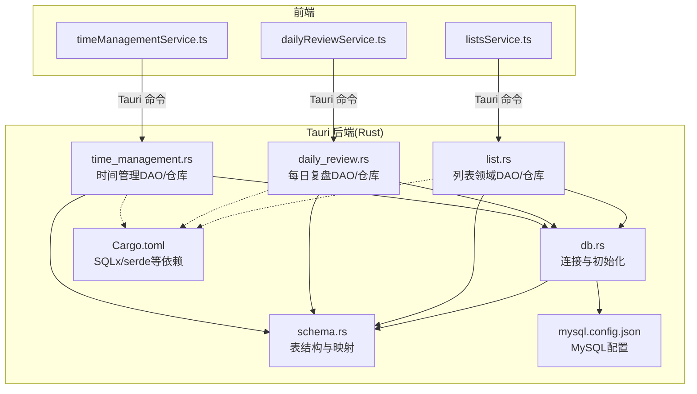
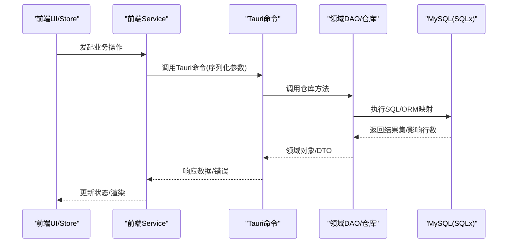
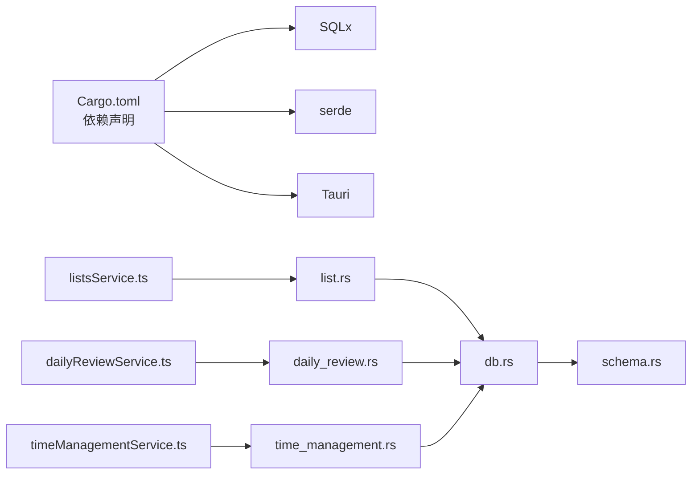

# 数据访问层架构

<cite>
**本文引用的文件**
- [src-tauri/src/db.rs](file://src-tauri/src/db.rs)
- [src-tauri/src/schema.rs](file://src-tauri/src/schema.rs)
- [src-tauri/src/list.rs](file://src-tauri/src/list.rs)
- [src-tauri/src/daily_review.rs](file://src-tauri/src/daily_review.rs)
- [src-tauri/src/time_management.rs](file://src-tauri/src/time_management.rs)
- [src-tauri/Cargo.toml](file://src-tauri/Cargo.toml)
- [src-tauri/mysql.config.json](file://src-tauri/mysql.config.json)
- [src/features/lists/listsService.ts](file://src/features/lists/listsService.ts)
- [src/features/daily-review/dailyReviewService.ts](file://src/features/daily-review/dailyReviewService.ts)
- [src/features/time-management/timeManagementService.ts](file://src/features/time-management/timeManagementService.ts)
</cite>

## 目录
1. [简介](#简介)
2. [项目结构](#项目结构)
3. [核心组件](#核心组件)
4. [架构总览](#架构总览)
5. [详细组件分析](#详细组件分析)
6. [依赖关系分析](#依赖关系分析)
7. [性能与一致性](#性能与一致性)
8. [故障排查指南](#故障排查指南)
9. [结论](#结论)
10. [附录：扩展数据访问功能示例](#附录扩展数据访问功能示例)

## 简介
本技术文档聚焦 FishWorker 的数据访问层（DAL）架构，围绕以下目标展开：
- Repository 模式实现：抽象接口定义、具体实现类设计
- ORM 集成方案：实体映射配置、关系建模
- 分层架构职责划分：DAO 层、Service 层
- 缓存策略集成、读写分离实现、数据一致性保证
- 数据迁移工具使用指南与版本管理策略
- 扩展新数据访问功能的实践示例

FishWorker 采用 Tauri + Rust 后端 + TypeScript 前端的混合架构。数据访问层主要位于 Rust 侧（src-tauri），通过 Tauri 命令暴露给前端 Service 调用。

## 项目结构
数据访问相关代码集中在 src-tauri 目录中，关键文件如下：
- db.rs：数据库连接与初始化
- schema.rs：表结构与 ORM 映射
- list.rs / daily_review.rs / time_management.rs：领域 DAO/Repository 实现
- Cargo.toml：Rust 依赖声明（含 SQLx、serde 等）
- mysql.config.json：MySQL 连接配置
- 前端 Service：listsService.ts、dailyReviewService.ts、timeManagementService.ts 负责调用 Tauri 命令

图表来源
- [src-tauri/src/db.rs](file://src-tauri/src/db.rs)
- [src-tauri/src/schema.rs](file://src-tauri/src/schema.rs)
- [src-tauri/src/list.rs](file://src-tauri/src/list.rs)
- [src-tauri/src/daily_review.rs](file://src-tauri/src/daily_review.rs)
- [src-tauri/src/time_management.rs](file://src-tauri/src/time_management.rs)
- [src-tauri/Cargo.toml](file://src-tauri/Cargo.toml)
- [src-tauri/mysql.config.json](file://src-tauri/mysql.config.json)
- [src/features/lists/listsService.ts](file://src/features/lists/listsService.ts)
- [src/features/daily-review/dailyReviewService.ts](file://src/features/daily-review/dailyReviewService.ts)
- [src/features/time-management/timeManagementService.ts](file://src/features/time-management/timeManagementService.ts)

章节来源
- [src-tauri/src/db.rs](file://src-tauri/src/db.rs)
- [src-tauri/src/schema.rs](file://src-tauri/src/schema.rs)
- [src-tauri/src/list.rs](file://src-tauri/src/list.rs)
- [src-tauri/src/daily_review.rs](file://src-tauri/src/daily_review.rs)
- [src-tauri/src/time_management.rs](file://src-tauri/src/time_management.rs)
- [src-tauri/Cargo.toml](file://src-tauri/Cargo.toml)
- [src-tauri/mysql.config.json](file://src-tauri/mysql.config.json)
- [src/features/lists/listsService.ts](file://src/features/lists/listsService.ts)
- [src/features/daily-review/dailyReviewService.ts](file://src/features/daily-review/dailyReviewService.ts)
- [src/features/time-management/timeManagementService.ts](file://src/features/time-management/timeManagementService.ts)

## 核心组件
- 数据库连接与初始化（db.rs）
  - 负责建立 MySQL 连接池、读取配置、提供全局或注入式连接句柄
- 表结构与映射（schema.rs）
  - 定义表结构、字段类型、约束；配合 SQLx 的 derive 宏完成 ORM 映射
- 领域 DAO/仓库（list.rs、daily_review.rs、time_management.rs）
  - 封装 CRUD、复杂查询、事务边界；对外暴露稳定的领域方法
- 前端 Service（listsService.ts、dailyReviewService.ts、timeManagementService.ts）
  - 通过 Tauri 命令调用后端 DAO/仓库，进行请求参数校验与错误处理

章节来源
- [src-tauri/src/db.rs](file://src-tauri/src/db.rs)
- [src-tauri/src/schema.rs](file://src-tauri/src/schema.rs)
- [src-tauri/src/list.rs](file://src-tauri/src/list.rs)
- [src-tauri/src/daily_review.rs](file://src-tauri/src/daily_review.rs)
- [src-tauri/src/time_management.rs](file://src-tauri/src/time_management.rs)
- [src/features/lists/listsService.ts](file://src/features/lists/listsService.ts)
- [src/features/daily-review/dailyReviewService.ts](file://src/features/daily-review/dailyReviewService.ts)
- [src/features/time-management/timeManagementService.ts](file://src/features/time-management/timeManagementService.ts)

## 架构总览
整体分层如下：
- 表现层（前端 UI/Store）
- 服务层（前端 Service）：聚合业务逻辑、编排调用
- 命令适配层（Tauri Commands）：将前端调用映射到后端函数
- 领域 DAO/仓库层（Rust）：数据访问与领域操作封装
- 持久化层（MySQL + SQLx）：SQL 执行与结果映射

图表来源
- [src/features/lists/listsService.ts](file://src/features/lists/listsService.ts)
- [src/features/daily-review/dailyReviewService.ts](file://src/features/daily-review/dailyReviewService.ts)
- [src/features/time-management/timeManagementService.ts](file://src/features/time-management/timeManagementService.ts)
- [src-tauri/src/list.rs](file://src-tauri/src/list.rs)
- [src-tauri/src/daily_review.rs](file://src-tauri/src/daily_review.rs)
- [src-tauri/src/time_management.rs](file://src-tauri/src/time_management.rs)
- [src-tauri/src/db.rs](file://src-tauri/src/db.rs)

## 详细组件分析

### 数据库连接与初始化（db.rs）
- 职责
  - 读取 mysql.config.json 中的连接信息
  - 创建并维护连接池
  - 提供获取连接的便捷方法
- 关键点
  - 连接失败时的重试与错误上报
  - 连接池大小与超时参数的调优建议
- 与 ORM 的关系
  - 为 SQLx 提供运行时连接上下文

章节来源
- [src-tauri/src/db.rs](file://src-tauri/src/db.rs)
- [src-tauri/mysql.config.json](file://src-tauri/mysql.config.json)

### 表结构与映射（schema.rs）
- 职责
  - 定义表结构、字段类型、主键/外键/索引
  - 使用 SQLx 的 derive 宏生成 ORM 映射
- 关键点
  - 字段命名与数据库列名映射策略
  - 枚举/时间类型的映射约定
- 与 DAO/仓库的关系
  - 作为所有领域 DAO 的基础模型

章节来源
- [src-tauri/src/schema.rs](file://src-tauri/src/schema.rs)

### 列表领域 DAO/仓库（list.rs）
- 职责
  - 列表实体的增删改查
  - 批量操作与排序调整
  - 与前端 listsService.ts 的交互契约
- 关键点
  - 事务边界：批量更新需包裹在事务中
  - 并发安全：避免竞态条件（如重排时加锁或使用版本号）
- 扩展点
  - 新增字段或关联表时，同步更新 schema.rs 与仓库方法

章节来源
- [src-tauri/src/list.rs](file://src-tauri/src/list.rs)
- [src/features/lists/listsService.ts](file://src/features/lists/listsService.ts)

### 每日复盘领域 DAO/仓库（daily_review.rs）
- 职责
  - 复盘记录的 CRUD、按日期范围查询
  - 统计指标计算（可下沉至 SQL 层）
- 关键点
  - 分页与过滤条件的组合构建
  - 大文本字段的存储与检索优化

章节来源
- [src-tauri/src/daily_review.rs](file://src-tauri/src/daily_review.rs)
- [src/features/daily-review/dailyReviewService.ts](file://src/features/daily-review/dailyReviewService.ts)

### 时间管理领域 DAO/仓库（time_management.rs）
- 职责
  - 任务、日程、周计划等实体的持久化
  - 复杂查询（跨表关联、聚合统计）
- 关键点
  - 多表 JOIN 的性能优化与索引策略
  - 定时任务的幂等性保障

章节来源
- [src-tauri/src/time_management.rs](file://src-tauri/src/time_management.rs)
- [src/features/time-management/timeManagementService.ts](file://src/features/time-management/timeManagementService.ts)

### 前端 Service 层（listsService.ts、dailyReviewService.ts、timeManagementService.ts）
- 职责
  - 参数校验、错误处理、重试策略
  - 将领域 DTO 转换为 UI 所需状态
- 关键点
  - 与 Tauri 命令的契约稳定（入参/出参结构）
  - 网络异常与后端错误的统一处理

章节来源
- [src/features/lists/listsService.ts](file://src/features/lists/listsService.ts)
- [src/features/daily-review/dailyReviewService.ts](file://src/features/daily-review/dailyReviewService.ts)
- [src/features/time-management/timeManagementService.ts](file://src/features/time-management/timeManagementService.ts)

## 依赖关系分析
- Rust 侧依赖
  - SQLx：编译期 SQL 检查与运行时执行
  - serde：前后端 JSON 序列化/反序列化
  - Tauri：命令注册与 IPC 通道
- 模块耦合
  - DAO/仓库依赖 schema.rs 的模型定义
  - DAO/仓库依赖 db.rs 的连接能力
  - 前端 Service 仅依赖 Tauri 命令契约，不感知底层实现

图表来源
- [src-tauri/Cargo.toml](file://src-tauri/Cargo.toml)
- [src-tauri/src/db.rs](file://src-tauri/src/db.rs)
- [src-tauri/src/schema.rs](file://src-tauri/src/schema.rs)
- [src-tauri/src/list.rs](file://src-tauri/src/list.rs)
- [src-tauri/src/daily_review.rs](file://src-tauri/src/daily_review.rs)
- [src-tauri/src/time_management.rs](file://src-tauri/src/time_management.rs)
- [src/features/lists/listsService.ts](file://src/features/lists/listsService.ts)
- [src/features/daily-review/dailyReviewService.ts](file://src/features/daily-review/dailyReviewService.ts)
- [src/features/time-management/timeManagementService.ts](file://src/features/time-management/timeManagementService.ts)

章节来源
- [src-tauri/Cargo.toml](file://src-tauri/Cargo.toml)

## 性能与一致性
- 连接池与查询优化
  - 合理设置连接池大小、最大空闲连接数
  - 对高频查询字段建立合适索引，避免全表扫描
- 事务与一致性
  - 批量写操作必须使用事务，确保原子性与回滚
  - 长事务应避免，减少锁持有时间
- 读写分离（规划）
  - 当前未实现显式读写分离；可通过双连接源+路由策略实现
  - 读多写少场景可引入只读副本，降低主库压力
- 缓存策略（规划）
  - 热点数据可在应用层引入内存缓存（如 Redis 或进程内缓存）
  - 缓存失效策略：基于版本号或 TTL，结合写后失效
- 幂等与重试
  - 对写操作提供幂等键，防止重复提交
  - 前端 Service 增加指数退避重试，提升鲁棒性

[本节为通用指导，无需源码引用]

## 故障排查指南
- 连接问题
  - 检查 mysql.config.json 的配置项是否正确
  - 确认防火墙与网络可达性
- SQL 执行错误
  - 查看 SQLx 编译期/运行时报错日志
  - 核对 schema.rs 的字段映射是否与数据库一致
- 事务异常
  - 确认事务边界是否完整，异常路径是否触发回滚
- 前端调用失败
  - 检查 Tauri 命令注册与参数序列化
  - 对比前后端 DTO 结构变更

章节来源
- [src-tauri/mysql.config.json](file://src-tauri/mysql.config.json)
- [src-tauri/src/db.rs](file://src-tauri/src/db.rs)
- [src-tauri/src/schema.rs](file://src-tauri/src/schema.rs)

## 结论
FishWorker 的数据访问层以 Rust + SQLx 为核心，通过清晰的 DAO/仓库分层与前端 Service 解耦，实现了良好的可维护性与可扩展性。建议在后续迭代中逐步引入读写分离与应用层缓存，进一步提升性能与可用性。

[本节为总结，无需源码引用]

## 附录：扩展数据访问功能示例
以下示例展示如何新增一个“笔记标签”的数据访问能力（概念性步骤，不含具体代码）：

- 定义模型与表结构
  - 在 schema.rs 中添加标签实体与表结构定义
  - 若涉及多对多关系，新增中间表映射
- 实现 DAO/仓库
  - 新建 tags.rs，实现标签的 CRUD、按笔记 ID 查询标签、去重合并等方法
  - 使用事务保护批量写入，确保一致性
- 注册 Tauri 命令
  - 在命令入口文件中注册新的命令，绑定到 tags.rs 的方法
- 前端 Service 对接
  - 在对应 Service 中新增调用方法，处理参数校验与错误
- 数据迁移与版本管理
  - 使用 SQLx 的迁移工具创建迁移脚本，记录表结构变更
  - 在应用启动时执行迁移，确保环境一致性
- 测试与验证
  - 编写单元测试覆盖关键路径
  - 集成测试验证端到端流程

章节来源
- [src-tauri/src/schema.rs](file://src-tauri/src/schema.rs)
- [src-tauri/src/list.rs](file://src-tauri/src/list.rs)
- [src-tauri/src/daily_review.rs](file://src-tauri/src/daily_review.rs)
- [src-tauri/src/time_management.rs](file://src-tauri/src/time_management.rs)
- [src/features/lists/listsService.ts](file://src/features/lists/listsService.ts)
- [src/features/daily-review/dailyReviewService.ts](file://src/features/daily-review/dailyReviewService.ts)
- [src/features/time-management/timeManagementService.ts](file://src/features/time-management/timeManagementService.ts)