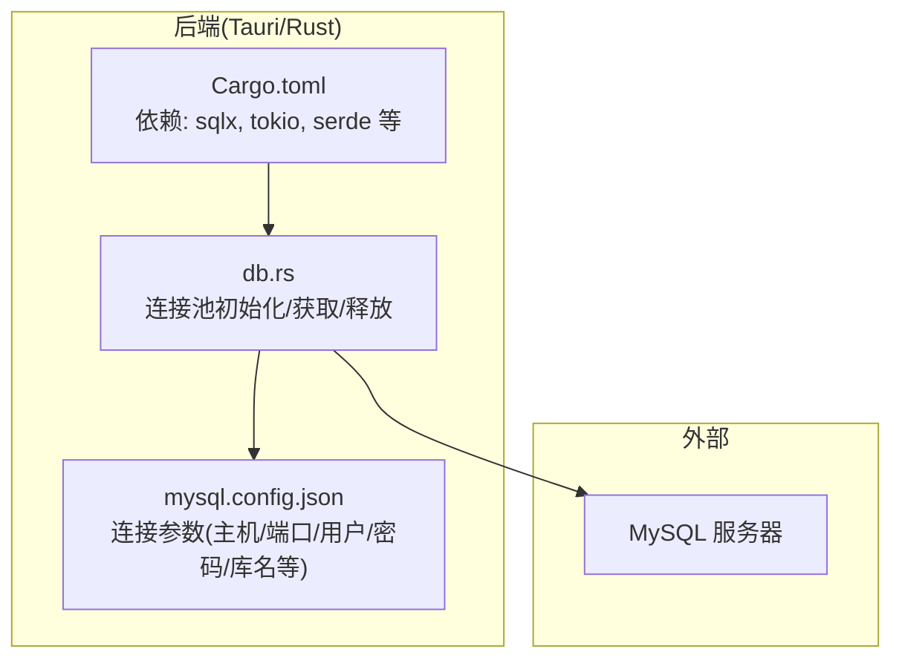
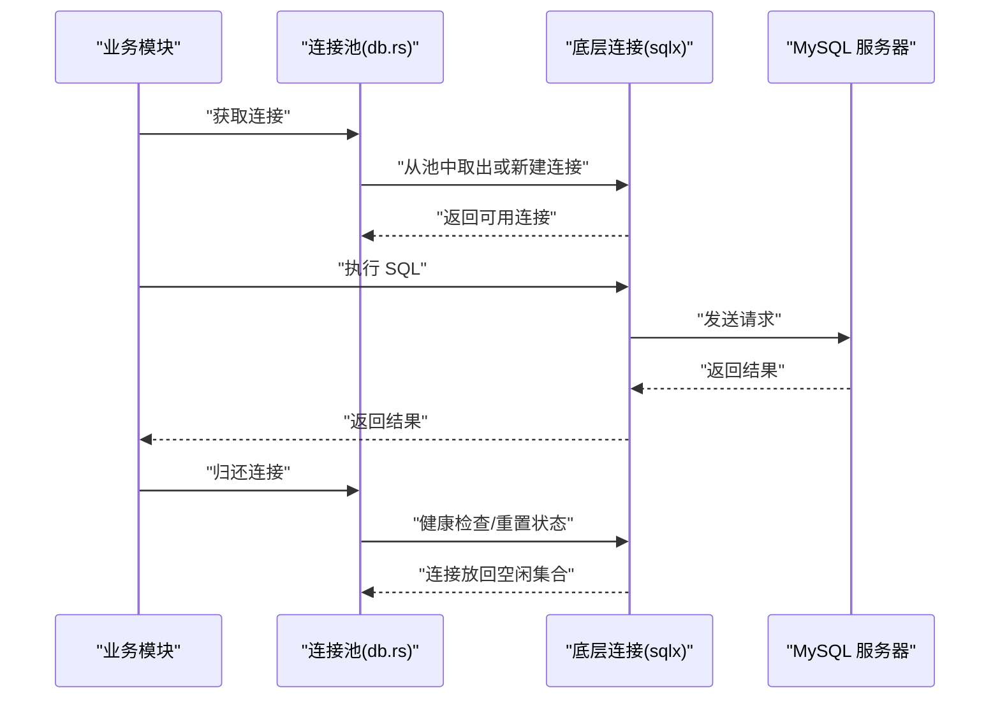
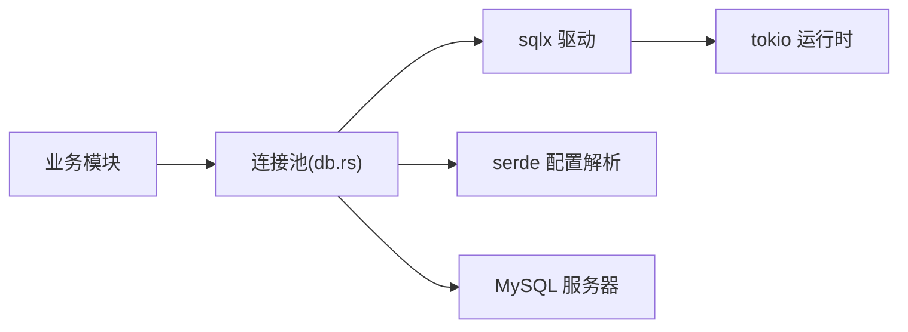

# 连接池管理

<cite>
**本文引用的文件**   
- [src-tauri/src/db.rs](file://src-tauri/src/db.rs)
- [src-tauri/Cargo.toml](file://src-tauri/Cargo.toml)
- [src-tauri/mysql.config.json](file://src-tauri/mysql.config.json)
</cite>

## 目录
1. [简介](#简介)
2. [项目结构](#项目结构)
3. [核心组件](#核心组件)
4. [架构总览](#架构总览)
5. [详细组件分析](#详细组件分析)
6. [依赖分析](#依赖分析)
7. [性能考虑](#性能考虑)
8. [故障排查指南](#故障排查指南)
9. [结论](#结论)
10. [附录](#附录)

## 简介
本技术文档聚焦 FishWorker 后端（Rust/Tauri）中的数据库连接池管理，围绕异步连接池的实现原理、配置参数、生命周期管理（健康检查、自动重连、泄漏检测）、监控与调优展开。文档同时提供基于仓库现有代码的“代码片段路径”指引，帮助读者快速定位实现细节并进行正确配置与使用。

## 项目结构
FishWorker 的后端位于 src-tauri 目录，其中数据库相关逻辑集中在 db.rs；依赖声明在 Cargo.toml；MySQL 连接配置在 mysql.config.json。

图表来源
- [src-tauri/src/db.rs](file://src-tauri/src/db.rs)
- [src-tauri/mysql.config.json](file://src-tauri/mysql.config.json)
- [src-tauri/Cargo.toml](file://src-tauri/Cargo.toml)

章节来源
- [src-tauri/src/db.rs](file://src-tauri/src/db.rs)
- [src-tauri/Cargo.toml](file://src-tauri/Cargo.toml)
- [src-tauri/mysql.config.json](file://src-tauri/mysql.config.json)

## 核心组件
- 连接池实例：负责创建、持有并复用底层异步连接，对外暴露获取连接的接口。
- 配置加载：从配置文件读取 MySQL 连接参数，构建连接字符串或连接选项。
- 生命周期钩子：在连接建立、归还、关闭时执行必要的校验与清理。
- 监控指标：统计活跃连接数、空闲连接数、等待队列长度、错误计数等。

章节来源
- [src-tauri/src/db.rs](file://src-tauri/src/db.rs)
- [src-tauri/mysql.config.json](file://src-tauri/mysql.config.json)

## 架构总览
下图展示了应用层通过连接池获取连接、执行查询、归还连接的整体流程，以及连接池与 MySQL 服务器的交互关系。

图表来源
- [src-tauri/src/db.rs](file://src-tauri/src/db.rs)
- [src-tauri/Cargo.toml](file://src-tauri/Cargo.toml)

## 详细组件分析

### 连接池初始化与配置
- 配置来源：从 mysql.config.json 中读取连接参数（如主机、端口、用户名、密码、数据库名、SSL 等）。
- 连接池构建：根据配置项设置最大连接数、最小空闲连接、连接超时、连接存活时间、空闲超时等。
- 启动预热：可选地在进程启动阶段预创建若干连接，降低冷启动延迟。

章节来源
- [src-tauri/src/db.rs](file://src-tauri/src/db.rs)
- [src-tauri/mysql.config.json](file://src-tauri/mysql.config.json)

### 连接获取与复用
- 获取策略：优先从空闲集合取连接；若无可用连接且未达到最大连接数则新建；否则进入等待队列。
- 复用机制：连接归还前进行健康检查（如 ping），失败则丢弃并尝试重建。
- 并发安全：使用内部同步原语保证并发访问下的线程/任务安全。

章节来源
- [src-tauri/src/db.rs](file://src-tauri/src/db.rs)

### 连接释放与健康检查
- 释放时机：RAII 守卫或显式归还调用触发释放。
- 健康检查：定期或按需对空闲连接执行轻量探测（例如 SELECT 1 或 ping），失败则剔除。
- 资源回收：当空闲连接超过阈值或达到空闲超时，主动关闭以释放系统资源。

章节来源
- [src-tauri/src/db.rs](file://src-tauri/src/db.rs)

### 自动重连与容错
- 瞬时故障处理：网络抖动或临时不可用时，自动重试或重建连接。
- 退避策略：指数退避或固定间隔重试，避免雪崩。
- 熔断降级：连续失败达到阈值后短暂拒绝新请求，等待恢复。

章节来源
- [src-tauri/src/db.rs](file://src-tauri/src/db.rs)

### 连接泄漏检测
- 跟踪机制：记录连接借出时间与调用栈信息（可选），超期未归还视为潜在泄漏。
- 告警与自愈：发现泄漏时记录日志并强制回收，必要时重启连接池。
- 审计报表：输出泄漏报告，辅助定位问题代码位置。

章节来源
- [src-tauri/src/db.rs](file://src-tauri/src/db.rs)

### 监控与可观测性
- 指标采集：活跃连接数、空闲连接数、等待队列长度、建连耗时、错误率、重连次数等。
- 导出方式：通过日志或内置 HTTP 端点暴露指标，便于接入监控系统。
- 基线与阈值：为关键指标设定合理阈值，异常时触发告警。

章节来源
- [src-tauri/src/db.rs](file://src-tauri/src/db.rs)

### 使用示例（代码片段路径）
以下路径展示如何正确配置和使用连接池（不直接粘贴代码内容）：
- 初始化连接池与全局注入：[src-tauri/src/db.rs](file://src-tauri/src/db.rs)
- 从连接池获取连接并执行查询：[src-tauri/src/db.rs](file://src-tauri/src/db.rs)
- 在 Tauri 命令中安全使用连接池：[src-tauri/src/lib.rs](file://src-tauri/src/lib.rs)

章节来源
- [src-tauri/src/db.rs](file://src-tauri/src/db.rs)
- [src-tauri/src/lib.rs](file://src-tauri/src/lib.rs)

## 依赖分析
- 运行时与异步：tokio 提供异步运行时，驱动 I/O 与协程调度。
- 数据库驱动：sqlx 提供编译期 SQL 校验与异步连接池能力。
- 序列化：serde 用于解析配置文件与结构化日志。
- 配置加载：按仓库约定从 mysql.config.json 读取连接参数。

图表来源
- [src-tauri/Cargo.toml](file://src-tauri/Cargo.toml)
- [src-tauri/src/db.rs](file://src-tauri/src/db.rs)

章节来源
- [src-tauri/Cargo.toml](file://src-tauri/Cargo.toml)
- [src-tauri/src/db.rs](file://src-tauri/src/db.rs)

## 性能考虑
- 连接池大小：根据 CPU 核数与 IO 密集型特征调整最大连接数，避免过多上下文切换与锁竞争。
- 最小空闲连接：在高并发场景适当提高最小空闲连接，减少冷启动与突发流量时的建连开销。
- 超时与重试：合理设置连接超时、查询超时与重试退避，平衡吞吐与稳定性。
- 长事务与泄漏：避免长时间持有连接，及时归还；启用泄漏检测与告警。
- 监控与压测：结合压测数据校准参数，持续观察关键指标变化。

## 故障排查指南
- 连接失败：检查 mysql.config.json 中的主机、端口、用户名、密码、数据库名是否正确；确认防火墙与安全组规则。
- 频繁重连：关注错误日志与指标，排查网络抖动、服务端限流或认证失败。
- 连接泄漏：启用泄漏检测，定位长时间未归还的连接及其调用栈，修复业务逻辑。
- 性能瓶颈：对比不同池大小与超时参数的压测结果，选择最优配置。

章节来源
- [src-tauri/src/db.rs](file://src-tauri/src/db.rs)
- [src-tauri/mysql.config.json](file://src-tauri/mysql.config.json)

## 结论
通过合理的连接池设计与参数调优，FishWorker 能够在高并发场景下稳定高效地访问 MySQL。建议在生产环境开启健康检查、自动重连与泄漏检测，并结合监控指标持续优化。

## 附录

### 配置参数参考（来自 mysql.config.json）
- 主机地址、端口、用户名、密码、数据库名、SSL 开关、字符集等。
- 注意：具体键名以实际配置文件为准。

章节来源
- [src-tauri/mysql.config.json](file://src-tauri/mysql.config.json)

### 依赖版本参考（来自 Cargo.toml）
- sqlx、tokio、serde 等依赖的版本号与特性开关。
- 注意：请以当前仓库锁定版本为准。

章节来源
- [src-tauri/Cargo.toml](file://src-tauri/Cargo.toml)