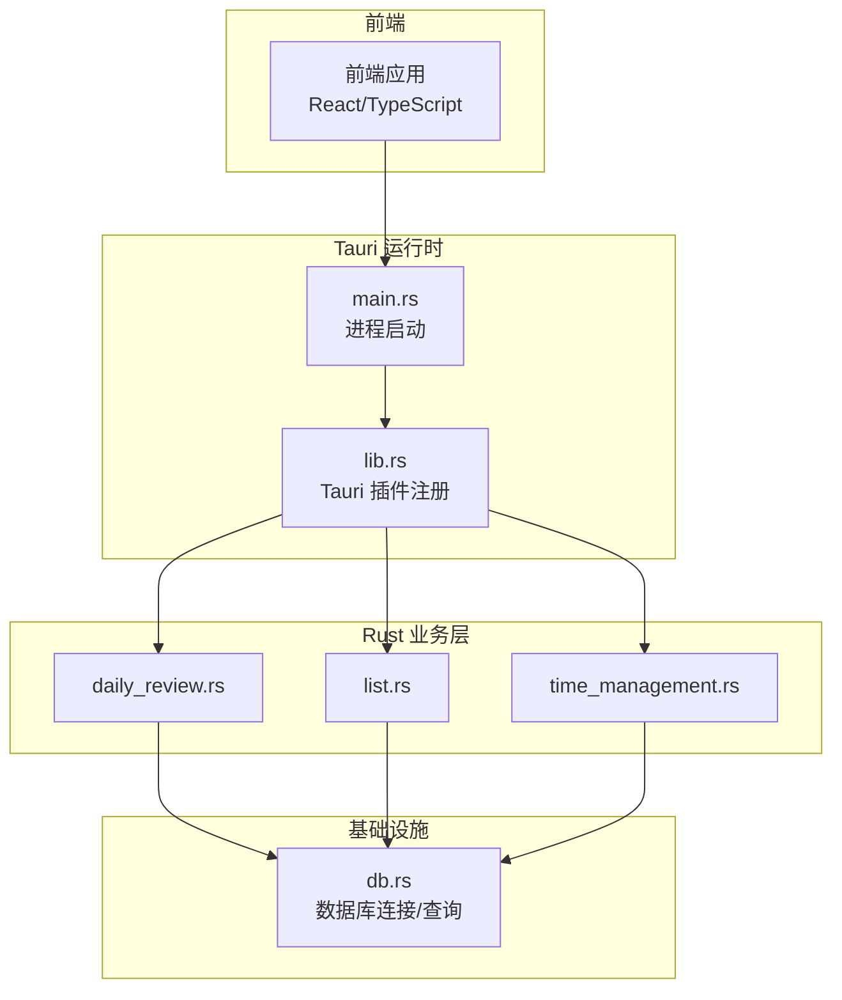
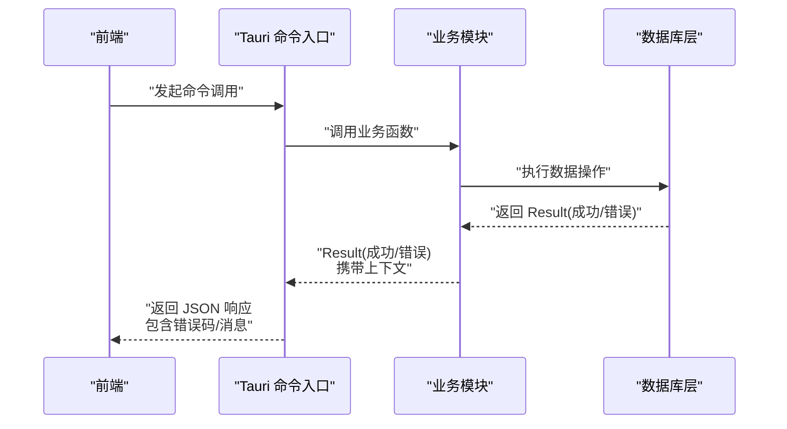
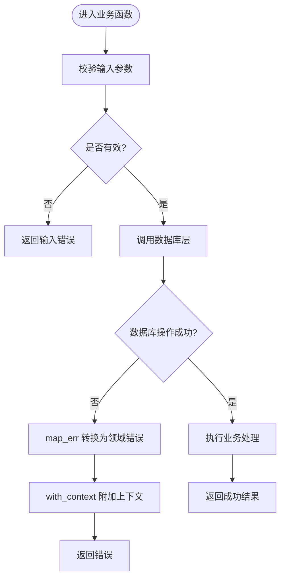
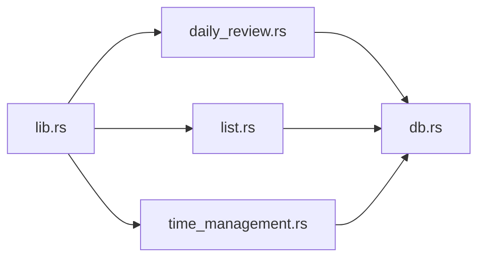

# 异步错误处理

<cite>
**本文引用的文件**   
- [src-tauri/src/lib.rs](file://src-tauri/src/lib.rs)
- [src-tauri/src/main.rs](file://src-tauri/src/main.rs)
- [src-tauri/src/db.rs](file://src-tauri/src/db.rs)
- [src-tauri/src/daily_review.rs](file://src-tauri/src/daily_review.rs)
- [src-tauri/src/list.rs](file://src-tauri/src/list.rs)
- [src-tauri/src/time_management.rs](file://src-tauri/src/time_management.rs)
- [src-tauri/Cargo.toml](file://src-tauri/Cargo.toml)
</cite>

## 目录
1. [简介](#简介)
2. [项目结构](#项目结构)
3. [核心组件](#核心组件)
4. [架构总览](#架构总览)
5. [详细组件分析](#详细组件分析)
6. [依赖分析](#依赖分析)
7. [性能考虑](#性能考虑)
8. [故障排查指南](#故障排查指南)
9. [结论](#结论)
10. [附录](#附录)

## 简介
本技术文档聚焦 FishWorker（Tauri + Rust）在异步环境中的错误处理体系，围绕以下主题展开：
- Rust Result 类型在异步任务中的使用模式与传播机制
- 链式错误处理与上下文信息收集
- 自定义错误类型的定义与设计原则
- 错误日志记录策略、监控与告警接入点
- panic 恢复机制、异常安全保证与资源清理策略
- 异步任务取消语义与超时处理
- 错误分类体系、用户友好消息生成
- 实际错误处理代码示例与调试技巧

## 项目结构
FishWorker 采用 Tauri 架构：前端 TypeScript/React 通过 Tauri 命令调用后端 Rust 能力。Rust 侧以模块化组织业务逻辑（每日回顾、清单、时间管理），并通过数据库模块访问持久化层。错误处理贯穿命令入口、业务层与数据访问层。

图表来源
- [src-tauri/src/main.rs](file://src-tauri/src/main.rs)
- [src-tauri/src/lib.rs](file://src-tauri/src/lib.rs)
- [src-tauri/src/daily_review.rs](file://src-tauri/src/daily_review.rs)
- [src-tauri/src/list.rs](file://src-tauri/src/list.rs)
- [src-tauri/src/time_management.rs](file://src-tauri/src/time_management.rs)
- [src-tauri/src/db.rs](file://src-tauri/src/db.rs)

章节来源
- [src-tauri/src/main.rs](file://src-tauri/src/main.rs)
- [src-tauri/src/lib.rs](file://src-tauri/src/lib.rs)

## 核心组件
- Tauri 命令入口：负责接收前端请求、调用业务函数、将结果转换为 Tauri 可返回的类型。错误通常以 Result 形式向上抛出，由上层统一处理或转为用户可见的错误对象。
- 业务模块：每日回顾、清单、时间管理等，封装领域逻辑，内部使用 Result 表达失败路径，并携带上下文信息。
- 数据访问层：数据库连接与查询，返回底层错误（如网络、SQL 错误），并在必要时包装为领域错误。

章节来源
- [src-tauri/src/lib.rs](file://src-tauri/src/lib.rs)
- [src-tauri/src/daily_review.rs](file://src-tauri/src/daily_review.rs)
- [src-tauri/src/list.rs](file://src-tauri/src/list.rs)
- [src-tauri/src/time_management.rs](file://src-tauri/src/time_management.rs)
- [src-tauri/src/db.rs](file://src-tauri/src/db.rs)

## 架构总览
下图展示一次典型的前端到后端的异步调用流程，以及错误在各层的传播路径。

图表来源
- [src-tauri/src/lib.rs](file://src-tauri/src/lib.rs)
- [src-tauri/src/daily_review.rs](file://src-tauri/src/daily_review.rs)
- [src-tauri/src/list.rs](file://src-tauri/src/list.rs)
- [src-tauri/src/time_management.rs](file://src-tauri/src/time_management.rs)
- [src-tauri/src/db.rs](file://src-tauri/src/db.rs)

## 详细组件分析

### 错误类型设计与分类体系
- 设计原则
  - 明确区分“可恢复错误”和“不可恢复错误”。可恢复错误通过 Result 传递；不可恢复错误使用 panic，并配合恢复机制进行兜底。
  - 错误类型应包含稳定、机器可读的“错误码”，以及面向用户的“错误消息”。
  - 对关键路径错误附加上下文（如请求 ID、操作名、参数摘要、时间戳），便于追踪。
- 分类建议
  - 输入校验错误：参数缺失、格式非法等
  - 业务规则错误：状态不合法、权限不足等
  - 外部依赖错误：数据库、网络、第三方 API 失败
  - 系统级错误：资源耗尽、配置错误、未实现功能
- 用户友好消息
  - 面向用户仅展示简洁、可操作的提示；详细诊断信息写入日志，避免泄露敏感数据。

章节来源
- [src-tauri/src/daily_review.rs](file://src-tauri/src/daily_review.rs)
- [src-tauri/src/list.rs](file://src-tauri/src/list.rs)
- [src-tauri/src/time_management.rs](file://src-tauri/src/time_management.rs)
- [src-tauri/src/db.rs](file://src-tauri/src/db.rs)

### Result 在异步环境中的使用模式
- 常见模式
  - 同步阻塞 I/O：直接返回 Result，上层用 ? 传播。
  - 异步 I/O：返回 Future<Result>，在 await 处检查错误并传播。
  - 并发场景：使用 JoinHandle 聚合多个任务的错误，选择首个错误或汇总错误。
- 传播机制
  - 使用 ? 运算符快速短路返回错误。
  - 使用 map_err 转换错误类型，保持调用方期望的错误形态。
  - 使用 context 或 with_context 添加上下文信息，形成链式错误。
- 超时与取消
  - 使用 tokio::time::timeout 包裹异步操作，超时返回特定错误。
  - 使用 CancellationToken 或任务取消通道，确保取消时释放资源。

章节来源
- [src-tauri/src/daily_review.rs](file://src-tauri/src/daily_review.rs)
- [src-tauri/src/list.rs](file://src-tauri/src/list.rs)
- [src-tauri/src/time_management.rs](file://src-tauri/src/time_management.rs)
- [src-tauri/src/db.rs](file://src-tauri/src/db.rs)

### 自定义错误类型与链式错误处理
- 自定义错误类型
  - 定义统一的错误枚举，覆盖输入、业务、外部依赖、系统四类错误。
  - 每个变体包含错误码、可选详情、关联上下文字段。
- 链式错误处理
  - 在数据访问层捕获底层错误，map_err 转换为领域错误。
  - 在业务层使用 with_context 追加操作名、请求 ID、参数摘要等。
  - 在命令入口层将领域错误映射为 Tauri 响应结构，包含错误码和用户消息。

图表来源
- [src-tauri/src/daily_review.rs](file://src-tauri/src/daily_review.rs)
- [src-tauri/src/db.rs](file://src-tauri/src/db.rs)

章节来源
- [src-tauri/src/daily_review.rs](file://src-tauri/src/daily_review.rs)
- [src-tauri/src/db.rs](file://src-tauri/src/db.rs)

### 错误日志记录策略
- 分层记录
  - 数据访问层：记录原始错误（如 SQL 错误码、网络状态）、耗时、重试次数。
  - 业务层：记录操作名、请求 ID、关键参数摘要、上下文链路。
  - 命令入口层：记录最终响应状态、错误码、用户消息。
- 日志级别
  - 警告：可恢复的外部依赖失败、降级处理。
  - 错误：业务失败、数据不一致。
  - 致命：panic 触发、资源泄漏风险。
- 隐私与安全
  - 避免记录敏感信息（密码、令牌、个人身份信息）。
  - 对日志进行脱敏与采样，控制存储成本。

章节来源
- [src-tauri/src/db.rs](file://src-tauri/src/db.rs)
- [src-tauri/src/daily_review.rs](file://src-tauri/src/daily_review.rs)
- [src-tauri/src/list.rs](file://src-tauri/src/list.rs)
- [src-tauri/src/time_management.rs](file://src-tauri/src/time_management.rs)

### panic 恢复机制与异常安全保证
- 恢复策略
  - 在长时间运行的任务或关键回调中使用 catch_unwind 进行恢复，避免整个进程崩溃。
  - 恢复后记录堆栈与上下文，发送告警，并尝试优雅降级。
- 资源清理
  - 使用 RAII 与 Drop 确保句柄、连接、临时文件在异常路径也能释放。
  - 在异步任务中，确保取消信号能中断 I/O 并关闭资源。
- 异常安全保证
  - 强保证：发生异常时系统状态不变（事务回滚、原子更新）。
  - 弱保证：允许部分副作用，但需有补偿或幂等性。
  - 无抛掷保证：关键路径避免 panic，使用 Result 表达失败。

章节来源
- [src-tauri/src/daily_review.rs](file://src-tauri/src/daily_review.rs)
- [src-tauri/src/list.rs](file://src-tauri/src/list.rs)
- [src-tauri/src/time_management.rs](file://src-tauri/src/time_management.rs)

### 异步任务中的错误处理模式、取消语义与超时处理
- 模式
  - 单个任务：await 后检查 Result，必要时 map_err 与 with_context。
  - 多任务并行：使用 JoinSet 或 join_all，收集错误并决定重试或失败。
  - 流式处理：在迭代器上处理错误，遇到错误可选择跳过、重试或终止。
- 取消语义
  - 使用 CancellationToken 或 tokio::select! 监听取消信号。
  - 在取消路径中关闭连接、释放锁、清理临时状态。
- 超时处理
  - 使用 timeout 包裹 I/O 操作，超时返回特定错误并记录告警。
  - 对长任务设置分段超时，避免长时间占用资源。

章节来源
- [src-tauri/src/daily_review.rs](file://src-tauri/src/daily_review.rs)
- [src-tauri/src/list.rs](file://src-tauri/src/list.rs)
- [src-tauri/src/time_management.rs](file://src-tauri/src/time_management.rs)

### 错误监控与告警机制
- 指标采集
  - 统计错误率、P95/P99 延迟、重试次数、超时比例。
- 告警规则
  - 错误率突增、外部依赖持续失败、数据库连接池耗尽。
- 上报渠道
  - 结构化日志输出到集中式日志平台。
  - 关键错误发送到告警系统（邮件、IM、短信）。

章节来源
- [src-tauri/src/db.rs](file://src-tauri/src/db.rs)
- [src-tauri/src/daily_review.rs](file://src-tauri/src/daily_review.rs)

### 用户友好错误消息生成
- 规则
  - 面向用户：简短、可操作、不含敏感信息。
  - 面向开发者：包含错误码、请求 ID、上下文链路、堆栈片段。
- 实现要点
  - 在命令入口层统一格式化响应结构。
  - 提供错误码字典，便于前端国际化与提示模板。

章节来源
- [src-tauri/src/lib.rs](file://src-tauri/src/lib.rs)
- [src-tauri/src/daily_review.rs](file://src-tauri/src/daily_review.rs)

### 实际错误处理代码示例与调试技巧
- 示例定位
  - 数据访问层错误转换与上下文附加：[db.rs](file://src-tauri/src/db.rs)
  - 业务层错误传播与用户消息映射：[daily_review.rs](file://src-tauri/src/daily_review.rs)、[list.rs](file://src-tauri/src/list.rs)、[time_management.rs](file://src-tauri/src/time_management.rs)
  - Tauri 命令入口错误响应构造：[lib.rs](file://src-tauri/src/lib.rs)
- 调试技巧
  - 启用详细日志，记录请求 ID 与上下文链路。
  - 使用 tracing 或 slog 结构化日志，便于检索与分析。
  - 针对外部依赖增加重试与退避策略，观察错误收敛情况。
  - 使用断点与条件日志，缩小问题范围。

章节来源
- [src-tauri/src/db.rs](file://src-tauri/src/db.rs)
- [src-tauri/src/daily_review.rs](file://src-tauri/src/daily_review.rs)
- [src-tauri/src/list.rs](file://src-tauri/src/list.rs)
- [src-tauri/src/time_management.rs](file://src-tauri/src/time_management.rs)
- [src-tauri/src/lib.rs](file://src-tauri/src/lib.rs)

## 依赖分析
Rust 侧依赖关系集中在业务模块与数据库层之间，Tauri 命令作为入口协调调用。

图表来源
- [src-tauri/src/lib.rs](file://src-tauri/src/lib.rs)
- [src-tauri/src/daily_review.rs](file://src-tauri/src/daily_review.rs)
- [src-tauri/src/list.rs](file://src-tauri/src/list.rs)
- [src-tauri/src/time_management.rs](file://src-tauri/src/time_management.rs)
- [src-tauri/src/db.rs](file://src-tauri/src/db.rs)

章节来源
- [src-tauri/src/lib.rs](file://src-tauri/src/lib.rs)
- [src-tauri/src/daily_review.rs](file://src-tauri/src/daily_review.rs)
- [src-tauri/src/list.rs](file://src-tauri/src/list.rs)
- [src-tauri/src/time_management.rs](file://src-tauri/src/time_management.rs)
- [src-tauri/src/db.rs](file://src-tauri/src/db.rs)

## 性能考虑
- 错误路径开销
  - 避免在热路径频繁创建复杂错误对象，尽量复用上下文。
  - 使用轻量级错误码与短消息，减少序列化与日志体积。
- 超时与重试
  - 合理设置超时阈值，避免长时间阻塞。
  - 对瞬时失败实施指数退避重试，降低雪崩风险。
- 并发与资源
  - 限制并发度，防止资源耗尽导致更多错误。
  - 及时释放连接与锁，避免死锁与泄漏。

## 故障排查指南
- 常见问题
  - 数据库连接失败：检查连接配置、网络可达性与认证信息。
  - 超时错误：评估下游服务 SLA，调整超时与重试策略。
  - 业务规则错误：核对输入参数与状态机转换。
- 定位步骤
  - 根据错误码与请求 ID 检索日志，定位调用链。
  - 查看上下文附加信息，确认失败阶段与参数。
  - 复现最小用例，逐步隔离问题。
- 恢复措施
  - 自动重试与熔断。
  - 降级到只读或缓存数据。
  - 通知运维介入，必要时重启服务。

章节来源
- [src-tauri/src/db.rs](file://src-tauri/src/db.rs)
- [src-tauri/src/daily_review.rs](file://src-tauri/src/daily_review.rs)
- [src-tauri/src/list.rs](file://src-tauri/src/list.rs)
- [src-tauri/src/time_management.rs](file://src-tauri/src/time_management.rs)

## 结论
FishWorker 的异步错误处理以 Result 为核心，结合链式上下文与分层日志，构建了从数据访问到命令入口的完整错误传播体系。通过自定义错误类型、分类与用户友好消息，既提升了可观测性，也改善了用户体验。配合 panic 恢复、资源清理、取消与超时策略，系统在稳定性与健壮性方面具备良好保障。

## 附录
- 相关配置文件
  - Cargo 依赖与特性开关：[Cargo.toml](file://src-tauri/Cargo.toml)
- 参考实践
  - 在业务函数中统一使用 Result 表达失败，并在命令入口层映射为 Tauri 响应结构。
  - 对外部依赖错误进行分类与重试策略，避免错误扩散。

章节来源
- [src-tauri/Cargo.toml](file://src-tauri/Cargo.toml)