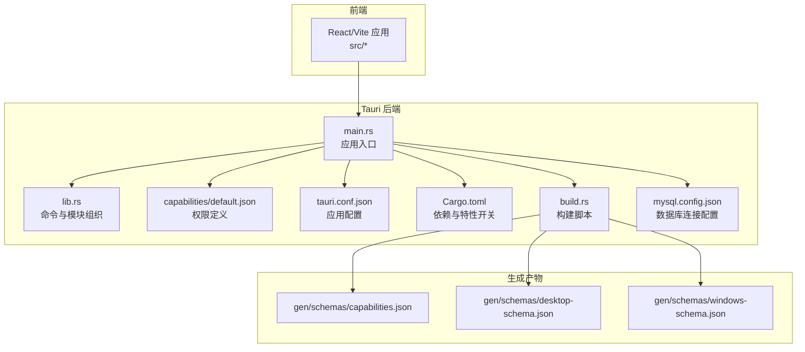
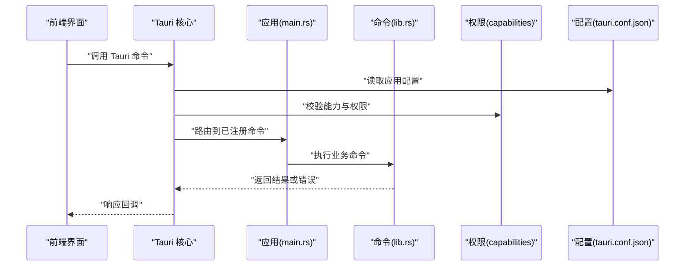
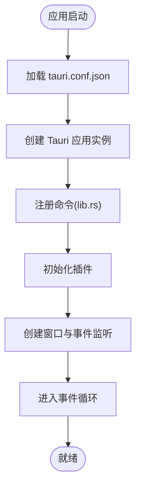
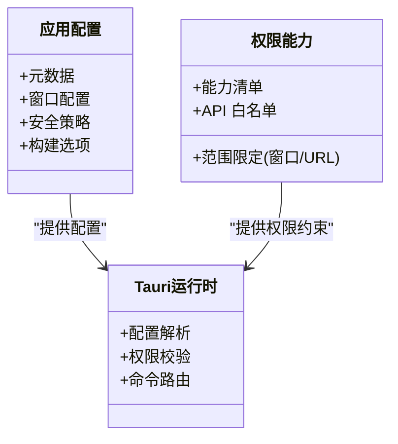
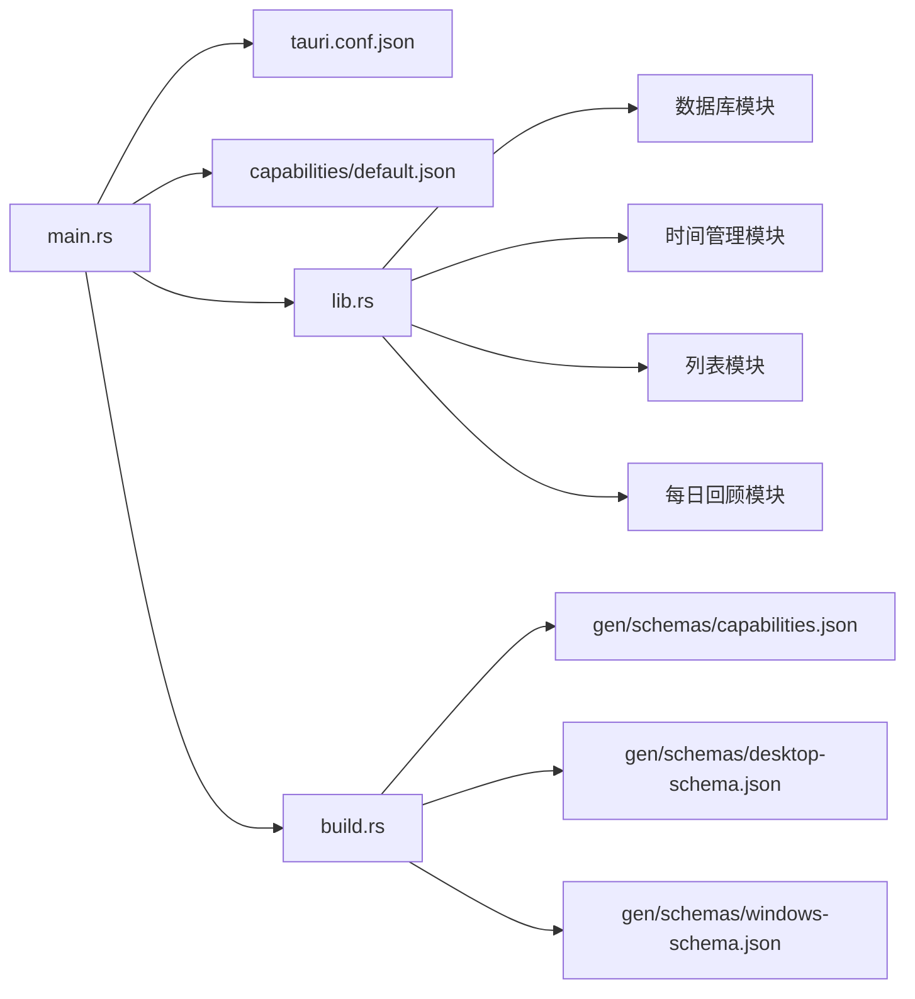
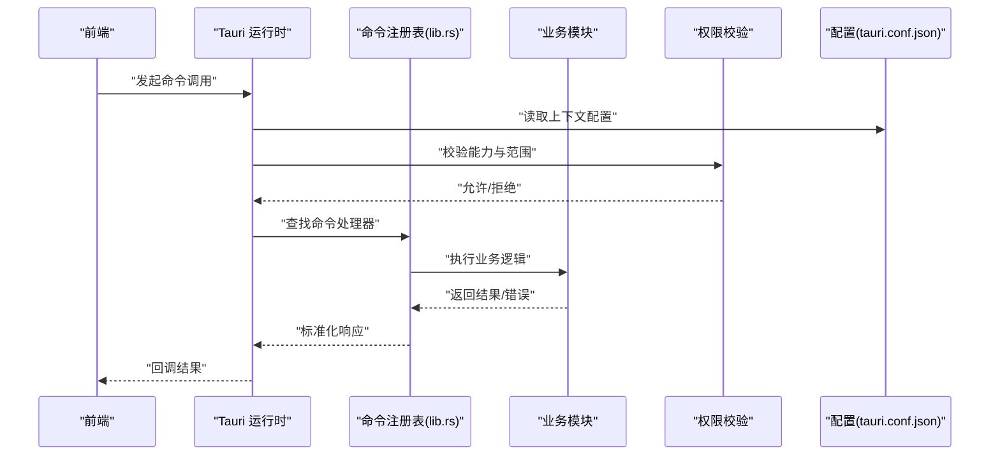

# Tauri 框架架构

<cite>
**本文引用的文件**   
- [src-tauri/src/main.rs](file://src-tauri/src/main.rs)
- [src-tauri/src/lib.rs](file://src-tauri/src/lib.rs)
- [src-tauri/tauri.conf.json](file://src-tauri/tauri.conf.json)
- [src-tauri/capabilities/default.json](file://src-tauri/capabilities/default.json)
- [src-tauri/Cargo.toml](file://src-tauri/Cargo.toml)
- [src-tauri/build.rs](file://src-tauri/build.rs)
- [src-tauri/mysql.config.json](file://src-tauri/mysql.config.json)
- [src-tauri/gen/schemas/capabilities.json](file://src-tauri/gen/schemas/capabilities.json)
- [src-tauri/gen/schemas/desktop-schema.json](file://src-tauri/gen/schemas/desktop-schema.json)
- [src-tauri/gen/schemas/windows-schema.json](file://src-tauri/gen/schemas/windows-schema.json)
</cite>

## 目录
1. [简介](#简介)
2. [项目结构](#项目结构)
3. [核心组件](#核心组件)
4. [架构总览](#架构总览)
5. [详细组件分析](#详细组件分析)
6. [依赖关系分析](#依赖关系分析)
7. [性能考虑](#性能考虑)
8. [故障排查指南](#故障排查指南)
9. [结论](#结论)
10. [附录](#附录)

## 简介
本文件为 FishWorker 基于 Tauri 的桌面应用提供系统化的架构文档。重点覆盖：
- main.rs 应用入口初始化流程（Tauri 配置、窗口管理、事件监听）
- lib.rs 模块组织与命令注册机制、插件化扩展点
- tauri.conf.json 配置项说明（元数据、窗口、安全策略、构建选项）
- capabilities 权限控制模型与资源访问限制
- Tauri 生命周期、错误处理与日志体系
- Tauri 命令调用流程图与模块依赖关系图

## 项目结构
FishWorker 采用前后端分离的 Tauri 工程布局：
- 前端代码位于 src，使用 React/Vite 构建
- 后端 Rust 代码位于 src-tauri/src，通过 Tauri 暴露给前端
- 配置文件集中于 src-tauri/tauri.conf.json，能力与权限在 src-tauri/capabilities 下声明
- 生成式 Schema 位于 src-tauri/gen/schemas，用于类型校验与 IDE 提示

图表来源
- [src-tauri/src/main.rs](file://src-tauri/src/main.rs)
- [src-tauri/src/lib.rs](file://src-tauri/src/lib.rs)
- [src-tauri/tauri.conf.json](file://src-tauri/tauri.conf.json)
- [src-tauri/capabilities/default.json](file://src-tauri/capabilities/default.json)
- [src-tauri/Cargo.toml](file://src-tauri/Cargo.toml)
- [src-tauri/build.rs](file://src-tauri/build.rs)
- [src-tauri/mysql.config.json](file://src-tauri/mysql.config.json)
- [src-tauri/gen/schemas/capabilities.json](file://src-tauri/gen/schemas/capabilities.json)
- [src-tauri/gen/schemas/desktop-schema.json](file://src-tauri/gen/schemas/desktop-schema.json)
- [src-tauri/gen/schemas/windows-schema.json](file://src-tauri/gen/schemas/windows-schema.json)

章节来源
- [src-tauri/src/main.rs](file://src-tauri/src/main.rs)
- [src-tauri/src/lib.rs](file://src-tauri/src/lib.rs)
- [src-tauri/tauri.conf.json](file://src-tauri/tauri.conf.json)
- [src-tauri/capabilities/default.json](file://src-tauri/capabilities/default.json)
- [src-tauri/Cargo.toml](file://src-tauri/Cargo.toml)
- [src-tauri/build.rs](file://src-tauri/build.rs)
- [src-tauri/mysql.config.json](file://src-tauri/mysql.config.json)
- [src-tauri/gen/schemas/capabilities.json](file://src-tauri/gen/schemas/capabilities.json)
- [src-tauri/gen/schemas/desktop-schema.json](file://src-tauri/gen/schemas/desktop-schema.json)
- [src-tauri/gen/schemas/windows-schema.json](file://src-tauri/gen/schemas/windows-schema.json)

## 核心组件
- 应用入口 main.rs
  - 负责加载 Tauri 配置、创建应用实例、注册命令、挂载插件、启动窗口与事件循环
- 模块组织与命令注册 lib.rs
  - 集中导出业务命令、服务与工具函数；通过 Tauri 的命令注册接口将 Rust 函数暴露给前端
- 配置与权限
  - tauri.conf.json 描述应用元数据、窗口行为、安全策略与构建选项
  - capabilities/default.json 声明前端页面可使用的能力与资源范围
- 构建与生成
  - build.rs 驱动 schema 生成，确保能力与窗口配置的类型一致性
  - Cargo.toml 声明 Tauri 及平台相关依赖

章节来源
- [src-tauri/src/main.rs](file://src-tauri/src/main.rs)
- [src-tauri/src/lib.rs](file://src-tauri/src/lib.rs)
- [src-tauri/tauri.conf.json](file://src-tauri/tauri.conf.json)
- [src-tauri/capabilities/default.json](file://src-tauri/capabilities/default.json)
- [src-tauri/build.rs](file://src-tauri/build.rs)
- [src-tauri/Cargo.toml](file://src-tauri/Cargo.toml)

## 架构总览
下图展示了从前端到后端的典型请求路径，以及配置与权限在运行时的作用位置。

图表来源
- [src-tauri/src/main.rs](file://src-tauri/src/main.rs)
- [src-tauri/src/lib.rs](file://src-tauri/src/lib.rs)
- [src-tauri/tauri.conf.json](file://src-tauri/tauri.conf.json)
- [src-tauri/capabilities/default.json](file://src-tauri/capabilities/default.json)

## 详细组件分析

### 应用入口 main.rs 初始化流程
- 配置加载与应用实例创建
  - 从 tauri.conf.json 解析应用元数据、窗口与安全策略
  - 创建 Tauri 应用实例并注入全局状态（如数据库连接、配置对象等）
- 窗口管理与生命周期
  - 根据配置创建主窗口，必要时创建辅助窗口
  - 绑定窗口事件（打开、关闭、最小化、聚焦等），实现应用级逻辑
- 事件监听器设置
  - 注册全局事件总线，支持跨窗口通信与后台任务通知
- 插件系统与扩展点
  - 通过插件 API 集成第三方能力（如托盘、自动更新、系统通知等）
- 启动与事件循环
  - 完成所有注册后进入事件循环，等待用户交互与系统事件

章节来源
- [src-tauri/src/main.rs](file://src-tauri/src/main.rs)
- [src-tauri/tauri.conf.json](file://src-tauri/tauri.conf.json)

### 模块组织与命令注册 lib.rs
- 模块划分
  - 按功能域拆分模块（如列表、时间管理、每日回顾、数据库等），保持高内聚低耦合
- 命令注册机制
  - 将 Rust 函数标记为 Tauri 命令，统一在 lib.rs 中注册，便于前端通过命名空间调用
- 插件化架构
  - 将通用能力封装为独立模块，按需启用；通过配置与能力清单控制可用范围
- 错误处理与日志
  - 统一错误类型与转换，结合 Tauri 的错误传播机制返回前端
  - 接入日志系统，记录关键操作与异常堆栈

图表来源
- [src-tauri/src/main.rs](file://src-tauri/src/main.rs)
- [src-tauri/src/lib.rs](file://src-tauri/src/lib.rs)

章节来源
- [src-tauri/src/lib.rs](file://src-tauri/src/lib.rs)

### 配置与权限：tauri.conf.json 与 capabilities
- tauri.conf.json 关键维度
  - 应用元数据：名称、版本、描述、图标等
  - 窗口配置：尺寸、位置、是否可调整大小、透明、全屏等
  - 安全策略：CSP、白名单、协议拦截、文件系统访问范围
  - 构建选项：目标平台、打包方式、资源嵌入、调试开关
- capabilities/default.json 权限模型
  - 以“能力”为单位声明前端页面可用的系统资源与 API
  - 支持按窗口或 URL 模式限定能力范围，实现最小权限原则
  - 与 Tauri 运行时校验联动，未授权访问将被拒绝

图表来源
- [src-tauri/tauri.conf.json](file://src-tauri/tauri.conf.json)
- [src-tauri/capabilities/default.json](file://src-tauri/capabilities/default.json)
- [src-tauri/gen/schemas/capabilities.json](file://src-tauri/gen/schemas/capabilities.json)
- [src-tauri/gen/schemas/desktop-schema.json](file://src-tauri/gen/schemas/desktop-schema.json)
- [src-tauri/gen/schemas/windows-schema.json](file://src-tauri/gen/schemas/windows-schema.json)

章节来源
- [src-tauri/tauri.conf.json](file://src-tauri/tauri.conf.json)
- [src-tauri/capabilities/default.json](file://src-tauri/capabilities/default.json)
- [src-tauri/gen/schemas/capabilities.json](file://src-tauri/gen/schemas/capabilities.json)
- [src-tauri/gen/schemas/desktop-schema.json](file://src-tauri/gen/schemas/desktop-schema.json)
- [src-tauri/gen/schemas/windows-schema.json](file://src-tauri/gen/schemas/windows-schema.json)

### 构建与生成：build.rs 与 Cargo.toml
- build.rs
  - 在构建阶段生成能力与窗口配置的 JSON Schema，提升类型安全与开发体验
- Cargo.toml
  - 声明 Tauri 及其平台特性，控制编译产物与可选功能

章节来源
- [src-tauri/build.rs](file://src-tauri/build.rs)
- [src-tauri/Cargo.toml](file://src-tauri/Cargo.toml)

### 数据库与外部资源：mysql.config.json
- 数据库连接参数集中管理，避免硬编码
- 与后端模块解耦，便于多环境切换与密钥管理

章节来源
- [src-tauri/mysql.config.json](file://src-tauri/mysql.config.json)

## 依赖关系分析
下图展示主要模块间的依赖与调用方向，帮助理解耦合度与扩展点。

图表来源
- [src-tauri/src/main.rs](file://src-tauri/src/main.rs)
- [src-tauri/src/lib.rs](file://src-tauri/src/lib.rs)
- [src-tauri/tauri.conf.json](file://src-tauri/tauri.conf.json)
- [src-tauri/capabilities/default.json](file://src-tauri/capabilities/default.json)
- [src-tauri/build.rs](file://src-tauri/build.rs)
- [src-tauri/gen/schemas/capabilities.json](file://src-tauri/gen/schemas/capabilities.json)
- [src-tauri/gen/schemas/desktop-schema.json](file://src-tauri/gen/schemas/desktop-schema.json)
- [src-tauri/gen/schemas/windows-schema.json](file://src-tauri/gen/schemas/windows-schema.json)

章节来源
- [src-tauri/src/main.rs](file://src-tauri/src/main.rs)
- [src-tauri/src/lib.rs](file://src-tauri/src/lib.rs)
- [src-tauri/tauri.conf.json](file://src-tauri/tauri.conf.json)
- [src-tauri/capabilities/default.json](file://src-tauri/capabilities/default.json)
- [src-tauri/build.rs](file://src-tauri/build.rs)
- [src-tauri/gen/schemas/capabilities.json](file://src-tauri/gen/schemas/capabilities.json)
- [src-tauri/gen/schemas/desktop-schema.json](file://src-tauri/gen/schemas/desktop-schema.json)
- [src-tauri/gen/schemas/windows-schema.json](file://src-tauri/gen/schemas/windows-schema.json)

## 性能考虑
- 命令执行尽量异步，避免阻塞 UI 线程
- 批量操作合并提交，减少 I/O 与序列化开销
- 合理缓存热点数据，降低重复计算与网络请求
- 使用能力白名单最小化权限面，缩短权限校验路径
- 构建时开启优化选项，减小二进制体积与启动时间

## 故障排查指南
- 常见错误定位
  - 权限不足：检查 capabilities/default.json 与 tauri.conf.json 的安全策略
  - 配置错误：核对 tauri.conf.json 字段与 Schema 一致性
  - 命令未注册：确认 lib.rs 中的命令注册是否生效
- 日志与诊断
  - 启用 Tauri 日志输出，捕获命令调用链与异常信息
  - 对关键路径添加结构化日志，便于问题复现与追踪
- 快速恢复
  - 回滚最近一次能力或配置变更
  - 清理构建缓存并重新生成 Schema

章节来源
- [src-tauri/tauri.conf.json](file://src-tauri/tauri.conf.json)
- [src-tauri/capabilities/default.json](file://src-tauri/capabilities/default.json)
- [src-tauri/src/lib.rs](file://src-tauri/src/lib.rs)

## 结论
FishWorker 的 Tauri 架构以清晰的职责分层与严格的权限控制为核心：
- main.rs 负责应用装配与生命周期管理
- lib.rs 提供模块化命令与服务，支撑前端业务
- tauri.conf.json 与 capabilities 共同构成安全边界
- build.rs 与 Schema 保障配置一致性与可维护性
该设计兼顾可扩展性与安全性，适合持续演进的中大型桌面应用。

## 附录

### Tauri 命令调用流程图

图表来源
- [src-tauri/src/lib.rs](file://src-tauri/src/lib.rs)
- [src-tauri/tauri.conf.json](file://src-tauri/tauri.conf.json)
- [src-tauri/capabilities/default.json](file://src-tauri/capabilities/default.json)