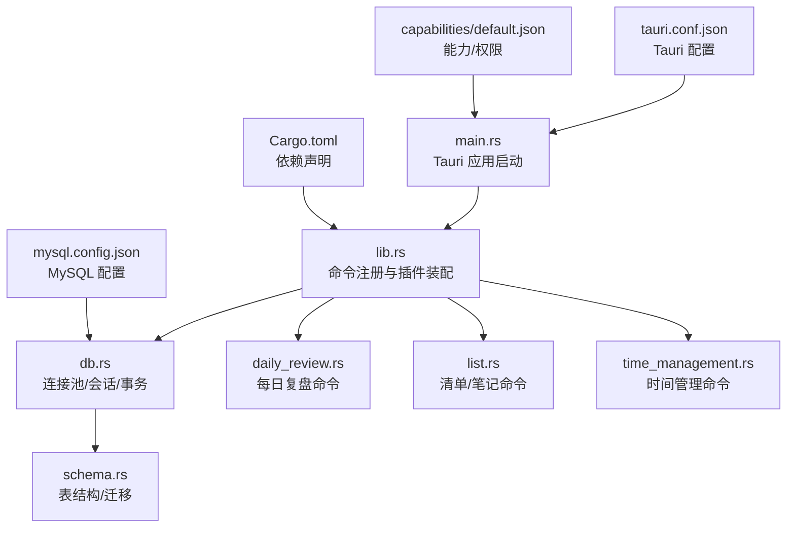
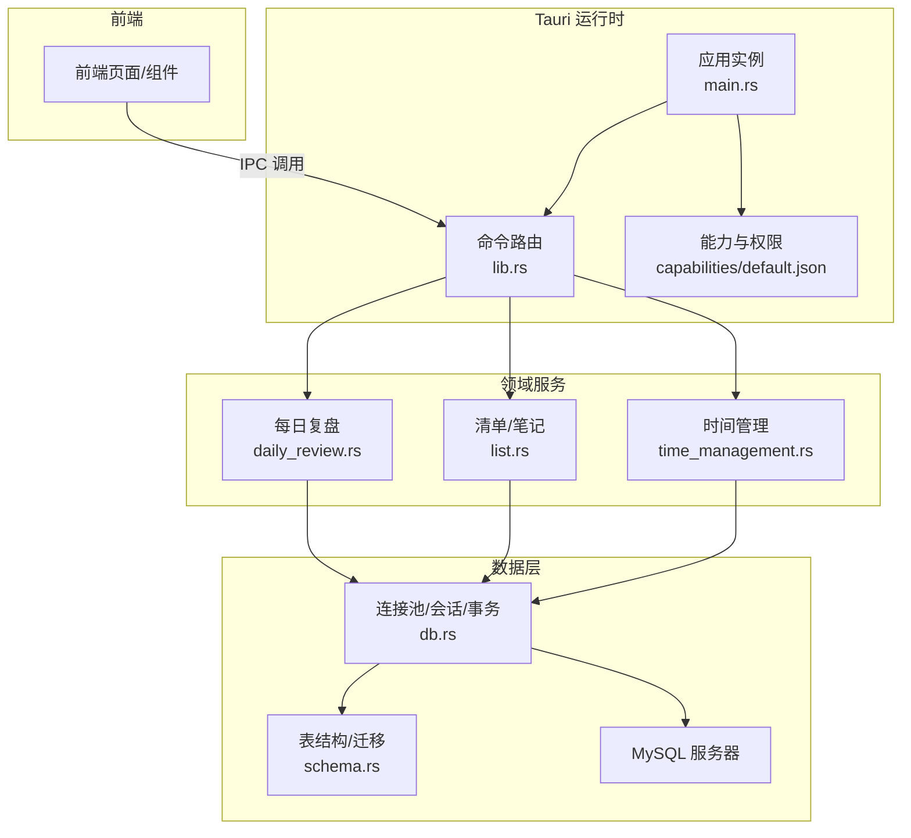
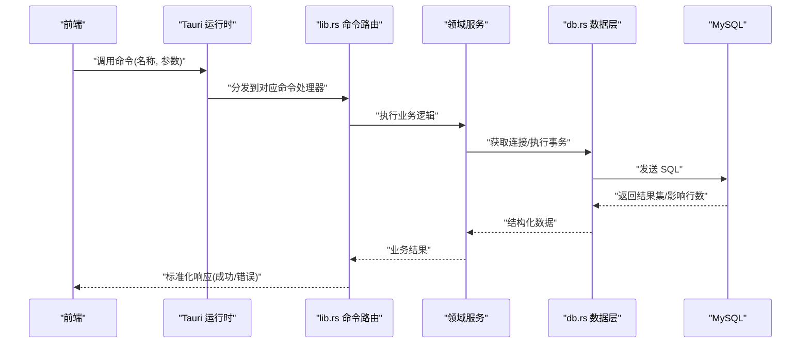
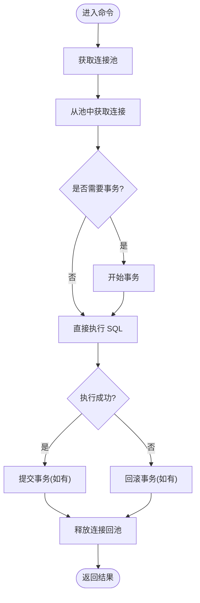
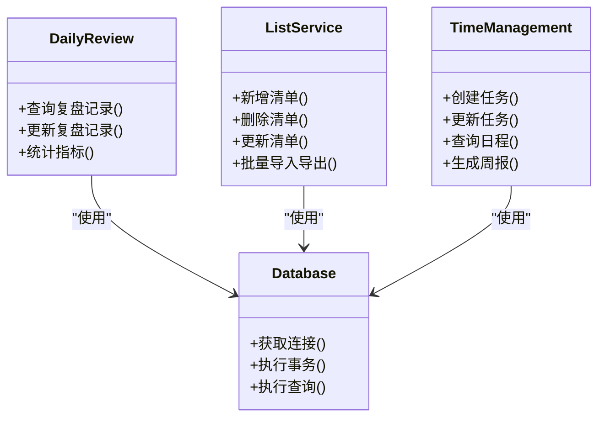
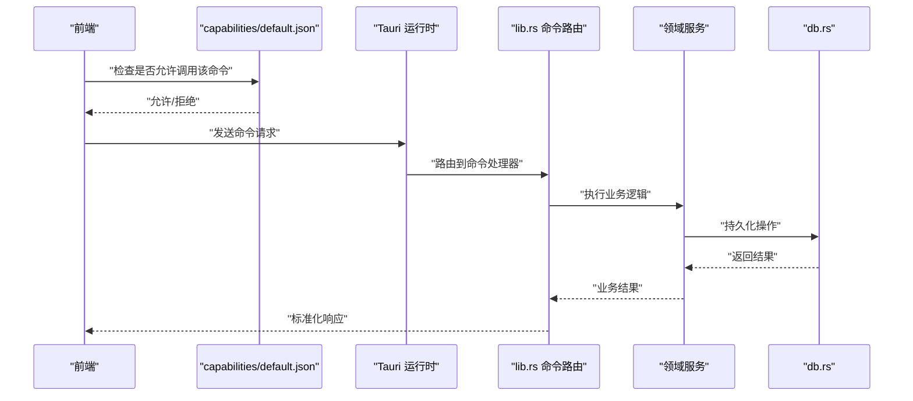
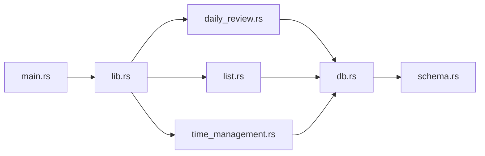

# 后端架构设计

<cite>
**本文引用的文件**   
- [src-tauri/src/main.rs](file://src-tauri/src/main.rs)
- [src-tauri/src/lib.rs](file://src-tauri/src/lib.rs)
- [src-tauri/src/db.rs](file://src-tauri/src/db.rs)
- [src-tauri/src/daily_review.rs](file://src-tauri/src/daily_review.rs)
- [src-tauri/src/list.rs](file://src-tauri/src/list.rs)
- [src-tauri/src/time_management.rs](file://src-tauri/src/time_management.rs)
- [src-tauri/src/schema.rs](file://src-tauri/src/schema.rs)
- [src-tauri/Cargo.toml](file://src-tauri/Cargo.toml)
- [src-tauri/tauri.conf.json](file://src-tauri/tauri.conf.json)
- [src-tauri/capabilities/default.json](file://src-tauri/capabilities/default.json)
- [src-tauri/mysql.config.json](file://src-tauri/mysql.config.json)
</cite>

## 目录
1. [简介](#简介)
2. [项目结构](#项目结构)
3. [核心组件](#核心组件)
4. [架构总览](#架构总览)
5. [详细组件分析](#详细组件分析)
6. [依赖关系分析](#依赖关系分析)
7. [性能与资源管理](#性能与资源管理)
8. [故障排查指南](#故障排查指南)
9. [结论](#结论)
10. [附录](#附录)

## 简介
本文件面向 FishWorker Rust 后端的架构设计与实现说明，聚焦 Tauri 应用的后端结构设计。内容涵盖：
- 入口点 main.rs、模块组织 lib.rs、数据库连接管理 db.rs 的职责与协作方式
- Rust 异步编程模型与 Tokio 运行时配置
- 错误处理策略
- Tauri 命令注册机制、IPC 通信协议与安全权限控制
- 数据库连接池管理、事务处理与并发访问控制
- 后端性能优化策略、内存管理与资源清理机制
- 后端模块依赖图与命令调用流程图

## 项目结构
Rust 后端位于 src-tauri 目录中，采用“按功能域划分”的模块化组织方式：
- 入口与初始化：main.rs、lib.rs
- 数据层：db.rs（连接池、会话、事务）、schema.rs（表结构与迁移）
- 业务域：daily_review.rs、list.rs、time_management.rs
- 配置与能力：Cargo.toml、tauri.conf.json、capabilities/default.json、mysql.config.json

图表来源
- [src-tauri/src/main.rs](file://src-tauri/src/main.rs)
- [src-tauri/src/lib.rs](file://src-tauri/src/lib.rs)
- [src-tauri/src/db.rs](file://src-tauri/src/db.rs)
- [src-tauri/src/daily_review.rs](file://src-tauri/src/daily_review.rs)
- [src-tauri/src/list.rs](file://src-tauri/src/list.rs)
- [src-tauri/src/time_management.rs](file://src-tauri/src/time_management.rs)
- [src-tauri/src/schema.rs](file://src-tauri/src/schema.rs)
- [src-tauri/Cargo.toml](file://src-tauri/Cargo.toml)
- [src-tauri/tauri.conf.json](file://src-tauri/tauri.conf.json)
- [src-tauri/capabilities/default.json](file://src-tauri/capabilities/default.json)
- [src-tauri/mysql.config.json](file://src-tauri/mysql.config.json)

章节来源
- [src-tauri/src/main.rs](file://src-tauri/src/main.rs)
- [src-tauri/src/lib.rs](file://src-tauri/src/lib.rs)
- [src-tauri/src/db.rs](file://src-tauri/src/db.rs)
- [src-tauri/src/daily_review.rs](file://src-tauri/src/daily_review.rs)
- [src-tauri/src/list.rs](file://src-tauri/src/list.rs)
- [src-tauri/src/time_management.rs](file://src-tauri/src/time_management.rs)
- [src-tauri/src/schema.rs](file://src-tauri/src/schema.rs)
- [src-tauri/Cargo.toml](file://src-tauri/Cargo.toml)
- [src-tauri/tauri.conf.json](file://src-tauri/tauri.conf.json)
- [src-tauri/capabilities/default.json](file://src-tauri/capabilities/default.json)
- [src-tauri/mysql.config.json](file://src-tauri/mysql.config.json)

## 核心组件
- 入口与生命周期
  - main.rs：负责创建并运行 Tauri 应用，加载前端资源，挂载插件与中间件，设置窗口与系统托盘等。
  - lib.rs：集中注册 Tauri 命令，组装共享状态（如数据库连接池），暴露给前端通过 IPC 调用。
- 数据层
  - db.rs：封装数据库连接池、会话获取、事务边界、重试与超时控制；提供统一的错误类型与日志埋点。
  - schema.rs：定义表结构、索引与迁移脚本，确保数据一致性。
- 业务域
  - daily_review.rs：每日复盘相关命令（查询、更新、统计）。
  - list.rs：清单/笔记相关命令（增删改查、排序、分组）。
  - time_management.rs：时间管理相关命令（任务、日程、周计划）。
- 配置与权限
  - Cargo.toml：声明 Rust 依赖（Tokio、Tauri、数据库驱动等）。
  - tauri.conf.json：Tauri 应用配置（窗口、安全策略、白名单等）。
  - capabilities/default.json：能力与权限控制（允许的命令、API 访问范围）。
  - mysql.config.json：MySQL 连接参数（地址、端口、用户、密码、数据库名、SSL 等）。

章节来源
- [src-tauri/src/main.rs](file://src-tauri/src/main.rs)
- [src-tauri/src/lib.rs](file://src-tauri/src/lib.rs)
- [src-tauri/src/db.rs](file://src-tauri/src/db.rs)
- [src-tauri/src/daily_review.rs](file://src-tauri/src/daily_review.rs)
- [src-tauri/src/list.rs](file://src-tauri/src/list.rs)
- [src-tauri/src/time_management.rs](file://src-tauri/src/time_management.rs)
- [src-tauri/src/schema.rs](file://src-tauri/src/schema.rs)
- [src-tauri/Cargo.toml](file://src-tauri/Cargo.toml)
- [src-tauri/tauri.conf.json](file://src-tauri/tauri.conf.json)
- [src-tauri/capabilities/default.json](file://src-tauri/capabilities/default.json)
- [src-tauri/mysql.config.json](file://src-tauri/mysql.config.json)

## 架构总览
整体架构遵循“前端 UI + Tauri 命令层 + 领域服务 + 数据持久化”的分层模式。前端通过 Tauri IPC 调用后端命令，命令层解析参数、校验权限、调用领域服务，最终通过 db.rs 进行数据库操作。

图表来源
- [src-tauri/src/main.rs](file://src-tauri/src/main.rs)
- [src-tauri/src/lib.rs](file://src-tauri/src/lib.rs)
- [src-tauri/src/daily_review.rs](file://src-tauri/src/daily_review.rs)
- [src-tauri/src/list.rs](file://src-tauri/src/list.rs)
- [src-tauri/src/time_management.rs](file://src-tauri/src/time_management.rs)
- [src-tauri/src/db.rs](file://src-tauri/src/db.rs)
- [src-tauri/src/schema.rs](file://src-tauri/src/schema.rs)
- [src-tauri/capabilities/default.json](file://src-tauri/capabilities/default.json)

## 详细组件分析

### 入口与模块组织（main.rs 与 lib.rs）
- main.rs
  - 负责构建 Tauri 应用实例，加载前端静态资源，注册全局插件与中间件，设置窗口行为与系统托盘。
  - 在应用启动时完成必要的初始化（如读取配置、预热连接池、打印版本信息等）。
- lib.rs
  - 集中注册所有 Tauri 命令，将前端可调用接口映射到具体函数。
  - 注入共享状态（例如数据库连接池），供各命令使用。
  - 统一错误包装与返回格式，保证前后端契约一致。

图表来源
- [src-tauri/src/main.rs](file://src-tauri/src/main.rs)
- [src-tauri/src/lib.rs](file://src-tauri/src/lib.rs)
- [src-tauri/src/db.rs](file://src-tauri/src/db.rs)

章节来源
- [src-tauri/src/main.rs](file://src-tauri/src/main.rs)
- [src-tauri/src/lib.rs](file://src-tauri/src/lib.rs)

### 数据库连接管理（db.rs 与 schema.rs）
- 连接池与会话
  - 使用连接池管理底层连接，避免频繁创建销毁开销。
  - 提供会话获取方法，支持读写分离或只读副本（若需要）。
- 事务处理
  - 封装事务边界，支持嵌套事务或保存点（视数据库驱动能力）。
  - 自动回滚与异常传播，确保数据一致性。
- 并发访问控制
  - 基于连接池的并发限制，防止过载。
  - 对热点表加锁或行级锁策略（由 SQL 层面保障）。
- 表结构与迁移
  - schema.rs 维护表结构定义与迁移脚本，确保多环境一致性。

图表来源
- [src-tauri/src/db.rs](file://src-tauri/src/db.rs)
- [src-tauri/src/schema.rs](file://src-tauri/src/schema.rs)

章节来源
- [src-tauri/src/db.rs](file://src-tauri/src/db.rs)
- [src-tauri/src/schema.rs](file://src-tauri/src/schema.rs)

### 领域服务（daily_review.rs、list.rs、time_management.rs）
- daily_review.rs
  - 提供每日复盘数据的查询、更新与聚合统计。
  - 典型流程：参数校验 -> 读取配置 -> 查询/写入 -> 缓存（可选）-> 返回。
- list.rs
  - 提供清单/笔记的增删改查、排序、分组、批量操作。
  - 注意并发写冲突与乐观锁策略。
- time_management.rs
  - 提供任务、日程、周计划的数据操作。
  - 涉及时间区间计算、重复规则与提醒触发（若在后端实现）。

图表来源
- [src-tauri/src/daily_review.rs](file://src-tauri/src/daily_review.rs)
- [src-tauri/src/list.rs](file://src-tauri/src/list.rs)
- [src-tauri/src/time_management.rs](file://src-tauri/src/time_management.rs)
- [src-tauri/src/db.rs](file://src-tauri/src/db.rs)

章节来源
- [src-tauri/src/daily_review.rs](file://src-tauri/src/daily_review.rs)
- [src-tauri/src/list.rs](file://src-tauri/src/list.rs)
- [src-tauri/src/time_management.rs](file://src-tauri/src/time_management.rs)

### Tauri 命令注册与 IPC 通信
- 命令注册
  - 在 lib.rs 中集中注册命令，将前端调用的命令名映射到具体函数。
  - 支持同步与异步命令，推荐异步以提升吞吐。
- IPC 协议
  - 请求体包含命令名与参数，响应体包含数据与错误信息。
  - 建议统一错误码与消息结构，便于前端处理。
- 安全与权限
  - 通过 capabilities/default.json 控制命令与 API 的访问范围。
  - 结合 tauri.conf.json 的安全策略（白名单、CSP 等）限制前端能力。

图表来源
- [src-tauri/src/lib.rs](file://src-tauri/src/lib.rs)
- [src-tauri/capabilities/default.json](file://src-tauri/capabilities/default.json)
- [src-tauri/src/db.rs](file://src-tauri/src/db.rs)

章节来源
- [src-tauri/src/lib.rs](file://src-tauri/src/lib.rs)
- [src-tauri/capabilities/default.json](file://src-tauri/capabilities/default.json)

### 异步模型与 Tokio 运行时
- 异步模型
  - 使用 async/await 编写非阻塞 IO 操作（网络、数据库）。
  - 命令处理器为异步函数，避免阻塞事件循环。
- Tokio 运行时
  - 在 main.rs 中初始化 Tokio 运行时，配置线程数与工作队列。
  - 合理设置最大阻塞线程数，避免 IO 密集型任务阻塞 CPU 线程。
- 错误处理
  - 定义统一错误类型，区分网络错误、数据库错误、业务错误。
  - 在命令层捕获并转换为前端可读的错误结构。

章节来源
- [src-tauri/src/main.rs](file://src-tauri/src/main.rs)
- [src-tauri/src/lib.rs](file://src-tauri/src/lib.rs)

### 配置与环境
- Cargo.toml
  - 声明依赖：Tauri、Tokio、数据库驱动（如 mysql_async/sqlx）、序列化库等。
- tauri.conf.json
  - 配置窗口、安全策略、白名单、调试选项等。
- capabilities/default.json
  - 定义命令与 API 的权限范围，最小权限原则。
- mysql.config.json
  - 存储 MySQL 连接参数，支持多环境切换。

章节来源
- [src-tauri/Cargo.toml](file://src-tauri/Cargo.toml)
- [src-tauri/tauri.conf.json](file://src-tauri/tauri.conf.json)
- [src-tauri/capabilities/default.json](file://src-tauri/capabilities/default.json)
- [src-tauri/mysql.config.json](file://src-tauri/mysql.config.json)

## 依赖关系分析
后端模块之间的依赖关系如下：
- main.rs 依赖 lib.rs（应用启动与命令注册）
- lib.rs 依赖各业务域模块（daily_review.rs、list.rs、time_management.rs）
- 业务域模块依赖 db.rs（数据访问）
- db.rs 依赖 schema.rs（表结构与迁移）
- 配置与权限由外部 JSON 文件提供

图表来源
- [src-tauri/src/main.rs](file://src-tauri/src/main.rs)
- [src-tauri/src/lib.rs](file://src-tauri/src/lib.rs)
- [src-tauri/src/daily_review.rs](file://src-tauri/src/daily_review.rs)
- [src-tauri/src/list.rs](file://src-tauri/src/list.rs)
- [src-tauri/src/time_management.rs](file://src-tauri/src/time_management.rs)
- [src-tauri/src/db.rs](file://src-tauri/src/db.rs)
- [src-tauri/src/schema.rs](file://src-tauri/src/schema.rs)

章节来源
- [src-tauri/src/main.rs](file://src-tauri/src/main.rs)
- [src-tauri/src/lib.rs](file://src-tauri/src/lib.rs)
- [src-tauri/src/daily_review.rs](file://src-tauri/src/daily_review.rs)
- [src-tauri/src/list.rs](file://src-tauri/src/list.rs)
- [src-tauri/src/time_management.rs](file://src-tauri/src/time_management.rs)
- [src-tauri/src/db.rs](file://src-tauri/src/db.rs)
- [src-tauri/src/schema.rs](file://src-tauri/src/schema.rs)

## 性能与资源管理
- 连接池优化
  - 根据并发量调整最大连接数，避免过多连接导致上下文切换开销。
  - 启用连接复用与空闲回收，减少建立连接的延迟。
- 事务与批处理
  - 合并小事务为大事务，降低提交次数。
  - 批量插入/更新，减少往返开销。
- 异步与背压
  - 使用流式处理大结果集，避免一次性加载到内存。
  - 对高负载接口增加限流与退避策略。
- 内存管理
  - 及时释放临时对象与大缓冲区。
  - 避免持有不必要的引用，防止内存泄漏。
- 资源清理
  - 应用退出时关闭连接池、释放文件句柄、取消后台任务。
  - 优雅停机：等待正在处理的请求完成后退出。

[本节为通用指导，不直接分析具体文件]

## 故障排查指南
- 常见问题定位
  - 命令未注册：检查 lib.rs 中的命令注册列表。
  - 权限不足：核对 capabilities/default.json 是否允许该命令。
  - 数据库连接失败：检查 mysql.config.json 与网络连通性。
  - 事务回滚：查看错误日志与 SQL 语句，确认约束冲突。
- 日志与监控
  - 在关键路径添加结构化日志（请求 ID、耗时、错误码）。
  - 收集慢查询与连接池指标，辅助性能分析。
- 调试技巧
  - 启用 Tauri 调试模式，查看 IPC 请求与响应。
  - 使用数据库客户端复现问题，验证 SQL 正确性。

章节来源
- [src-tauri/src/lib.rs](file://src-tauri/src/lib.rs)
- [src-tauri/capabilities/default.json](file://src-tauri/capabilities/default.json)
- [src-tauri/mysql.config.json](file://src-tauri/mysql.config.json)

## 结论
FishWorker 后端采用清晰的模块化分层与 Tauri 命令机制，结合 Tokio 异步模型与连接池管理，实现了高性能、可扩展的桌面应用后端。通过统一错误处理、权限控制与资源清理策略，保障了系统的稳定性与安全性。后续可在缓存、批处理与监控方面进一步优化，提升用户体验与运维效率。

[本节为总结，不直接分析具体文件]

## 附录
- 术语表
  - Tauri：跨平台桌面应用框架，提供 IPC 与原生能力。
  - Tokio：Rust 异步运行时，提供事件循环与调度。
  - 连接池：复用数据库连接以提高性能。
  - 事务：一组操作的原子性执行单元。
- 参考配置
  - tauri.conf.json：Tauri 应用配置示例。
  - capabilities/default.json：能力与权限控制示例。
  - mysql.config.json：MySQL 连接参数示例。

章节来源
- [src-tauri/tauri.conf.json](file://src-tauri/tauri.conf.json)
- [src-tauri/capabilities/default.json](file://src-tauri/capabilities/default.json)
- [src-tauri/mysql.config.json](file://src-tauri/mysql.config.json)