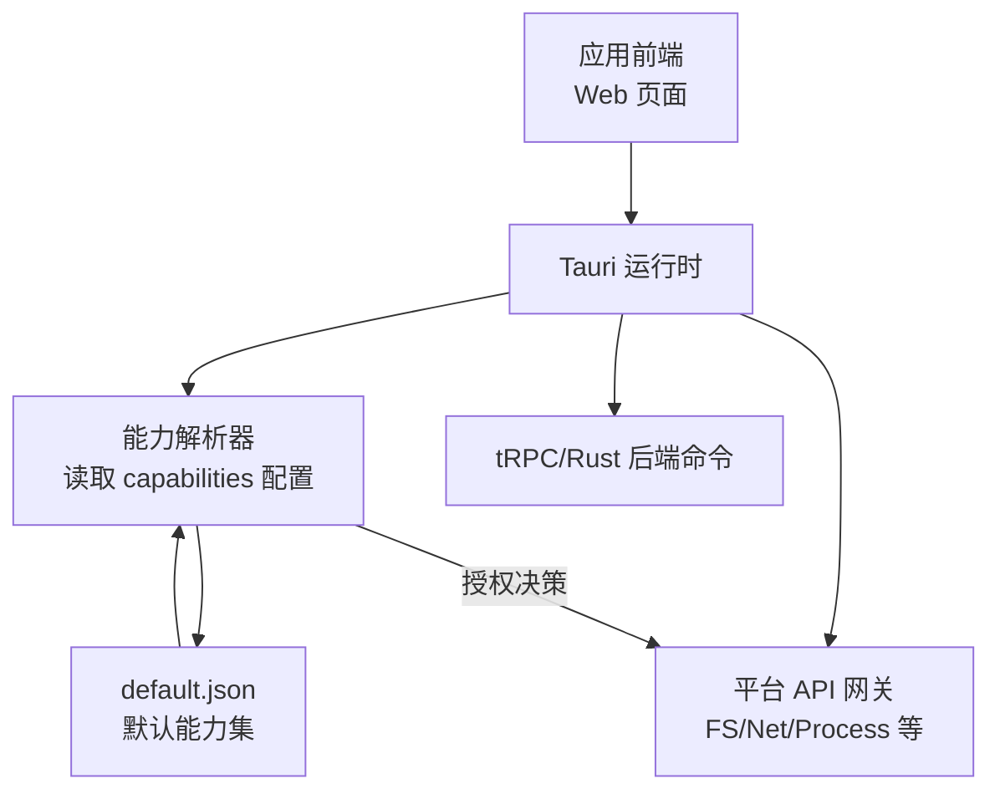
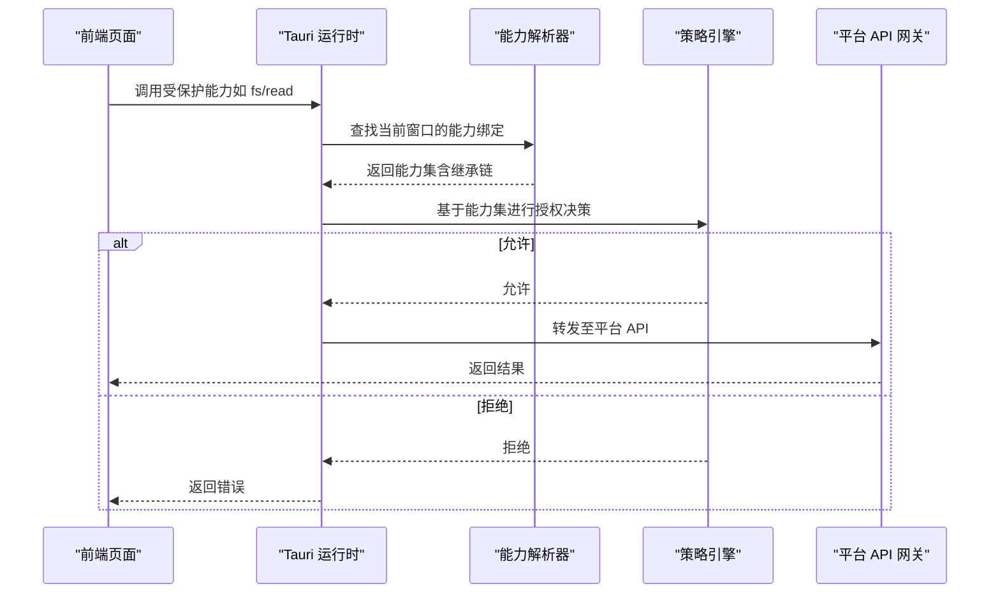
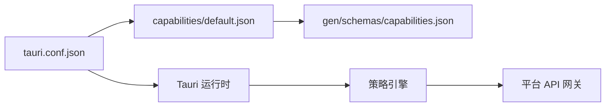

# Tauri 能力系统配置

<cite>
**本文引用的文件**   
- [src-tauri/capabilities/default.json](file://src-tauri/capabilities/default.json)
- [src-tauri/tauri.conf.json](file://src-tauri/tauri.conf.json)
- [src-tauri/gen/schemas/capabilities.json](file://src-tauri/gen/schemas/capabilities.json)
</cite>

## 目录
1. [简介](#简介)
2. [项目结构](#项目结构)
3. [核心组件](#核心组件)
4. [架构总览](#架构总览)
5. [详细组件分析](#详细组件分析)
6. [依赖关系分析](#依赖关系分析)
7. [性能与安全考量](#性能与安全考量)
8. [故障排查指南](#故障排查指南)
9. [结论](#结论)
10. [附录](#附录)

## 简介
本文件面向使用 Tauri 的开发者，系统化说明“能力（Capabilities）”配置在应用安全模型中的作用与使用方法。重点包括：
- capabilities 配置文件的作用、结构与加载机制
- 权限声明与最小化原则
- default.json 中常见能力（文件系统、网络请求、进程管理等）的配置方法
- 权限继承与覆盖机制
- 多环境权限管理策略
- 常见场景示例与安全最佳实践

## 项目结构
在本仓库中，Tauri 能力相关的关键位置如下：
- src-tauri/capabilities/default.json：默认能力定义入口
- src-tauri/tauri.conf.json：应用级配置，包含对能力的引用与全局设置
- src-tauri/gen/schemas/capabilities.json：由 Tauri 构建流程生成的能力 JSON Schema，用于校验与 IDE 提示

图表来源
- [src-tauri/capabilities/default.json](file://src-tauri/capabilities/default.json)
- [src-tauri/tauri.conf.json](file://src-tauri/tauri.conf.json)
- [src-tauri/gen/schemas/capabilities.json](file://src-tauri/gen/schemas/capabilities.json)

章节来源
- [src-tauri/capabilities/default.json](file://src-tauri/capabilities/default.json)
- [src-tauri/tauri.conf.json](file://src-tauri/tauri.conf.json)
- [src-tauri/gen/schemas/capabilities.json](file://src-tauri/gen/schemas/capabilities.json)

## 核心组件
- 能力（Capability）：一组可被特定窗口或页面使用的权限集合，以 JSON 描述。
- 默认能力（Default Capability）：通过 tauri.conf.json 引用，作为未显式绑定时的前端页面的基础权限集。
- 能力校验：构建期生成 capabilities.json Schema，用于校验配置正确性并提供编辑器智能提示。

章节来源
- [src-tauri/tauri.conf.json](file://src-tauri/tauri.conf.json)
- [src-tauri/gen/schemas/capabilities.json](file://src-tauri/gen/schemas/capabilities.json)

## 架构总览
下图展示了从前端调用到能力检查与平台 API 调用的整体流程。

图表来源
- [src-tauri/capabilities/default.json](file://src-tauri/capabilities/default.json)
- [src-tauri/tauri.conf.json](file://src-tauri/tauri.conf.json)

## 详细组件分析

### 能力配置结构与字段语义
- 作用域（scope）：限定能力生效的页面或窗口范围，支持路径匹配与模式匹配。
- 权限（permissions）：按能力域（如 filesystem、webview、process 等）声明具体操作与资源范围。
- 继承与覆盖：子能力可继承父能力，并通过同名键覆盖更细粒度的限制。
- 条件与元数据：部分能力支持条件表达式或附加元信息（例如注释、版本标记），便于审计与演进。

章节来源
- [src-tauri/capabilities/default.json](file://src-tauri/capabilities/default.json)
- [src-tauri/gen/schemas/capabilities.json](file://src-tauri/gen/schemas/capabilities.json)

### 默认能力（default.json）中的核心能力
- 文件系统访问
  - 典型权限：读取、写入、列出目录、创建/删除文件等
  - 作用域建议：仅对业务所需目录开放，避免根目录或用户主目录全量暴露
  - 路径白名单：优先使用精确路径或受限通配符，减少越权风险
- 网络请求
  - 典型权限：发起 HTTP/HTTPS 请求、指定目标域名或 IP、端口与协议
  - 作用域建议：仅对必要域名开放，必要时区分开发/生产环境
  - 传输安全：强制 HTTPS，禁用明文协议；如需自签证书，明确信任策略
- 进程管理
  - 典型权限：启动外部进程、传递参数、获取输出、终止进程
  - 作用域建议：严格限制可执行路径与参数模板，防止注入
  - 沙箱隔离：尽量通过 Rust 侧封装调用，避免直接暴露 shell 能力

章节来源
- [src-tauri/capabilities/default.json](file://src-tauri/capabilities/default.json)

### 权限继承与覆盖机制
- 继承链：窗口/页面可按层级继承能力，上层定义的通用权限自动向下生效。
- 覆盖规则：子能力中对同一权限的声明会覆盖父能力，实现“收紧”而非“放宽”。
- 最佳实践：
  - 将通用最小权限放在顶层默认能力
  - 针对高风险页面单独定义更严格的子能力
  - 避免跨层级的重复声明，保持单一事实源

章节来源
- [src-tauri/capabilities/default.json](file://src-tauri/capabilities/default.json)
- [src-tauri/tauri.conf.json](file://src-tauri/tauri.conf.json)

### 多环境权限管理策略
- 环境分离：为开发、测试、生产分别维护能力集，确保生产环境最小权限。
- 配置开关：通过构建参数或环境变量选择不同能力集，避免在代码中硬编码。
- 灰度发布：在新功能上线前，先在小范围窗口启用新能力，观察日志与告警后再推广。

章节来源
- [src-tauri/tauri.conf.json](file://src-tauri/tauri.conf.json)

### 权限最小化原则与实践清单
- 只授予完成功能所必需的最小权限
- 使用精确路径与域名白名单，避免通配符滥用
- 禁止在生产环境开启调试能力与宽泛的文件系统访问
- 对外部进程调用采用参数模板与白名单校验
- 定期审查能力变更，结合自动化校验（Schema）与人工评审

[本节为通用指导，不直接分析具体文件]

### 常见权限场景配置示例（路径指引）
- 仅允许读取应用数据目录
  - 参考：[src-tauri/capabilities/default.json](file://src-tauri/capabilities/default.json)
- 仅允许访问特定远程 API 域名
  - 参考：[src-tauri/capabilities/default.json](file://src-tauri/capabilities/default.json)
- 仅允许启动受控的外部工具并限制参数
  - 参考：[src-tauri/capabilities/default.json](file://src-tauri/capabilities/default.json)

[本节提供路径指引，不包含具体配置内容]

## 依赖关系分析
- tauri.conf.json 负责将默认能力与窗口/页面绑定，是能力生效的入口。
- capabilities/default.json 承载具体的权限声明，是策略的核心。
- gen/schemas/capabilities.json 由构建流程生成，用于校验与提示，保证配置一致性。

图表来源
- [src-tauri/tauri.conf.json](file://src-tauri/tauri.conf.json)
- [src-tauri/capabilities/default.json](file://src-tauri/capabilities/default.json)
- [src-tauri/gen/schemas/capabilities.json](file://src-tauri/gen/schemas/capabilities.json)

章节来源
- [src-tauri/tauri.conf.json](file://src-tauri/tauri.conf.json)
- [src-tauri/capabilities/default.json](file://src-tauri/capabilities/default.json)
- [src-tauri/gen/schemas/capabilities.json](file://src-tauri/gen/schemas/capabilities.json)

## 性能与安全考量
- 性能
  - 能力解析发生在请求路径上，应尽量减少不必要的复杂匹配与嵌套
  - 合理划分作用域，避免过大的全局能力导致频繁的全局匹配
- 安全
  - 严格遵循最小权限原则，生产环境关闭调试与冗余能力
  - 对网络与进程能力实施白名单与参数校验
  - 定期更新依赖与 Tauri 版本，修复已知漏洞

[本节为通用指导，不直接分析具体文件]

## 故障排查指南
- 现象：前端调用能力报错“未授权”
  - 排查步骤：
    - 确认当前窗口是否绑定了正确的能力集
    - 检查 default.json 中对应权限与作用域是否包含目标资源
    - 验证是否存在子能力覆盖导致的收紧
- 现象：构建时报错“能力配置无效”
  - 排查步骤：
    - 依据 gen/schemas/capabilities.json 的结构修正字段与类型
    - 清理缓存后重新构建，确保 Schema 最新
- 现象：生产环境出现异常网络或文件访问失败
  - 排查步骤：
    - 核对生产环境能力集是否为最小权限
    - 检查域名白名单与路径白名单是否遗漏

章节来源
- [src-tauri/gen/schemas/capabilities.json](file://src-tauri/gen/schemas/capabilities.json)
- [src-tauri/capabilities/default.json](file://src-tauri/capabilities/default.json)

## 结论
通过合理的 capabilities 设计与最小化权限策略，可以在保障功能可用性的同时显著提升应用安全性。建议将能力配置纳入代码评审与自动化校验流程，持续优化权限边界，降低安全风险面。

[本节为总结性内容，不直接分析具体文件]

## 附录
- 术语
  - 能力（Capability）：一组权限的集合，用于控制前端可访问的平台 API
  - 作用域（Scope）：能力生效的页面/窗口范围
  - 权限（Permission）：对某一能力域的具体操作与资源限制
- 参考路径
  - 默认能力定义：[src-tauri/capabilities/default.json](file://src-tauri/capabilities/default.json)
  - 应用配置（能力绑定）：[src-tauri/tauri.conf.json](file://src-tauri/tauri.conf.json)
  - 能力 Schema（校验与提示）：[src-tauri/gen/schemas/capabilities.json](file://src-tauri/gen/schemas/capabilities.json)