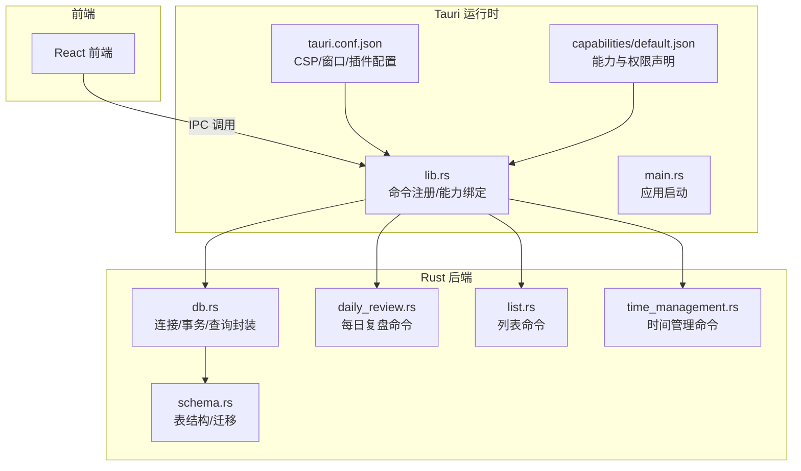
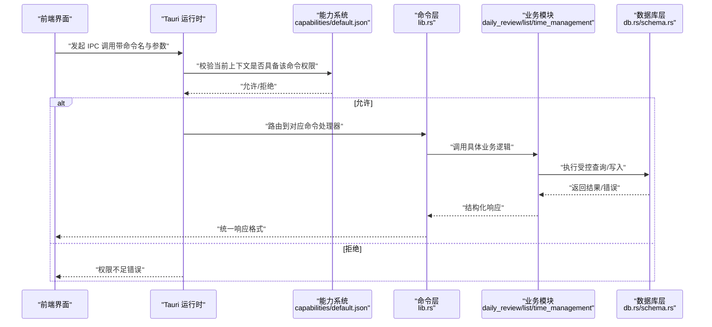
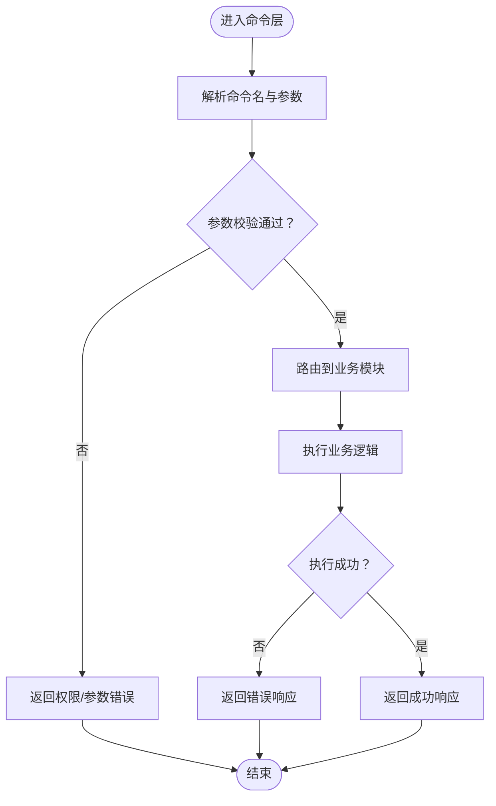
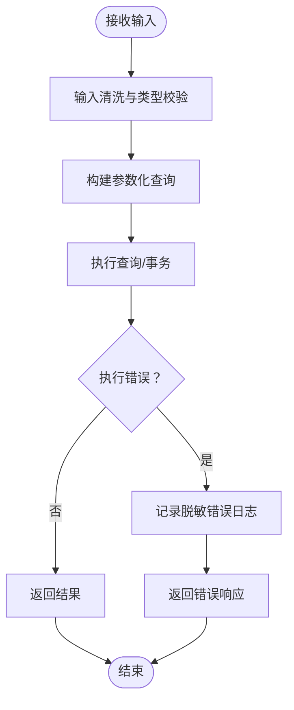
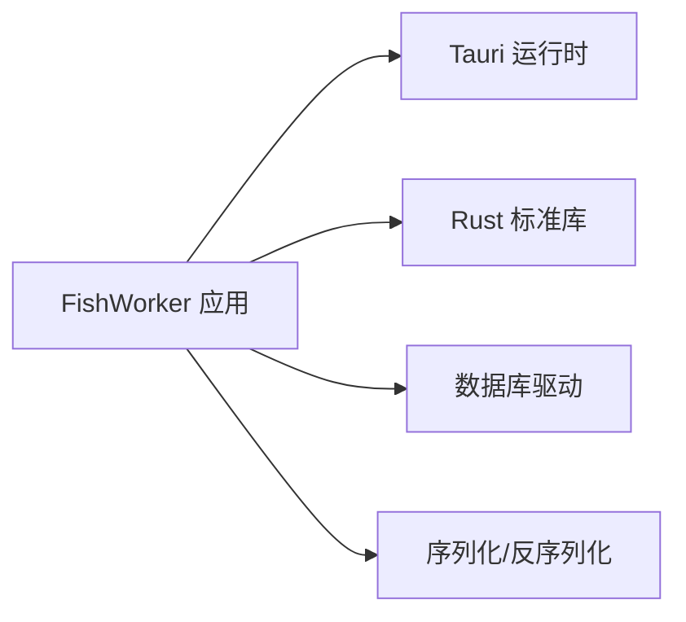

# 安全与权限控制

<cite>
**本文引用的文件**   
- [tauri.conf.json](file://src-tauri/tauri.conf.json)
- [default.json](file://src-tauri/capabilities/default.json)
- [lib.rs](file://src-tauri/src/lib.rs)
- [main.rs](file://src-tauri/src/main.rs)
- [db.rs](file://src-tauri/src/db.rs)
- [schema.rs](file://src-tauri/src/schema.rs)
- [daily_review.rs](file://src-tauri/src/daily_review.rs)
- [list.rs](file://src-tauri/src/list.rs)
- [time_management.rs](file://src-tauri/src/time_management.rs)
- [Cargo.toml](file://src-tauri/Cargo.toml)
</cite>

## 目录
1. [简介](#简介)
2. [项目结构](#项目结构)
3. [核心组件](#核心组件)
4. [架构总览](#架构总览)
5. [详细组件分析](#详细组件分析)
6. [依赖分析](#依赖分析)
7. [性能考虑](#性能考虑)
8. [故障排查指南](#故障排查指南)
9. [结论](#结论)
10. [附录](#附录)

## 简介
本文件面向 FishWorker 的安全与权限控制，聚焦 Tauri 能力系统（Capabilities）的工作原理、capabilities 配置文件结构与权限定义；详细说明文件系统访问、网络请求、系统 API 调用的控制机制；文档化 CSP（内容安全策略）、脚本执行白名单、资源加载安全验证；阐述用户数据保护、敏感信息加密存储与会话管理；提供漏洞防护（输入校验、SQL 注入防护、XSS 防御）、安全审计清单、渗透测试指南与安全更新策略；并给出最佳实践与常见问题解决方案。

## 项目结构
FishWorker 采用 Tauri + Rust 后端 + React 前端的双端架构。安全相关的关键位置包括：
- Tauri 应用配置与能力声明：src-tauri/tauri.conf.json、src-tauri/capabilities/default.json
- Rust 后端入口与命令注册：src-tauri/src/main.rs、src-tauri/src/lib.rs
- 数据库与模式：src-tauri/src/db.rs、src-tauri/src/schema.rs
- 业务命令模块：src-tauri/src/daily_review.rs、src-tauri/src/list.rs、src-tauri/src/time_management.rs
- 构建与依赖：src-tauri/Cargo.toml

图表来源
- [tauri.conf.json](file://src-tauri/tauri.conf.json)
- [default.json](file://src-tauri/capabilities/default.json)
- [lib.rs](file://src-tauri/src/lib.rs)
- [main.rs](file://src-tauri/src/main.rs)
- [db.rs](file://src-tauri/src/db.rs)
- [schema.rs](file://src-tauri/src/schema.rs)
- [daily_review.rs](file://src-tauri/src/daily_review.rs)
- [list.rs](file://src-tauri/src/list.rs)
- [time_management.rs](file://src-tauri/src/time_management.rs)

章节来源
- [tauri.conf.json](file://src-tauri/tauri.conf.json)
- [default.json](file://src-tauri/capabilities/default.json)
- [lib.rs](file://src-tauri/src/lib.rs)
- [main.rs](file://src-tauri/src/main.rs)
- [db.rs](file://src-tauri/src/db.rs)
- [schema.rs](file://src-tauri/src/schema.rs)
- [daily_review.rs](file://src-tauri/src/daily_review.rs)
- [list.rs](file://src-tauri/src/list.rs)
- [time_management.rs](file://src-tauri/src/time_management.rs)

## 核心组件
- Tauri 能力系统（Capabilities）
  - 通过 capabilities/default.json 声明允许的命令、资源与范围，结合 tauri.conf.json 的 CSP 与窗口配置，形成“最小权限”边界。
  - 能力可限定到特定页面或上下文，避免全局开放。
- 命令层（Commands）
  - 在 lib.rs 中集中注册后端命令，作为前端 IPC 的唯一入口，所有敏感操作必须经命令层校验与授权。
- 数据库层（DB/Schema）
  - db.rs 负责连接、事务与查询封装；schema.rs 定义表结构与约束，确保数据完整性与一致性。
- 业务命令模块
  - daily_review.rs、list.rs、time_management.rs 分别实现领域命令，仅暴露必要接口，内部进行参数校验与错误处理。

章节来源
- [default.json](file://src-tauri/capabilities/default.json)
- [tauri.conf.json](file://src-tauri/tauri.conf.json)
- [lib.rs](file://src-tauri/src/lib.rs)
- [db.rs](file://src-tauri/src/db.rs)
- [schema.rs](file://src-tauri/src/schema.rs)
- [daily_review.rs](file://src-tauri/src/daily_review.rs)
- [list.rs](file://src-tauri/src/list.rs)
- [time_management.rs](file://src-tauri/src/time_management.rs)

## 架构总览
下图展示从前端到后端的完整调用链，以及能力系统与配置如何参与权限控制。

图表来源
- [default.json](file://src-tauri/capabilities/default.json)
- [lib.rs](file://src-tauri/src/lib.rs)
- [daily_review.rs](file://src-tauri/src/daily_review.rs)
- [list.rs](file://src-tauri/src/list.rs)
- [time_management.rs](file://src-tauri/src/time_management.rs)
- [db.rs](file://src-tauri/src/db.rs)
- [schema.rs](file://src-tauri/src/schema.rs)

## 详细组件分析

### Tauri 能力系统与权限模型
- 工作原理
  - 每个命令在 capabilities/default.json 中显式声明，未声明则默认不可用。
  - 能力可附加作用域（如路径、域名、命令前缀），限制调用来源与目标。
  - 结合 tauri.conf.json 的 CSP 与窗口设置，形成“页面级 + 命令级”双重隔离。
- 建议实践
  - 为不同功能域创建独立能力集，按需授予。
  - 使用精确的作用域匹配，避免通配符滥用。
  - 对高敏命令启用额外鉴权（如会话令牌校验）。

章节来源
- [default.json](file://src-tauri/capabilities/default.json)
- [tauri.conf.json](file://src-tauri/tauri.conf.json)

### 命令注册与调用流程（lib.rs）
- 职责
  - 集中注册所有后端命令，作为 IPC 唯一入口。
  - 将前端请求映射到具体业务模块，并进行基础参数校验。
- 安全要点
  - 禁止直接暴露底层库函数，所有外部交互必须经命令层。
  - 对输入进行类型与范围校验，失败即拒绝。
  - 统一错误码与日志脱敏，避免泄露敏感信息。

图表来源
- [lib.rs](file://src-tauri/src/lib.rs)

章节来源
- [lib.rs](file://src-tauri/src/lib.rs)

### 数据库访问与 SQL 注入防护（db.rs / schema.rs）
- 职责
  - db.rs 封装连接、事务与查询执行；schema.rs 定义表结构与约束。
- 安全要点
  - 强制使用参数化查询，杜绝字符串拼接构造 SQL。
  - 对输入进行严格类型与长度校验，越界即拒绝。
  - 使用只读账户与最小权限原则访问数据库。
  - 记录审计日志（不含敏感字段），便于追踪异常。

图表来源
- [db.rs](file://src-tauri/src/db.rs)
- [schema.rs](file://src-tauri/src/schema.rs)

章节来源
- [db.rs](file://src-tauri/src/db.rs)
- [schema.rs](file://src-tauri/src/schema.rs)

### 业务命令模块（daily_review.rs / list.rs / time_management.rs）
- 职责
  - 各自实现领域命令，对外暴露最小接口集合。
- 安全要点
  - 每个命令独立校验输入，遵循“零信任”原则。
  - 对涉及用户数据的操作增加身份/会话校验。
  - 输出前进行数据脱敏，避免泄露内部状态。

章节来源
- [daily_review.rs](file://src-tauri/src/daily_review.rs)
- [list.rs](file://src-tauri/src/list.rs)
- [time_management.rs](file://src-tauri/src/time_management.rs)

### 应用启动与初始化（main.rs）
- 职责
  - 初始化 Tauri 应用、加载配置、启动主窗口。
- 安全要点
  - 确保仅在受信任环境中启动（如禁用调试端口对外暴露）。
  - 读取配置时进行合法性校验，非法配置即中止启动。

章节来源
- [main.rs](file://src-tauri/src/main.rs)

## 依赖分析
- 关键依赖
  - Tauri 运行时与 CLI 工具链
  - Rust 标准库与第三方库（数据库驱动、序列化等）
- 风险点
  - 第三方库漏洞需定期扫描与升级
  - 构建产物签名与完整性校验

图表来源
- [Cargo.toml](file://src-tauri/Cargo.toml)

章节来源
- [Cargo.toml](file://src-tauri/Cargo.toml)

## 性能考虑
- 减少不必要的 IPC 往返，合并批量操作。
- 数据库查询尽量使用索引与分页，避免全表扫描。
- 对高频命令引入本地缓存（注意缓存一致性与失效策略）。
- 合理设置超时与重试，避免阻塞主线程。

[本节为通用指导，不直接分析具体文件]

## 故障排查指南
- 常见权限问题
  - 现象：前端调用被拒绝
  - 排查：检查 capabilities/default.json 中是否声明了对应命令与作用域；确认 tauri.conf.json 的 CSP 与窗口来源是否匹配。
- 数据库错误
  - 现象：查询失败或事务回滚
  - 排查：核对 schema.rs 的表结构与约束；检查 db.rs 的参数化查询是否正确；查看脱敏日志定位原因。
- 命令层异常
  - 现象：参数校验失败或未知命令
  - 排查：确认 lib.rs 中的命令注册与参数解析逻辑；检查前端传入的命令名与参数类型。

章节来源
- [default.json](file://src-tauri/capabilities/default.json)
- [tauri.conf.json](file://src-tauri/tauri.conf.json)
- [lib.rs](file://src-tauri/src/lib.rs)
- [db.rs](file://src-tauri/src/db.rs)
- [schema.rs](file://src-tauri/src/schema.rs)

## 结论
FishWorker 以 Tauri 能力系统为核心，结合命令层与数据库层的严格校验，构建了“最小权限、纵深防御”的安全体系。通过精细化的 capabilities 配置、严格的输入校验与参数化查询、以及统一的错误与日志策略，有效降低了权限滥用、SQL 注入与 XSS 等安全风险。持续的安全审计、依赖治理与渗透测试是保障长期安全的关键。

[本节为总结性内容，不直接分析具体文件]

## 附录

### CSP（内容安全策略）与资源加载安全
- 建议
  - 在 tauri.conf.json 中启用严格 CSP，仅允许受信任源加载脚本与资源。
  - 禁用内联脚本与 eval，使用子资源完整性（SRI）校验静态资源。
  - 对动态生成的内容进行转义与白名单过滤。

章节来源
- [tauri.conf.json](file://src-tauri/tauri.conf.json)

### 脚本执行白名单与资源加载验证
- 建议
  - 明确列出允许的域名与协议，拒绝任意跳转与重定向。
  - 对下载的资源进行哈希校验与签名验证。
  - 前端渲染时使用安全的模板引擎，避免直接插入 HTML。

章节来源
- [tauri.conf.json](file://src-tauri/tauri.conf.json)

### 用户数据保护与敏感信息加密存储
- 建议
  - 对用户密码、密钥等敏感数据采用强哈希或加密存储。
  - 使用操作系统提供的密钥管理服务（如 Keychain/DPAPI）保存会话令牌。
  - 传输层强制 TLS，并对敏感字段进行端到端加密。

章节来源
- [db.rs](file://src-tauri/src/db.rs)
- [schema.rs](file://src-tauri/src/schema.rs)

### 会话管理机制
- 建议
  - 短生命周期令牌 + 刷新令牌轮换。
  - 服务端校验会话状态与设备指纹，防重放与劫持。
  - 退出时立即销毁本地会话与缓存。

章节来源
- [lib.rs](file://src-tauri/src/lib.rs)

### 输入验证与 XSS 防御
- 建议
  - 前后端双重校验，服务端为准。
  - 输出编码与上下文感知转义，禁用危险 API。
  - 使用富文本白名单策略，过滤危险标签与属性。

章节来源
- [lib.rs](file://src-tauri/src/lib.rs)
- [daily_review.rs](file://src-tauri/src/daily_review.rs)
- [list.rs](file://src-tauri/src/list.rs)
- [time_management.rs](file://src-tauri/src/time_management.rs)

### SQL 注入防护
- 建议
  - 全面使用参数化查询，禁止字符串拼接。
  - 对输入进行类型、长度、格式校验。
  - 数据库账户最小权限，读写分离。

章节来源
- [db.rs](file://src-tauri/src/db.rs)
- [schema.rs](file://src-tauri/src/schema.rs)

### 安全审计清单
- 能力与权限
  - 是否按功能域拆分能力集？是否最小授权？
- 配置安全
  - CSP 是否严格？是否禁用不安全特性？
- 代码安全
  - 是否存在硬编码密钥？是否进行输入校验？
- 数据安全
  - 是否加密存储敏感数据？是否脱敏日志？
- 依赖安全
  - 是否定期扫描与升级依赖？是否签名构建产物？

[本节为通用清单，不直接分析具体文件]

### 渗透测试指南
- 范围
  - 前端页面与编辑器、IPC 命令、数据库接口、文件与网络访问。
- 方法
  - 权限绕过测试（能力与 CSP）
  - 输入注入测试（SQL/XSS/命令注入）
  - 会话劫持与重放攻击
  - 资源加载与外链跳转
- 工具
  - 浏览器开发者工具、Burp Suite、数据库客户端、静态分析工具

[本节为通用指南，不直接分析具体文件]

### 安全更新策略
- 建立依赖漏洞告警与自动 PR
- 发布前进行安全回归测试与签名校验
- 灰度发布与快速回滚机制
- 安全事件应急响应预案

[本节为通用策略，不直接分析具体文件]