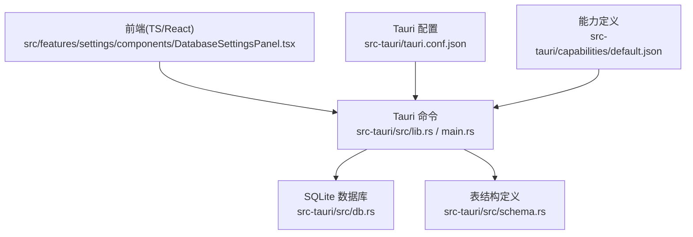
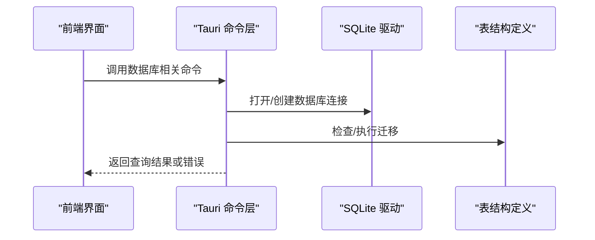
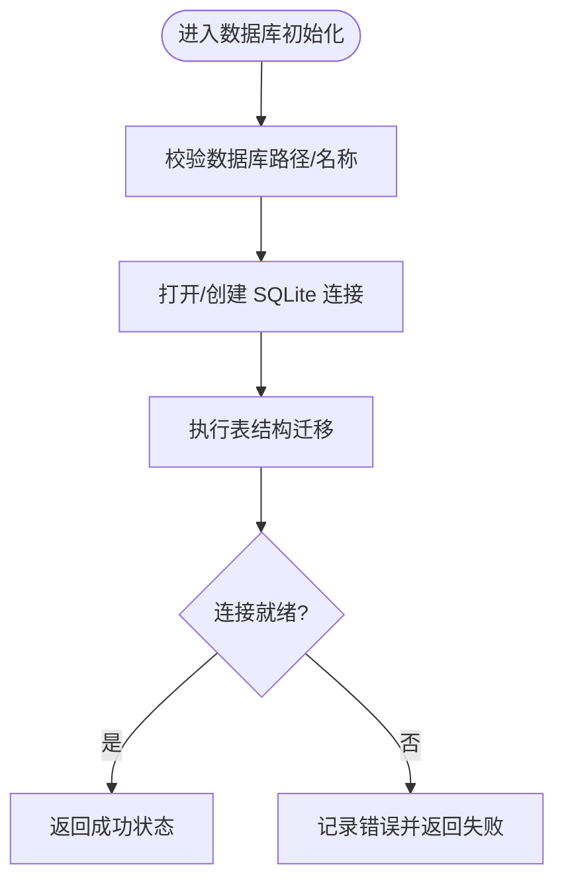
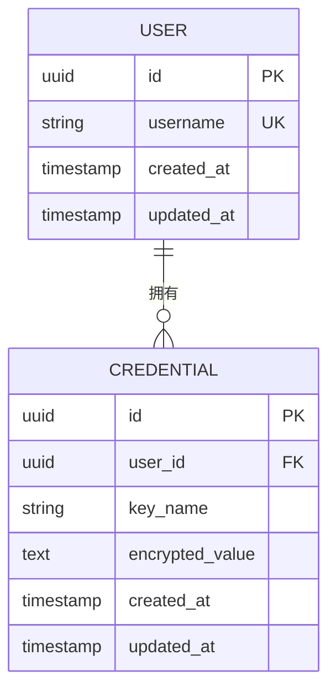
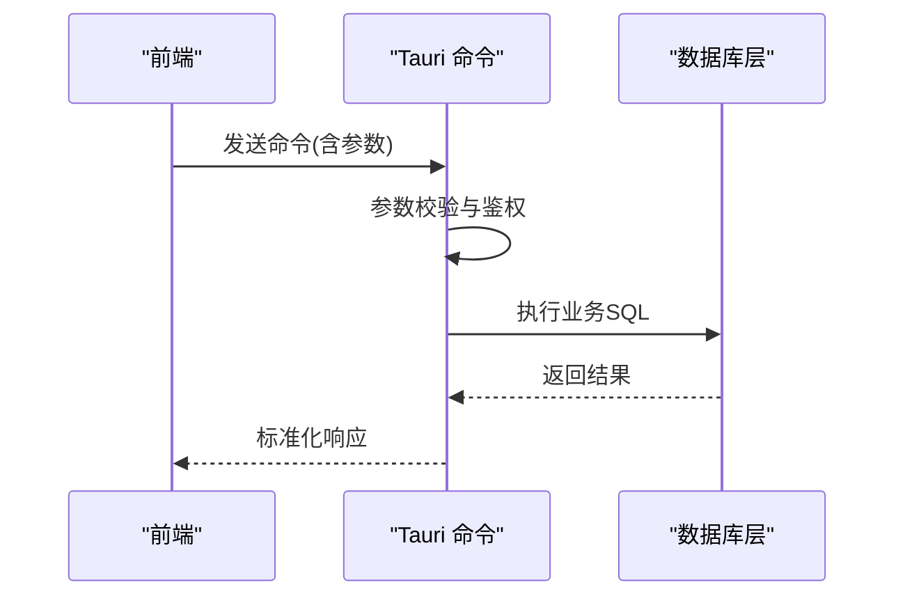
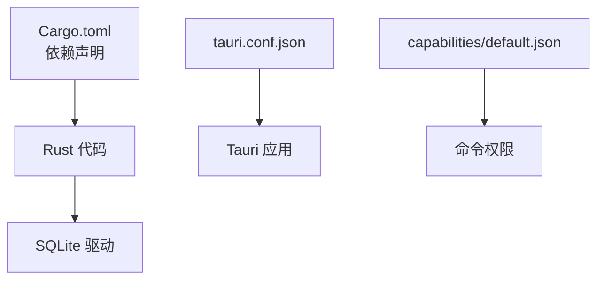

# 数据安全与加密

<cite>
**本文引用的文件**   
- [src-tauri/src/db.rs](file://src-tauri/src/db.rs)
- [src-tauri/src/schema.rs](file://src-tauri/src/schema.rs)
- [src-tauri/src/main.rs](file://src-tauri/src/main.rs)
- [src-tauri/src/lib.rs](file://src-tauri/src/lib.rs)
- [src-tauri/Cargo.toml](file://src-tauri/Cargo.toml)
- [src-tauri/tauri.conf.json](file://src-tauri/tauri.conf.json)
- [src-tauri/capabilities/default.json](file://src-tauri/capabilities/default.json)
- [src/features/settings/components/DatabaseSettingsPanel.tsx](file://src/features/settings/components/DatabaseSettingsPanel.tsx)
</cite>

## 目录
1. [简介](#简介)
2. [项目结构](#项目结构)
3. [核心组件](#核心组件)
4. [架构总览](#架构总览)
5. [详细组件分析](#详细组件分析)
6. [依赖关系分析](#依赖关系分析)
7. [性能与安全权衡](#性能与安全权衡)
8. [故障排查指南](#故障排查指南)
9. [结论](#结论)
10. [附录](#附录)

## 简介
本安全文档聚焦 FishWorker 的数据安全与加密，覆盖本地数据存储策略、SQLite 数据库的加密方案与数据保护机制、用户敏感信息（密码、API 密钥等）的加密存储流程、备份与恢复的安全考虑、数据传输过程中的加密通信、会话管理与身份验证、数据隔离策略、数据泄露防护、日志安全清理以及内存中敏感数据处理的最佳实践。文档旨在为开发者与运维人员提供可操作的安全指导，并给出基于仓库现有实现的具体分析与建议。

## 项目结构
FishWorker 采用 Tauri 架构：前端使用 React + TypeScript，后端通过 Rust 暴露能力接口，持久化层使用 SQLite。与安全相关的关键位置包括：
- Rust 后端：数据库连接与初始化、能力配置、Tauri 应用入口
- 前端设置面板：数据库连接参数输入与展示
- 配置与权限：Tauri 配置文件与能力定义

图表来源
- [src-tauri/src/db.rs](file://src-tauri/src/db.rs)
- [src-tauri/src/schema.rs](file://src-tauri/src/schema.rs)
- [src-tauri/src/main.rs](file://src-tauri/src/main.rs)
- [src-tauri/src/lib.rs](file://src-tauri/src/lib.rs)
- [src-tauri/tauri.conf.json](file://src-tauri/tauri.conf.json)
- [src-tauri/capabilities/default.json](file://src-tauri/capabilities/default.json)
- [src/features/settings/components/DatabaseSettingsPanel.tsx](file://src/features/settings/components/DatabaseSettingsPanel.tsx)

章节来源
- [src-tauri/src/db.rs](file://src-tauri/src/db.rs)
- [src-tauri/src/schema.rs](file://src-tauri/src/schema.rs)
- [src-tauri/src/main.rs](file://src-tauri/src/main.rs)
- [src-tauri/src/lib.rs](file://src-tauri/src/lib.rs)
- [src-tauri/tauri.conf.json](file://src-tauri/tauri.conf.json)
- [src-tauri/capabilities/default.json](file://src-tauri/capabilities/default.json)
- [src/features/settings/components/DatabaseSettingsPanel.tsx](file://src/features/settings/components/DatabaseSettingsPanel.tsx)

## 核心组件
- 数据库连接与初始化：负责建立 SQLite 连接、执行迁移、读写数据。
- 表结构与模式：定义业务表与字段类型，约束数据完整性。
- Tauri 命令与能力：前后端交互的命令通道与权限控制。
- 前端设置面板：用于输入和展示数据库连接参数。

章节来源
- [src-tauri/src/db.rs](file://src-tauri/src/db.rs)
- [src-tauri/src/schema.rs](file://src-tauri/src/schema.rs)
- [src-tauri/src/lib.rs](file://src-tauri/src/lib.rs)
- [src-tauri/src/main.rs](file://src-tauri/src/main.rs)
- [src/features/settings/components/DatabaseSettingsPanel.tsx](file://src/features/settings/components/DatabaseSettingsPanel.tsx)

## 架构总览
下图展示了从前端到后端的调用路径，以及数据库访问与配置的关系。

图表来源
- [src-tauri/src/lib.rs](file://src-tauri/src/lib.rs)
- [src-tauri/src/main.rs](file://src-tauri/src/main.rs)
- [src-tauri/src/db.rs](file://src-tauri/src/db.rs)
- [src-tauri/src/schema.rs](file://src-tauri/src/schema.rs)

## 详细组件分析

### 数据库连接与初始化（db.rs）
- 职责：建立 SQLite 连接、执行 SQL 语句、管理事务、处理错误。
- 安全关注点：
  - 连接字符串来源与校验：确保来自可信配置或受控输入。
  - 文件路径与权限：限制数据库文件写入位置与操作系统权限。
  - 错误信息最小化：避免将内部细节泄露给前端或日志。
  - 资源释放：及时关闭连接，防止句柄泄漏。

图表来源
- [src-tauri/src/db.rs](file://src-tauri/src/db.rs)

章节来源
- [src-tauri/src/db.rs](file://src-tauri/src/db.rs)

### 表结构与模式（schema.rs）
- 职责：定义业务表、字段类型、索引与约束。
- 安全关注点：
  - 字段长度与类型约束：防止缓冲区溢出与类型混淆。
  - 唯一性与非空约束：减少脏数据与注入风险。
  - 审计字段：记录创建/更新时间，便于追踪。

图表来源
- [src-tauri/src/schema.rs](file://src-tauri/src/schema.rs)

章节来源
- [src-tauri/src/schema.rs](file://src-tauri/src/schema.rs)

### Tauri 命令与能力（lib.rs / main.rs）
- 职责：注册命令、路由请求、调用数据库逻辑、返回结果。
- 安全关注点：
  - 命令白名单：仅暴露必要命令。
  - 输入校验：对前端传入参数进行严格校验。
  - 权限控制：结合 capabilities 限制命令访问范围。

图表来源
- [src-tauri/src/lib.rs](file://src-tauri/src/lib.rs)
- [src-tauri/src/main.rs](file://src-tauri/src/main.rs)
- [src-tauri/src/db.rs](file://src-tauri/src/db.rs)

章节来源
- [src-tauri/src/lib.rs](file://src-tauri/src/lib.rs)
- [src-tauri/src/main.rs](file://src-tauri/src/main.rs)

### 前端设置面板（DatabaseSettingsPanel.tsx）
- 职责：提供数据库连接参数输入与展示。
- 安全关注点：
  - 输入过滤：禁止危险字符与路径穿越。
  - 传输安全：通过 Tauri 命令传递，不直接落盘明文。
  - 显示脱敏：在界面隐藏敏感字段内容。

章节来源
- [src/features/settings/components/DatabaseSettingsPanel.tsx](file://src/features/settings/components/DatabaseSettingsPanel.tsx)

## 依赖关系分析
- Cargo 依赖：Rust 侧使用的数据库驱动与加密库由 Cargo.toml 声明。
- Tauri 配置：tauri.conf.json 控制应用行为与窗口、协议等。
- 能力定义：capabilities/default.json 决定前端可访问的后端命令。

图表来源
- [src-tauri/Cargo.toml](file://src-tauri/Cargo.toml)
- [src-tauri/tauri.conf.json](file://src-tauri/tauri.conf.json)
- [src-tauri/capabilities/default.json](file://src-tauri/capabilities/default.json)

章节来源
- [src-tauri/Cargo.toml](file://src-tauri/Cargo.toml)
- [src-tauri/tauri.conf.json](file://src-tauri/tauri.conf.json)
- [src-tauri/capabilities/default.json](file://src-tauri/capabilities/default.json)

## 性能与安全权衡
- 加密开销：对高频读写的敏感字段应评估加解密成本，必要时采用缓存与批量处理。
- I/O 安全：避免频繁刷新磁盘，合理选择 WAL 模式与同步策略。
- 连接池：在高并发场景下复用连接，减少握手开销。
- 最小权限：数据库用户与文件系统权限遵循最小授权原则。

[本节为通用指导，无需具体文件引用]

## 故障排查指南
- 连接失败：检查数据库路径、权限与连接参数；查看后端错误日志是否包含敏感信息。
- 迁移失败：核对 schema 版本与字段变更；回滚策略需保证一致性。
- 权限问题：确认 Tauri 能力配置是否正确，命令是否被允许。
- 前端显示异常：确认敏感字段已脱敏，未在前端日志中输出明文。

章节来源
- [src-tauri/src/db.rs](file://src-tauri/src/db.rs)
- [src-tauri/src/schema.rs](file://src-tauri/src/schema.rs)
- [src-tauri/src/lib.rs](file://src-tauri/src/lib.rs)
- [src-tauri/src/main.rs](file://src-tauri/src/main.rs)
- [src-tauri/capabilities/default.json](file://src-tauri/capabilities/default.json)

## 结论
FishWorker 当前以 SQLite 作为本地持久化方案，并通过 Tauri 命令层进行前后端交互。为确保数据安全，建议在以下方面加强：
- 启用 SQLite 加密扩展或使用透明加密方案，保障静态数据安全。
- 对敏感字段（如密码、API 密钥）实施强加密与密钥轮换策略。
- 完善输入校验、错误最小化与日志脱敏。
- 明确会话与身份验证模型，实施数据隔离与最小权限。
- 制定备份与恢复流程，确保备份介质加密与完整性校验。

[本节为总结性内容，无需具体文件引用]

## 附录

### 本地数据存储安全策略
- 存储位置：限定在用户目录下的受保护文件夹，避免全局可读路径。
- 文件权限：操作系统层面限制文件访问权限。
- 防篡改：对关键数据引入校验和或签名。

### SQLite 数据库加密方案与数据保护机制
- 推荐方案：使用支持加密的 SQLite 扩展（例如 SQLCipher），或在应用层对敏感列进行加密后再落盘。
- 密钥管理：主密钥不应硬编码，应从系统密钥链或受保护的配置源获取。
- 访问控制：数据库连接仅在需要时打开，用完即关。

### 敏感信息加密存储（密码、API 密钥等）
- 算法选择：使用现代 AEAD 算法（如 AES-GCM）与随机 IV。
- 密钥派生：使用 PBKDF2/Argon2 等 KDF 从口令派生密钥。
- 存储格式：密文、IV、盐值与元数据分离存储，避免明文残留。
- 生命周期：定期轮换密钥，销毁旧密钥前完成数据重加密。

### 备份与恢复的安全考虑
- 备份加密：对备份文件整体加密，并保留独立密钥。
- 完整性校验：使用哈希或数字签名验证备份完整性。
- 恢复流程：在沙箱环境中执行恢复，避免污染生产环境。

### 数据传输过程中的加密通信
- 进程内通信：Tauri 命令通道默认受平台保护，应避免在前端日志中打印敏感数据。
- 外部服务：若涉及网络请求，强制使用 HTTPS，并校验证书。

### 会话管理与身份验证
- 会话令牌：使用短期有效令牌，绑定设备指纹或会话上下文。
- 认证流程：在后端集中验证，前端仅持有最小必要凭证。
- 注销与会话失效：提供主动失效机制，清除内存中的敏感对象。

### 数据隔离策略
- 多租户：按用户 ID 隔离数据，所有查询附加用户上下文。
- 权限矩阵：基于角色与资源的细粒度访问控制。
- 审计：记录关键操作的主体、时间、动作与结果。

### 数据泄露防护措施
- 输入校验与输出净化：防止注入与 XSS。
- 错误处理：对外只返回抽象错误码，不暴露堆栈与内部路径。
- 日志脱敏：自动屏蔽敏感字段，限制日志留存周期。

### 日志安全清理
- 分级日志：区分调试与生产日志，生产环境禁用详细敏感信息。
- 滚动与删除：定期轮转并安全擦除旧日志。
- 审计日志：仅记录必要元数据，不包含敏感内容。

### 内存中敏感数据处理最佳实践
- 零拷贝：尽量使用不可变数据结构，避免中间副本。
- 显式清零：使用安全库在不再需要时清零内存。
- 限制作用域：缩短敏感数据在内存中的存活时间。