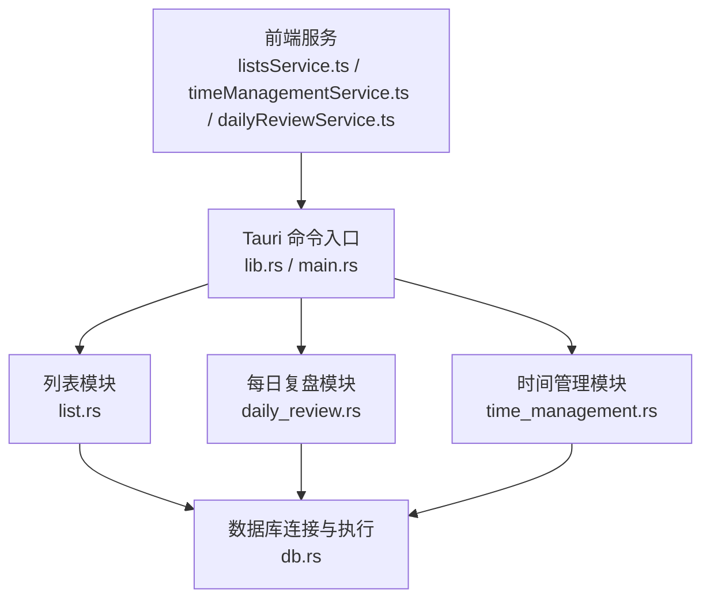
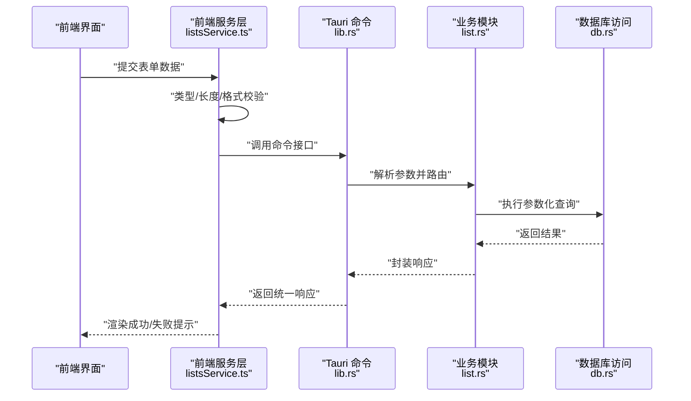
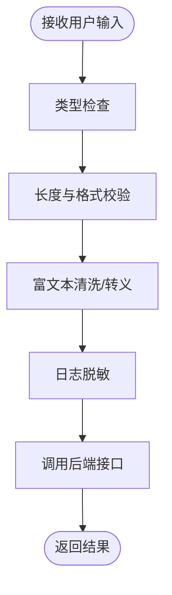
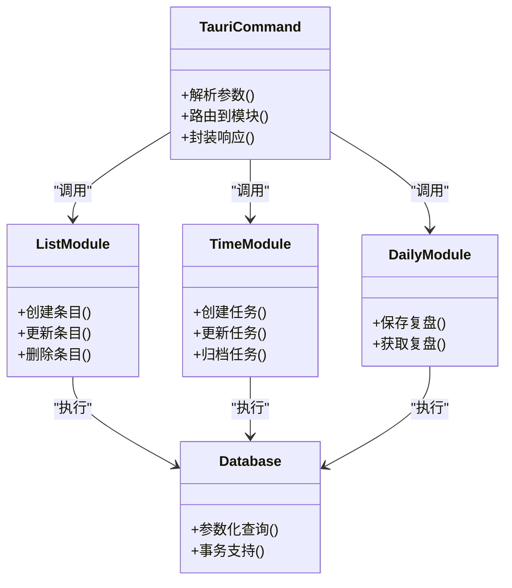
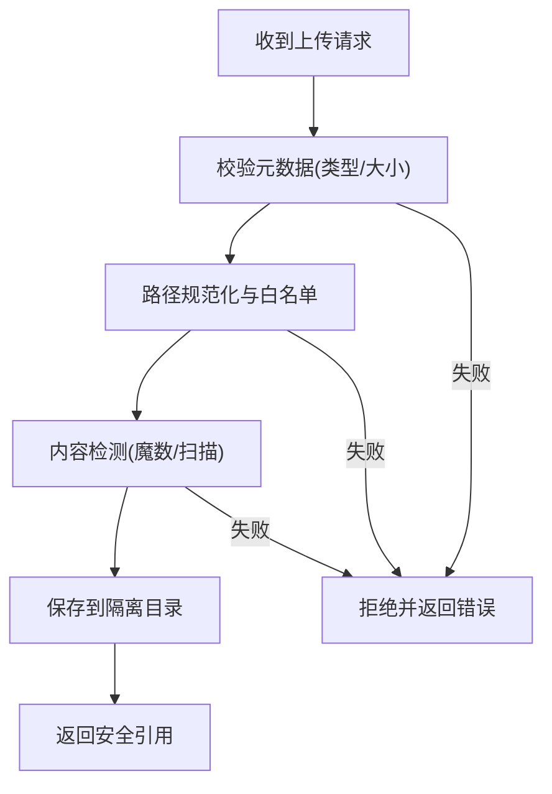
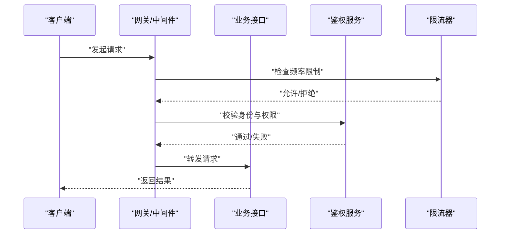
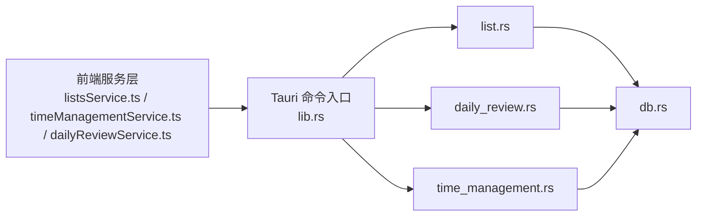

# 输入验证与防护

<cite>
**本文引用的文件**   
- [src-tauri/src/db.rs](file://src-tauri/src/db.rs)
- [src-tauri/src/list.rs](file://src-tauri/src/list.rs)
- [src-tauri/src/daily_review.rs](file://src-tauri/src/daily_review.rs)
- [src-tauri/src/time_management.rs](file://src-tauri/src/time_management.rs)
- [src-tauri/src/lib.rs](file://src-tauri/src/lib.rs)
- [src-tauri/src/main.rs](file://src-tauri/src/main.rs)
- [src/features/lists/listsService.ts](file://src/features/lists/listsService.ts)
- [src/features/time-management/timeManagementService.ts](file://src/features/time-management/timeManagementService.ts)
- [src/features/daily-review/dailyReviewService.ts](file://src/features/daily-review/dailyReviewService.ts)
</cite>

## 目录
1. [简介](#简介)
2. [项目结构](#项目结构)
3. [核心组件](#核心组件)
4. [架构总览](#架构总览)
5. [详细组件分析](#详细组件分析)
6. [依赖分析](#依赖分析)
7. [性能考虑](#性能考虑)
8. [故障排查指南](#故障排查指南)
9. [结论](#结论)
10. [附录](#附录)

## 简介
本安全文档聚焦 FishWorker 的输入验证与安全防护，覆盖前端与后端的输入校验、SQL 注入/XSS/命令注入防护、文件上传安全检查、路径遍历防护、恶意代码检测、API 参数白名单与请求频率限制等。文档同时提供常见漏洞的防护示例与测试方法，并给出安全编码规范与代码审查要点，帮助团队在开发与评审中落地一致的安全实践。

## 项目结构
FishWorker 采用 Tauri 架构：前端基于 React + TypeScript，后端通过 Rust 暴露 API（Tauri Commands）。输入验证与安全控制贯穿前后端边界：
- 前端服务层负责基础类型检查、长度与格式校验、敏感信息脱敏与输出转义。
- 后端 Rust 侧负责强类型解析、数据库访问安全（参数化查询）、资源访问控制与错误处理。

**图示来源**
- [src/features/lists/listsService.ts](file://src/features/lists/listsService.ts)
- [src/features/time-management/timeManagementService.ts](file://src/features/time-management/timeManagementService.ts)
- [src/features/daily-review/dailyReviewService.ts](file://src/features/daily-review/dailyReviewService.ts)
- [src-tauri/src/lib.rs](file://src-tauri/src/lib.rs)
- [src-tauri/src/main.rs](file://src-tauri/src/main.rs)
- [src-tauri/src/list.rs](file://src-tauri/src/list.rs)
- [src-tauri/src/daily_review.rs](file://src-tauri/src/daily_review.rs)
- [src-tauri/src/time_management.rs](file://src-tauri/src/time_management.rs)
- [src-tauri/src/db.rs](file://src-tauri/src/db.rs)

**章节来源**
- [src-tauri/src/lib.rs](file://src-tauri/src/lib.rs)
- [src-tauri/src/main.rs](file://src-tauri/src/main.rs)
- [src/features/lists/listsService.ts](file://src/features/lists/listsService.ts)
- [src/features/time-management/timeManagementService.ts](file://src/features/time-management/timeManagementService.ts)
- [src/features/daily-review/dailyReviewService.ts](file://src/features/daily-review/dailyReviewService.ts)

## 核心组件
- 前端输入验证与服务层
  - 类型与范围校验：对数字、布尔、枚举、日期等字段进行严格类型检查与取值范围约束。
  - 长度与格式校验：对文本字段实施最大长度限制；对邮箱、URL、ID 等使用正则或库函数进行格式校验。
  - 输出转义：渲染富文本或用户生成内容时，确保 HTML 实体转义或使用安全的渲染策略。
  - 日志脱敏：避免记录密码、令牌、密钥等敏感数据。
- 后端 API 与数据库访问
  - 强类型解析：使用 Tauri 命令参数模型与反序列化器进行严格类型校验。
  - 参数化查询：所有 SQL 均使用参数绑定，禁止字符串拼接。
  - 资源访问控制：对文件路径进行规范化与白名单校验，防止路径遍历。
  - 错误处理：对外返回通用错误码与消息，不泄露内部堆栈与数据库细节。

**章节来源**
- [src/features/lists/listsService.ts](file://src/features/lists/listsService.ts)
- [src/features/time-management/timeManagementService.ts](file://src/features/time-management/timeManagementService.ts)
- [src/features/daily-review/dailyReviewService.ts](file://src/features/daily-review/dailyReviewService.ts)
- [src-tauri/src/db.rs](file://src-tauri/src/db.rs)
- [src-tauri/src/list.rs](file://src-tauri/src/list.rs)
- [src-tauri/src/daily_review.rs](file://src-tauri/src/daily_review.rs)
- [src-tauri/src/time_management.rs](file://src-tauri/src/time_management.rs)

## 架构总览
下图展示一次典型的数据写入流程，体现前后端输入验证与数据库安全访问点。

**图示来源**
- [src/features/lists/listsService.ts](file://src/features/lists/listsService.ts)
- [src-tauri/src/lib.rs](file://src-tauri/src/lib.rs)
- [src-tauri/src/list.rs](file://src-tauri/src/list.rs)
- [src-tauri/src/db.rs](file://src-tauri/src/db.rs)

## 详细组件分析

### 前端输入验证机制
- 数据类型检查
  - 对数值型字段进行 Number 类型与区间范围校验，拒绝 NaN、Infinity 与越界值。
  - 对布尔、枚举、日期等使用显式转换与校验，失败则快速返回友好错误。
- 长度与格式限制
  - 文本字段设置最大长度，避免超长输入导致内存或存储异常。
  - 邮箱、URL、ID 等使用正则或内置校验库进行格式验证。
- 富文本与 XSS 防御
  - 对用户输入的富文本内容进行清洗或仅允许白名单标签/属性。
  - 渲染时使用安全的 DOM 操作或框架提供的转义能力，避免直接插入原始 HTML。
- 日志与调试
  - 记录必要的上下文信息，但屏蔽敏感字段（如密码、令牌、密钥）。

**图示来源**
- [src/features/lists/listsService.ts](file://src/features/lists/listsService.ts)
- [src/features/time-management/timeManagementService.ts](file://src/features/time-management/timeManagementService.ts)
- [src/features/daily-review/dailyReviewService.ts](file://src/features/daily-review/dailyReviewService.ts)

**章节来源**
- [src/features/lists/listsService.ts](file://src/features/lists/listsService.ts)
- [src/features/time-management/timeManagementService.ts](file://src/features/time-management/timeManagementService.ts)
- [src/features/daily-review/dailyReviewService.ts](file://src/features/daily-review/dailyReviewService.ts)

### 后端 API 与数据库安全
- 参数白名单与强类型解析
  - 使用 Tauri 命令参数模型定义字段名、类型与可选性，反序列化失败即拒绝请求。
  - 对关键字段进行额外业务规则校验（如状态枚举、时间范围）。
- SQL 注入防护
  - 所有查询使用参数化语句，禁止字符串拼接构造 SQL。
  - 对动态排序/过滤字段使用白名单映射，避免将用户输入直接拼入 ORDER BY/LIMIT。
- 错误处理与最小信息暴露
  - 统一错误响应结构，隐藏内部异常与 SQL 细节。
  - 记录结构化日志用于排障，但不包含敏感数据。

**图示来源**
- [src-tauri/src/lib.rs](file://src-tauri/src/lib.rs)
- [src-tauri/src/list.rs](file://src-tauri/src/list.rs)
- [src-tauri/src/time_management.rs](file://src-tauri/src/time_management.rs)
- [src-tauri/src/daily_review.rs](file://src-tauri/src/daily_review.rs)
- [src-tauri/src/db.rs](file://src-tauri/src/db.rs)

**章节来源**
- [src-tauri/src/lib.rs](file://src-tauri/src/lib.rs)
- [src-tauri/src/list.rs](file://src-tauri/src/list.rs)
- [src-tauri/src/time_management.rs](file://src-tauri/src/time_management.rs)
- [src-tauri/src/daily_review.rs](file://src-tauri/src/daily_review.rs)
- [src-tauri/src/db.rs](file://src-tauri/src/db.rs)

### 文件上传安全检查与路径遍历防护
- 白名单校验
  - 仅允许特定扩展名与 MIME 类型，拒绝可执行脚本与危险后缀。
- 大小与数量限制
  - 单文件大小上限与并发上传数量限制，防止资源耗尽。
- 路径规范化与隔离
  - 使用绝对路径与规范化函数，去除“..”等相对路径片段。
  - 将上传目录限定在受控根目录下，禁止访问系统关键路径。
- 内容检测
  - 对图片进行魔数校验，必要时引入病毒扫描或沙箱预览。
- 命名随机化
  - 使用不可预测的文件名，避免利用文件名推断或覆盖。

[此图为概念流程图，无需图示来源]

### API 安全验证与频率限制
- 参数白名单
  - 明确定义每个接口的必填/可选字段与类型，未声明字段一律忽略。
- 认证与授权
  - 对敏感操作要求身份验证与权限校验，遵循最小权限原则。
- 请求频率限制
  - 针对登录、注册、重置密码等高风险接口实施速率限制（按 IP/用户维度）。
- 输入深度与复杂度限制
  - 限制嵌套对象层级、数组长度与 JSON 体积，防止复杂输入导致的解析开销。

[此图为概念流程图，无需图示来源]

### 常见漏洞防护示例与测试方法
- SQL 注入
  - 防护要点：全部使用参数化查询；动态字段使用白名单映射；禁止拼接用户输入。
  - 测试方法：使用模糊匹配与边界值（含引号、注释符、UNION 片段）进行回归测试；借助静态扫描工具识别潜在拼接点。
- XSS 攻击
  - 防护要点：输出转义；富文本白名单；避免 innerHTML 直插；启用 CSP。
  - 测试方法：注入脚本片段与事件处理器，验证是否被转义或拦截；自动化扫描富文本渲染路径。
- 命令注入
  - 防护要点：避免调用系统命令；必须调用时使用白名单参数与固定命令集。
  - 测试方法：尝试注入分号、管道、反引号等字符，确认不被执行。
- 路径遍历
  - 防护要点：路径规范化；限定根目录；拒绝“..”与符号链接。
  - 测试方法：使用“../”、“%2e%2e%2f”等变体探测访问越界。
- 文件上传
  - 防护要点：类型/大小/内容检测；随机命名；隔离存储。
  - 测试方法：上传可执行文件、畸形图片、超大文件，验证拦截与回退逻辑。
- 频率限制绕过
  - 防护要点：多因子限流（IP+用户+设备指纹）；分布式共享计数。
  - 测试方法：高并发压测与代理轮换，验证限流生效。

[本节为通用指导，无需章节来源]

## 依赖分析
前后端之间的安全边界主要位于 Tauri 命令层与数据库访问层。关键依赖关系如下：

**图示来源**
- [src/features/lists/listsService.ts](file://src/features/lists/listsService.ts)
- [src/features/time-management/timeManagementService.ts](file://src/features/time-management/timeManagementService.ts)
- [src/features/daily-review/dailyReviewService.ts](file://src/features/daily-review/dailyReviewService.ts)
- [src-tauri/src/lib.rs](file://src-tauri/src/lib.rs)
- [src-tauri/src/list.rs](file://src-tauri/src/list.rs)
- [src-tauri/src/daily_review.rs](file://src-tauri/src/daily_review.rs)
- [src-tauri/src/time_management.rs](file://src-tauri/src/time_management.rs)
- [src-tauri/src/db.rs](file://src-tauri/src/db.rs)

**章节来源**
- [src-tauri/src/lib.rs](file://src-tauri/src/lib.rs)
- [src-tauri/src/list.rs](file://src-tauri/src/list.rs)
- [src-tauri/src/daily_review.rs](file://src-tauri/src/daily_review.rs)
- [src-tauri/src/time_management.rs](file://src-tauri/src/time_management.rs)
- [src-tauri/src/db.rs](file://src-tauri/src/db.rs)

## 性能考虑
- 输入校验应在最靠近边界的层尽早失败，减少无效请求进入核心逻辑。
- 数据库参数化查询不仅提升安全性，也能复用执行计划，提高性能。
- 文件上传应异步处理与队列化，避免阻塞主线程与 I/O 瓶颈。
- 限流与缓存结合，降低重复计算与外部依赖压力。

[本节为通用指导，无需章节来源]

## 故障排查指南
- 定位输入校验失败
  - 检查前端服务的类型与格式校验日志，确认错误来源是前端还是后端。
- 数据库问题
  - 查看后端统一错误响应与结构化日志，避免泄露敏感信息。
  - 核对参数化查询的参数绑定是否正确，是否存在动态字段未走白名单。
- 文件上传失败
  - 检查 MIME 类型与魔数检测结果、路径规范化结果与目标目录权限。
- 频率限制误判
  - 核对限流键（IP/用户/设备）与窗口大小，确认是否因代理或 NAT 导致误判。

**章节来源**
- [src-tauri/src/db.rs](file://src-tauri/src/db.rs)
- [src-tauri/src/lib.rs](file://src-tauri/src/lib.rs)

## 结论
FishWorker 的安全防护以“前端先行校验、后端强类型与参数化查询为核心、资源访问白名单与限流兜底”的策略构建。通过严格的输入验证、输出转义、参数化查询、路径规范化与内容检测，可有效抵御 SQL 注入、XSS、命令注入、路径遍历与恶意上传等常见威胁。建议持续集成安全扫描与渗透测试，完善审计日志与告警机制，形成闭环的安全工程体系。

## 附录
- 安全编码规范要点
  - 永远信任边界外的输入；对所有输入进行类型、长度、格式与范围校验。
  - 禁止字符串拼接 SQL；动态字段使用白名单映射。
  - 输出前进行转义；富文本使用白名单与沙箱渲染。
  - 日志脱敏；错误信息最小化暴露。
  - 文件上传白名单、大小限制、内容检测与随机命名。
  - 对高风险接口实施频率限制与幂等设计。
- 代码审查清单
  - 是否新增未校验的用户输入？
  - 是否存在字符串拼接 SQL 或系统命令调用？
  - 是否对富文本输出进行转义或白名单过滤？
  - 文件路径是否经过规范化与根目录限制？
  - 是否对敏感字段进行脱敏与最小权限控制？
  - 是否添加必要的限流与重试/熔断策略？

[本节为通用指导，无需章节来源]