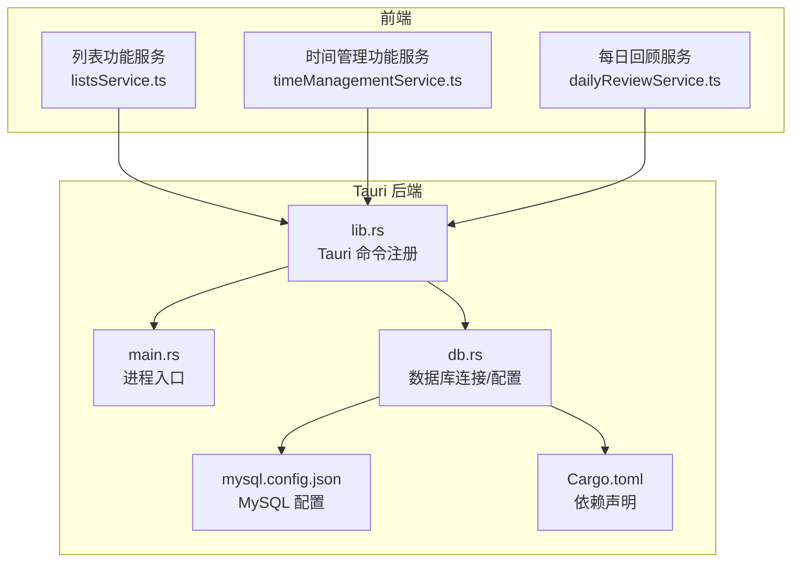
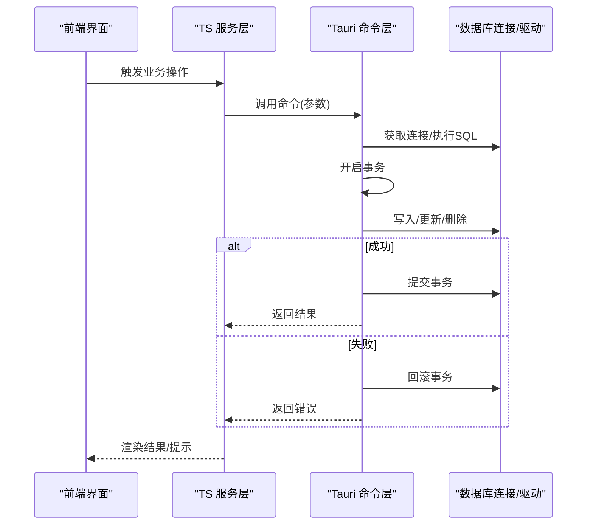
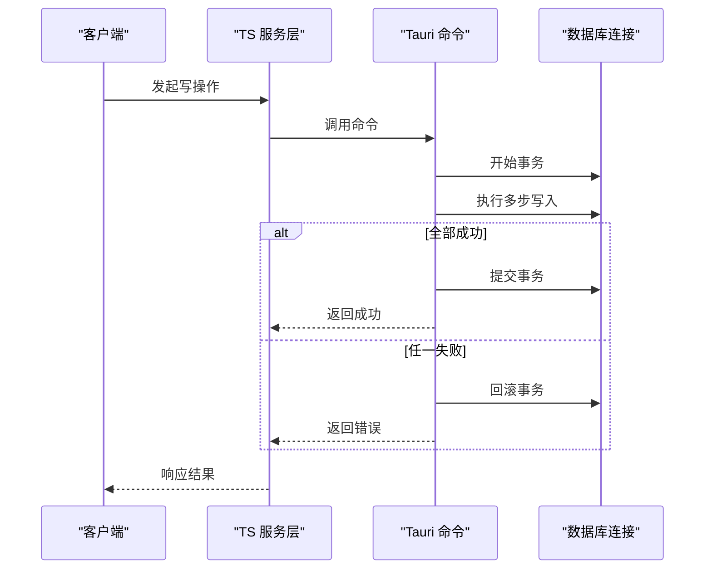
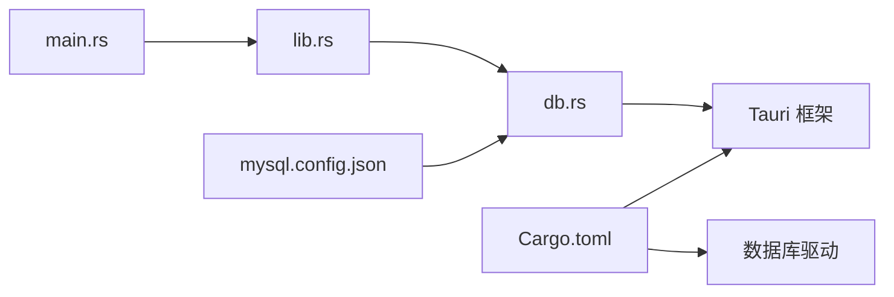

# 事务处理与并发控制

<cite>
**本文引用的文件**   
- [src-tauri/src/db.rs](file://src-tauri/src/db.rs)
- [src-tauri/src/lib.rs](file://src-tauri/src/lib.rs)
- [src-tauri/src/main.rs](file://src-tauri/src/main.rs)
- [src-tauri/Cargo.toml](file://src-tauri/Cargo.toml)
- [src-tauri/mysql.config.json](file://src-tauri/mysql.config.json)
- [src-tauri/tauri.conf.json](file://src-tauri/tauri.conf.json)
- [src/features/lists/listsService.ts](file://src/features/lists/listsService.ts)
- [src/features/time-management/timeManagementService.ts](file://src/features/time-management/timeManagementService.ts)
- [src/features/daily-review/dailyReviewService.ts](file://src/features/daily-review/dailyReviewService.ts)
</cite>

## 目录
1. [简介](#简介)
2. [项目结构](#项目结构)
3. [核心组件](#核心组件)
4. [架构总览](#架构总览)
5. [详细组件分析](#详细组件分析)
6. [依赖关系分析](#依赖关系分析)
7. [性能考虑](#性能考虑)
8. [故障排查指南](#故障排查指南)
9. [结论](#结论)
10. [附录](#附录)

## 简介
本技术文档聚焦 FishWorker 在 Rust 后端的事务处理与并发控制。内容涵盖：
- ACID 特性实现与事务边界定义
- 提交与回滚策略
- 并发访问控制、锁机制与读写锁使用场景
- 跨模块事务协调与分布式事务（如适用）
- 死锁检测与预防、超时处理、资源清理
- 并发安全的数据访问模式与线程间通信
- 事务处理的性能优化技巧、监控指标与故障排查方法
- 复杂业务场景下的事务设计模式与最佳实践

FishWorker 采用 Tauri 架构，前端通过命令调用 Rust 后端，Rust 后端基于数据库驱动进行持久化操作。事务能力由底层数据库驱动提供，应用层负责事务边界划分、错误传播与资源管理。

## 项目结构
与事务和并发相关的核心代码位于 Rust 后端 src-tauri 目录中，主要包括数据库连接与配置、Tauri 命令入口等；前端通过 TypeScript 服务层发起请求，最终落到 Rust 命令处理逻辑。

图表来源
- [src-tauri/src/main.rs](file://src-tauri/src/main.rs)
- [src-tauri/src/lib.rs](file://src-tauri/src/lib.rs)
- [src-tauri/src/db.rs](file://src-tauri/src/db.rs)
- [src-tauri/mysql.config.json](file://src-tauri/mysql.config.json)
- [src-tauri/Cargo.toml](file://src-tauri/Cargo.toml)
- [src/features/lists/listsService.ts](file://src/features/lists/listsService.ts)
- [src/features/time-management/timeManagementService.ts](file://src/features/time-management/timeManagementService.ts)
- [src/features/daily-review/dailyReviewService.ts](file://src/features/daily-review/dailyReviewService.ts)

章节来源
- [src-tauri/src/main.rs](file://src-tauri/src/main.rs)
- [src-tauri/src/lib.rs](file://src-tauri/src/lib.rs)
- [src-tauri/src/db.rs](file://src-tauri/src/db.rs)
- [src-tauri/Cargo.toml](file://src-tauri/Cargo.toml)
- [src-tauri/mysql.config.json](file://src-tauri/mysql.config.json)
- [src/features/lists/listsService.ts](file://src/features/lists/listsService.ts)
- [src/features/time-management/timeManagementService.ts](file://src/features/time-management/timeManagementService.ts)
- [src/features/daily-review/dailyReviewService.ts](file://src/features/daily-review/dailyReviewService.ts)

## 核心组件
- 数据库连接与配置
  - 通过配置文件加载 MySQL 连接参数，建立连接池并暴露给上层命令使用。
  - 关键职责：解析配置、初始化连接池、提供可复用的连接句柄。
- Tauri 命令层
  - 将前端请求映射到具体业务函数，封装事务边界、错误码与返回结构。
  - 关键职责：参数校验、事务开启/提交/回滚、异常捕获与转换。
- 业务命令实现
  - 针对列表、时间管理、每日回顾等功能，组织多条 SQL 或 ORM 调用为原子性单元。
  - 关键职责：业务规则、数据一致性、幂等性与重试策略。

章节来源
- [src-tauri/src/db.rs](file://src-tauri/src/db.rs)
- [src-tauri/src/lib.rs](file://src-tauri/src/lib.rs)
- [src-tauri/Cargo.toml](file://src-tauri/Cargo.toml)
- [src-tauri/mysql.config.json](file://src-tauri/mysql.config.json)

## 架构总览
下图展示了从前端到后端的完整调用链，以及事务在命令层的落点。

图表来源
- [src-tauri/src/lib.rs](file://src-tauri/src/lib.rs)
- [src-tauri/src/db.rs](file://src-tauri/src/db.rs)
- [src/features/lists/listsService.ts](file://src/features/lists/listsService.ts)
- [src/features/time-management/timeManagementService.ts](file://src/features/time-management/timeManagementService.ts)
- [src/features/daily-review/dailyReviewService.ts](file://src/features/daily-review/dailyReviewService.ts)

## 详细组件分析

### 数据库连接与配置（db.rs）
- 职责
  - 读取 MySQL 配置，创建连接池，提供统一访问接口。
  - 为上层命令提供“带事务”的便捷方法或约定。
- 事务相关要点
  - 连接池复用，避免频繁建连导致的开销。
  - 建议以“按命令粒度”开启事务，确保短事务原则。
  - 对长事务进行限制，避免持有锁过久导致阻塞。
- 并发安全
  - 连接池内部已做并发安全封装，上层无需额外加锁。
  - 若存在共享状态，建议使用线程安全的智能指针类型。

章节来源
- [src-tauri/src/db.rs](file://src-tauri/src/db.rs)
- [src-tauri/mysql.config.json](file://src-tauri/mysql.config.json)

### Tauri 命令层（lib.rs）
- 职责
  - 注册命令路由，接收前端参数，编排业务逻辑。
  - 作为事务边界的统一入口，保证一致性与错误传播。
- 事务边界
  - 每个命令对应一个最小原子单元，包含必要的读/写操作。
  - 明确成功路径与失败路径，失败时立即回滚。
- 错误处理
  - 将底层错误转换为统一的业务错误码，便于前端展示与重试判断。
  - 记录必要上下文信息，便于问题定位。

章节来源
- [src-tauri/src/lib.rs](file://src-tauri/src/lib.rs)

### 主进程入口（main.rs）
- 职责
  - 启动 Tauri 应用，初始化日志、配置与插件。
  - 承载全局生命周期钩子（如优雅关闭），用于资源释放。
- 事务相关
  - 不直接参与事务，但需确保进程退出前释放数据库连接等资源。

章节来源
- [src-tauri/src/main.rs](file://src-tauri/src/main.rs)

### 前端服务层（TS）
- 列表功能（listsService.ts）
  - 调用后端命令完成增删改查，必要时组合多个命令形成业务级事务。
- 时间管理（timeManagementService.ts）
  - 批量更新任务状态、计划变更等，注意幂等与冲突解决。
- 每日回顾（dailyReviewService.ts）
  - 汇总统计类操作，通常只读为主，必要时结合缓存减少数据库压力。

章节来源
- [src/features/lists/listsService.ts](file://src/features/lists/listsService.ts)
- [src/features/time-management/timeManagementService.ts](file://src/features/time-management/timeManagementService.ts)
- [src/features/daily-review/dailyReviewService.ts](file://src/features/daily-review/dailyReviewService.ts)

### 事务流程时序图（示例）
以下序列图展示一次典型写操作的端到端流程，包括事务开启、提交与回滚分支。

图表来源
- [src-tauri/src/lib.rs](file://src-tauri/src/lib.rs)
- [src-tauri/src/db.rs](file://src-tauri/src/db.rs)
- [src/features/lists/listsService.ts](file://src/features/lists/listsService.ts)

### 事务边界与提交/回滚策略
- 边界定义
  - 以“用户可见的业务动作”为单位，尽量缩小事务范围。
  - 避免在事务中进行耗时 I/O（如网络请求、文件读写）。
- 提交策略
  - 所有步骤成功后一次性提交，确保原子性。
- 回滚策略
  - 任何一步失败立即回滚，并返回明确的错误码与消息。
  - 对于可重试的错误（如短暂锁等待），可在应用层进行有限次重试。

章节来源
- [src-tauri/src/lib.rs](file://src-tauri/src/lib.rs)
- [src-tauri/src/db.rs](file://src-tauri/src/db.rs)

### 并发访问控制与锁机制
- 连接池并发
  - 使用连接池自动管理并发访问，避免手工加锁带来的复杂性。
- 行级锁与索引
  - 利用数据库的行级锁与唯一索引保障并发安全。
  - 合理设计索引以减少锁竞争与锁升级风险。
- 读写分离
  - 读多写少场景可采用只读副本，降低主库压力。

章节来源
- [src-tauri/src/db.rs](file://src-tauri/src/db.rs)
- [src-tauri/Cargo.toml](file://src-tauri/Cargo.toml)

### 跨模块事务协调与分布式事务
- 单进程内协调
  - 同一进程内的多个命令可通过共享事务上下文协调，但需谨慎设计以避免长事务。
- 分布式事务
  - 若涉及跨服务/跨库，优先考虑异步补偿与最终一致性方案（如事件驱动、出队入队模型）。
  - 强一致性需求下可使用两阶段提交（2PC）或 Saga 模式，但需权衡可用性与复杂度。

章节来源
- [src-tauri/src/lib.rs](file://src-tauri/src/lib.rs)

### 死锁检测与预防、超时与资源清理
- 死锁预防
  - 固定资源访问顺序，避免循环等待。
  - 缩短事务时长，减少锁持有时间。
- 超时处理
  - 设置合理的查询与事务超时，防止长时间阻塞。
- 资源清理
  - 进程退出时主动关闭连接池，释放句柄。
  - 使用 RAII 风格确保异常路径也能正确释放资源。

章节来源
- [src-tauri/src/main.rs](file://src-tauri/src/main.rs)
- [src-tauri/src/db.rs](file://src-tauri/src/db.rs)

### 并发安全的数据访问模式与线程间通信
- 数据访问模式
  - 优先使用连接池提供的并发安全接口，避免共享可变状态。
  - 对必须共享的状态，使用线程安全容器与同步原语。
- 线程间通信
  - 通过消息队列或通道传递变更事件，解耦生产与消费。
  - 使用不可变数据结构配合克隆/引用计数提升并发友好性。

章节来源
- [src-tauri/src/db.rs](file://src-tauri/src/db.rs)
- [src-tauri/src/lib.rs](file://src-tauri/src/lib.rs)

### 事务处理性能优化技巧
- 小事务、快提交
  - 将大事务拆分为多个小事务，减少锁竞争。
- 批量操作
  - 合并多次写入为批量语句，降低往返次数。
- 索引优化
  - 为高频查询与条件字段建立合适索引，减少锁范围。
- 只读优化
  - 使用只读事务或快照隔离提高并发读性能。
- 连接池调优
  - 根据负载调整最大连接数与空闲超时，避免过度分配。

章节来源
- [src-tauri/src/db.rs](file://src-tauri/src/db.rs)
- [src-tauri/Cargo.toml](file://src-tauri/Cargo.toml)

### 监控指标与可观测性
- 关键指标
  - 事务成功率、平均耗时、P95/P99 延迟
  - 连接池使用率、活跃连接数、等待队列长度
  - 锁等待与死锁次数
- 采集方式
  - 在命令层埋点，记录开始/结束时间与错误码。
  - 输出结构化日志，包含请求 ID、事务 ID、关键参数摘要。

章节来源
- [src-tauri/src/lib.rs](file://src-tauri/src/lib.rs)

### 故障排查方法
- 常见问题
  - 连接泄漏：检查连接池上限与关闭路径。
  - 超时：关注慢查询与长事务，优化 SQL 与索引。
  - 死锁：查看数据库死锁日志，调整访问顺序与事务粒度。
- 定位手段
  - 启用详细日志与追踪 ID，关联前后端请求。
  - 使用数据库慢查询日志与性能分析工具定位热点。

章节来源
- [src-tauri/src/main.rs](file://src-tauri/src/main.rs)
- [src-tauri/src/lib.rs](file://src-tauri/src/lib.rs)

### 复杂业务场景的事务设计模式与最佳实践
- 幂等写入
  - 引入幂等键，避免重复提交造成副作用。
- 补偿事务
  - 对失败操作设计反向操作，保证最终一致性。
- 分片与分区
  - 将热点数据分片，降低单表锁竞争。
- 读写分离与缓存
  - 读路径走缓存或只读副本，写路径走主库。

章节来源
- [src/features/time-management/timeManagementService.ts](file://src/features/time-management/timeManagementService.ts)
- [src/features/lists/listsService.ts](file://src/features/lists/listsService.ts)

## 依赖关系分析
Rust 后端依赖通过 Cargo.toml 声明，主要包含 Tauri 框架与数据库驱动。配置通过 mysql.config.json 注入，运行时由 db.rs 加载。

图表来源
- [src-tauri/Cargo.toml](file://src-tauri/Cargo.toml)
- [src-tauri/mysql.config.json](file://src-tauri/mysql.config.json)
- [src-tauri/src/db.rs](file://src-tauri/src/db.rs)
- [src-tauri/src/lib.rs](file://src-tauri/src/lib.rs)
- [src-tauri/src/main.rs](file://src-tauri/src/main.rs)

章节来源
- [src-tauri/Cargo.toml](file://src-tauri/Cargo.toml)
- [src-tauri/mysql.config.json](file://src-tauri/mysql.config.json)
- [src-tauri/src/db.rs](file://src-tauri/src/db.rs)
- [src-tauri/src/lib.rs](file://src-tauri/src/lib.rs)
- [src-tauri/src/main.rs](file://src-tauri/src/main.rs)

## 性能考虑
- 事务粒度
  - 保持事务短小精悍，避免跨模块长事务。
- 批量化
  - 合并写入，减少网络往返与锁竞争。
- 索引与查询
  - 优化 SQL 与索引，减少全表扫描与锁范围。
- 连接池
  - 根据并发量调整连接池大小，避免过多上下文切换。
- 只读路径
  - 使用只读事务或缓存，降低写放大。

[本节为通用指导，不直接分析具体文件]

## 故障排查指南
- 事务未提交/回滚
  - 检查命令层是否正确包裹事务，异常路径是否回滚。
- 连接耗尽
  - 观察连接池指标，确认是否存在连接泄漏或未关闭。
- 超时与慢查询
  - 分析慢查询日志，优化 SQL 与索引，拆分长事务。
- 死锁
  - 查看数据库死锁报告，调整访问顺序与事务边界。

章节来源
- [src-tauri/src/lib.rs](file://src-tauri/src/lib.rs)
- [src-tauri/src/db.rs](file://src-tauri/src/db.rs)
- [src-tauri/src/main.rs](file://src-tauri/src/main.rs)

## 结论
FishWorker 的事务与并发控制以数据库驱动为核心，应用层通过 Tauri 命令层统一编排事务边界、错误处理与资源管理。遵循短事务、幂等、索引优化与连接池调优等实践，可有效提升系统的一致性与性能。对于更复杂的分布式场景，建议采用异步补偿与最终一致性方案，并在关键路径上完善监控与可观测性。

[本节为总结性内容，不直接分析具体文件]

## 附录
- 术语
  - ACID：原子性、一致性、隔离性、持久性
  - 幂等：多次执行与单次执行效果相同
  - 最终一致性：系统在足够时间后达到一致状态
- 参考
  - Tauri 官方文档
  - 数据库驱动文档（连接池、事务、锁行为）

[本节为补充说明，不直接分析具体文件]