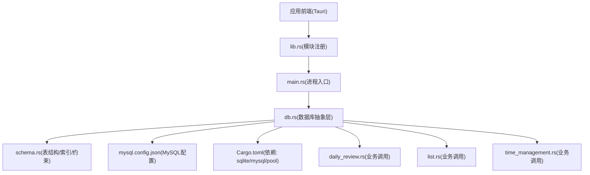
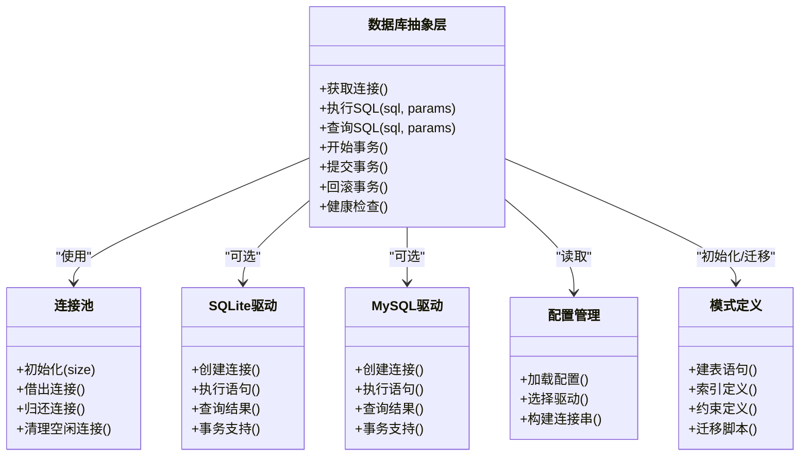
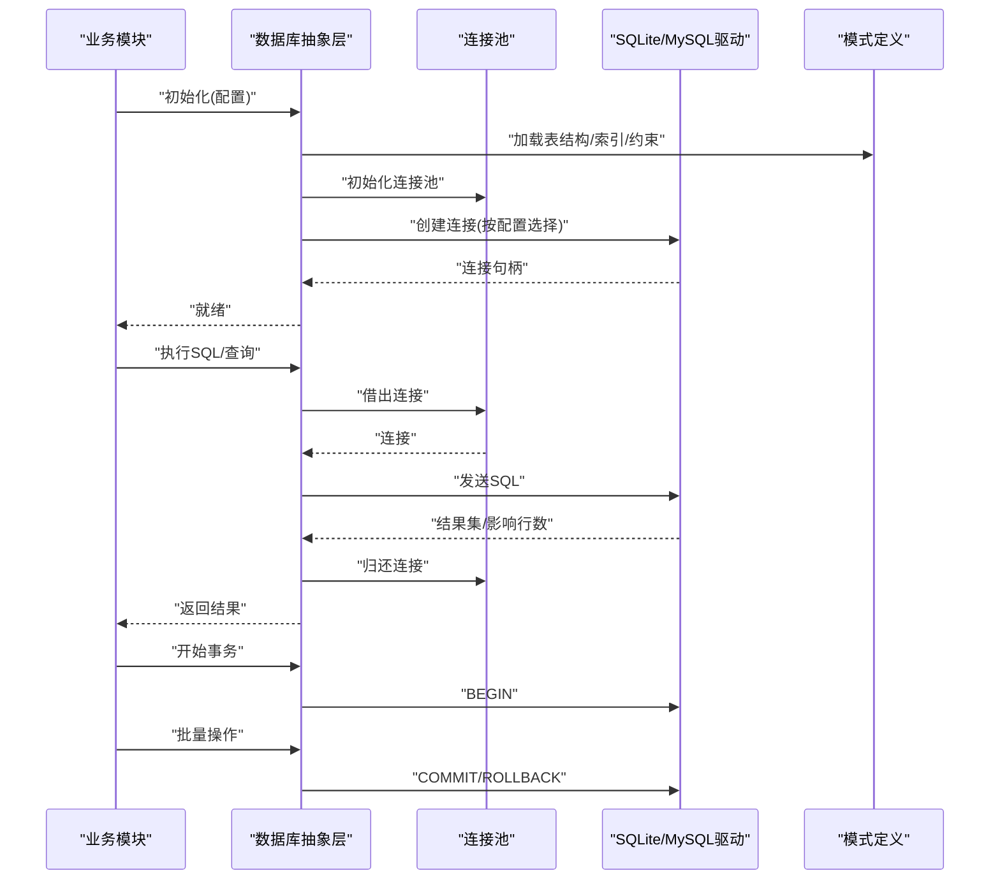
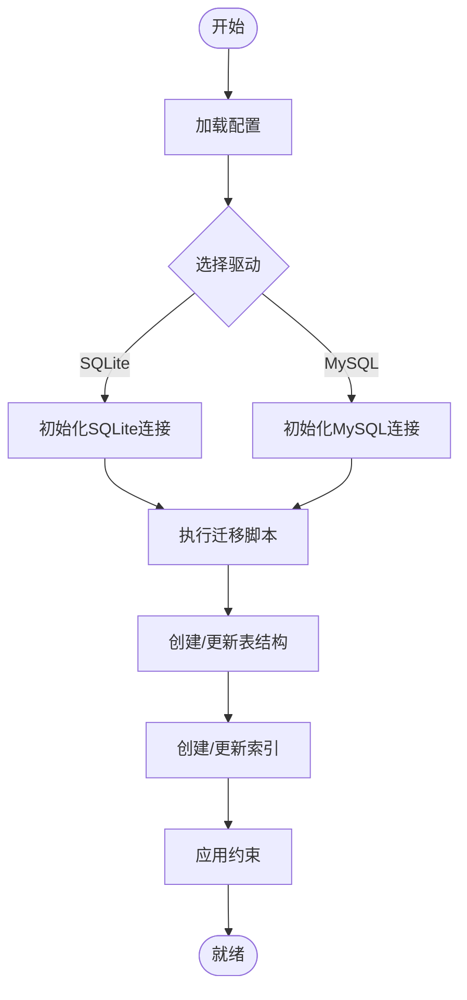
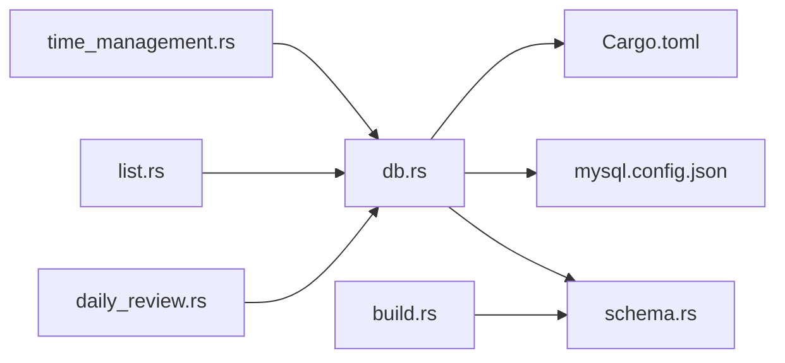

# 数据库层设计

<cite>
**本文引用的文件**   
- [src-tauri/src/db.rs](file://src-tauri/src/db.rs)
- [src-tauri/src/schema.rs](file://src-tauri/src/schema.rs)
- [src-tauri/mysql.config.json](file://src-tauri/mysql.config.json)
- [src-tauri/Cargo.toml](file://src-tauri/Cargo.toml)
- [src-tauri/build.rs](file://src-tauri/build.rs)
- [src-tauri/src/lib.rs](file://src-tauri/src/lib.rs)
- [src-tauri/src/main.rs](file://src-tauri/src/main.rs)
- [src-tauri/src/daily_review.rs](file://src-tauri/src/daily_review.rs)
- [src-tauri/src/list.rs](file://src-tauri/src/list.rs)
- [src-tauri/src/time_management.rs](file://src-tauri/src/time_management.rs)
</cite>

## 目录
1. [简介](#简介)
2. [项目结构](#项目结构)
3. [核心组件](#核心组件)
4. [架构总览](#架构总览)
5. [详细组件分析](#详细组件分析)
6. [依赖分析](#依赖分析)
7. [性能考虑](#性能考虑)
8. [故障排查指南](#故障排查指南)
9. [结论](#结论)
10. [附录](#附录)

## 简介
本设计文档聚焦 FishWorker 的数据库层，围绕 SQLite 与 MySQL 双数据库支持、连接池管理、数据库选择逻辑、表结构与索引优化、事务与并发控制、数据迁移与版本管理、备份恢复、性能优化与监控指标、最佳实践与常见问题展开。目标是帮助开发者快速理解并高效扩展数据库能力。

## 项目结构
数据库相关代码主要位于 Tauri 后端 Rust 工程中：
- db.rs：数据库抽象、连接建立、驱动选择、连接复用与事务封装
- schema.rs：表结构定义、字段类型、约束与索引策略
- mysql.config.json：MySQL 连接配置（主机、端口、用户、密码、库名等）
- Cargo.toml：Rust 依赖声明（SQLite/MySQL 驱动、连接池等）
- build.rs：构建期脚本（可选：生成迁移或校验 schema）
- lib.rs / main.rs：Tauri 入口与模块注册
- daily_review.rs / list.rs / time_management.rs：业务模块对数据库层的调用

图表来源
- [src-tauri/src/lib.rs](file://src-tauri/src/lib.rs)
- [src-tauri/src/main.rs](file://src-tauri/src/main.rs)
- [src-tauri/src/db.rs](file://src-tauri/src/db.rs)
- [src-tauri/src/schema.rs](file://src-tauri/src/schema.rs)
- [src-tauri/mysql.config.json](file://src-tauri/mysql.config.json)
- [src-tauri/Cargo.toml](file://src-tauri/Cargo.toml)
- [src-tauri/src/daily_review.rs](file://src-tauri/src/daily_review.rs)
- [src-tauri/src/list.rs](file://src-tauri/src/list.rs)
- [src-tauri/src/time_management.rs](file://src-tauri/src/time_management.rs)

章节来源
- [src-tauri/src/db.rs](file://src-tauri/src/db.rs)
- [src-tauri/src/schema.rs](file://src-tauri/src/schema.rs)
- [src-tauri/mysql.config.json](file://src-tauri/mysql.config.json)
- [src-tauri/Cargo.toml](file://src-tauri/Cargo.toml)
- [src-tauri/build.rs](file://src-tauri/build.rs)
- [src-tauri/src/lib.rs](file://src-tauri/src/lib.rs)
- [src-tauri/src/main.rs](file://src-tauri/src/main.rs)
- [src-tauri/src/daily_review.rs](file://src-tauri/src/daily_review.rs)
- [src-tauri/src/list.rs](file://src-tauri/src/list.rs)
- [src-tauri/src/time_management.rs](file://src-tauri/src/time_management.rs)

## 核心组件
- 数据库抽象层(db.rs)
  - 统一接口：提供连接获取、查询、执行、事务封装、健康检查等
  - 驱动选择：根据配置动态选择 SQLite 或 MySQL
  - 连接复用：通过连接池实现连接共享与生命周期管理
  - 错误处理：标准化错误类型与重试/回滚策略
- 模式定义(schema.rs)
  - 表结构：实体表、关联表、字典表等
  - 字段定义：主键、外键、唯一性、非空、默认值
  - 索引策略：单列/复合索引、覆盖索引、前缀索引
  - 约束条件：CHECK、UNIQUE、FOREIGN KEY、NOT NULL
- 配置管理(mysql.config.json)
  - MySQL 连接参数：host、port、user、password、database、charset、ssl 等
  - 运行时注入：由 db.rs 读取并构造连接字符串
- 构建期脚本(build.rs)
  - 可选：在构建时生成迁移脚本、校验 schema 一致性、预编译 SQL 模板

章节来源
- [src-tauri/src/db.rs](file://src-tauri/src/db.rs)
- [src-tauri/src/schema.rs](file://src-tauri/src/schema.rs)
- [src-tauri/mysql.config.json](file://src-tauri/mysql.config.json)
- [src-tauri/build.rs](file://src-tauri/build.rs)

## 架构总览
FishWorker 采用“抽象层 + 多驱动”的数据库架构：上层业务仅依赖抽象接口，底层可切换 SQLite 或 MySQL。连接池负责连接复用与并发控制；schema 层集中维护表结构、索引与约束；配置中心提供运行时数据库选择与参数注入。

图表来源
- [src-tauri/src/db.rs](file://src-tauri/src/db.rs)
- [src-tauri/src/schema.rs](file://src-tauri/src/schema.rs)
- [src-tauri/mysql.config.json](file://src-tauri/mysql.config.json)
- [src-tauri/Cargo.toml](file://src-tauri/Cargo.toml)

## 详细组件分析

### 数据库抽象层(db.rs)
- 职责
  - 暴露统一的数据库操作 API
  - 根据配置选择 SQLite 或 MySQL 驱动
  - 管理连接池，确保连接复用与资源释放
  - 封装事务边界，保证 ACID 语义
- 关键流程
  - 启动阶段：加载配置 → 选择驱动 → 初始化连接池 → 执行 schema 初始化/迁移
  - 运行阶段：从连接池借出连接 → 执行 SQL → 归还连接
  - 事务阶段：开启事务 → 批量操作 → 提交或回滚
- 并发与锁
  - SQLite：基于 WAL 模式提升并发读性能，写操作串行化
  - MySQL：行级锁与 InnoDB 事务隔离级别
- 错误处理
  - 统一错误类型：连接失败、SQL 语法错误、约束冲突、超时等
  - 重试策略：网络抖动导致的临时错误可自动重试
  - 日志记录：关键路径埋点，便于问题定位

图表来源
- [src-tauri/src/db.rs](file://src-tauri/src/db.rs)
- [src-tauri/src/schema.rs](file://src-tauri/src/schema.rs)
- [src-tauri/mysql.config.json](file://src-tauri/mysql.config.json)

章节来源
- [src-tauri/src/db.rs](file://src-tauri/src/db.rs)

### 模式定义(schema.rs)
- 表结构设计
  - 实体表：如任务、习惯、清单、笔记等
  - 关联表：多对多关系映射
  - 字典表：枚举值、分类、标签等
- 字段定义
  - 主键：自增或 UUID
  - 外键：引用其他表主键，保证参照完整性
  - 唯一性：UNIQUE 约束避免重复
  - 非空：NOT NULL 保障必填字段
  - 默认值：减少应用层默认逻辑
- 索引优化
  - 单列索引：高频过滤字段
  - 复合索引：联合查询条件
  - 覆盖索引：避免回表
  - 前缀索引：长文本字段选择性高部分
- 约束条件
  - CHECK：业务规则校验
  - FOREIGN KEY：跨表一致性
  - UNIQUE/NOT NULL：数据质量保障
- 迁移策略
  - 版本化迁移脚本：增量变更、幂等执行
  - 回滚脚本：支持降级
  - 构建期校验：build.rs 检查 schema 一致性

图表来源
- [src-tauri/src/schema.rs](file://src-tauri/src/schema.rs)
- [src-tauri/build.rs](file://src-tauri/build.rs)

章节来源
- [src-tauri/src/schema.rs](file://src-tauri/src/schema.rs)

### 配置管理(mysql.config.json)
- 内容要点
  - 连接参数：host、port、user、password、database、charset、ssl_mode
  - 连接池参数：最大连接数、最小空闲连接、连接超时
  - 驱动开关：sqlite_path、use_mysql 等
- 安全建议
  - 敏感信息加密存储
  - 环境变量注入
  - 权限最小化原则

章节来源
- [src-tauri/mysql.config.json](file://src-tauri/mysql.config.json)

### 依赖与构建(Cargo.toml / build.rs)
- 依赖
  - SQLite 驱动：rusqlite/sqlx-sqlite
  - MySQL 驱动：mysql_async/sqlx-mysql
  - 连接池：deadpool/rbatis/sqlx-pool
  - 序列化/配置：serde/toml/json
- 构建期脚本
  - 生成迁移脚本
  - 校验 schema 一致性
  - 预编译 SQL 模板

章节来源
- [src-tauri/Cargo.toml](file://src-tauri/Cargo.toml)
- [src-tauri/build.rs](file://src-tauri/build.rs)

### 业务模块集成(daily_review.rs / list.rs / time_management.rs)
- 调用方式
  - 通过 db.rs 提供的统一接口进行 CRUD
  - 使用事务封装复杂业务逻辑
  - 利用索引与查询优化提升性能
- 示例路径
  - [daily_review.rs](file://src-tauri/src/daily_review.rs)
  - [list.rs](file://src-tauri/src/list.rs)
  - [time_management.rs](file://src-tauri/src/time_management.rs)

章节来源
- [src-tauri/src/daily_review.rs](file://src-tauri/src/daily_review.rs)
- [src-tauri/src/list.rs](file://src-tauri/src/list.rs)
- [src-tauri/src/time_management.rs](file://src-tauri/src/time_management.rs)

## 依赖分析
- 直接依赖
  - db.rs 依赖 schema.rs、mysql.config.json、Cargo.toml 中的驱动与连接池
  - 业务模块依赖 db.rs 的统一接口
- 间接依赖
  - 构建期脚本依赖 schema 定义与迁移脚本
- 潜在循环依赖
  - 避免业务模块反向依赖 db.rs 内部实现细节
- 外部集成点
  - SQLite 文件存储
  - MySQL 服务端

图表来源
- [src-tauri/src/daily_review.rs](file://src-tauri/src/daily_review.rs)
- [src-tauri/src/list.rs](file://src-tauri/src/list.rs)
- [src-tauri/src/time_management.rs](file://src-tauri/src/time_management.rs)
- [src-tauri/src/db.rs](file://src-tauri/src/db.rs)
- [src-tauri/src/schema.rs](file://src-tauri/src/schema.rs)
- [src-tauri/mysql.config.json](file://src-tauri/mysql.config.json)
- [src-tauri/Cargo.toml](file://src-tauri/Cargo.toml)
- [src-tauri/build.rs](file://src-tauri/build.rs)

章节来源
- [src-tauri/src/db.rs](file://src-tauri/src/db.rs)
- [src-tauri/src/schema.rs](file://src-tauri/src/schema.rs)
- [src-tauri/mysql.config.json](file://src-tauri/mysql.config.json)
- [src-tauri/Cargo.toml](file://src-tauri/Cargo.toml)
- [src-tauri/build.rs](file://src-tauri/build.rs)

## 性能考虑
- 连接池调优
  - 最大连接数：根据 CPU 核数与 IO 负载调整
  - 最小空闲连接：预热连接，降低冷启动延迟
  - 连接超时：避免长时间占用
- 查询优化
  - 合理使用索引：避免全表扫描
  - 分页查询：LIMIT/OFFSET 或游标分页
  - 避免 N+1 查询：批量加载与 JOIN
- 事务优化
  - 缩小事务范围：减少锁持有时间
  - 批量写入：合并小事务
- 监控指标
  - 连接池使用率、等待队列长度
  - 慢查询统计、错误率、响应时间分位
  - 磁盘 IO 与网络 IO 指标

[本节为通用指导，不直接分析具体文件]

## 故障排查指南
- 连接失败
  - 检查配置文件与网络连通性
  - 验证用户名/密码/库名
  - 查看驱动日志与错误码
- 事务异常
  - 确认事务边界是否正确
  - 检查死锁与超时设置
  - 回滚后重试策略
- 性能问题
  - 启用 EXPLAIN 分析执行计划
  - 检查缺失索引或索引失效
  - 监控连接池与慢查询
- 备份恢复
  - SQLite：直接复制文件或使用内置命令
  - MySQL：使用 mysqldump 或备份工具
  - 恢复后校验数据一致性

章节来源
- [src-tauri/src/db.rs](file://src-tauri/src/db.rs)
- [src-tauri/mysql.config.json](file://src-tauri/mysql.config.json)

## 结论
FishWorker 的数据库层通过抽象层与多驱动架构实现了 SQLite 与 MySQL 的双数据库支持，结合连接池、事务封装与完善的 schema 管理，提供了稳定、可扩展的数据访问能力。建议在后续迭代中持续优化索引与查询、完善监控与告警、强化备份恢复流程，以提升系统整体可靠性与性能。

[本节为总结性内容，不直接分析具体文件]

## 附录
- 最佳实践
  - 统一错误处理与日志记录
  - 严格遵循事务边界与锁粒度
  - 使用迁移脚本管理版本演进
  - 定期审查索引与查询计划
- 常见问题解决方案
  - 连接泄漏：确保连接归还与超时回收
  - 死锁：调整事务顺序与锁粒度
  - 数据不一致：加强约束与校验逻辑

[本节为通用指导，不直接分析具体文件]