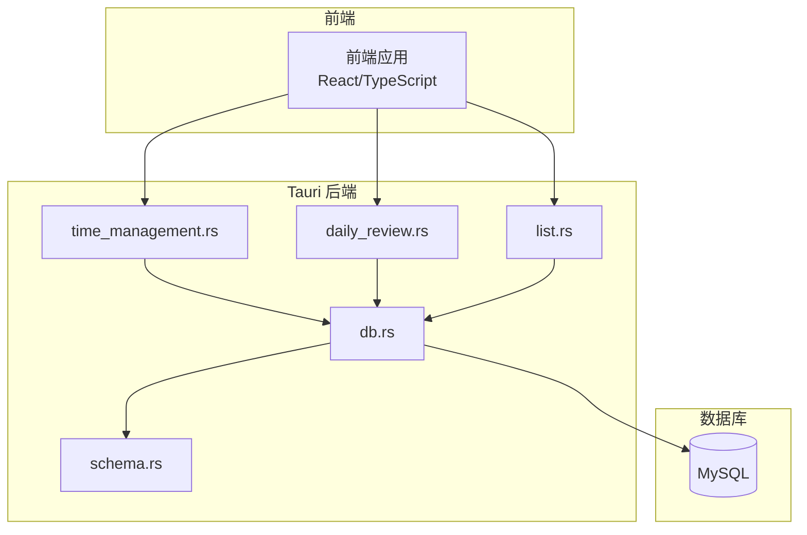
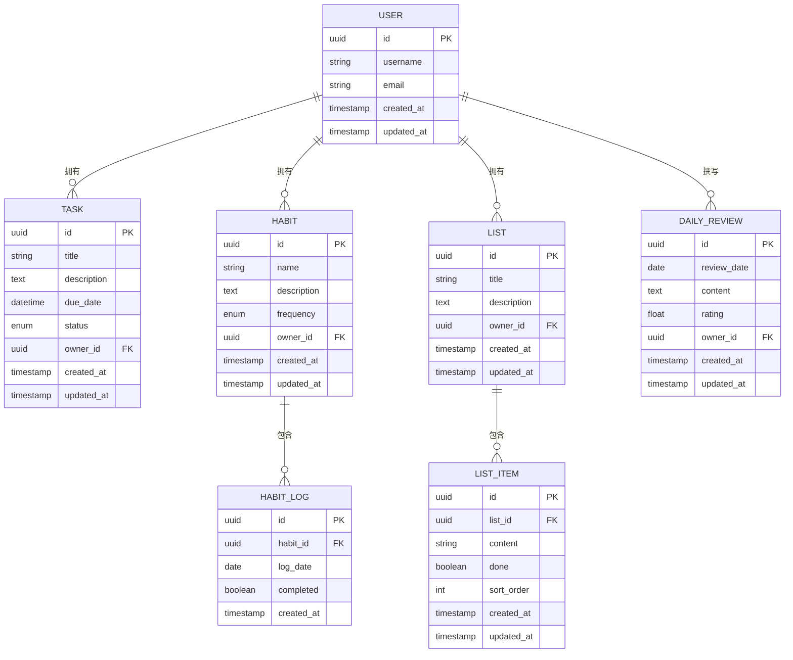
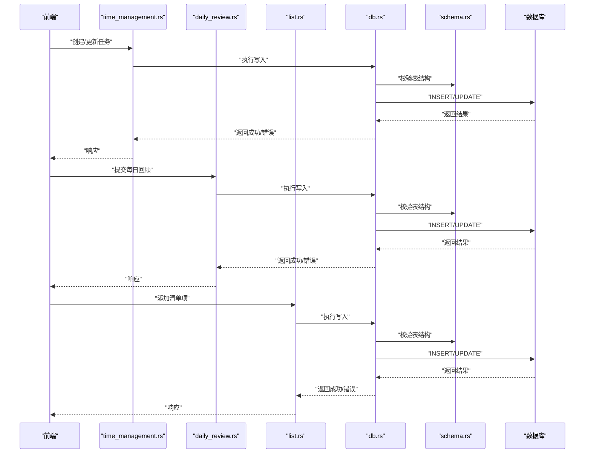
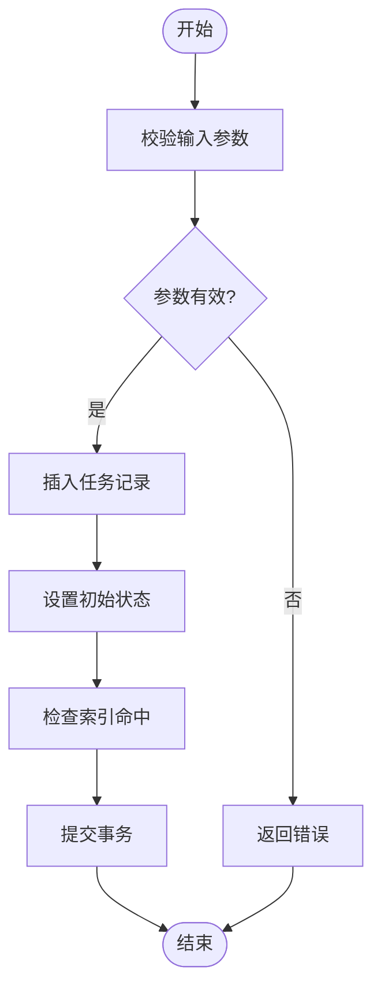
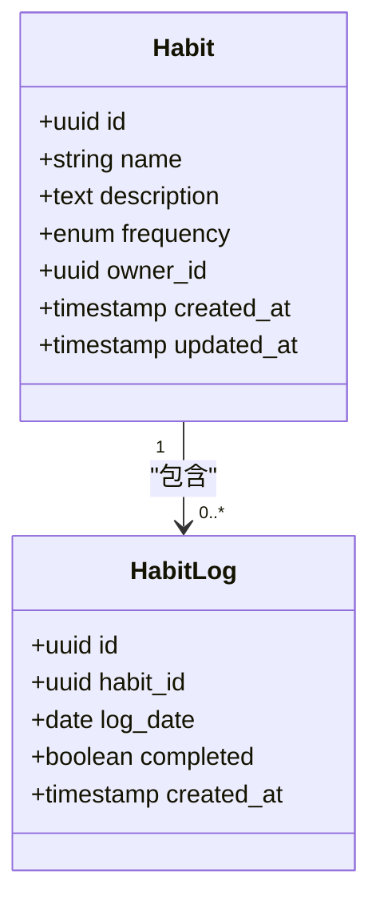
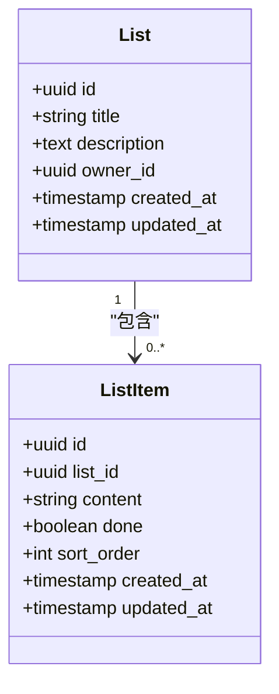
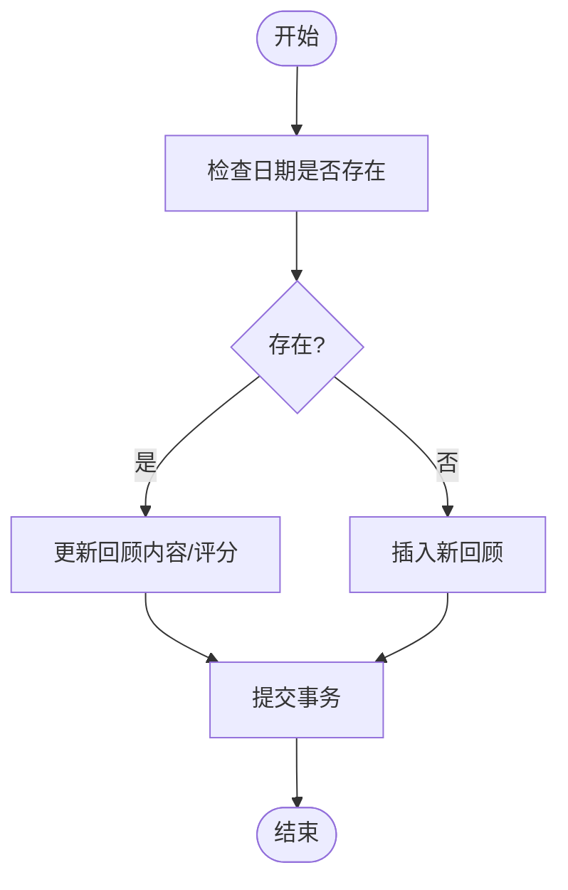
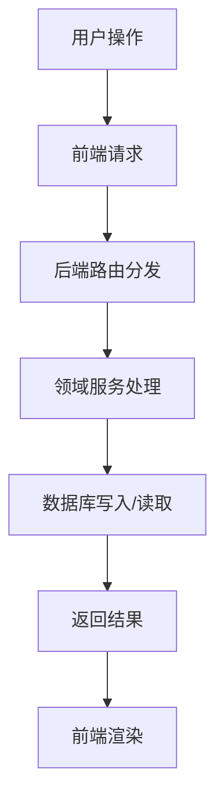
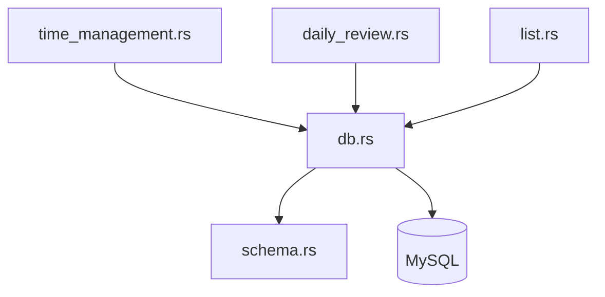

# 数据库表结构设计

<cite>
**本文引用的文件**   
- [schema.rs](file://src-tauri/src/schema.rs)
- [db.rs](file://src-tauri/src/db.rs)
- [time_management.rs](file://src-tauri/src/time_management.rs)
- [daily_review.rs](file://src-tauri/src/daily_review.rs)
- [list.rs](file://src-tauri/src/list.rs)
</cite>

## 目录
1. [引言](#引言)
2. [项目结构](#项目结构)
3. [核心组件](#核心组件)
4. [架构总览](#架构总览)
5. [详细组件分析](#详细组件分析)
6. [依赖分析](#依赖分析)
7. [性能考虑](#性能考虑)
8. [故障排查指南](#故障排查指南)
9. [结论](#结论)
10. [附录](#附录)

## 引言
本设计文档聚焦 FishWorker 的数据库表结构，基于后端 Rust 模块中的 schema 定义与数据访问层实现，系统化梳理时间管理、习惯追踪、清单管理与每日回顾等核心功能的数据模型。文档涵盖：
- 所有数据表的字段类型、约束条件与索引设计
- 表间关联关系、外键约束与数据完整性保证
- 时间管理、习惯追踪、清单管理、每日回顾的数据模型说明
- 版本演进历史、迁移策略与向后兼容性考量
- 表结构优化建议与查询性能调优方案
- 典型数据操作示例与 SQL 查询模式（以概念性描述为主）

## 项目结构
FishWorker 采用 Tauri + Rust 后端 + TypeScript 前端的混合架构。数据库相关逻辑集中在 src-tauri 目录下：
- schema.rs：定义数据库表结构与字段约束
- db.rs：封装数据库连接、初始化与通用操作
- time_management.rs：时间管理领域的数据访问与业务逻辑
- daily_review.rs：每日回顾领域的数据访问与业务逻辑
- list.rs：清单管理领域的数据访问与业务逻辑

图表来源
- [schema.rs](file://src-tauri/src/schema.rs)
- [db.rs](file://src-tauri/src/db.rs)
- [time_management.rs](file://src-tauri/src/time_management.rs)
- [daily_review.rs](file://src-tauri/src/daily_review.rs)
- [list.rs](file://src-tauri/src/list.rs)

章节来源
- [schema.rs](file://src-tauri/src/schema.rs)
- [db.rs](file://src-tauri/src/db.rs)
- [time_management.rs](file://src-tauri/src/time_management.rs)
- [daily_review.rs](file://src-tauri/src/daily_review.rs)
- [list.rs](file://src-tauri/src/list.rs)

## 核心组件
本节概述各功能域的核心数据表及其职责：
- 时间管理：任务、日程、周计划、时间段划分等
- 习惯追踪：习惯定义、打卡记录、统计聚合
- 清单管理：清单、清单项、分组、模板等
- 每日回顾：回顾条目、标签、评分、附件引用等

为便于理解，以下给出概念性的实体关系图（ERD），用于展示表间关联与主外键关系。

说明
- 上述 ERD 为概念模型，具体字段与约束以 schema.rs 为准
- 主键统一使用 UUID，便于分布式与离线场景
- 时间戳字段用于审计与排序
- 状态与枚举字段用于表达业务语义

章节来源
- [schema.rs](file://src-tauri/src/schema.rs)

## 架构总览
从数据流角度，前端通过 Tauri 调用后端 API，后端根据领域模块（time_management、daily_review、list）执行数据访问，最终由 db.rs 与 schema.rs 定义的表结构完成持久化。

图表来源
- [time_management.rs](file://src-tauri/src/time_management.rs)
- [daily_review.rs](file://src-tauri/src/daily_review.rs)
- [list.rs](file://src-tauri/src/list.rs)
- [db.rs](file://src-tauri/src/db.rs)
- [schema.rs](file://src-tauri/src/schema.rs)

## 详细组件分析

### 时间管理数据模型
- 任务表：包含标题、描述、截止时间、状态、所有者、时间戳等
- 周计划表：按周维度组织任务或目标，支持周期性规划
- 时间段划分：将一天划分为若干时段，辅助时间块管理

关键设计要点
- 状态机：任务状态包括待办、进行中、已完成、已取消等
- 时间范围：due_date 与 created_at/updated_at 共同支撑排序与筛选
- 索引策略：对 due_date、status、owner_id 建立索引以提升查询性能

图表来源
- [time_management.rs](file://src-tauri/src/time_management.rs)
- [schema.rs](file://src-tauri/src/schema.rs)

章节来源
- [time_management.rs](file://src-tauri/src/time_management.rs)
- [schema.rs](file://src-tauri/src/schema.rs)

### 习惯追踪数据模型
- 习惯定义表：名称、描述、频率（日/周/月）、所有者、时间戳
- 打卡日志表：habit_id、日期、是否完成、时间戳
- 统计聚合：可按日/周/月汇总完成率，驱动可视化面板

关键设计要点
- 唯一性约束：同一用户同一天仅允许一条打卡记录
- 外键约束：habit_log.habit_id 引用 habit.id，确保数据一致性
- 索引策略：对 habit_id、log_date 建立复合索引，提升按习惯与日期查询效率

图表来源
- [schema.rs](file://src-tauri/src/schema.rs)

章节来源
- [schema.rs](file://src-tauri/src/schema.rs)

### 清单管理数据模型
- 清单表：标题、描述、所有者、时间戳
- 清单项表：内容、完成状态、排序顺序、所属清单、时间戳
- 分组与模板：支持将清单归类与复用模板

关键设计要点
- 排序字段：sort_order 用于维护显示顺序
- 外键约束：list_item.list_id 引用 list.id
- 索引策略：对 list_id、done、sort_order 建立索引，优化列表渲染与筛选

图表来源
- [schema.rs](file://src-tauri/src/schema.rs)

章节来源
- [schema.rs](file://src-tauri/src/schema.rs)

### 每日回顾数据模型
- 回顾表：日期、内容、评分、所有者、时间戳
- 标签与附件：可选扩展字段，支持回顾内容的结构化与多媒体引用

关键设计要点
- 唯一性约束：review_date 与 owner_id 组合唯一，避免重复
- 索引策略：对 review_date、owner_id 建立索引，加速按日期与用户检索
- 文本存储：content 字段适合长文本，必要时可引入全文索引

图表来源
- [daily_review.rs](file://src-tauri/src/daily_review.rs)
- [schema.rs](file://src-tauri/src/schema.rs)

章节来源
- [daily_review.rs](file://src-tauri/src/daily_review.rs)
- [schema.rs](file://src-tauri/src/schema.rs)

### 概念性概览
以下为概念性流程，不直接映射到具体源码文件，用于帮助理解整体数据流转。

## 依赖分析
后端模块之间的依赖关系如下：
- time_management.rs、daily_review.rs、list.rs 均依赖 db.rs 进行数据库操作
- db.rs 依赖 schema.rs 提供的表结构定义，确保 SQL 与表结构一致
- 外部依赖为 MySQL 数据库

图表来源
- [time_management.rs](file://src-tauri/src/time_management.rs)
- [daily_review.rs](file://src-tauri/src/daily_review.rs)
- [list.rs](file://src-tauri/src/list.rs)
- [db.rs](file://src-tauri/src/db.rs)
- [schema.rs](file://src-tauri/src/schema.rs)

章节来源
- [time_management.rs](file://src-tauri/src/time_management.rs)
- [daily_review.rs](file://src-tauri/src/daily_review.rs)
- [list.rs](file://src-tauri/src/list.rs)
- [db.rs](file://src-tauri/src/db.rs)
- [schema.rs](file://src-tauri/src/schema.rs)

## 性能考虑
- 索引设计
  - 高频查询字段应建立单列或复合索引，如 due_date、status、owner_id、habit_id、log_date、list_id、done、sort_order、review_date
  - 复合索引需遵循最左前缀原则，避免冗余索引
- 查询优化
  - 使用覆盖索引减少回表
  - 分页查询时结合排序字段，避免全表扫描
  - 对大文本字段（如 content）避免在 WHERE 中直接使用，必要时引入全文索引或搜索引擎
- 事务与锁
  - 批量写入时使用事务，减少 IO 开销
  - 高并发场景下注意行级锁竞争，合理拆分写入路径
- 缓存策略
  - 热点数据（如用户偏好、常用清单）可引入内存缓存
  - 定期统计指标（如习惯完成率）可预计算并缓存

## 故障排查指南
- 连接问题
  - 检查 db.rs 的连接配置与网络可达性
  - 确认 MySQL 服务状态与权限
- 表结构不一致
  - 对比 schema.rs 与实际数据库结构，确保迁移脚本已执行
  - 出现字段缺失或类型不符时，优先回滚至稳定版本并重新迁移
- 外键约束失败
  - 检查父表记录是否存在
  - 确认删除顺序，避免先删子表再删父表
- 索引失效
  - 检查查询条件是否符合索引最左前缀
  - 使用 EXPLAIN 分析执行计划，识别全表扫描

章节来源
- [db.rs](file://src-tauri/src/db.rs)
- [schema.rs](file://src-tauri/src/schema.rs)

## 结论
FishWorker 的数据库设计围绕时间管理、习惯追踪、清单管理与每日回顾四大核心功能展开，采用清晰的实体关系与合理的索引策略，保障数据完整性与查询性能。建议在后续迭代中持续监控慢查询与索引命中率，逐步完善统计与缓存机制，进一步提升用户体验。

## 附录

### 表结构版本演进与迁移策略
- 版本控制
  - 每次表结构变更对应一个迁移脚本，保持向前兼容
  - 新增字段默认允许 NULL 并提供默认值，避免破坏现有查询
- 迁移步骤
  - 编写迁移脚本（增/改/删字段、索引、外键）
  - 在测试环境验证迁移脚本幂等性与回滚能力
  - 在生产环境分阶段发布，观察错误率与性能指标
- 向后兼容
  - 废弃字段保留一段时间，逐步清理
  - 接口层提供兼容字段映射，平滑过渡

章节来源
- [schema.rs](file://src-tauri/src/schema.rs)
- [db.rs](file://src-tauri/src/db.rs)

### 典型数据操作示例与 SQL 查询模式（概念性）
- 插入任务
  - 向任务表插入新记录，设置初始状态与时间戳
- 更新任务状态
  - 根据任务 ID 更新状态字段，触发索引更新
- 查询本周任务
  - 基于 due_date 与 status 过滤，结合 owner_id 限定范围
- 打卡习惯
  - 插入 habit_log 记录，若当天已存在则更新 completed 状态
- 添加清单项
  - 向 list_item 插入新项，设置 sort_order 与默认完成状态
- 提交每日回顾
  - 根据 review_date 与 owner_id 判断更新或插入

章节来源
- [time_management.rs](file://src-tauri/src/time_management.rs)
- [daily_review.rs](file://src-tauri/src/daily_review.rs)
- [list.rs](file://src-tauri/src/list.rs)
- [schema.rs](file://src-tauri/src/schema.rs)