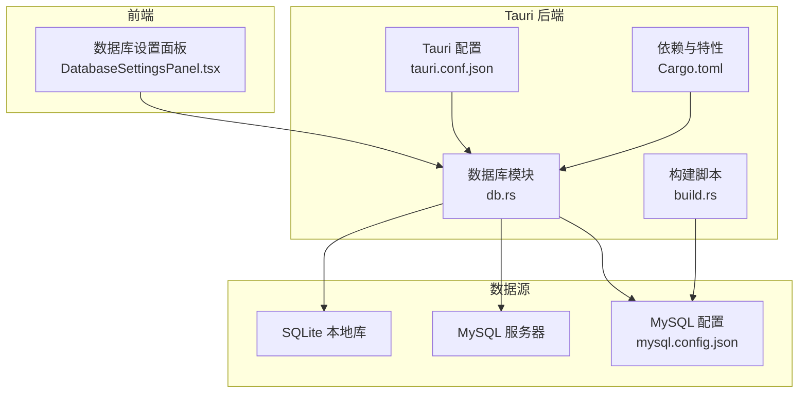
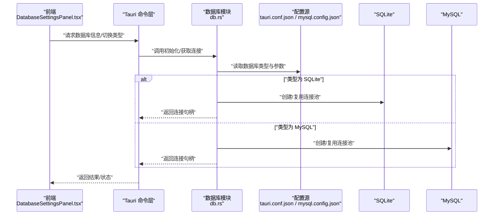
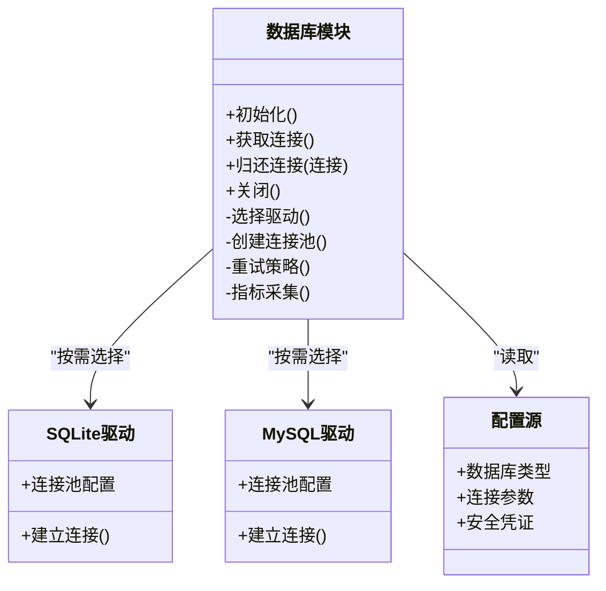
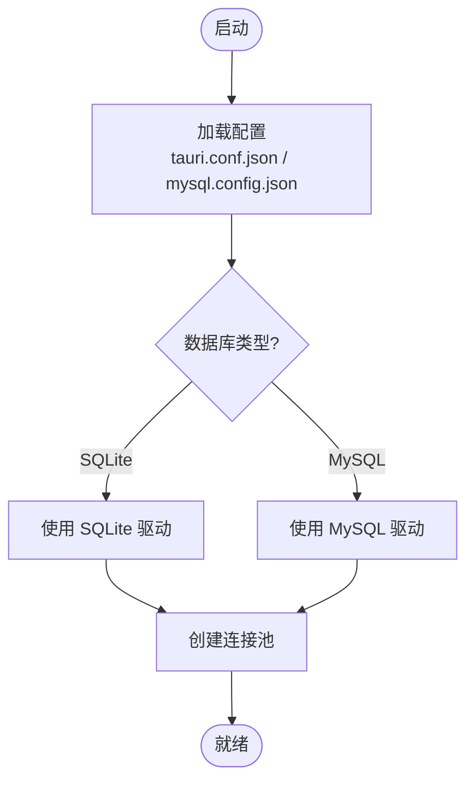
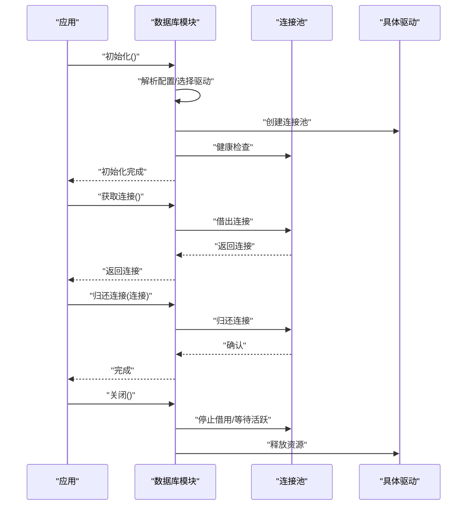
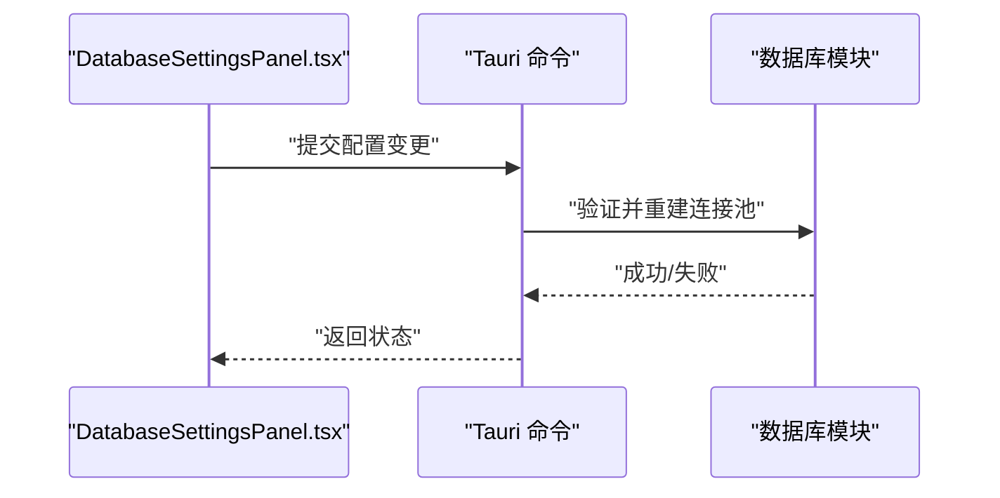
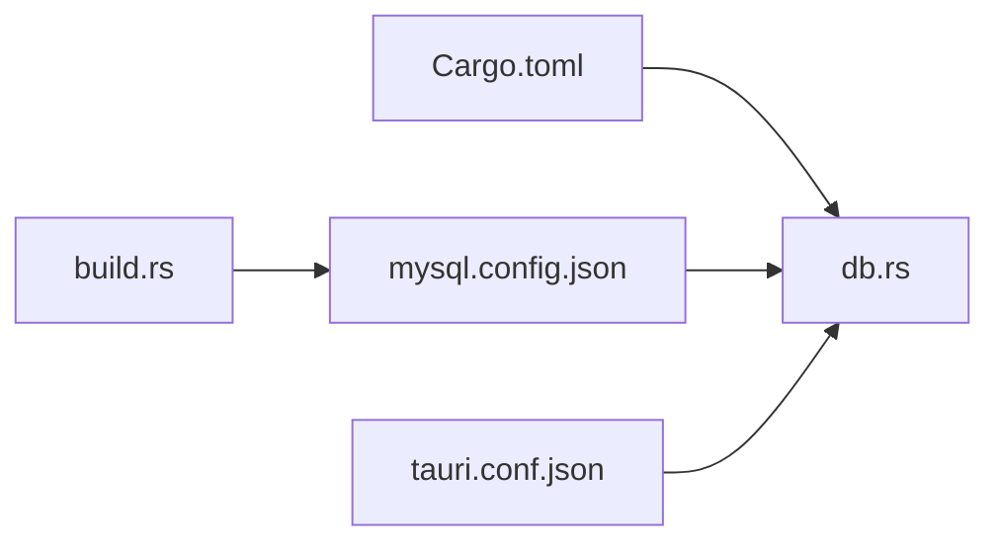

# 数据库连接管理

<cite>
**本文引用的文件**   
- [src-tauri/src/db.rs](file://src-tauri/src/db.rs)
- [src-tauri/mysql.config.json](file://src-tauri/mysql.config.json)
- [src-tauri/Cargo.toml](file://src-tauri/Cargo.toml)
- [src-tauri/build.rs](file://src-tauri/build.rs)
- [src-tauri/tauri.conf.json](file://src-tauri/tauri.conf.json)
- [src/features/settings/components/DatabaseSettingsPanel.tsx](file://src/features/settings/components/DatabaseSettingsPanel.tsx)
</cite>

## 目录
1. [简介](#简介)
2. [项目结构](#项目结构)
3. [核心组件](#核心组件)
4. [架构总览](#架构总览)
5. [详细组件分析](#详细组件分析)
6. [依赖关系分析](#依赖关系分析)
7. [性能与监控](#性能与监控)
8. [故障排查指南](#故障排查指南)
9. [结论](#结论)
10. [附录](#附录)

## 简介
本技术文档聚焦 FishWorker 的数据库连接管理，围绕 SQLite 与 MySQL 双数据库支持进行系统化说明。内容涵盖：
- 连接池配置、连接复用策略与生命周期管理
- 基于配置的动态数据库类型选择逻辑
- 连接建立流程、初始化顺序、错误处理与重试机制
- 配置文件结构与环境变量支持、安全配置管理
- 连接监控、性能指标收集与连接泄漏检测
- 最佳实践与常见问题解决方案

## 项目结构
FishWorker 采用 Tauri 架构，后端 Rust 负责数据库访问，前端通过 Tauri 命令调用后端能力。数据库相关的关键位置如下：
- 后端数据库实现与初始化：src-tauri/src/db.rs
- MySQL 外部配置：src-tauri/mysql.config.json
- 构建期资源注入（用于将配置文件打包进应用）：src-tauri/build.rs
- 运行时配置入口（Tauri 应用配置）：src-tauri/tauri.conf.json
- 依赖声明（Rust crate 与特性开关）：src-tauri/Cargo.toml
- 前端数据库设置面板（用于触发或展示数据库配置变更）：src/features/settings/components/DatabaseSettingsPanel.tsx

图表来源
- [src-tauri/src/db.rs](file://src-tauri/src/db.rs)
- [src-tauri/mysql.config.json](file://src-tauri/mysql.config.json)
- [src-tauri/build.rs](file://src-tauri/build.rs)
- [src-tauri/tauri.conf.json](file://src-tauri/tauri.conf.json)
- [src-tauri/Cargo.toml](file://src-tauri/Cargo.toml)
- [src/features/settings/components/DatabaseSettingsPanel.tsx](file://src/features/settings/components/DatabaseSettingsPanel.tsx)

章节来源
- [src-tauri/src/db.rs](file://src-tauri/src/db.rs)
- [src-tauri/mysql.config.json](file://src-tauri/mysql.config.json)
- [src-tauri/build.rs](file://src-tauri/build.rs)
- [src-tauri/tauri.conf.json](file://src-tauri/tauri.conf.json)
- [src-tauri/Cargo.toml](file://src-tauri/Cargo.toml)
- [src/features/settings/components/DatabaseSettingsPanel.tsx](file://src/features/settings/components/DatabaseSettingsPanel.tsx)

## 核心组件
- 数据库模块（db.rs）
  - 负责数据库驱动加载、连接池创建、连接获取与释放、错误封装与日志记录
  - 提供统一的数据库抽象接口，屏蔽 SQLite 与 MySQL 差异
  - 暴露初始化函数，供应用启动时调用
- 配置层
  - 运行时配置：由 Tauri 配置与外部 JSON 文件组合决定
  - 构建期注入：通过 build.rs 将 mysql.config.json 嵌入应用包
- 前端设置面板
  - 提供可视化界面以查看/修改数据库类型与关键参数
  - 通过 Tauri 命令与后端交互，触发重连或刷新状态

章节来源
- [src-tauri/src/db.rs](file://src-tauri/src/db.rs)
- [src-tauri/mysql.config.json](file://src-tauri/mysql.config.json)
- [src-tauri/build.rs](file://src-tauri/build.rs)
- [src/features/settings/components/DatabaseSettingsPanel.tsx](file://src/features/settings/components/DatabaseSettingsPanel.tsx)

## 架构总览
下图展示了从前端到后端的数据库访问路径，以及后端如何根据配置选择 SQLite 或 MySQL 并管理连接池。

图表来源
- [src-tauri/src/db.rs](file://src-tauri/src/db.rs)
- [src-tauri/tauri.conf.json](file://src-tauri/tauri.conf.json)
- [src-tauri/mysql.config.json](file://src-tauri/mysql.config.json)
- [src/features/settings/components/DatabaseSettingsPanel.tsx](file://src/features/settings/components/DatabaseSettingsPanel.tsx)

## 详细组件分析

### 数据库模块（db.rs）
- 职责
  - 统一数据库抽象：对外暴露一致的 API，内部按配置选择具体驱动
  - 连接池管理：创建、复用、回收连接；维护最大空闲/活跃连接数等参数
  - 生命周期：应用启动时初始化，关闭时优雅释放所有连接
  - 错误处理：对连接失败、查询异常等进行分类与上报
  - 可观测性：统计连接使用次数、等待时间、错误率等指标
- 设计要点
  - 工厂模式：根据配置生成对应驱动实例
  - 单例/全局共享：连接池在进程内共享，避免重复创建
  - 重试与退避：对瞬态错误（如网络抖动）进行有限次重试
  - 超时控制：为连接建立、查询执行设置合理超时
- 关键流程
  - 初始化：加载配置 -> 选择驱动 -> 创建连接池 -> 预热校验
  - 获取连接：从池中借出 -> 执行前检查 -> 执行后归还
  - 关闭：停止新借用 -> 等待活跃任务完成 -> 释放底层资源

图表来源
- [src-tauri/src/db.rs](file://src-tauri/src/db.rs)

章节来源
- [src-tauri/src/db.rs](file://src-tauri/src/db.rs)

### 配置与动态切换
- 配置来源
  - 运行时配置：Tauri 应用配置（tauri.conf.json）中可能包含数据库类型与基础参数
  - 外部配置：MySQL 专用配置（mysql.config.json），由构建脚本注入到应用包
- 动态切换逻辑
  - 应用启动时读取配置，确定当前数据库类型
  - 若检测到配置变更（例如通过前端设置面板触发），则重建连接池并迁移现有会话
- 安全配置
  - 敏感字段（如密码）建议通过环境变量或系统密钥管理服务注入
  - 禁止将明文凭证写入代码仓库

图表来源
- [src-tauri/tauri.conf.json](file://src-tauri/tauri.conf.json)
- [src-tauri/mysql.config.json](file://src-tauri/mysql.config.json)
- [src-tauri/build.rs](file://src-tauri/build.rs)

章节来源
- [src-tauri/tauri.conf.json](file://src-tauri/tauri.conf.json)
- [src-tauri/mysql.config.json](file://src-tauri/mysql.config.json)
- [src-tauri/build.rs](file://src-tauri/build.rs)

### 连接建立与生命周期
- 初始化流程
  - 解析配置 -> 选择驱动 -> 创建连接池 -> 健康检查 -> 注册关闭钩子
- 连接复用策略
  - 最小/最大连接数、空闲超时、最大生命周期
  - 借出/归还语义明确，确保异常路径也能归还连接
- 错误处理与重试
  - 区分瞬态错误（网络、锁竞争）与致命错误（认证失败、表不存在）
  - 指数退避重试，限制最大重试次数与总耗时
- 优雅关闭
  - 拒绝新借用 -> 等待活跃任务结束 -> 释放底层资源

图表来源
- [src-tauri/src/db.rs](file://src-tauri/src/db.rs)

章节来源
- [src-tauri/src/db.rs](file://src-tauri/src/db.rs)

### 前端设置面板（DatabaseSettingsPanel.tsx）
- 功能
  - 显示当前数据库类型与关键参数
  - 允许用户切换数据库类型或更新部分非敏感参数
  - 触发后端重新初始化与连接池重建
- 交互流程
  - 用户操作 -> 调用 Tauri 命令 -> 后端验证配置 -> 重建连接 -> 返回结果

图表来源
- [src/features/settings/components/DatabaseSettingsPanel.tsx](file://src/features/settings/components/DatabaseSettingsPanel.tsx)
- [src-tauri/src/db.rs](file://src-tauri/src/db.rs)

章节来源
- [src/features/settings/components/DatabaseSettingsPanel.tsx](file://src/features/settings/components/DatabaseSettingsPanel.tsx)
- [src-tauri/src/db.rs](file://src-tauri/src/db.rs)

## 依赖关系分析
- Rust 依赖与特性
  - Cargo.toml 中声明了数据库驱动与连接池相关 crate，并通过特性开关控制 SQLite/MySQL 编译产物
- 构建期资源注入
  - build.rs 将 mysql.config.json 嵌入应用，便于运行时读取
- 运行时配置
  - tauri.conf.json 作为应用级配置入口，可能与数据库模块协作

图表来源
- [src-tauri/Cargo.toml](file://src-tauri/Cargo.toml)
- [src-tauri/build.rs](file://src-tauri/build.rs)
- [src-tauri/mysql.config.json](file://src-tauri/mysql.config.json)
- [src-tauri/tauri.conf.json](file://src-tauri/tauri.conf.json)
- [src-tauri/src/db.rs](file://src-tauri/src/db.rs)

章节来源
- [src-tauri/Cargo.toml](file://src-tauri/Cargo.toml)
- [src-tauri/build.rs](file://src-tauri/build.rs)
- [src-tauri/mysql.config.json](file://src-tauri/mysql.config.json)
- [src-tauri/tauri.conf.json](file://src-tauri/tauri.conf.json)
- [src-tauri/src/db.rs](file://src-tauri/src/db.rs)

## 性能与监控
- 连接池调优
  - 根据并发量调整最大连接数与队列长度
  - 合理设置空闲超时与最大生命周期，避免僵尸连接
- 指标采集
  - 连接借用/归还次数、平均等待时间、错误率、活跃连接数
  - 针对 MySQL 增加网络往返延迟与重连次数统计
- 泄漏检测
  - 连接未归还告警、长时间占用连接追踪
  - 定期巡检连接池状态，输出诊断报告
- 监控集成
  - 将指标导出至 Prometheus/Grafana 或内置日志聚合系统

[本节为通用指导，不直接分析具体文件]

## 故障排查指南
- 常见错误
  - 认证失败：检查用户名、密码、权限与白名单
  - 连接被拒：核对主机、端口、防火墙与安全组
  - 表不存在：确认迁移脚本是否执行、版本是否一致
  - 连接池耗尽：观察活跃连接与等待队列，扩容或优化慢查询
- 定位步骤
  - 启用详细日志，记录连接建立、借用、归还与错误堆栈
  - 使用健康检查端点验证连通性与基本查询
  - 对比不同环境配置，隔离问题范围
- 恢复策略
  - 自动重试与熔断降级
  - 快速回滚到上一稳定版本配置
  - 必要时重启服务以清理僵死连接

章节来源
- [src-tauri/src/db.rs](file://src-tauri/src/db.rs)

## 结论
FishWorker 的数据库连接管理通过统一的抽象层屏蔽 SQLite 与 MySQL 的差异，结合配置驱动的动态切换与完善的连接池策略，实现了高可用与易扩展的数据访问能力。配合构建期资源注入与前端设置面板，系统在易用性与安全性之间取得良好平衡。建议在生产环境中完善指标采集与泄漏检测，持续优化连接池参数与查询性能。

[本节为总结性内容，不直接分析具体文件]

## 附录
- 配置项建议
  - 数据库类型：sqlite / mysql
  - 连接参数：主机、端口、数据库名、字符集、SSL 选项
  - 连接池：最小/最大连接数、空闲超时、最大生命周期
  - 安全：密码来源（环境变量/密钥服务）、证书路径
- 最佳实践
  - 使用只读副本提升读性能
  - 对慢查询进行索引优化与分页限制
  - 定期备份与演练恢复流程
  - 变更前进行灰度发布与回滚预案

[本节为通用指导，不直接分析具体文件]