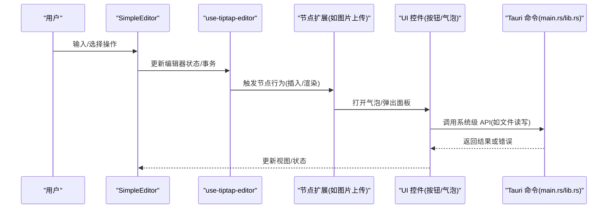
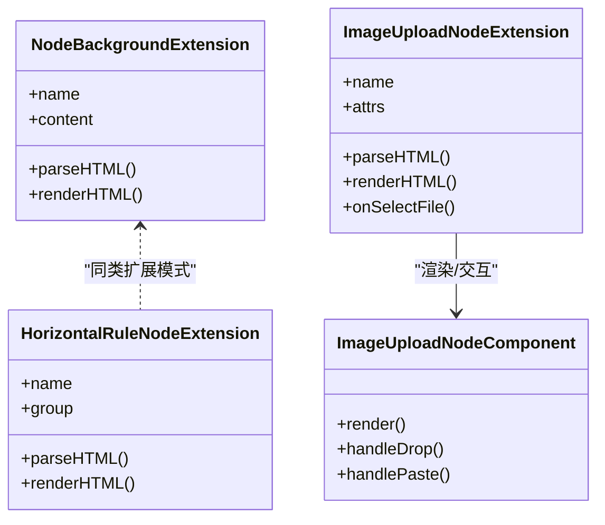
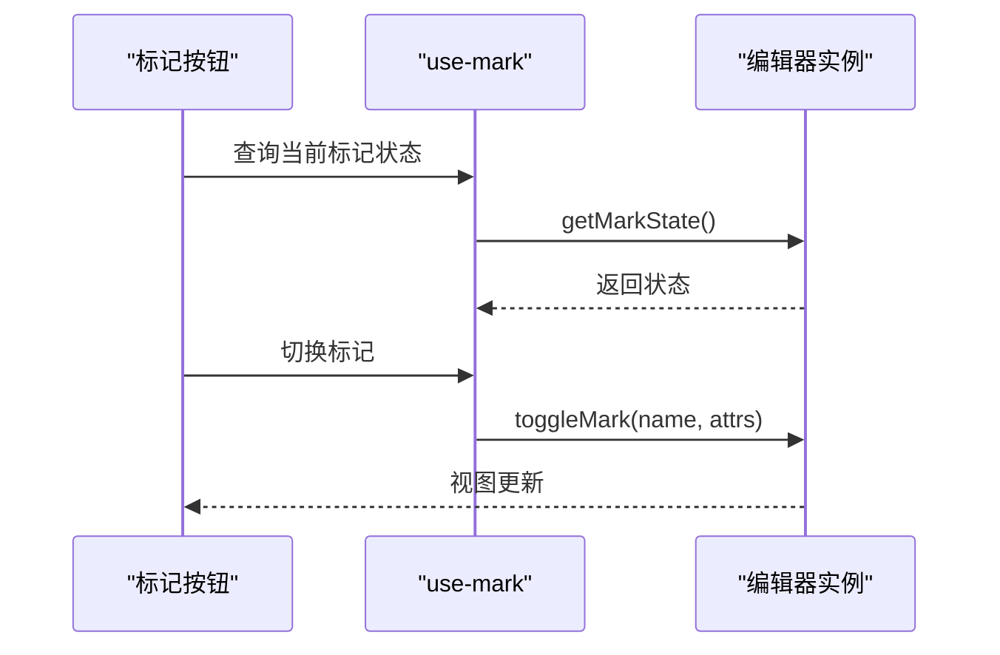
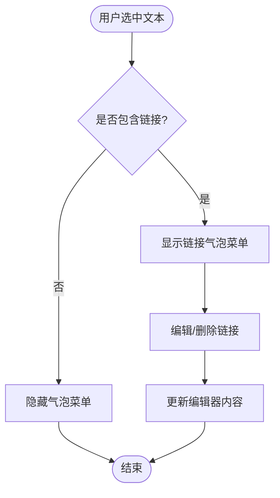
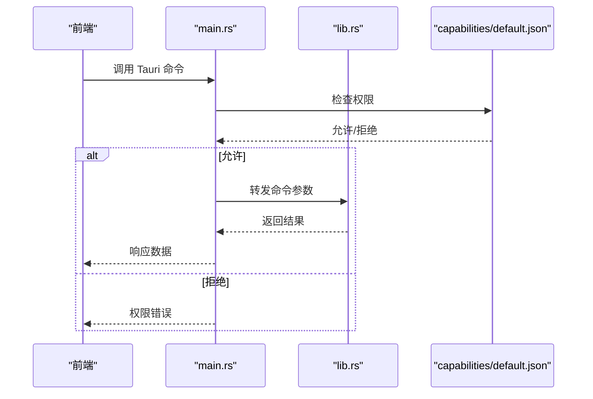
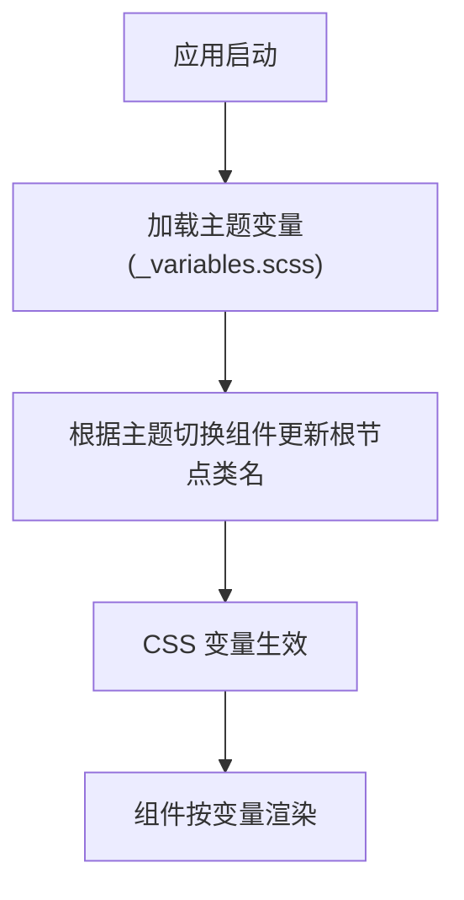
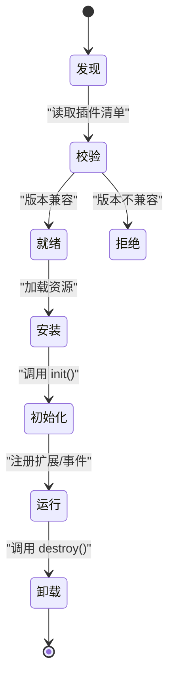
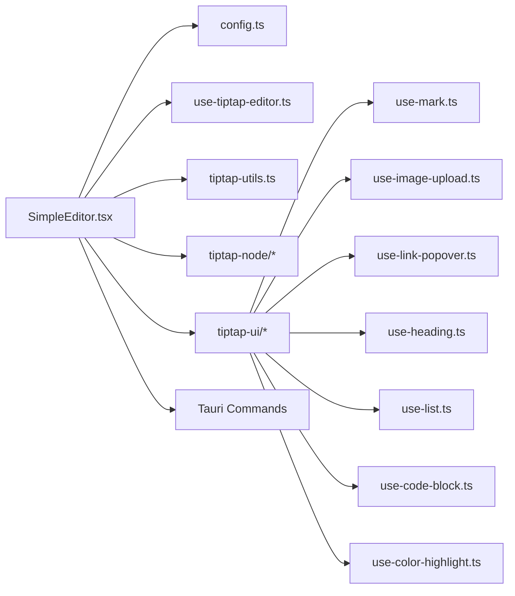

# 扩展机制设计

<cite>
**本文引用的文件**   
- [src/components/tiptap-extension/node-background-extension.ts](file://src/components/tiptap-extension/node-background-extension.ts)
- [src/components/tiptap-node/horizontal-rule-node-extension.ts](file://src/components/tiptap-node/horizontal-rule-node-extension.ts)
- [src/components/tiptap-node/image-upload-node-extension.ts](file://src/components/tiptap-node/image-upload-node-extension.ts)
- [src/components/tiptap-node/image-upload-node.tsx](file://src/components/tiptap-node/image-upload-node.tsx)
- [src/components/tiptap-node/index.tsx](file://src/components/tiptap-node/index.tsx)
- [src/components/tiptap-ui/index.tsx](file://src/components/tiptap-ui/index.tsx)
- [src/components/tiptap-ui/mark-button.tsx](file://src/components/tiptap-ui/mark-button.tsx)
- [src/components/tiptap-ui/use-mark.ts](file://src/components/tiptap-ui/use-mark.ts)
- [src/components/tiptap-ui/heading-button.tsx](file://src/components/tiptap-ui/heading-button.tsx)
- [src/components/tiptap-ui/list-button.tsx](file://src/components/tiptap-ui/list-button.tsx)
- [src/components/tiptap-ui/blockquote-button.tsx](file://src/components/tiptap-ui/blockquote-button.tsx)
- [src/components/tiptap-ui/code-block-button.tsx](file://src/components/tiptap-ui/code-block-button.tsx)
- [src/components/tiptap-ui/color-highlight-button.tsx](file://src/components/tiptap-ui/color-highlight-button.tsx)
- [src/components/tiptap-ui/link-popover.tsx](file://src/components/tiptap-ui/link-popover.tsx)
- [src/components/tiptap-ui/use-image-upload.ts](file://src/components/tiptap-ui/use-image-upload.ts)
- [src/components/tiptap-ui/use-link-popover.ts](file://src/components/tiptap-ui/use-link-popover.ts)
- [src/components/tiptap-ui/use-heading.ts](file://src/components/tiptap-ui/use-heading.ts)
- [src/components/tiptap-ui/use-list.ts](file://src/components/tiptap-ui/use-list.ts)
- [src/components/tiptap-ui/use-code-block.ts](file://src/components/tiptap-ui/use-code-block.ts)
- [src/components/tiptap-ui/use-color-highlight.ts](file://src/components/tiptap-ui/use-color-highlight.ts)
- [src/features/tiptap/SimpleEditor.tsx](file://src/features/tiptap/SimpleEditor.tsx)
- [src/features/tiptap/config.ts](file://src/features/tiptap/config.ts)
- [src/hooks/use-tiptap-editor.ts](file://src/hooks/use-tiptap-editor.ts)
- [src/lib/tiptap-utils.ts](file://src/lib/tiptap-utils.ts)
- [src/styles/_variables.scss](file://src/styles/_variables.scss)
- [src/styles/shared.css](file://src/styles/shared.css)
- [src/components/tiptap-templates/simple/simple-editor.tsx](file://src/components/tiptap-templates/simple/simple-editor.tsx)
- [src/components/tiptap-templates/simple/theme-toggle.tsx](file://src/components/tiptap-templates/simple/theme-toggle.tsx)
- [src/components/tiptap-templates/simple/simple-editor.scss](file://src/components/tiptap-templates/simple/simple-editor.scss)
- [src-tauri/src/main.rs](file://src-tauri/src/main.rs)
- [src-tauri/src/lib.rs](file://src-tauri/src/lib.rs)
- [src-tauri/tauri.conf.json](file://src-tauri/tauri.conf.json)
- [src-tauri/capabilities/default.json](file://src-tauri/capabilities/default.json)
</cite>

## 目录
1. [引言](#引言)
2. [项目结构](#项目结构)
3. [核心组件](#核心组件)
4. [架构总览](#架构总览)
5. [详细组件分析](#详细组件分析)
6. [依赖分析](#依赖分析)
7. [性能考虑](#性能考虑)
8. [故障排查指南](#故障排查指南)
9. [结论](#结论)
10. [附录](#附录)

## 引言
本设计文档面向 FishWorker 应用的扩展机制，聚焦以下目标：
- TipTap 编辑器扩展开发：自定义节点、标记、插件的扩展模式与最佳实践
- Tauri 命令扩展能力：新增系统级 API、权限控制与前后端交互契约
- 组件插槽与主题定制：样式覆盖策略、变量体系与可插拔 UI
- 插件架构与动态加载：版本兼容、生命周期管理、错误隔离
- 扩展开发示例与模板：提供可直接复用的骨架代码路径

## 项目结构
FishWorker 采用前端 React + TipTap 与后端 Tauri（Rust）的分层架构。TipTap 相关扩展位于 src/components 与 src/features/tiptap，Tauri 命令位于 src-tauri/src。

```mermaid
graph TB
subgraph "前端"
FE_Entry["应用入口<br/>main.tsx"]
FE_Editor["简单编辑器<br/>SimpleEditor.tsx"]
FE_Config["编辑器配置<br/>config.ts"]
FE_Hook["编辑器 Hook<br/>use-tiptap-editor.ts"]
FE_Util["TipTap 工具集<br/>tiptap-utils.ts"]
FE_Nodes["节点扩展集合<br/>tiptap-node/*"]
FE_Marks["标记扩展集合<br/>tiptap-ui/use-mark.ts"]
FE_Plugins["UI 控件与逻辑<br/>tiptap-ui/*"]
FE_Template["模板与主题切换<br/>tiptap-templates/simple/*"]
FE_Styles["全局样式与变量<br/>styles/*"]
end
subgraph "后端(Tauri)"
BE_Main["Tauri 主进程<br/>main.rs"]
BE_Lib["命令注册中心<br/>lib.rs"]
BE_Cfg["Tauri 配置<br/>tauri.conf.json"]
BE_Cap["能力与权限<br/>capabilities/default.json"]
end
FE_Entry --> FE_Editor
FE_Editor --> FE_Config
FE_Editor --> FE_Hook
FE_Editor --> FE_Util
FE_Editor --> FE_Nodes
FE_Editor --> FE_Marks
FE_Editor --> FE_Plugins
FE_Template --> FE_Editor
FE_Styles --> FE_Editor
FE_Editor < --> |"Tauri 命令调用"| BE_Main
BE_Main --> BE_Lib
BE_Main --> BE_Cfg
BE_Main --> BE_Cap
```

图表来源
- [src/features/tiptap/SimpleEditor.tsx:1-200](file://src/features/tiptap/SimpleEditor.tsx#L1-L200)
- [src/features/tiptap/config.ts:1-200](file://src/features/tiptap/config.ts#L1-L200)
- [src/hooks/use-tiptap-editor.ts:1-200](file://src/hooks/use-tiptap-editor.ts#L1-L200)
- [src/lib/tiptap-utils.ts:1-200](file://src/lib/tiptap-utils.ts#L1-L200)
- [src/components/tiptap-node/index.tsx:1-200](file://src/components/tiptap-node/index.tsx#L1-L200)
- [src/components/tiptap-ui/index.tsx:1-200](file://src/components/tiptap-ui/index.tsx#L1-L200)
- [src/components/tiptap-templates/simple/simple-editor.tsx:1-200](file://src/components/tiptap-templates/simple/simple-editor.tsx#L1-L200)
- [src-tauri/src/main.rs:1-200](file://src-tauri/src/main.rs#L1-L200)
- [src-tauri/src/lib.rs:1-200](file://src-tauri/src/lib.rs#L1-L200)
- [src-tauri/tauri.conf.json:1-200](file://src-tauri/tauri.conf.json#L1-L200)
- [src-tauri/capabilities/default.json:1-200](file://src-tauri/capabilities/default.json#L1-200)

章节来源
- [src/features/tiptap/SimpleEditor.tsx:1-200](file://src/features/tiptap/SimpleEditor.tsx#L1-L200)
- [src/features/tiptap/config.ts:1-200](file://src/features/tiptap/config.ts#L1-L200)
- [src/hooks/use-tiptap-editor.ts:1-200](file://src/hooks/use-tiptap-editor.ts#L1-L200)
- [src/lib/tiptap-utils.ts:1-200](file://src/lib/tiptap-utils.ts#L1-L200)
- [src/components/tiptap-node/index.tsx:1-200](file://src/components/tiptap-node/index.tsx#L1-L200)
- [src/components/tiptap-ui/index.tsx:1-200](file://src/components/tiptap-ui/index.tsx#L1-L200)
- [src/components/tiptap-templates/simple/simple-editor.tsx:1-200](file://src/components/tiptap-templates/simple/simple-editor.tsx#L1-L200)
- [src-tauri/src/main.rs:1-200](file://src-tauri/src/main.rs#L1-L200)
- [src-tauri/src/lib.rs:1-200](file://src-tauri/src/lib.rs#L1-L200)
- [src-tauri/tauri.conf.json:1-200](file://src-tauri/tauri.conf.json#L1-L200)
- [src-tauri/capabilities/default.json:1-200](file://src-tauri/capabilities/default.json#L1-200)

## 核心组件
- 编辑器装配层
  - SimpleEditor：组合配置、节点、标记、UI 控件与插件，形成可配置的编辑器实例
  - use-tiptap-editor：封装编辑器初始化、状态同步与事件订阅
  - tiptap-utils：通用工具函数（序列化、转换、校验等）
- 节点扩展集合
  - 水平分割线、图片上传等节点扩展，提供渲染与交互逻辑
- 标记扩展与 UI
  - 粗体、斜体、下划线等标记按钮与状态钩子
- 插件与 UI 控件
  - 标题、列表、引用、代码块、颜色高亮、链接气泡菜单等
- 模板与主题
  - 简单编辑器模板与主题切换组件，支持 CSS 变量覆盖

章节来源
- [src/features/tiptap/SimpleEditor.tsx:1-200](file://src/features/tiptap/SimpleEditor.tsx#L1-L200)
- [src/hooks/use-tiptap-editor.ts:1-200](file://src/hooks/use-tiptap-editor.ts#L1-L200)
- [src/lib/tiptap-utils.ts:1-200](file://src/lib/tiptap-utils.ts#L1-L200)
- [src/components/tiptap-node/index.tsx:1-200](file://src/components/tiptap-node/index.tsx#L1-L200)
- [src/components/tiptap-ui/index.tsx:1-200](file://src/components/tiptap-ui/index.tsx#L1-L200)
- [src/components/tiptap-templates/simple/simple-editor.tsx:1-200](file://src/components/tiptap-templates/simple/simple-editor.tsx#L1-L200)

## 架构总览
下图展示编辑器扩展在运行时如何装配与交互，包括节点、标记、UI 控件与 Tauri 命令通道。



图表来源
- [src/features/tiptap/SimpleEditor.tsx:1-200](file://src/features/tiptap/SimpleEditor.tsx#L1-L200)
- [src/hooks/use-tiptap-editor.ts:1-200](file://src/hooks/use-tiptap-editor.ts#L1-L200)
- [src/components/tiptap-node/image-upload-node-extension.ts:1-200](file://src/components/tiptap-node/image-upload-node-extension.ts#L1-L200)
- [src/components/tiptap-ui/link-popover.tsx:1-200](file://src/components/tiptap-ui/link-popover.tsx#L1-L200)
- [src-tauri/src/main.rs:1-200](file://src-tauri/src/main.rs#L1-L200)
- [src-tauri/src/lib.rs:1-200](file://src-tauri/src/lib.rs#L1-L200)

## 详细组件分析

### TipTap 节点扩展机制
- 扩展点
  - 节点定义：名称、属性、解析/序列化、渲染
  - 行为扩展：键盘事件、拖拽、粘贴处理
  - 交互扩展：气泡菜单、上下文菜单
- 现有实现参考
  - 背景节点扩展：用于为节点添加背景样式
  - 水平分割线节点扩展：定义节点结构与样式
  - 图片上传节点扩展与组件：实现本地图片选择、预览与插入
- 扩展流程
  - 定义节点扩展 -> 注册到编辑器配置 -> 在 UI 中暴露插入入口 -> 可选接入 Tauri 命令进行持久化



图表来源
- [src/components/tiptap-extension/node-background-extension.ts:1-200](file://src/components/tiptap-extension/node-background-extension.ts#L1-L200)
- [src/components/tiptap-node/horizontal-rule-node-extension.ts:1-200](file://src/components/tiptap-node/horizontal-rule-node-extension.ts#L1-L200)
- [src/components/tiptap-node/image-upload-node-extension.ts:1-200](file://src/components/tiptap-node/image-upload-node-extension.ts#L1-L200)
- [src/components/tiptap-node/image-upload-node.tsx:1-200](file://src/components/tiptap-node/image-upload-node.tsx#L1-L200)

章节来源
- [src/components/tiptap-extension/node-background-extension.ts:1-200](file://src/components/tiptap-extension/node-background-extension.ts#L1-L200)
- [src/components/tiptap-node/horizontal-rule-node-extension.ts:1-200](file://src/components/tiptap-node/horizontal-rule-node-extension.ts#L1-L200)
- [src/components/tiptap-node/image-upload-node-extension.ts:1-200](file://src/components/tiptap-node/image-upload-node-extension.ts#L1-L200)
- [src/components/tiptap-node/image-upload-node.tsx:1-200](file://src/components/tiptap-node/image-upload-node.tsx#L1-L200)

### TipTap 标记扩展与 UI 集成
- 标记扩展要点
  - 定义标记名称、属性、解析/序列化
  - 通过 UI 按钮切换激活状态
- 现有实现参考
  - 标记按钮与 use-mark 钩子：统一处理标记切换与状态查询
  - 标题、列表、引用、代码块等按钮：分别绑定对应标记/节点
- 集成模式
  - 按钮组件监听编辑器状态 -> 调用 use-mark/use-* 钩子 -> 执行编辑事务



图表来源
- [src/components/tiptap-ui/mark-button.tsx:1-200](file://src/components/tiptap-ui/mark-button.tsx#L1-L200)
- [src/components/tiptap-ui/use-mark.ts:1-200](file://src/components/tiptap-ui/use-mark.ts#L1-L200)
- [src/components/tiptap-ui/heading-button.tsx:1-200](file://src/components/tiptap-ui/heading-button.tsx#L1-L200)
- [src/components/tiptap-ui/list-button.tsx:1-200](file://src/components/tiptap-ui/list-button.tsx#L1-L200)
- [src/components/tiptap-ui/blockquote-button.tsx:1-200](file://src/components/tiptap-ui/blockquote-button.tsx#L1-L200)
- [src/components/tiptap-ui/code-block-button.tsx:1-200](file://src/components/tiptap-ui/code-block-button.tsx#L1-L200)

章节来源
- [src/components/tiptap-ui/mark-button.tsx:1-200](file://src/components/tiptap-ui/mark-button.tsx#L1-L200)
- [src/components/tiptap-ui/use-mark.ts:1-200](file://src/components/tiptap-ui/use-mark.ts#L1-L200)
- [src/components/tiptap-ui/heading-button.tsx:1-200](file://src/components/tiptap-ui/heading-button.tsx#L1-L200)
- [src/components/tiptap-ui/list-button.tsx:1-200](file://src/components/tiptap-ui/list-button.tsx#L1-L200)
- [src/components/tiptap-ui/blockquote-button.tsx:1-200](file://src/components/tiptap-ui/blockquote-button.tsx#L1-L200)
- [src/components/tiptap-ui/code-block-button.tsx:1-200](file://src/components/tiptap-ui/code-block-button.tsx#L1-L200)

### TipTap 插件扩展与气泡菜单
- 插件职责
  - 注入全局行为（快捷键、自动补全、拖拽、气泡菜单等）
  - 与 UI 组件协作，提供上下文感知交互
- 现有实现参考
  - 链接气泡菜单与 use-link-popover：选中链接时显示编辑气泡
  - 图片上传按钮与 use-image-upload：触发文件选择并插入节点
  - 颜色高亮按钮与 use-color-highlight：设置文本高亮色
- 插件装配
  - 在编辑器配置中集中注册插件与 UI 行为



图表来源
- [src/components/tiptap-ui/link-popover.tsx:1-200](file://src/components/tiptap-ui/link-popover.tsx#L1-L200)
- [src/components/tiptap-ui/use-link-popover.ts:1-200](file://src/components/tiptap-ui/use-link-popover.ts#L1-L200)
- [src/components/tiptap-ui/image-upload-button.tsx:1-200](file://src/components/tiptap-ui/image-upload-button.tsx#L1-L200)
- [src/components/tiptap-ui/use-image-upload.ts:1-200](file://src/components/tiptap-ui/use-image-upload.ts#L1-L200)
- [src/components/tiptap-ui/color-highlight-button.tsx:1-200](file://src/components/tiptap-ui/color-highlight-button.tsx#L1-L200)
- [src/components/tiptap-ui/use-color-highlight.ts:1-200](file://src/components/tiptap-ui/use-color-highlight.ts#L1-L200)

章节来源
- [src/components/tiptap-ui/link-popover.tsx:1-200](file://src/components/tiptap-ui/link-popover.tsx#L1-L200)
- [src/components/tiptap-ui/use-link-popover.ts:1-200](file://src/components/tiptap-ui/use-link-popover.ts#L1-L200)
- [src/components/tiptap-ui/image-upload-button.tsx:1-200](file://src/components/tiptap-ui/image-upload-button.tsx#L1-L200)
- [src/components/tiptap-ui/use-image-upload.ts:1-200](file://src/components/tiptap-ui/use-image-upload.ts#L1-L200)
- [src/components/tiptap-ui/color-highlight-button.tsx:1-200](file://src/components/tiptap-ui/color-highlight-button.tsx#L1-L200)
- [src/components/tiptap-ui/use-color-highlight.ts:1-200](file://src/components/tiptap-ui/use-color-highlight.ts#L1-L200)

### Tauri 命令扩展与权限控制
- 命令扩展能力
  - 在 main.rs 中注册命令路由，在 lib.rs 中实现具体命令逻辑
  - 通过 tauri.conf.json 配置窗口、安全策略与能力
  - capabilities/default.json 定义允许的前端访问权限
- 典型流程
  - 前端调用命令 -> main.rs 路由分发 -> lib.rs 执行业务逻辑 -> 返回结果或错误
- 权限模型
  - 基于能力的白名单机制，仅授权必要命令
  - 可按窗口/平台细化权限范围



图表来源
- [src-tauri/src/main.rs:1-200](file://src-tauri/src/main.rs#L1-L200)
- [src-tauri/src/lib.rs:1-200](file://src-tauri/src/lib.rs#L1-L200)
- [src-tauri/tauri.conf.json:1-200](file://src-tauri/tauri.conf.json#L1-L200)
- [src-tauri/capabilities/default.json:1-200](file://src-tauri/capabilities/default.json#L1-200)

章节来源
- [src-tauri/src/main.rs:1-200](file://src-tauri/src/main.rs#L1-L200)
- [src-tauri/src/lib.rs:1-200](file://src-tauri/src/lib.rs#L1-L200)
- [src-tauri/tauri.conf.json:1-200](file://src-tauri/tauri.conf.json#L1-L200)
- [src-tauri/capabilities/default.json:1-200](file://src-tauri/capabilities/default.json#L1-200)

### 组件插槽设计与主题定制
- 插槽设计
  - 通过 props 注入插槽组件，使编辑器工具栏、气泡菜单、节点渲染区域可插拔
  - 使用默认插槽与命名插槽分离基础功能与业务扩展
- 主题定制
  - 使用 CSS 变量集中管理色彩、间距、字体等主题值
  - 通过主题切换组件动态替换根节点类名或变量值
- 样式覆盖策略
  - 优先使用变量覆盖；必要时通过模块级样式文件局部覆盖
  - 避免全局样式污染，尽量限定作用域



图表来源
- [src/styles/_variables.scss:1-200](file://src/styles/_variables.scss#L1-200)
- [src/styles/shared.css:1-200](file://src/styles/shared.css#L1-200)
- [src/components/tiptap-templates/simple/theme-toggle.tsx:1-200](file://src/components/tiptap-templates/simple/theme-toggle.tsx#L1-200)
- [src/components/tiptap-templates/simple/simple-editor.scss:1-200](file://src/components/tiptap-templates/simple/simple-editor.scss#L1-200)

章节来源
- [src/styles/_variables.scss:1-200](file://src/styles/_variables.scss#L1-200)
- [src/styles/shared.css:1-200](file://src/styles/shared.css#L1-200)
- [src/components/tiptap-templates/simple/theme-toggle.tsx:1-200](file://src/components/tiptap-templates/simple/theme-toggle.tsx#L1-L200)
- [src/components/tiptap-templates/simple/simple-editor.scss:1-200](file://src/components/tiptap-templates/simple/simple-editor.scss#L1-L200)

### 插件架构与动态加载
- 插件接口约定
  - 统一的插件描述对象：名称、版本、依赖、初始化函数、销毁函数
  - 生命周期：安装 -> 初始化 -> 运行 -> 卸载
- 动态加载机制
  - 通过配置清单发现插件包，按需加载与缓存
  - 沙箱隔离：限制插件对宿主资源的直接访问，仅通过受控 API 通信
- 版本兼容性
  - 插件声明最小/最大宿主版本，不满足则拒绝加载
  - 渐进式升级：保留旧版兼容层，逐步弃用字段



[此图为概念性流程图，无需图表来源]

### 扩展开发最佳实践
- 明确边界
  - 节点/标记/插件职责单一，避免耦合过多业务逻辑
- 可测试性
  - 将核心逻辑抽离为纯函数，便于单元测试
- 可观测性
  - 关键路径增加日志与埋点，区分调试与生产环境
- 向后兼容
  - 变更属性或 API 时保持默认值与迁移脚本
- 性能优化
  - 大文档分片渲染、懒加载重计算、减少不必要的 re-render

[本节为通用指导，无需章节来源]

### 调试技巧
- 前端
  - 使用浏览器开发者工具观察编辑器 DOM 与状态
  - 在关键 Hook 处打印状态变化，定位渲染问题
- 后端
  - 启用 Tauri 日志输出，捕获命令调用栈与错误信息
- 端到端
  - 录制用户操作序列，回放验证扩展稳定性

[本节为通用指导，无需章节来源]

## 依赖分析
- 前端内部依赖
  - SimpleEditor 依赖配置、Hook、工具集、节点与 UI 控件
  - UI 控件依赖相应 use-* 钩子，钩子依赖编辑器实例
- 前后端依赖
  - 前端通过 Tauri 命令与后端交互，权限由 capabilities 控制
- 潜在循环依赖
  - 避免 UI 与节点扩展互相直接引用，建议通过 Hook 或工具集解耦



图表来源
- [src/features/tiptap/SimpleEditor.tsx:1-200](file://src/features/tiptap/SimpleEditor.tsx#L1-L200)
- [src/features/tiptap/config.ts:1-200](file://src/features/tiptap/config.ts#L1-L200)
- [src/hooks/use-tiptap-editor.ts:1-200](file://src/hooks/use-tiptap-editor.ts#L1-L200)
- [src/lib/tiptap-utils.ts:1-200](file://src/lib/tiptap-utils.ts#L1-L200)
- [src/components/tiptap-node/index.tsx:1-200](file://src/components/tiptap-node/index.tsx#L1-L200)
- [src/components/tiptap-ui/index.tsx:1-200](file://src/components/tiptap-ui/index.tsx#L1-L200)
- [src/components/tiptap-ui/mark-button.tsx:1-200](file://src/components/tiptap-ui/mark-button.tsx#L1-L200)
- [src/components/tiptap-ui/use-mark.ts:1-200](file://src/components/tiptap-ui/use-mark.ts#L1-L200)
- [src/components/tiptap-ui/use-image-upload.ts:1-200](file://src/components/tiptap-ui/use-image-upload.ts#L1-L200)
- [src/components/tiptap-ui/use-link-popover.ts:1-200](file://src/components/tiptap-ui/use-link-popover.ts#L1-L200)
- [src/components/tiptap-ui/use-heading.ts:1-200](file://src/components/tiptap-ui/use-heading.ts#L1-L200)
- [src/components/tiptap-ui/use-list.ts:1-200](file://src/components/tiptap-ui/use-list.ts#L1-L200)
- [src/components/tiptap-ui/use-code-block.ts:1-200](file://src/components/tiptap-ui/use-code-block.ts#L1-L200)
- [src/components/tiptap-ui/use-color-highlight.ts:1-200](file://src/components/tiptap-ui/use-color-highlight.ts#L1-L200)

章节来源
- [src/features/tiptap/SimpleEditor.tsx:1-200](file://src/features/tiptap/SimpleEditor.tsx#L1-L200)
- [src/features/tiptap/config.ts:1-200](file://src/features/tiptap/config.ts#L1-L200)
- [src/hooks/use-tiptap-editor.ts:1-200](file://src/hooks/use-tiptap-editor.ts#L1-L200)
- [src/lib/tiptap-utils.ts:1-200](file://src/lib/tiptap-utils.ts#L1-L200)
- [src/components/tiptap-node/index.tsx:1-200](file://src/components/tiptap-node/index.tsx#L1-L200)
- [src/components/tiptap-ui/index.tsx:1-200](file://src/components/tiptap-ui/index.tsx#L1-L200)
- [src/components/tiptap-ui/mark-button.tsx:1-200](file://src/components/tiptap-ui/mark-button.tsx#L1-L200)
- [src/components/tiptap-ui/use-mark.ts:1-200](file://src/components/tiptap-ui/use-mark.ts#L1-L200)
- [src/components/tiptap-ui/use-image-upload.ts:1-200](file://src/components/tiptap-ui/use-image-upload.ts#L1-L200)
- [src/components/tiptap-ui/use-link-popover.ts:1-200](file://src/components/tiptap-ui/use-link-popover.ts#L1-L200)
- [src/components/tiptap-ui/use-heading.ts:1-200](file://src/components/tiptap-ui/use-heading.ts#L1-L200)
- [src/components/tiptap-ui/use-list.ts:1-200](file://src/components/tiptap-ui/use-list.ts#L1-L200)
- [src/components/tiptap-ui/use-code-block.ts:1-200](file://src/components/tiptap-ui/use-code-block.ts#L1-L200)
- [src/components/tiptap-ui/use-color-highlight.ts:1-200](file://src/components/tiptap-ui/use-color-highlight.ts#L1-L200)

## 性能考虑
- 渲染性能
  - 大文档分块渲染，避免一次性构建完整树
  - 使用惰性加载与虚拟滚动提升长列表体验
- 状态同步
  - 合并频繁的状态更新，减少重渲染次数
  - 合理拆分 Hook，避免无关组件重新计算
- I/O 与网络
  - 批量写入与去抖提交，降低磁盘与网络压力
  - 失败重试与断点续传策略
- 内存管理
  - 及时释放事件监听与定时器
  - 清理大型对象引用，防止内存泄漏

[本节为通用指导，无需章节来源]

## 故障排查指南
- 常见问题
  - 节点未渲染：检查节点扩展注册与解析/序列化逻辑
  - 标记状态不同步：确认 use-* 钩子是否正确订阅编辑器状态
  - Tauri 命令被拒：核对 capabilities 配置与命令白名单
- 定位方法
  - 前端：控制台日志、DOM 快照、React DevTools
  - 后端：Tauri 日志、命令入参出参记录
- 恢复策略
  - 回滚到上一稳定版本
  - 禁用可疑插件，逐步启用定位问题

章节来源
- [src-tauri/capabilities/default.json:1-200](file://src-tauri/capabilities/default.json#L1-L200)
- [src-tauri/tauri.conf.json:1-200](file://src-tauri/tauri.conf.json#L1-L200)

## 结论
FishWorker 的扩展机制以 TipTap 为核心，结合 Tauri 的系统能力与可插拔 UI，形成了可扩展、可定制、可维护的编辑器生态。通过明确的扩展点、严格的权限控制与完善的主题体系，开发者可以高效地实现复杂业务场景，同时保证性能与稳定性。

[本节为总结性内容，无需章节来源]

## 附录
- 扩展开发示例与模板路径
  - 节点扩展模板：参考现有节点扩展文件组织方式
  - 标记扩展模板：参考 use-mark 与标记按钮的实现模式
  - 插件模板：参考气泡菜单与 use-* 钩子的组合方式
  - Tauri 命令模板：参考 main.rs 与 lib.rs 的命令注册与实现
- 快速上手步骤
  - 新建扩展文件 -> 注册到编辑器配置 -> 在 UI 中暴露入口 -> 联调与测试

[本节为指引性内容，无需章节来源]