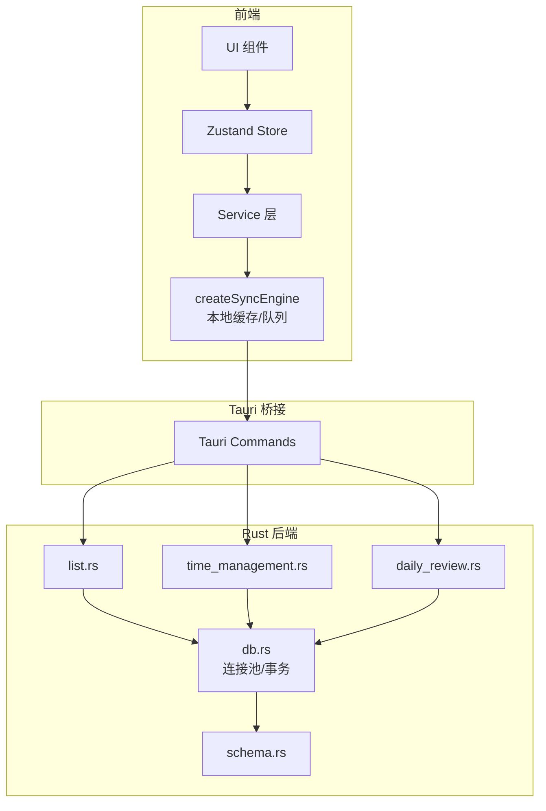
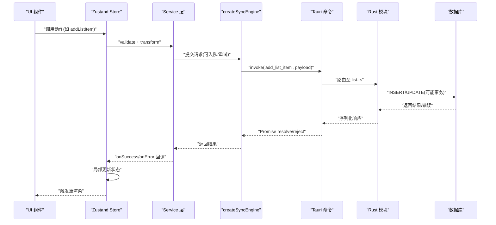
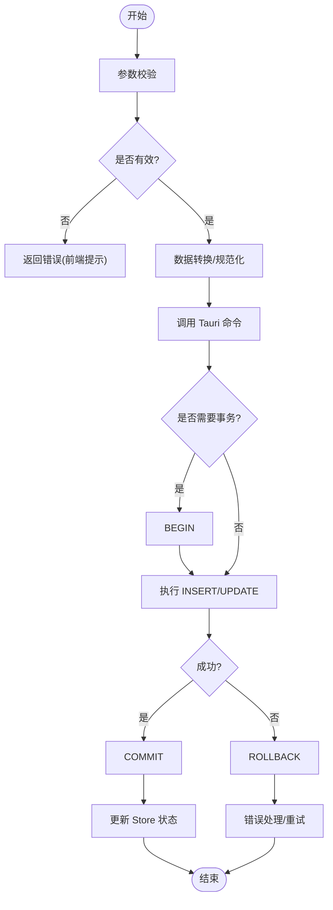
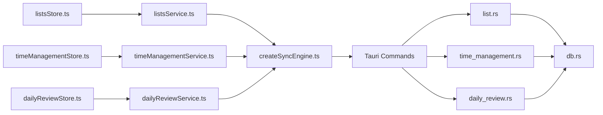

# 数据流设计

<cite>
**本文引用的文件**   
- [src/features/lists/listsStore.ts](file://src/features/lists/listsStore.ts)
- [src/features/lists/listsService.ts](file://src/features/lists/listsService.ts)
- [src/features/lists/listsTypes.ts](file://src/features/lists/listsTypes.ts)
- [src/features/time-management/timeManagementStore.ts](file://src/features/time-management/timeManagementStore.ts)
- [src/features/time-management/timeManagementService.ts](file://src/features/time-management/timeManagementService.ts)
- [src/features/time-management/timeManagementTypes.ts](file://src/features/time-management/timeManagementTypes.ts)
- [src/features/daily-review/dailyReviewStore.ts](file://src/features/daily-review/dailyReviewStore.ts)
- [src/features/daily-review/dailyReviewService.ts](file://src/features/daily-review/dailyReviewService.ts)
- [src/features/daily-review/dailyReviewTypes.ts](file://src/features/daily-review/dailyReviewTypes.ts)
- [src/lib/createSyncEngine.ts](file://src/lib/createSyncEngine.ts)
- [src-tauri/src/db.rs](file://src-tauri/src/db.rs)
- [src-tauri/src/list.rs](file://src-tauri/src/list.rs)
- [src-tauri/src/time_management.rs](file://src-tauri/src/time_management.rs)
- [src-tauri/src/daily_review.rs](file://src-tauri/src/daily_review.rs)
- [src-tauri/src/schema.rs](file://src-tauri/src/schema.rs)
</cite>

## 目录
1. [引言](#引言)
2. [项目结构](#项目结构)
3. [核心组件](#核心组件)
4. [架构总览](#架构总览)
5. [详细组件分析](#详细组件分析)
6. [依赖关系分析](#依赖关系分析)
7. [性能考虑](#性能考虑)
8. [故障排查指南](#故障排查指南)
9. [结论](#结论)
10. [附录](#附录)

## 引言
本文件面向 FishWorker 应用的数据流设计，聚焦从用户界面操作到数据库存储的完整数据流转过程。文档重点覆盖：
- Zustand Store 的状态管理模式（状态更新、订阅机制、持久化策略）
- Service 层的业务逻辑封装（数据验证、转换、错误处理）
- Rust 后端的数据库操作实现（连接池管理、事务处理、查询优化）
- 数据一致性保证与并发访问控制
- 关键业务场景的数据流图与状态变更流程图
- 数据缓存策略与性能优化方案

## 项目结构
FishWorker 采用前端 TypeScript + Tauri(Rust) 的混合架构：
- 前端按“特性”组织（features），每个特性包含 UI、Store、Service、类型定义等
- 通用能力集中在 lib 目录（如同步引擎 createSyncEngine）
- 后端通过 Tauri 暴露命令接口，Rust 侧负责数据库访问与持久化



图表来源
- [src/lib/createSyncEngine.ts](file://src/lib/createSyncEngine.ts)
- [src-tauri/src/db.rs](file://src-tauri/src/db.rs)
- [src-tauri/src/list.rs](file://src-tauri/src/list.rs)
- [src-tauri/src/time_management.rs](file://src-tauri/src/time_management.rs)
- [src-tauri/src/daily_review.rs](file://src-tauri/src/daily_review.rs)
- [src-tauri/src/schema.rs](file://src-tauri/src/schema.rs)

章节来源
- [src/features/lists/listsStore.ts](file://src/features/lists/listsStore.ts)
- [src/features/time-management/timeManagementStore.ts](file://src/features/time-management/timeManagementStore.ts)
- [src/features/daily-review/dailyReviewStore.ts](file://src/features/daily-review/dailyReviewStore.ts)
- [src/lib/createSyncEngine.ts](file://src/lib/createSyncEngine.ts)
- [src-tauri/src/db.rs](file://src-tauri/src/db.rs)

## 核心组件
- Store 层（Zustand）
  - 职责：维护领域状态、提供原子更新方法、订阅驱动 UI 渲染
  - 典型模式：以“动作”为单位更新状态；在动作中调用 Service 完成 I/O；必要时触发本地缓存或离线队列
- Service 层
  - 职责：封装业务规则、参数校验、数据转换、错误处理；作为 Store 与 Tauri 命令之间的适配层
- 同步引擎（createSyncEngine）
  - 职责：统一请求编排、重试、去抖/节流、离线队列、冲突合并策略（若启用）
- Rust 后端
  - 职责：通过 Tauri 暴露命令；使用连接池执行 SQL；在需要时开启事务；返回结构化结果给前端

章节来源
- [src/features/lists/listsStore.ts](file://src/features/lists/listsStore.ts)
- [src/features/lists/listsService.ts](file://src/features/lists/listsService.ts)
- [src/features/time-management/timeManagementStore.ts](file://src/features/time-management/timeManagementStore.ts)
- [src/features/time-management/timeManagementService.ts](file://src/features/time-management/timeManagementService.ts)
- [src/features/daily-review/dailyReviewStore.ts](file://src/features/daily-review/dailyReviewStore.ts)
- [src/features/daily-review/dailyReviewService.ts](file://src/features/daily-review/dailyReviewService.ts)
- [src/lib/createSyncEngine.ts](file://src/lib/createSyncEngine.ts)
- [src-tauri/src/db.rs](file://src-tauri/src/db.rs)

## 架构总览
下图展示一次典型的“创建清单条目”端到端数据流：UI 触发 Store 动作 → Service 校验并调用 Tauri 命令 → Rust 写入数据库 → 成功回调更新 Store 状态 → UI 自动刷新。



图表来源
- [src/features/lists/listsStore.ts](file://src/features/lists/listsStore.ts)
- [src/features/lists/listsService.ts](file://src/features/lists/listsService.ts)
- [src/lib/createSyncEngine.ts](file://src/lib/createSyncEngine.ts)
- [src-tauri/src/list.rs](file://src-tauri/src/list.rs)
- [src-tauri/src/db.rs](file://src-tauri/src/db.rs)

## 详细组件分析

### 列表特性数据流（Lists）
- Store 职责
  - 维护清单集合、选中项、加载态、错误态
  - 提供增删改查、排序、分组等动作
  - 在动作中调用 listsService，并在成功后进行增量更新
- Service 职责
  - 校验输入（必填字段、长度、格式）
  - 将前端模型转换为后端期望结构
  - 调用 createSyncEngine 发起请求，处理网络/权限错误
- Rust 实现
  - list.rs 暴露 Tauri 命令，解析参数，调用 db.rs 执行 SQL
  - 对批量操作使用事务确保一致性
  - 利用索引和分页减少全表扫描



图表来源
- [src/features/lists/listsStore.ts](file://src/features/lists/listsStore.ts)
- [src/features/lists/listsService.ts](file://src/features/lists/listsService.ts)
- [src-tauri/src/list.rs](file://src-tauri/src/list.rs)
- [src-tauri/src/db.rs](file://src-tauri/src/db.rs)

章节来源
- [src/features/lists/listsStore.ts](file://src/features/lists/listsStore.ts)
- [src/features/lists/listsService.ts](file://src/features/lists/listsService.ts)
- [src/features/lists/listsTypes.ts](file://src/features/lists/listsTypes.ts)
- [src-tauri/src/list.rs](file://src-tauri/src/list.rs)
- [src-tauri/src/db.rs](file://src-tauri/src/db.rs)

### 时间管理特性数据流（Time Management）
- Store 职责
  - 维护任务、日程、四象限视图等状态
  - 提供快速添加、拖拽排序、批量操作等动作
- Service 职责
  - 校验时间与优先级约束
  - 将复杂对象扁平化为后端字段
  - 结合 createSyncEngine 做去抖与重试
- Rust 实现
  - time_management.rs 暴露命令，支持批量插入/更新
  - 使用事务包裹批量写，失败回滚
  - 针对常用查询路径建立索引

```mermaid
sequenceDiagram
participant UI as "UI 组件"
participant Store as "时间管理 Store"
participant Svc as "时间管理 Service"
participant Sync as "createSyncEngine"
participant Tauri as "Tauri 命令"
participant Rust as "time_management.rs"
participant DB as "数据库"
UI->>Store : "批量更新任务"
Store->>Svc : "校验/转换"
Svc->>Sync : "提交批量请求"
Sync->>Tauri : "invoke('batch_update_tasks')"
Tauri->>Rust : "解析参数"
Rust->>DB : "BEGIN; 多条 UPDATE/INSERT"
DB-->>Rust : "结果集"
Rust-->>Tauri : "返回成功/失败"
Tauri-->>Sync : "Promise 结果"
Sync-->>Svc : "返回"
Svc-->>Store : "onSuccess 合并状态"
Store-->>UI : "刷新视图"
```

图表来源
- [src/features/time-management/timeManagementStore.ts](file://src/features/time-management/timeManagementStore.ts)
- [src/features/time-management/timeManagementService.ts](file://src/features/time-management/timeManagementService.ts)
- [src/features/time-management/timeManagementTypes.ts](file://src/features/time-management/timeManagementTypes.ts)
- [src/lib/createSyncEngine.ts](file://src/lib/createSyncEngine.ts)
- [src-tauri/src/time_management.rs](file://src-tauri/src/time_management.rs)
- [src-tauri/src/db.rs](file://src-tauri/src/db.rs)

章节来源
- [src/features/time-management/timeManagementStore.ts](file://src/features/time-management/timeManagementStore.ts)
- [src/features/time-management/timeManagementService.ts](file://src/features/time-management/timeManagementService.ts)
- [src/features/time-management/timeManagementTypes.ts](file://src/features/time-management/timeManagementTypes.ts)
- [src-tauri/src/time_management.rs](file://src-tauri/src/time_management.rs)
- [src-tauri/src/db.rs](file://src-tauri/src/db.rs)

### 每日复盘特性数据流（Daily Review）
- Store 职责
  - 维护当日复盘内容、草稿、自动保存状态
- Service 职责
  - 校验文本长度、富文本结构合法性
  - 将编辑器内容序列化为后端格式
- Rust 实现
  - daily_review.rs 暴露命令，支持单条记录的读写
  - 使用事务保护复合字段写入

```mermaid
sequenceDiagram
participant UI as "编辑器 UI"
participant Store as "复盘 Store"
participant Svc as "复盘 Service"
participant Sync as "createSyncEngine"
participant Tauri as "Tauri 命令"
participant Rust as "daily_review.rs"
participant DB as "数据库"
UI->>Store : "自动保存"
Store->>Svc : "序列化/校验"
Svc->>Sync : "提交保存请求"
Sync->>Tauri : "invoke('save_daily_review')"
Tauri->>Rust : "解析/校验"
Rust->>DB : "BEGIN; UPDATE 内容"
DB-->>Rust : "OK"
Rust-->>Tauri : "返回成功"
Tauri-->>Sync : "Promise 结果"
Sync-->>Svc : "返回"
Svc-->>Store : "标记已保存"
Store-->>UI : "显示保存成功"
```

图表来源
- [src/features/daily-review/dailyReviewStore.ts](file://src/features/daily-review/dailyReviewStore.ts)
- [src/features/daily-review/dailyReviewService.ts](file://src/features/daily-review/dailyReviewService.ts)
- [src/features/daily-review/dailyReviewTypes.ts](file://src/features/daily-review/dailyReviewTypes.ts)
- [src/lib/createSyncEngine.ts](file://src/lib/createSyncEngine.ts)
- [src-tauri/src/daily_review.rs](file://src-tauri/src/daily_review.rs)
- [src-tauri/src/db.rs](file://src-tauri/src/db.rs)

章节来源
- [src/features/daily-review/dailyReviewStore.ts](file://src/features/daily-review/dailyReviewStore.ts)
- [src/features/daily-review/dailyReviewService.ts](file://src/features/daily-review/dailyReviewService.ts)
- [src/features/daily-review/dailyReviewTypes.ts](file://src/features/daily-review/dailyReviewTypes.ts)
- [src-tauri/src/daily_review.rs](file://src-tauri/src/daily_review.rs)
- [src-tauri/src/db.rs](file://src-tauri/src/db.rs)

### Zustand Store 状态管理模式
- 状态更新
  - 以“动作”为最小单位，避免直接修改状态树
  - 在动作内调用 Service，根据结果进行局部更新
- 订阅机制
  - 组件按需订阅状态切片，减少不必要重渲染
- 持久化策略
  - 可选持久化关键配置或草稿；注意与后端数据的一致性边界
  - 建议仅持久化“无副作用”的轻量数据，主数据以服务端为准

章节来源
- [src/features/lists/listsStore.ts](file://src/features/lists/listsStore.ts)
- [src/features/time-management/timeManagementStore.ts](file://src/features/time-management/timeManagementStore.ts)
- [src/features/daily-review/dailyReviewStore.ts](file://src/features/daily-review/dailyReviewStore.ts)

### Service 层业务逻辑封装
- 数据验证
  - 在前端尽早拦截非法输入，降低无效网络请求
- 数据转换
  - 将前端领域模型映射为后端传输对象，屏蔽差异
- 错误处理
  - 统一捕获网络/权限/业务错误，转化为友好的用户提示
  - 结合 createSyncEngine 的重试与退避策略提升鲁棒性

章节来源
- [src/features/lists/listsService.ts](file://src/features/lists/listsService.ts)
- [src/features/time-management/timeManagementService.ts](file://src/features/time-management/timeManagementService.ts)
- [src/features/daily-review/dailyReviewService.ts](file://src/features/daily-review/dailyReviewService.ts)

### Rust 后端数据库操作实现
- 连接池管理
  - 全局初始化连接池，复用连接，避免频繁握手开销
- 事务处理
  - 对多语句写操作使用事务，失败回滚，保障一致性
- 查询优化
  - 基于高频查询条件建立索引；分页/投影减少数据传输量

章节来源
- [src-tauri/src/db.rs](file://src-tauri/src/db.rs)
- [src-tauri/src/list.rs](file://src-tauri/src/list.rs)
- [src-tauri/src/time_management.rs](file://src-tauri/src/time_management.rs)
- [src-tauri/src/daily_review.rs](file://src-tauri/src/daily_review.rs)
- [src-tauri/src/schema.rs](file://src-tauri/src/schema.rs)

## 依赖关系分析
- 前端特性模块之间尽量解耦，通过 Store 暴露的最小 API 交互
- Service 仅依赖 createSyncEngine 与 Tauri 命令，不直接耦合 UI
- Rust 模块通过 db.rs 抽象数据库访问，保持上层命令清晰



图表来源
- [src/features/lists/listsStore.ts](file://src/features/lists/listsStore.ts)
- [src/features/lists/listsService.ts](file://src/features/lists/listsService.ts)
- [src/features/time-management/timeManagementStore.ts](file://src/features/time-management/timeManagementStore.ts)
- [src/features/time-management/timeManagementService.ts](file://src/features/time-management/timeManagementService.ts)
- [src/features/daily-review/dailyReviewStore.ts](file://src/features/daily-review/dailyReviewStore.ts)
- [src/features/daily-review/dailyReviewService.ts](file://src/features/daily-review/dailyReviewService.ts)
- [src/lib/createSyncEngine.ts](file://src/lib/createSyncEngine.ts)
- [src-tauri/src/list.rs](file://src-tauri/src/list.rs)
- [src-tauri/src/time_management.rs](file://src-tauri/src/time_management.rs)
- [src-tauri/src/daily_review.rs](file://src-tauri/src/daily_review.rs)
- [src-tauri/src/db.rs](file://src-tauri/src/db.rs)

## 性能考虑
- 前端
  - 使用 createSyncEngine 的去抖/节流、批量合并、重试与指数退避
  - Store 订阅细粒度切片，避免整树重渲染
  - 列表分页/虚拟滚动，减少 DOM 压力
- 后端
  - 连接池复用，避免频繁建连
  - 批量写入走事务，减少往返次数
  - 合理索引与只读投影，降低 IO 与 CPU 消耗
- 缓存策略
  - 对热点只读数据采用短期内存缓存（带失效策略）
  - 草稿类数据可持久化到本地，启动时恢复

[本节为通用指导，无需特定文件引用]

## 故障排查指南
- 常见问题定位
  - 检查 Service 的参数校验日志与错误码
  - 查看 createSyncEngine 的重试计数与最终错误
  - 在 Rust 侧记录事务开始/提交/回滚的关键点
- 一致性保障
  - 确认写路径均包裹事务；失败必须回滚
  - 对于并发更新，采用乐观锁或版本号字段避免覆盖
- 调试建议
  - 在 Tauri 命令入口打印入参/出参
  - 对慢查询增加执行计划分析与索引建议

章节来源
- [src-tauri/src/db.rs](file://src-tauri/src/db.rs)
- [src-tauri/src/list.rs](file://src-tauri/src/list.rs)
- [src-tauri/src/time_management.rs](file://src-tauri/src/time_management.rs)
- [src-tauri/src/daily_review.rs](file://src-tauri/src/daily_review.rs)
- [src/lib/createSyncEngine.ts](file://src/lib/createSyncEngine.ts)

## 结论
FishWorker 的数据流遵循“Store 驱动、Service 封装、Rust 持久化”的分层设计。通过 createSyncEngine 统一编排请求与错误处理，结合 Rust 的事务与连接池，实现了高可靠、高性能的数据写入链路。建议在后续迭代中持续完善索引、分页与缓存策略，并对关键路径补充监控与告警。

[本节为总结性内容，无需特定文件引用]

## 附录
- 术语
  - Store：Zustand 状态容器
  - Service：业务逻辑与数据适配层
  - createSyncEngine：同步引擎，负责请求编排与可靠性
  - Tauri 命令：前后端通信的命令通道
  - 事务：保证一组操作的原子性与一致性

[本节为概念说明，无需特定文件引用]