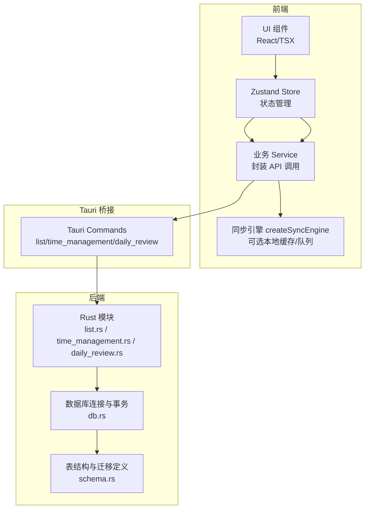
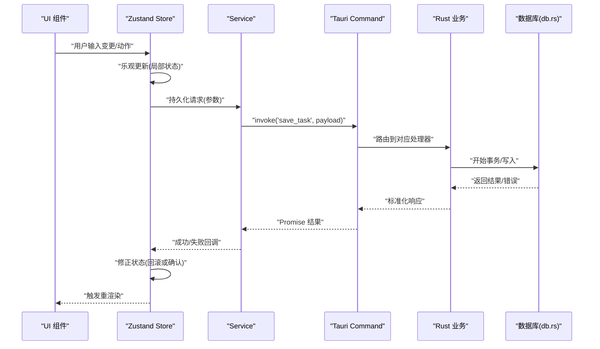
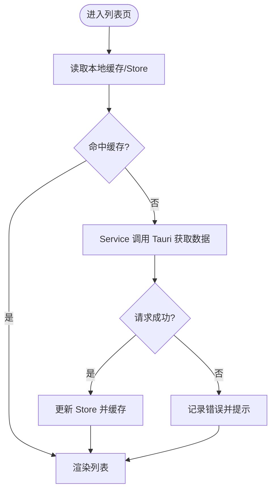
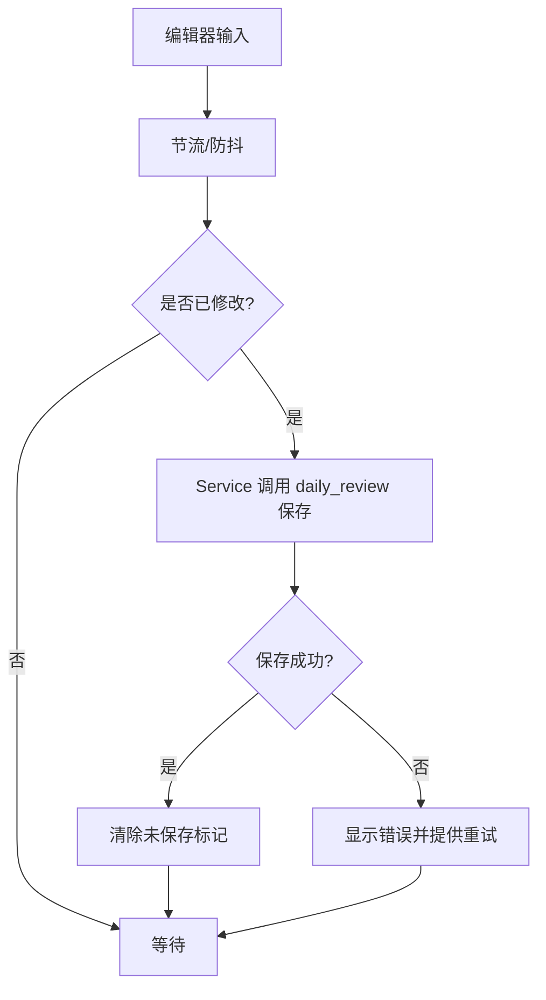
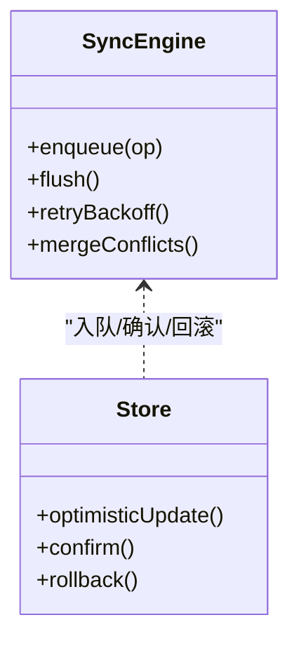
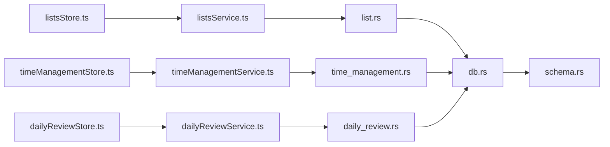
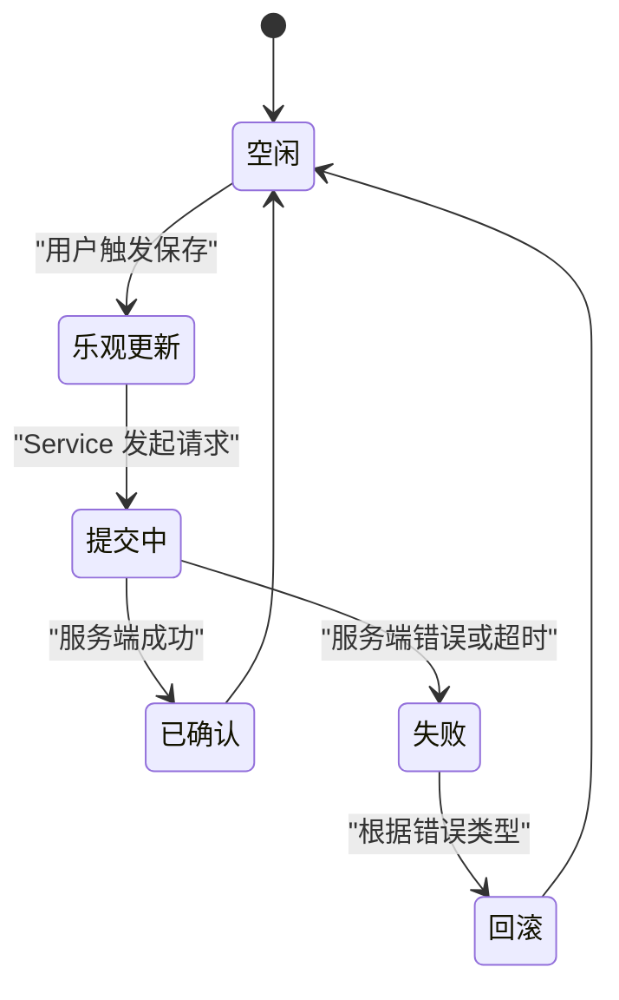

# 数据流设计

<cite>
**本文引用的文件**   
- [src/features/lists/listsStore.ts](file://src/features/lists/listsStore.ts)
- [src/features/lists/listsService.ts](file://src/features/lists/listsService.ts)
- [src/features/lists/listsTypes.ts](file://src/features/lists/listsTypes.ts)
- [src/features/time-management/timeManagementStore.ts](file://src/features/time-management/timeManagementStore.ts)
- [src/features/time-management/timeManagementService.ts](file://src/features/time-management/timeManagementService.ts)
- [src/features/time-management/timeManagementTypes.ts](file://src/features/time-management/timeManagementTypes.ts)
- [src/features/daily-review/dailyReviewStore.ts](file://src/features/daily-review/dailyReviewStore.ts)
- [src/features/daily-review/dailyReviewService.ts](file://src/features/daily-review/dailyReviewService.ts)
- [src/features/daily-review/dailyReviewTypes.ts](file://src/features/daily-review/dailyReviewTypes.ts)
- [src/lib/createSyncEngine.ts](file://src/lib/createSyncEngine.ts)
- [src-tauri/src/list.rs](file://src-tauri/src/list.rs)
- [src-tauri/src/time_management.rs](file://src-tauri/src/time_management.rs)
- [src-tauri/src/daily_review.rs](file://src-tauri/src/daily_review.rs)
- [src-tauri/src/db.rs](file://src-tauri/src/db.rs)
- [src-tauri/src/schema.rs](file://src-tauri/src/schema.rs)
- [src-tauri/src/lib.rs](file://src-tauri/src/lib.rs)
</cite>

## 目录
1. [引言](#引言)
2. [项目结构](#项目结构)
3. [核心组件](#核心组件)
4. [架构总览](#架构总览)
5. [详细组件分析](#详细组件分析)
6. [依赖关系分析](#依赖关系分析)
7. [性能考虑](#性能考虑)
8. [故障排查指南](#故障排查指南)
9. [结论](#结论)
10. [附录](#附录)

## 引言
本文件面向 FishWorker 应用的数据流设计，覆盖从 UI 组件到数据库的完整链路：Zustand Store 状态更新、API Service 调用、Tauri Command 触发、Rust 后端处理与数据库操作。文档同时阐述状态管理模式、数据同步机制、缓存策略、数据验证规则、错误传播与回滚策略，并给出数据流图、状态转换图和时序图，以及一致性与性能优化建议。

## 项目结构
FishWorker 采用前端 TypeScript + React（Vite）+ Zustand 与 Rust（Tauri）双端协作的架构。前端按功能域组织（features），每个域包含 Store、Service、Types 与 UI 组件；Rust 侧通过 Tauri 暴露命令，统一访问数据库。



图表来源
- [src/features/lists/listsStore.ts](file://src/features/lists/listsStore.ts)
- [src/features/lists/listsService.ts](file://src/features/lists/listsService.ts)
- [src/features/time-management/timeManagementStore.ts](file://src/features/time-management/timeManagementStore.ts)
- [src/features/time-management/timeManagementService.ts](file://src/features/time-management/timeManagementService.ts)
- [src/features/daily-review/dailyReviewStore.ts](file://src/features/daily-review/dailyReviewStore.ts)
- [src/features/daily-review/dailyReviewService.ts](file://src/features/daily-review/dailyReviewService.ts)
- [src/lib/createSyncEngine.ts](file://src/lib/createSyncEngine.ts)
- [src-tauri/src/lib.rs](file://src-tauri/src/lib.rs)
- [src-tauri/src/list.rs](file://src-tauri/src/list.rs)
- [src-tauri/src/time_management.rs](file://src-tauri/src/time_management.rs)
- [src-tauri/src/daily_review.rs](file://src-tauri/src/daily_review.rs)
- [src-tauri/src/db.rs](file://src-tauri/src/db.rs)
- [src-tauri/src/schema.rs](file://src-tauri/src/schema.rs)

章节来源
- [src/features/lists/listsStore.ts](file://src/features/lists/listsStore.ts)
- [src/features/lists/listsService.ts](file://src/features/lists/listsService.ts)
- [src/features/time-management/timeManagementStore.ts](file://src/features/time-management/timeManagementStore.ts)
- [src/features/time-management/timeManagementService.ts](file://src/features/time-management/timeManagementService.ts)
- [src/features/daily-review/dailyReviewStore.ts](file://src/features/daily-review/dailyReviewStore.ts)
- [src/features/daily-review/dailyReviewService.ts](file://src/features/daily-review/dailyReviewService.ts)
- [src/lib/createSyncEngine.ts](file://src/lib/createSyncEngine.ts)
- [src-tauri/src/lib.rs](file://src-tauri/src/lib.rs)
- [src-tauri/src/list.rs](file://src-tauri/src/list.rs)
- [src-tauri/src/time_management.rs](file://src-tauri/src/time_management.rs)
- [src-tauri/src/daily_review.rs](file://src-tauri/src/daily_review.rs)
- [src-tauri/src/db.rs](file://src-tauri/src/db.rs)
- [src-tauri/src/schema.rs](file://src-tauri/src/schema.rs)

## 核心组件
- 状态层（Zustand Store）
  - 职责：维护领域状态、提供读写方法、驱动 UI 渲染。
  - 典型字段：列表集合、当前选中项、加载态、错误信息、分页/筛选等。
  - 更新模式：原子性 set 更新；对副作用操作在 Service 中完成后再落库并更新 Store。
- 服务层（Service）
  - 职责：封装对外调用（Tauri Command）、参数校验、重试与错误归一化。
  - 输出：统一的 Promise 结果或错误对象，供 Store 消费。
- 同步引擎（createSyncEngine）
  - 职责：可选地实现本地缓存、离线队列、冲突合并与幂等提交。
  - 适用场景：需要离线可用或弱网环境下的稳定体验。
- Tauri 命令层（lib.rs 注册 + 各模块）
  - 职责：暴露前端可调用接口，转发至 Rust 业务逻辑。
- Rust 业务层（list/time_management/daily_review）
  - 职责：领域逻辑、数据组装、事务控制、错误映射。
- 数据访问层（db.rs）
  - 职责：连接池、查询执行、事务边界、资源释放。
- 模式与迁移（schema.rs）
  - 职责：表结构定义、版本演进、一致性约束。

章节来源
- [src/features/lists/listsStore.ts](file://src/features/lists/listsStore.ts)
- [src/features/lists/listsService.ts](file://src/features/lists/listsService.ts)
- [src/features/time-management/timeManagementStore.ts](file://src/features/time-management/timeManagementStore.ts)
- [src/features/time-management/timeManagementService.ts](file://src/features/time-management/timeManagementService.ts)
- [src/features/daily-review/dailyReviewStore.ts](file://src/features/daily-review/dailyReviewStore.ts)
- [src/features/daily-review/dailyReviewService.ts](file://src/features/daily-review/dailyReviewService.ts)
- [src/lib/createSyncEngine.ts](file://src/lib/createSyncEngine.ts)
- [src-tauri/src/lib.rs](file://src-tauri/src/lib.rs)
- [src-tauri/src/list.rs](file://src-tauri/src/list.rs)
- [src-tauri/src/time_management.rs](file://src-tauri/src/time_management.rs)
- [src-tauri/src/daily_review.rs](file://src-tauri/src/daily_review.rs)
- [src-tauri/src/db.rs](file://src-tauri/src/db.rs)
- [src-tauri/src/schema.rs](file://src-tauri/src/schema.rs)

## 架构总览
下图展示一次“保存任务”的端到端数据流：UI 触发 → Store 更新乐观态 → Service 调用 Tauri Command → Rust 执行业务与持久化 → 成功回调更新 Store 为最终态。



图表来源
- [src/features/time-management/timeManagementStore.ts](file://src/features/time-management/timeManagementStore.ts)
- [src/features/time-management/timeManagementService.ts](file://src/features/time-management/timeManagementService.ts)
- [src-tauri/src/lib.rs](file://src-tauri/src/lib.rs)
- [src-tauri/src/time_management.rs](file://src-tauri/src/time_management.rs)
- [src-tauri/src/db.rs](file://src-tauri/src/db.rs)

## 详细组件分析

### 清单（Lists）数据流
- 状态模型
  - 列表集合、分组、排序、选中项、加载与错误标志。
- 关键流程
  - 新增/编辑/删除：Store 先乐观更新，Service 调用 list.rs 对应命令，成功后确认，失败则回滚。
  - 批量操作：Service 聚合请求，Rust 使用事务保证一致性。
- 验证与错误
  - 前端基础校验（非空、长度、格式），Rust 二次校验（唯一性、外键约束）。
  - 错误统一包装，Store 仅记录必要信息用于提示。
- 缓存策略
  - 列表页可启用短期内存缓存，避免频繁刷新；跨页面共享时以 Store 为准。



图表来源
- [src/features/lists/listsStore.ts](file://src/features/lists/listsStore.ts)
- [src/features/lists/listsService.ts](file://src/features/lists/listsService.ts)
- [src-tauri/src/list.rs](file://src-tauri/src/list.rs)
- [src-tauri/src/db.rs](file://src-tauri/src/db.rs)

章节来源
- [src/features/lists/listsStore.ts](file://src/features/lists/listsStore.ts)
- [src/features/lists/listsService.ts](file://src/features/lists/listsService.ts)
- [src/features/lists/listsTypes.ts](file://src/features/lists/listsTypes.ts)
- [src-tauri/src/list.rs](file://src-tauri/src/list.rs)
- [src-tauri/src/db.rs](file://src-tauri/src/db.rs)

### 时间管理（Time Management）数据流
- 状态模型
  - 任务集合、四象限视图、周计划、详情弹窗状态、加载与错误。
- 关键流程
  - 创建/修改任务：Store 乐观插入/更新 → Service 调用 time_management.rs → Rust 事务写入 → 成功回写 Store。
  - 批量移动/归档：Service 聚合，Rust 单事务内完成多行更新。
- 验证与错误
  - 日期/时间范围校验、必填字段校验；Rust 层确保引用完整性。
- 缓存策略
  - 当日视图短缓存；切换视图时失效相关缓存。

```mermaid
sequenceDiagram
participant UI as "任务面板"
participant Store as "timeManagementStore"
participant Svc as "timeManagementService"
participant Cmd as "Tauri Command"
participant RM as "time_management.rs"
participant DB as "db.rs"
UI->>Store : "新建/编辑任务"
Store->>Store : "乐观更新(插入/替换)"
Store->>Svc : "saveTask(payload)"
Svc->>Cmd : "invoke('save_task', payload)"
Cmd->>RM : "解析参数/校验"
RM->>DB : "BEGIN; INSERT/UPDATE;"
DB-->>RM : "影响行数/错误"
RM-->>Cmd : "Result"
Cmd-->>Svc : "Result"
Svc-->>Store : "成功/失败"
Store->>Store : "确认或回滚"
Store-->>UI : "刷新视图"
```

图表来源
- [src/features/time-management/timeManagementStore.ts](file://src/features/time-management/timeManagementStore.ts)
- [src/features/time-management/timeManagementService.ts](file://src/features/time-management/timeManagementService.ts)
- [src-tauri/src/time_management.rs](file://src-tauri/src/time_management.rs)
- [src-tauri/src/db.rs](file://src-tauri/src/db.rs)

章节来源
- [src/features/time-management/timeManagementStore.ts](file://src/features/time-management/timeManagementStore.ts)
- [src/features/time-management/timeManagementService.ts](file://src/features/time-management/timeManagementService.ts)
- [src/features/time-management/timeManagementTypes.ts](file://src/features/time-management/timeManagementTypes.ts)
- [src-tauri/src/time_management.rs](file://src-tauri/src/time_management.rs)
- [src-tauri/src/db.rs](file://src-tauri/src/db.rs)

### 每日复盘（Daily Review）数据流
- 状态模型
  - 复盘内容、统计摘要、编辑器状态、保存进度。
- 关键流程
  - 自动保存：节流触发 → Store 标记“已修改” → Service 调用 daily_review.rs → 成功后清除“未保存”标记。
  - 手动保存：立即持久化，失败提示并可重试。
- 验证与错误
  - 内容长度限制、富文本节点合法性检查；Rust 层进行二次校验与转义。
- 缓存策略
  - 编辑器草稿本地缓存（内存或轻量存储），重启后恢复最近一次未保存内容。



图表来源
- [src/features/daily-review/dailyReviewStore.ts](file://src/features/daily-review/dailyReviewStore.ts)
- [src/features/daily-review/dailyReviewService.ts](file://src/features/daily-review/dailyReviewService.ts)
- [src-tauri/src/daily_review.rs](file://src-tauri/src/daily_review.rs)
- [src-tauri/src/db.rs](file://src-tauri/src/db.rs)

章节来源
- [src/features/daily-review/dailyReviewStore.ts](file://src/features/daily-review/dailyReviewStore.ts)
- [src/features/daily-review/dailyReviewService.ts](file://src/features/daily-review/dailyReviewService.ts)
- [src/features/daily-review/dailyReviewTypes.ts](file://src/features/daily-review/dailyReviewTypes.ts)
- [src-tauri/src/daily_review.rs](file://src-tauri/src/daily_review.rs)
- [src-tauri/src/db.rs](file://src-tauri/src/db.rs)

### 同步引擎（createSyncEngine）
- 目标
  - 提供可选的离线能力：本地队列、幂等键、冲突合并、失败重试。
- 工作流
  - 入队：将待持久化操作序列化并附加幂等键。
  - 出队：网络可用时顺序提交，成功则清理队列，失败则退避重试。
  - 合并：同键操作按时间戳或版本号合并，保留最新有效变更。
- 与 Store 集成
  - 入队前乐观更新；提交成功后确认；失败时根据错误类型决定回滚或提示。



图表来源
- [src/lib/createSyncEngine.ts](file://src/lib/createSyncEngine.ts)
- [src/features/lists/listsStore.ts](file://src/features/lists/listsStore.ts)
- [src/features/time-management/timeManagementStore.ts](file://src/features/time-management/timeManagementStore.ts)
- [src/features/daily-review/dailyReviewStore.ts](file://src/features/daily-review/dailyReviewStore.ts)

章节来源
- [src/lib/createSyncEngine.ts](file://src/lib/createSyncEngine.ts)

## 依赖关系分析
- 前端
  - Store 依赖 Service 提供的异步方法；Service 依赖 Tauri invoke；可选依赖 createSyncEngine。
- Tauri
  - lib.rs 注册命令，分发到具体模块；各模块依赖 db.rs 进行数据访问；schema.rs 提供结构定义。
- 耦合与内聚
  - 通过 Service 与 Command 解耦 UI 与后端；Rust 模块按领域划分，高内聚低耦合。
- 潜在循环依赖
  - 前端 Store 不直接依赖 Service 的实现细节，仅依赖其接口；Rust 模块间无相互导入，避免循环。



图表来源
- [src/features/lists/listsStore.ts](file://src/features/lists/listsStore.ts)
- [src/features/lists/listsService.ts](file://src/features/lists/listsService.ts)
- [src/features/time-management/timeManagementStore.ts](file://src/features/time-management/timeManagementStore.ts)
- [src/features/time-management/timeManagementService.ts](file://src/features/time-management/timeManagementService.ts)
- [src/features/daily-review/dailyReviewStore.ts](file://src/features/daily-review/dailyReviewStore.ts)
- [src/features/daily-review/dailyReviewService.ts](file://src/features/daily-review/dailyReviewService.ts)
- [src-tauri/src/list.rs](file://src-tauri/src/list.rs)
- [src-tauri/src/time_management.rs](file://src-tauri/src/time_management.rs)
- [src-tauri/src/daily_review.rs](file://src-tauri/src/daily_review.rs)
- [src-tauri/src/db.rs](file://src-tauri/src/db.rs)
- [src-tauri/src/schema.rs](file://src-tauri/src/schema.rs)

章节来源
- [src-tauri/src/lib.rs](file://src-tauri/src/lib.rs)
- [src-tauri/src/list.rs](file://src-tauri/src/list.rs)
- [src-tauri/src/time_management.rs](file://src-tauri/src/time_management.rs)
- [src-tauri/src/daily_review.rs](file://src-tauri/src/daily_review.rs)
- [src-tauri/src/db.rs](file://src-tauri/src/db.rs)
- [src-tauri/src/schema.rs](file://src-tauri/src/schema.rs)

## 性能考虑
- 前端
  - 列表虚拟化渲染、分页加载、按需展开详情。
  - 节流/防抖减少高频保存；短时内存缓存热点数据。
  - Store 细粒度选择器，避免全量重渲染。
- 后端
  - 批量写入使用事务；索引优化常用查询字段；分页与过滤在服务端完成。
  - 连接池复用，避免频繁建连。
- 同步引擎
  - 幂等键去重；指数退避重试；合并相邻同类操作。

[本节为通用指导，无需特定文件来源]

## 故障排查指南
- 常见问题定位
  - 前端：检查 Store 的 loading/error 标志与服务返回码；查看浏览器控制台与网络面板。
  - Tauri：查看日志输出与命令返回值；核对 schema 与字段映射。
  - 数据库：检查事务是否提交、外键约束是否满足、索引是否命中。
- 错误传播
  - Service 统一包装错误；Rust 将底层错误映射为领域错误；前端仅展示用户可读信息。
- 回滚策略
  - 乐观更新失败时，依据错误类型决定是否回滚整批操作；支持“撤销最近一次变更”。

章节来源
- [src/features/lists/listsStore.ts](file://src/features/lists/listsStore.ts)
- [src/features/time-management/timeManagementStore.ts](file://src/features/time-management/timeManagementStore.ts)
- [src/features/daily-review/dailyReviewStore.ts](file://src/features/daily-review/dailyReviewStore.ts)
- [src-tauri/src/db.rs](file://src-tauri/src/db.rs)

## 结论
FishWorker 的数据流以 Store 为中心，Service 作为前后端契约，Tauri 命令作为桥接，Rust 负责领域逻辑与持久化。通过乐观更新、事务保障与可选的同步引擎，系统在用户体验与数据一致性之间取得平衡。建议持续完善错误分类、幂等设计与监控指标，进一步提升稳定性与性能。

[本节为总结性内容，无需特定文件来源]

## 附录

### 数据一致性保证方案
- 事务边界
  - 所有写操作在 Rust 层开启事务，失败即回滚，保证原子性。
- 幂等性
  - 为写操作生成幂等键（如基于业务主键+时间戳），防止重复提交导致不一致。
- 版本控制
  - 对易并发更新的实体引入版本号字段，冲突时拒绝旧版本写入。
- 校验分层
  - 前端快速反馈，Rust 严格校验，数据库约束兜底。

章节来源
- [src-tauri/src/db.rs](file://src-tauri/src/db.rs)
- [src-tauri/src/schema.rs](file://src-tauri/src/schema.rs)
- [src/features/time-management/timeManagementService.ts](file://src/features/time-management/timeManagementService.ts)
- [src/features/lists/listsService.ts](file://src/features/lists/listsService.ts)
- [src/features/daily-review/dailyReviewService.ts](file://src/features/daily-review/dailyReviewService.ts)

### 状态转换图（示例：任务保存）


图表来源
- [src/features/time-management/timeManagementStore.ts](file://src/features/time-management/timeManagementStore.ts)
- [src/features/time-management/timeManagementService.ts](file://src/features/time-management/timeManagementService.ts)
- [src-tauri/src/time_management.rs](file://src-tauri/src/time_management.rs)
- [src-tauri/src/db.rs](file://src-tauri/src/db.rs)