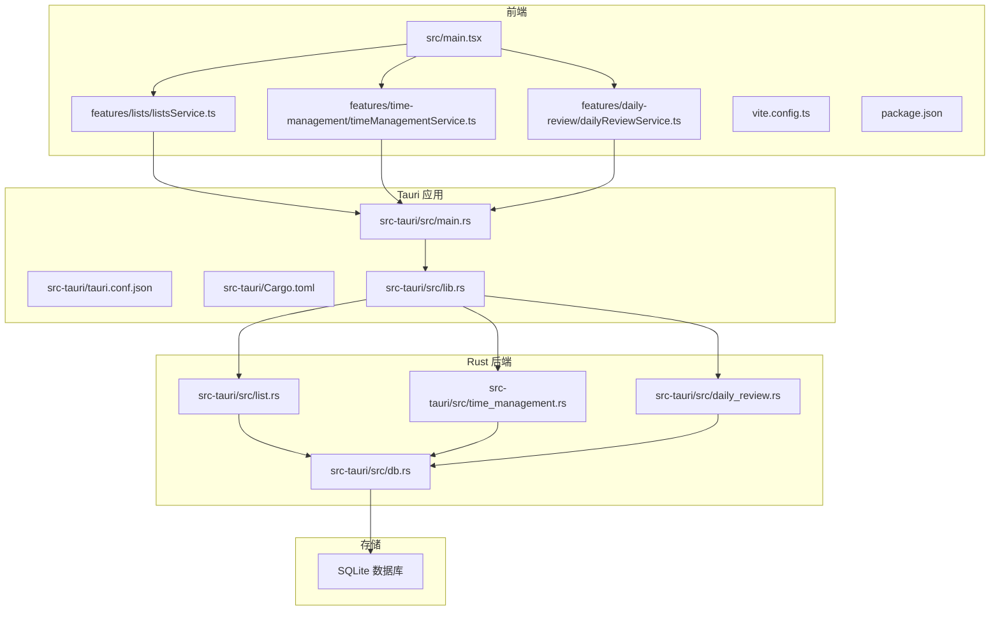
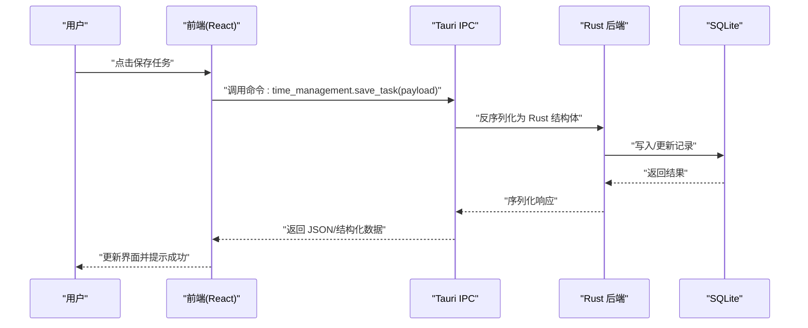
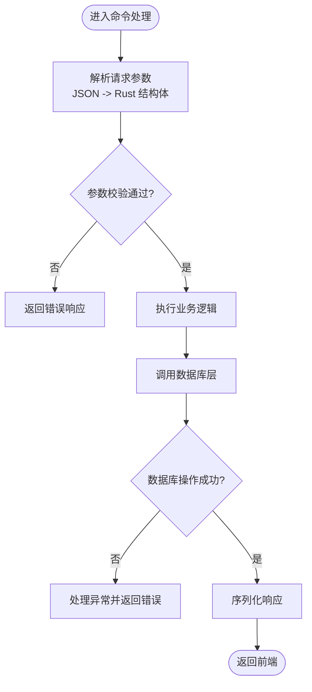
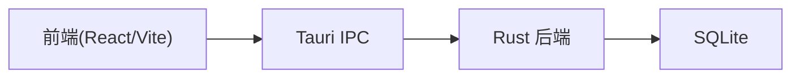

# 整体架构概览

<cite>
**本文引用的文件**   
- [README.md](file://README.md)
- [package.json](file://package.json)
- [vite.config.ts](file://vite.config.ts)
- [src/main.tsx](file://src/main.tsx)
- [src/features/lists/listsService.ts](file://src/features/lists/listsService.ts)
- [src/features/time-management/timeManagementService.ts](file://src/features/time-management/timeManagementService.ts)
- [src/features/daily-review/dailyReviewService.ts](file://src/features/daily-review/dailyReviewService.ts)
- [src-tauri/tauri.conf.json](file://src-tauri/tauri.conf.json)
- [src-tauri/Cargo.toml](file://src-tauri/Cargo.toml)
- [src-tauri/src/main.rs](file://src-tauri/src/main.rs)
- [src-tauri/src/lib.rs](file://src-tauri/src/lib.rs)
- [src-tauri/src/db.rs](file://src-tauri/src/db.rs)
- [src-tauri/src/list.rs](file://src-tauri/src/list.rs)
- [src-tauri/src/time_management.rs](file://src-tauri/src/time_management.rs)
- [src-tauri/src/daily_review.rs](file://src-tauri/src/daily_review.rs)
</cite>

## 目录
1. [简介](#简介)
2. [项目结构](#项目结构)
3. [核心组件](#核心组件)
4. [架构总览](#架构总览)
5. [详细组件分析](#详细组件分析)
6. [依赖关系分析](#依赖关系分析)
7. [性能考量](#性能考量)
8. [故障排查指南](#故障排查指南)
9. [结论](#结论)
10. [附录](#附录)

## 简介
FishWorker 是一款基于 Tauri + React 的桌面应用，采用“前端 UI 层 — Tauri IPC 通信层 — Rust 后端服务层 — 数据库层”的分层架构。前端使用 React 与 Vite 构建，通过 Tauri 的命令机制调用 Rust 侧能力；Rust 侧负责业务逻辑、持久化与系统资源访问，并通过 SQLite 进行数据持久化。该设计在保持现代 Web 开发体验的同时，显著降低运行时体积与内存占用，提升启动速度与安全性。

## 项目结构
仓库采用前后端分离的组织方式：
- 前端（src）：React 应用、功能特性模块、UI 组件与服务封装
- 后端（src-tauri）：Tauri 应用入口、命令注册、领域服务与数据库访问
- 配置与脚本：Vite 构建配置、Tauri 配置、包管理清单等

图表来源
- [src/main.tsx:1-200](file://src/main.tsx#L1-L200)
- [src/features/lists/listsService.ts:1-200](file://src/features/lists/listsService.ts#L1-L200)
- [src/features/time-management/timeManagementService.ts:1-200](file://src/features/time-management/timeManagementService.ts#L1-L200)
- [src/features/daily-review/dailyReviewService.ts:1-200](file://src/features/daily-review/dailyReviewService.ts#L1-L200)
- [src-tauri/tauri.conf.json:1-200](file://src-tauri/tauri.conf.json#L1-L200)
- [src-tauri/Cargo.toml:1-200](file://src-tauri/Cargo.toml#L1-L200)
- [src-tauri/src/main.rs:1-200](file://src-tauri/src/main.rs#L1-L200)
- [src-tauri/src/lib.rs:1-200](file://src-tauri/src/lib.rs#L1-L200)
- [src-tauri/src/db.rs:1-200](file://src-tauri/src/db.rs#L1-L200)
- [src-tauri/src/list.rs:1-200](file://src-tauri/src/list.rs#L1-L200)
- [src-tauri/src/time_management.rs:1-200](file://src-tauri/src/time_management.rs#L1-L200)
- [src-tauri/src/daily_review.rs:1-200](file://src-tauri/src/daily_review.rs#L1-L200)

章节来源
- [README.md:1-200](file://README.md#L1-L200)
- [package.json:1-200](file://package.json#L1-L200)
- [vite.config.ts:1-200](file://vite.config.ts#L1-L200)
- [src-tauri/tauri.conf.json:1-200](file://src-tauri/tauri.conf.json#L1-L200)
- [src-tauri/Cargo.toml:1-200](file://src-tauri/Cargo.toml#L1-L200)

## 核心组件
- 前端应用层
  - 入口与路由组织：[src/main.tsx](file://src/main.tsx)
  - 特性服务封装：列表、时间管理、每日复盘等服务分别封装了与后端的交互
    - [src/features/lists/listsService.ts](file://src/features/lists/listsService.ts)
    - [src/features/time-management/timeManagementService.ts](file://src/features/time-management/timeManagementService.ts)
    - [src/features/daily-review/dailyReviewService.ts](file://src/features/daily-review/dailyReviewService.ts)
- Tauri 通信层
  - 应用配置与权限：[src-tauri/tauri.conf.json](file://src-tauri/tauri.conf.json)
  - Rust 依赖与插件：[src-tauri/Cargo.toml](file://src-tauri/Cargo.toml)
  - 进程入口与命令注册：[src-tauri/src/main.rs](file://src-tauri/src/main.rs)、[src-tauri/src/lib.rs](file://src-tauri/src/lib.rs)
- Rust 后端服务层
  - 领域服务：列表、时间管理、每日复盘
    - [src-tauri/src/list.rs](file://src-tauri/src/list.rs)
    - [src-tauri/src/time_management.rs](file://src-tauri/src/time_management.rs)
    - [src-tauri/src/daily_review.rs](file://src-tauri/src/daily_review.rs)
  - 数据库访问抽象：[src-tauri/src/db.rs](file://src-tauri/src/db.rs)
- 数据存储层
  - SQLite 本地数据库（由 Rust 驱动访问）

章节来源
- [src/main.tsx:1-200](file://src/main.tsx#L1-L200)
- [src/features/lists/listsService.ts:1-200](file://src/features/lists/listsService.ts#L1-L200)
- [src/features/time-management/timeManagementService.ts:1-200](file://src/features/time-management/timeManagementService.ts#L1-L200)
- [src/features/daily-review/dailyReviewService.ts:1-200](file://src/features/daily-review/dailyReviewService.ts#L1-L200)
- [src-tauri/tauri.conf.json:1-200](file://src-tauri/tauri.conf.json#L1-L200)
- [src-tauri/Cargo.toml:1-200](file://src-tauri/Cargo.toml#L1-L200)
- [src-tauri/src/main.rs:1-200](file://src-tauri/src/main.rs#L1-L200)
- [src-tauri/src/lib.rs:1-200](file://src-tauri/src/lib.rs#L1-L200)
- [src-tauri/src/db.rs:1-200](file://src-tauri/src/db.rs#L1-L200)
- [src-tauri/src/list.rs:1-200](file://src-tauri/src/list.rs#L1-L200)
- [src-tauri/src/time_management.rs:1-200](file://src-tauri/src/time_management.rs#L1-L200)
- [src-tauri/src/daily_review.rs:1-200](file://src-tauri/src/daily_review.rs#L1-L200)

## 架构总览
FishWorker 采用四层分层架构：
- 前端 React 应用层：渲染界面、处理用户交互、维护状态、发起 IPC 请求
- Tauri IPC 通信层：桥接前端与 Rust，提供类型安全的命令通道与序列化协议
- Rust 后端服务层：实现领域逻辑、编排数据库操作、暴露命令接口
- 数据库层：SQLite 本地存储，提供事务与一致性保障

图表来源
- [src/features/time-management/timeManagementService.ts:1-200](file://src/features/time-management/timeManagementService.ts#L1-L200)
- [src-tauri/src/lib.rs:1-200](file://src-tauri/src/lib.rs#L1-L200)
- [src-tauri/src/time_management.rs:1-200](file://src-tauri/src/time_management.rs#L1-L200)
- [src-tauri/src/db.rs:1-200](file://src-tauri/src/db.rs#L1-L200)

## 详细组件分析

### 前端 React 应用层
- 职责
  - 页面与组件渲染、用户交互事件处理
  - 状态管理与数据缓存（如 Zustand/Store）
  - 封装对 Tauri 命令的调用，统一错误处理与重试策略
- 关键文件
  - 应用入口与初始化：[src/main.tsx](file://src/main.tsx)
  - 列表特性服务：[src/features/lists/listsService.ts](file://src/features/lists/listsService.ts)
  - 时间管理服务：[src/features/time-management/timeManagementService.ts](file://src/features/time-management/timeManagementService.ts)
  - 每日复盘服务：[src/features/daily-review/dailyReviewService.ts](file://src/features/daily-review/dailyReviewService.ts)
- 交互模式
  - 通过 Tauri invoke 调用后端命令，参数为 JSON 对象，返回 Promise
  - 统一错误码映射到用户可理解的提示

章节来源
- [src/main.tsx:1-200](file://src/main.tsx#L1-L200)
- [src/features/lists/listsService.ts:1-200](file://src/features/lists/listsService.ts#L1-L200)
- [src/features/time-management/timeManagementService.ts:1-200](file://src/features/time-management/timeManagementService.ts#L1-L200)
- [src/features/daily-review/dailyReviewService.ts:1-200](file://src/features/daily-review/dailyReviewService.ts#L1-L200)

### Tauri IPC 通信层
- 职责
  - 定义与注册命令，将前端调用转发至 Rust 函数
  - 处理跨语言序列化/反序列化（JSON ↔ Rust 结构体）
  - 权限与能力声明，限制前端可访问的后端能力
- 关键文件
  - 应用配置与能力：[src-tauri/tauri.conf.json](file://src-tauri/tauri.conf.json)
  - Rust 依赖与插件：[src-tauri/Cargo.toml](file://src-tauri/Cargo.toml)
  - 进程入口与命令注册：[src-tauri/src/main.rs](file://src-tauri/src/main.rs)、[src-tauri/src/lib.rs](file://src-tauri/src/lib.rs)
- 命令注册机制
  - 在 lib.rs 中集中注册命令，按领域划分模块（list、time_management、daily_review）
  - main.rs 负责应用生命周期与窗口初始化
- 通信协议
  - 请求/响应以 JSON 为载体，字段命名在前端与 Rust 结构体间保持一致
  - 错误信息通过统一错误结构传递，便于前端解析与展示

章节来源
- [src-tauri/tauri.conf.json:1-200](file://src-tauri/tauri.conf.json#L1-L200)
- [src-tauri/Cargo.toml:1-200](file://src-tauri/Cargo.toml#L1-L200)
- [src-tauri/src/main.rs:1-200](file://src-tauri/src/main.rs#L1-L200)
- [src-tauri/src/lib.rs:1-200](file://src-tauri/src/lib.rs#L1-L200)

### Rust 后端服务层
- 职责
  - 实现领域逻辑（列表、时间管理、每日复盘）
  - 编排数据库访问，保证事务性与一致性
  - 暴露稳定的命令接口供前端调用
- 关键文件
  - 列表服务：[src-tauri/src/list.rs](file://src-tauri/src/list.rs)
  - 时间管理服务：[src-tauri/src/time_management.rs](file://src-tauri/src/time_management.rs)
  - 每日复盘服务：[src-tauri/src/daily_review.rs](file://src-tauri/src/daily_review.rs)
  - 数据库访问抽象：[src-tauri/src/db.rs](file://src-tauri/src/db.rs)
- 数据处理流程
  - 接收前端 JSON → 反序列化为 Rust 结构体 → 执行业务规则 → 执行 SQL → 返回结果

图表来源
- [src-tauri/src/time_management.rs:1-200](file://src-tauri/src/time_management.rs#L1-L200)
- [src-tauri/src/db.rs:1-200](file://src-tauri/src/db.rs#L1-L200)

章节来源
- [src-tauri/src/list.rs:1-200](file://src-tauri/src/list.rs#L1-L200)
- [src-tauri/src/time_management.rs:1-200](file://src-tauri/src/time_management.rs#L1-L200)
- [src-tauri/src/daily_review.rs:1-200](file://src-tauri/src/daily_review.rs#L1-L200)
- [src-tauri/src/db.rs:1-200](file://src-tauri/src/db.rs#L1-L200)

### 数据库层
- 职责
  - 提供统一的数据库连接与查询封装
  - 管理表结构与迁移（schema）
  - 确保事务边界与错误回滚
- 关键文件
  - 数据库抽象与连接：[src-tauri/src/db.rs](file://src-tauri/src/db.rs)
  - 领域模型与表结构定义：[src-tauri/src/schema.rs](file://src-tauri/src/schema.rs)

章节来源
- [src-tauri/src/db.rs:1-200](file://src-tauri/src/db.rs#L1-L200)
- [src-tauri/src/schema.rs:1-200](file://src-tauri/src/schema.rs#L1-L200)

## 依赖关系分析
- 前端依赖
  - React 生态与 Vite 构建工具链
  - 各特性服务依赖 Tauri 客户端 SDK 调用命令
- Tauri 应用依赖
  - Tauri 运行时与插件体系
  - Rust 标准库与第三方 crate（如数据库驱动、序列化库）
- Rust 后端依赖
  - 领域服务依赖数据库抽象层
  - 数据库层依赖 SQLite 驱动与连接池

图表来源
- [src-tauri/Cargo.toml:1-200](file://src-tauri/Cargo.toml#L1-L200)
- [package.json:1-200](file://package.json#L1-L200)
- [vite.config.ts:1-200](file://vite.config.ts#L1-L200)

章节来源
- [src-tauri/Cargo.toml:1-200](file://src-tauri/Cargo.toml#L1-L200)
- [package.json:1-200](file://package.json#L1-L200)
- [vite.config.ts:1-200](file://vite.config.ts#L1-L200)

## 性能考量
- 启动速度
  - Tauri 基于系统 WebView，相比 Electron 更轻量，减少主进程与渲染进程开销
- 内存占用
  - 无 Node.js 运行时，内存占用更低，适合长时间驻留的桌面应用
- I/O 与并发
  - Rust 后端具备高并发与低延迟优势，结合 SQLite 的 WAL 模式可提升读写性能
- 序列化成本
  - 合理设计 JSON 结构，避免大对象频繁传输；必要时采用分页或增量更新

## 故障排查指南
- 常见问题定位
  - 前端调用失败：检查 Tauri 命令是否注册、权限是否开启、网络/路径是否正确
  - 后端异常：查看 Rust 日志与错误栈，确认数据库连接与事务状态
  - 数据不一致：核对 schema 版本与迁移脚本，确保表结构一致
- 建议步骤
  - 启用调试日志，捕获请求/响应载荷
  - 使用最小复现用例验证问题范围
  - 隔离数据库层，先验证 SQL 语句与索引效率

章节来源
- [src-tauri/src/main.rs:1-200](file://src-tauri/src/main.rs#L1-L200)
- [src-tauri/src/lib.rs:1-200](file://src-tauri/src/lib.rs#L1-L200)
- [src-tauri/src/db.rs:1-200](file://src-tauri/src/db.rs#L1-L200)

## 结论
FishWorker 通过 Tauri + React 的分层架构，实现了清晰的职责划分与高效的跨进程通信。前端专注于用户体验与交互，Rust 后端承担核心业务与数据持久化，SQLite 提供稳定可靠的本地存储。相较传统 Electron 方案，该架构在体积、内存与启动速度方面具备明显优势，同时保持了现代 Web 开发的灵活性与生产力。

## 附录
- 技术决策说明
  - 选择 Tauri + React 的原因
    - 更小的安装包与更低的内存占用
    - 更好的启动性能与系统级集成能力
    - 利用 Rust 的高性能与安全性，强化后端稳定性
  - 与传统 Electron 方案的对比
    - Electron 基于 Chromium + Node.js，体积较大且内存占用较高
    - Tauri 使用系统 WebView 与原生后端，更适合桌面端长期运行场景
- 系统边界定义
  - 外部系统：无直接外部 API 依赖（本地优先）
  - 内部边界：前端与后端通过 Tauri IPC 严格隔离，仅暴露必要命令
- 部署拓扑图
  - 单进程桌面应用，包含 WebView 容器与 Rust 后端进程
  - 本地 SQLite 文件作为唯一数据源