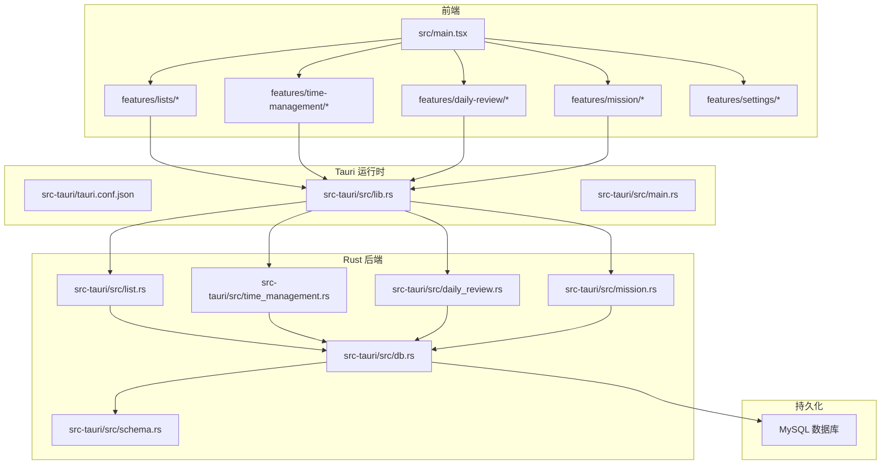
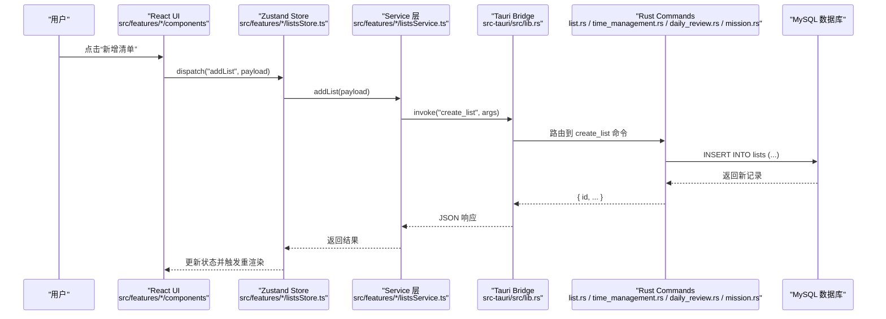
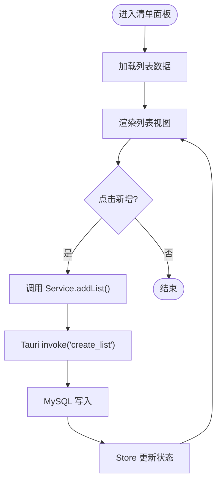
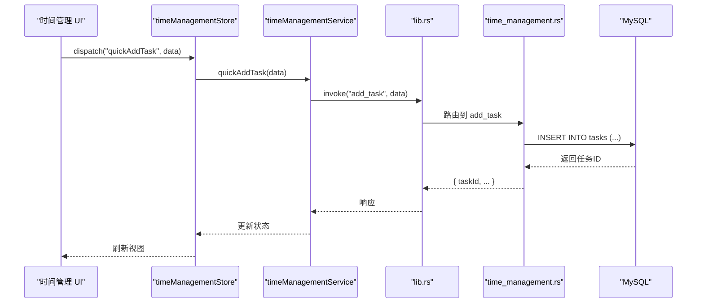
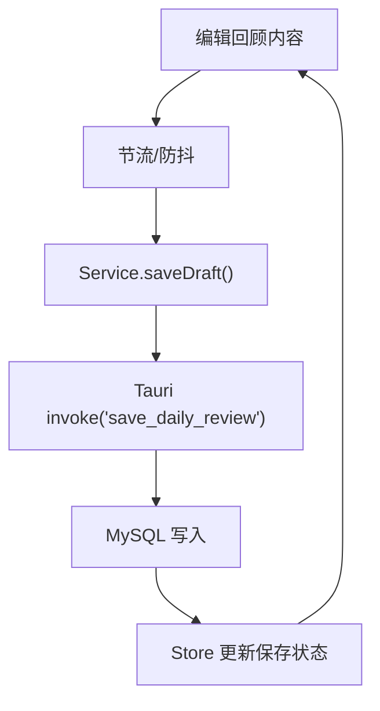
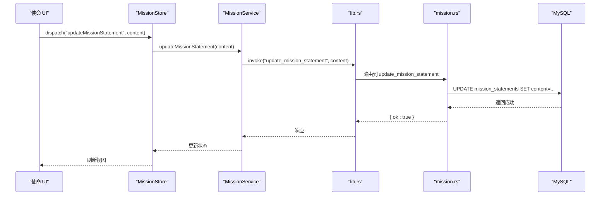
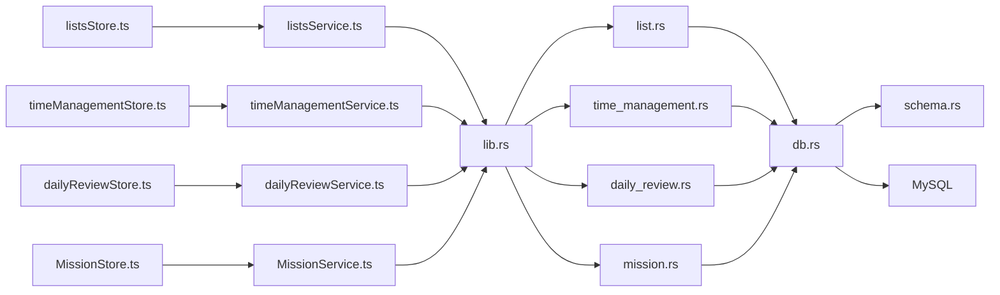

# 整体架构模式

<cite>
**本文引用的文件**   
- [README.md](file://README.md)
- [package.json](file://package.json)
- [vite.config.ts](file://vite.config.ts)
- [tsconfig.json](file://tsconfig.json)
- [src/main.tsx](file://src/main.tsx)
- [src-tauri/tauri.conf.json](file://src-tauri/tauri.conf.json)
- [src-tauri/Cargo.toml](file://src-tauri/Cargo.toml)
- [src-tauri/src/lib.rs](file://src-tauri/src/lib.rs)
- [src-tauri/src/main.rs](file://src-tauri/src/main.rs)
- [src-tauri/src/db.rs](file://src-tauri/src/db.rs)
- [src-tauri/src/schema.rs](file://src-tauri/src/schema.rs)
- [src-tauri/src/list.rs](file://src-tauri/src/list.rs)
- [src-tauri/src/time_management.rs](file://src-tauri/src/time_management.rs)
- [src-tauri/src/daily_review.rs](file://src-tauri/src/daily_review.rs)
- [src-tauri/src/mission.rs](file://src-tauri/src/mission.rs)
- [src/features/lists/listsStore.ts](file://src/features/lists/listsStore.ts)
- [src/features/lists/listsService.ts](file://src/features/lists/listsService.ts)
- [src/features/lists/listsTypes.ts](file://src/features/lists/listsTypes.ts)
- [src/features/time-management/timeManagementStore.ts](file://src/features/time-management/timeManagementStore.ts)
- [src/features/time-management/timeManagementService.ts](file://src/features/time-management/timeManagementService.ts)
- [src/features/time-management/timeManagementTypes.ts](file://src/features/time-management/timeManagementTypes.ts)
- [src/features/daily-review/dailyReviewStore.ts](file://src/features/daily-review/dailyReviewStore.ts)
- [src/features/daily-review/dailyReviewService.ts](file://src/features/daily-review/dailyReviewService.ts)
- [src/features/daily-review/dailyReviewTypes.ts](file://src/features/daily-review/dailyReviewTypes.ts)
- [src/features/mission/MissionStore.ts](file://src/features/mission/MissionStore.ts)
- [src/features/mission/MissionService.ts](file://src/features/mission/MissionService.ts)
- [src/features/mission/MissionTypes.ts](file://src/features/mission/MissionTypes.ts)
- [src/features/habits/HabitPanel.tsx](file://src/features/habits/HabitPanel.tsx)
- [src/features/settings/preferencesStore.ts](file://src/features/settings/preferencesStore.ts)
</cite>

## 目录
1. [简介](#简介)
2. [项目结构](#项目结构)
3. [核心组件](#核心组件)
4. [架构总览](#架构总览)
5. [详细组件分析](#详细组件分析)
6. [依赖关系分析](#依赖关系分析)
7. [性能考量](#性能考量)
8. [故障排查指南](#故障排查指南)
9. [结论](#结论)
10. [附录](#附录)

## 简介
本文件为 FishWorker 应用的“整体架构模式”文档，聚焦前后端分离的架构设计与 Tauri 集成方案。应用采用四层分层：表现层（React UI）、业务逻辑层（Zustand Store + Service Layer）、数据访问层（Tauri Commands + Rust Backend）、持久化层（MySQL Database）。文档将阐述各层职责、交互方式、技术选型与权衡、系统边界、模块依赖与扩展点，并提供高层架构图与数据流向图，展示从用户操作到数据存储的完整路径。

## 项目结构
FishWorker 采用前端 Vite + React + TypeScript 与后端 Tauri + Rust 的双仓式组织：
- 前端 src：按功能域 features 划分，每个领域包含 Store（状态）、Service（服务）、Types（类型）与 UI 组件。
- 后端 src-tauri：Rust 实现 Tauri Commands，负责数据库连接、Schema 管理与具体业务命令。
- 配置与构建：Vite 构建前端资源；Tauri 打包桌面应用并桥接前端与 Rust。

图表来源
- [src/main.tsx:1-200](file://src/main.tsx#L1-L200)
- [src-tauri/tauri.conf.json:1-200](file://src-tauri/tauri.conf.json#L1-L200)
- [src-tauri/src/lib.rs:1-200](file://src-tauri/src/lib.rs#L1-L200)
- [src-tauri/src/main.rs:1-200](file://src-tauri/src/main.rs#L1-L200)
- [src-tauri/src/db.rs:1-200](file://src-tauri/src/db.rs#L1-L200)
- [src-tauri/src/schema.rs:1-200](file://src-tauri/src/schema.rs#L1-L200)
- [src-tauri/src/list.rs:1-200](file://src-tauri/src/list.rs#L1-L200)
- [src-tauri/src/time_management.rs:1-200](file://src-tauri/src/time_management.rs#L1-L200)
- [src-tauri/src/daily_review.rs:1-200](file://src-tauri/src/daily_review.rs#L1-L200)
- [src-tauri/src/mission.rs:1-200](file://src-tauri/src/mission.rs#L1-L200)

章节来源
- [README.md:1-200](file://README.md#L1-L200)
- [package.json:1-200](file://package.json#L1-L200)
- [vite.config.ts:1-200](file://vite.config.ts#L1-L200)
- [tsconfig.json:1-200](file://tsconfig.json#L1-L200)
- [src/main.tsx:1-200](file://src/main.tsx#L1-L200)
- [src-tauri/tauri.conf.json:1-200](file://src-tauri/tauri.conf.json#L1-L200)
- [src-tauri/Cargo.toml:1-200](file://src-tauri/Cargo.toml#L1-L200)

## 核心组件
- 表现层（React UI）
  - 以 features 为维度组织页面与组件，通过 Zustand Store 管理领域状态，Service 层封装跨进程调用。
  - 入口文件初始化应用与路由挂载。
- 业务逻辑层（Zustand Store + Service Layer）
  - Store 定义状态与动作，Service 提供异步方法，内部通过 Tauri invoke 调用 Rust Commands。
  - 类型定义集中管理，保证前后端数据结构一致。
- 数据访问层（Tauri Commands + Rust Backend）
  - lib.rs 注册所有 Commands，main.rs 启动 Tauri 应用。
  - db.rs 管理数据库连接与事务，schema.rs 维护表结构与迁移。
  - list.rs、time_management.rs、daily_review.rs、mission.rs 分别暴露领域命令。
- 持久化层（MySQL Database）
  - 通过 Rust 驱动连接 MySQL，执行 SQL 查询与更新。

章节来源
- [src/features/lists/listsStore.ts:1-200](file://src/features/lists/listsStore.ts#L1-L200)
- [src/features/lists/listsService.ts:1-200](file://src/features/lists/listsService.ts#L1-L200)
- [src/features/lists/listsTypes.ts:1-200](file://src/features/lists/listsTypes.ts#L1-L200)
- [src/features/time-management/timeManagementStore.ts:1-200](file://src/features/time-management/timeManagementStore.ts#L1-L200)
- [src/features/time-management/timeManagementService.ts:1-200](file://src/features/time-management/timeManagementService.ts#L1-L200)
- [src/features/time-management/timeManagementTypes.ts:1-200](file://src/features/time-management/timeManagementTypes.ts#L1-L200)
- [src/features/daily-review/dailyReviewStore.ts:1-200](file://src/features/daily-review/dailyReviewStore.ts#L1-L200)
- [src/features/daily-review/dailyReviewService.ts:1-200](file://src/features/daily-review/dailyReviewService.ts#L1-L200)
- [src/features/daily-review/dailyReviewTypes.ts:1-200](file://src/features/daily-review/dailyReviewTypes.ts#L1-L200)
- [src/features/mission/MissionStore.ts:1-200](file://src/features/mission/MissionStore.ts#L1-L200)
- [src/features/mission/MissionService.ts:1-200](file://src/features/mission/MissionService.ts#L1-L200)
- [src/features/mission/MissionTypes.ts:1-200](file://src/features/mission/MissionTypes.ts#L1-L200)
- [src-tauri/src/lib.rs:1-200](file://src-tauri/src/lib.rs#L1-L200)
- [src-tauri/src/main.rs:1-200](file://src-tauri/src/main.rs#L1-L200)
- [src-tauri/src/db.rs:1-200](file://src-tauri/src/db.rs#L1-L200)
- [src-tauri/src/schema.rs:1-200](file://src-tauri/src/schema.rs#L1-L200)
- [src-tauri/src/list.rs:1-200](file://src-tauri/src/list.rs#L1-L200)
- [src-tauri/src/time_management.rs:1-200](file://src-tauri/src/time_management.rs#L1-L200)
- [src-tauri/src/daily_review.rs:1-200](file://src-tauri/src/daily_review.rs#L1-L200)
- [src-tauri/src/mission.rs:1-200](file://src-tauri/src/mission.rs#L1-L200)

## 架构总览
FishWorker 采用“前端单页应用 + Tauri 桌面壳 + Rust 本地后端 + MySQL 持久化”的分层架构。前端通过 Tauri 的 invoke 机制调用 Rust Commands，Rust 侧统一在 lib.rs 中注册命令，并通过 db.rs 与 schema.rs 完成数据访问与结构管理。

图表来源
- [src/features/lists/listsStore.ts:1-200](file://src/features/lists/listsStore.ts#L1-L200)
- [src/features/lists/listsService.ts:1-200](file://src/features/lists/listsService.ts#L1-L200)
- [src-tauri/src/lib.rs:1-200](file://src-tauri/src/lib.rs#L1-L200)
- [src-tauri/src/list.rs:1-200](file://src-tauri/src/list.rs#L1-L200)
- [src-tauri/src/db.rs:1-200](file://src-tauri/src/db.rs#L1-L200)

## 详细组件分析

### 清单列表（Lists）模块
- 职责划分
  - Store：定义列表集合、选中项、加载状态等；提供增删改查动作。
  - Service：封装 Tauri invoke 调用，处理错误与重试策略。
  - Types：定义 List、Group、Note 等实体类型。
  - UI：面板、抽屉、模态框等组件消费 Store 状态。
- 关键流程
  - 新增清单：UI 触发 -> Store 调用 Service -> Tauri invoke -> Rust Command -> MySQL -> 返回 -> Store 更新。
- 复杂度与优化
  - 列表排序与拖拽使用本地算法，避免频繁往返数据库。
  - 批量导出通过 Service 聚合数据后一次性写入。

图表来源
- [src/features/lists/listsStore.ts:1-200](file://src/features/lists/listsStore.ts#L1-L200)
- [src/features/lists/listsService.ts:1-200](file://src/features/lists/listsService.ts#L1-L200)
- [src-tauri/src/list.rs:1-200](file://src-tauri/src/list.rs#L1-L200)
- [src-tauri/src/db.rs:1-200](file://src-tauri/src/db.rs#L1-L200)

章节来源
- [src/features/lists/listsStore.ts:1-200](file://src/features/lists/listsStore.ts#L1-L200)
- [src/features/lists/listsService.ts:1-200](file://src/features/lists/listsService.ts#L1-L200)
- [src/features/lists/listsTypes.ts:1-200](file://src/features/lists/listsTypes.ts#L1-L200)
- [src-tauri/src/list.rs:1-200](file://src-tauri/src/list.rs#L1-L200)

### 时间管理（Time Management）模块
- 职责划分
  - Store：管理任务、四象限分组、周计划等状态。
  - Service：封装时间相关命令（创建任务、更新优先级、归档等）。
  - Types：Task、Quadrant、WeekPlan 等类型。
- 关键流程
  - 快速添加任务：UI 输入 -> Store 调用 Service -> Tauri invoke -> Rust Command -> MySQL -> 返回 -> Store 更新。
- 复杂度与优化
  - 四象限计算在 Store 内完成，减少后端压力。
  - 周计划合并提交，降低数据库写放大。

图表来源
- [src/features/time-management/timeManagementStore.ts:1-200](file://src/features/time-management/timeManagementStore.ts#L1-L200)
- [src/features/time-management/timeManagementService.ts:1-200](file://src/features/time-management/timeManagementService.ts#L1-L200)
- [src-tauri/src/time_management.rs:1-200](file://src-tauri/src/time_management.rs#L1-L200)
- [src-tauri/src/db.rs:1-200](file://src-tauri/src/db.rs#L1-L200)

章节来源
- [src/features/time-management/timeManagementStore.ts:1-200](file://src/features/time-management/timeManagementStore.ts#L1-L200)
- [src/features/time-management/timeManagementService.ts:1-200](file://src/features/time-management/timeManagementService.ts#L1-L200)
- [src/features/time-management/timeManagementTypes.ts:1-200](file://src/features/time-management/timeManagementTypes.ts#L1-L200)
- [src-tauri/src/time_management.rs:1-200](file://src-tauri/src/time_management.rs#L1-L200)

### 每日回顾（Daily Review）模块
- 职责划分
  - Store：管理回顾内容、自动保存开关、草稿状态。
  - Service：封装每日回顾的读取与保存命令。
  - Types：Review 实体类型。
- 关键流程
  - 自动保存：编辑器变更 -> Store 节流 -> Service 调用 -> Tauri invoke -> Rust Command -> MySQL 落盘。
- 复杂度与优化
  - 使用节流与防抖策略，避免高频写入。
  - 支持离线草稿，网络恢复后同步。

图表来源
- [src/features/daily-review/dailyReviewStore.ts:1-200](file://src/features/daily-review/dailyReviewStore.ts#L1-L200)
- [src/features/daily-review/dailyReviewService.ts:1-200](file://src/features/daily-review/dailyReviewService.ts#L1-L200)
- [src-tauri/src/daily_review.rs:1-200](file://src-tauri/src/daily_review.rs#L1-L200)
- [src-tauri/src/db.rs:1-200](file://src-tauri/src/db.rs#L1-L200)

章节来源
- [src/features/daily-review/dailyReviewStore.ts:1-200](file://src/features/daily-review/dailyReviewStore.ts#L1-L200)
- [src/features/daily-review/dailyReviewService.ts:1-200](file://src/features/daily-review/dailyReviewService.ts#L1-L200)
- [src/features/daily-review/dailyReviewTypes.ts:1-200](file://src/features/daily-review/dailyReviewTypes.ts#L1-L200)
- [src-tauri/src/daily_review.rs:1-200](file://src-tauri/src/daily_review.rs#L1-L200)

### 使命（Mission）模块
- 职责划分
  - Store：管理目标、角色、使命陈述等状态。
  - Service：封装使命相关的 CRUD 命令。
  - Types：Goal、Role、MissionStatement 等类型。
- 关键流程
  - 更新使命陈述：UI 编辑 -> Store 调用 Service -> Tauri invoke -> Rust Command -> MySQL -> 返回 -> Store 更新。
- 复杂度与优化
  - 大文本内容分块存储，提升读写性能。
  - 版本化历史，便于回溯。

图表来源
- [src/features/mission/MissionStore.ts:1-200](file://src/features/mission/MissionStore.ts#L1-L200)
- [src/features/mission/MissionService.ts:1-200](file://src/features/mission/MissionService.ts#L1-L200)
- [src-tauri/src/mission.rs:1-200](file://src-tauri/src/mission.rs#L1-L200)
- [src-tauri/src/db.rs:1-200](file://src-tauri/src/db.rs#L1-L200)

章节来源
- [src/features/mission/MissionStore.ts:1-200](file://src/features/mission/MissionStore.ts#L1-L200)
- [src/features/mission/MissionService.ts:1-200](file://src/features/mission/MissionService.ts#L1-L200)
- [src/features/mission/MissionTypes.ts:1-200](file://src/features/mission/MissionTypes.ts#L1-L200)
- [src-tauri/src/mission.rs:1-200](file://src-tauri/src/mission.rs#L1-L200)

### 习惯（Habits）模块
- 职责划分
  - Store：管理习惯列表、打卡状态、统计信息。
  - Service：封装习惯相关命令（创建、打卡、删除）。
  - Types：Habit、Checkin 等类型。
  - UI：卡片、详情侧边栏、编辑弹窗等组件。
- 关键流程
  - 打卡：UI 点击 -> Store 调用 Service -> Tauri invoke -> Rust Command -> MySQL -> 返回 -> Store 更新。
- 复杂度与优化
  - 打卡批量提交，减少数据库往返。
  - 统计信息缓存于 Store，避免重复计算。

章节来源
- [src/features/habits/HabitPanel.tsx:1-200](file://src/features/habits/HabitPanel.tsx#L1-L200)

### 设置（Settings）模块
- 职责划分
  - Store：管理偏好设置、数据库连接参数等。
  - UI：设置弹窗、数据库配置面板。
- 关键流程
  - 修改数据库配置：UI 输入 -> Store 持久化 -> 重启或热重载后端连接。

章节来源
- [src/features/settings/preferencesStore.ts:1-200](file://src/features/settings/preferencesStore.ts#L1-L200)

## 依赖关系分析
- 前端依赖
  - React、Vite、TypeScript、Zustand、Tauri Client。
- 后端依赖
  - Tauri、Rust 生态（数据库驱动、序列化库）。
- 模块耦合
  - Store 与 Service 低耦合，通过 Types 契约通信。
  - Service 仅依赖 Tauri invoke，不感知底层实现。
  - Rust Commands 通过 db.rs 与 schema.rs 解耦业务与数据访问。

图表来源
- [src/features/lists/listsStore.ts:1-200](file://src/features/lists/listsStore.ts#L1-L200)
- [src/features/lists/listsService.ts:1-200](file://src/features/lists/listsService.ts#L1-L200)
- [src/features/time-management/timeManagementStore.ts:1-200](file://src/features/time-management/timeManagementStore.ts#L1-L200)
- [src/features/time-management/timeManagementService.ts:1-200](file://src/features/time-management/timeManagementService.ts#L1-L200)
- [src/features/daily-review/dailyReviewStore.ts:1-200](file://src/features/daily-review/dailyReviewStore.ts#L1-L200)
- [src/features/daily-review/dailyReviewService.ts:1-200](file://src/features/daily-review/dailyReviewService.ts#L1-L200)
- [src/features/mission/MissionStore.ts:1-200](file://src/features/mission/MissionStore.ts#L1-L200)
- [src/features/mission/MissionService.ts:1-200](file://src/features/mission/MissionService.ts#L1-L200)
- [src-tauri/src/lib.rs:1-200](file://src-tauri/src/lib.rs#L1-L200)
- [src-tauri/src/list.rs:1-200](file://src-tauri/src/list.rs#L1-L200)
- [src-tauri/src/time_management.rs:1-200](file://src-tauri/src/time_management.rs#L1-L200)
- [src-tauri/src/daily_review.rs:1-200](file://src-tauri/src/daily_review.rs#L1-L200)
- [src-tauri/src/mission.rs:1-200](file://src-tauri/src/mission.rs#L1-L200)
- [src-tauri/src/db.rs:1-200](file://src-tauri/src/db.rs#L1-L200)
- [src-tauri/src/schema.rs:1-200](file://src-tauri/src/schema.rs#L1-L200)

章节来源
- [src-tauri/src/lib.rs:1-200](file://src-tauri/src/lib.rs#L1-L200)
- [src-tauri/src/db.rs:1-200](file://src-tauri/src/db.rs#L1-L200)
- [src-tauri/src/schema.rs:1-200](file://src-tauri/src/schema.rs#L1-L200)

## 性能考量
- 前端
  - 使用节流/防抖减少高频请求。
  - 批量操作合并提交，降低网络与数据库压力。
  - 本地计算与缓存，减少跨进程调用次数。
- 后端
  - 连接池复用数据库连接。
  - 事务包裹批量写入，提高一致性并减少锁竞争。
  - 索引优化与分页查询，提升大数据量下的检索性能。
- 传输
  - 精简 JSON 载荷，避免冗余字段。
  - 错误码与消息结构化，便于前端快速定位问题。

## 故障排查指南
- 常见问题
  - Tauri 调用失败：检查 lib.rs 命令注册与权限配置。
  - 数据库连接异常：核对 db.rs 连接参数与 schema.rs 表结构。
  - 状态不同步：确认 Store 更新逻辑与 Service 返回值一致性。
- 调试建议
  - 启用日志输出，追踪前端 invoke 与后端命令执行链路。
  - 使用浏览器开发者工具与 Tauri 控制台查看错误堆栈。
  - 对关键路径编写单元测试与集成测试，覆盖异常分支。

章节来源
- [src-tauri/src/lib.rs:1-200](file://src-tauri/src/lib.rs#L1-L200)
- [src-tauri/src/db.rs:1-200](file://src-tauri/src/db.rs#L1-L200)
- [src-tauri/src/schema.rs:1-200](file://src-tauri/src/schema.rs#L1-L200)

## 结论
FishWorker 通过清晰的分层与模块化设计，实现了前后端分离与本地高性能数据访问。Zustand Store 与 Service 层解耦了 UI 与数据流，Tauri Commands 提供了稳定可靠的跨进程接口，Rust 后端结合 MySQL 确保了数据安全与可扩展性。该架构具备良好的可维护性与扩展能力，适合持续演进与功能增强。

## 附录
- 技术选型与权衡
  - React + Vite：快速开发体验与良好生态。
  - Zustand：轻量状态管理，易于上手与维护。
  - Tauri：原生性能与较小体积，优于传统 Electron。
  - Rust：内存安全与高并发，适合本地后端。
  - MySQL：成熟稳定，适合结构化数据与复杂查询。
- 系统边界
  - 前端边界：UI 渲染与用户交互。
  - 业务边界：Store 与 Service 的职责范围。
  - 数据边界：Rust Commands 与 db.rs 的数据访问契约。
  - 外部边界：MySQL 数据库与配置文件。
- 扩展点设计
  - 新增领域：在 features 下新建模块，并在 lib.rs 注册对应 Commands。
  - 新增数据源：在 db.rs 扩展连接与事务管理，在 schema.rs 维护结构。
  - 插件化：通过中间件或钩子扩展命令行为，保持向后兼容。