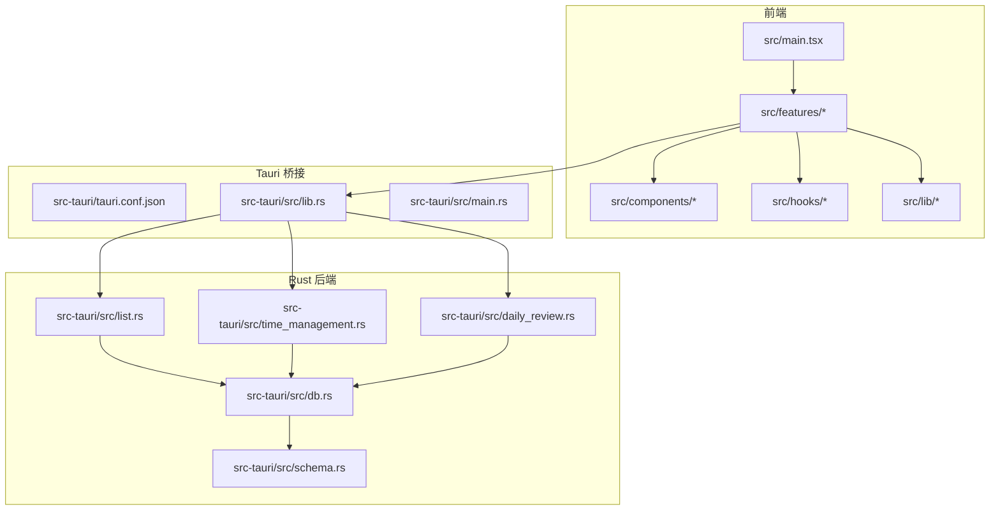
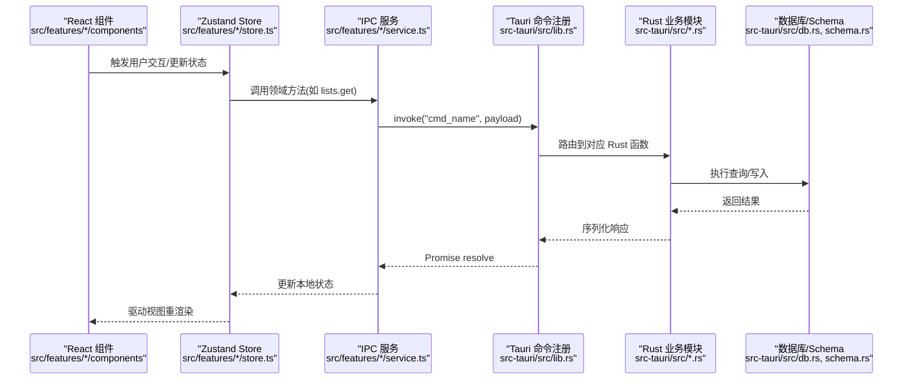
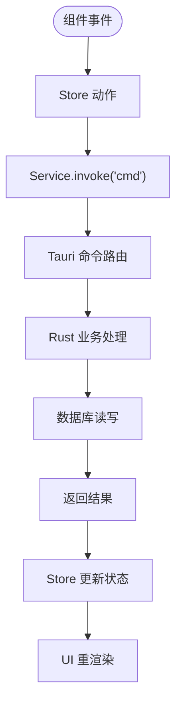
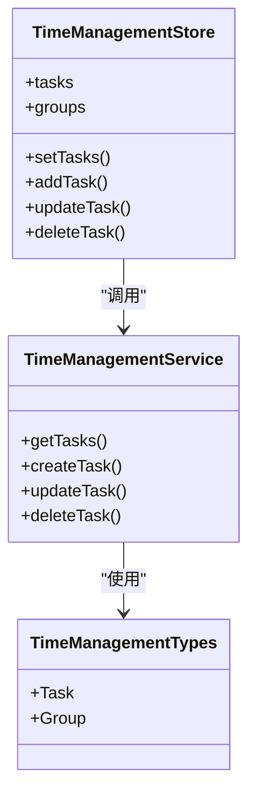
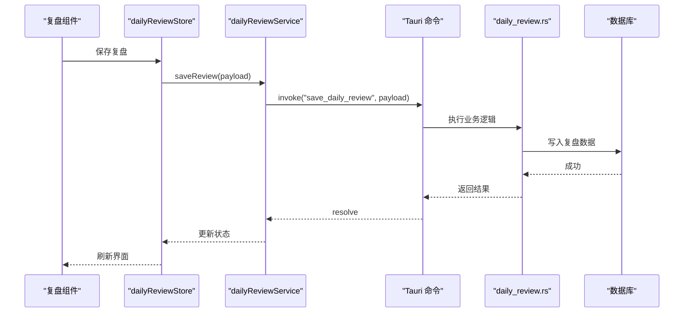
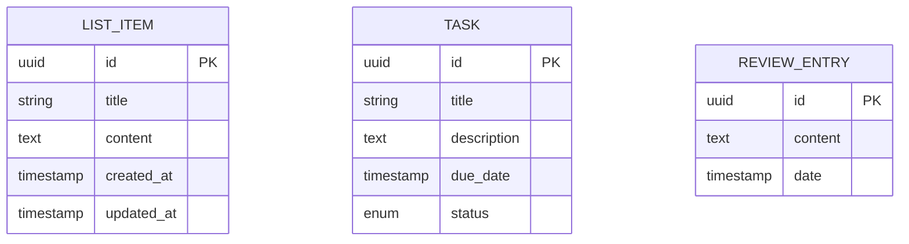
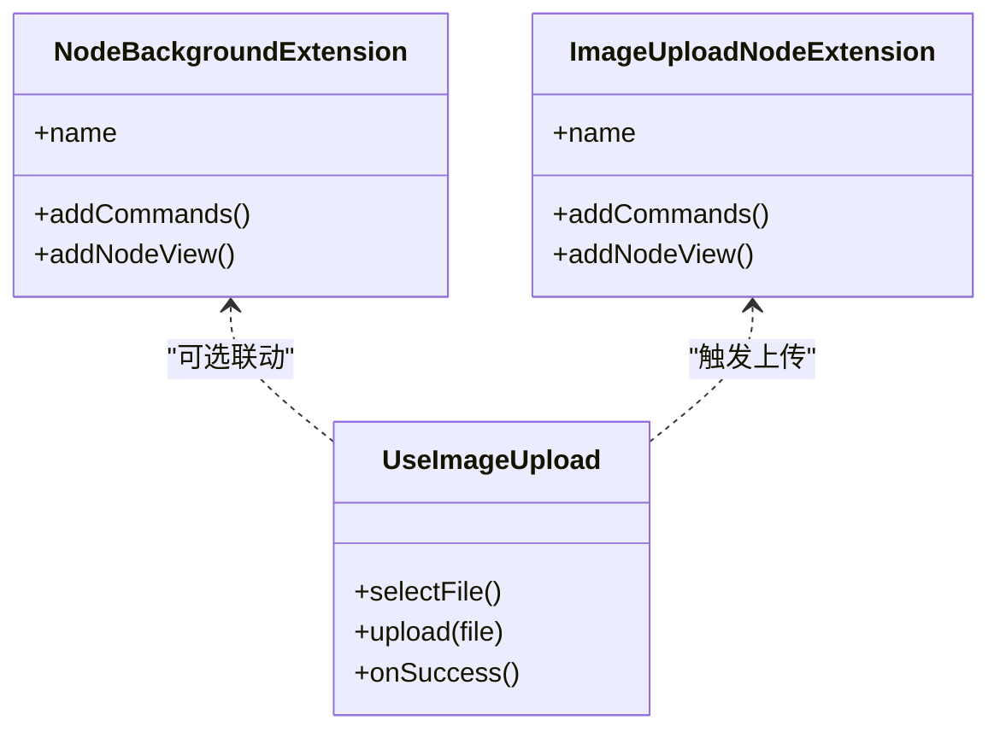
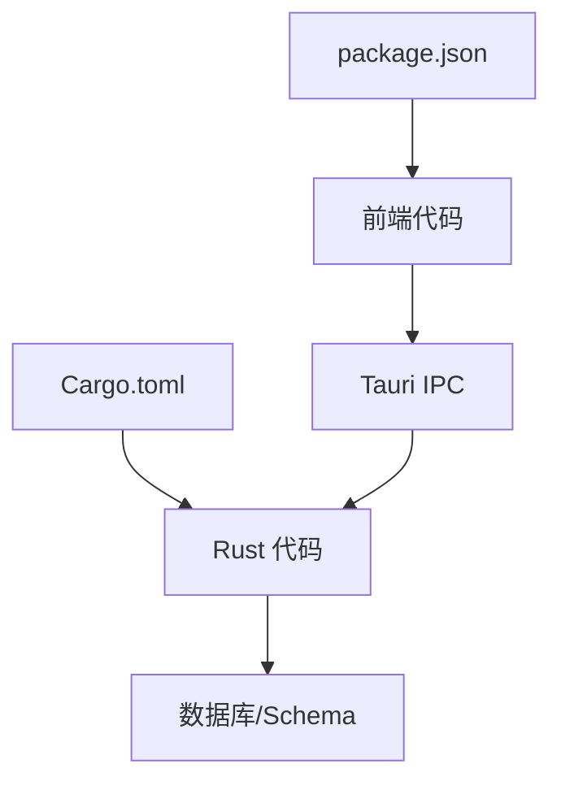

# 架构设计

<cite>
**本文引用的文件**   
- [README.md](file://README.md)
- [package.json](file://package.json)
- [vite.config.ts](file://vite.config.ts)
- [src/main.tsx](file://src/main.tsx)
- [src-tauri/tauri.conf.json](file://src-tauri/tauri.conf.json)
- [src-tauri/Cargo.toml](file://src-tauri/Cargo.toml)
- [src-tauri/src/lib.rs](file://src-tauri/src/lib.rs)
- [src-tauri/src/main.rs](file://src-tauri/src/main.rs)
- [src-tauri/src/db.rs](file://src-tauri/src/db.rs)
- [src-tauri/src/schema.rs](file://src-tauri/src/schema.rs)
- [src-tauri/src/list.rs](file://src-tauri/src/list.rs)
- [src-tauri/src/time_management.rs](file://src-tauri/src/time_management.rs)
- [src-tauri/src/daily_review.rs](file://src-tauri/src/daily_review.rs)
- [src/features/lists/listsStore.ts](file://src/features/lists/listsStore.ts)
- [src/features/lists/listsService.ts](file://src/features/lists/listsService.ts)
- [src/features/lists/listsTypes.ts](file://src/features/lists/listsTypes.ts)
- [src/features/time-management/timeManagementStore.ts](file://src/features/time-management/timeManagementStore.ts)
- [src/features/time-management/timeManagementService.ts](file://src/features/time-management/timeManagementService.ts)
- [src/features/time-management/timeManagementTypes.ts](file://src/features/time-management/timeManagementTypes.ts)
- [src/features/daily-review/dailyReviewStore.ts](file://src/features/daily-review/dailyReviewStore.ts)
- [src/features/daily-review/dailyReviewService.ts](file://src/features/daily-review/dailyReviewService.ts)
- [src/features/daily-review/dailyReviewTypes.ts](file://src/features/daily-review/dailyReviewTypes.ts)
- [src/features/settings/preferencesStore.ts](file://src/features/settings/preferencesStore.ts)
- [src/components/tiptap-extension/node-background-extension.ts](file://src/components/tiptap-extension/node-background-extension.ts)
- [src/components/tiptap-node/image-upload-node-extension.ts](file://src/components/tiptap-node/image-upload-node-extension.ts)
- [src/components/tiptap-ui/use-image-upload.ts](file://src/components/tiptap-ui/use-image-upload.ts)
</cite>

## 目录
1. [简介](#简介)
2. [项目结构](#项目结构)
3. [核心组件](#核心组件)
4. [架构总览](#架构总览)
5. [详细组件分析](#详细组件分析)
6. [依赖关系分析](#依赖关系分析)
7. [性能考虑](#性能考虑)
8. [故障排查指南](#故障排查指南)
9. [结论](#结论)
10. [附录](#附录)

## 简介
FishWorker 是一款基于 Tauri 的桌面应用，前端采用 React + Vite，后端使用 Rust。整体采用前后端分离的分层架构：UI 层（React）通过 Tauri IPC 调用 Rust 命令，Rust 侧负责业务逻辑与数据库访问。数据流从 UI 组件到 Store、Service、Tauri 命令、Rust 服务再到数据库，形成清晰的可追踪链路。文档将系统阐述分层设计、命令注册机制、关键模式（Feature-Sliced Design、MVC、状态管理）、扩展点（TipTap 扩展、Tauri 命令扩展），并给出错误处理、日志与性能优化策略及权衡分析。

## 项目结构
仓库采用“前端功能域 + Rust 模块”的双轴组织方式：
- 前端 src/features 按领域划分（lists、time-management、daily-review、settings、tiptap），每个功能域内包含 UI 组件、Store（Zustand）、Service（IPC 封装）、类型定义等，体现 Feature-Sliced Design 思想。
- 前端公共能力集中在 components、hooks、lib、styles、types 等目录。
- Rust 后端 src-tauri/src 下以模块划分（db、schema、list、time_management、daily_review），并在 lib.rs 中集中注册 Tauri 命令。

图表来源
- [src/main.tsx:1-200](file://src/main.tsx#L1-L200)
- [src-tauri/src/lib.rs:1-200](file://src-tauri/src/lib.rs#L1-L200)
- [src-tauri/src/db.rs:1-200](file://src-tauri/src/db.rs#L1-L200)
- [src-tauri/src/schema.rs:1-200](file://src-tauri/src/schema.rs#L1-L200)
- [src-tauri/src/list.rs:1-200](file://src-tauri/src/list.rs#L1-L200)
- [src-tauri/src/time_management.rs:1-200](file://src-tauri/src/time_management.rs#L1-L200)
- [src-tauri/src/daily_review.rs:1-200](file://src-tauri/src/daily_review.rs#L1-L200)

章节来源
- [README.md:1-200](file://README.md#L1-L200)
- [package.json:1-200](file://package.json#L1-L200)
- [vite.config.ts:1-200](file://vite.config.ts#L1-L200)
- [src-tauri/tauri.conf.json:1-200](file://src-tauri/tauri.conf.json#L1-L200)
- [src-tauri/Cargo.toml:1-200](file://src-tauri/Cargo.toml#L1-L200)

## 核心组件
- 前端入口与构建配置
  - 应用入口位于 src/main.tsx，负责挂载根组件与全局样式。
  - Vite 构建配置在 vite.config.ts，控制开发/生产行为与插件集成。
  - 包管理与脚本在 package.json。
- Tauri 应用壳与命令注册
  - Tauri 配置在 src-tauri/tauri.conf.json，声明窗口、权限、资源等。
  - Rust 主入口 src-tauri/src/main.rs 初始化 Tauri 应用。
  - 命令注册中心在 src-tauri/src/lib.rs，统一暴露给前端的 IPC 接口。
- 数据库与模型
  - 数据库连接与通用操作在 src-tauri/src/db.rs。
  - 表结构与迁移定义在 src-tauri/src/schema.rs。
- 业务模块（Rust）
  - 清单列表：src-tauri/src/list.rs
  - 时间管理：src-tauri/src/time_management.rs
  - 每日复盘：src-tauri/src/daily_review.rs
- 前端功能域（示例）
  - 清单列表：src/features/lists/*（Store/Service/Types/UI）
  - 时间管理：src/features/time-management/*
  - 每日复盘：src/features/daily-review/*
  - 设置：src/features/settings/*
  - TipTap 编辑器：src/components/tiptap-* 与 src/features/tiptap/*

章节来源
- [src/main.tsx:1-200](file://src/main.tsx#L1-L200)
- [vite.config.ts:1-200](file://vite.config.ts#L1-L200)
- [package.json:1-200](file://package.json#L1-L200)
- [src-tauri/tauri.conf.json:1-200](file://src-tauri/tauri.conf.json#L1-L200)
- [src-tauri/Cargo.toml:1-200](file://src-tauri/Cargo.toml#L1-L200)
- [src-tauri/src/main.rs:1-200](file://src-tauri/src/main.rs#L1-L200)
- [src-tauri/src/lib.rs:1-200](file://src-tauri/src/lib.rs#L1-L200)
- [src-tauri/src/db.rs:1-200](file://src-tauri/src/db.rs#L1-L200)
- [src-tauri/src/schema.rs:1-200](file://src-tauri/src/schema.rs#L1-L200)
- [src-tauri/src/list.rs:1-200](file://src-tauri/src/list.rs#L1-L200)
- [src-tauri/src/time_management.rs:1-200](file://src-tauri/src/time_management.rs#L1-L200)
- [src-tauri/src/daily_review.rs:1-200](file://src-tauri/src/daily_review.rs#L1-L200)
- [src/features/lists/listsStore.ts:1-200](file://src/features/lists/listsStore.ts#L1-L200)
- [src/features/lists/listsService.ts:1-200](file://src/features/lists/listsService.ts#L1-L200)
- [src/features/lists/listsTypes.ts:1-200](file://src/features/lists/listsTypes.ts#L1-L200)
- [src/features/time-management/timeManagementStore.ts:1-200](file://src/features/time-management/timeManagementStore.ts#L1-L200)
- [src/features/time-management/timeManagementService.ts:1-200](file://src/features/time-management/timeManagementService.ts#L1-L200)
- [src/features/time-management/timeManagementTypes.ts:1-200](file://src/features/time-management/timeManagementTypes.ts#L1-L200)
- [src/features/daily-review/dailyReviewStore.ts:1-200](file://src/features/daily-review/dailyReviewStore.ts#L1-L200)
- [src/features/daily-review/dailyReviewService.ts:1-200](file://src/features/daily-review/dailyReviewService.ts#L1-L200)
- [src/features/daily-review/dailyReviewTypes.ts:1-200](file://src/features/daily-review/dailyReviewTypes.ts#L1-L200)
- [src/features/settings/preferencesStore.ts:1-200](file://src/features/settings/preferencesStore.ts#L1-L200)

## 架构总览
FishWorker 采用“前端 React + Tauri IPC + Rust 后端 + 数据库”的分层架构。前端遵循 Feature-Sliced Design，将领域能力封装为独立的功能域；Rust 后端以模块为单位提供命令式 API；Tauri 作为跨进程通信桥梁，将前端调用映射到 Rust 函数。

图表来源
- [src/features/lists/listsStore.ts:1-200](file://src/features/lists/listsStore.ts#L1-L200)
- [src/features/lists/listsService.ts:1-200](file://src/features/lists/listsService.ts#L1-L200)
- [src-tauri/src/lib.rs:1-200](file://src-tauri/src/lib.rs#L1-L200)
- [src-tauri/src/list.rs:1-200](file://src-tauri/src/list.rs#L1-L200)
- [src-tauri/src/db.rs:1-200](file://src-tauri/src/db.rs#L1-L200)
- [src-tauri/src/schema.rs:1-200](file://src-tauri/src/schema.rs#L1-L200)

## 详细组件分析

### 前端功能域与状态管理（以清单列表为例）
- 职责划分
  - Store（listsStore.ts）：维护领域状态与副作用，暴露 actions 与 selectors。
  - Service（listsService.ts）：封装 Tauri IPC 调用，屏蔽底层细节。
  - Types（listsTypes.ts）：定义前后端共享的数据契约。
  - UI 组件：消费 Store，触发 Service 调用。
- 数据流
  - 组件 -> Store.action -> Service.invoke -> Tauri 命令 -> Rust 业务 -> 数据库 -> 返回 -> Store 更新 -> 组件重渲染。

图表来源
- [src/features/lists/listsStore.ts:1-200](file://src/features/lists/listsStore.ts#L1-L200)
- [src/features/lists/listsService.ts:1-200](file://src/features/lists/listsService.ts#L1-L200)
- [src/features/lists/listsTypes.ts:1-200](file://src/features/lists/listsTypes.ts#L1-L200)
- [src-tauri/src/lib.rs:1-200](file://src-tauri/src/lib.rs#L1-L200)
- [src-tauri/src/list.rs:1-200](file://src-tauri/src/list.rs#L1-L200)
- [src-tauri/src/db.rs:1-200](file://src-tauri/src/db.rs#L1-L200)

章节来源
- [src/features/lists/listsStore.ts:1-200](file://src/features/lists/listsStore.ts#L1-L200)
- [src/features/lists/listsService.ts:1-200](file://src/features/lists/listsService.ts#L1-L200)
- [src/features/lists/listsTypes.ts:1-200](file://src/features/lists/listsTypes.ts#L1-L200)

### 时间管理功能域
- Store（timeManagementStore.ts）：管理任务、分组、计划等状态。
- Service（timeManagementService.ts）：封装时间管理相关 Tauri 命令。
- Types（timeManagementTypes.ts）：定义任务、日程等数据结构。
- 与 Rust 模块 time_management.rs 对接，持久化至数据库。

图表来源
- [src/features/time-management/timeManagementStore.ts:1-200](file://src/features/time-management/timeManagementStore.ts#L1-L200)
- [src/features/time-management/timeManagementService.ts:1-200](file://src/features/time-management/timeManagementService.ts#L1-L200)
- [src/features/time-management/timeManagementTypes.ts:1-200](file://src/features/time-management/timeManagementTypes.ts#L1-L200)
- [src-tauri/src/time_management.rs:1-200](file://src-tauri/src/time_management.rs#L1-L200)

章节来源
- [src/features/time-management/timeManagementStore.ts:1-200](file://src/features/time-management/timeManagementStore.ts#L1-L200)
- [src/features/time-management/timeManagementService.ts:1-200](file://src/features/time-management/timeManagementService.ts#L1-L200)
- [src/features/time-management/timeManagementTypes.ts:1-200](file://src/features/time-management/timeManagementTypes.ts#L1-L200)
- [src-tauri/src/time_management.rs:1-200](file://src-tauri/src/time_management.rs#L1-L200)

### 每日复盘功能域
- Store（dailyReviewStore.ts）：维护复盘内容、统计等状态。
- Service（dailyReviewService.ts）：封装复盘相关 Tauri 命令。
- Types（dailyReviewTypes.ts）：定义复盘条目、统计指标等。
- 与 Rust 模块 daily_review.rs 对接，持久化至数据库。

图表来源
- [src/features/daily-review/dailyReviewStore.ts:1-200](file://src/features/daily-review/dailyReviewStore.ts#L1-L200)
- [src/features/daily-review/dailyReviewService.ts:1-200](file://src/features/daily-review/dailyReviewService.ts#L1-L200)
- [src/features/daily-review/dailyReviewTypes.ts:1-200](file://src/features/daily-review/dailyReviewTypes.ts#L1-L200)
- [src-tauri/src/daily_review.rs:1-200](file://src-tauri/src/daily_review.rs#L1-L200)
- [src-tauri/src/db.rs:1-200](file://src-tauri/src/db.rs#L1-L200)

章节来源
- [src/features/daily-review/dailyReviewStore.ts:1-200](file://src/features/daily-review/dailyReviewStore.ts#L1-L200)
- [src/features/daily-review/dailyReviewService.ts:1-200](file://src/features/daily-review/dailyReviewService.ts#L1-L200)
- [src/features/daily-review/dailyReviewTypes.ts:1-200](file://src/features/daily-review/dailyReviewTypes.ts#L1-L200)
- [src-tauri/src/daily_review.rs:1-200](file://src-tauri/src/daily_review.rs#L1-L200)

### Tauri 命令注册机制
- 命令注册中心位于 src-tauri/src/lib.rs，负责将 Rust 函数暴露为 Tauri 命令，供前端通过 invoke 调用。
- main.rs 负责初始化 Tauri 应用上下文与生命周期。
- tauri.conf.json 声明应用元信息、权限与窗口配置。

图表来源
- [src-tauri/src/lib.rs:1-200](file://src-tauri/src/lib.rs#L1-L200)
- [src-tauri/src/main.rs:1-200](file://src-tauri/src/main.rs#L1-L200)
- [src-tauri/tauri.conf.json:1-200](file://src-tauri/tauri.conf.json#L1-L200)
- [src-tauri/src/list.rs:1-200](file://src-tauri/src/list.rs#L1-L200)
- [src-tauri/src/time_management.rs:1-200](file://src-tauri/src/time_management.rs#L1-L200)
- [src-tauri/src/daily_review.rs:1-200](file://src-tauri/src/daily_review.rs#L1-L200)
- [src-tauri/src/db.rs:1-200](file://src-tauri/src/db.rs#L1-L200)

章节来源
- [src-tauri/src/lib.rs:1-200](file://src-tauri/src/lib.rs#L1-L200)
- [src-tauri/src/main.rs:1-200](file://src-tauri/src/main.rs#L1-L200)
- [src-tauri/tauri.conf.json:1-200](file://src-tauri/tauri.conf.json#L1-L200)

### 数据库与 Schema
- db.rs 提供数据库连接、事务、通用查询与写入能力。
- schema.rs 定义表结构、索引与约束，确保数据一致性。
- 各业务模块通过 db.rs 进行数据访问，避免直接耦合具体 SQL。

图表来源
- [src-tauri/src/db.rs:1-200](file://src-tauri/src/db.rs#L1-L200)
- [src-tauri/src/schema.rs:1-200](file://src-tauri/src/schema.rs#L1-L200)

章节来源
- [src-tauri/src/db.rs:1-200](file://src-tauri/src/db.rs#L1-L200)
- [src-tauri/src/schema.rs:1-200](file://src-tauri/src/schema.rs#L1-L200)

### TipTap 扩展机制与图片上传
- 节点扩展：node-background-extension.ts 提供背景节点能力；image-upload-node-extension.ts 提供图片上传节点。
- UI 控件：use-image-upload.ts 封装图片选择与上传流程，配合 tiptap-ui 工具栏按钮触发。
- 扩展点设计允许新增自定义节点与标记，保持编辑器能力的可插拔性。

图表来源
- [src/components/tiptap-extension/node-background-extension.ts:1-200](file://src/components/tiptap-extension/node-background-extension.ts#L1-L200)
- [src/components/tiptap-node/image-upload-node-extension.ts:1-200](file://src/components/tiptap-node/image-upload-node-extension.ts#L1-L200)
- [src/components/tiptap-ui/use-image-upload.ts:1-200](file://src/components/tiptap-ui/use-image-upload.ts#L1-L200)

章节来源
- [src/components/tiptap-extension/node-background-extension.ts:1-200](file://src/components/tiptap-extension/node-background-extension.ts#L1-L200)
- [src/components/tiptap-node/image-upload-node-extension.ts:1-200](file://src/components/tiptap-node/image-upload-node-extension.ts#L1-L200)
- [src/components/tiptap-ui/use-image-upload.ts:1-200](file://src/components/tiptap-ui/use-image-upload.ts#L1-L200)

### 设置与偏好存储
- preferencesStore.ts 管理用户偏好（如主题、语言、数据库路径等）。
- 可通过设置面板修改并持久化，影响全局行为。

章节来源
- [src/features/settings/preferencesStore.ts:1-200](file://src/features/settings/preferencesStore.ts#L1-L200)

## 依赖关系分析
- 前端依赖
  - React 生态（Vite、Zustand、TipTap 等）由 package.json 管理。
  - 功能域之间通过 hooks、lib、components 复用能力，降低耦合。
- Rust 依赖
  - Cargo.toml 声明 Tauri、数据库驱动、序列化库等。
  - 模块间通过函数调用与错误类型传递，保持边界清晰。
- 跨层契约
  - 前端 types 与 Rust 结构体保持一致，减少序列化歧义。
  - Tauri 命令命名规范明确，便于扩展与维护。

图表来源
- [package.json:1-200](file://package.json#L1-L200)
- [src-tauri/Cargo.toml:1-200](file://src-tauri/Cargo.toml#L1-L200)
- [src-tauri/src/lib.rs:1-200](file://src-tauri/src/lib.rs#L1-L200)

章节来源
- [package.json:1-200](file://package.json#L1-L200)
- [src-tauri/Cargo.toml:1-200](file://src-tauri/Cargo.toml#L1-L200)

## 性能考虑
- 前端
  - 使用 Zustand 细粒度订阅，避免不必要的重渲染。
  - 大列表虚拟滚动、分页加载与增量更新。
  - 图片上传分片与压缩，减少网络与内存压力。
- Tauri IPC
  - 批量命令合并，减少跨进程调用次数。
  - 合理序列化/反序列化，避免大对象频繁传输。
- Rust 后端
  - 数据库连接池与预编译语句，提升吞吐。
  - 异步 I/O 与批处理，降低阻塞风险。
  - 对热点查询建立索引，优化慢查询。
- 构建与打包
  - 按需引入依赖，减小二进制体积。
  - 启用 Tree-shaking 与代码分割。

[本节为通用指导，不直接分析具体文件]

## 故障排查指南
- 常见问题定位
  - IPC 调用失败：检查 Tauri 命令是否注册、参数类型是否匹配、权限是否开启。
  - 数据库连接异常：确认连接字符串、驱动版本、端口与防火墙。
  - 状态不同步：核对 Store 更新路径与 Service 返回值，确保 UI 订阅正确。
- 日志与调试
  - 前端：浏览器控制台与网络面板查看 invoke 请求与响应。
  - Rust：输出日志到标准输出或文件，结合 Tauri 日志级别定位问题。
- 错误处理策略
  - 前端 Service 层统一捕获异常，转换为用户可读提示。
  - Rust 业务层返回结构化错误，便于上层分类处理。

章节来源
- [src-tauri/src/lib.rs:1-200](file://src-tauri/src/lib.rs#L1-L200)
- [src-tauri/src/db.rs:1-200](file://src-tauri/src/db.rs#L1-L200)
- [src/features/lists/listsService.ts:1-200](file://src/features/lists/listsService.ts#L1-L200)
- [src/features/time-management/timeManagementService.ts:1-200](file://src/features/time-management/timeManagementService.ts#L1-L200)
- [src/features/daily-review/dailyReviewService.ts:1-200](file://src/features/daily-review/dailyReviewService.ts#L1-L200)

## 结论
FishWorker 通过清晰的层次划分与稳定的跨进程通信机制，实现了高内聚、低耦合的系统架构。Feature-Sliced Design 使前端领域能力自包含，Zustand 提供轻量状态管理，Tauri 命令注册简化了前后端协作。TipTap 扩展与 Tauri 命令扩展点为未来能力增长预留空间。在错误处理、日志与性能方面，建议持续完善监控与度量，保障应用的稳定性与用户体验。

## 附录
- 术语
  - Feature-Sliced Design：按功能域组织代码的设计方法。
  - MVC：模型-视图-控制器模式，在本项目中体现为 Store-UI-Service/Rust 模块的职责分离。
  - 状态管理：使用 Zustand 管理应用状态，提供订阅与更新能力。
- 扩展点
  - TipTap 扩展：新增节点/标记/命令，实现富文本能力扩展。
  - Tauri 命令：在 lib.rs 注册新命令，暴露新的后端能力。

[本节为概念性说明，不直接分析具体文件]