# 架构设计

<cite>
**本文引用的文件**   
- [README.md](file://README.md)
- [package.json](file://package.json)
- [vite.config.ts](file://vite.config.ts)
- [tsconfig.json](file://tsconfig.json)
- [src/main.tsx](file://src/main.tsx)
- [src/lib/createSyncEngine.ts](file://src/lib/createSyncEngine.ts)
- [src/features/lists/listsStore.ts](file://src/features/lists/listsStore.ts)
- [src/features/lists/listsService.ts](file://src/features/lists/listsService.ts)
- [src/features/time-management/timeManagementStore.ts](file://src/features/time-management/timeManagementStore.ts)
- [src/features/time-management/timeManagementService.ts](file://src/features/time-management/timeManagementService.ts)
- [src/features/daily-review/dailyReviewStore.ts](file://src/features/daily-review/dailyReviewStore.ts)
- [src/features/daily-review/dailyReviewService.ts](file://src/features/daily-review/dailyReviewService.ts)
- [src/features/mission/MissionStore.ts](file://src/features/mission/MissionStore.ts)
- [src/features/mission/MissionService.ts](file://src/features/mission/MissionService.ts)
- [src-tauri/Cargo.toml](file://src-tauri/Cargo.toml)
- [src-tauri/tauri.conf.json](file://src-tauri/tauri.conf.json)
- [src-tauri/src/main.rs](file://src-tauri/src/main.rs)
- [src-tauri/src/db.rs](file://src-tauri/src/db.rs)
- [src-tauri/src/list.rs](file://src-tauri/src/list.rs)
- [src-tauri/src/time_management.rs](file://src-tauri/src/time_management.rs)
- [src-tauri/src/daily_review.rs](file://src-tauri/src/daily_review.rs)
- [src-tauri/src/mission.rs](file://src-tauri/src/mission.rs)
- [src-tauri/capabilities/default.json](file://src-tauri/capabilities/default.json)
</cite>

## 目录
1. [简介](#简介)
2. [项目结构](#项目结构)
3. [核心组件](#核心组件)
4. [架构总览](#架构总览)
5. [详细组件分析](#详细组件分析)
6. [依赖分析](#依赖分析)
7. [性能考虑](#性能考虑)
8. [故障排查指南](#故障排查指南)
9. [结论](#结论)
10. [附录](#附录)

## 简介
FishWorker 是一款基于 Tauri 的桌面应用，采用前后端分离架构：前端使用 React + TypeScript + Vite，后端使用 Rust（Tauri 命令层）与本地数据库。应用聚焦于任务、清单、习惯、每日复盘与使命目标等生产力场景，通过数据同步引擎实现前端状态与持久化存储的一致性。

本架构文档旨在：
- 描述前后端分离模式与 Tauri 集成方式
- 解释数据同步引擎的设计原理与实现细节
- 给出系统上下文图与组件分解图
- 说明技术决策、权衡与约束
- 覆盖基础设施要求、可扩展性与部署拓扑
- 解决安全性、监控与灾难恢复等横切关注点
- 记录技术栈、第三方依赖与版本兼容性

## 项目结构
仓库采用“功能域 + 共享库”的组织方式：
- 前端 src/features 按业务域划分（lists、time-management、daily-review、mission、settings 等），每个域包含 UI 组件、Store、Service 与类型定义
- 共享能力集中在 src/lib（如 createSyncEngine）
- 后端 src-tauri 以 Rust 模块组织，提供 Tauri 命令接口，封装数据库访问与领域逻辑
- 构建与打包由 Vite 与 Tauri CLI 协同完成

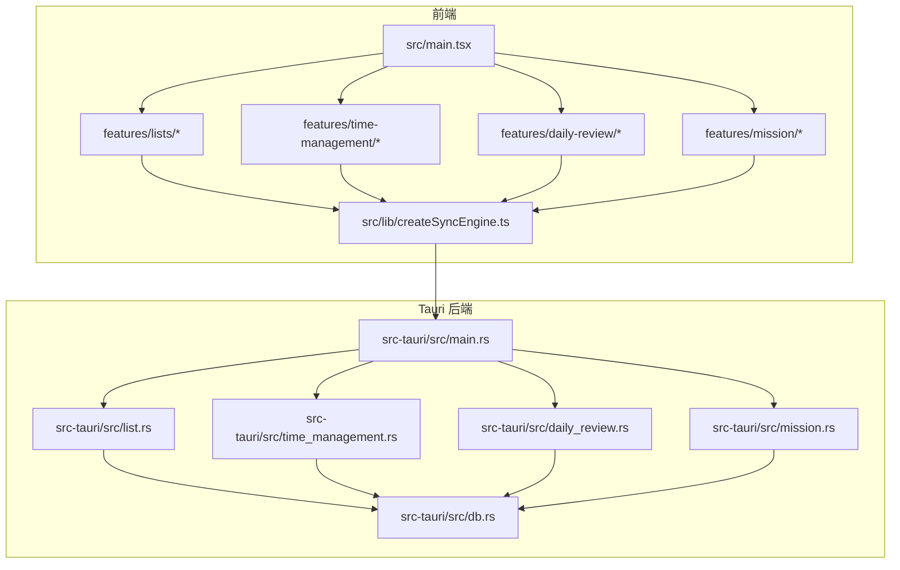

图表来源
- [src/main.tsx:1-200](file://src/main.tsx#L1-L200)
- [src/lib/createSyncEngine.ts:1-200](file://src/lib/createSyncEngine.ts#L1-L200)
- [src-tauri/src/main.rs:1-200](file://src-tauri/src/main.rs#L1-L200)
- [src-tauri/src/db.rs:1-200](file://src-tauri/src/db.rs#L1-L200)

章节来源
- [README.md:1-200](file://README.md#L1-L200)
- [package.json:1-200](file://package.json#L1-L200)
- [vite.config.ts:1-200](file://vite.config.ts#L1-L200)
- [tsconfig.json:1-200](file://tsconfig.json#L1-L200)

## 核心组件
- 前端入口与路由挂载：负责初始化应用根节点、主题与全局配置
- 数据同步引擎：统一协调 Store 变更、增量同步策略、冲突处理与重试机制
- 领域服务层（前端 Service）：封装对 Tauri 命令的调用、参数校验与错误映射
- 领域 Store（Zustand）：维护各功能域的状态，订阅变更并触发同步
- Tauri 命令层（Rust）：暴露安全边界内的 API，执行业务逻辑与数据库操作
- 数据库层：本地持久化（SQLite/MySQL 等，依据配置），提供事务与一致性保障

章节来源
- [src/main.tsx:1-200](file://src/main.tsx#L1-L200)
- [src/lib/createSyncEngine.ts:1-200](file://src/lib/createSyncEngine.ts#L1-L200)
- [src/features/lists/listsStore.ts:1-200](file://src/features/lists/listsStore.ts#L1-L200)
- [src/features/lists/listsService.ts:1-200](file://src/features/lists/listsService.ts#L1-L200)
- [src/features/time-management/timeManagementStore.ts:1-200](file://src/features/time-management/timeManagementStore.ts#L1-L200)
- [src/features/time-management/timeManagementService.ts:1-200](file://src/features/time-management/timeManagementService.ts#L1-L200)
- [src/features/daily-review/dailyReviewStore.ts:1-200](file://src/features/daily-review/dailyReviewStore.ts#L1-L200)
- [src/features/daily-review/dailyReviewService.ts:1-200](file://src/features/daily-review/dailyReviewService.ts#L1-L200)
- [src/features/mission/MissionStore.ts:1-200](file://src/features/mission/MissionStore.ts#L1-L200)
- [src/features/mission/MissionService.ts:1-200](file://src/features/mission/MissionService.ts#L1-L200)
- [src-tauri/src/main.rs:1-200](file://src-tauri/src/main.rs#L1-L200)
- [src-tauri/src/db.rs:1-200](file://src-tauri/src/db.rs#L1-L200)

## 架构总览
FishWorker 采用前后端分离的 Tauri 架构：
- 前端：React + TypeScript + Vite，使用 Zustand 管理状态，通过自定义同步引擎与后端通信
- 后端：Rust 作为 Tauri 命令实现，提供安全、高性能的数据访问与业务逻辑
- 数据流：UI 变更 -> Store 更新 -> 同步引擎 -> Tauri 命令 -> 数据库 -> 事件回推 -> Store 刷新

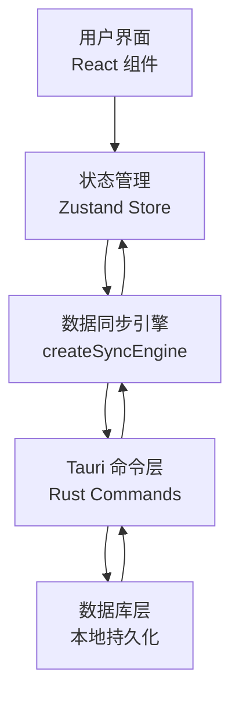

图表来源
- [src/lib/createSyncEngine.ts:1-200](file://src/lib/createSyncEngine.ts#L1-L200)
- [src-tauri/src/main.rs:1-200](file://src-tauri/src/main.rs#L1-L200)
- [src-tauri/src/db.rs:1-200](file://src-tauri/src/db.rs#L1-L200)

## 详细组件分析

### 数据同步引擎（createSyncEngine）
职责：
- 将 Store 变更转换为可序列化的操作队列
- 执行幂等写入与增量同步，避免重复提交
- 处理网络/IO 失败的重试与退避
- 合并远端变更到本地状态，保证最终一致

关键流程：
- 监听 Store 变更 -> 生成操作 -> 入队 -> 调度器执行 -> 调用 Tauri 命令 -> 接收结果 -> 更新本地状态 -> 发布事件

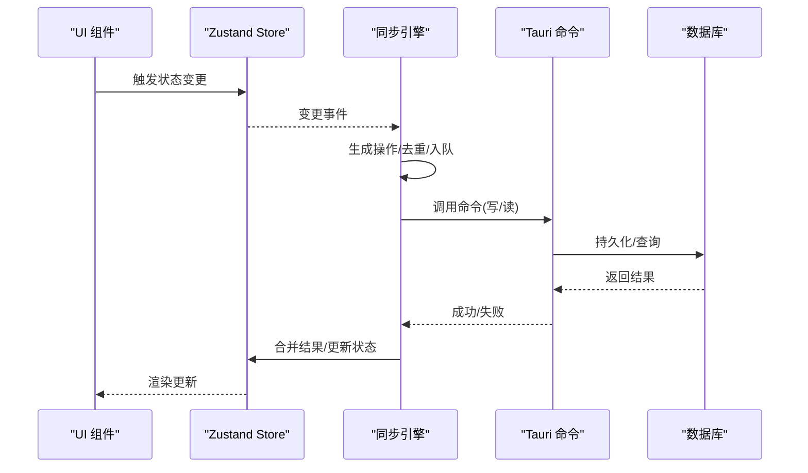

图表来源
- [src/lib/createSyncEngine.ts:1-200](file://src/lib/createSyncEngine.ts#L1-L200)
- [src-tauri/src/main.rs:1-200](file://src-tauri/src/main.rs#L1-L200)
- [src-tauri/src/db.rs:1-200](file://src-tauri/src/db.rs#L1-L200)

章节来源
- [src/lib/createSyncEngine.ts:1-200](file://src/lib/createSyncEngine.ts#L1-L200)

### 清单功能域（Lists）
- Store：维护列表集合、分组、排序与选中态
- Service：封装 Tauri 命令调用（增删改查、批量导出、模板导入）
- UI：侧边栏、主面板、抽屉编辑器、模态框

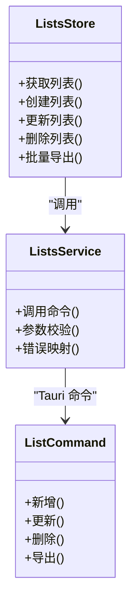

图表来源
- [src/features/lists/listsStore.ts:1-200](file://src/features/lists/listsStore.ts#L1-L200)
- [src/features/lists/listsService.ts:1-200](file://src/features/lists/listsService.ts#L1-L200)
- [src-tauri/src/list.rs:1-200](file://src-tauri/src/list.rs#L1-L200)

章节来源
- [src/features/lists/listsStore.ts:1-200](file://src/features/lists/listsStore.ts#L1-L200)
- [src/features/lists/listsService.ts:1-200](file://src/features/lists/listsService.ts#L1-L200)
- [src-tauri/src/list.rs:1-200](file://src-tauri/src/list.rs#L1-L200)

### 时间管理功能域（Time Management）
- Store：四象限任务、周计划、快速添加、详情编辑
- Service：封装时间相关命令（创建、移动、归档、统计）
- UI：日视图四象限、周规划面板、任务详情弹窗

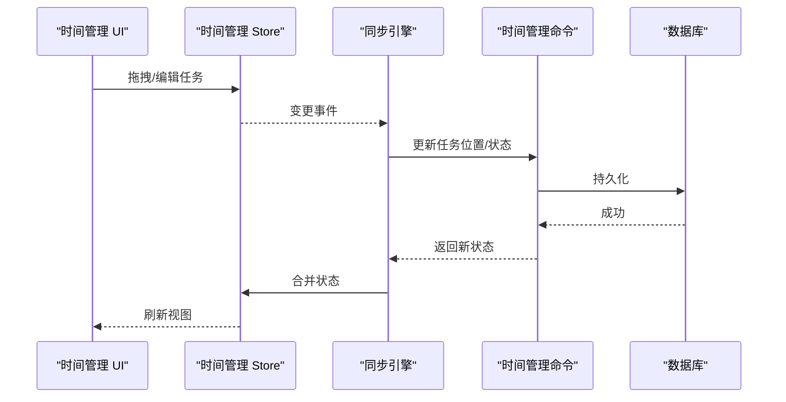

图表来源
- [src/features/time-management/timeManagementStore.ts:1-200](file://src/features/time-management/timeManagementStore.ts#L1-L200)
- [src/features/time-management/timeManagementService.ts:1-200](file://src/features/time-management/timeManagementService.ts#L1-L200)
- [src-tauri/src/time_management.rs:1-200](file://src-tauri/src/time_management.rs#L1-L200)

章节来源
- [src/features/time-management/timeManagementStore.ts:1-200](file://src/features/time-management/timeManagementStore.ts#L1-L200)
- [src/features/time-management/timeManagementService.ts:1-200](file://src/features/time-management/timeManagementService.ts#L1-L200)
- [src-tauri/src/time_management.rs:1-200](file://src-tauri/src/time_management.rs#L1-L200)

### 每日复盘功能域（Daily Review）
- Store：复盘内容、自动保存开关、草稿状态
- Service：封装复盘读写、自动保存策略
- UI：复盘编辑器、统计面板

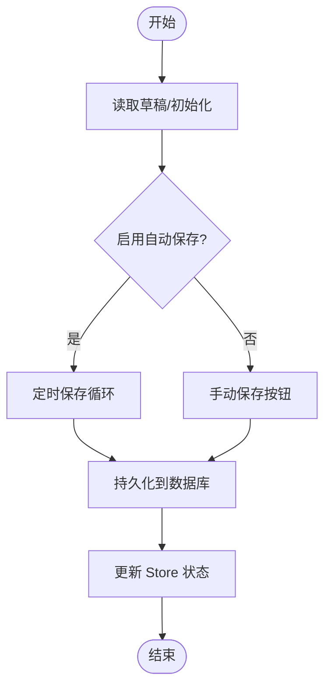

图表来源
- [src/features/daily-review/dailyReviewStore.ts:1-200](file://src/features/daily-review/dailyReviewStore.ts#L1-L200)
- [src/features/daily-review/dailyReviewService.ts:1-200](file://src/features/daily-review/dailyReviewService.ts#L1-L200)
- [src-tauri/src/daily_review.rs:1-200](file://src-tauri/src/daily_review.rs#L1-L200)

章节来源
- [src/features/daily-review/dailyReviewStore.ts:1-200](file://src/features/daily-review/dailyReviewStore.ts#L1-L200)
- [src/features/daily-review/dailyReviewService.ts:1-200](file://src/features/daily-review/dailyReviewService.ts#L1-L200)
- [src-tauri/src/daily_review.rs:1-200](file://src-tauri/src/daily_review.rs#L1-L200)

### 使命目标功能域（Mission）
- Store：角色、目标、使命陈述、进度跟踪
- Service：封装使命相关命令（编辑、归档、统计）
- UI：角色侧边栏、目标卡片、使命编辑器

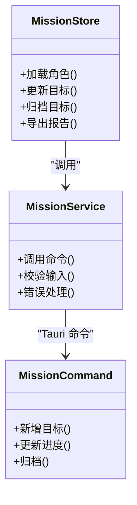

图表来源
- [src/features/mission/MissionStore.ts:1-200](file://src/features/mission/MissionStore.ts#L1-L200)
- [src/features/mission/MissionService.ts:1-200](file://src/features/mission/MissionService.ts#L1-L200)
- [src-tauri/src/mission.rs:1-200](file://src-tauri/src/mission.rs#L1-L200)

章节来源
- [src/features/mission/MissionStore.ts:1-200](file://src/features/mission/MissionStore.ts#L1-L200)
- [src/features/mission/MissionService.ts:1-200](file://src/features/mission/MissionService.ts#L1-L200)
- [src-tauri/src/mission.rs:1-200](file://src-tauri/src/mission.rs#L1-L200)

### Tauri 集成与安全边界
- main.rs：注册命令、初始化资源、能力声明
- capabilities/default.json：最小权限原则，仅开放必要命令
- db.rs：连接池、事务、迁移与错误封装
- 各领域命令：list.rs、time_management.rs、daily_review.rs、mission.rs

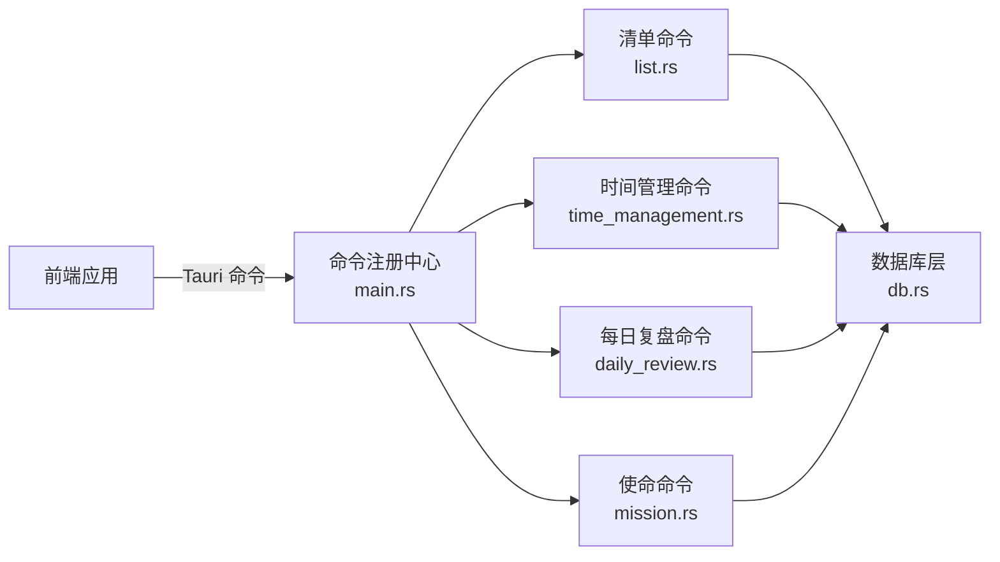

图表来源
- [src-tauri/src/main.rs:1-200](file://src-tauri/src/main.rs#L1-L200)
- [src-tauri/capabilities/default.json:1-200](file://src-tauri/capabilities/default.json#L1-L200)
- [src-tauri/src/db.rs:1-200](file://src-tauri/src/db.rs#L1-L200)
- [src-tauri/src/list.rs:1-200](file://src-tauri/src/list.rs#L1-L200)
- [src-tauri/src/time_management.rs:1-200](file://src-tauri/src/time_management.rs#L1-L200)
- [src-tauri/src/daily_review.rs:1-200](file://src-tauri/src/daily_review.rs#L1-L200)
- [src-tauri/src/mission.rs:1-200](file://src-tauri/src/mission.rs#L1-L200)

章节来源
- [src-tauri/src/main.rs:1-200](file://src-tauri/src/main.rs#L1-L200)
- [src-tauri/capabilities/default.json:1-200](file://src-tauri/capabilities/default.json#L1-L200)
- [src-tauri/src/db.rs:1-200](file://src-tauri/src/db.rs#L1-L200)

## 依赖分析
- 前端依赖：React、TypeScript、Vite、Zustand、Tauri 客户端 SDK
- 后端依赖：Tauri、Rust 标准库、数据库驱动（SQLite/MySQL 等）
- 构建工具：Vite 用于前端打包，Tauri CLI 用于桌面打包与分发

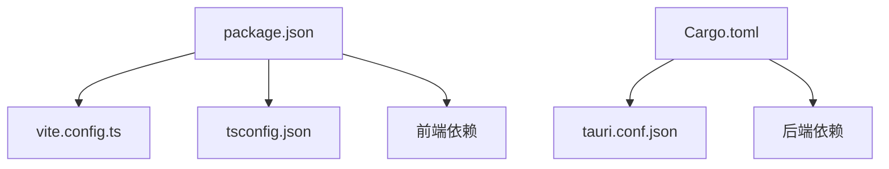

图表来源
- [package.json:1-200](file://package.json#L1-L200)
- [vite.config.ts:1-200](file://vite.config.ts#L1-L200)
- [tsconfig.json:1-200](file://tsconfig.json#L1-L200)
- [src-tauri/Cargo.toml:1-200](file://src-tauri/Cargo.toml#L1-L200)
- [src-tauri/tauri.conf.json:1-200](file://src-tauri/tauri.conf.json#L1-L200)

章节来源
- [package.json:1-200](file://package.json#L1-L200)
- [vite.config.ts:1-200](file://vite.config.ts#L1-L200)
- [tsconfig.json:1-200](file://tsconfig.json#L1-L200)
- [src-tauri/Cargo.toml:1-200](file://src-tauri/Cargo.toml#L1-L200)
- [src-tauri/tauri.conf.json:1-200](file://src-tauri/tauri.conf.json#L1-L200)

## 性能考虑
- 前端渲染优化：虚拟列表、懒加载、按需引入组件
- 状态管理：Zustand 轻量高效，避免不必要的重渲染
- 同步引擎：批处理、去重、指数退避重试、断点续传
- 数据库：索引优化、事务合并、分页与游标查询
- I/O 路径：异步非阻塞、背压控制、内存缓存热点数据

[本节为通用指导，不直接分析具体文件]

## 故障排查指南
- 常见问题定位：
  - 同步失败：检查同步引擎日志、重试次数与退避策略
  - 命令调用异常：查看 Tauri 命令错误码与堆栈
  - 数据库连接问题：确认连接池配置、权限与迁移状态
- 诊断手段：
  - 开启调试日志，输出关键路径耗时
  - 使用 Tauri 开发者工具捕获命令请求与响应
  - 单元测试覆盖同步引擎与命令层关键分支

章节来源
- [src/lib/createSyncEngine.ts:1-200](file://src/lib/createSyncEngine.ts#L1-L200)
- [src-tauri/src/main.rs:1-200](file://src-tauri/src/main.rs#L1-L200)
- [src-tauri/src/db.rs:1-200](file://src-tauri/src/db.rs#L1-L200)

## 结论
FishWorker 通过前后端分离与 Tauri 集成，实现了高性能、可维护的桌面应用架构。数据同步引擎确保状态一致性与鲁棒性；领域分层清晰，便于扩展与维护。建议在后续迭代中完善监控与告警、增强备份与恢复策略，并持续优化同步与数据库性能。

[本节为总结，不直接分析具体文件]

## 附录

### 系统上下文图
展示应用与外部系统的交互关系（用户、操作系统、文件系统、数据库）。

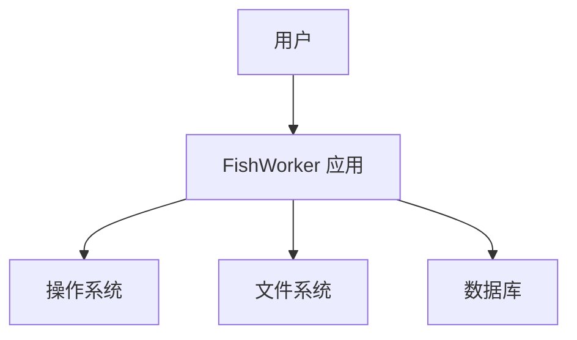

[此图为概念性示意，无需图表来源]

### 组件分解图
从代码层面展示主要模块与依赖关系。

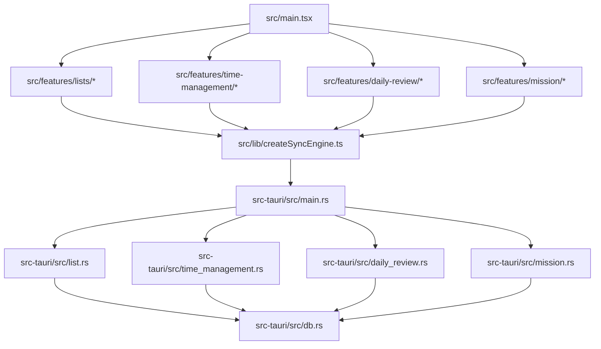

图表来源
- [src/main.tsx:1-200](file://src/main.tsx#L1-L200)
- [src/lib/createSyncEngine.ts:1-200](file://src/lib/createSyncEngine.ts#L1-L200)
- [src-tauri/src/main.rs:1-200](file://src-tauri/src/main.rs#L1-L200)
- [src-tauri/src/db.rs:1-200](file://src-tauri/src/db.rs#L1-L200)
- [src-tauri/src/list.rs:1-200](file://src-tauri/src/list.rs#L1-L200)
- [src-tauri/src/time_management.rs:1-200](file://src-tauri/src/time_management.rs#L1-L200)
- [src-tauri/src/daily_review.rs:1-200](file://src-tauri/src/daily_review.rs#L1-L200)
- [src-tauri/src/mission.rs:1-200](file://src-tauri/src/mission.rs#L1-L200)

### 技术栈与版本兼容性
- 前端：React、TypeScript、Vite、Zustand
- 后端：Rust、Tauri、数据库驱动（SQLite/MySQL 等）
- 构建与打包：Vite、Tauri CLI
- 建议：锁定关键依赖版本，定期评估升级影响与兼容性

章节来源
- [package.json:1-200](file://package.json#L1-L200)
- [src-tauri/Cargo.toml:1-200](file://src-tauri/Cargo.toml#L1-L200)
- [src-tauri/tauri.conf.json:1-200](file://src-tauri/tauri.conf.json#L1-L200)

### 基础设施要求与部署拓扑
- 开发环境：Node.js、pnpm、Rust Toolchain、Tauri CLI
- 运行环境：桌面操作系统（Windows/macOS/Linux）、本地数据库
- 部署拓扑：单进程桌面应用，本地持久化，无服务端依赖

[本节为通用指导，不直接分析具体文件]

### 安全性、监控与灾难恢复
- 安全性：最小权限能力声明、输入校验、敏感信息加密存储
- 监控：本地日志采集、错误上报（可选）、性能指标收集
- 灾难恢复：定期备份、增量快照、数据迁移脚本与回滚策略

[本节为通用指导，不直接分析具体文件]