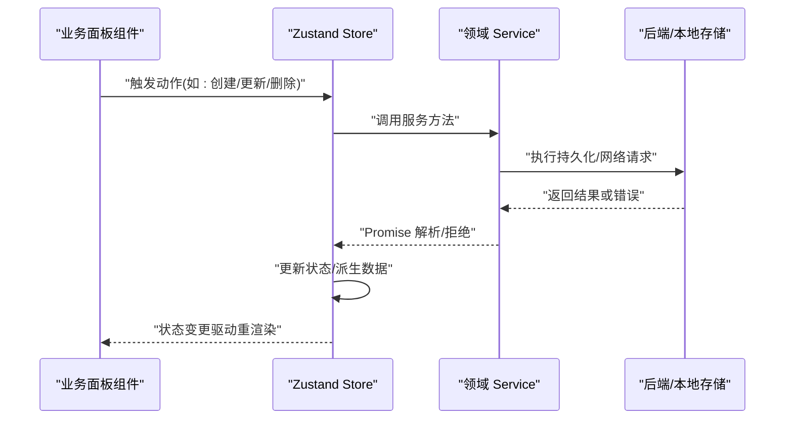
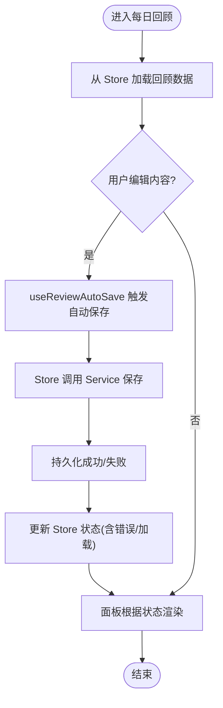
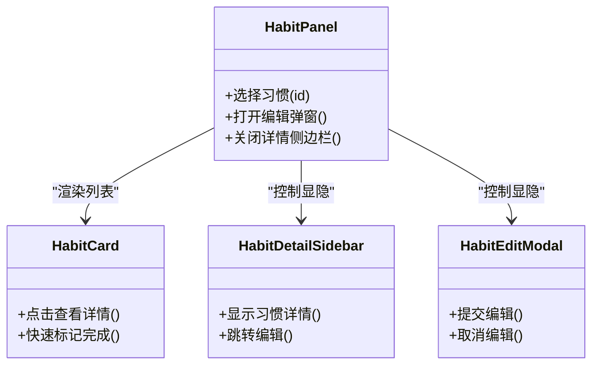
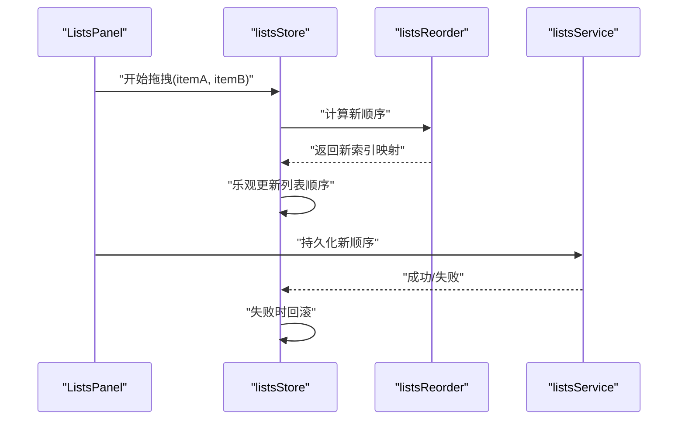
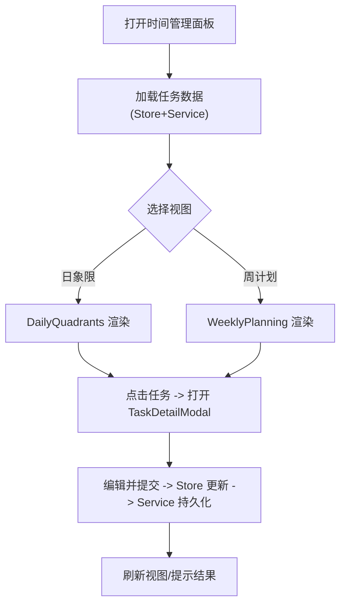
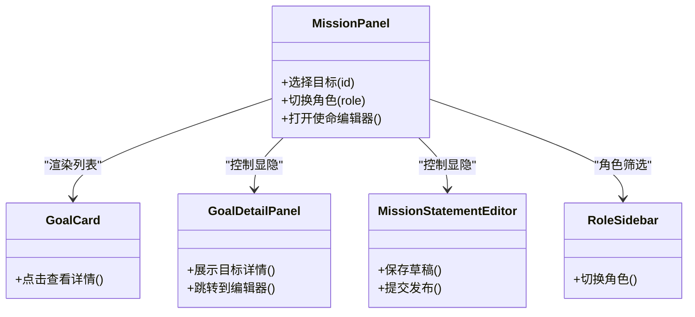
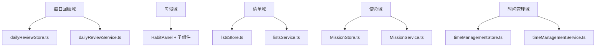

# 业务组件架构

<cite>
**本文引用的文件**   
- [DailyReviewPanel.tsx](file://src/features/daily-review/DailyReviewPanel.tsx)
- [dailyReviewStore.ts](file://src/features/daily-review/dailyReviewStore.ts)
- [dailyReviewService.ts](file://src/features/daily-review/dailyReviewService.ts)
- [dailyReviewTypes.ts](file://src/features/daily-review/dailyReviewTypes.ts)
- [useReviewAutoSave.ts](file://src/features/daily-review/useReviewAutoSave.ts)
- [HabitPanel.tsx](file://src/features/habits/HabitPanel.tsx)
- [habitTypes.ts](file://src/features/habits/habitTypes.ts)
- [HabitCard.tsx](file://src/features/habits/components/HabitCard.tsx)
- [HabitDetailSidebar.tsx](file://src/features/habits/components/HabitDetailSidebar.tsx)
- [HabitEditModal.tsx](file://src/features/habits/components/HabitEditModal.tsx)
- [ListsPanel.tsx](file://src/features/lists/ListsPanel.tsx)
- [listsStore.ts](file://src/features/lists/listsStore.ts)
- [listsService.ts](file://src/features/lists/listsService.ts)
- [listsTypes.ts](file://src/features/lists/listsTypes.ts)
- [NoteDrawer.tsx](file://src/features/lists/NoteDrawer.tsx)
- [NoteGroupView.tsx](file://src/features/lists/NoteGroupView.tsx)
- [NoteItem.tsx](file://src/features/lists/NoteItem.tsx)
- [SortableItem.tsx](file://src/features/lists/SortableItem.tsx)
- [listsReorder.ts](file://src/features/lists/listsReorder.ts)
- [MissionPanel.tsx](file://src/features/mission/MissionPanel.tsx)
- [MissionStore.ts](file://src/features/mission/MissionStore.ts)
- [MissionService.ts](file://src/features/mission/MissionService.ts)
- [MissionTypes.ts](file://src/features/mission/MissionTypes.ts)
- [GoalCard.tsx](file://src/features/mission/GoalCard.tsx)
- [GoalDetailPanel.tsx](file://src/features/mission/GoalDetailPanel.tsx)
- [MissionStatementEditor.tsx](file://src/features/mission/MissionStatementEditor.tsx)
- [RoleSidebar.tsx](file://src/features/mission/RoleSidebar.tsx)
- [TimeManagementPanel.tsx](file://src/features/time-management/TimeManagementPanel.tsx)
- [timeManagementStore.ts](file://src/features/time-management/timeManagementStore.ts)
- [timeManagementService.ts](file://src/features/time-management/timeManagementService.ts)
- [timeManagementTypes.ts](file://src/features/time-management/timeManagementTypes.ts)
- [DailyQuadrants.tsx](file://src/features/time-management/DailyQuadrants.tsx)
- [TaskDetailModal.tsx](file://src/features/time-management/TaskDetailModal.tsx)
- [WeeklyPlanning.tsx](file://src/features/time-management/WeeklyPlanning.tsx)
- [AppLayout.tsx](file://src/components/layout/AppLayout.tsx)
</cite>

## 目录
1. [简介](#简介)
2. [项目结构](#项目结构)
3. [核心组件](#核心组件)
4. [架构总览](#架构总览)
5. [详细组件分析](#详细组件分析)
6. [依赖分析](#依赖分析)
7. [性能考虑](#性能考虑)
8. [故障排查指南](#故障排查指南)
9. [结论](#结论)
10. [附录](#附录)

## 简介
本文件聚焦 FishWorker 应用的业务组件架构，围绕 features 目录下的关键业务面板：每日回顾（DailyReviewPanel）、习惯（HabitPanel）、清单（ListsPanel）、时间管理（TimeManagementPanel）与使命（MissionPanel），系统阐述其职责划分、状态管理策略（Zustand）、服务层集成模式、组件间通信机制与数据流设计，并总结组合与复用策略、错误处理、加载状态和用户交互的最佳实践。

## 项目结构
features 目录采用“按功能域组织”的结构，每个业务域包含：
- 页面级面板组件（如 DailyReviewPanel.tsx、HabitPanel.tsx 等）
- 领域 Store（基于 Zustand 的状态切片）
- 领域 Service（封装 API/持久化调用）
- 类型定义（TypeScript 类型）
- 可选的领域内子组件与工具函数

```mermaid
graph TB
subgraph "每日回顾"
DRP["DailyReviewPanel.tsx"]
DRStore["dailyReviewStore.ts"]
DRService["dailyReviewService.ts"]
DRTypes["dailyReviewTypes.ts"]
DRAuto["useReviewAutoSave.ts"]
end
subgraph "习惯"
HP["HabitPanel.tsx"]
HTypes["habitTypes.ts"]
HC["components/HabitCard.tsx"]
HDS["components/HabitDetailSidebar.tsx"]
HEM["components/HabitEditModal.tsx"]
end
subgraph "清单"
LP["ListsPanel.tsx"]
LStore["listsStore.ts"]
LService["listsService.ts"]
LTypes["listsTypes.ts"]
ND["NoteDrawer.tsx"]
NGV["NoteGroupView.tsx"]
NI["NoteItem.tsx"]
SI["SortableItem.tsx"]
LR["listsReorder.ts"]
end
subgraph "使命"
MP["MissionPanel.tsx"]
MStore["MissionStore.ts"]
MService["MissionService.ts"]
MTypes["MissionTypes.ts"]
GC["GoalCard.tsx"]
GDP["GoalDetailPanel.tsx"]
MSE["MissionStatementEditor.tsx"]
RS["RoleSidebar.tsx"]
end
subgraph "时间管理"
TMP["TimeManagementPanel.tsx"]
TMStore["timeManagementStore.ts"]
TMService["timeManagementService.ts"]
TMTypes["timeManagementTypes.ts"]
DQ["DailyQuadrants.tsx"]
TDM["TaskDetailModal.tsx"]
WP["WeeklyPlanning.tsx"]
end
App["AppLayout.tsx"] --> DRP
App --> HP
App --> LP
App --> MP
App --> TMP
DRP --> DRStore
DRP --> DRService
DRP --> DRAuto
HP --> HC
HP --> HDS
HP --> HEM
LP --> LStore
LP --> LService
LP --> ND
LP --> NGV
LP --> NI
LP --> SI
LP --> LR
MP --> MStore
MP --> MService
MP --> GC
MP --> GDP
MP --> MSE
MP --> RS
TMP --> TMStore
TMP --> TMService
TMP --> DQ
TMP --> TDM
TMP --> WP
```

图表来源
- [AppLayout.tsx](file://src/components/layout/AppLayout.tsx)
- [DailyReviewPanel.tsx](file://src/features/daily-review/DailyReviewPanel.tsx)
- [dailyReviewStore.ts](file://src/features/daily-review/dailyReviewStore.ts)
- [dailyReviewService.ts](file://src/features/daily-review/dailyReviewService.ts)
- [useReviewAutoSave.ts](file://src/features/daily-review/useReviewAutoSave.ts)
- [HabitPanel.tsx](file://src/features/habits/HabitPanel.tsx)
- [HabitCard.tsx](file://src/features/habits/components/HabitCard.tsx)
- [HabitDetailSidebar.tsx](file://src/features/habits/components/HabitDetailSidebar.tsx)
- [HabitEditModal.tsx](file://src/features/habits/components/HabitEditModal.tsx)
- [ListsPanel.tsx](file://src/features/lists/ListsPanel.tsx)
- [listsStore.ts](file://src/features/lists/listsStore.ts)
- [listsService.ts](file://src/features/lists/listsService.ts)
- [NoteDrawer.tsx](file://src/features/lists/NoteDrawer.tsx)
- [NoteGroupView.tsx](file://src/features/lists/NoteGroupView.tsx)
- [NoteItem.tsx](file://src/features/lists/NoteItem.tsx)
- [SortableItem.tsx](file://src/features/lists/SortableItem.tsx)
- [listsReorder.ts](file://src/features/lists/listsReorder.ts)
- [MissionPanel.tsx](file://src/features/mission/MissionPanel.tsx)
- [MissionStore.ts](file://src/features/mission/MissionStore.ts)
- [MissionService.ts](file://src/features/mission/MissionService.ts)
- [GoalCard.tsx](file://src/features/mission/GoalCard.tsx)
- [GoalDetailPanel.tsx](file://src/features/mission/GoalDetailPanel.tsx)
- [MissionStatementEditor.tsx](file://src/features/mission/MissionStatementEditor.tsx)
- [RoleSidebar.tsx](file://src/features/mission/RoleSidebar.tsx)
- [TimeManagementPanel.tsx](file://src/features/time-management/TimeManagementPanel.tsx)
- [timeManagementStore.ts](file://src/features/time-management/timeManagementStore.ts)
- [timeManagementService.ts](file://src/features/time-management/timeManagementService.ts)
- [DailyQuadrants.tsx](file://src/features/time-management/DailyQuadrants.tsx)
- [TaskDetailModal.tsx](file://src/features/time-management/TaskDetailModal.tsx)
- [WeeklyPlanning.tsx](file://src/features/time-management/WeeklyPlanning.tsx)

章节来源
- [AppLayout.tsx](file://src/components/layout/AppLayout.tsx)
- [DailyReviewPanel.tsx](file://src/features/daily-review/DailyReviewPanel.tsx)
- [HabitPanel.tsx](file://src/features/habits/HabitPanel.tsx)
- [ListsPanel.tsx](file://src/features/lists/ListsPanel.tsx)
- [MissionPanel.tsx](file://src/features/mission/MissionPanel.tsx)
- [TimeManagementPanel.tsx](file://src/features/time-management/TimeManagementPanel.tsx)

## 核心组件
本节概述各业务面板的职责边界与协作方式：
- 每日回顾（DailyReviewPanel）：负责当日回顾内容的展示与编辑，结合自动保存 Hook 与服务层进行数据同步。
- 习惯（HabitPanel）：提供习惯列表、详情侧边栏与编辑弹窗的组合视图，承载习惯相关交互。
- 清单（ListsPanel）：以分组与拖拽排序为核心，聚合笔记抽屉、分组视图、单项渲染与重排逻辑。
- 时间管理（TimeManagementPanel）：整合日象限、任务详情弹窗与周计划视图，驱动时间规划工作流。
- 使命（MissionPanel）：围绕目标卡片、目标详情、使命陈述编辑器与角色侧边栏，构建目标管理与使命对齐界面。

这些面板通过各自 Store 订阅状态变化，并通过 Service 发起异步操作；UI 组件保持“受控 + 最小副作用”的原则，将复杂逻辑下沉至 Store/Service。

章节来源
- [DailyReviewPanel.tsx](file://src/features/daily-review/DailyReviewPanel.tsx)
- [HabitPanel.tsx](file://src/features/habits/HabitPanel.tsx)
- [ListsPanel.tsx](file://src/features/lists/ListsPanel.tsx)
- [TimeManagementPanel.tsx](file://src/features/time-management/TimeManagementPanel.tsx)
- [MissionPanel.tsx](file://src/features/mission/MissionPanel.tsx)

## 架构总览
整体遵循“面板 -> Store -> Service”的分层：
- 面板组件：仅负责 UI 呈现与用户交互事件派发
- Store（Zustand）：维护领域状态、派生计算与副作用编排
- Service：统一封装网络/本地存储调用，暴露 Promise API
- 类型定义：在各域内集中管理数据结构契约

图表来源
- [dailyReviewStore.ts](file://src/features/daily-review/dailyReviewStore.ts)
- [dailyReviewService.ts](file://src/features/daily-review/dailyReviewService.ts)
- [listsStore.ts](file://src/features/lists/listsStore.ts)
- [listsService.ts](file://src/features/lists/listsService.ts)
- [timeManagementStore.ts](file://src/features/time-management/timeManagementStore.ts)
- [timeManagementService.ts](file://src/features/time-management/timeManagementService.ts)
- [MissionStore.ts](file://src/features/mission/MissionStore.ts)
- [MissionService.ts](file://src/features/mission/MissionService.ts)

## 详细组件分析

### 每日回顾（DailyReviewPanel）
- 职责划分
  - 面板：渲染回顾内容、触发保存、显示加载/错误状态
  - Store：维护回顾数据、自动保存节流、错误与加载标志
  - Service：封装回顾数据的读取与写入
  - Hook：useReviewAutoSave 实现输入防抖与自动落盘
- 状态管理策略
  - 使用 Zustand 切片式 Store，分离只读状态与写操作
  - 在 Store 中协调 Service 调用与状态更新
- 服务层集成
  - Service 暴露 Promise API，Store 内部 await 后更新状态
- 组件间通信与数据流
  - 面板订阅 Store 状态，用户输入触发 Store 动作，Store 调用 Service 完成持久化
- 最佳实践
  - 自动保存避免频繁 IO，采用节流/防抖
  - 错误态与加载态在 Store 中统一管理，面板只做展示

图表来源
- [DailyReviewPanel.tsx](file://src/features/daily-review/DailyReviewPanel.tsx)
- [dailyReviewStore.ts](file://src/features/daily-review/dailyReviewStore.ts)
- [dailyReviewService.ts](file://src/features/daily-review/dailyReviewService.ts)
- [useReviewAutoSave.ts](file://src/features/daily-review/useReviewAutoSave.ts)

章节来源
- [DailyReviewPanel.tsx](file://src/features/daily-review/DailyReviewPanel.tsx)
- [dailyReviewStore.ts](file://src/features/daily-review/dailyReviewStore.ts)
- [dailyReviewService.ts](file://src/features/daily-review/dailyReviewService.ts)
- [useReviewAutoSave.ts](file://src/features/daily-review/useReviewAutoSave.ts)
- [dailyReviewTypes.ts](file://src/features/daily-review/dailyReviewTypes.ts)

### 习惯（HabitPanel）
- 职责划分
  - HabitPanel：组合 HabitCard、HabitDetailSidebar、HabitEditModal，编排主流程
  - HabitCard：展示单条习惯概览与快捷操作
  - HabitDetailSidebar：展示习惯详情与上下文信息
  - HabitEditModal：编辑习惯属性与规则
- 状态管理策略
  - 若存在领域 Store，则通过 Store 管理习惯集合与选中项；否则由父组件提升状态
- 服务层集成
  - 通过 Service 完成习惯的增删改查与批量操作
- 组件间通信与数据流
  - 面板持有当前选中习惯 ID，向子组件传递 props；子组件回调通知父组件更新
- 最佳实践
  - 模态框与侧边栏采用受控模式，关闭时清理临时状态
  - 列表项渲染优化，避免不必要的重渲染

图表来源
- [HabitPanel.tsx](file://src/features/habits/HabitPanel.tsx)
- [HabitCard.tsx](file://src/features/habits/components/HabitCard.tsx)
- [HabitDetailSidebar.tsx](file://src/features/habits/components/HabitDetailSidebar.tsx)
- [HabitEditModal.tsx](file://src/features/habits/components/HabitEditModal.tsx)

章节来源
- [HabitPanel.tsx](file://src/features/habits/HabitPanel.tsx)
- [habitTypes.ts](file://src/features/habits/habitTypes.ts)
- [HabitCard.tsx](file://src/features/habits/components/HabitCard.tsx)
- [HabitDetailSidebar.tsx](file://src/features/habits/components/HabitDetailSidebar.tsx)
- [HabitEditModal.tsx](file://src/features/habits/components/HabitEditModal.tsx)

### 清单（ListsPanel）
- 职责划分
  - ListsPanel：聚合 NoteGroupView、NoteDrawer、NoteItem、SortableItem 等
  - NoteGroupView：分组渲染与组内排序
  - NoteDrawer：笔记详情抽屉
  - listsReorder：排序算法与索引映射
- 状态管理策略
  - listsStore 维护分组、条目、拖拽状态与选中等
  - 通过 actions 原子化更新，减少竞态
- 服务层集成
  - listsService 提供分组/条目的 CRUD 与批量导出
- 组件间通信与数据流
  - 面板订阅 Store，拖拽时更新顺序，保存时调用 Service
- 最佳实践
  - 拖拽过程中使用乐观更新，失败回滚
  - 大列表虚拟化或分页加载

图表来源
- [ListsPanel.tsx](file://src/features/lists/ListsPanel.tsx)
- [listsStore.ts](file://src/features/lists/listsStore.ts)
- [listsService.ts](file://src/features/lists/listsService.ts)
- [NoteGroupView.tsx](file://src/features/lists/NoteGroupView.tsx)
- [NoteDrawer.tsx](file://src/features/lists/NoteDrawer.tsx)
- [NoteItem.tsx](file://src/features/lists/NoteItem.tsx)
- [SortableItem.tsx](file://src/features/lists/SortableItem.tsx)
- [listsReorder.ts](file://src/features/lists/listsReorder.ts)

章节来源
- [ListsPanel.tsx](file://src/features/lists/ListsPanel.tsx)
- [listsStore.ts](file://src/features/lists/listsStore.ts)
- [listsService.ts](file://src/features/lists/listsService.ts)
- [listsTypes.ts](file://src/features/lists/listsTypes.ts)
- [NoteDrawer.tsx](file://src/features/lists/NoteDrawer.tsx)
- [NoteGroupView.tsx](file://src/features/lists/NoteGroupView.tsx)
- [NoteItem.tsx](file://src/features/lists/NoteItem.tsx)
- [SortableItem.tsx](file://src/features/lists/SortableItem.tsx)
- [listsReorder.ts](file://src/features/lists/listsReorder.ts)

### 时间管理（TimeManagementPanel）
- 职责划分
  - TimeManagementPanel：组合 DailyQuadrants、TaskDetailModal、WeeklyPlanning
  - DailyQuadrants：四象限任务视图与交互
  - TaskDetailModal：任务详情编辑
  - WeeklyPlanning：周计划视图与跨天迁移
- 状态管理策略
  - timeManagementStore 维护任务集合、日期范围、选中任务与视图模式
- 服务层集成
  - timeManagementService 提供任务 CRUD、批量迁移与统计
- 组件间通信与数据流
  - 面板通过 Store 共享任务数据，模态框与侧边视图通过回调与 props 联动
- 最佳实践
  - 周计划与日视图的数据一致性校验
  - 批量操作提供撤销/重试

图表来源
- [TimeManagementPanel.tsx](file://src/features/time-management/TimeManagementPanel.tsx)
- [timeManagementStore.ts](file://src/features/time-management/timeManagementStore.ts)
- [timeManagementService.ts](file://src/features/time-management/timeManagementService.ts)
- [DailyQuadrants.tsx](file://src/features/time-management/DailyQuadrants.tsx)
- [TaskDetailModal.tsx](file://src/features/time-management/TaskDetailModal.tsx)
- [WeeklyPlanning.tsx](file://src/features/time-management/WeeklyPlanning.tsx)

章节来源
- [TimeManagementPanel.tsx](file://src/features/time-management/TimeManagementPanel.tsx)
- [timeManagementStore.ts](file://src/features/time-management/timeManagementStore.ts)
- [timeManagementService.ts](file://src/features/time-management/timeManagementService.ts)
- [timeManagementTypes.ts](file://src/features/time-management/timeManagementTypes.ts)
- [DailyQuadrants.tsx](file://src/features/time-management/DailyQuadrants.tsx)
- [TaskDetailModal.tsx](file://src/features/time-management/TaskDetailModal.tsx)
- [WeeklyPlanning.tsx](file://src/features/time-management/WeeklyPlanning.tsx)

### 使命（MissionPanel）
- 职责划分
  - MissionPanel：组合 GoalCard、GoalDetailPanel、MissionStatementEditor、RoleSidebar
  - GoalCard：目标概览与入口
  - GoalDetailPanel：目标详情与里程碑
  - MissionStatementEditor：使命陈述编辑
  - RoleSidebar：角色维度导航与筛选
- 状态管理策略
  - MissionStore 维护目标集合、角色维度、编辑器内容与选中项
- 服务层集成
  - MissionService 提供目标与使命陈述的读写与版本历史
- 组件间通信与数据流
  - 面板作为协调者，将选中目标与角色传递给子组件，子组件回调更新 Store
- 最佳实践
  - 编辑器内容增量保存，避免全量覆盖
  - 角色切换时保留未保存草稿

图表来源
- [MissionPanel.tsx](file://src/features/mission/MissionPanel.tsx)
- [MissionStore.ts](file://src/features/mission/MissionStore.ts)
- [MissionService.ts](file://src/features/mission/MissionService.ts)
- [GoalCard.tsx](file://src/features/mission/GoalCard.tsx)
- [GoalDetailPanel.tsx](file://src/features/mission/GoalDetailPanel.tsx)
- [MissionStatementEditor.tsx](file://src/features/mission/MissionStatementEditor.tsx)
- [RoleSidebar.tsx](file://src/features/mission/RoleSidebar.tsx)

章节来源
- [MissionPanel.tsx](file://src/features/mission/MissionPanel.tsx)
- [MissionStore.ts](file://src/features/mission/MissionStore.ts)
- [MissionService.ts](file://src/features/mission/MissionService.ts)
- [MissionTypes.ts](file://src/features/mission/MissionTypes.ts)
- [GoalCard.tsx](file://src/features/mission/GoalCard.tsx)
- [GoalDetailPanel.tsx](file://src/features/mission/GoalDetailPanel.tsx)
- [MissionStatementEditor.tsx](file://src/features/mission/MissionStatementEditor.tsx)
- [RoleSidebar.tsx](file://src/features/mission/RoleSidebar.tsx)

## 依赖分析
- 耦合与内聚
  - 面板与 Store/Service 解耦良好，UI 不直接访问外部资源
  - 各域内聚度高，跨域依赖尽量通过全局布局或路由传递
- 循环依赖
  - 建议避免面板之间直接互相引用，必要时通过 Store 或事件总线
- 外部依赖
  - Service 层屏蔽底层实现差异（网络/本地存储），便于替换与测试

图表来源
- [dailyReviewStore.ts](file://src/features/daily-review/dailyReviewStore.ts)
- [dailyReviewService.ts](file://src/features/daily-review/dailyReviewService.ts)
- [HabitPanel.tsx](file://src/features/habits/HabitPanel.tsx)
- [listsStore.ts](file://src/features/lists/listsStore.ts)
- [listsService.ts](file://src/features/lists/listsService.ts)
- [MissionStore.ts](file://src/features/mission/MissionStore.ts)
- [MissionService.ts](file://src/features/mission/MissionService.ts)
- [timeManagementStore.ts](file://src/features/time-management/timeManagementStore.ts)
- [timeManagementService.ts](file://src/features/time-management/timeManagementService.ts)

章节来源
- [dailyReviewStore.ts](file://src/features/daily-review/dailyReviewStore.ts)
- [listsStore.ts](file://src/features/lists/listsStore.ts)
- [timeManagementStore.ts](file://src/features/time-management/timeManagementStore.ts)
- [MissionStore.ts](file://src/features/mission/MissionStore.ts)

## 性能考虑
- 列表渲染
  - 对长列表使用虚拟滚动或分页加载，减少 DOM 节点数量
- 状态更新
  - 使用 Zustand 的 selector 精确订阅，避免无关重渲染
- 自动保存
  - 使用节流/防抖合并多次写入，降低 I/O 压力
- 拖拽排序
  - 乐观更新配合失败回滚，保证用户体验与数据一致性
- 编辑器
  - 增量保存与快照恢复，避免全量覆盖导致丢失

[本节为通用指导，无需特定文件来源]

## 故障排查指南
- 常见问题定位
  - 检查 Store 中的错误与加载标志，确认 Service 是否抛出异常
  - 核对类型定义与服务返回结构是否一致
  - 对于拖拽与编辑器，验证乐观更新与回滚路径
- 调试建议
  - 在 Service 层增加日志与错误码
  - 在 Store 动作前后打印入参与结果
  - 使用浏览器开发者工具观察状态树变化

章节来源
- [dailyReviewStore.ts](file://src/features/daily-review/dailyReviewStore.ts)
- [listsStore.ts](file://src/features/lists/listsStore.ts)
- [timeManagementStore.ts](file://src/features/time-management/timeManagementStore.ts)
- [MissionStore.ts](file://src/features/mission/MissionStore.ts)

## 结论
FishWorker 的业务组件架构以“面板 -> Store -> Service”分层为核心，结合 Zustand 的细粒度状态管理与 Service 的统一抽象，实现了高内聚、低耦合的可维护结构。通过组合与复用策略、完善的错误与加载状态处理，以及针对拖拽与编辑器的优化方案，系统在可扩展性与用户体验方面具备良好基础。

[本节为总结性内容，无需特定文件来源]

## 附录
- 术语
  - 面板：面向用户的业务页面容器
  - Store：基于 Zustand 的领域状态管理
  - Service：封装外部资源调用的领域服务
- 参考文件
  - 类型定义与各域 Store/Service 文件见“本文引用的文件”列表

[本节为补充说明，无需特定文件来源]