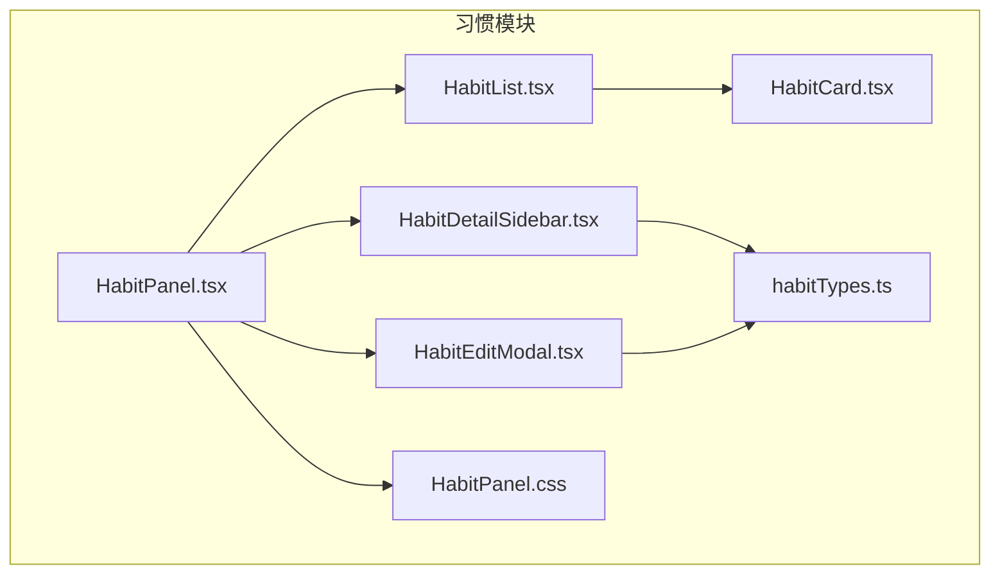
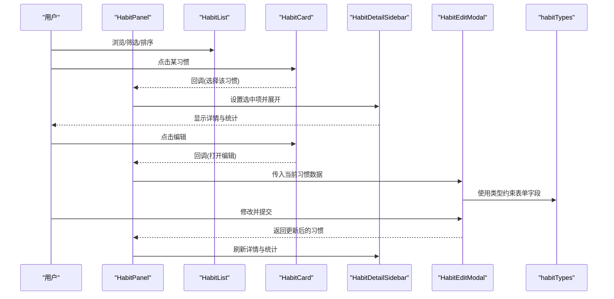
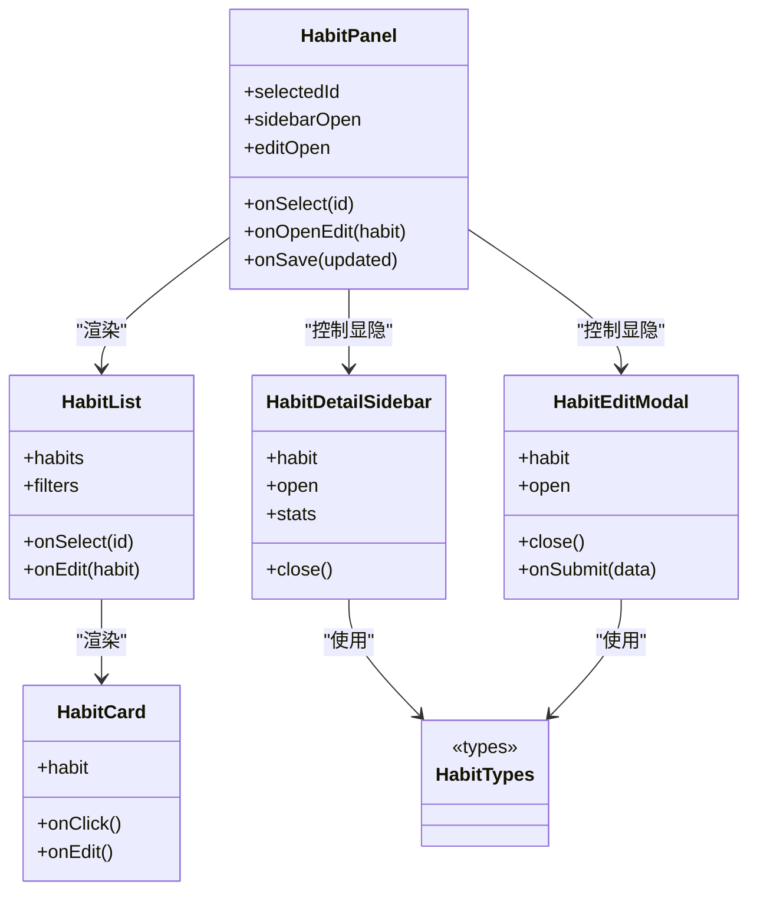
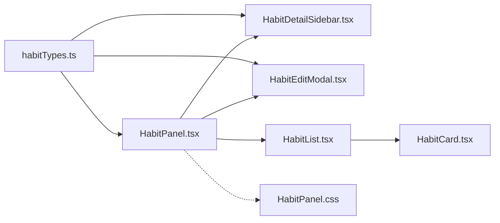
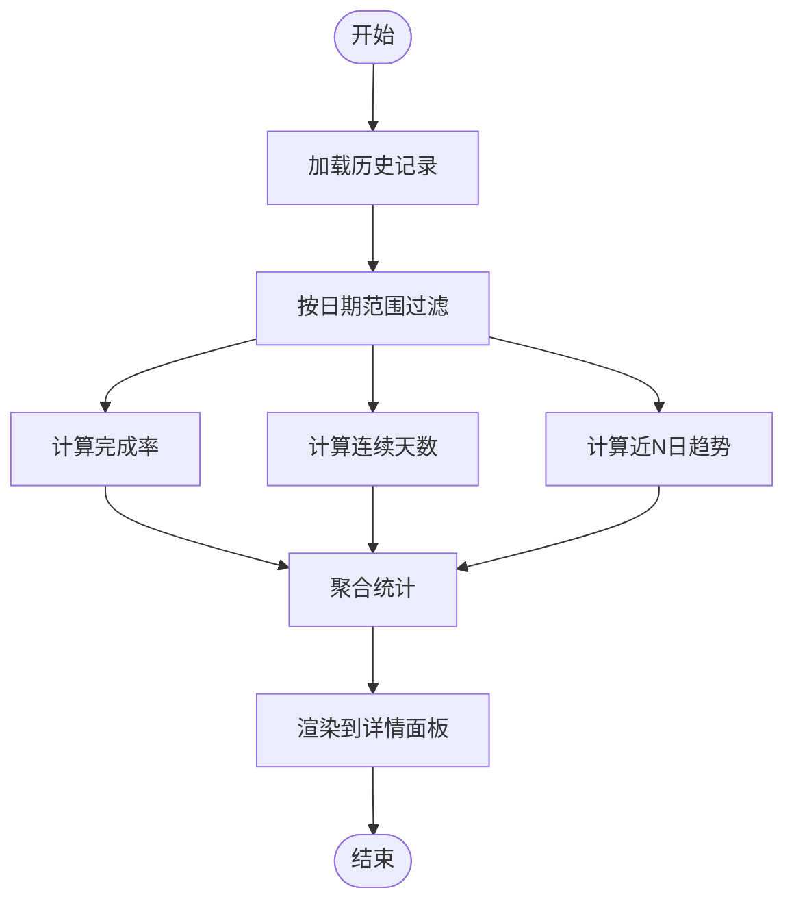

# 习惯追踪组件

<cite>
**本文引用的文件**   
- [HabitPanel.tsx](file://src/features/habits/HabitPanel.tsx)
- [HabitCard.tsx](file://src/features/habits/components/HabitCard.tsx)
- [HabitDetailSidebar.tsx](file://src/features/habits/components/HabitDetailSidebar.tsx)
- [HabitEditModal.tsx](file://src/features/habits/components/HabitEditModal.tsx)
- [HabitList.tsx](file://src/features/habits/components/HabitList.tsx)
- [habitTypes.ts](file://src/features/habits/habitTypes.ts)
- [HabitPanel.css](file://src/features/habits/HabitPanel.css)
</cite>

## 目录
1. [简介](#简介)
2. [项目结构](#项目结构)
3. [核心组件](#核心组件)
4. [架构总览](#架构总览)
5. [详细组件分析](#详细组件分析)
6. [依赖关系分析](#依赖关系分析)
7. [性能考虑](#性能考虑)
8. [故障排查指南](#故障排查指南)
9. [结论](#结论)
10. [附录](#附录)

## 简介
本文件围绕“习惯追踪”功能的前端组件进行系统化文档化，重点覆盖以下方面：
- 组件职责与交互流程：HabitPanel、HabitList、HabitCard、HabitDetailSidebar、HabitEditModal
- 数据模型与状态同步：习惯数据的增删改查（CRUD）与视图状态联动
- 侧边栏详情面板的展开/收起逻辑
- 编辑模态框的数据绑定与提交流程
- 进度跟踪算法与统计计算实现细节
- 用户操作反馈机制与数据持久化策略

## 项目结构
习惯追踪功能位于 features/habits 目录下，采用“按特性组织”的结构方式。核心文件包括：
- 容器组件：HabitPanel.tsx
- 列表与卡片：HabitList.tsx、HabitCard.tsx
- 详情与编辑：HabitDetailSidebar.tsx、HabitEditModal.tsx
- 类型定义：habitTypes.ts
- 样式：HabitPanel.css

图表来源
- [HabitPanel.tsx](file://src/features/habits/HabitPanel.tsx)
- [HabitList.tsx](file://src/features/habits/components/HabitList.tsx)
- [HabitCard.tsx](file://src/features/habits/components/HabitCard.tsx)
- [HabitDetailSidebar.tsx](file://src/features/habits/components/HabitDetailSidebar.tsx)
- [HabitEditModal.tsx](file://src/features/habits/components/HabitEditModal.tsx)
- [habitTypes.ts](file://src/features/habits/habitTypes.ts)
- [HabitPanel.css](file://src/features/habits/HabitPanel.css)

章节来源
- [HabitPanel.tsx](file://src/features/habits/HabitPanel.tsx)
- [HabitList.tsx](file://src/features/habits/components/HabitList.tsx)
- [HabitCard.tsx](file://src/features/habits/components/HabitCard.tsx)
- [HabitDetailSidebar.tsx](file://src/features/habits/components/HabitDetailSidebar.tsx)
- [HabitEditModal.tsx](file://src/features/habits/components/HabitEditModal.tsx)
- [habitTypes.ts](file://src/features/habits/habitTypes.ts)
- [HabitPanel.css](file://src/features/habits/HabitPanel.css)

## 核心组件
- HabitPanel：页面级容器，负责整体布局、全局状态（如选中项、侧边栏可见性）、以及子组件编排。
- HabitList：渲染习惯列表，提供筛选/排序等能力，并转发点击事件给父级以打开详情或进入编辑。
- HabitCard：单条习惯的展示单元，包含标题、进度指示、快捷操作入口（如打开详情、编辑）。
- HabitDetailSidebar：右侧详情面板，展示习惯详细信息、历史记录、统计数据，支持展开/收起。
- HabitEditModal：编辑/新增习惯的弹窗，负责表单数据绑定、校验、提交与结果回写。
- habitTypes：统一类型定义，确保前后端数据结构一致。

章节来源
- [HabitPanel.tsx](file://src/features/habits/HabitPanel.tsx)
- [HabitList.tsx](file://src/features/habits/components/HabitList.tsx)
- [HabitCard.tsx](file://src/features/habits/components/HabitCard.tsx)
- [HabitDetailSidebar.tsx](file://src/features/habits/components/HabitDetailSidebar.tsx)
- [HabitEditModal.tsx](file://src/features/habits/components/HabitEditModal.tsx)
- [habitTypes.ts](file://src/features/habits/habitTypes.ts)

## 架构总览
下图展示了习惯模块的整体交互与数据流：用户通过列表与卡片触发操作，容器组件协调侧边栏与模态框，类型系统贯穿数据流转。

图表来源
- [HabitPanel.tsx](file://src/features/habits/HabitPanel.tsx)
- [HabitList.tsx](file://src/features/habits/components/HabitList.tsx)
- [HabitCard.tsx](file://src/features/habits/components/HabitCard.tsx)
- [HabitDetailSidebar.tsx](file://src/features/habits/components/HabitDetailSidebar.tsx)
- [HabitEditModal.tsx](file://src/features/habits/components/HabitEditModal.tsx)
- [habitTypes.ts](file://src/features/habits/habitTypes.ts)

## 详细组件分析

### HabitPanel（容器与状态中枢）
- 职责
  - 管理全局状态：当前选中的习惯、侧边栏展开/收起、编辑弹窗显隐
  - 编排子组件：将列表、详情、编辑组合为完整界面
  - 处理跨组件通信：通过 props/callback 传递选中项与操作结果
- 关键交互
  - 从列表/卡片接收选中项，驱动侧边栏显示
  - 从编辑弹窗接收新增/更新结果，刷新侧边栏与列表
- 状态同步
  - 使用受控模式：侧边栏与弹窗的状态由父组件集中管理，保证单一数据源
- 错误与反馈
  - 在关键操作失败时提示用户，保持 UI 与数据一致性

章节来源
- [HabitPanel.tsx](file://src/features/habits/HabitPanel.tsx)

### HabitList（列表与筛选）
- 职责
  - 渲染习惯集合，支持基础筛选/排序（如按名称、完成度）
  - 将点击事件上抛至父级，用于打开详情或进入编辑
- 性能优化
  - 对长列表可采用虚拟滚动或分页加载（视数据规模而定）
- 可访问性
  - 为键盘导航与屏幕阅读器提供必要语义

章节来源
- [HabitList.tsx](file://src/features/habits/components/HabitList.tsx)

### HabitCard（单项展示与快捷操作）
- 职责
  - 展示习惯基本信息与当日/近期进度
  - 提供“查看详情”“编辑”等快捷入口
- 交互
  - 点击卡片主体：选中并打开侧边栏
  - 点击编辑按钮：打开编辑弹窗
- 视觉反馈
  - 悬停/聚焦态高亮，便于识别可操作区域

章节来源
- [HabitCard.tsx](file://src/features/habits/components/HabitCard.tsx)

### HabitDetailSidebar（详情与统计）
- 职责
  - 展示选中习惯的详细信息、目标、历史打卡记录、统计指标
  - 控制展开/收起动画与遮罩层行为
- 展开/收起逻辑
  - 由父组件状态驱动；关闭时可清空选中项或保留以便快速切换
- 统计计算
  - 基于历史记录计算完成率、连续天数、近 N 日趋势等（详见“进度跟踪算法与统计计算”）

章节来源
- [HabitDetailSidebar.tsx](file://src/features/habits/components/HabitDetailSidebar.tsx)

### HabitEditModal（新增/编辑）
- 职责
  - 表单数据绑定：标题、描述、频率、目标周期等
  - 校验与提示：必填项、格式、范围限制
  - 提交与回写：新增成功后插入列表，更新后刷新详情
- 数据绑定
  - 使用受控输入，结合类型定义确保字段安全
- 交互流程
  - 打开时填充当前习惯数据（新增则为空模板）
  - 提交后关闭弹窗并通知父组件刷新

章节来源
- [HabitEditModal.tsx](file://src/features/habits/components/HabitEditModal.tsx)

### habitTypes（类型契约）
- 职责
  - 定义习惯实体、表单 DTO、统计结果等类型
  - 作为前后端数据契约，避免运行时类型错误
- 建议
  - 严格区分只读类型与可变类型，减少副作用

章节来源
- [habitTypes.ts](file://src/features/habits/habitTypes.ts)

#### 类图（组件关系）

图表来源
- [HabitPanel.tsx](file://src/features/habits/HabitPanel.tsx)
- [HabitList.tsx](file://src/features/habits/components/HabitList.tsx)
- [HabitCard.tsx](file://src/features/habits/components/HabitCard.tsx)
- [HabitDetailSidebar.tsx](file://src/features/habits/components/HabitDetailSidebar.tsx)
- [HabitEditModal.tsx](file://src/features/habits/components/HabitEditModal.tsx)
- [habitTypes.ts](file://src/features/habits/habitTypes.ts)

## 依赖关系分析
- 组件耦合
  - HabitPanel 作为唯一状态源，降低子组件间直接耦合
  - HabitList 与 HabitCard 仅关注展示与事件冒泡
- 外部依赖
  - 类型系统来自 habitTypes.ts，保证数据一致性
  - 样式来自 HabitPanel.css，影响布局与动效

图表来源
- [HabitPanel.tsx](file://src/features/habits/HabitPanel.tsx)
- [HabitList.tsx](file://src/features/habits/components/HabitList.tsx)
- [HabitCard.tsx](file://src/features/habits/components/HabitCard.tsx)
- [HabitDetailSidebar.tsx](file://src/features/habits/components/HabitDetailSidebar.tsx)
- [HabitEditModal.tsx](file://src/features/habits/components/HabitEditModal.tsx)
- [habitTypes.ts](file://src/features/habits/habitTypes.ts)
- [HabitPanel.css](file://src/features/habits/HabitPanel.css)

章节来源
- [HabitPanel.tsx](file://src/features/habits/HabitPanel.tsx)
- [HabitList.tsx](file://src/features/habits/components/HabitList.tsx)
- [HabitCard.tsx](file://src/features/habits/components/HabitCard.tsx)
- [HabitDetailSidebar.tsx](file://src/features/habits/components/HabitDetailSidebar.tsx)
- [HabitEditModal.tsx](file://src/features/habits/components/HabitEditModal.tsx)
- [habitTypes.ts](file://src/features/habits/habitTypes.ts)
- [HabitPanel.css](file://src/features/habits/HabitPanel.css)

## 性能考虑
- 列表渲染
  - 大数据量下建议使用虚拟化或分页，避免一次性渲染过多节点
- 状态更新
  - 合并多次状态更新，减少重渲染次数
- 计算开销
  - 统计计算尽量惰性求值，仅在需要时计算并缓存结果
- 样式与动画
  - 合理使用 CSS 过渡，避免频繁触发布局抖动

[本节为通用指导，不直接分析具体文件]

## 故障排查指南
- 侧边栏无法展开/收起
  - 检查父组件状态是否被正确更新
  - 确认传递给侧边栏的 open 属性与回调是否正确绑定
- 编辑弹窗未保存或数据不同步
  - 确认表单受控绑定与提交回调链路
  - 检查类型定义与后端返回结构是否一致
- 统计数值异常
  - 核对时间窗口与过滤条件
  - 确认历史记录数据完整性与去重逻辑

章节来源
- [HabitDetailSidebar.tsx](file://src/features/habits/components/HabitDetailSidebar.tsx)
- [HabitEditModal.tsx](file://src/features/habits/components/HabitEditModal.tsx)
- [habitTypes.ts](file://src/features/habits/habitTypes.ts)

## 结论
本模块通过清晰的组件分层与受控状态管理，实现了习惯查看、编辑与统计的核心能力。类型系统保障了数据一致性，侧边栏与模态框的交互符合常见用户预期。后续可在性能优化、错误边界与可访问性方面持续完善。

[本节为总结性内容，不直接分析具体文件]

## 附录

### 进度跟踪算法与统计计算
- 完成率
  - 公式：已完成天数 / 目标天数
  - 注意：目标天数可按周/月/自定义周期计算
- 连续天数（Streak）
  - 从最近一天向前回溯，连续完成的累计天数
- 近 N 日趋势
  - 滑动窗口统计每日完成情况，生成趋势序列
- 月度/年度汇总
  - 聚合各周期的完成率与连续天数，用于概览展示

图表来源
- [HabitDetailSidebar.tsx](file://src/features/habits/components/HabitDetailSidebar.tsx)
- [habitTypes.ts](file://src/features/habits/habitTypes.ts)

### 用户操作反馈机制
- 成功反馈
  - 提交成功后给出明确提示，并自动刷新相关视图
- 失败反馈
  - 捕获异常并提示原因，允许重试
- 加载状态
  - 在耗时操作期间显示加载指示，避免误操作

章节来源
- [HabitEditModal.tsx](file://src/features/habits/components/HabitEditModal.tsx)
- [HabitDetailSidebar.tsx](file://src/features/habits/components/HabitDetailSidebar.tsx)

### 数据持久化策略
- 本地优先
  - 使用浏览器存储（如 localStorage）缓存习惯数据，提升响应速度
- 增量同步
  - 在网络可用时与后端同步，冲突时采用最后写入优先或合并策略
- 幂等与去重
  - 提交请求具备幂等键，避免重复写入
- 版本兼容
  - 数据结构变更时提供迁移脚本，保证旧数据可读

章节来源
- [habitTypes.ts](file://src/features/habits/habitTypes.ts)
- [HabitEditModal.tsx](file://src/features/habits/components/HabitEditModal.tsx)