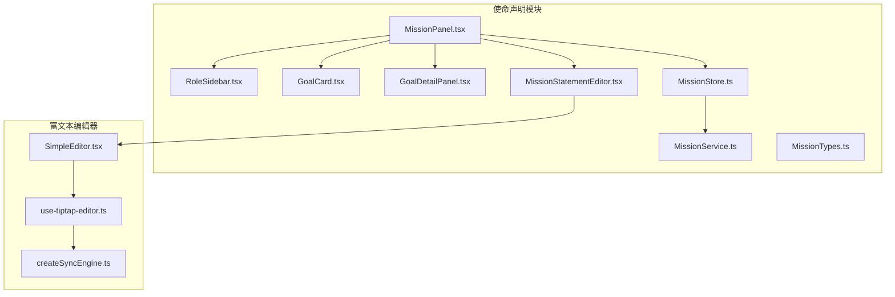
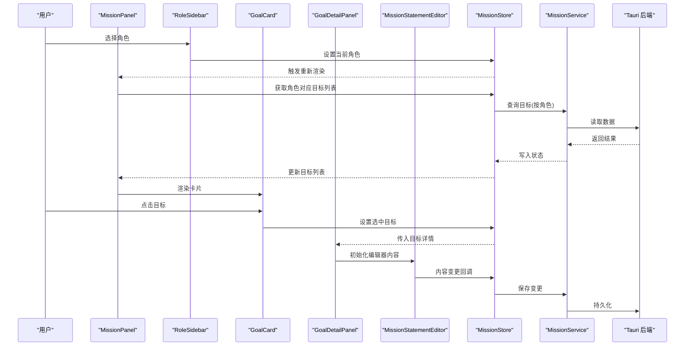
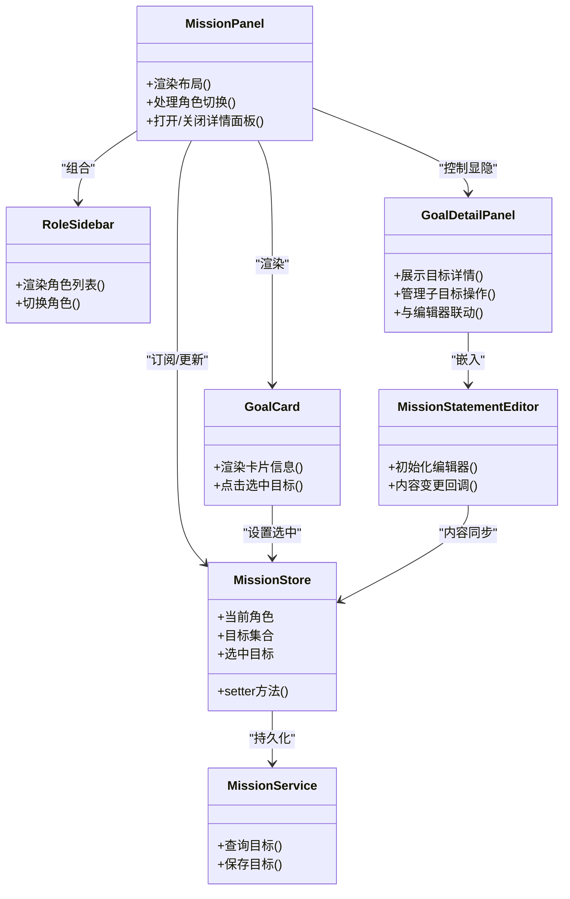

# 使命声明组件

<cite>
**本文引用的文件**
- [MissionPanel.tsx](file://src/features/mission/MissionPanel.tsx)
- [MissionPanel.css](file://src/features/mission/MissionPanel.css)
- [GoalCard.tsx](file://src/features/mission/GoalCard.tsx)
- [GoalDetailPanel.tsx](file://src/features/mission/GoalDetailPanel.tsx)
- [MissionStatementEditor.tsx](file://src/features/mission/MissionStatementEditor.tsx)
- [RoleSidebar.tsx](file://src/features/mission/RoleSidebar.tsx)
- [MissionStore.ts](file://src/features/mission/MissionStore.ts)
- [MissionService.ts](file://src/features/mission/MissionService.ts)
- [MissionTypes.ts](file://src/features/mission/MissionTypes.ts)
- [MissionStore.test.ts](file://src/features/mission/MissionStore.test.ts)
- [SimpleEditor.tsx](file://src/features/tiptap/SimpleEditor.tsx)
- [use-tiptap-editor.ts](file://src/hooks/use-tiptap-editor.ts)
- [createSyncEngine.ts](file://src/lib/createSyncEngine.ts)
</cite>

## 目录
1. [简介](#简介)
2. [项目结构](#项目结构)
3. [核心组件](#核心组件)
4. [架构总览](#架构总览)
5. [详细组件分析](#详细组件分析)
6. [依赖关系分析](#依赖关系分析)
7. [性能考虑](#性能考虑)
8. [故障排查指南](#故障排查指南)
9. [结论](#结论)
10. [附录](#附录)

## 简介
本文件面向“使命声明”功能的前端实现，聚焦以下目标：
- 深入解析 MissionPanel、GoalCard、GoalDetailPanel、MissionStatementEditor、RoleSidebar 等核心组件的设计与实现。
- 说明角色驱动的卡片布局与详情面板的数据传递机制。
- 阐述富文本编辑器的集成方式与内容同步策略。
- 解释侧边栏的角色切换与导航逻辑。
- 梳理目标分解算法与进度跟踪的实现细节。

## 项目结构
使命声明模块位于 features/mission 下，采用“按特性组织”的结构，包含 UI 组件、状态管理（Zustand）、服务层（Tauri 调用）与类型定义。

图表来源
- [MissionPanel.tsx](file://src/features/mission/MissionPanel.tsx)
- [RoleSidebar.tsx](file://src/features/mission/RoleSidebar.tsx)
- [GoalCard.tsx](file://src/features/mission/GoalCard.tsx)
- [GoalDetailPanel.tsx](file://src/features/mission/GoalDetailPanel.tsx)
- [MissionStatementEditor.tsx](file://src/features/mission/MissionStatementEditor.tsx)
- [MissionStore.ts](file://src/features/mission/MissionStore.ts)
- [MissionService.ts](file://src/features/mission/MissionService.ts)
- [MissionTypes.ts](file://src/features/mission/MissionTypes.ts)
- [SimpleEditor.tsx](file://src/features/tiptap/SimpleEditor.tsx)
- [use-tiptap-editor.ts](file://src/hooks/use-tiptap-editor.ts)
- [createSyncEngine.ts](file://src/lib/createSyncEngine.ts)

章节来源
- [MissionPanel.tsx](file://src/features/mission/MissionPanel.tsx)
- [MissionStore.ts](file://src/features/mission/MissionStore.ts)
- [MissionTypes.ts](file://src/features/mission/MissionTypes.ts)

## 核心组件
本节概述各组件的职责与交互边界，为后续深入分析奠定基础。

- MissionPanel：页面级容器，负责整体布局、角色选择、目标列表渲染与详情面板的显隐控制。
- RoleSidebar：左侧角色导航，提供角色切换与选中态反馈。
- GoalCard：目标卡片，展示关键信息并支持点击打开详情。
- GoalDetailPanel：右侧详情面板，承载目标元数据、子目标列表与富文本内容。
- MissionStatementEditor：富文本编辑器封装，用于编辑使命陈述或目标描述，并与编辑器状态同步。
- MissionStore：基于 Zustand 的状态管理，维护角色、目标集合、选中项与操作行为。
- MissionService：与 Tauri 后端通信的服务层，负责持久化与查询。
- SimpleEditor / use-tiptap-editor / createSyncEngine：富文本编辑器基础设施与同步引擎。

章节来源
- [MissionPanel.tsx](file://src/features/mission/MissionPanel.tsx)
- [RoleSidebar.tsx](file://src/features/mission/RoleSidebar.tsx)
- [GoalCard.tsx](file://src/features/mission/GoalCard.tsx)
- [GoalDetailPanel.tsx](file://src/features/mission/GoalDetailPanel.tsx)
- [MissionStatementEditor.tsx](file://src/features/mission/MissionStatementEditor.tsx)
- [MissionStore.ts](file://src/features/mission/MissionStore.ts)
- [MissionService.ts](file://src/features/mission/MissionService.ts)
- [SimpleEditor.tsx](file://src/features/tiptap/SimpleEditor.tsx)
- [use-tiptap-editor.ts](file://src/hooks/use-tiptap-editor.ts)
- [createSyncEngine.ts](file://src/lib/createSyncEngine.ts)

## 架构总览
下图展示了从用户交互到状态更新、再到持久化的完整链路。

图表来源
- [MissionPanel.tsx](file://src/features/mission/MissionPanel.tsx)
- [RoleSidebar.tsx](file://src/features/mission/RoleSidebar.tsx)
- [GoalCard.tsx](file://src/features/mission/GoalCard.tsx)
- [GoalDetailPanel.tsx](file://src/features/mission/GoalDetailPanel.tsx)
- [MissionStatementEditor.tsx](file://src/features/mission/MissionStatementEditor.tsx)
- [MissionStore.ts](file://src/features/mission/MissionStore.ts)
- [MissionService.ts](file://src/features/mission/MissionService.ts)

## 详细组件分析

### MissionPanel 组件
- 职责
  - 作为页面容器，组合 RoleSidebar、目标卡片列表与 GoalDetailPanel。
  - 根据当前角色过滤并渲染目标卡片。
  - 控制详情面板的显示与关闭。
- 数据流
  - 从 MissionStore 订阅当前角色与目标集合。
  - 将选中的目标传递给 GoalDetailPanel。
- 交互
  - 监听角色切换事件，刷新目标列表。
  - 点击卡片时设置选中目标并打开详情面板。

章节来源
- [MissionPanel.tsx](file://src/features/mission/MissionPanel.tsx)
- [MissionStore.ts](file://src/features/mission/MissionStore.ts)

### RoleSidebar 组件
- 职责
  - 展示所有可用角色并提供切换入口。
  - 高亮当前选中角色，驱动 MissionPanel 刷新。
- 交互逻辑
  - 点击角色项时调用 store 的 setter 更新当前角色。
  - 可结合键盘导航提升可访问性。

章节来源
- [RoleSidebar.tsx](file://src/features/mission/RoleSidebar.tsx)
- [MissionStore.ts](file://src/features/mission/MissionStore.ts)

### GoalCard 组件
- 职责
  - 以卡片形式呈现目标的关键信息（如标题、状态、进度）。
  - 点击后通知父级设置选中目标。
- 数据绑定
  - 接收单个目标对象作为 props。
  - 根据目标状态计算样式与进度条。

章节来源
- [GoalCard.tsx](file://src/features/mission/GoalCard.tsx)
- [MissionTypes.ts](file://src/features/mission/MissionTypes.ts)

### GoalDetailPanel 组件
- 职责
  - 展示选中目标的详细信息，包括基础属性、子目标列表与富文本内容。
  - 提供子目标的新增、删除与排序能力（若存在）。
- 与编辑器协作
  - 将目标富文本内容注入 MissionStatementEditor。
  - 监听编辑器内容变化，触发保存流程。

章节来源
- [GoalDetailPanel.tsx](file://src/features/mission/GoalDetailPanel.tsx)
- [MissionStatementEditor.tsx](file://src/features/mission/MissionStatementEditor.tsx)
- [MissionStore.ts](file://src/features/mission/MissionStore.ts)

### MissionStatementEditor 组件
- 职责
  - 封装富文本编辑器，提供读写目标描述的能力。
  - 处理初始内容加载与增量更新。
- 编辑器集成
  - 使用 SimpleEditor 作为底层编辑器。
  - 通过 use-tiptap-editor hook 管理编辑器实例与配置。
  - 借助 createSyncEngine 实现内容变更与状态/存储的同步。

章节来源
- [MissionStatementEditor.tsx](file://src/features/mission/MissionStatementEditor.tsx)
- [SimpleEditor.tsx](file://src/features/tiptap/SimpleEditor.tsx)
- [use-tiptap-editor.ts](file://src/hooks/use-tiptap-editor.ts)
- [createSyncEngine.ts](file://src/lib/createSyncEngine.ts)

### 角色驱动的卡片布局与详情面板数据传递
- 角色筛选
  - MissionStore 维护当前角色与目标集合；MissionPanel 根据角色过滤目标列表。
- 选中态传递
  - GoalCard 点击后，通过 store 的选中目标 setter 更新全局状态。
  - GoalDetailPanel 订阅选中目标，渲染详情与编辑器。
- 双向同步
  - 编辑器内容变更回调至 store，store 调用 service 进行持久化。

章节来源
- [MissionPanel.tsx](file://src/features/mission/MissionPanel.tsx)
- [GoalCard.tsx](file://src/features/mission/GoalCard.tsx)
- [GoalDetailPanel.tsx](file://src/features/mission/GoalDetailPanel.tsx)
- [MissionStore.ts](file://src/features/mission/MissionStore.ts)

### 富文本编辑器集成与内容同步策略
- 集成方式
  - MissionStatementEditor 组合 SimpleEditor，并通过 use-tiptap-editor 初始化编辑器实例。
  - 编辑器配置（工具栏、扩展等）由上层传入或默认提供。
- 同步策略
  - 使用 createSyncEngine 在编辑器 onContentChange 事件中收集变更。
  - 防抖/节流策略避免频繁写入，确保用户体验与性能平衡。
  - 最终通过 MissionService 调用 Tauri 接口完成持久化。

章节来源
- [MissionStatementEditor.tsx](file://src/features/mission/MissionStatementEditor.tsx)
- [SimpleEditor.tsx](file://src/features/tiptap/SimpleEditor.tsx)
- [use-tiptap-editor.ts](file://src/hooks/use-tiptap-editor.ts)
- [createSyncEngine.ts](file://src/lib/createSyncEngine.ts)
- [MissionService.ts](file://src/features/mission/MissionService.ts)

### 侧边栏的角色切换与导航逻辑
- 角色列表来源
  - 从 MissionStore 中读取角色集合。
- 切换流程
  - 点击角色项 -> 更新当前角色 -> 触发 MissionPanel 重新渲染 -> 拉取该角色的目标列表。
- 导航增强
  - 支持键盘方向键与回车确认，提升无障碍体验。
  - 可选：记住上次选择的角色，提升连续操作效率。

章节来源
- [RoleSidebar.tsx](file://src/features/mission/RoleSidebar.tsx)
- [MissionStore.ts](file://src/features/mission/MissionStore.ts)

### 目标分解算法与进度跟踪
- 目标分解
  - 子目标通常以树形结构表示，根目标包含若干子目标节点。
  - 分解规则可由业务字段驱动（例如优先级、依赖关系），前端负责渲染与交互。
- 进度计算
  - 叶子节点的完成度贡献到父节点，递归汇总得到总体进度。
  - 进度可视化通过进度条或百分比展示。
- 交互影响
  - 修改任一子目标状态会触发进度重算与视图更新。

章节来源
- [MissionTypes.ts](file://src/features/mission/MissionTypes.ts)
- [MissionStore.ts](file://src/features/mission/MissionStore.ts)
- [GoalDetailPanel.tsx](file://src/features/mission/GoalDetailPanel.tsx)

## 依赖关系分析
组件与服务层的依赖如下：

图表来源
- [MissionPanel.tsx](file://src/features/mission/MissionPanel.tsx)
- [RoleSidebar.tsx](file://src/features/mission/RoleSidebar.tsx)
- [GoalCard.tsx](file://src/features/mission/GoalCard.tsx)
- [GoalDetailPanel.tsx](file://src/features/mission/GoalDetailPanel.tsx)
- [MissionStatementEditor.tsx](file://src/features/mission/MissionStatementEditor.tsx)
- [MissionStore.ts](file://src/features/mission/MissionStore.ts)
- [MissionService.ts](file://src/features/mission/MissionService.ts)

章节来源
- [MissionPanel.tsx](file://src/features/mission/MissionPanel.tsx)
- [MissionStore.ts](file://src/features/mission/MissionStore.ts)
- [MissionService.ts](file://src/features/mission/MissionService.ts)

## 性能考虑
- 列表渲染优化
  - 对目标列表进行稳定 key 绑定，减少不必要的重渲染。
  - 大列表场景可采用虚拟滚动（若目标数量较多）。
- 编辑器同步
  - 使用防抖/节流合并高频内容变更，降低持久化频率。
  - 仅在必要时触发全量保存，局部变更优先增量更新。
- 状态粒度
  - 将角色、目标集合、选中项拆分到独立字段，避免无关组件重渲染。
- 网络与本地 IO
  - 批量操作合并请求，减少 Tauri 调用次数。
  - 失败重试与乐观更新相结合，提升响应速度。

[本节为通用性能建议，不直接分析具体文件]

## 故障排查指南
- 角色切换无效
  - 检查 RoleSidebar 是否正确调用 store 的 setter。
  - 验证 MissionPanel 是否订阅了当前角色并触发刷新。
- 目标列表未更新
  - 确认 MissionStore 的查询逻辑是否被正确触发。
  - 检查 MissionService 与 Tauri 后端的返回值是否与前端期望一致。
- 编辑器内容不同步
  - 核对 MissionStatementEditor 的内容变更回调是否写入 store。
  - 检查 createSyncEngine 的防抖配置与保存时机。
- 进度计算异常
  - 校验子目标树结构与完成度字段是否符合预期。
  - 确认递归汇总逻辑在新增/删除子目标后能正确重算。

章节来源
- [MissionStore.ts](file://src/features/mission/MissionStore.ts)
- [MissionStore.test.ts](file://src/features/mission/MissionStore.test.ts)
- [MissionService.ts](file://src/features/mission/MissionService.ts)
- [MissionStatementEditor.tsx](file://src/features/mission/MissionStatementEditor.tsx)
- [createSyncEngine.ts](file://src/lib/createSyncEngine.ts)

## 结论
使命声明模块通过清晰的组件分层与状态管理，实现了角色驱动的目标管理与富文本编辑能力。MissionPanel 作为编排者协调各子组件，MissionStore 集中管理状态，MissionService 对接后端持久化。编辑器集成遵循最小侵入原则，配合同步引擎保障内容与存储的一致性。建议在后续迭代中持续优化列表渲染与编辑器同步策略，以提升大规模数据的交互体验。

[本节为总结性内容，不直接分析具体文件]

## 附录
- 相关类型定义参考：[MissionTypes.ts](file://src/features/mission/MissionTypes.ts)
- 单元测试参考：[MissionStore.test.ts](file://src/features/mission/MissionStore.test.ts)
- 样式文件参考：[MissionPanel.css](file://src/features/mission/MissionPanel.css)