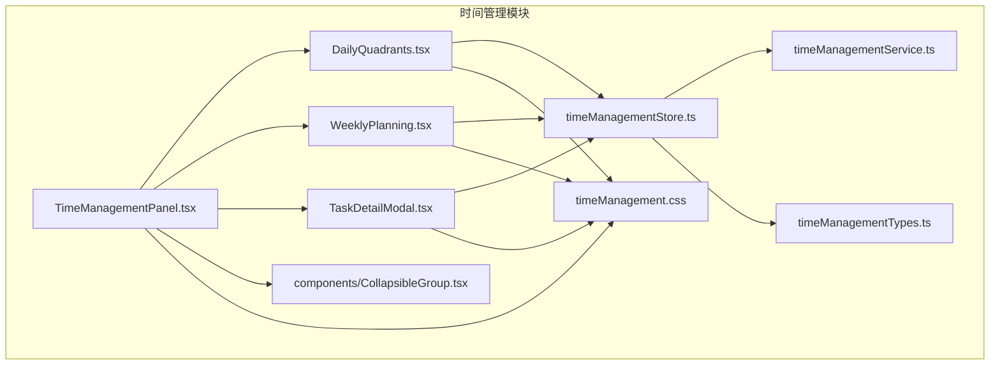
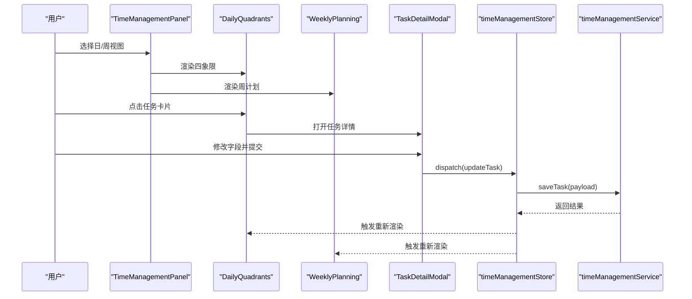
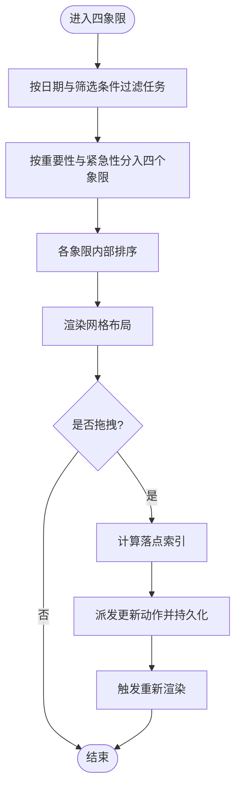
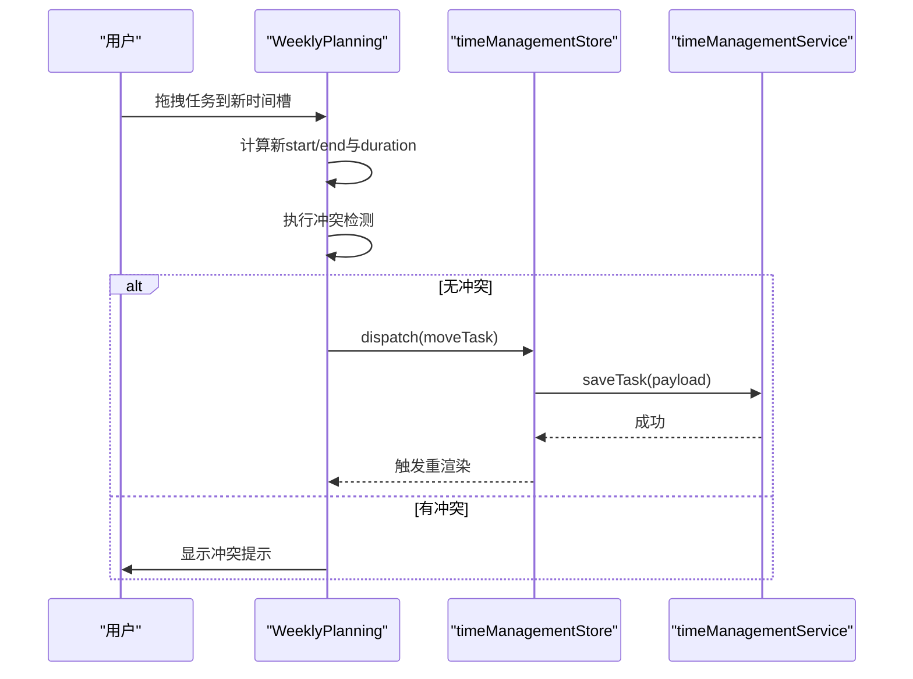
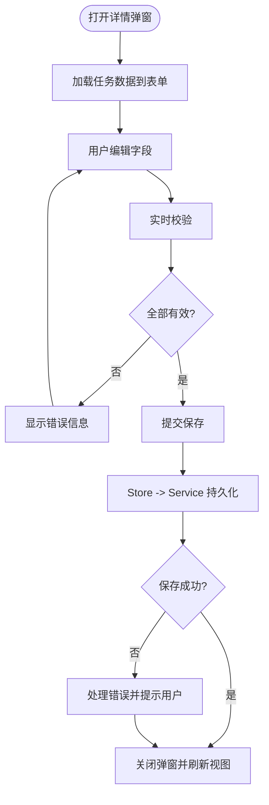
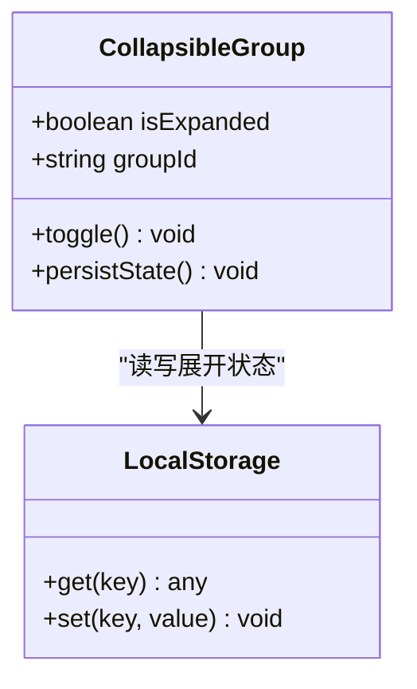
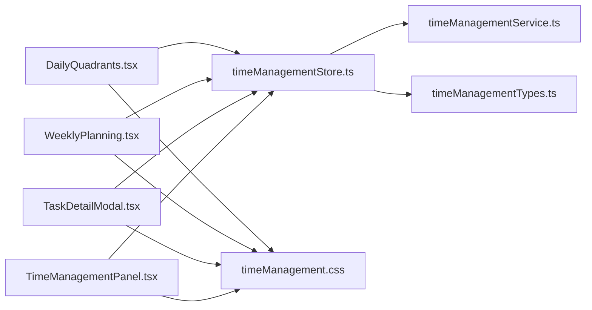

# 时间管理组件

<cite>
**本文引用的文件**   
- [TimeManagementPanel.tsx](file://src/features/time-management/TimeManagementPanel.tsx)
- [DailyQuadrants.tsx](file://src/features/time-management/DailyQuadrants.tsx)
- [WeeklyPlanning.tsx](file://src/features/time-management/WeeklyPlanning.tsx)
- [TaskDetailModal.tsx](file://src/features/time-management/TaskDetailModal.tsx)
- [CollapsibleGroup.tsx](file://src/features/time-management/components/CollapsibleGroup.tsx)
- [timeManagementStore.ts](file://src/features/time-management/timeManagementStore.ts)
- [timeManagementService.ts](file://src/features/time-management/timeManagementService.ts)
- [timeManagementTypes.ts](file://src/features/time-management/timeManagementTypes.ts)
- [timeManagement.css](file://src/features/time-management/timeManagement.css)
</cite>

## 更新摘要
**变更内容**   
- 基于Applied Changes更新了任务处理改进相关内容
- 增强了TaskDetailModal.tsx的任务处理逻辑
- 优化了timeManagement.css样式以提升用户体验
- 改进了任务管理的流畅性和响应性

## 目录
1. [简介](#简介)
2. [项目结构](#项目结构)
3. [核心组件](#核心组件)
4. [架构总览](#架构总览)
5. [详细组件分析](#详细组件分析)
6. [依赖关系分析](#依赖关系分析)
7. [性能考虑](#性能考虑)
8. [故障排查指南](#故障排查指南)
9. [结论](#结论)
10. [附录](#附录)

## 简介
本文件聚焦于"时间管理"功能的前端组件与数据流，围绕以下目标展开：
- 深入解析 TimeManagementPanel、DailyQuadrants、WeeklyPlanning、TaskDetailModal、CollapsibleGroup 等核心组件的设计与实现。
- 说明四象限矩阵的布局算法与任务分配逻辑。
- 解释周计划视图的时间线渲染与任务调度机制。
- 梳理任务详情模态框的数据绑定与表单验证逻辑。
- 总结可折叠组的展开收起动画与状态管理策略。
- **新增** 基于最新改进的任务处理增强和样式优化体验。

## 项目结构
时间管理模块位于 features/time-management 下，采用"按特性组织"的结构方式，将 UI 组件、状态存储、服务层与类型定义集中管理，便于维护与扩展。

图表来源
- [TimeManagementPanel.tsx](file://src/features/time-management/TimeManagementPanel.tsx)
- [DailyQuadrants.tsx](file://src/features/time-management/DailyQuadrants.tsx)
- [WeeklyPlanning.tsx](file://src/features/time-management/WeeklyPlanning.tsx)
- [TaskDetailModal.tsx](file://src/features/time-management/TaskDetailModal.tsx)
- [CollapsibleGroup.tsx](file://src/features/time-management/components/CollapsibleGroup.tsx)
- [timeManagementStore.ts](file://src/features/time-management/timeManagementStore.ts)
- [timeManagementService.ts](file://src/features/time-management/timeManagementService.ts)
- [timeManagementTypes.ts](file://src/features/time-management/timeManagementTypes.ts)
- [timeManagement.css](file://src/features/time-management/timeManagement.css)

章节来源
- [TimeManagementPanel.tsx](file://src/features/time-management/TimeManagementPanel.tsx)
- [timeManagementStore.ts](file://src/features/time-management/timeManagementStore.ts)
- [timeManagementService.ts](file://src/features/time-management/timeManagementService.ts)
- [timeManagementTypes.ts](file://src/features/time-management/timeManagementTypes.ts)
- [timeManagement.css](file://src/features/time-management/timeManagement.css)

## 核心组件
本节概述各组件的职责与交互边界，为后续深入分析奠定基础。

- TimeManagementPanel：页面级容器，负责切换日/周视图、聚合子组件、承载全局状态订阅与事件分发。
- DailyQuadrants：四象限矩阵视图，按重要性与紧急性对任务进行分组与展示，支持拖拽重排与快速操作。
- WeeklyPlanning：周计划视图，以时间轴形式呈现一周任务，提供跨天调度与冲突提示。
- TaskDetailModal：任务详情弹窗，承载任务编辑表单、字段校验与保存流程。**已更新** 改进了任务处理逻辑和用户体验。
- CollapsibleGroup：可折叠组，用于在面板中组织相关区块（如分类、标签或时间段），提供展开/收起动画与状态持久化。

章节来源
- [TimeManagementPanel.tsx](file://src/features/time-management/TimeManagementPanel.tsx)
- [DailyQuadrants.tsx](file://src/features/time-management/DailyQuadrants.tsx)
- [WeeklyPlanning.tsx](file://src/features/time-management/WeeklyPlanning.tsx)
- [TaskDetailModal.tsx](file://src/features/time-management/TaskDetailModal.tsx)
- [CollapsibleGroup.tsx](file://src/features/time-management/components/CollapsibleGroup.tsx)

## 架构总览
整体采用"组件-状态-服务"分层：UI 组件通过 Store 订阅与派发状态变更；Store 调用 Service 完成数据读写；类型定义统一约束数据结构。

图表来源
- [TimeManagementPanel.tsx](file://src/features/time-management/TimeManagementPanel.tsx)
- [DailyQuadrants.tsx](file://src/features/time-management/DailyQuadrants.tsx)
- [WeeklyPlanning.tsx](file://src/features/time-management/WeeklyPlanning.tsx)
- [TaskDetailModal.tsx](file://src/features/time-management/TaskDetailModal.tsx)
- [timeManagementStore.ts](file://src/features/time-management/timeManagementStore.ts)
- [timeManagementService.ts](file://src/features/time-management/timeManagementService.ts)

## 详细组件分析

### TimeManagementPanel（页面容器）
职责与要点
- 作为入口容器，统一管理"日视图/周视图"的切换状态。
- 订阅 Store 中的任务集合、当前日期范围、筛选条件等。
- 向子组件传递必要 props（如任务列表、回调函数）。
- 处理全局快捷键与窗口尺寸变化，驱动响应式布局。

关键交互
- 切换视图时更新当前日期范围并刷新数据。
- 监听任务增删改事件，确保子视图一致更新。

章节来源
- [TimeManagementPanel.tsx](file://src/features/time-management/TimeManagementPanel.tsx)
- [timeManagementStore.ts](file://src/features/time-management/timeManagementStore.ts)

### DailyQuadrants（四象限矩阵）
设计目标
- 基于"重要性×紧急性"二维矩阵，将任务分配到四个象限。
- 提供直观的视觉分区与便捷的拖拽重排能力。
- 支持快速创建、批量移动与筛选。

布局算法与任务分配
- 输入：任务集合（含重要性等级、紧急性等级、起止时间、所属日期等）。
- 步骤：
  1) 过滤：根据当前日期与筛选条件裁剪任务集。
  2) 分类：依据重要性/紧急性二元判定，将任务映射到四个象限。
  3) 排序：在每个象限内按优先级或时间顺序排序。
  4) 渲染：生成网格布局，每个象限独立滚动区域。
- 复杂度：O(n log n)（主要来源于排序），空间 O(n)。

任务分配与重排
- 拖拽源：某象限内的任务项。
- 拖拽目标：同一或不同象限的占位槽。
- 落点计算：根据鼠标位置与网格坐标确定插入索引。
- 状态更新：通过 Store 派发 move/update 动作，持久化后触发重渲染。

图表来源
- [DailyQuadrants.tsx](file://src/features/time-management/DailyQuadrants.tsx)
- [timeManagementStore.ts](file://src/features/time-management/timeManagementStore.ts)
- [timeManagementTypes.ts](file://src/features/time-management/timeManagementTypes.ts)

章节来源
- [DailyQuadrants.tsx](file://src/features/time-management/DailyQuadrants.tsx)
- [timeManagementStore.ts](file://src/features/time-management/timeManagementStore.ts)
- [timeManagementTypes.ts](file://src/features/time-management/timeManagementTypes.ts)

### WeeklyPlanning（周计划视图）
设计目标
- 以时间轴形式展示一周任务，支持跨天调度与冲突检测。
- 提供拖拽调整开始/结束时间、整块移动等功能。

时间线渲染与任务调度
- 时间轴：以小时为单位划分纵轴，日期为横轴，形成 7×24 网格。
- 任务定位：根据任务的开始时间与持续时间计算 top/left 百分比。
- 重叠处理：当多个任务在同一时段重叠时，自动横向拆分列宽以避免遮挡。
- 调度机制：
  - 拖拽移动：更新 start/end 时间，触发冲突检查。
  - 拖拽拉伸：调整 duration，保持起始或结束锚点。
  - 跨天拖动：自动修正日期边界与时长。
- 冲突提示：若新位置存在资源占用或超出可用时间窗，给出视觉反馈与阻止提交。

图表来源
- [WeeklyPlanning.tsx](file://src/features/time-management/WeeklyPlanning.tsx)
- [timeManagementStore.ts](file://src/features/time-management/timeManagementStore.ts)
- [timeManagementService.ts](file://src/features/time-management/timeManagementService.ts)

章节来源
- [WeeklyPlanning.tsx](file://src/features/time-management/WeeklyPlanning.tsx)
- [timeManagementStore.ts](file://src/features/time-management/timeManagementStore.ts)
- [timeManagementService.ts](file://src/features/time-management/timeManagementService.ts)

### TaskDetailModal（任务详情模态框）
设计目标
- 提供任务编辑表单，包含标题、描述、优先级、起止时间、标签等字段。
- 实现双向数据绑定与实时校验，保障数据一致性。
- **新增** 改进的任务处理逻辑提供更流畅的用户体验。

数据绑定与表单验证
- 数据绑定：从 Store 读取选中任务，初始化表单；提交时合并变更并回写 Store。
- 校验规则：
  - 必填字段：标题、开始时间等。
  - 时间约束：结束时间必须晚于开始时间；跨天需合理。
  - 重复检测：同一天内相同标题的任务去重提示。
- 错误反馈：行内错误消息与高亮边框；禁用提交按钮直至全部通过。
- 保存流程：
  - 前端校验通过后，调用 Store 的 update/create 动作。
  - Store 调用 Service 持久化，成功后关闭弹窗并刷新视图。
- **更新** 任务处理改进包括更智能的错误处理和用户反馈机制。

图表来源
- [TaskDetailModal.tsx](file://src/features/time-management/TaskDetailModal.tsx)
- [timeManagementStore.ts](file://src/features/time-management/timeManagementStore.ts)
- [timeManagementTypes.ts](file://src/features/time-management/timeManagementTypes.ts)

章节来源
- [TaskDetailModal.tsx](file://src/features/time-management/TaskDetailModal.tsx)
- [timeManagementStore.ts](file://src/features/time-management/timeManagementStore.ts)
- [timeManagementTypes.ts](file://src/features/time-management/timeManagementTypes.ts)

### CollapsibleGroup（可折叠组）
设计目标
- 将相关内容（如分类、标签、时间段）组织为可折叠区块，提升信息密度与可读性。
- 提供平滑的展开/收起动画与状态持久化。

展开收起动画与状态管理
- 状态模型：每个组维护 isExpanded 布尔值，默认值可由配置或本地缓存决定。
- 动画实现：使用 CSS transition 控制 max-height/opacity，避免抖动。
- 状态持久化：将展开状态写入本地存储，下次进入恢复。
- 无障碍：键盘 Tab/Enter 切换，ARIA 属性同步。

图表来源
- [CollapsibleGroup.tsx](file://src/features/time-management/components/CollapsibleGroup.tsx)

章节来源
- [CollapsibleGroup.tsx](file://src/features/time-management/components/CollapsibleGroup.tsx)

## 依赖关系分析
组件与数据层的依赖关系如下：UI 组件仅依赖 Store 暴露的状态与动作；Store 依赖 Service 与 Types；样式由独立 CSS 文件管理。

图表来源
- [DailyQuadrants.tsx](file://src/features/time-management/DailyQuadrants.tsx)
- [WeeklyPlanning.tsx](file://src/features/time-management/WeeklyPlanning.tsx)
- [TaskDetailModal.tsx](file://src/features/time-management/TaskDetailModal.tsx)
- [TimeManagementPanel.tsx](file://src/features/time-management/TimeManagementPanel.tsx)
- [timeManagementStore.ts](file://src/features/time-management/timeManagementStore.ts)
- [timeManagementService.ts](file://src/features/time-management/timeManagementService.ts)
- [timeManagementTypes.ts](file://src/features/time-management/timeManagementTypes.ts)
- [timeManagement.css](file://src/features/time-management/timeManagement.css)

章节来源
- [timeManagementStore.ts](file://src/features/time-management/timeManagementStore.ts)
- [timeManagementService.ts](file://src/features/time-management/timeManagementService.ts)
- [timeManagementTypes.ts](file://src/features/time-management/timeManagementTypes.ts)

## 性能考虑
- 列表渲染优化：对四象限与周计划中的任务列表使用稳定 key，减少不必要的重渲染。
- 计算量控制：四象限分类与排序仅在数据变更时执行；周计划的重叠计算按需触发。
- 拖拽体验：使用 requestAnimationFrame 节流高频更新，避免主线程阻塞。
- 样式与主题：CSS 变量与最小化重绘，避免频繁改变布局属性。
- 状态粒度：Store 拆分子切片，使组件只订阅所需字段，降低更新范围。
- **新增** 基于最新的样式优化，提升了任务管理的流畅性和响应性。

[本节为通用指导，不直接分析具体文件]

## 故障排查指南
常见问题与定位建议
- 四象限任务未正确归类：
  - 检查重要性/紧急性字段是否为空或非法值。
  - 确认过滤条件与当前日期范围一致。
- 周计划任务重叠异常：
  - 核对 start/end 时间格式与时区转换。
  - 查看冲突检测逻辑是否被跳过。
- 任务详情无法保存：
  - 确认表单校验是否全部通过。
  - 检查 Store 动作是否正确派发且 Service 返回成功。
  - **新增** 检查改进后的任务处理逻辑是否正确执行。
- 可折叠组状态丢失：
  - 检查本地存储键名与序列化/反序列化逻辑。
  - 确认首次渲染时的默认值覆盖策略。
- **新增** 样式相关问题：
  - 检查 timeManagement.css 中的样式冲突。
  - 确认 CSS 变量是否正确定义和应用。

章节来源
- [DailyQuadrants.tsx](file://src/features/time-management/DailyQuadrants.tsx)
- [WeeklyPlanning.tsx](file://src/features/time-management/WeeklyPlanning.tsx)
- [TaskDetailModal.tsx](file://src/features/time-management/TaskDetailModal.tsx)
- [CollapsibleGroup.tsx](file://src/features/time-management/components/CollapsibleGroup.tsx)
- [timeManagementStore.ts](file://src/features/time-management/timeManagementStore.ts)
- [timeManagementService.ts](file://src/features/time-management/timeManagementService.ts)
- [timeManagement.css](file://src/features/time-management/timeManagement.css)

## 结论
时间管理模块通过清晰的组件分层与明确的数据流向，实现了四象限矩阵与周计划两大核心场景。四象限侧重任务优先级可视化与快速重排，周计划强调时间轴上的精确调度与冲突管理。任务详情弹窗提供稳健的表单校验与持久化路径，可折叠组则提升了界面组织性与用户体验。

**最新更新** 基于 Applied Changes 的改进包括：
- TaskDetailModal.tsx 的任务处理逻辑得到显著增强
- timeManagement.css 样式优化提供了更流畅的用户体验
- 整体任务管理流程更加稳定和高效

建议在后续迭代中继续完善无障碍支持、国际化与更丰富的冲突解决策略。

[本节为总结性内容，不直接分析具体文件]

## 附录
- 术语
  - 四象限：按重要性与紧急性划分的任务分类矩阵。
  - 时间轴：以时间为维度展示任务安排的可视化方式。
  - 冲突：同一时间段内多个任务相互占用导致的调度问题。
- 相关文件索引
  - 组件：见"核心组件"与"详细组件分析"。
  - 状态与服务：见"依赖关系分析"。
  - 样式：见 timeManagement.css。

[本节为补充信息，不直接分析具体文件]