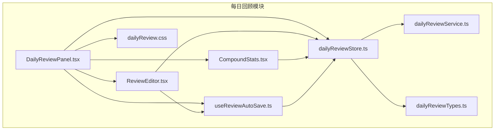
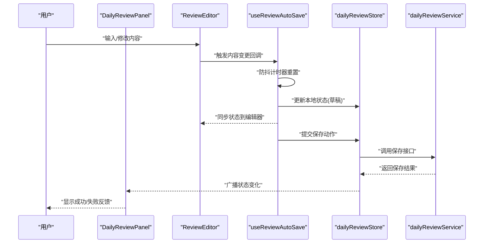
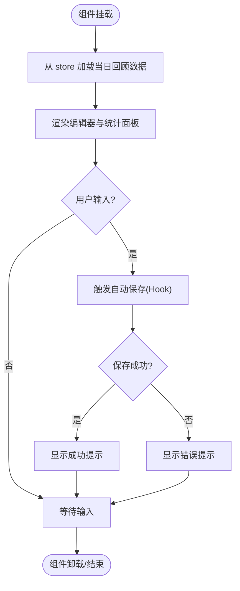
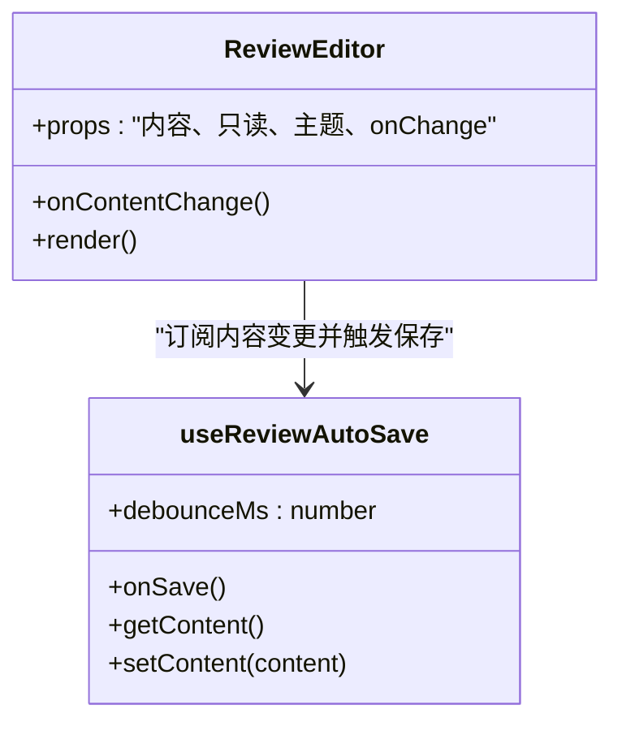
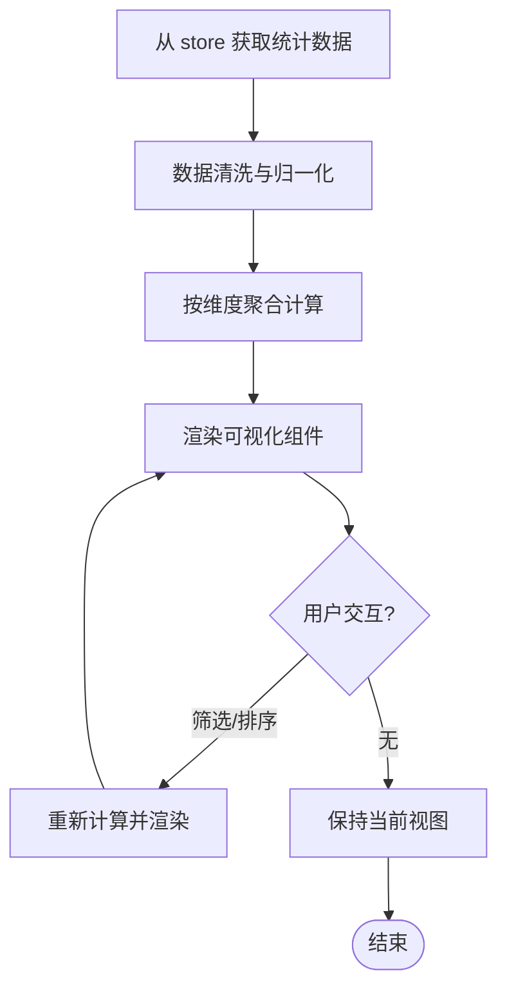
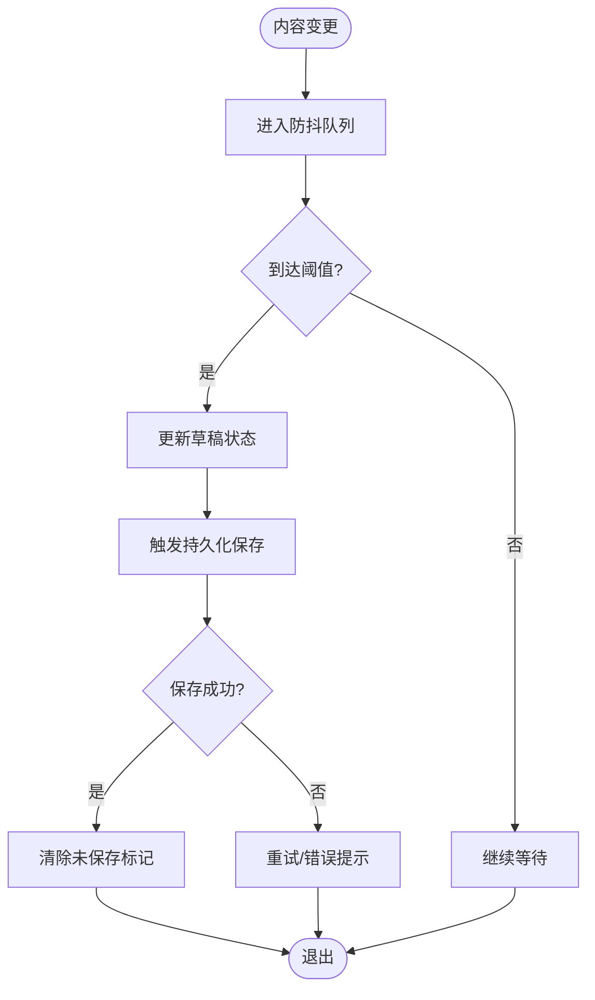
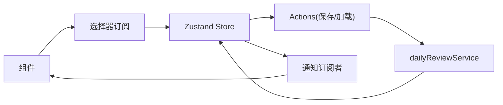
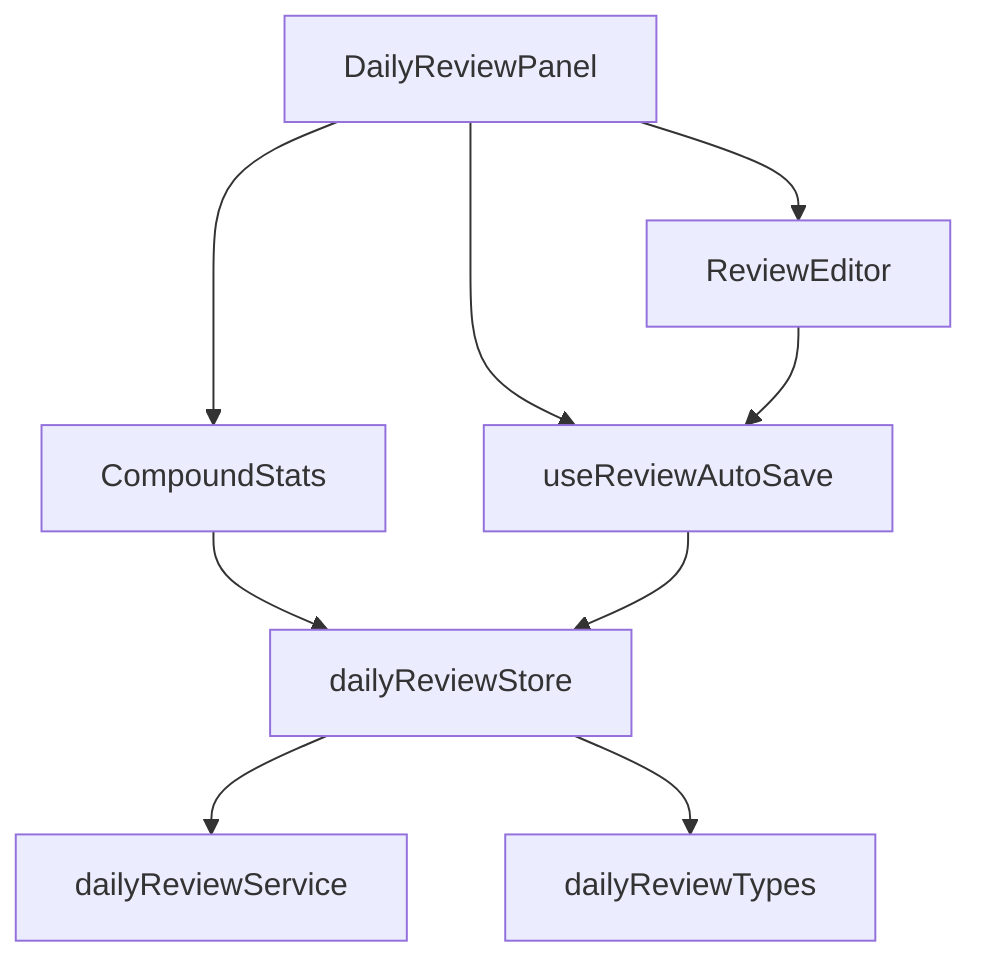

# 每日回顾组件

<cite>
**本文引用的文件**
- [DailyReviewPanel.tsx](file://src/features/daily-review/DailyReviewPanel.tsx)
- [ReviewEditor.tsx](file://src/features/daily-review/ReviewEditor.tsx)
- [CompoundStats.tsx](file://src/features/daily-review/CompoundStats.tsx)
- [useReviewAutoSave.ts](file://src/features/daily-review/useReviewAutoSave.ts)
- [dailyReviewStore.ts](file://src/features/daily-review/dailyReviewStore.ts)
- [dailyReviewTypes.ts](file://src/features/daily-review/dailyReviewTypes.ts)
- [dailyReviewService.ts](file://src/features/daily-review/dailyReviewService.ts)
- [dailyReview.css](file://src/features/daily-review/dailyReview.css)
</cite>

## 目录
1. [简介](#简介)
2. [项目结构](#项目结构)
3. [核心组件](#核心组件)
4. [架构总览](#架构总览)
5. [详细组件分析](#详细组件分析)
6. [依赖关系分析](#依赖关系分析)
7. [性能考量](#性能考量)
8. [故障排查指南](#故障排查指南)
9. [结论](#结论)
10. [附录](#附录)

## 简介
本文件为“每日回顾”功能的前端实现文档，聚焦以下核心目标：
- 深入解析 DailyReviewPanel、ReviewEditor、CompoundStats 等关键组件的设计与职责边界。
- 说明自动保存机制 useReviewAutoSave 的工作原理，包括防抖策略与状态同步流程。
- 解释复合统计展示组件 CompoundStats 的数据计算逻辑与可视化呈现方式。
- 梳理 Zustand store 的状态管理模式与数据流设计。
- 总结错误处理、性能优化与用户交互的最佳实践。

## 项目结构
每日回顾模块位于 features/daily-review 目录下，采用“按特性组织”的目录结构，将 UI 组件、状态管理、服务层与类型定义集中管理，便于维护与扩展。

图表来源
- [DailyReviewPanel.tsx](file://src/features/daily-review/DailyReviewPanel.tsx)
- [ReviewEditor.tsx](file://src/features/daily-review/ReviewEditor.tsx)
- [CompoundStats.tsx](file://src/features/daily-review/CompoundStats.tsx)
- [useReviewAutoSave.ts](file://src/features/daily-review/useReviewAutoSave.ts)
- [dailyReviewStore.ts](file://src/features/daily-review/dailyReviewStore.ts)
- [dailyReviewTypes.ts](file://src/features/daily-review/dailyReviewTypes.ts)
- [dailyReviewService.ts](file://src/features/daily-review/dailyReviewService.ts)
- [dailyReview.css](file://src/features/daily-review/dailyReview.css)

章节来源
- [DailyReviewPanel.tsx](file://src/features/daily-review/DailyReviewPanel.tsx)
- [ReviewEditor.tsx](file://src/features/daily-review/ReviewEditor.tsx)
- [CompoundStats.tsx](file://src/features/daily-review/CompoundStats.tsx)
- [useReviewAutoSave.ts](file://src/features/daily-review/useReviewAutoSave.ts)
- [dailyReviewStore.ts](file://src/features/daily-review/dailyReviewStore.ts)
- [dailyReviewTypes.ts](file://src/features/daily-review/dailyReviewTypes.ts)
- [dailyReviewService.ts](file://src/features/daily-review/dailyReviewService.ts)
- [dailyReview.css](file://src/features/daily-review/dailyReview.css)

## 核心组件
- DailyReviewPanel：页面级容器，负责组合编辑区、统计面板与自动保存控制，协调用户操作与持久化流程。
- ReviewEditor：富文本编辑器集成层，封装编辑器实例生命周期、内容变更事件与自动保存触发。
- CompoundStats：复合统计展示组件，聚合多维度指标并渲染可视化视图。
- useReviewAutoSave：自定义 Hook，提供基于防抖的自动保存能力，确保编辑内容与后端一致。
- dailyReviewStore：Zustand 状态仓库，集中管理每日回顾相关状态与副作用。
- dailyReviewService：网络与本地存储适配层，屏蔽底层差异，向上暴露统一 API。
- dailyReviewTypes：类型定义，保证前后端数据结构一致性。
- dailyReview.css：样式资源，支撑布局与主题切换。

章节来源
- [DailyReviewPanel.tsx](file://src/features/daily-review/DailyReviewPanel.tsx)
- [ReviewEditor.tsx](file://src/features/daily-review/ReviewEditor.tsx)
- [CompoundStats.tsx](file://src/features/daily-review/CompoundStats.tsx)
- [useReviewAutoSave.ts](file://src/features/daily-review/useReviewAutoSave.ts)
- [dailyReviewStore.ts](file://src/features/daily-review/dailyReviewStore.ts)
- [dailyReviewTypes.ts](file://src/features/daily-review/dailyReviewTypes.ts)
- [dailyReviewService.ts](file://src/features/daily-review/dailyReviewService.ts)
- [dailyReview.css](file://src/features/daily-review/dailyReview.css)

## 架构总览
整体采用“组件—Hook—Store—Service”的分层模式：
- 组件层（UI）：仅关注展示与用户交互。
- Hook 层（行为）：封装可复用的交互逻辑（如自动保存）。
- Store 层（状态）：使用 Zustand 管理全局状态与副作用。
- Service 层（数据）：封装与后端或本地存储的通信细节。

图表来源
- [DailyReviewPanel.tsx](file://src/features/daily-review/DailyReviewPanel.tsx)
- [ReviewEditor.tsx](file://src/features/daily-review/ReviewEditor.tsx)
- [useReviewAutoSave.ts](file://src/features/daily-review/useReviewAutoSave.ts)
- [dailyReviewStore.ts](file://src/features/daily-review/dailyReviewStore.ts)
- [dailyReviewService.ts](file://src/features/daily-review/dailyReviewService.ts)

## 详细组件分析

### DailyReviewPanel 组件
职责与交互
- 作为页面容器，组合 ReviewEditor 与 CompoundStats。
- 监听 store 中的加载、保存状态，向用户提供反馈。
- 在初始化时触发数据加载，并在卸载时清理资源。

数据流
- 从 store 读取当前日期对应的回顾数据。
- 将编辑器的内容变更通过 Hook 接入自动保存。
- 根据保存结果更新 UI 提示。

图表来源
- [DailyReviewPanel.tsx](file://src/features/daily-review/DailyReviewPanel.tsx)
- [useReviewAutoSave.ts](file://src/features/daily-review/useReviewAutoSave.ts)
- [dailyReviewStore.ts](file://src/features/daily-review/dailyReviewStore.ts)

章节来源
- [DailyReviewPanel.tsx](file://src/features/daily-review/DailyReviewPanel.tsx)

### ReviewEditor 组件
职责与交互
- 封装富文本编辑器实例的生命周期管理。
- 订阅内容变更事件，并将最新内容推送到 Hook 进行自动保存。
- 支持只读模式与主题切换。

与自动保存的协作
- 通过 onChange 回调将内容增量传递给 useReviewAutoSave。
- 接收 Hook 返回的受控值，避免重复渲染。

图表来源
- [ReviewEditor.tsx](file://src/features/daily-review/ReviewEditor.tsx)
- [useReviewAutoSave.ts](file://src/features/daily-review/useReviewAutoSave.ts)

章节来源
- [ReviewEditor.tsx](file://src/features/daily-review/ReviewEditor.tsx)
- [useReviewAutoSave.ts](file://src/features/daily-review/useReviewAutoSave.ts)

### CompoundStats 组件
职责与交互
- 聚合多维度的回顾指标（如完成度、时长、质量评分等），以卡片或图表形式展示。
- 根据 store 提供的统计数据重新渲染。
- 支持点击筛选时间范围或维度。

数据计算与可视化
- 从 store 获取原始数据后，在组件内进行轻量计算（如汇总、排序、过滤）。
- 使用基础图形元素（柱状图、折线图、环形图等）组合成复合视图。
- 对大数据集进行分页或虚拟滚动以提升性能。

图表来源
- [CompoundStats.tsx](file://src/features/daily-review/CompoundStats.tsx)
- [dailyReviewStore.ts](file://src/features/daily-review/dailyReviewStore.ts)

章节来源
- [CompoundStats.tsx](file://src/features/daily-review/CompoundStats.tsx)

### useReviewAutoSave Hook
工作原理
- 防抖策略：在用户输入期间累计变更，达到阈值后再触发保存，减少频繁请求。
- 状态同步：将最新内容写入 store 的草稿状态，确保编辑器与全局状态一致。
- 幂等保存：保存动作具备去重与重试机制，避免重复提交。

流程图

图表来源
- [useReviewAutoSave.ts](file://src/features/daily-review/useReviewAutoSave.ts)
- [dailyReviewStore.ts](file://src/features/daily-review/dailyReviewStore.ts)

章节来源
- [useReviewAutoSave.ts](file://src/features/daily-review/useReviewAutoSave.ts)

### dailyReviewStore（Zustand）
状态管理模式
- 单一状态源：所有与每日回顾相关的状态集中在 store 中，避免分散管理。
- 原子化更新：将加载、保存、错误、草稿等状态拆分为独立字段，提升可测试性与可维护性。
- 副作用隔离：保存等副作用在 actions 中执行，并通过 service 层与外部系统交互。

数据流设计
- 组件通过 selector 订阅最小必要状态，降低重渲染频率。
- 保存流程由 action 发起，service 返回结果后更新状态并通知订阅者。

图表来源
- [dailyReviewStore.ts](file://src/features/daily-review/dailyReviewStore.ts)
- [dailyReviewService.ts](file://src/features/daily-review/dailyReviewService.ts)

章节来源
- [dailyReviewStore.ts](file://src/features/daily-review/dailyReviewStore.ts)
- [dailyReviewTypes.ts](file://src/features/daily-review/dailyReviewTypes.ts)
- [dailyReviewService.ts](file://src/features/daily-review/dailyReviewService.ts)

## 依赖关系分析
组件与模块之间的依赖关系如下：
- DailyReviewPanel 依赖 ReviewEditor、CompoundStats、useReviewAutoSave 与 store。
- ReviewEditor 依赖 useReviewAutoSave 与 store。
- CompoundStats 依赖 store 提供的统计数据。
- useReviewAutoSave 依赖 store 的草稿与保存动作。
- store 依赖 service 与 types。

图表来源
- [DailyReviewPanel.tsx](file://src/features/daily-review/DailyReviewPanel.tsx)
- [ReviewEditor.tsx](file://src/features/daily-review/ReviewEditor.tsx)
- [CompoundStats.tsx](file://src/features/daily-review/CompoundStats.tsx)
- [useReviewAutoSave.ts](file://src/features/daily-review/useReviewAutoSave.ts)
- [dailyReviewStore.ts](file://src/features/daily-review/dailyReviewStore.ts)
- [dailyReviewTypes.ts](file://src/features/daily-review/dailyReviewTypes.ts)
- [dailyReviewService.ts](file://src/features/daily-review/dailyReviewService.ts)

章节来源
- [DailyReviewPanel.tsx](file://src/features/daily-review/DailyReviewPanel.tsx)
- [ReviewEditor.tsx](file://src/features/daily-review/ReviewEditor.tsx)
- [CompoundStats.tsx](file://src/features/daily-review/CompoundStats.tsx)
- [useReviewAutoSave.ts](file://src/features/daily-review/useReviewAutoSave.ts)
- [dailyReviewStore.ts](file://src/features/daily-review/dailyReviewStore.ts)
- [dailyReviewTypes.ts](file://src/features/daily-review/dailyReviewTypes.ts)
- [dailyReviewService.ts](file://src/features/daily-review/dailyReviewService.ts)

## 性能考量
- 防抖保存：合理设置防抖间隔，平衡实时性与请求频率。
- 选择器订阅：在 store 中使用细粒度选择器，避免不必要的重渲染。
- 大列表渲染：CompoundStats 对大数据集采用分页或虚拟滚动。
- 惰性加载：仅在需要时加载历史统计数据，减少首屏开销。
- 样式与主题：通过 CSS 变量与按需加载样式，降低包体积。

[本节为通用指导，不直接分析具体文件]

## 故障排查指南
常见问题与定位建议
- 自动保存未触发：检查防抖配置与内容变更回调是否绑定正确。
- 保存失败：查看 store 的错误状态与 service 返回码，确认网络与权限。
- 数据不同步：核对草稿状态与编辑器受控值是否一致。
- 统计异常：验证数据清洗与聚合逻辑，检查空值与边界条件。

章节来源
- [useReviewAutoSave.ts](file://src/features/daily-review/useReviewAutoSave.ts)
- [dailyReviewStore.ts](file://src/features/daily-review/dailyReviewStore.ts)
- [dailyReviewService.ts](file://src/features/daily-review/dailyReviewService.ts)

## 结论
每日回顾模块通过清晰的组件分层与状态管理，实现了良好的用户体验与可维护性。自动保存 Hook 结合防抖策略有效降低了请求压力；Zustand store 提供了集中且可扩展的状态模型；CompoundStats 组件在保证性能的前提下呈现丰富的统计信息。建议在后续迭代中持续优化选择器粒度与数据加载策略，进一步提升响应速度与稳定性。

[本节为总结性内容，不直接分析具体文件]

## 附录
- 样式资源：dailyReview.css 用于布局与主题定制。
- 类型契约：dailyReviewTypes.ts 定义了前后端数据结构，确保一致性。

章节来源
- [dailyReview.css](file://src/features/daily-review/dailyReview.css)
- [dailyReviewTypes.ts](file://src/features/daily-review/dailyReviewTypes.ts)