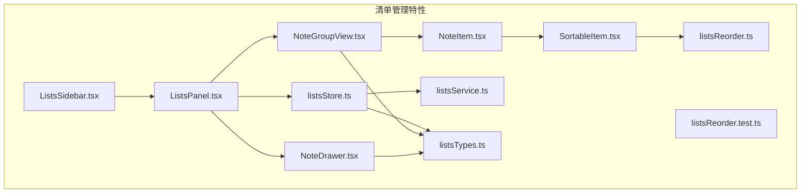
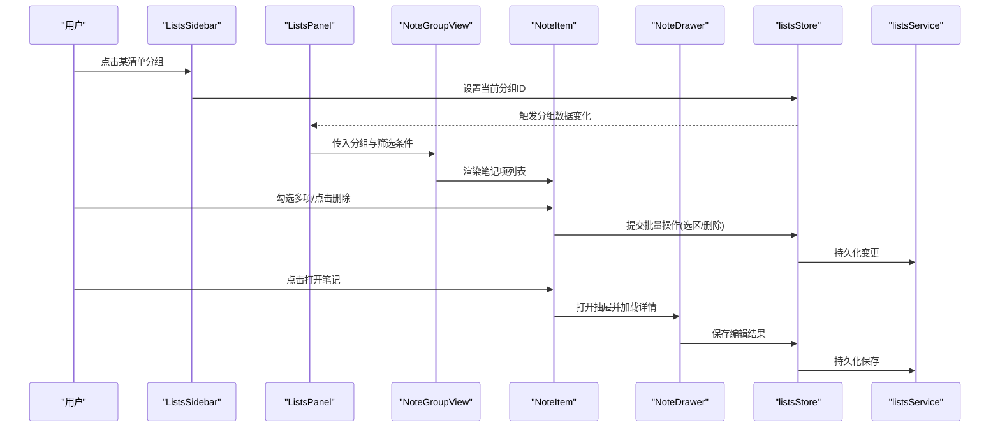
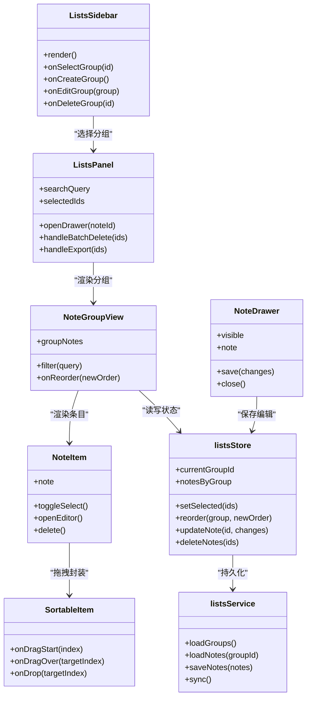
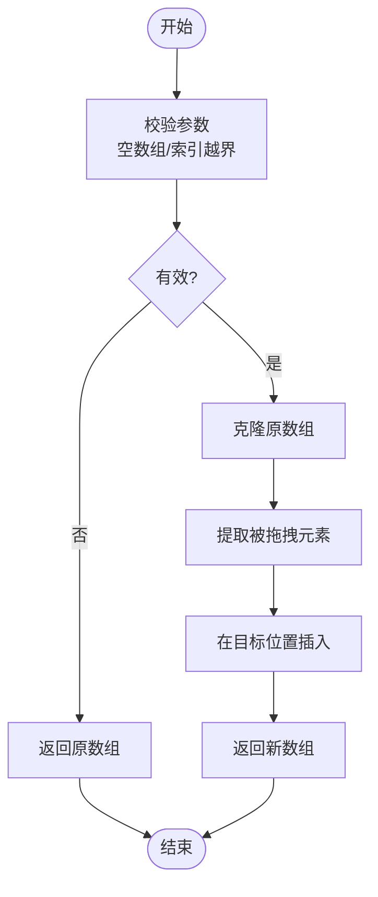
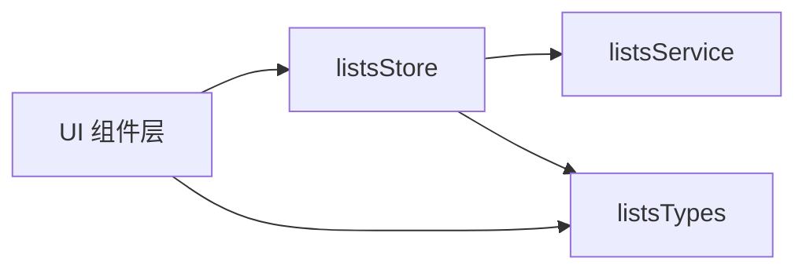

# 清单管理组件

<cite>
**本文引用的文件**   
- [ListsPanel.tsx](file://src/features/lists/ListsPanel.tsx)
- [ListsSidebar.tsx](file://src/features/lists/ListsSidebar.tsx)
- [NoteDrawer.tsx](file://src/features/lists/NoteDrawer.tsx)
- [NoteGroupView.tsx](file://src/features/lists/NoteGroupView.tsx)
- [NoteItem.tsx](file://src/features/lists/NoteItem.tsx)
- [SortableItem.tsx](file://src/features/lists/SortableItem.tsx)
- [listsReorder.ts](file://src/features/lists/listsReorder.ts)
- [listsReorder.test.ts](file://src/features/lists/listsReorder.test.ts)
- [listsStore.ts](file://src/features/lists/listsStore.ts)
- [listsService.ts](file://src/features/lists/listsService.ts)
- [listsTypes.ts](file://src/features/lists/listsTypes.ts)
</cite>

## 目录
1. [简介](#简介)
2. [项目结构](#项目结构)
3. [核心组件](#核心组件)
4. [架构总览](#架构总览)
5. [详细组件分析](#详细组件分析)
6. [依赖关系分析](#依赖关系分析)
7. [性能考虑](#性能考虑)
8. [故障排查指南](#故障排查指南)
9. [结论](#结论)
10. [附录](#附录)

## 简介
本文件面向“清单管理”功能的前端组件与交互实现，聚焦以下目标：
- 深入解析 ListsPanel、ListsSidebar、NoteDrawer、NoteGroupView、NoteItem、SortableItem 等核心组件的设计与职责边界。
- 说明拖拽排序的实现原理，包括 SortableItem 的拖拽逻辑与列表重排算法（listsReorder）。
- 解释笔记抽屉的展开收起动画与分组视图的数据组织方式。
- 描述侧边栏导航与主内容区域的联动机制。
- 总结批量操作、搜索过滤与性能优化的最佳实践。

## 项目结构
清单管理相关代码位于 features/lists 目录下，采用“按特性组织”的结构，将 UI 组件、状态存储、服务层与类型定义集中管理，便于维护与扩展。

图表来源
- [ListsSidebar.tsx](file://src/features/lists/ListsSidebar.tsx)
- [ListsPanel.tsx](file://src/features/lists/ListsPanel.tsx)
- [NoteDrawer.tsx](file://src/features/lists/NoteDrawer.tsx)
- [NoteGroupView.tsx](file://src/features/lists/NoteGroupView.tsx)
- [NoteItem.tsx](file://src/features/lists/NoteItem.tsx)
- [SortableItem.tsx](file://src/features/lists/SortableItem.tsx)
- [listsReorder.ts](file://src/features/lists/listsReorder.ts)
- [listsReorder.test.ts](file://src/features/lists/listsReorder.test.ts)
- [listsStore.ts](file://src/features/lists/listsStore.ts)
- [listsService.ts](file://src/features/lists/listsService.ts)
- [listsTypes.ts](file://src/features/lists/listsTypes.ts)

章节来源
- [ListsPanel.tsx](file://src/features/lists/ListsPanel.tsx)
- [ListsSidebar.tsx](file://src/features/lists/ListsSidebar.tsx)
- [NoteDrawer.tsx](file://src/features/lists/NoteDrawer.tsx)
- [NoteGroupView.tsx](file://src/features/lists/NoteGroupView.tsx)
- [NoteItem.tsx](file://src/features/lists/NoteItem.tsx)
- [SortableItem.tsx](file://src/features/lists/SortableItem.tsx)
- [listsReorder.ts](file://src/features/lists/listsReorder.ts)
- [listsReorder.test.ts](file://src/features/lists/listsReorder.test.ts)
- [listsStore.ts](file://src/features/lists/listsStore.ts)
- [listsService.ts](file://src/features/lists/listsService.ts)
- [listsTypes.ts](file://src/features/lists/listsTypes.ts)

## 核心组件
- ListsSidebar：侧边栏导航，负责展示清单分组/文件夹树、选中态切换、新建/编辑入口。
- ListsPanel：主内容区域容器，承载分组视图、搜索过滤、批量操作工具条、打开笔记抽屉等。
- NoteGroupView：分组视图，按分组聚合渲染笔记项，支持分组内排序与筛选。
- NoteItem：单条笔记行，包含标题预览、标签、时间戳、选择框、操作按钮等。
- SortableItem：可拖拽封装组件，提供拖拽手柄、占位符、拖拽中样式与事件透传。
- NoteDrawer：右侧抽屉面板，用于查看/编辑笔记详情，支持展开收起动画与保存流程。

章节来源
- [ListsSidebar.tsx](file://src/features/lists/ListsSidebar.tsx)
- [ListsPanel.tsx](file://src/features/lists/ListsPanel.tsx)
- [NoteGroupView.tsx](file://src/features/lists/NoteGroupView.tsx)
- [NoteItem.tsx](file://src/features/lists/NoteItem.tsx)
- [SortableItem.tsx](file://src/features/lists/SortableItem.tsx)
- [NoteDrawer.tsx](file://src/features/lists/NoteDrawer.tsx)

## 架构总览
清单管理采用“UI 组件 + Store + Service + Types”的分层模式：
- UI 层：ListsSidebar、ListsPanel、NoteGroupView、NoteItem、SortableItem、NoteDrawer。
- 状态层：listsStore 暴露响应式数据与变更方法，驱动 UI 更新。
- 服务层：listsService 封装持久化与跨模块通信（如本地存储或后端同步）。
- 类型层：listsTypes 统一数据结构与接口契约。

图表来源
- [ListsSidebar.tsx](file://src/features/lists/ListsSidebar.tsx)
- [ListsPanel.tsx](file://src/features/lists/ListsPanel.tsx)
- [NoteGroupView.tsx](file://src/features/lists/NoteGroupView.tsx)
- [NoteItem.tsx](file://src/features/lists/NoteItem.tsx)
- [NoteDrawer.tsx](file://src/features/lists/NoteDrawer.tsx)
- [listsStore.ts](file://src/features/lists/listsStore.ts)
- [listsService.ts](file://src/features/lists/listsService.ts)

## 详细组件分析

### ListsSidebar（侧边栏）
- 职责
  - 渲染分组/文件夹树形结构，支持展开/折叠。
  - 处理新增/编辑/删除分组，并与主面板联动。
  - 维护选中分组 ID，向父级或 Store 广播。
- 关键交互
  - 点击节点切换选中态，触发主面板刷新。
  - 右键菜单或工具栏按钮进行分组管理。
- 与 Store 的协作
  - 通过 listsStore 获取分组列表与当前选中项。
  - 调用 store 提供的创建/更新/删除方法完成持久化。

章节来源
- [ListsSidebar.tsx](file://src/features/lists/ListsSidebar.tsx)
- [listsStore.ts](file://src/features/lists/listsStore.ts)
- [listsTypes.ts](file://src/features/lists/listsTypes.ts)

### ListsPanel（主面板）
- 职责
  - 作为分组视图与工具条的容器。
  - 管理搜索关键词、批量选择状态、排序开关等。
  - 控制 NoteDrawer 的显示与数据绑定。
- 关键交互
  - 顶部工具条：全选/取消、批量删除、导出等。
  - 搜索输入实时过滤分组内笔记。
  - 打开/关闭抽屉，传递当前笔记上下文。
- 与子组件协作
  - 向 NoteGroupView 传入分组数据与筛选条件。
  - 向 NoteDrawer 注入当前笔记与保存回调。

章节来源
- [ListsPanel.tsx](file://src/features/lists/ListsPanel.tsx)
- [NoteGroupView.tsx](file://src/features/lists/NoteGroupView.tsx)
- [NoteDrawer.tsx](file://src/features/lists/NoteDrawer.tsx)
- [listsStore.ts](file://src/features/lists/listsStore.ts)

### NoteGroupView（分组视图）
- 职责
  - 根据分组维度聚合渲染笔记列表。
  - 提供分组内排序、筛选、分页/虚拟化的接入点。
- 数据组织
  - 以分组为键，值为该组内的笔记数组；结合搜索词进行二次过滤。
- 与排序集成
  - 使用 SortableItem 包裹每条笔记，监听拖拽结束事件，调用重排算法并写回 Store。

章节来源
- [NoteGroupView.tsx](file://src/features/lists/NoteGroupView.tsx)
- [SortableItem.tsx](file://src/features/lists/SortableItem.tsx)
- [listsReorder.ts](file://src/features/lists/listsReorder.ts)
- [listsStore.ts](file://src/features/lists/listsStore.ts)

### NoteItem（笔记项）
- 职责
  - 展示单条笔记的关键信息（标题、摘要、标签、时间等）。
  - 提供选择框、快捷操作（编辑、删除、移动等）。
- 交互
  - 多选模式下支持批量选择。
  - 点击进入编辑（打开 NoteDrawer）。
  - 长按或拖拽手柄触发排序。

章节来源
- [NoteItem.tsx](file://src/features/lists/NoteItem.tsx)
- [SortableItem.tsx](file://src/features/lists/SortableItem.tsx)
- [NoteDrawer.tsx](file://src/features/lists/NoteDrawer.tsx)

### SortableItem（可拖拽项）
- 职责
  - 封装通用拖拽能力，提供拖拽手柄、占位符、高亮与过渡效果。
  - 向上游暴露 onDragStart/onDragOver/onDrop 等事件。
- 拖拽逻辑要点
  - 记录起始索引与目标索引，计算插入位置。
  - 在拖拽过程中更新占位元素，避免布局抖动。
  - 在 drop 时触发重排算法，返回新顺序后由上层写回 Store。

章节来源
- [SortableItem.tsx](file://src/features/lists/SortableItem.tsx)
- [listsReorder.ts](file://src/features/lists/listsReorder.ts)

### NoteDrawer（笔记抽屉）
- 职责
  - 右侧滑出面板，承载笔记的查看与编辑。
  - 支持富文本/纯文本编辑器集成（由上层注入）。
- 动画与状态
  - 基于 CSS transform/opacity 或框架动画库实现展开/收起。
  - 内部维护临时编辑态，失焦或确认时再合并到持久化数据。
- 与 Store 的协作
  - 打开时从 Store 读取当前笔记快照。
  - 保存时将增量变更写入 Store，触发列表刷新。

章节来源
- [NoteDrawer.tsx](file://src/features/lists/NoteDrawer.tsx)
- [listsStore.ts](file://src/features/lists/listsStore.ts)

## 依赖关系分析
- 组件耦合
  - ListsSidebar 与 ListsPanel 通过“当前分组 ID”解耦，降低直接引用。
  - NoteGroupView 仅依赖 Store 暴露的分组数据与排序回调，不关心具体持久化细节。
  - SortableItem 是纯 UI 封装，重排算法独立于 UI，利于测试与复用。
- 外部依赖
  - listsService 屏蔽底层存储差异（本地/远程），对 UI 透明。
  - listsTypes 保证前后端/模块间数据结构一致。

图表来源
- [ListsSidebar.tsx](file://src/features/lists/ListsSidebar.tsx)
- [ListsPanel.tsx](file://src/features/lists/ListsPanel.tsx)
- [NoteGroupView.tsx](file://src/features/lists/NoteGroupView.tsx)
- [NoteItem.tsx](file://src/features/lists/NoteItem.tsx)
- [SortableItem.tsx](file://src/features/lists/SortableItem.tsx)
- [NoteDrawer.tsx](file://src/features/lists/NoteDrawer.tsx)
- [listsStore.ts](file://src/features/lists/listsStore.ts)
- [listsService.ts](file://src/features/lists/listsService.ts)

## 详细组件分析

### 拖拽排序与重排算法
- 拖拽流程
  - 在 SortableItem 中捕获拖拽开始、移动与结束事件，计算目标索引。
  - 在 NoteGroupView 中收集拖拽事件，调用重排函数生成新顺序。
  - 将新顺序写回 listsStore，触发列表重新渲染。
- 重排算法（listsReorder）
  - 输入：原数组、起始索引、目标索引。
  - 输出：新数组（保持其他元素相对顺序不变）。
  - 复杂度：O(n)，空间 O(n)。
  - 边界处理：越界索引归一化、同位置无操作、空数组快速返回。

图表来源
- [listsReorder.ts](file://src/features/lists/listsReorder.ts)
- [listsReorder.test.ts](file://src/features/lists/listsReorder.test.ts)

章节来源
- [SortableItem.tsx](file://src/features/lists/SortableItem.tsx)
- [NoteGroupView.tsx](file://src/features/lists/NoteGroupView.tsx)
- [listsReorder.ts](file://src/features/lists/listsReorder.ts)
- [listsReorder.test.ts](file://src/features/lists/listsReorder.test.ts)

### 笔记抽屉动画与编辑流
- 动画策略
  - 使用 transform: translateX 与 opacity 组合，配合 transition 实现平滑进出。
  - 抽屉遮罩层点击关闭，ESC 键关闭，提升可访问性。
- 编辑流
  - 打开时复制当前笔记快照，避免即时污染源数据。
  - 保存时合并变更，触发 Store 更新与列表刷新。
  - 未保存退出时提示用户，防止数据丢失。

章节来源
- [NoteDrawer.tsx](file://src/features/lists/NoteDrawer.tsx)
- [listsStore.ts](file://src/features/lists/listsStore.ts)

### 分组视图的数据组织
- 数据结构
  - notesByGroup：以 groupId 为键，值为该组内笔记数组。
  - currentGroupId：当前激活分组，决定渲染范围。
- 筛选与排序
  - 搜索过滤：基于标题/标签/内容的模糊匹配。
  - 分组内排序：通过拖拽重排更新对应组的数组顺序。

章节来源
- [NoteGroupView.tsx](file://src/features/lists/NoteGroupView.tsx)
- [listsStore.ts](file://src/features/lists/listsStore.ts)
- [listsTypes.ts](file://src/features/lists/listsTypes.ts)

### 侧边栏与主内容联动
- 联动机制
  - ListsSidebar 选择分组后，更新 listsStore.currentGroupId。
  - ListsPanel 监听 currentGroupId 变化，拉取对应分组数据并渲染。
- 状态一致性
  - 所有变更均通过 Store 方法执行，确保单一数据源与可预测更新。

章节来源
- [ListsSidebar.tsx](file://src/features/lists/ListsSidebar.tsx)
- [ListsPanel.tsx](file://src/features/lists/ListsPanel.tsx)
- [listsStore.ts](file://src/features/lists/listsStore.ts)

## 依赖关系分析
- 组件内聚
  - 每个组件职责清晰，UI 与业务逻辑分离，便于单元测试与重构。
- 外部耦合
  - listsService 抽象了持久化细节，UI 无需感知存储介质。
  - listsTypes 统一契约，减少类型漂移风险。

图表来源
- [listsStore.ts](file://src/features/lists/listsStore.ts)
- [listsService.ts](file://src/features/lists/listsService.ts)
- [listsTypes.ts](file://src/features/lists/listsTypes.ts)

章节来源
- [listsStore.ts](file://src/features/lists/listsStore.ts)
- [listsService.ts](file://src/features/lists/listsService.ts)
- [listsTypes.ts](file://src/features/lists/listsTypes.ts)

## 性能考虑
- 列表渲染优化
  - 大列表场景建议引入虚拟化（只渲染可视区域），显著降低 DOM 节点数量。
  - 对 NoteItem 使用 React.memo 或等效手段，避免不必要的重渲染。
- 拖拽体验
  - 拖拽过程中使用占位元素与最小化重排，避免频繁布局计算。
  - 对重排算法做边界保护，避免异常导致整表崩溃。
- 搜索过滤
  - 使用防抖/节流限制高频输入触发的过滤频率。
  - 预构建倒排索引或分词缓存，加速模糊匹配。
- 批量操作
  - 批量删除/移动时采用事务式更新，失败可回滚。
  - 分批持久化，避免单次写入过大导致卡顿。
- 动画性能
  - 优先使用 transform/opacity 等合成属性，避免触发重排。
  - 合理设置 will-change，仅在必要时启用。

[本节为通用性能建议，不直接分析具体文件]

## 故障排查指南
- 拖拽失效
  - 检查 SortableItem 的事件绑定是否被覆盖或冒泡阻止。
  - 验证目标索引计算是否正确，边界值是否归一化。
- 排序后数据错乱
  - 确认重排算法返回值是否被正确写回 Store。
  - 检查 notesByGroup 的分组键是否与当前选中分组一致。
- 抽屉无法保存
  - 核对保存回调是否触发 Store.updateNote。
  - 检查持久化服务是否抛出异常或未返回成功状态。
- 搜索无结果
  - 确认过滤逻辑是否区分大小写/全角半角。
  - 检查输入防抖是否过长导致延迟明显。

章节来源
- [SortableItem.tsx](file://src/features/lists/SortableItem.tsx)
- [listsReorder.ts](file://src/features/lists/listsReorder.ts)
- [NoteDrawer.tsx](file://src/features/lists/NoteDrawer.tsx)
- [listsStore.ts](file://src/features/lists/listsStore.ts)
- [listsService.ts](file://src/features/lists/listsService.ts)

## 结论
清单管理组件通过清晰的职责划分与分层架构，实现了稳定的分组浏览、拖拽排序、抽屉编辑与批量操作能力。SortablesItem 与 listsReorder 的组合提供了可扩展的排序方案；listsStore 与 listsService 的解耦确保了数据一致性与可移植性。建议在大数据量场景下引入虚拟化与更高效的搜索策略，进一步提升用户体验。

[本节为总结性内容，不直接分析具体文件]

## 附录
- 术语
  - 分组：同一类别下的笔记集合。
  - 抽屉：从屏幕边缘滑出的面板，常用于详情编辑。
  - 重排：在不改变元素内容的前提下调整其顺序。
- 参考路径
  - 拖拽排序算法与测试：[listsReorder.ts](file://src/features/lists/listsReorder.ts)、[listsReorder.test.ts](file://src/features/lists/listsReorder.test.ts)
  - 状态与服务：[listsStore.ts](file://src/features/lists/listsStore.ts)、[listsService.ts](file://src/features/lists/listsService.ts)
  - 类型定义：[listsTypes.ts](file://src/features/lists/listsTypes.ts)